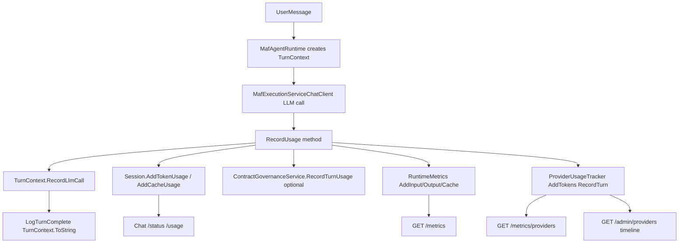

# SESSIONS.md Token 统计功能 — 代码映射与验证

## 结论摘要

[`SESSIONS.md:78-101`](c:\Users\wayye\Documents\3.tokenhub\SESSIONS.md) 描述的是 **OpenClaw 每轮 Token 记账（Per-turn Token Accounting）** 机制。在 **kingcrab** 项目中，该能力属于 **可观测性（Observability）子系统**，核心代码分布在：

| 层级 | 项目模块 | 关键路径 |
|------|----------|----------|
| 数据结构与计数器 | `OpenClaw.Core` | [`TurnContext.cs`](c:\Users\wayye\Documents\ai4c_Projects\kingcrab\src\OpenClaw.Core\Observability\TurnContext.cs)、[`RuntimeMetrics.cs`](c:\Users\wayye\Documents\ai4c_Projects\kingcrab\src\OpenClaw.Core\Observability\RuntimeMetrics.cs)、[`ProviderUsageTracker.cs`](c:\Users\wayye\Documents\ai4c_Projects\kingcrab\src\OpenClaw.Core\Observability\ProviderUsageTracker.cs)、[`Session.cs`](c:\Users\wayye\Documents\ai4c_Projects\kingcrab\src\OpenClaw.Core\Models\Session.cs) |
| 写入路径（Agent 运行时） | `OpenClaw.Agent` | [`MafAgentRuntime.cs`](c:\Users\wayye\Documents\ai4c_Projects\kingcrab\src\OpenClaw.Agent\MafAgentRuntime.cs)、[`MafExecutionServiceChatClient.cs`](c:\Users\wayye\Documents\ai4c_Projects\kingcrab\src\OpenClaw.Agent\MafExecutionServiceChatClient.cs) |
| 网关与对外暴露 | `OpenClaw.Gateway` | [`DiagnosticsEndpoints.cs`](c:\Users\wayye\Documents\ai4c_Projects\kingcrab\src\OpenClaw.Gateway\Endpoints\DiagnosticsEndpoints.cs)、[`ContractGovernanceService.cs`](c:\Users\wayye\Documents\ai4c_Projects\kingcrab\src\OpenClaw.Gateway\ContractGovernanceService.cs)、[`AdminEndpoints.Runtime.cs`](c:\Users\wayye\Documents\ai4c_Projects\kingcrab\src\OpenClaw.Gateway\Endpoints\AdminEndpoints.Runtime.cs)、[`AdminEndpoints.Sessions.cs`](c:\Users\wayye\Documents\ai4c_Projects\kingcrab\src\OpenClaw.Gateway\Endpoints\AdminEndpoints.Sessions.cs) |
| 用户侧查询 | `OpenClaw.Core` Pipeline | [`ChatCommandProcessor.cs`](c:\Users\wayye\Documents\ai4c_Projects\kingcrab\src\OpenClaw.Core\Pipeline\ChatCommandProcessor.cs)（`/status`、`/usage` 斜杠命令） |
| 架构文档 | `docs` | [`openclaw-metrics-and-telemetry.md`](c:\Users\wayye\Documents\ai4c_Projects\kingcrab\docs\openclaw-metrics-and-telemetry.md) |

**项目关系**：kingcrab 是 **OpenClaw.NET** 的本地 fork/变体（命名空间均为 `OpenClaw.*`），与上游 JS OpenClaw 概念对齐，但不是同一仓库。`TokenHub` 与 `AgentTurnAccounting` 在 kingcrab 代码中 **不存在**。

---

## 文档五步流程 vs 代码验证



### 1. 建立回合上下文 — 已验证

文档：`运行时先创建 TurnContext`

代码：[`MafAgentRuntime.RunAsync`](c:\Users\wayye\Documents\ai4c_Projects\kingcrab\src\OpenClaw.Agent\MafAgentRuntime.cs) 在每轮开始时创建 `TurnContext`，携带 `SessionId`、`ChannelId`，并生成 `CorrelationId` 用于日志关联。

[`TurnContext`](c:\Users\wayye\Documents\ai4c_Projects\kingcrab\src\OpenClaw.Core\Observability\TurnContext.cs) 记录单轮 LLM 调用次数、in/out token、工具调用统计，轮次结束时通过 `ToString()` 写入结构化日志。

### 2. 吸收 usage — 概念对齐，类名不同

文档：`AgentTurnAccounting` 在流式/非流式路径记录 usage

代码：**无 `AgentTurnAccounting` 类型**。等价职责由以下代码承担：

- **主写入点**：[`MafExecutionServiceChatClient.RecordUsage()`](c:\Users\wayye\Documents\ai4c_Projects\kingcrab\src\OpenClaw.Agent\MafExecutionServiceChatClient.cs)（流式与非流式 LLM 响应最终都会走到这里）
- **缓存字段规范化**：[`PromptCacheUsageExtractor`](c:\Users\wayye\Documents\ai4c_Projects\kingcrab\src\OpenClaw.Core\Observability\PromptCacheUsage.cs) + [`GatewayLlmExecutionService.NormalizePromptCacheUsage()`](c:\Users\wayye\Documents\ai4c_Projects\kingcrab\src\OpenClaw.Gateway\GatewayLlmExecutionService.cs)

### 3. 必要时估算回填 — 已验证

当 provider 未返回 usage 时，`RecordUsage` 使用 `LlmExecutionEstimateBuilder` 估算 input/output token，保证计数不断档（见 `MafExecutionServiceChatClient.cs` 145–152 行）。

### 4. 多路写入 — 已验证（与文档一致）

同一轮 usage 在 `RecordUsage` 中同步写入四层：

```csharp
// MafExecutionServiceChatClient.RecordUsage 核心逻辑
executionContext.TurnContext.RecordLlmCall(...);
executionContext.Session.AddTokenUsage(...);
executionContext.Session.AddCacheUsage(...);
executionContext.RecordContractTurnUsage?.Invoke(...);  // 合同模式
_metrics.AddInputTokens(...);  // RuntimeMetrics
_providerUsage.AddTokens(...);
_providerUsage.RecordTurn(...);  // ProviderUsageTracker
```

合同回调在 [`RuntimeInitializationExtensions.RuntimeFactories.cs`](c:\Users\wayye\Documents\ai4c_Projects\kingcrab\src\OpenClaw.Gateway\Composition\RuntimeInitializationExtensions.RuntimeFactories.cs) 中绑定到 `ContractGovernanceService.RecordTurnUsage`。

### 5. 外部观察面 — 大部分对齐，有一处命名差异

| 文档入口 | kingcrab 实际位置 | 验证状态 |
|----------|-------------------|----------|
| `/status` | **聊天斜杠命令**，非 HTTP GET；见 `ChatCommandProcessor` case `/status` | 功能一致，形态不同 |
| `/usage` | **聊天斜杠命令**；见 `ChatCommandProcessor` case `/usage` | 功能一致，形态不同 |
| `/metrics` | `DiagnosticsEndpoints` → `RuntimeMetrics.Snapshot()` | 已验证 |
| `/metrics/providers` | `DiagnosticsEndpoints` → `ProviderUsageTracker.Snapshot()` | 已验证 |
| `/admin/providers` | `AdminEndpoints.Runtime.cs` | 已验证 |
| `/admin/sessions/{id}/timeline` | `AdminEndpoints.Sessions.cs` | 已验证 |
| OpenAI 兼容 `usage` 字段 | LLM 响应路径经 MAF/Gateway 处理后返回；与 Session/Tracker 计数同源 | 概念对齐，需在具体 API 路由中查看 |

补充暴露面（文档未列但代码存在）：

- `GET /api/integration/status` — 集成 API 状态含 metrics 快照
- `GET /api/integration/sessions/{id}/timeline` — 集成版 timeline
- MCP 资源 `openclaw://status`、`openclaw://sessions/{id}/timeline`
- Dashboard [`Sessions.razor`](c:\Users\wayye\Documents\ai4c_Projects\kingcrab\src\OpenClaw.Dashboard\Pages\Sessions.razor)（SESSIONS.md 102 行之后有描述）

---

## 面向中级开发者的通俗讲解

可以把「每轮 Token 统计」理解成 **一次 LLM 调用后的「四本账 + 一本可选账」**：

1. **TurnContext（小本本）**：只记这一轮。像快递单号（CorrelationId），方便在日志里把同一轮的所有 LLM/工具调用串起来。
2. **Session（会话总账）**：同一个聊天窗口从开聊到现在累计用了多少 token，包括 prompt cache 读写。用户发 `/status` 或 `/usage` 看到的就是这本账。
3. **RuntimeMetrics（进程总账）**：整个 Gateway 进程 desde 启动以来的全局计数，给 `/metrics` 和运维监控用。
4. **ProviderUsageTracker（供应商分账）**：按 provider + model 汇总，还保留最近若干轮的明细，给 `/metrics/providers` 和管理员排障用。
5. **ContractGovernanceService（合同账，可选）**：如果会话挂了合同/预算，会把本轮 token 换算成 USD 成本并检查是否超预算。

**数据从哪进、从哪出？**

- **进**：用户发消息后，`MafAgentRuntime` 开一轮 → LLM 返回 usage → `RecordUsage` 一次性写四本账。
- **出**：不同 UI/接口只是「读不同账本」：`/status` 读 Session，`/metrics` 读 RuntimeMetrics，`/admin/.../timeline` 读事件流 + provider 最近轮次。

**和 SESSIONS.md 的主要差异（读文档时别踩坑）**：

- `AgentTurnAccounting` 是文档抽象名；代码里就是 `MafExecutionServiceChatClient.RecordUsage`。
- `/status`、`/usage` 是 **聊天里打的命令**，不是浏览器直接 GET 的 URL。
- kingcrab 没有 `TokenHub` 模块名；tokenhub 仓库的 SESSIONS.md 是 **跨项目的概念文档**，映射到 kingcrab 的 `OpenClaw.Core.Observability` + `OpenClaw.Agent` + `OpenClaw.Gateway`。

---

## 功能模块归属（回答「属于哪个功能模块」）

在 kingcrab 的模块划分中，这不是独立的「TokenHub 模块」，而是：

```text
OpenClaw.NET
├── OpenClaw.Core.Observability     ← 核心：TurnContext / RuntimeMetrics / ProviderUsageTracker
├── OpenClaw.Core.Models.Session    ← 会话级累计
├── OpenClaw.Agent                  ← 运行时写入（MAF 路径）
├── OpenClaw.Gateway                ← HTTP 暴露 + 合同治理 + LLM usage 规范化
├── OpenClaw.Core.Pipeline          ← 用户斜杠命令 /status /usage
└── OpenClaw.Dashboard              ← Sessions 页可视化
```

DI 注册入口：[`CoreServicesExtensions.cs`](c:\Users\wayye\Documents\ai4c_Projects\kingcrab\src\OpenClaw.Gateway\Composition\CoreServicesExtensions.cs)（`RuntimeMetrics`、`ProviderUsageTracker` 单例注册）。

权威架构说明：[`docs/openclaw-metrics-and-telemetry.md`](c:\Users\wayye\Documents\ai4c_Projects\kingcrab\docs\openclaw-metrics-and-telemetry.md) 第 7–16 行表格与第 268–282 行数据流图，与 SESSIONS.md 描述高度一致。

---

## 建议的后续验证（需你确认是否执行）

当前为 **只读分析**，未改代码、未跑测试。若你希望进一步 **运行时验证**，可在计划确认后：

1. 启动 Gateway，发起一轮对话，检查 `/metrics` 与 `/metrics/providers` 计数是否递增
2. 在聊天中发送 `/status`、`/usage`，对比 `Session.TotalInputTokens` 等字段
3. 调用 `/admin/sessions/{id}/timeline`，确认 timeline 含 provider 回合 usage

如需深入某一条路径（例如 OpenAI 兼容 API 的 `usage` 字段序列化位置），请指定入口 API，可再做定点代码追踪。
