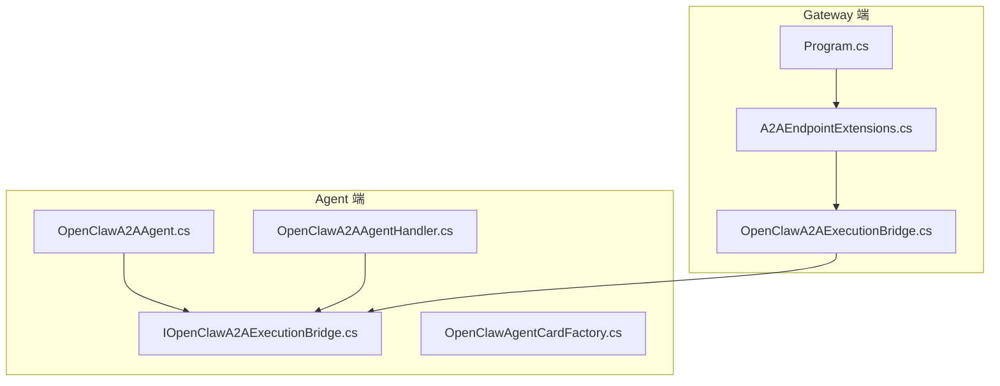
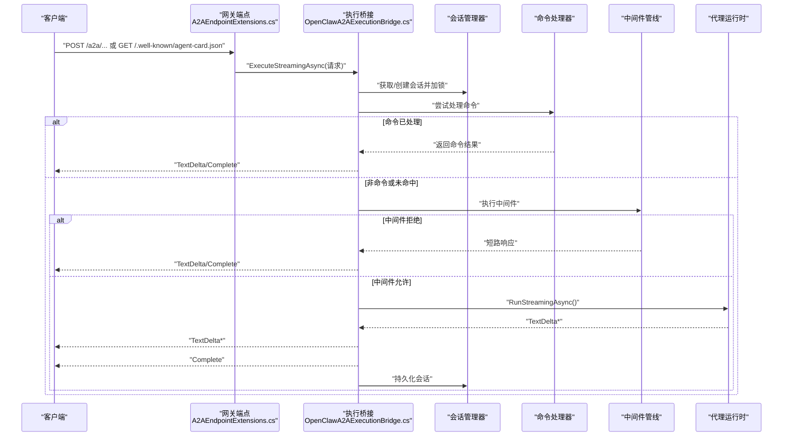
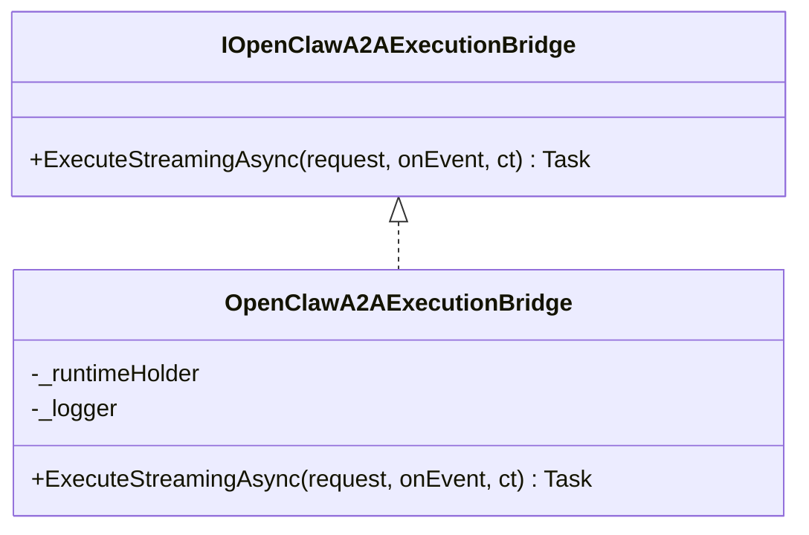
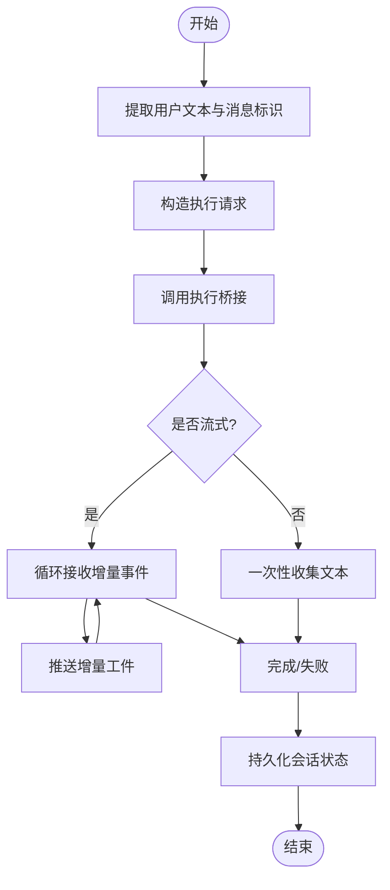
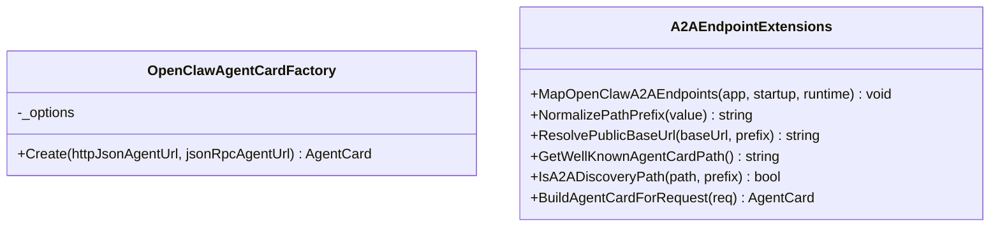
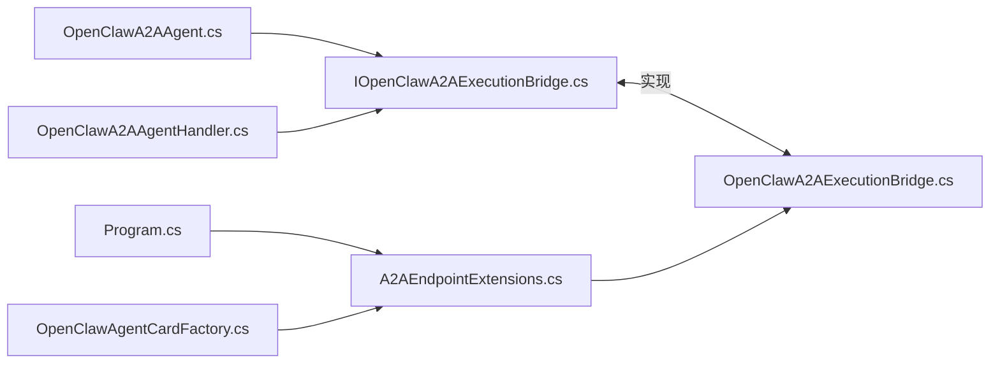

# A2A 通信

<cite>
**本文引用的文件**
- [IOpenClawA2AExecutionBridge.cs](file://src/OpenClaw.Agent/A2A/IOpenClawA2AExecutionBridge.cs)
- [OpenClawA2AAgent.cs](file://src/OpenClaw.Agent/A2A/OpenClawA2AAgent.cs)
- [OpenClawA2AAgentHandler.cs](file://src/OpenClaw.Agent/A2A/OpenClawA2AAgentHandler.cs)
- [OpenClawAgentCardFactory.cs](file://src/OpenClaw.Agent/A2A/OpenClawAgentCardFactory.cs)
- [OpenClawA2AExecutionBridge.cs](file://src/OpenClaw.Gateway/A2A/OpenClawA2AExecutionBridge.cs)
- [A2AEndpointExtensions.cs](file://src/OpenClaw.Gateway/A2A/A2AEndpointExtensions.cs)
- [Program.cs](file://src/OpenClaw.Gateway/Program.cs)
- [A2AIntegrationTests.cs](file://src/OpenClaw.Tests/A2AIntegrationTests.cs)
</cite>

## 目录
1. [简介](#简介)
2. [项目结构](#项目结构)
3. [核心组件](#核心组件)
4. [架构总览](#架构总览)
5. [详细组件分析](#详细组件分析)
6. [依赖关系分析](#依赖关系分析)
7. [性能考量](#性能考量)
8. [故障排查指南](#故障排查指南)
9. [结论](#结论)
10. [附录](#附录)

## 简介
本文件系统性阐述 OpenClaw.NET 的 A2A（应用程序间通信）协议设计与实现，覆盖以下方面：
- 设计理念：以“会话为中心”的流式代理执行桥接，统一消息路由与状态管理。
- 通信模式：HTTP JSON 与可选的 JSON-RPC 接口绑定，支持流式增量返回与非流式一次性响应。
- 应用场景：在网关侧聚合中间件、命令处理与代理运行时，向客户端提供一致的 A2A 能力。
- 端点与消息格式：标准化请求体、事件类型与响应格式；明确会话标识、发送方标识与消息标识。
- 桥接机制与服务扩展：通过执行桥接接口解耦代理与网关，便于替换与测试。
- 客户端配置与连接：基于发现路径与代理卡片规范，自动识别可用接口与能力。
- 数据交换示例：通过测试用例展示典型交互流程与断言。
- 错误处理与重试：异常捕获、错误事件与完成事件的组合使用。
- 与 OpenClaw 网关集成：端点映射、中间件管线、会话持久化与令牌统计。
- 安全传输、消息确认与状态同步：会话锁、中间件短路、令牌统计与最终持久化。

## 项目结构
A2A 相关代码分布在 Agent 与 Gateway 两端：
- Agent 端负责构建代理卡片、封装请求、接收流式事件并转换为应用可消费的消息。
- Gateway 端负责端点映射、会话管理、中间件管线、命令处理与代理运行时调用。

图表来源
- [OpenClawA2AAgent.cs:13-30](file://src/OpenClaw.Agent/A2A/OpenClawA2AAgent.cs#L13-L30)
- [OpenClawA2AAgentHandler.cs](file://src/OpenClaw.Agent/A2A/OpenClawA2AAgentHandler.cs)
- [IOpenClawA2AExecutionBridge.cs:14-20](file://src/OpenClaw.Agent/A2A/IOpenClawA2AExecutionBridge.cs#L14-L20)
- [OpenClawAgentCardFactory.cs:15-36](file://src/OpenClaw.Agent/A2A/OpenClawAgentCardFactory.cs#L15-L36)
- [OpenClawA2AExecutionBridge.cs:8-19](file://src/OpenClaw.Gateway/A2A/OpenClawA2AExecutionBridge.cs#L8-L19)
- [Program.cs:92-92](file://src/OpenClaw.Gateway/Program.cs#L92-L92)
- [A2AEndpointExtensions.cs:14-19](file://src/OpenClaw.Gateway/A2A/A2AEndpointExtensions.cs#L14-L19)

章节来源
- [OpenClawA2AAgent.cs:13-30](file://src/OpenClaw.Agent/A2A/OpenClawA2AAgent.cs#L13-L30)
- [OpenClawA2AAgentHandler.cs](file://src/OpenClaw.Agent/A2A/OpenClawA2AAgentHandler.cs)
- [IOpenClawA2AExecutionBridge.cs:14-20](file://src/OpenClaw.Agent/A2A/IOpenClawA2AExecutionBridge.cs#L14-L20)
- [OpenClawAgentCardFactory.cs:15-36](file://src/OpenClaw.Agent/A2A/OpenClawAgentCardFactory.cs#L15-L36)
- [OpenClawA2AExecutionBridge.cs:8-19](file://src/OpenClaw.Gateway/A2A/OpenClawA2AExecutionBridge.cs#L8-L19)
- [Program.cs:92-92](file://src/OpenClaw.Gateway/Program.cs#L92-L92)
- [A2AEndpointExtensions.cs:14-19](file://src/OpenClaw.Gateway/A2A/A2AEndpointExtensions.cs#L14-L19)

## 核心组件
- 执行桥接接口：定义统一的流式执行契约，屏蔽 Agent 与 Gateway 的差异。
- Agent 代理与处理器：负责从聊天消息中提取用户文本、构造请求、接收事件并生成应用消息。
- 网关执行桥接：实现会话获取/锁定、命令处理优先、中间件管线、代理运行时调用与会话持久化。
- 代理卡片工厂：根据配置生成代理卡片，声明支持的接口与能力。
- 网关端点扩展：注册 A2A 发现与代理卡片端点，提供路径规范化与解析工具。

章节来源
- [IOpenClawA2AExecutionBridge.cs:5-20](file://src/OpenClaw.Agent/A2A/IOpenClawA2AExecutionBridge.cs#L5-L20)
- [OpenClawA2AAgent.cs:13-30](file://src/OpenClaw.Agent/A2A/OpenClawA2AAgent.cs#L13-L30)
- [OpenClawA2AAgentHandler.cs](file://src/OpenClaw.Agent/A2A/OpenClawA2AAgentHandler.cs)
- [OpenClawA2AExecutionBridge.cs:8-19](file://src/OpenClaw.Gateway/A2A/OpenClawA2AExecutionBridge.cs#L8-L19)
- [OpenClawAgentCardFactory.cs:15-36](file://src/OpenClaw.Agent/A2A/OpenClawAgentCardFactory.cs#L15-L36)
- [A2AEndpointExtensions.cs:14-19](file://src/OpenClaw.Gateway/A2A/A2AEndpointExtensions.cs#L14-L19)

## 架构总览
下图展示了 A2A 的端到端交互：客户端通过 HTTP JSON 或 JSON-RPC 访问网关端点，网关经由执行桥接调用代理运行时，期间穿插中间件与命令处理，最终将增量事件回传给客户端。

图表来源
- [A2AEndpointExtensions.cs:14-19](file://src/OpenClaw.Gateway/A2A/A2AEndpointExtensions.cs#L14-L19)
- [OpenClawA2AExecutionBridge.cs:21-89](file://src/OpenClaw.Gateway/A2A/OpenClawA2AExecutionBridge.cs#L21-L89)

## 详细组件分析

### 组件一：执行桥接接口与实现
- 接口职责：定义统一的流式执行方法，入参包含会话标识、通道标识、发送方标识、用户文本与可选消息标识；回调用于接收增量文本与错误事件。
- 网关实现要点：
  - 获取/创建会话并加锁，确保并发安全。
  - 优先尝试命令处理，若处理成功则直接输出结果并完成。
  - 否则进入中间件管线，若被拒绝则输出短路响应并完成。
  - 允许后，调用代理运行时进行流式执行，异常时输出错误事件并完成，最后持久化会话。

图表来源
- [IOpenClawA2AExecutionBridge.cs:14-20](file://src/OpenClaw.Agent/A2A/IOpenClawA2AExecutionBridge.cs#L14-L20)
- [OpenClawA2AExecutionBridge.cs:8-19](file://src/OpenClaw.Gateway/A2A/OpenClawA2AExecutionBridge.cs#L8-L19)

章节来源
- [IOpenClawA2AExecutionBridge.cs:5-20](file://src/OpenClaw.Agent/A2A/IOpenClawA2AExecutionBridge.cs#L5-L20)
- [OpenClawA2AExecutionBridge.cs:21-89](file://src/OpenClaw.Gateway/A2A/OpenClawA2AExecutionBridge.cs#L21-L89)

### 组件二：Agent 代理与处理器
- 代理（AIAgent）：
  - 从聊天消息中提取用户文本与消息标识，构造执行请求。
  - 将事件流转换为应用可消费的响应更新，支持错误事件与完成事件。
  - 会话序列化/反序列化采用专用 JSON 上下文，确保兼容性。
- 处理器（IAgentHandler）：
  - 支持流式与非流式两种模式，流式模式通过任务更新器推送增量工件。
  - 提取用户文本优先级：显式参数 > 消息部件拼接 > 空字符串。
  - 在异常情况下，先推送剩余增量，再失败或完成任务。

图表来源
- [OpenClawA2AAgent.cs:100-169](file://src/OpenClaw.Agent/A2A/OpenClawA2AAgent.cs#L100-L169)
- [OpenClawA2AAgentHandler.cs:25-100](file://src/OpenClaw.Agent/A2A/OpenClawA2AAgentHandler.cs#L25-L100)

章节来源
- [OpenClawA2AAgent.cs:87-169](file://src/OpenClaw.Agent/A2A/OpenClawA2AAgent.cs#L87-L169)
- [OpenClawA2AAgentHandler.cs:25-234](file://src/OpenClaw.Agent/A2A/OpenClawA2AAgentHandler.cs#L25-L234)

### 组件三：代理卡片与客户端发现
- 代理卡片包含名称、描述、版本、支持接口（HTTP JSON 与可选 JSON-RPC）、能力（如是否启用流式）、默认输入/输出模式以及技能列表。
- 网关端点扩展提供代理卡片发现路径与解析工具，支持规范化前缀与公共基础地址解析。

图表来源
- [OpenClawAgentCardFactory.cs:6-36](file://src/OpenClaw.Agent/A2A/OpenClawAgentCardFactory.cs#L6-L36)
- [A2AEndpointExtensions.cs:14-19](file://src/OpenClaw.Gateway/A2A/A2AEndpointExtensions.cs#L14-L19)

章节来源
- [OpenClawAgentCardFactory.cs:15-91](file://src/OpenClaw.Agent/A2A/OpenClawAgentCardFactory.cs#L15-L91)
- [A2AEndpointExtensions.cs:14-19](file://src/OpenClaw.Gateway/A2A/A2AEndpointExtensions.cs#L14-L19)

### 组件四：端点映射与生命周期
- 程序入口通过映射 A2A 端点，将发现与代理卡片等路由接入应用管道。
- 端点扩展提供路径规范化、公共基础地址解析与代理卡片构建工具，确保客户端能正确发现与访问。

章节来源
- [Program.cs:92-92](file://src/OpenClaw.Gateway/Program.cs#L92-L92)
- [A2AEndpointExtensions.cs:14-19](file://src/OpenClaw.Gateway/A2A/A2AEndpointExtensions.cs#L14-L19)

## 依赖关系分析
- Agent 与 Gateway 通过共享的执行桥接接口耦合，降低实现耦合度，便于替换与测试。
- 网关内部依赖会话管理器、命令处理器、中间件管线与代理运行时，形成清晰的职责边界。
- 代理卡片工厂依赖配置选项，动态生成卡片元数据，保证客户端发现的一致性。

图表来源
- [IOpenClawA2AExecutionBridge.cs:14-20](file://src/OpenClaw.Agent/A2A/IOpenClawA2AExecutionBridge.cs#L14-L20)
- [OpenClawA2AExecutionBridge.cs:8-19](file://src/OpenClaw.Gateway/A2A/OpenClawA2AExecutionBridge.cs#L8-L19)
- [OpenClawA2AAgent.cs:18-29](file://src/OpenClaw.Agent/A2A/OpenClawA2AAgent.cs#L18-L29)
- [OpenClawA2AAgentHandler.cs:11-22](file://src/OpenClaw.Agent/A2A/OpenClawA2AAgentHandler.cs#L11-L22)
- [Program.cs:92-92](file://src/OpenClaw.Gateway/Program.cs#L92-L92)
- [A2AEndpointExtensions.cs:14-19](file://src/OpenClaw.Gateway/A2A/A2AEndpointExtensions.cs#L14-L19)
- [OpenClawAgentCardFactory.cs:15-36](file://src/OpenClaw.Agent/A2A/OpenClawAgentCardFactory.cs#L15-L36)

章节来源
- [OpenClawA2AAgent.cs:18-29](file://src/OpenClaw.Agent/A2A/OpenClawA2AAgent.cs#L18-L29)
- [OpenClawA2AAgentHandler.cs:11-22](file://src/OpenClaw.Agent/A2A/OpenClawA2AAgentHandler.cs#L11-L22)
- [OpenClawA2AExecutionBridge.cs:8-19](file://src/OpenClaw.Gateway/A2A/OpenClawA2AExecutionBridge.cs#L8-L19)
- [A2AEndpointExtensions.cs:14-19](file://src/OpenClaw.Gateway/A2A/A2AEndpointExtensions.cs#L14-L19)

## 性能考量
- 流式增量：优先使用流式事件，减少一次性大响应带来的延迟与内存压力。
- 会话锁粒度：仅在必要时持有会话锁，缩短临界区时间，提升并发吞吐。
- 中间件短路：在中间件阶段快速拒绝高风险请求，避免不必要的代理调用。
- 令牌统计：在消息上下文中携带会话输入/输出令牌统计，便于成本控制与配额管理。
- 异常早返回：在命令处理与中间件阶段尽早失败，减少无效计算。

## 故障排查指南
- 无增量文本：当桥接完成但未产生文本时，代理会注入“请求已完成”的回退文本，确保客户端收到完成信号。
- 错误事件：代理运行时异常会被转换为错误事件并输出，随后发出完成事件，保证事件语义完整性。
- 取消与超时：对取消令牌进行严格检查，确保在取消时及时释放资源并返回。
- 日志与追踪：在关键路径记录会话 ID、任务 ID 与增量计数，便于定位问题。

章节来源
- [OpenClawA2AAgent.cs:152-169](file://src/OpenClaw.Agent/A2A/OpenClawA2AAgent.cs#L152-L169)
- [OpenClawA2AAgentHandler.cs:161-180](file://src/OpenClaw.Agent/A2A/OpenClawA2AAgentHandler.cs#L161-L180)
- [OpenClawA2AExecutionBridge.cs:75-84](file://src/OpenClaw.Gateway/A2A/OpenClawA2AExecutionBridge.cs#L75-L84)

## 结论
A2A 协议通过“会话为中心”的设计与“执行桥接”解耦，实现了从客户端到代理运行时的稳定、可扩展与可观测的数据通路。其端点发现、卡片元数据与流式事件模型，使得客户端能够以最小成本接入并获得一致体验。配合中间件与命令处理，A2A 在安全性与性能之间取得良好平衡。

## 附录

### A2A 请求与事件模型
- 请求模型字段
  - 会话标识：用于跨请求保持上下文。
  - 通道标识：固定为 A2A 通道。
  - 发送方标识：用于区分不同来源或会话参与者。
  - 用户文本：来自客户端的输入。
  - 消息标识：可选，用于关联消息链路。
- 事件类型
  - 文本增量：用于流式输出。
  - 错误事件：用于报告异常。
  - 完成事件：用于标记流式输出结束。

章节来源
- [IOpenClawA2AExecutionBridge.cs:5-12](file://src/OpenClaw.Agent/A2A/IOpenClawA2AExecutionBridge.cs#L5-L12)
- [OpenClawA2AExecutionBridge.cs:49-58](file://src/OpenClaw.Gateway/A2A/OpenClawA2AExecutionBridge.cs#L49-L58)

### 客户端配置与连接建立
- 代理卡片发现：客户端访问“/.well-known/agent-card.json”，网关端点扩展负责解析与生成卡片。
- 接口绑定：HTTP JSON 必需，JSON-RPC 可选；卡片中声明协议版本与绑定信息。
- 连接建立：客户端依据卡片中的 URL 与协议绑定发起请求，网关端点映射负责路由至相应处理器。

章节来源
- [OpenClawAgentCardFactory.cs:38-61](file://src/OpenClaw.Agent/A2A/OpenClawAgentCardFactory.cs#L38-L61)
- [A2AEndpointExtensions.cs:14-19](file://src/OpenClaw.Gateway/A2A/A2AEndpointExtensions.cs#L14-L19)

### 应用程序间数据交换示例
- 流式多增量：桥接输出多个文本增量后发出完成事件。
- 无增量完成：桥接仅发出完成事件，代理注入回退文本。
- 完整测试参考：通过测试用例验证不同桥接行为下的事件序列与断言。

章节来源
- [A2AIntegrationTests.cs:588-606](file://src/OpenClaw.Tests/A2AIntegrationTests.cs#L588-L606)
- [A2AIntegrationTests.cs:608-618](file://src/OpenClaw.Tests/A2AIntegrationTests.cs#L608-L618)
- [A2AIntegrationTests.cs:619-631](file://src/OpenClaw.Tests/A2AIntegrationTests.cs#L619-L631)
- [A2AIntegrationTests.cs:632-642](file://src/OpenClaw.Tests/A2AIntegrationTests.cs#L632-L642)
- [A2AIntegrationTests.cs:643-657](file://src/OpenClaw.Tests/A2AIntegrationTests.cs#L643-L657)

### 错误处理与重试机制
- 错误事件：代理运行时异常转换为错误事件并输出，随后完成。
- 回退策略：无增量完成时注入回退文本，确保客户端收到明确结果。
- 重试建议：客户端可在网络层或应用层对可重试错误进行指数退避重试，但需避免重复提交相同请求。

章节来源
- [OpenClawA2AAgent.cs:152-169](file://src/OpenClaw.Agent/A2A/OpenClawA2AAgent.cs#L152-L169)
- [OpenClawA2AAgentHandler.cs:161-180](file://src/OpenClaw.Agent/A2A/OpenClawA2AAgentHandler.cs#L161-L180)
- [OpenClawA2AExecutionBridge.cs:75-84](file://src/OpenClaw.Gateway/A2A/OpenClawA2AExecutionBridge.cs#L75-L84)

### 与 OpenClaw 网关的集成方式
- 端点映射：在程序入口映射 A2A 端点，接入应用管道。
- 会话管理：通过会话管理器获取/创建会话并加锁，确保并发一致性。
- 中间件与命令：优先尝试命令处理，否则进入中间件管线，最终调用代理运行时。
- 状态同步：在事件完成后持久化会话，保存令牌统计与上下文。

章节来源
- [Program.cs:92-92](file://src/OpenClaw.Gateway/Program.cs#L92-L92)
- [OpenClawA2AExecutionBridge.cs:27-33](file://src/OpenClaw.Gateway/A2A/OpenClawA2AExecutionBridge.cs#L27-L33)
- [OpenClawA2AExecutionBridge.cs:35-47](file://src/OpenClaw.Gateway/A2A/OpenClawA2AExecutionBridge.cs#L35-L47)
- [OpenClawA2AExecutionBridge.cs:60-68](file://src/OpenClaw.Gateway/A2A/OpenClawA2AExecutionBridge.cs#L60-L68)
- [OpenClawA2AExecutionBridge.cs:85-89](file://src/OpenClaw.Gateway/A2A/OpenClawA2AExecutionBridge.cs#L85-L89)

### 安全传输、消息确认与状态同步
- 安全传输：建议通过 HTTPS 与受控网络访问，结合网关安全策略与中间件限制。
- 消息确认：通过完成事件与可选的错误事件实现基本确认语义。
- 状态同步：会话持久化确保状态在事件完成后落盘，避免丢失。

章节来源
- [OpenClawA2AExecutionBridge.cs:44-46](file://src/OpenClaw.Gateway/A2A/OpenClawA2AExecutionBridge.cs#L44-L46)
- [OpenClawA2AExecutionBridge.cs:65-67](file://src/OpenClaw.Gateway/A2A/OpenClawA2AExecutionBridge.cs#L65-L67)
- [OpenClawA2AExecutionBridge.cs:85-89](file://src/OpenClaw.Gateway/A2A/OpenClawA2AExecutionBridge.cs#L85-L89)