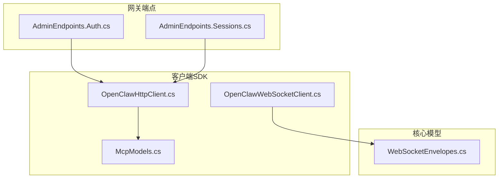
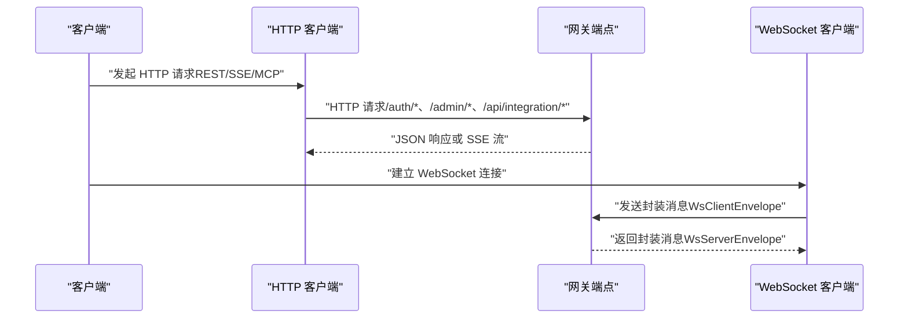
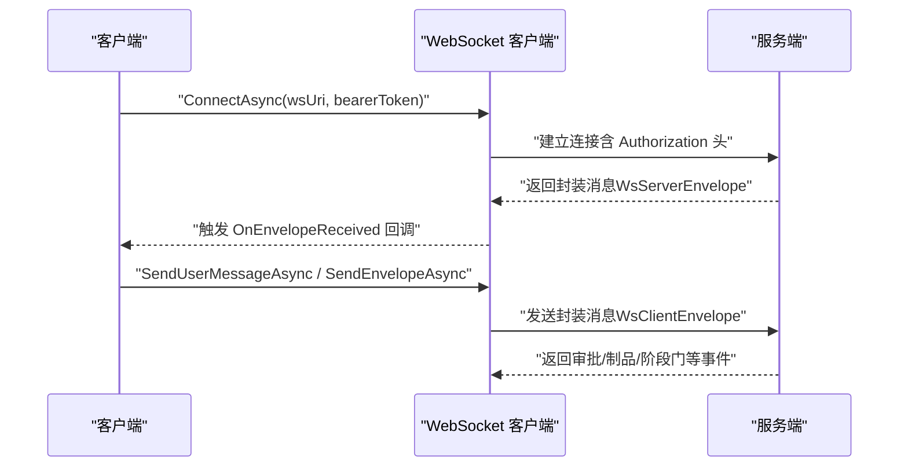
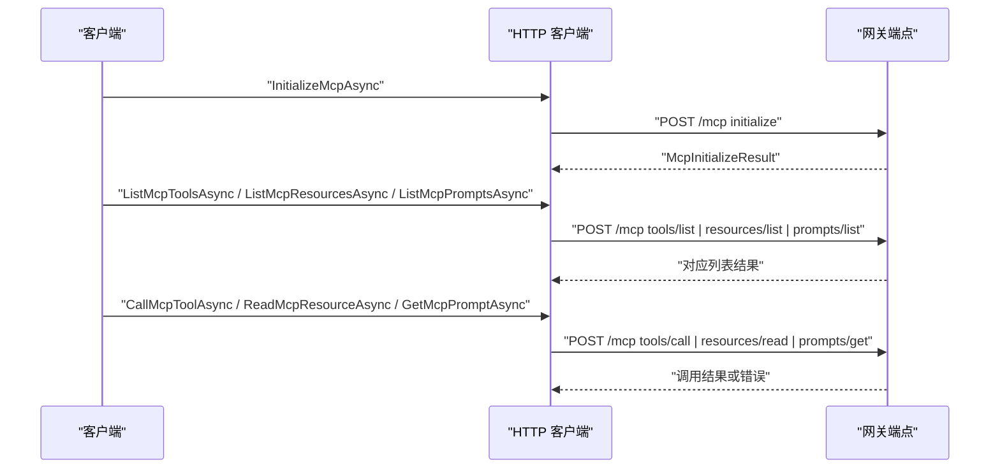
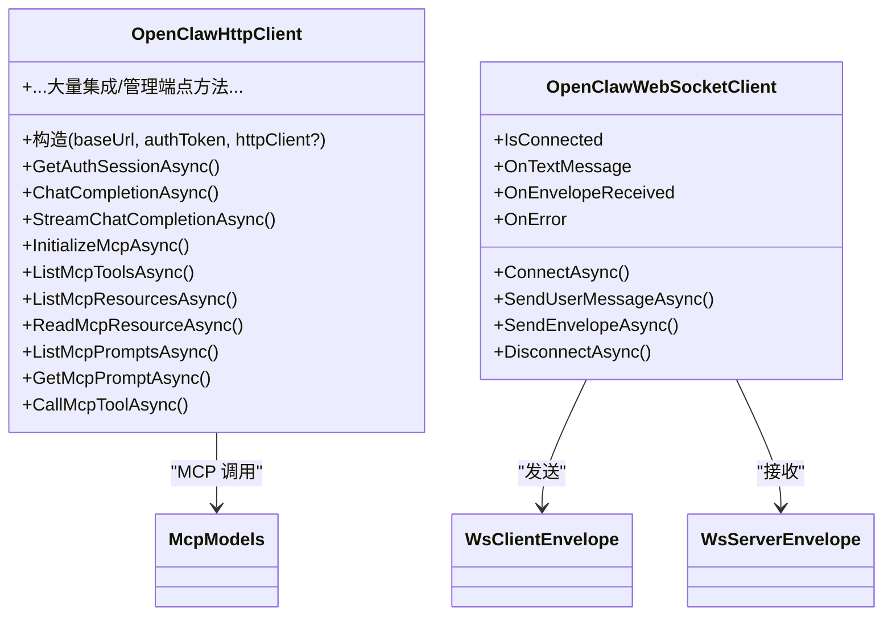
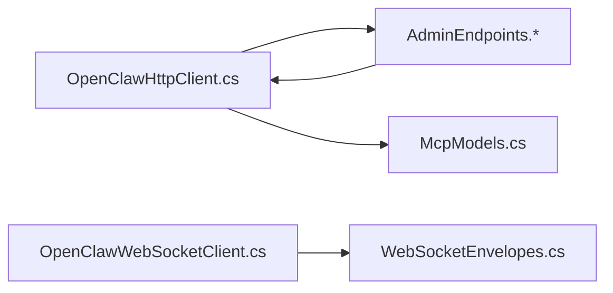

# API 参考

<cite>
**本文引用的文件**
- [AdminEndpoints.Auth.cs](file://src/OpenClaw.Gateway/Endpoints/AdminEndpoints.Auth.cs)
- [AdminEndpoints.Sessions.cs](file://src/OpenClaw.Gateway/Endpoints/AdminEndpoints.Sessions.cs)
- [OpenClawHttpClient.cs](file://src/OpenClaw.Client/OpenClawHttpClient.cs)
- [OpenClawWebSocketClient.cs](file://src/OpenClaw.Client/OpenClawWebSocketClient.cs)
- [WebSocketEnvelopes.cs](file://src/OpenClaw.Core/Models/WebSocketEnvelopes.cs)
- [McpModels.cs](file://src/OpenClaw.Client/McpModels.cs)
</cite>

## 目录
1. [简介](#简介)
2. [项目结构](#项目结构)
3. [核心组件](#核心组件)
4. [架构总览](#架构总览)
5. [详细组件分析](#详细组件分析)
6. [依赖关系分析](#依赖关系分析)
7. [性能考量](#性能考量)
8. [故障排查指南](#故障排查指南)
9. [结论](#结论)
10. [附录](#附录)

## 简介
本文件为 Kingcrab（OpenClaw）系统的 API 参考文档，覆盖以下能力与协议：
- HTTP REST API：包括认证、会话、自动化、学习提案、内存、共享 Harness 状态、心跳/脉冲、可观测性等端点。
- WebSocket API：实时消息通道、消息封装、事件类型与交互模式。
- MCP 协议：初始化、工具调用、资源读取、提示词列表与获取等。
- SDK 接口：HTTP 客户端与 WebSocket 客户端的使用方式与数据模型。

本参考以仓库中实际实现为依据，提供端点清单、请求/响应模式、认证方法、错误处理策略、速率限制与版本信息，并给出常见用例、客户端实现指南与性能优化建议。

## 项目结构
围绕 API 的关键模块分布如下：
- 网关端点（Gateway Endpoints）：集中定义 HTTP REST API 路由与处理逻辑。
- 客户端 SDK（Client）：提供 HTTP 客户端与 WebSocket 客户端，以及 MCP 数据模型。
- 核心模型（Core Models）：WebSocket 封装消息等通用数据结构。

**图表来源**
- [AdminEndpoints.Auth.cs:30-124](file://src/OpenClaw.Gateway/Endpoints/AdminEndpoints.Auth.cs#L30-L124)
- [AdminEndpoints.Sessions.cs:30-93](file://src/OpenClaw.Gateway/Endpoints/AdminEndpoints.Sessions.cs#L30-L93)
- [OpenClawHttpClient.cs:100-182](file://src/OpenClaw.Client/OpenClawHttpClient.cs#L100-L182)
- [OpenClawWebSocketClient.cs:38-57](file://src/OpenClaw.Client/OpenClawWebSocketClient.cs#L38-L57)
- [WebSocketEnvelopes.cs:7-48](file://src/OpenClaw.Core/Models/WebSocketEnvelopes.cs#L7-L48)
- [McpModels.cs:27-47](file://src/OpenClaw.Client/McpModels.cs#L27-L47)

**章节来源**
- [AdminEndpoints.Auth.cs:30-124](file://src/OpenClaw.Gateway/Endpoints/AdminEndpoints.Auth.cs#L30-L124)
- [AdminEndpoints.Sessions.cs:30-93](file://src/OpenClaw.Gateway/Endpoints/AdminEndpoints.Sessions.cs#L30-L93)
- [OpenClawHttpClient.cs:100-182](file://src/OpenClaw.Client/OpenClawHttpClient.cs#L100-L182)
- [OpenClawWebSocketClient.cs:38-57](file://src/OpenClaw.Client/OpenClawWebSocketClient.cs#L38-L57)
- [WebSocketEnvelopes.cs:7-48](file://src/OpenClaw.Core/Models/WebSocketEnvelopes.cs#L7-L48)
- [McpModels.cs:27-47](file://src/OpenClaw.Client/McpModels.cs#L27-L47)

## 核心组件
- HTTP 客户端：封装所有集成与管理端点的请求构建、SSE 流式接收、MCP RPC 调用等。
- WebSocket 客户端：建立与服务端的长连接，发送/接收封装消息，支持事件回调。
- WebSocket 封装模型：定义客户端到服务端与服务端到客户端的消息结构。
- MCP 数据模型：JSON-RPC 风格的请求/响应与能力声明，用于工具、资源、提示词交互。

**章节来源**
- [OpenClawHttpClient.cs:10-182](file://src/OpenClaw.Client/OpenClawHttpClient.cs#L10-L182)
- [OpenClawWebSocketClient.cs:9-57](file://src/OpenClaw.Client/OpenClawWebSocketClient.cs#L9-L57)
- [WebSocketEnvelopes.cs:7-108](file://src/OpenClaw.Core/Models/WebSocketEnvelopes.cs#L7-L108)
- [McpModels.cs:5-186](file://src/OpenClaw.Client/McpModels.cs#L5-L186)

## 架构总览
下图展示从客户端到网关端点的整体交互路径，涵盖 HTTP REST、SSE 与 WebSocket：

**图表来源**
- [OpenClawHttpClient.cs:184-263](file://src/OpenClaw.Client/OpenClawHttpClient.cs#L184-L263)
- [OpenClawWebSocketClient.cs:38-57](file://src/OpenClaw.Client/OpenClawWebSocketClient.cs#L38-L57)
- [WebSocketEnvelopes.cs:7-48](file://src/OpenClaw.Core/Models/WebSocketEnvelopes.cs#L7-L48)

## 详细组件分析

### HTTP REST API 规范
- 基础路径
  - 管理端点：/admin/*
  - 集成端点：/api/integration/*
  - 认证端点：/auth/*
  - MCP 端点：/mcp
- 认证与授权
  - 支持浏览器会话与账户令牌两种登录模式，受组织策略控制。
  - 管理端操作需要 CSRF 校验与最小权限范围校验。
- 关键端点概览
  - 认证
    - GET /auth/session：获取当前会话信息。
    - POST /auth/session：登录并下发会话 Cookie。
    - POST /auth/operator-token：凭凭据换取操作员令牌。
    - DELETE /auth/session：登出并清除会话。
  - 会话管理
    - GET /admin/sessions：分页列出会话，支持多维过滤。
    - GET /admin/sessions/{id}：加载指定会话详情。
    - POST /admin/sessions/{id}/promote：将会话提升为自动化/策略/技能草稿。
    - GET /admin/sessions/{id}/branches：列出分支。
    - GET /admin/sessions/{id}/export：导出会话文本。
    - POST /admin/branches/{id}/restore：恢复分支到会话。
    - GET /admin/sessions/{id}/timeline：查询运行时事件与提供商回合。
    - GET /admin/sessions/{id}/diff：比较分支差异。
    - POST /admin/sessions/{id}/metadata：更新会话元数据。
    - GET /admin/sessions/export：批量导出会话摘要与内容。
- 典型请求/响应模式
  - 所有端点均采用 JSON 传输，使用强类型上下文进行序列化/反序列化。
  - 成功与失败统一返回带 Success/Error 字段的响应对象。
- 错误处理策略
  - 未授权：返回 401。
  - 禁止访问：返回 403。
  - 资源不存在：返回 404。
  - 参数错误/业务异常：返回 400 或 500 并携带错误信息。
- 速率限制与安全
  - 系统包含速率限制中间件与令牌预算中间件，具体阈值与策略以部署配置为准。
- 版本信息
  - MCP 初始化返回的协议版本字段可用于客户端兼容性判断。

**章节来源**
- [AdminEndpoints.Auth.cs:40-124](file://src/OpenClaw.Gateway/Endpoints/AdminEndpoints.Auth.cs#L40-L124)
- [AdminEndpoints.Auth.cs:126-175](file://src/OpenClaw.Gateway/Endpoints/AdminEndpoints.Auth.cs#L126-L175)
- [AdminEndpoints.Auth.cs:177-190](file://src/OpenClaw.Gateway/Endpoints/AdminEndpoints.Auth.cs#L177-L190)
- [AdminEndpoints.Sessions.cs:40-93](file://src/OpenClaw.Gateway/Endpoints/AdminEndpoints.Sessions.cs#L40-L93)
- [AdminEndpoints.Sessions.cs:95-113](file://src/OpenClaw.Gateway/Endpoints/AdminEndpoints.Sessions.cs#L95-L113)
- [AdminEndpoints.Sessions.cs:115-259](file://src/OpenClaw.Gateway/Endpoints/AdminEndpoints.Sessions.cs#L115-L259)
- [AdminEndpoints.Sessions.cs:261-327](file://src/OpenClaw.Gateway/Endpoints/AdminEndpoints.Sessions.cs#L261-L327)
- [AdminEndpoints.Sessions.cs:328-360](file://src/OpenClaw.Gateway/Endpoints/AdminEndpoints.Sessions.cs#L328-L360)
- [AdminEndpoints.Sessions.cs:362-389](file://src/OpenClaw.Gateway/Endpoints/AdminEndpoints.Sessions.cs#L362-L389)
- [AdminEndpoints.Sessions.cs:391-434](file://src/OpenClaw.Gateway/Endpoints/AdminEndpoints.Sessions.cs#L391-L434)

### WebSocket API 规范
- 连接建立
  - 客户端通过传入 Bearer Token 设置 Authorization 头后发起连接。
  - 连接成功后启动接收循环，持续监听服务端消息。
- 消息封装
  - 客户端发送：WsClientEnvelope
  - 服务端返回：WsServerEnvelope
  - 支持多种 Type 场景（如 user_message、artifact、skill_stage_gate 等）。
- 事件类型与实时交互
  - 工具审批请求/状态：服务端通过封装消息推送审批信息，客户端可回传审批决策。
  - 艺术品交付与阶段门：终端制品完成后触发阶段门事件。
- 错误处理
  - 连接断开、消息过大、反序列化失败等场景均有明确的错误回调与异常抛出。

**图表来源**
- [OpenClawWebSocketClient.cs:38-57](file://src/OpenClaw.Client/OpenClawWebSocketClient.cs#L38-L57)
- [OpenClawWebSocketClient.cs:119-156](file://src/OpenClaw.Client/OpenClawWebSocketClient.cs#L119-L156)
- [WebSocketEnvelopes.cs:7-48](file://src/OpenClaw.Core/Models/WebSocketEnvelopes.cs#L7-L48)
- [WebSocketEnvelopes.cs:53-108](file://src/OpenClaw.Core/Models/WebSocketEnvelopes.cs#L53-L108)

**章节来源**
- [OpenClawWebSocketClient.cs:38-156](file://src/OpenClaw.Client/OpenClawWebSocketClient.cs#L38-L156)
- [OpenClawWebSocketClient.cs:158-227](file://src/OpenClaw.Client/OpenClawWebSocketClient.cs#L158-L227)
- [WebSocketEnvelopes.cs:7-108](file://src/OpenClaw.Core/Models/WebSocketEnvelopes.cs#L7-L108)

### MCP 协议规范
- 端点与方法
  - /mcp：MCP JSON-RPC 终结点，支持 initialize、tools/list、resources/list、resources/read、resources/templates/list、prompts/list、prompts/get、tools/call 等方法。
- 数据模型
  - 初始化请求/结果：包含协议版本、客户端能力、服务器信息等。
  - 工具调用：名称与参数（JsonElement），返回文本内容列表与错误标记。
  - 资源与模板：资源定义与读取结果。
  - 提示词：提示词定义与消息列表。
- 客户端调用流程
  - 先 initialize 获取服务器能力与协议版本。
  - 再按需 list tools/resources/prompts。
  - 最后 call tool 或 read resource、get prompt。

**图表来源**
- [OpenClawHttpClient.cs:262-320](file://src/OpenClaw.Client/OpenClawHttpClient.cs#L262-L320)
- [McpModels.cs:27-47](file://src/OpenClaw.Client/McpModels.cs#L27-L47)
- [McpModels.cs:78-106](file://src/OpenClaw.Client/McpModels.cs#L78-L106)
- [McpModels.cs:108-149](file://src/OpenClaw.Client/McpModels.cs#L108-L149)
- [McpModels.cs:151-186](file://src/OpenClaw.Client/McpModels.cs#L151-L186)

**章节来源**
- [OpenClawHttpClient.cs:262-320](file://src/OpenClaw.Client/OpenClawHttpClient.cs#L262-L320)
- [McpModels.cs:27-186](file://src/OpenClaw.Client/McpModels.cs#L27-L186)

### SDK 接口与使用示例
- HTTP 客户端（OpenClawHttpClient）
  - 构造：传入基础 URL 与可选 Bearer Token，默认设置 User-Agent。
  - 会话与认证：GetAuthSessionAsync、POST /auth/session、POST /auth/operator-token。
  - SSE 流：StreamChatCompletionAsync、StreamBackendEventsAsync。
  - MCP：InitializeMcpAsync、ListMcpToolsAsync、ListMcpResourcesAsync、ReadMcpResourceAsync、ListMcpPromptsAsync、GetMcpPromptAsync、CallMcpToolAsync。
  - 集成与管理：提供大量 /api/integration/* 与 /admin/* 端点的封装方法。
- WebSocket 客户端（OpenClawWebSocketClient）
  - 连接：ConnectAsync，支持传入 Bearer Token。
  - 发送：SendUserMessageAsync、SendEnvelopeAsync。
  - 事件：OnTextMessage、OnEnvelopeReceived、OnError。
  - 断开：DisconnectAsync，内部自动清理资源。

**图表来源**
- [OpenClawHttpClient.cs:91-182](file://src/OpenClaw.Client/OpenClawHttpClient.cs#L91-L182)
- [OpenClawWebSocketClient.cs:9-57](file://src/OpenClaw.Client/OpenClawWebSocketClient.cs#L9-L57)
- [WebSocketEnvelopes.cs:7-48](file://src/OpenClaw.Core/Models/WebSocketEnvelopes.cs#L7-L48)
- [McpModels.cs:27-47](file://src/OpenClaw.Client/McpModels.cs#L27-L47)

**章节来源**
- [OpenClawHttpClient.cs:91-182](file://src/OpenClaw.Client/OpenClawHttpClient.cs#L91-L182)
- [OpenClawWebSocketClient.cs:9-57](file://src/OpenClaw.Client/OpenClawWebSocketClient.cs#L9-L57)
- [WebSocketEnvelopes.cs:7-108](file://src/OpenClaw.Core/Models/WebSocketEnvelopes.cs#L7-L108)
- [McpModels.cs:27-186](file://src/OpenClaw.Client/McpModels.cs#L27-L186)

## 依赖关系分析
- 网关端点依赖于服务层与存储层（会话、自动化、策略、记忆等），并通过授权中间件与 CSRF 校验确保安全性。
- 客户端 SDK 通过统一的 URI 构建器与强类型上下文，屏蔽底层细节，便于跨平台使用。
- WebSocket 与 MCP 均基于 HTTP 客户端进行初始化与后续调用，形成统一的客户端体验。

**图表来源**
- [OpenClawHttpClient.cs:100-182](file://src/OpenClaw.Client/OpenClawHttpClient.cs#L100-L182)
- [AdminEndpoints.Auth.cs:30-124](file://src/OpenClaw.Gateway/Endpoints/AdminEndpoints.Auth.cs#L30-L124)
- [AdminEndpoints.Sessions.cs:30-93](file://src/OpenClaw.Gateway/Endpoints/AdminEndpoints.Sessions.cs#L30-L93)
- [OpenClawWebSocketClient.cs:38-57](file://src/OpenClaw.Client/OpenClawWebSocketClient.cs#L38-L57)
- [WebSocketEnvelopes.cs:7-48](file://src/OpenClaw.Core/Models/WebSocketEnvelopes.cs#L7-L48)
- [McpModels.cs:27-47](file://src/OpenClaw.Client/McpModels.cs#L27-L47)

**章节来源**
- [OpenClawHttpClient.cs:100-182](file://src/OpenClaw.Client/OpenClawHttpClient.cs#L100-L182)
- [AdminEndpoints.Auth.cs:30-124](file://src/OpenClaw.Gateway/Endpoints/AdminEndpoints.Auth.cs#L30-L124)
- [AdminEndpoints.Sessions.cs:30-93](file://src/OpenClaw.Gateway/Endpoints/AdminEndpoints.Sessions.cs#L30-L93)
- [OpenClawWebSocketClient.cs:38-57](file://src/OpenClaw.Client/OpenClawWebSocketClient.cs#L38-L57)
- [WebSocketEnvelopes.cs:7-48](file://src/OpenClaw.Core/Models/WebSocketEnvelopes.cs#L7-L48)
- [McpModels.cs:27-47](file://src/OpenClaw.Client/McpModels.cs#L27-L47)

## 性能考量
- SSE 流式响应
  - 使用 Accept: text/event-stream 降低延迟，逐行解析 data: 行，遇到 [DONE] 结束。
- WebSocket 消息大小限制
  - 客户端内置最大消息字节数限制，避免内存膨胀；超限将抛出异常。
- 并发与锁
  - WebSocket 发送使用信号量锁保证线程安全；接收循环独立任务，支持取消。
- HTTP 客户端复用
  - 建议复用 HttpClient 实例，避免频繁创建导致连接耗尽。

[本节为通用指导，不直接分析具体文件]

## 故障排查指南
- HTTP 端点
  - 未授权：检查 Bearer Token 是否正确设置；确认会话是否有效。
  - 禁止访问：检查组织策略是否允许当前认证模式；确认操作所需权限范围。
  - 资源不存在：核对 ID 是否正确；确认资源是否已被删除。
  - 参数错误：检查请求体 JSON 结构与必填字段。
- WebSocket
  - 连接失败：确认 wsUri 与 Authorization 头；检查网络与防火墙。
  - 消息过大：调整消息大小或拆分；服务端与客户端共同遵守最大字节数。
  - 异常回调：捕获 OnError 事件，记录异常消息以便定位问题。
- MCP
  - 初始化失败：确认协议版本与服务器能力匹配；检查客户端能力声明。
  - 工具调用失败：核对工具名与参数结构；查看返回的错误标记与错误信息。

**章节来源**
- [OpenClawHttpClient.cs:184-263](file://src/OpenClaw.Client/OpenClawHttpClient.cs#L184-L263)
- [OpenClawWebSocketClient.cs:135-156](file://src/OpenClaw.Client/OpenClawWebSocketClient.cs#L135-L156)
- [OpenClawWebSocketClient.cs:176-222](file://src/OpenClaw.Client/OpenClawWebSocketClient.cs#L176-L222)
- [McpModels.cs:27-47](file://src/OpenClaw.Client/McpModels.cs#L27-L47)

## 结论
本文档基于仓库中的实际实现，系统梳理了 HTTP REST API、WebSocket 实时通道、MCP 协议与 SDK 接口。通过统一的客户端封装与强类型模型，开发者可以快速集成认证、会话管理、自动化、记忆与实时交互等能力。建议在生产环境中结合速率限制与安全策略，配合日志与可观测性工具进行监控与排障。

[本节为总结性内容，不直接分析具体文件]

## 附录

### 常见用例与最佳实践
- 使用 HTTP 客户端进行会话认证与 SSE 流式对话。
- 通过 WebSocket 客户端订阅工具审批与制品交付事件。
- 在 MCP 中先初始化再枚举工具/资源/提示词，最后执行工具调用。
- 对大消息与长连接场景设置合理的超时与重试策略。

[本节为通用指导，不直接分析具体文件]

### 客户端实现指南
- 选择合适的客户端实例：若仅需 REST 与 SSE，使用 HTTP 客户端；若需实时交互，同时使用 WebSocket 客户端。
- 正确设置认证头：在 HTTP 客户端默认头或 WebSocket 连接时设置 Bearer Token。
- 处理流式数据：SSE 逐行解析，注意 [DONE] 结束条件；WebSocket 注意消息边界与大小限制。

[本节为通用指导，不直接分析具体文件]

### 调试工具与监控方法
- 日志与审计：利用操作员审计与运行时事件，定位会话与自动化行为。
- 可观测性：使用脉冲（Pulse）相关端点查询状态与事件，辅助诊断。
- 网络抓包：对 HTTP/SSE/MCP 请求进行抓包分析，核对请求头与负载。

[本节为通用指导，不直接分析具体文件]