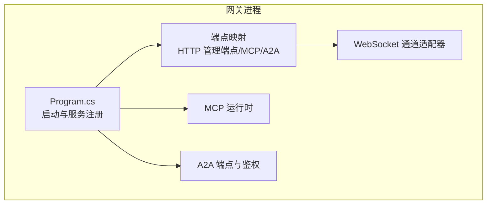
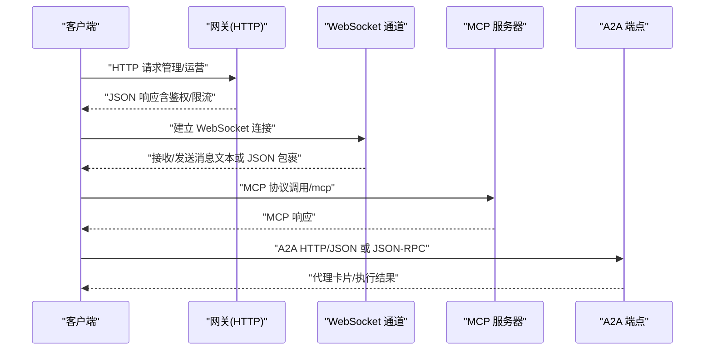
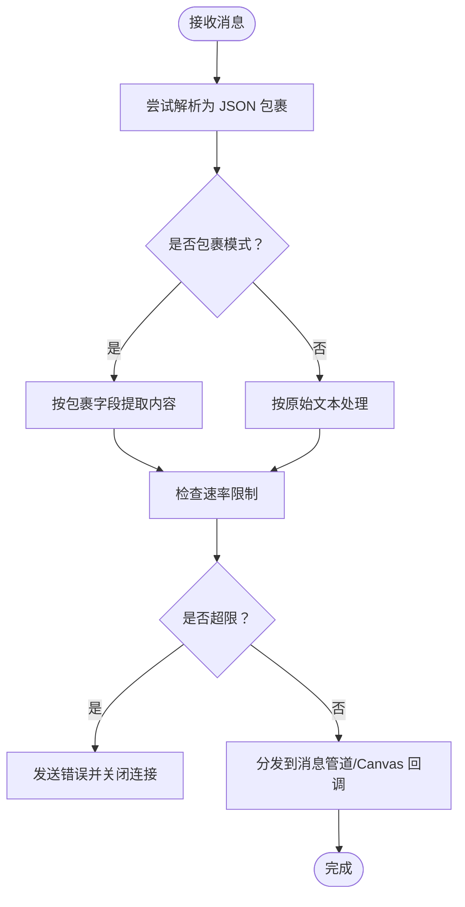
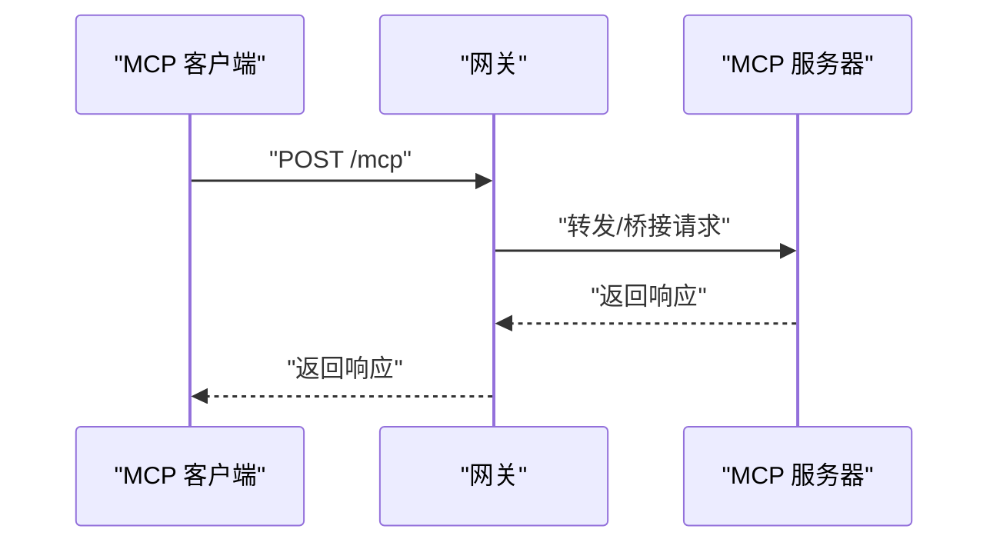
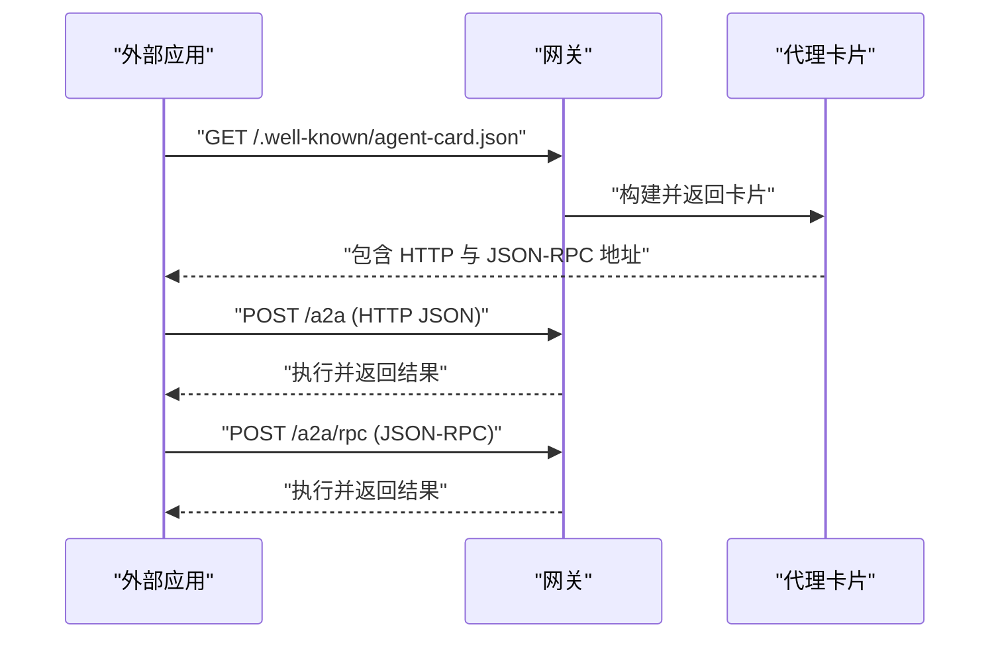
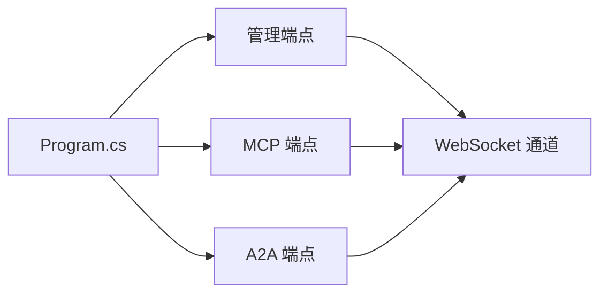

# API 参考

<cite>
**本文引用的文件**
- [Program.cs](file://src/OpenClaw.Gateway/Program.cs)
- [AdminEndpoints.Auth.cs](file://src/OpenClaw.Gateway/Endpoints/AdminEndpoints.Auth.cs)
- [AdminBackendEndpoints.cs](file://src/OpenClaw.Gateway/Endpoints/AdminBackendEndpoints.cs)
- [A2AEndpointExtensions.cs](file://src/OpenClaw.Gateway/A2A/A2AEndpointExtensions.cs)
- [WebSocketChannel.cs](file://src/OpenClaw.Channels/WebSocketChannel.cs)
- [WebSocketEnvelopes.cs](file://src/OpenClaw.Core/Models/WebSocketEnvelopes.cs)
- [McpModels.cs](file://src/OpenClaw.Client/McpModels.cs)
</cite>

## 目录
1. [简介](#简介)
2. [项目结构](#项目结构)
3. [核心组件](#核心组件)
4. [架构总览](#架构总览)
5. [详细组件分析](#详细组件分析)
6. [依赖关系分析](#依赖关系分析)
7. [性能考量](#性能考量)
8. [故障排查指南](#故障排查指南)
9. [结论](#结论)
10. [附录](#附录)

## 简介
本文件为 OpenClaw.NET 的 API 参考文档，覆盖以下协议与接口：
- HTTP 管理与运营 API：请求方法、URL 模式、请求/响应模型与鉴权要求
- WebSocket 实时通道：连接处理、消息格式、事件类型与实时交互模式
- MCP（Model Context Protocol）协议：端点映射、消息格式与集成方式
- A2A（应用程序间通信）协议：端点、发现机制、鉴权与速率限制
并提供错误处理策略、安全考虑、速率限制与版本信息，以及常见用例、客户端实现建议与性能优化技巧。

## 项目结构
OpenClaw.Gateway 作为主应用入口，负责：
- 初始化运行时与服务注册
- 映射 HTTP 管理端点与 MCP 端点
- 启用 A2A 鉴权中间件与端点映射
- 启动监听器并对外提供服务

图表来源
- [Program.cs:80-96](file://src/OpenClaw.Gateway/Program.cs#L80-L96)

章节来源
- [Program.cs:14-96](file://src/OpenClaw.Gateway/Program.cs#L14-L96)

## 核心组件
- HTTP 管理端点：提供会话管理、操作员账户、组织策略等管理能力
- WebSocket 通道：支持文本与 JSON 包裹消息，按连接路由与速率控制
- MCP：通过 /mcp 路径暴露 MCP 服务器能力
- A2A：通过 /a2a 前缀暴露 HTTP JSON 与 JSON-RPC 接口，并提供代理卡片发现

章节来源
- [AdminEndpoints.Auth.cs:30-124](file://src/OpenClaw.Gateway/Endpoints/AdminEndpoints.Auth.cs#L30-L124)
- [AdminBackendEndpoints.cs:12-117](file://src/OpenClaw.Gateway/Endpoints/AdminBackendEndpoints.cs#L12-L117)
- [WebSocketChannel.cs:16-151](file://src/OpenClaw.Channels/WebSocketChannel.cs#L16-L151)
- [A2AEndpointExtensions.cs:20-48](file://src/OpenClaw.Gateway/A2A/A2AEndpointExtensions.cs#L20-L48)

## 架构总览
下图展示从客户端到网关、再到 MCP 与 A2A 的交互路径：

图表来源
- [Program.cs:85-93](file://src/OpenClaw.Gateway/Program.cs#L85-L93)
- [WebSocketChannel.cs:76-151](file://src/OpenClaw.Channels/WebSocketChannel.cs#L76-L151)
- [A2AEndpointExtensions.cs:34-47](file://src/OpenClaw.Gateway/A2A/A2AEndpointExtensions.cs#L34-L47)

## 详细组件分析

### HTTP 管理与运营 API
- 会话管理
  - GET /auth/session：获取当前会话信息（基于浏览器会话）
  - POST /auth/session：登录创建会话（用户名/密码或账户令牌），支持“记住我”
  - DELETE /auth/session：登出并清除会话
- 操作员账户管理
  - GET /admin/operator-accounts：列出账户
  - POST /admin/operator-accounts：创建账户
  - GET /admin/operator-accounts/{id}：获取账户详情
  - PUT /admin/operator-accounts/{id}：更新账户
  - DELETE /admin/operator-accounts/{id}：删除账户
  - POST /admin/operator-accounts/{id}/tokens：创建访问令牌
  - DELETE /admin/operator-accounts/{id}/tokens/{tokenId}：撤销令牌
- 组织策略
  - GET /admin/organization-policy：获取策略快照
  - PUT /admin/organization-policy：更新策略快照
- 后端凭证解析与探测
  - POST /admin/accounts/test-resolution：测试凭据解析
  - GET /admin/backends：列出后端
  - GET /admin/backends/{id}：查询后端
  - POST /admin/backends/{id}/probe：探测后端连通性

鉴权与权限
- 所有管理端点均需通过操作员鉴权与角色授权
- 部分端点需要 CSRF 校验
- 支持操作员级速率限制与策略阻断

请求/响应模型
- 使用统一的 JSON 上下文进行序列化/反序列化
- 成功/失败响应遵循通用响应模型

章节来源
- [AdminEndpoints.Auth.cs:40-190](file://src/OpenClaw.Gateway/Endpoints/AdminEndpoints.Auth.cs#L40-L190)
- [AdminEndpoints.Auth.cs:192-396](file://src/OpenClaw.Gateway/Endpoints/AdminEndpoints.Auth.cs#L192-L396)
- [AdminBackendEndpoints.cs:22-116](file://src/OpenClaw.Gateway/Endpoints/AdminBackendEndpoints.cs#L22-L116)

### WebSocket 协议
- 连接处理
  - 支持原始文本与 JSON 包裹两种消息模式
  - 按客户端 ID 维护连接状态，支持每 IP/每连接速率限制
  - 支持最大消息大小与接收超时控制
- 消息格式
  - 客户端入站包：WsClientEnvelope
  - 服务端出站包：WsServerEnvelope
- 事件类型与实时交互
  - 用户消息、工具审批决策、Canvas/A2UI 事件与动作
  - 流式事件：仅在启用 JSON 包裹模式时支持
- 错误与关闭
  - 超出速率限制或消息过大时主动关闭连接
  - 异常断开与资源清理

图表来源
- [WebSocketChannel.cs:523-581](file://src/OpenClaw.Channels/WebSocketChannel.cs#L523-L581)
- [WebSocketChannel.cs:96-112](file://src/OpenClaw.Channels/WebSocketChannel.cs#L96-L112)

章节来源
- [WebSocketChannel.cs:16-151](file://src/OpenClaw.Channels/WebSocketChannel.cs#L16-L151)
- [WebSocketEnvelopes.cs:7-108](file://src/OpenClaw.Core/Models/WebSocketEnvelopes.cs#L7-L108)

### MCP（Model Context Protocol）协议
- 端点映射
  - /mcp：MCP 服务器端点
- 集成方式
  - 在程序入口初始化 MCP 运行时并启用 MCP 鉴权中间件
  - 与网关统一的鉴权与速率限制体系集成
- 消息格式
  - 客户端侧 MCP 模型定义位于客户端库中，用于与 MCP 服务器交互

图表来源
- [Program.cs:85-92](file://src/OpenClaw.Gateway/Program.cs#L85-L92)

章节来源
- [Program.cs:85-92](file://src/OpenClaw.Gateway/Program.cs#L85-L92)
- [McpModels.cs:1-200](file://src/OpenClaw.Client/McpModels.cs#L1-L200)

### A2A（应用程序间通信）协议
- 端点与前缀
  - 默认前缀：/a2a；可通过配置调整
  - HTTP JSON：/a2a
  - JSON-RPC：/a2a/rpc
  - 代理卡片发现：/.well-known/agent-card.json 与 /a2a/.well-known/agent-card.json
- 发现与代理卡片
  - 通过标准路径返回代理卡片，包含 HTTP 与 JSON-RPC 地址
  - 支持公共基础 URL 解析与回退策略
- 鉴权与速率限制
  - 对 /a2a 前缀下的请求启用鉴权中间件
  - 对 IP 级别进行速率限制，防止滥用
- 版本与兼容
  - 支持标准与兼容路径，便于多版本共存

图表来源
- [A2AEndpointExtensions.cs:36-47](file://src/OpenClaw.Gateway/A2A/A2AEndpointExtensions.cs#L36-L47)
- [A2AEndpointExtensions.cs:106-125](file://src/OpenClaw.Gateway/A2A/A2AEndpointExtensions.cs#L106-L125)
- [A2AEndpointExtensions.cs:61-89](file://src/OpenClaw.Gateway/A2A/A2AEndpointExtensions.cs#L61-L89)

章节来源
- [A2AEndpointExtensions.cs:20-48](file://src/OpenClaw.Gateway/A2A/A2AEndpointExtensions.cs#L20-L48)
- [A2AEndpointExtensions.cs:106-125](file://src/OpenClaw.Gateway/A2A/A2AEndpointExtensions.cs#L106-L125)
- [A2AEndpointExtensions.cs:61-89](file://src/OpenClaw.Gateway/A2A/A2AEndpointExtensions.cs#L61-L89)

## 依赖关系分析
- 网关启动流程依赖于引导与运行时初始化，随后映射各类端点与中间件
- WebSocket 通道与 MCP、A2A 共享统一的鉴权与速率限制基础设施
- 管理端点依赖浏览器会话与操作员账户服务，结合组织策略与审计日志

图表来源
- [Program.cs:80-96](file://src/OpenClaw.Gateway/Program.cs#L80-L96)

章节来源
- [Program.cs:80-96](file://src/OpenClaw.Gateway/Program.cs#L80-L96)

## 性能考量
- WebSocket
  - 每连接/每 IP 速率限制与窗口计数，避免过载
  - 最大消息大小与接收超时，防止内存压力与长时间占用
  - 发送锁与预留机制，保证并发安全与有序发送
- HTTP 管理端点
  - 操作员级速率限制与策略阻断，防止滥用
  - 统一 JSON 序列化上下文，减少反射开销
- MCP 与 A2A
  - 鉴权中间件前置校验，降低无效请求对后端的压力
  - A2A 鉴权与速率限制针对发现与业务路径分别处理

章节来源
- [WebSocketChannel.cs:41-65](file://src/OpenClaw.Channels/WebSocketChannel.cs#L41-L65)
- [WebSocketChannel.cs:334-370](file://src/OpenClaw.Channels/WebSocketChannel.cs#L334-L370)
- [A2AEndpointExtensions.cs:77-85](file://src/OpenClaw.Gateway/A2A/A2AEndpointExtensions.cs#L77-L85)

## 故障排查指南
- HTTP 管理端点
  - 401 未授权：检查浏览器会话或 CSRF 标记
  - 403 禁止：确认操作员角色是否满足端点作用域
  - 429 限流：查看策略阻断的策略 ID，调整调用频率
- WebSocket
  - 连接被拒绝：检查连接总数与每 IP 限额
  - 被关闭：速率超限或消息过大触发策略
  - 发送异常：关注 ObjectDisposedException/Socket 异常，通常表示客户端断开
- MCP
  - 无法连接：确认 /mcp 端点可达与鉴权中间件已启用
- A2A
  - 代理卡片不可见：确认发现路径与公共基础 URL 配置
  - 访问受限：检查鉴权中间件与速率限制

章节来源
- [AdminEndpoints.Auth.cs:40-190](file://src/OpenClaw.Gateway/Endpoints/AdminEndpoints.Auth.cs#L40-L190)
- [WebSocketChannel.cs:80-112](file://src/OpenClaw.Channels/WebSocketChannel.cs#L80-L112)
- [WebSocketChannel.cs:214-225](file://src/OpenClaw.Channels/WebSocketChannel.cs#L214-L225)
- [A2AEndpointExtensions.cs:61-89](file://src/OpenClaw.Gateway/A2A/A2AEndpointExtensions.cs#L61-L89)

## 结论
OpenClaw.NET 提供了完善的 HTTP 管理 API、高可用的 WebSocket 实时通道、标准化的 MCP 集成与可发现的 A2A 接口。通过统一的鉴权、速率限制与可观测性，系统在安全性与稳定性方面具备良好保障。建议在生产环境中合理配置速率限制、监控告警与日志审计，以获得最佳体验。

## 附录
- 版本与兼容
  - 代理卡片与端点路径支持标准与兼容形式，便于平滑升级
- 安全建议
  - 严格启用 CSRF 校验与操作员角色授权
  - 对敏感字段进行脱敏输出（如令牌）
  - 合理设置 WebSocket 最大消息大小与接收超时
- 常见用例
  - 管理员通过 /admin/* 管理账户与策略
  - 客户端通过 /mcp 与 MCP 服务器交互
  - 外部应用通过 /a2a 与代理卡片对接
- 客户端实现要点
  - WebSocket：优先使用 JSON 包裹模式以支持流式事件
  - A2A：先拉取代理卡片，再根据卡片中的地址发起 HTTP/JSON-RPC 调用
  - MCP：遵循客户端侧模型定义，确保消息格式一致