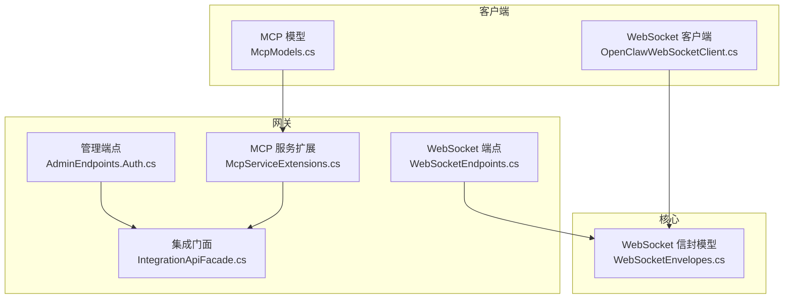
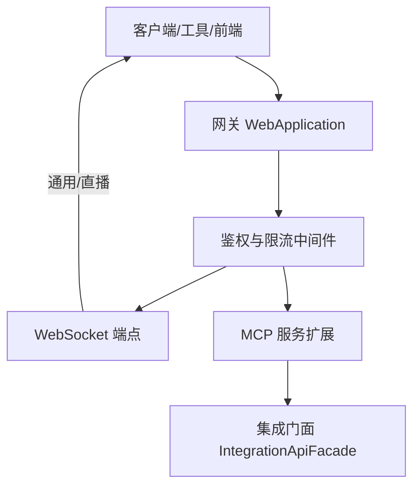
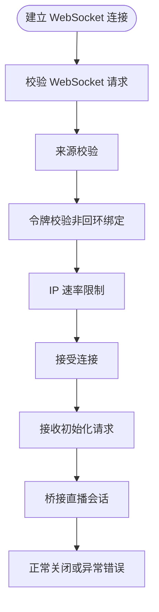
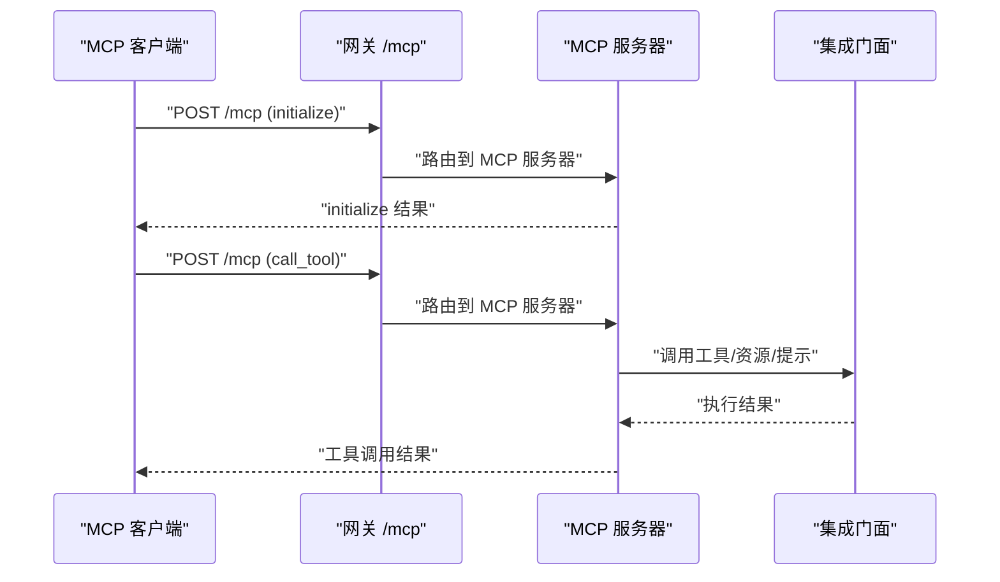
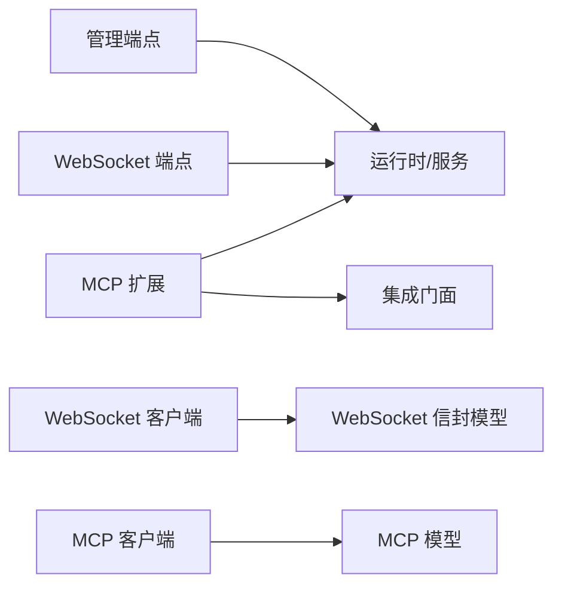

# API 参考

<cite>
**本文引用的文件**
- [AdminEndpoints.Auth.cs](file://src/OpenClaw.Gateway/Endpoints/AdminEndpoints.Auth.cs)
- [WebSocketEndpoints.cs](file://src/OpenClaw.Gateway/Endpoints/WebSocketEndpoints.cs)
- [McpServiceExtensions.cs](file://src/OpenClaw.Gateway/Mcp/McpServiceExtensions.cs)
- [McpModels.cs](file://src/OpenClaw.Client/McpModels.cs)
- [WebSocketEnvelopes.cs](file://src/OpenClaw.Core/Models/WebSocketEnvelopes.cs)
- [OpenClawWebSocketClient.cs](file://src/OpenClaw.Client/OpenClawWebSocketClient.cs)
- [AdminBackendEndpoints.cs](file://src/OpenClaw.Gateway/Endpoints/AdminBackendEndpoints.cs)
- [IntegrationApiFacade.cs](file://src/OpenClaw.Gateway/Composition/IntegrationApiFacade.cs)
</cite>

## 目录
1. [简介](#简介)
2. [项目结构](#项目结构)
3. [核心组件](#核心组件)
4. [架构总览](#架构总览)
5. [详细组件分析](#详细组件分析)
6. [依赖关系分析](#依赖关系分析)
7. [性能考虑](#性能考虑)
8. [故障排查指南](#故障排查指南)
9. [结论](#结论)
10. [附录](#附录)

## 简介
本文件为 OpenClaw.NET 的完整 API 参考，覆盖以下能力域：
- HTTP 管理 API：认证、会话、操作员账户、组织策略等
- WebSocket 协议：通用 WebSocket 连接与“直播”会话桥接
- MCP（Model Context Protocol）：HTTP 传输、工具/资源/提示注册与调用
- 插件 API：通过集成层桥接外部工具与资源

内容包含端点规范、协议消息模型、认证与授权、错误码、使用示例、客户端实现要点与性能优化建议，并提供版本控制、向后兼容性与迁移指引。

## 项目结构
围绕 API 的关键代码分布在以下模块：
- 网关端点：管理 API、WebSocket 端点、MCP 注册与鉴权中间件
- 客户端库：WebSocket 客户端、MCP 模型
- 核心模型：WebSocket 信封、MCP 请求/响应模型
- 集成门面：将运行时注入 MCP 工具/资源/提示

图表来源
- [AdminEndpoints.Auth.cs:1-399](file://src/OpenClaw.Gateway/Endpoints/AdminEndpoints.Auth.cs#L1-L399)
- [WebSocketEndpoints.cs:1-191](file://src/OpenClaw.Gateway/Endpoints/WebSocketEndpoints.cs#L1-L191)
- [McpServiceExtensions.cs:1-91](file://src/OpenClaw.Gateway/Mcp/McpServiceExtensions.cs#L1-L91)
- [IntegrationApiFacade.cs](file://src/OpenClaw.Gateway/Composition/IntegrationApiFacade.cs)
- [OpenClawWebSocketClient.cs:1-248](file://src/OpenClaw.Client/OpenClawWebSocketClient.cs#L1-L248)
- [McpModels.cs:1-187](file://src/OpenClaw.Client/McpModels.cs#L1-L187)
- [WebSocketEnvelopes.cs:1-109](file://src/OpenClaw.Core/Models/WebSocketEnvelopes.cs#L1-L109)

章节来源
- [AdminEndpoints.Auth.cs:1-399](file://src/OpenClaw.Gateway/Endpoints/AdminEndpoints.Auth.cs#L1-L399)
- [WebSocketEndpoints.cs:1-191](file://src/OpenClaw.Gateway/Endpoints/WebSocketEndpoints.cs#L1-L191)
- [McpServiceExtensions.cs:1-91](file://src/OpenClaw.Gateway/Mcp/McpServiceExtensions.cs#L1-L91)
- [IntegrationApiFacade.cs](file://src/OpenClaw.Gateway/Composition/IntegrationApiFacade.cs)
- [OpenClawWebSocketClient.cs:1-248](file://src/OpenClaw.Client/OpenClawWebSocketClient.cs#L1-L248)
- [McpModels.cs:1-187](file://src/OpenClaw.Client/McpModels.cs#L1-L187)
- [WebSocketEnvelopes.cs:1-109](file://src/OpenClaw.Core/Models/WebSocketEnvelopes.cs#L1-L109)

## 核心组件
- 管理端点（HTTP）
  - 认证与会话：浏览器会话登录/登出、操作员令牌交换
  - 操作员账户：创建、查询、更新、删除、令牌管理
  - 组织策略：查询与更新
- WebSocket 端点
  - 通用连接：/ws，支持来源校验与速率限制
  - 直播会话：/ws/live，接收初始化请求并桥接
- MCP（HTTP 传输）
  - 注册工具/资源/提示，提供服务器信息与能力声明
  - 鉴权中间件：对 /mcp 路径进行令牌校验与限流
- 客户端
  - WebSocket 客户端：连接、发送/接收、事件回调、断开
  - MCP 模型：JSON-RPC、initialize、工具调用、资源与提示模型

章节来源
- [AdminEndpoints.Auth.cs:1-399](file://src/OpenClaw.Gateway/Endpoints/AdminEndpoints.Auth.cs#L1-L399)
- [WebSocketEndpoints.cs:1-191](file://src/OpenClaw.Gateway/Endpoints/WebSocketEndpoints.cs#L1-L191)
- [McpServiceExtensions.cs:1-91](file://src/OpenClaw.Gateway/Mcp/McpServiceExtensions.cs#L1-L91)
- [OpenClawWebSocketClient.cs:1-248](file://src/OpenClaw.Client/OpenClawWebSocketClient.cs#L1-L248)
- [McpModels.cs:1-187](file://src/OpenClaw.Client/McpModels.cs#L1-L187)
- [WebSocketEnvelopes.cs:1-109](file://src/OpenClaw.Core/Models/WebSocketEnvelopes.cs#L1-L109)

## 架构总览
下图展示 HTTP、WebSocket 与 MCP 的交互关系及安全与限流控制：

图表来源
- [WebSocketEndpoints.cs:1-191](file://src/OpenClaw.Gateway/Endpoints/WebSocketEndpoints.cs#L1-L191)
- [McpServiceExtensions.cs:1-91](file://src/OpenClaw.Gateway/Mcp/McpServiceExtensions.cs#L1-L91)
- [IntegrationApiFacade.cs](file://src/OpenClaw.Gateway/Composition/IntegrationApiFacade.cs)

## 详细组件分析

### HTTP 管理 API（认证与会话）
- 端点概览
  - GET /auth/session：获取当前会话信息
  - POST /auth/session：登录（用户名/密码或账户令牌），返回会话与权限
  - DELETE /auth/session：登出会话
  - POST /auth/operator-token：凭凭据换取操作员令牌
  - 管理员账户与策略
    - GET/POST /admin/operator-accounts
    - GET/PUT /admin/operator-accounts/{id}
    - DELETE /admin/operator-accounts/{id}
    - POST /admin/operator-accounts/{id}/tokens
    - DELETE /admin/operator-accounts/{id}/tokens/{tokenId}
    - GET/PUT /admin/organization-policy

- 认证与授权
  - 支持浏览器会话与账户令牌两种模式
  - 组织策略可禁用特定认证方式
  - 管理端点按作用域与角色校验，支持 CSRF 保护
  - 速率限制基于 IP 与策略

- 错误码
  - 401 未授权（缺少/无效令牌、非回环绑定且无有效令牌）
  - 403 禁止（认证方式被策略禁用）
  - 404 未找到（资源不存在）
  - 429 请求过多（超出速率限制）

- 请求/响应要点
  - 登录请求支持用户名/密码或账户令牌
  - 会话响应包含角色、显示名、是否引导管理员、工具预设等
  - 组织策略响应包含快照与消息

章节来源
- [AdminEndpoints.Auth.cs:1-399](file://src/OpenClaw.Gateway/Endpoints/AdminEndpoints.Auth.cs#L1-L399)

### WebSocket 协议
- 端点
  - GET /ws：通用 WebSocket 连接
  - GET /ws/live：直播会话桥接，需先发送初始化请求

- 连接与鉴权
  - 必须是 WebSocket 请求
  - 来源校验：允许列表优先，否则要求同源（方案/主机/端口一致）
  - 非回环绑定时需携带有效令牌（引导令牌或操作员令牌）
  - 基于 IP 的速率限制

- 消息模型（信封）
  - 客户端信封（WsClientEnvelope）：包含类型、会话/消息标识、动作、参数、能力等
  - 服务器信封（WsServerEnvelope）：包含响应字段、工具审批请求/状态、技能工件与阶段门事件等

- 客户端实现要点
  - 连接时可设置 Authorization 头（Bearer 令牌）
  - 发送前检查最大消息大小
  - 接收循环解析文本并尝试反序列化为服务器信封
  - 断开时释放锁与资源，避免悬挂任务

- 流程图（直播会话）

图表来源
- [WebSocketEndpoints.cs:18-61](file://src/OpenClaw.Gateway/Endpoints/WebSocketEndpoints.cs#L18-L61)
- [WebSocketEndpoints.cs:63-149](file://src/OpenClaw.Gateway/Endpoints/WebSocketEndpoints.cs#L63-L149)
- [WebSocketEndpoints.cs:151-175](file://src/OpenClaw.Gateway/Endpoints/WebSocketEndpoints.cs#L151-L175)
- [WebSocketEnvelopes.cs:7-48](file://src/OpenClaw.Core/Models/WebSocketEnvelopes.cs#L7-L48)
- [WebSocketEnvelopes.cs:53-108](file://src/OpenClaw.Core/Models/WebSocketEnvelopes.cs#L53-L108)
- [OpenClawWebSocketClient.cs:38-57](file://src/OpenClaw.Client/OpenClawWebSocketClient.cs#L38-L57)
- [OpenClawWebSocketClient.cs:119-156](file://src/OpenClaw.Client/OpenClawWebSocketClient.cs#L119-L156)
- [OpenClawWebSocketClient.cs:158-227](file://src/OpenClaw.Client/OpenClawWebSocketClient.cs#L158-L227)

章节来源
- [WebSocketEndpoints.cs:1-191](file://src/OpenClaw.Gateway/Endpoints/WebSocketEndpoints.cs#L1-L191)
- [WebSocketEnvelopes.cs:1-109](file://src/OpenClaw.Core/Models/WebSocketEnvelopes.cs#L1-L109)
- [OpenClawWebSocketClient.cs:1-248](file://src/OpenClaw.Client/OpenClawWebSocketClient.cs#L1-L248)

### MCP（Model Context Protocol）
- 服务注册
  - 添加 MCP 服务器，配置服务器信息
  - 注册工具、资源、提示类型
  - 启用 HTTP 传输（无状态）

- 运行时初始化
  - 在应用构建后，将运行时注入到持有者中，供 MCP 桥接使用

- 鉴权与限流
  - 对 /mcp 路径进行统一鉴权与限流（基于 IP）

- 客户端模型
  - JSON-RPC 请求/响应
  - initialize 请求/结果（含协议版本、能力、服务器信息）
  - 工具调用、工具列表、资源与提示相关模型

- 序列图（MCP 初始化与工具调用）

图表来源
- [McpServiceExtensions.cs:20-55](file://src/OpenClaw.Gateway/Mcp/McpServiceExtensions.cs#L20-L55)
- [McpServiceExtensions.cs:61-89](file://src/OpenClaw.Gateway/Mcp/McpServiceExtensions.cs#L61-L89)
- [IntegrationApiFacade.cs](file://src/OpenClaw.Gateway/Composition/IntegrationApiFacade.cs)
- [McpModels.cs:5-25](file://src/OpenClaw.Client/McpModels.cs#L5-L25)
- [McpModels.cs:27-47](file://src/OpenClaw.Client/McpModels.cs#L27-L47)
- [McpModels.cs:78-106](file://src/OpenClaw.Client/McpModels.cs#L78-L106)
- [McpModels.cs:108-149](file://src/OpenClaw.Client/McpModels.cs#L108-L149)
- [McpModels.cs:151-186](file://src/OpenClaw.Client/McpModels.cs#L151-L186)

章节来源
- [McpServiceExtensions.cs:1-91](file://src/OpenClaw.Gateway/Mcp/McpServiceExtensions.cs#L1-L91)
- [IntegrationApiFacade.cs](file://src/OpenClaw.Gateway/Composition/IntegrationApiFacade.cs)
- [McpModels.cs:1-187](file://src/OpenClaw.Client/McpModels.cs#L1-L187)

### 插件 API（集成与后端）
- 后端凭证解析
  - 测试解析：根据提供方或后端 ID/连接账户解析凭证
  - 列表与详情：查询可用后端与指定后端信息
  - 探针：对指定后端执行探测

- 管理端点
  - POST /admin/accounts/test-resolution：测试凭证解析
  - GET /admin/backends：列出后端
  - GET /admin/backends/{id}：查询后端
  - POST /admin/backends/{id}/probe：探测后端

- 安全与限流
  - 需要管理员权限与 CSRF
  - 按端点作用域与角色校验
  - 速率限制基于策略

章节来源
- [AdminBackendEndpoints.cs:1-164](file://src/OpenClaw.Gateway/Endpoints/AdminBackendEndpoints.cs#L1-L164)

## 依赖关系分析
- 网关端点依赖
  - 管理端点依赖浏览器会话、操作员账户、组织策略、工具预设解析器、运行时与审计
  - WebSocket 端点依赖启动上下文、运行时、速率限制、来源白名单
  - MCP 服务扩展依赖运行时持有者与集成门面

- 客户端依赖
  - WebSocket 客户端依赖核心模型（信封）、系统 WebSocket
  - MCP 客户端依赖 JSON 模型与序列化上下文

图表来源
- [AdminEndpoints.Auth.cs:30-39](file://src/OpenClaw.Gateway/Endpoints/AdminEndpoints.Auth.cs#L30-L39)
- [WebSocketEndpoints.cs:13-26](file://src/OpenClaw.Gateway/Endpoints/WebSocketEndpoints.cs#L13-L26)
- [McpServiceExtensions.cs:24-30](file://src/OpenClaw.Gateway/Mcp/McpServiceExtensions.cs#L24-L30)
- [OpenClawWebSocketClient.cs:1-248](file://src/OpenClaw.Client/OpenClawWebSocketClient.cs#L1-L248)
- [McpModels.cs:1-187](file://src/OpenClaw.Client/McpModels.cs#L1-L187)
- [WebSocketEnvelopes.cs:1-109](file://src/OpenClaw.Core/Models/WebSocketEnvelopes.cs#L1-L109)

章节来源
- [AdminEndpoints.Auth.cs:1-399](file://src/OpenClaw.Gateway/Endpoints/AdminEndpoints.Auth.cs#L1-L399)
- [WebSocketEndpoints.cs:1-191](file://src/OpenClaw.Gateway/Endpoints/WebSocketEndpoints.cs#L1-L191)
- [McpServiceExtensions.cs:1-91](file://src/OpenClaw.Gateway/Mcp/McpServiceExtensions.cs#L1-L91)
- [OpenClawWebSocketClient.cs:1-248](file://src/OpenClaw.Client/OpenClawWebSocketClient.cs#L1-L248)
- [McpModels.cs:1-187](file://src/OpenClaw.Client/McpModels.cs#L1-L187)
- [WebSocketEnvelopes.cs:1-109](file://src/OpenClaw.Core/Models/WebSocketEnvelopes.cs#L1-L109)

## 性能考虑
- 速率限制
  - 管理端点与 WebSocket 基于 IP 与策略进行限流，避免滥用
  - MCP 对 /mcp 路径进行统一限流
- 连接与消息大小
  - WebSocket 客户端对入站/出站消息长度有上限检查，防止内存压力
- 序列化与缓冲
  - 使用共享缓冲池与内存写入器减少 GC 压力
- 并发控制
  - 发送路径使用信号量保证串行发送，避免竞争条件

章节来源
- [WebSocketEndpoints.cs:87-91](file://src/OpenClaw.Gateway/Endpoints/WebSocketEndpoints.cs#L87-L91)
- [AdminEndpoints.Auth.cs:139-145](file://src/OpenClaw.Gateway/Endpoints/AdminEndpoints.Auth.cs#L139-L145)
- [OpenClawWebSocketClient.cs:135-155](file://src/OpenClaw.Client/OpenClawWebSocketClient.cs#L135-L155)
- [OpenClawWebSocketClient.cs:160-181](file://src/OpenClaw.Client/OpenClawWebSocketClient.cs#L160-L181)

## 故障排查指南
- HTTP 管理 API
  - 401 未授权：确认令牌有效、来源策略、是否在非回环绑定场景下提供了有效令牌
  - 403 禁止：检查组织策略是否禁用了相应认证方式
  - 429 请求过多：降低请求频率或调整策略
- WebSocket
  - 400/403/401：检查来源校验、令牌、速率限制
  - 连接断开：确认客户端断开流程与异常处理
- MCP
  - /mcp 401：确保请求携带有效令牌并通过网关鉴权中间件
  - 工具调用失败：检查工具注册、参数与集成门面实现

章节来源
- [WebSocketEndpoints.cs:69-94](file://src/OpenClaw.Gateway/Endpoints/WebSocketEndpoints.cs#L69-L94)
- [McpServiceExtensions.cs:66-88](file://src/OpenClaw.Gateway/Mcp/McpServiceExtensions.cs#L66-L88)
- [AdminEndpoints.Auth.cs:64-74](file://src/OpenClaw.Gateway/Endpoints/AdminEndpoints.Auth.cs#L64-L74)
- [AdminEndpoints.Auth.cs:84-94](file://src/OpenClaw.Gateway/Endpoints/AdminEndpoints.Auth.cs#L84-L94)

## 结论
本文档系统梳理了 OpenClaw.NET 的 HTTP 管理 API、WebSocket 协议与 MCP 能力，并给出了客户端实现要点与性能优化建议。通过严格的鉴权与限流机制，结合清晰的消息模型与端点设计，可为上层应用提供稳定、可扩展的集成基础。

## 附录

### 版本控制、向后兼容性与迁移指南
- MCP 协议版本
  - 客户端模型声明协议版本，服务端在初始化结果中返回协议版本
  - 建议客户端在升级前检查协议版本一致性
- WebSocket 信封
  - 采用可选信封格式，纯文本客户端可继续使用
  - 新增字段（如工具审批、工件与阶段门事件）向后兼容
- 管理 API
  - 采用细粒度端点作用域与角色控制，便于逐步放开权限
  - 组织策略快照用于集中管控认证方式与行为
- 迁移建议
  - 从纯文本 WebSocket 切换到带信封格式时，先在客户端侧兼容解析
  - MCP 升级时先在测试环境验证工具/资源/提示签名与行为
  - 管理 API 变更遵循最小权限原则，逐步启用新端点

章节来源
- [McpModels.cs:44](file://src/OpenClaw.Client/McpModels.cs#L44)
- [WebSocketEnvelopes.cs:7-48](file://src/OpenClaw.Core/Models/WebSocketEnvelopes.cs#L7-L48)
- [WebSocketEnvelopes.cs:53-108](file://src/OpenClaw.Core/Models/WebSocketEnvelopes.cs#L53-L108)
- [AdminEndpoints.Auth.cs:358-396](file://src/OpenClaw.Gateway/Endpoints/AdminEndpoints.Auth.cs#L358-L396)