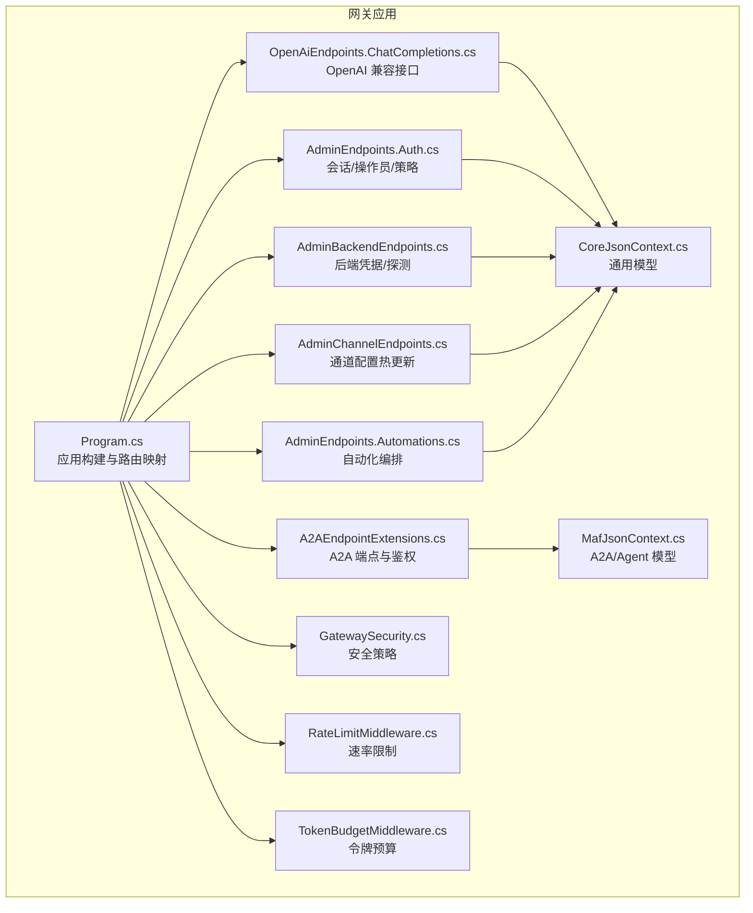
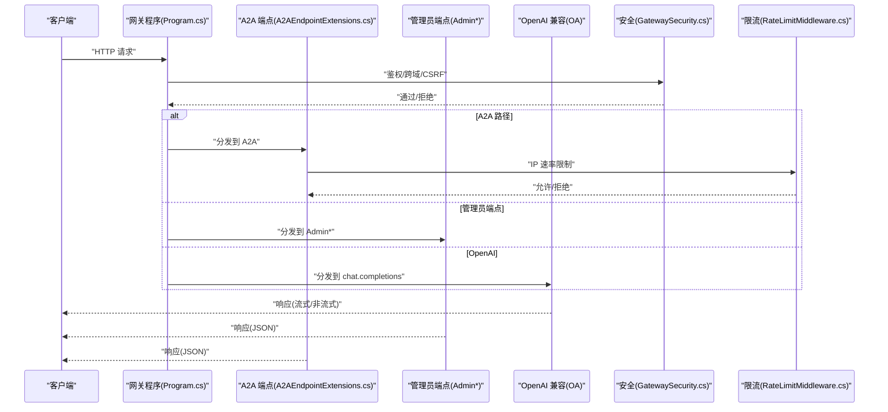
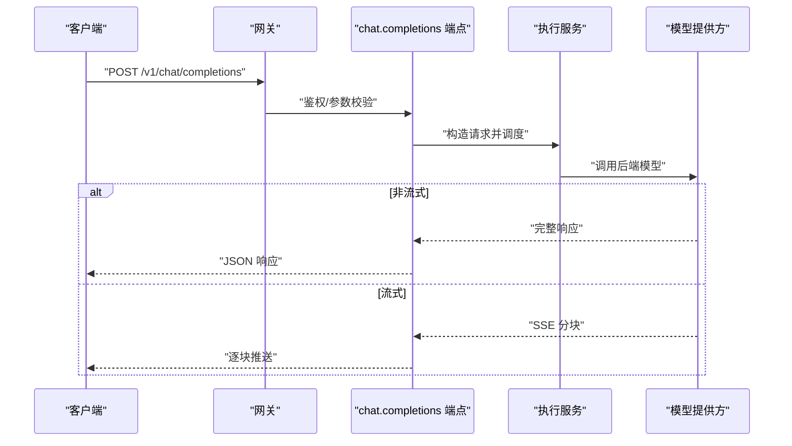
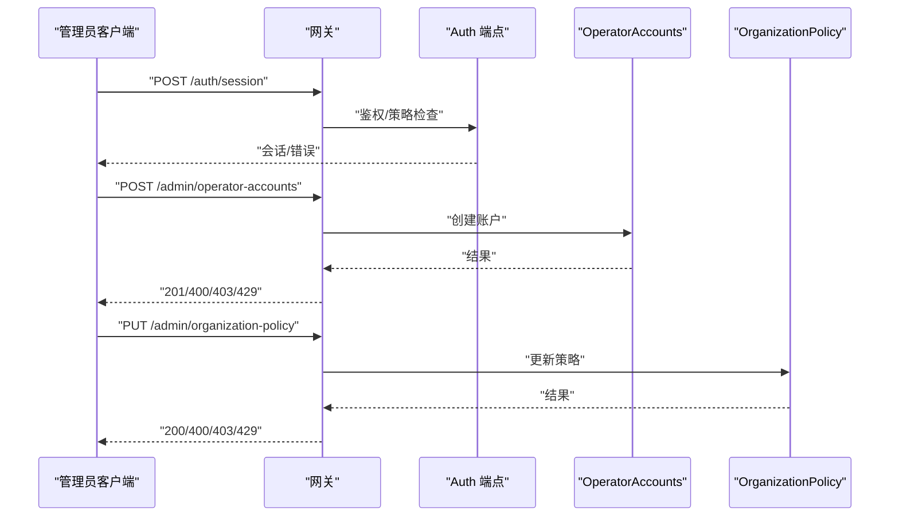
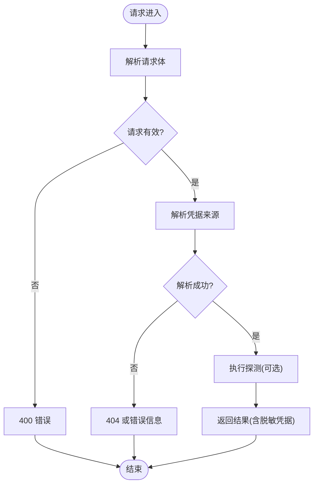
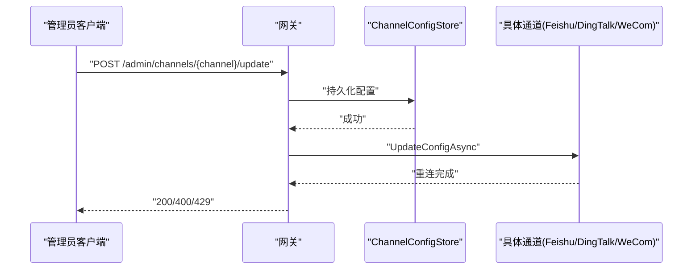
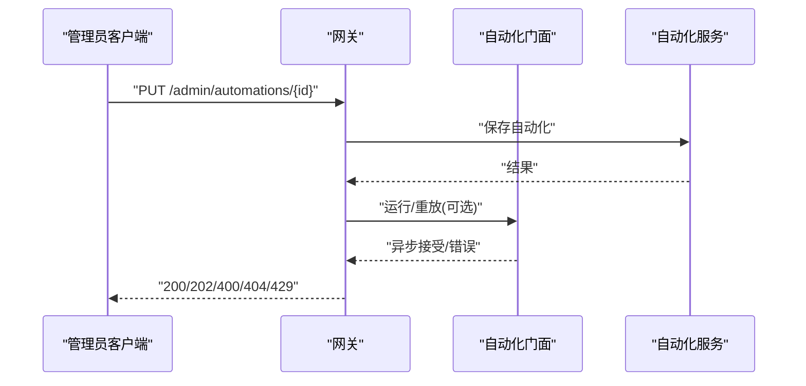
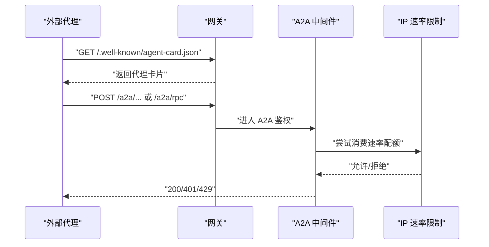
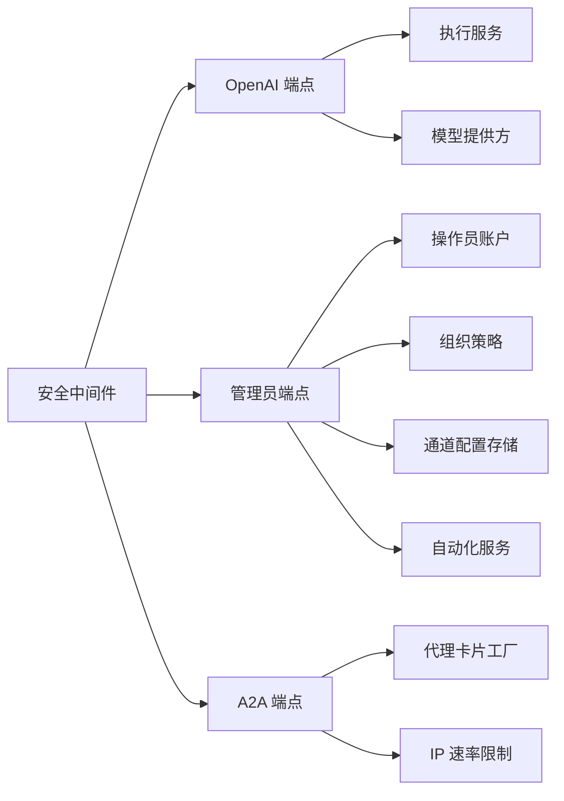

# HTTP API

<cite>
**本文引用的文件**
- [Program.cs](file://src/OpenClaw.Gateway/Program.cs)
- [A2AEndpointExtensions.cs](file://src/OpenClaw.Gateway/A2A/A2AEndpointExtensions.cs)
- [AdminEndpoints.Auth.cs](file://src/OpenClaw.Gateway/Endpoints/AdminEndpoints.Auth.cs)
- [AdminBackendEndpoints.cs](file://src/OpenClaw.Gateway/Endpoints/AdminBackendEndpoints.cs)
- [AdminChannelEndpoints.cs](file://src/OpenClaw.Gateway/Endpoints/AdminChannelEndpoints.cs)
- [AdminEndpoints.Automations.cs](file://src/OpenClaw.Gateway/Endpoints/AdminEndpoints.Automations.cs)
- [OpenAiEndpoints.ChatCompletions.cs](file://src/OpenClaw.Gateway/Endpoints/OpenAiEndpoints.ChatCompletions.cs)
- [OpenAiModels.cs](file://src/OpenClaw.Core/Models/OpenAiModels.cs)
- [OpenClawHttpClient.cs](file://src/OpenClaw.Client/OpenClawHttpClient.cs)
- [EmbeddedLocalChatClient.cs](file://src/OpenClaw.Gateway/Extensions/EmbeddedLocalChatClient.cs)
- [RateLimitMiddleware.cs](file://src/OpenClaw.Core/Middleware/RateLimitMiddleware.cs)
- [TokenBudgetMiddleware.cs](file://src/OpenClaw.Core/Middleware/TokenBudgetMiddleware.cs)
- [GatewaySecurity.cs](file://src/OpenClaw.Gateway/GatewaySecurity.cs)
- [MafOptions.cs](file://src/OpenClaw.Agent/MafOptions.cs)
- [MafJsonContext.cs](file://src/OpenClaw.Agent/MafJsonContext.cs)
- [CoreJsonContext.cs](file://src/OpenClaw.Core/Models/MafJsonContext.cs)
- [appsettings.json](file://src/OpenClaw.Gateway/appsettings.json)
</cite>

## 目录
1. [简介](#简介)
2. [项目结构](#项目结构)
3. [核心组件](#核心组件)
4. [架构总览](#架构总览)
5. [详细组件分析](#详细组件分析)
6. [依赖关系分析](#依赖关系分析)
7. [性能与限流](#性能与限流)
8. [故障排查指南](#故障排查指南)
9. [结论](#结论)
10. [附录](#附录)

## 简介
本文件为 Kingcrab/OpenClaw 网关服务的 HTTP API 文档，聚焦于以下方面：
- OpenAI 兼容接口：聊天完成（chat.completions）的请求/响应模型、流式与非流式处理、错误码与鉴权要求
- 管理员端点：会话与操作员账户管理、组织策略、通道配置热更新、后端凭据解析与探测、自动化编排
- A2A（Agent-to-Agent）端点：代理卡片发现、JSON-RPC 回退、鉴权与速率限制
- 集成与 MCP 端点：MCP 协议入口
- 安全与限流：CSRF、跨源、IP 速率限制、令牌预算
- 版本与兼容性：OpenAPI 文档生成、路径前缀与兼容策略

## 项目结构
网关通过 Program.cs 构建应用、注册中间件与服务，并映射各类端点。主要模块如下：
- 程序入口与生命周期：Program.cs
- A2A 端点与鉴权：A2AEndpointExtensions.cs
- 管理员端点：认证、后端、通道、自动化
- OpenAI 兼容端点：chat.completions
- 安全与限流：GatewaySecurity.cs、RateLimitMiddleware.cs、TokenBudgetMiddleware.cs
- 客户端与嵌入式本地客户端：OpenClawHttpClient.cs、EmbeddedLocalChatClient.cs
- 模型上下文：MafJsonContext.cs、CoreJsonContext.cs

图表来源
- [Program.cs:1-124](file://src/OpenClaw.Gateway/Program.cs#L1-L124)
- [A2AEndpointExtensions.cs:1-190](file://src/OpenClaw.Gateway/A2A/A2AEndpointExtensions.cs#L1-L190)
- [AdminEndpoints.Auth.cs:1-399](file://src/OpenClaw.Gateway/Endpoints/AdminEndpoints.Auth.cs#L1-L399)
- [AdminBackendEndpoints.cs:1-164](file://src/OpenClaw.Gateway/Endpoints/AdminBackendEndpoints.cs#L1-L164)
- [AdminChannelEndpoints.cs:1-313](file://src/OpenClaw.Gateway/Endpoints/AdminChannelEndpoints.cs#L1-L313)
- [AdminEndpoints.Automations.cs:1-292](file://src/OpenClaw.Gateway/Endpoints/AdminEndpoints.Automations.cs#L1-L292)
- [OpenAiEndpoints.ChatCompletions.cs:1-200](file://src/OpenClaw.Gateway/Endpoints/OpenAiEndpoints.ChatCompletions.cs#L1-L200)
- [MafJsonContext.cs:1-200](file://src/OpenClaw.Agent/MafJsonContext.cs#L1-L200)
- [CoreJsonContext.cs:1-200](file://src/OpenClaw.Core/Models/MafJsonContext.cs#L1-L200)

章节来源
- [Program.cs:1-124](file://src/OpenClaw.Gateway/Program.cs#L1-L124)

## 核心组件
- 应用入口与路由映射：Program.cs 负责构建 WebApplication、初始化运行时、注册中间件、映射 OpenAPI、MCP、A2A 与各业务端点
- A2A 端点：提供 HTTP JSON 接口与 JSON-RPC 回退，支持代理卡片发现与鉴权
- 管理员端点：覆盖会话登录/登出、操作员账户增删改查、组织策略查询/更新、后端凭据解析与探测、通道配置热更新、自动化编排
- OpenAI 兼容接口：chat.completions 支持流式与非流式响应，遵循 OpenAI 请求/响应模型
- 安全与限流：跨域/CSRF、IP 速率限制、令牌预算；A2A 与 MCP 各自独立鉴权链路

章节来源
- [Program.cs:80-96](file://src/OpenClaw.Gateway/Program.cs#L80-L96)
- [A2AEndpointExtensions.cs:20-48](file://src/OpenClaw.Gateway/A2A/A2AEndpointExtensions.cs#L20-L48)
- [AdminEndpoints.Auth.cs:40-124](file://src/OpenClaw.Gateway/Endpoints/AdminEndpoints.Auth.cs#L40-L124)
- [AdminBackendEndpoints.cs:22-116](file://src/OpenClaw.Gateway/Endpoints/AdminBackendEndpoints.cs#L22-L116)
- [AdminChannelEndpoints.cs:36-136](file://src/OpenClaw.Gateway/Endpoints/AdminChannelEndpoints.cs#L36-L136)
- [AdminEndpoints.Automations.cs:39-290](file://src/OpenClaw.Gateway/Endpoints/AdminEndpoints.Automations.cs#L39-L290)
- [OpenAiEndpoints.ChatCompletions.cs:16-200](file://src/OpenClaw.Gateway/Endpoints/OpenAiEndpoints.ChatCompletions.cs#L16-L200)

## 架构总览
下图展示了从客户端到服务端的关键交互路径，以及安全与限流层：

图表来源
- [Program.cs:80-96](file://src/OpenClaw.Gateway/Program.cs#L80-L96)
- [A2AEndpointExtensions.cs:61-89](file://src/OpenClaw.Gateway/A2A/A2AEndpointExtensions.cs#L61-L89)
- [AdminEndpoints.Auth.cs:30-399](file://src/OpenClaw.Gateway/Endpoints/AdminEndpoints.Auth.cs#L30-L399)
- [OpenAiEndpoints.ChatCompletions.cs:16-200](file://src/OpenClaw.Gateway/Endpoints/OpenAiEndpoints.ChatCompletions.cs#L16-L200)
- [GatewaySecurity.cs:1-200](file://src/OpenClaw.Gateway/GatewaySecurity.cs#L1-L200)
- [RateLimitMiddleware.cs:1-200](file://src/OpenClaw.Core/Middleware/RateLimitMiddleware.cs#L1-L200)

## 详细组件分析

### OpenAI 兼容接口：聊天完成（/v1/chat/completions）
- HTTP 方法与路径
  - POST /v1/chat/completions
- 认证方式
  - 通过网关统一鉴权中间件进行 CSRF/跨域校验与会话校验
- 请求体
  - 参考 OpenAI 兼容模型定义，包含消息数组、模型标识、温度、最大令牌数、是否流式等字段
- 响应
  - 非流式：完整响应对象
  - 流式：SSE 分块，逐条推送
- 错误处理
  - 参数无效、鉴权失败、模型不可用、内部异常等返回相应状态码与错误信息
- 代码示例路径
  - 客户端调用示例：[OpenClawHttpClient.cs:100](file://src/OpenClaw.Client/OpenClawHttpClient.cs#L100)
  - 嵌入式本地客户端示例：[EmbeddedLocalChatClient.cs:168](file://src/OpenClaw.Gateway/Extensions/EmbeddedLocalChatClient.cs#L168)
  - 端点实现：[OpenAiEndpoints.ChatCompletions.cs:16](file://src/OpenClaw.Gateway/Endpoints/OpenAiEndpoints.ChatCompletions.cs#L16)
  - 模型定义：[OpenAiModels.cs:19](file://src/OpenClaw.Core/Models/OpenAiModels.cs#L19), [OpenAiModels.cs:185](file://src/OpenClaw.Core/Models/OpenAiModels.cs#L185), [OpenAiModels.cs:224](file://src/OpenClaw.Core/Models/OpenAiModels.cs#L224)

图表来源
- [OpenAiEndpoints.ChatCompletions.cs:16-200](file://src/OpenClaw.Gateway/Endpoints/OpenAiEndpoints.ChatCompletions.cs#L16-L200)
- [OpenAiModels.cs:19-224](file://src/OpenClaw.Core/Models/OpenAiModels.cs#L19-L224)
- [OpenClawHttpClient.cs:100](file://src/OpenClaw.Client/OpenClawHttpClient.cs#L100)
- [EmbeddedLocalChatClient.cs:168](file://src/OpenClaw.Gateway/Extensions/EmbeddedLocalChatClient.cs#L168)

章节来源
- [OpenAiEndpoints.ChatCompletions.cs:16-200](file://src/OpenClaw.Gateway/Endpoints/OpenAiEndpoints.ChatCompletions.cs#L16-L200)
- [OpenAiModels.cs:19-224](file://src/OpenClaw.Core/Models/OpenAiModels.cs#L19-L224)
- [OpenClawHttpClient.cs:100](file://src/OpenClaw.Client/OpenClawHttpClient.cs#L100)
- [EmbeddedLocalChatClient.cs:168](file://src/OpenClaw.Gateway/Extensions/EmbeddedLocalChatClient.cs#L168)

### 管理员端点：会话与操作员账户
- 会话管理
  - GET /auth/session：获取当前会话信息
  - POST /auth/session：登录（支持用户名密码或浏览器会话）
  - DELETE /auth/session：登出会话
- 操作员账户
  - GET /admin/operator-accounts：列出账户
  - POST /admin/operator-accounts：创建账户
  - GET /admin/operator-accounts/{id}：获取详情
  - PUT /admin/operator-accounts/{id}：更新账户
  - DELETE /admin/operator-accounts/{id}：删除账户
  - POST /admin/operator-accounts/{id}/tokens：创建访问令牌
  - DELETE /admin/operator-accounts/{id}/tokens/{tokenId}：撤销令牌
- 组织策略
  - GET /admin/organization-policy：获取策略
  - PUT /admin/organization-policy：更新策略
- 认证与授权
  - 所有管理员端点均需通过会话鉴权与角色检查，部分写操作需要 CSRF 校验
  - 写操作受操作员速率限制策略控制
- 错误处理
  - 未授权、权限不足、速率超限、资源不存在、请求体无效等返回相应状态码

图表来源
- [AdminEndpoints.Auth.cs:40-124](file://src/OpenClaw.Gateway/Endpoints/AdminEndpoints.Auth.cs#L40-L124)
- [AdminEndpoints.Auth.cs:191-396](file://src/OpenClaw.Gateway/Endpoints/AdminEndpoints.Auth.cs#L191-L396)

章节来源
- [AdminEndpoints.Auth.cs:40-396](file://src/OpenClaw.Gateway/Endpoints/AdminEndpoints.Auth.cs#L40-L396)

### 管理员端点：后端凭据解析与探测
- 路由
  - POST /admin/accounts/test-resolution：测试凭据解析
  - GET /admin/backends：列出后端
  - GET /admin/backends/{id}：获取后端详情
  - POST /admin/backends/{id}/probe：探测后端连通性
- 行为
  - 解析凭据来源（提供方/后端 ID/连接账户），返回脱敏后的凭据信息
  - 支持对指定后端执行探测请求，返回探测结果
- 错误处理
  - JSON 解析失败、提供方缺失、探测异常等返回相应状态码

图表来源
- [AdminBackendEndpoints.cs:22-116](file://src/OpenClaw.Gateway/Endpoints/AdminBackendEndpoints.cs#L22-L116)

章节来源
- [AdminBackendEndpoints.cs:22-116](file://src/OpenClaw.Gateway/Endpoints/AdminBackendEndpoints.cs#L22-L116)

### 管理员端点：通道配置热更新
- 路由
  - GET /admin/channels/{channel}：获取当前生效配置
  - POST /admin/channels/{channel}/update：应用内存覆盖并重连
  - DELETE /admin/channels/{channel}/override：清除覆盖，回退到 appsettings
- 支持通道
  - feishu、dingtalk、wecom（按需扩展）
- 行为
  - 更新先持久化到卷存储，再应用到运行时并触发重连
  - 清除覆盖后通道恢复默认配置
- 错误处理
  - 未知通道、JSON 无效、速率超限等返回相应状态码

图表来源
- [AdminChannelEndpoints.cs:61-136](file://src/OpenClaw.Gateway/Endpoints/AdminChannelEndpoints.cs#L61-L136)

章节来源
- [AdminChannelEndpoints.cs:36-136](file://src/OpenClaw.Gateway/Endpoints/AdminChannelEndpoints.cs#L36-L136)

### 管理员端点：自动化编排
- 路由
  - GET /admin/automations：列出自动化
  - GET /admin/automations/templates：列出模板
  - POST /admin/automations/migrate：迁移旧自动化
  - POST /admin/automations/preview：预览自动化
  - GET /admin/automations/{id}：获取自动化详情
  - GET /admin/automations/{id}/runs：获取运行记录列表
  - GET /admin/automations/{id}/runs/{runId}：获取单次运行详情
  - PUT /admin/automations/{id}：保存自动化
  - POST /admin/automations/{id}/run：触发运行
  - POST /admin/automations/{id}/runs/{runId}/replay：重放运行
  - POST /admin/automations/{id}/quarantine/clear：清空隔离
  - DELETE /admin/automations/{id}：删除自动化
- 行为
  - 支持定时、一次性运行、重试策略、运行状态跟踪
  - 运行结果以事件形式记录到运行时事件系统
- 错误处理
  - 资源不存在、运行失败、速率超限等返回相应状态码

图表来源
- [AdminEndpoints.Automations.cs:39-290](file://src/OpenClaw.Gateway/Endpoints/AdminEndpoints.Automations.cs#L39-L290)

章节来源
- [AdminEndpoints.Automations.cs:39-290](file://src/OpenClaw.Gateway/Endpoints/AdminEndpoints.Automations.cs#L39-L290)

### A2A（Agent-to-Agent）端点
- 路由
  - HTTP JSON：/a2a（可配置前缀）
  - JSON-RPC：/a2a/rpc
  - 代理卡片发现：/.well-known/agent-card.json 与兼容路径
- 鉴权与速率限制
  - 仅对 /a2a 前缀启用鉴权与 IP 速率限制
  - 发现路径（代理卡片）除外
- 配置
  - 路径前缀、公共基地址、代理名称等通过 MafOptions 控制
- 错误处理
  - 未授权返回 401，超限返回 429

图表来源
- [A2AEndpointExtensions.cs:34-48](file://src/OpenClaw.Gateway/A2A/A2AEndpointExtensions.cs#L34-L48)
- [A2AEndpointExtensions.cs:61-89](file://src/OpenClaw.Gateway/A2A/A2AEndpointExtensions.cs#L61-L89)
- [MafOptions.cs:1-200](file://src/OpenClaw.Agent/MafOptions.cs#L1-L200)

章节来源
- [A2AEndpointExtensions.cs:20-190](file://src/OpenClaw.Gateway/A2A/A2AEndpointExtensions.cs#L20-L190)
- [MafOptions.cs:1-200](file://src/OpenClaw.Agent/MafOptions.cs#L1-L200)

### 集成与 MCP 端点
- 路由
  - /mcp：MCP 协议入口
- 行为
  - 与 A2A、管理员端点共存于同一应用实例
- 安全
  - MCP 与 A2A 各自独立鉴权链路

章节来源
- [Program.cs:92-93](file://src/OpenClaw.Gateway/Program.cs#L92-L93)

## 依赖关系分析
- 端点到服务
  - 管理员端点依赖会话服务、操作员账户服务、组织策略服务、通道配置存储、自动化服务等
  - OpenAI 兼容端点依赖执行服务与模型提供方
  - A2A 端点依赖代理卡片工厂与速率限制服务
- 中间件
  - 安全中间件负责 CSRF、跨域与会话校验
  - 速率限制中间件按 IP 与策略维度控制请求频率
  - 令牌预算中间件用于令牌级预算控制
- 模型上下文
  - A2A/Agent 使用 MafJsonContext
  - 通用模型使用 CoreJsonContext

图表来源
- [AdminEndpoints.Auth.cs:30-399](file://src/OpenClaw.Gateway/Endpoints/AdminEndpoints.Auth.cs#L30-L399)
- [AdminChannelEndpoints.cs:20-136](file://src/OpenClaw.Gateway/Endpoints/AdminChannelEndpoints.cs#L20-L136)
- [AdminEndpoints.Automations.cs:30-290](file://src/OpenClaw.Gateway/Endpoints/AdminEndpoints.Automations.cs#L30-L290)
- [OpenAiEndpoints.ChatCompletions.cs:16-200](file://src/OpenClaw.Gateway/Endpoints/OpenAiEndpoints.ChatCompletions.cs#L16-L200)
- [A2AEndpointExtensions.cs:20-48](file://src/OpenClaw.Gateway/A2A/A2AEndpointExtensions.cs#L20-L48)
- [GatewaySecurity.cs:1-200](file://src/OpenClaw.Gateway/GatewaySecurity.cs#L1-L200)
- [RateLimitMiddleware.cs:1-200](file://src/OpenClaw.Core/Middleware/RateLimitMiddleware.cs#L1-L200)

## 性能与限流
- 速率限制
  - IP 维度的速率限制在 A2A 与管理员端点中均有体现
  - 操作员维度的速率限制策略通过“策略 ID”阻断请求
- 令牌预算
  - 令牌预算中间件用于控制令牌消耗节奏
- 建议
  - 客户端侧实现指数退避与幂等重试
  - 对高频写操作设置合理的批量与去抖策略
  - 使用 SSE 流式响应时注意客户端缓冲与网络稳定性

章节来源
- [AdminBackendEndpoints.cs:139-145](file://src/OpenClaw.Gateway/Endpoints/AdminBackendEndpoints.cs#L139-L145)
- [AdminChannelEndpoints.cs:69-73](file://src/OpenClaw.Gateway/Endpoints/AdminChannelEndpoints.cs#L69-L73)
- [RateLimitMiddleware.cs:1-200](file://src/OpenClaw.Core/Middleware/RateLimitMiddleware.cs#L1-L200)
- [TokenBudgetMiddleware.cs:1-200](file://src/OpenClaw.Core/Middleware/TokenBudgetMiddleware.cs#L1-L200)

## 故障排查指南
- 常见问题
  - 401 未授权：确认会话 Cookie、CSRF 头、A2A 鉴权头是否正确传递
  - 403 权限不足：检查操作员角色与端点作用域
  - 429 速率超限：降低请求频率或调整速率限制策略
  - 404 资源不存在：核对 ID 是否正确
  - 400 请求体无效：检查 JSON 结构与必填字段
- 定位手段
  - 查看运行时日志与审计事件
  - 使用 OpenAPI 文档与端点路径核对请求
  - 对 A2A 与 MCP 端点分别检查鉴权链路
- 相关实现参考
  - 管理员端点鉴权与速率限制：[AdminBackendEndpoints.cs:119-148](file://src/OpenClaw.Gateway/Endpoints/AdminBackendEndpoints.cs#L119-L148)
  - A2A 鉴权与速率限制：[A2AEndpointExtensions.cs:61-89](file://src/OpenClaw.Gateway/A2A/A2AEndpointExtensions.cs#L61-L89)
  - 安全中间件：[GatewaySecurity.cs:1-200](file://src/OpenClaw.Gateway/GatewaySecurity.cs#L1-L200)

章节来源
- [AdminBackendEndpoints.cs:119-148](file://src/OpenClaw.Gateway/Endpoints/AdminBackendEndpoints.cs#L119-L148)
- [A2AEndpointExtensions.cs:61-89](file://src/OpenClaw.Gateway/A2A/A2AEndpointExtensions.cs#L61-L89)
- [GatewaySecurity.cs:1-200](file://src/OpenClaw.Gateway/GatewaySecurity.cs#L1-L200)

## 结论
本 API 文档梳理了 OpenAI 兼容接口、管理员端点、A2A 与 MCP 端点的路径、请求/响应模型、认证与限流策略。建议在生产环境中：
- 明确鉴权与 CSRF 策略，严格控制管理员端点访问
- 合理配置速率限制与令牌预算，保障系统稳定性
- 使用 OpenAPI 文档与模型上下文进行契约验证
- 对流式响应与大体积负载做好客户端缓冲与错误恢复

## 附录
- OpenAPI 文档
  - 应用启动时映射 OpenAPI 文档：/openapi/{documentName}.json
- 配置参考
  - 网关配置文件：[appsettings.json](file://src/OpenClaw.Gateway/appsettings.json)
- 客户端示例
  - OpenAI 兼容客户端调用示例：[OpenClawHttpClient.cs:100](file://src/OpenClaw.Client/OpenClawHttpClient.cs#L100)
  - 嵌入式本地客户端示例：[EmbeddedLocalChatClient.cs:168](file://src/OpenClaw.Gateway/Extensions/EmbeddedLocalChatClient.cs#L168)

章节来源
- [Program.cs:90](file://src/OpenClaw.Gateway/Program.cs#L90)
- [appsettings.json:1-200](file://src/OpenClaw.Gateway/appsettings.json#L1-L200)
- [OpenClawHttpClient.cs:100](file://src/OpenClaw.Client/OpenClawHttpClient.cs#L100)
- [EmbeddedLocalChatClient.cs:168](file://src/OpenClaw.Gateway/Extensions/EmbeddedLocalChatClient.cs#L168)