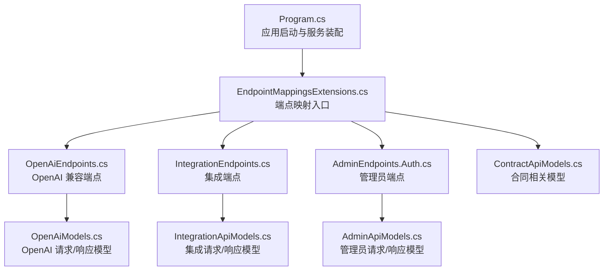
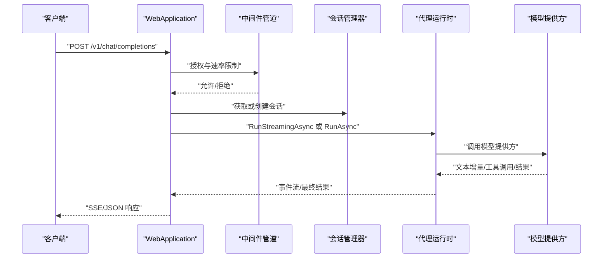
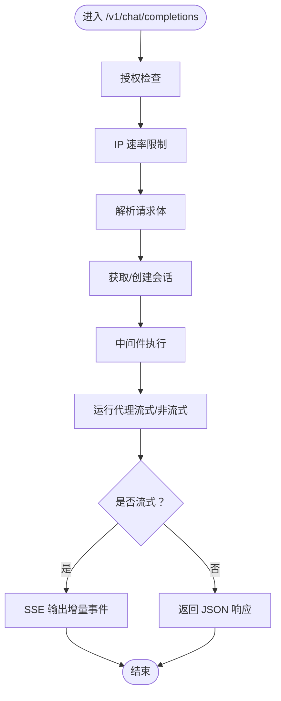
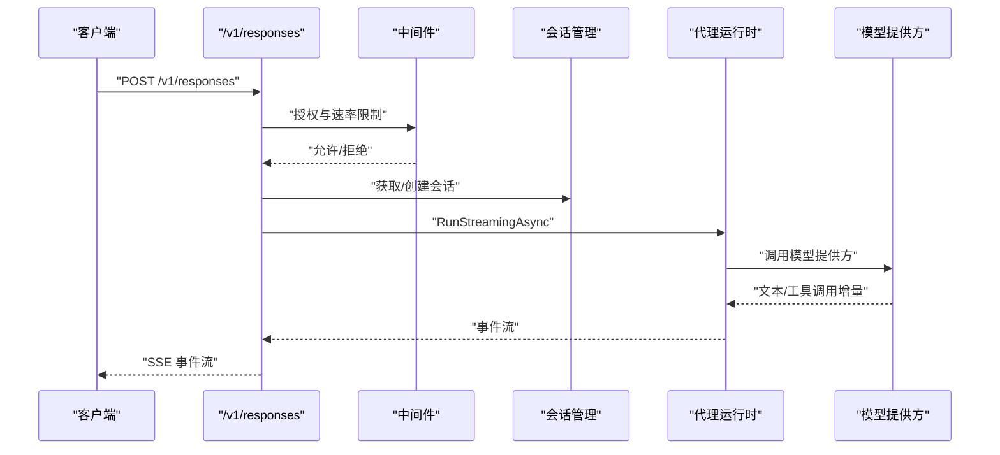
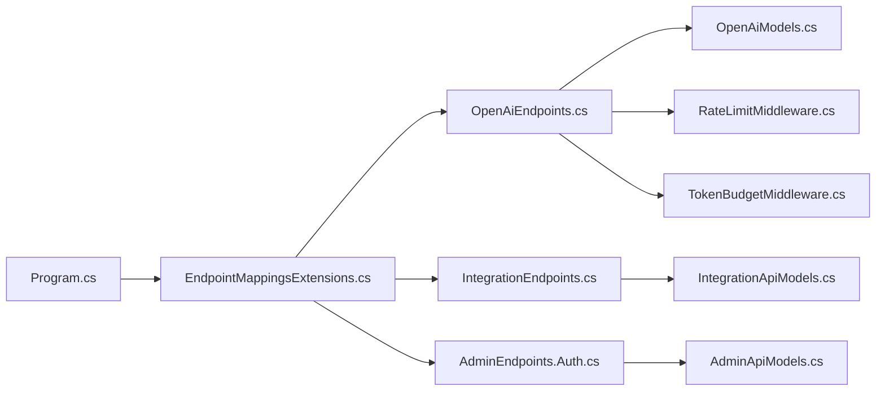

# HTTP REST API

<cite>
**本文引用的文件**
- [Program.cs](file://src/OpenClaw.Gateway/Program.cs)
- [EndpointMappingsExtensions.cs](file://src/OpenClaw.Gateway/Endpoints/EndpointMappingsExtensions.cs)
- [OpenAiEndpoints.cs](file://src/OpenClaw.Gateway/Endpoints/OpenAiEndpoints.cs)
- [OpenAiEndpoints.ChatCompletions.cs](file://src/OpenClaw.Gateway/Endpoints/OpenAiEndpoints.ChatCompletions.cs)
- [OpenAiEndpoints.Responses.cs](file://src/OpenClaw.Gateway/Endpoints/OpenAiEndpoints.Responses.cs)
- [OpenAiModels.cs](file://src/OpenClaw.Core/Models/OpenAiModels.cs)
- [AdminEndpoints.Auth.cs](file://src/OpenClaw.Gateway/Endpoints/AdminEndpoints.Auth.cs)
- [IntegrationEndpoints.cs](file://src/OpenClaw.Gateway/Endpoints/IntegrationEndpoints.cs)
- [ContractApiModels.cs](file://src/OpenClaw.Core/Models/ContractApiModels.cs)
- [AdminApiModels.cs](file://src/OpenClaw.Core/Models/AdminApiModels.cs)
- [IntegrationApiModels.cs](file://src/OpenClaw.Core/Models/IntegrationApiModels.cs)
- [OperatorApiModels.cs](file://src/OpenClaw.Core/Models/OperatorApiModels.cs)
- [RateLimitMiddleware.cs](file://src/OpenClaw.Core/Middleware/RateLimitMiddleware.cs)
- [TokenBudgetMiddleware.cs](file://src/OpenClaw.Core/Middleware/TokenBudgetMiddleware.cs)
- [GatewayConfig.cs](file://src/OpenClaw.Core/Models/GatewayConfig.cs)
</cite>

## 目录
1. [简介](#简介)
2. [项目结构](#项目结构)
3. [核心组件](#核心组件)
4. [架构总览](#架构总览)
5. [详细组件分析](#详细组件分析)
6. [依赖关系分析](#依赖关系分析)
7. [性能考量](#性能考量)
8. [故障排查指南](#故障排查指南)
9. [结论](#结论)
10. [附录](#附录)

## 简介
本文件为 OpenClaw.NET 的 HTTP REST API 参考文档，覆盖以下端点类别：
- OpenAI 兼容接口：/v1/chat/completions、/v1/responses
- 管理员端点：会话管理、操作员账户与策略、审计等
- 集成端点：仪表盘、状态、审批、工作流、自动化、支付等
- 合同端点：合约治理与状态查询
- 诊断端点：健康检查与运行时诊断

文档包含每个端点的 HTTP 方法、URL 模式、请求/响应模型、认证方式、参数定义、错误码说明、示例与常见用法，并讨论速率限制、版本控制与向后兼容性。

## 项目结构
OpenClaw.Gateway 通过集中映射函数将各类端点注册到 ASP.NET Core 应用中；OpenClaw.Gateway.Program 负责启动与中间件装配，随后调用 EndpointMappingsExtensions 将各模块端点挂载。

**图表来源**
- [Program.cs:80-96](file://src/OpenClaw.Gateway/Program.cs#L80-L96)
- [EndpointMappingsExtensions.cs:8-25](file://src/OpenClaw.Gateway/Endpoints/EndpointMappingsExtensions.cs#L8-L25)

**章节来源**
- [Program.cs:80-96](file://src/OpenClaw.Gateway/Program.cs#L80-L96)
- [EndpointMappingsExtensions.cs:8-25](file://src/OpenClaw.Gateway/Endpoints/EndpointMappingsExtensions.cs#L8-L25)

## 核心组件
- 端点映射入口：EndpointMappingsExtensions 将诊断、OpenAI、集成、管理员、合同、WebSocket、Webhook、控制等端点统一注册。
- OpenAI 兼容层：OpenAiEndpoints 提供 /v1/chat/completions 与 /v1/responses，支持流式与非流式响应。
- 集成与管理员：IntegrationEndpoints 与 AdminEndpoints.Auth 提供运营与管理能力。
- 模型定义：OpenAiModels、IntegrationApiModels、AdminApiModels、ContractApiModels 定义请求/响应结构。
- 中间件：RateLimitMiddleware 与 TokenBudgetMiddleware 提供速率限制与令牌预算控制。

**章节来源**
- [EndpointMappingsExtensions.cs:8-25](file://src/OpenClaw.Gateway/Endpoints/EndpointMappingsExtensions.cs#L8-L25)
- [OpenAiEndpoints.cs:13-20](file://src/OpenClaw.Gateway/Endpoints/OpenAiEndpoints.cs#L13-L20)
- [OpenAiModels.cs:18-220](file://src/OpenClaw.Core/Models/OpenAiModels.cs#L18-L220)
- [IntegrationEndpoints.cs:13-40](file://src/OpenClaw.Gateway/Endpoints/IntegrationEndpoints.cs#L13-L40)
- [AdminEndpoints.Auth.cs:30-49](file://src/OpenClaw.Gateway/Endpoints/AdminEndpoints.Auth.cs#L30-L49)
- [RateLimitMiddleware.cs](file://src/OpenClaw.Core/Middleware/RateLimitMiddleware.cs)
- [TokenBudgetMiddleware.cs](file://src/OpenClaw.Core/Middleware/TokenBudgetMiddleware.cs)

## 架构总览
下图展示从客户端到运行时的典型调用链，以及关键中间件与会话管理的作用。

**图表来源**
- [OpenAiEndpoints.ChatCompletions.cs:17-366](file://src/OpenClaw.Gateway/Endpoints/OpenAiEndpoints.ChatCompletions.cs#L17-L366)
- [OpenAiEndpoints.Responses.cs:17-612](file://src/OpenClaw.Gateway/Endpoints/OpenAiEndpoints.Responses.cs#L17-L612)

## 详细组件分析

### OpenAI 兼容接口

#### /v1/chat/completions
- 方法与路径：POST /v1/chat/completions
- 认证：基于网关配置的授权检查（非环回绑定时需额外校验）
- 速率限制：IP 维度与 openai_http 策略
- 请求体模型：OpenAiChatCompletionRequest
  - 字段：model、messages（角色/内容）、stream、temperature、max_tokens
  - 内容支持字符串或多部分（文本/图片）
- 响应模型：OpenAiChatCompletionResponse（非流式）或 SSE 流（流式）
  - 流式事件包含角色、文本增量、工具调用开始/增量/结果、完成标记
- 会话与稳定会话：支持 X-OpenClaw-Session-Id 头部进行稳定会话绑定
- 工具策略：根据模型配置与预设决定是否启用隐式工具
- 错误码：
  - 400：请求体无效、消息为空、请求过大、稳定会话 ID 无效
  - 401：未授权
  - 409：稳定会话绑定不一致
  - 429：速率限制触发
  - 500：内部错误（如提供方失败）

请求示例（路径）
- [OpenAiChatCompletionRequest:23-31](file://src/OpenClaw.Core/Models/OpenAiModels.cs#L23-L31)

响应示例（路径）
- [OpenAiChatCompletionResponse:188-196](file://src/OpenClaw.Core/Models/OpenAiModels.cs#L188-L196)
- [OpenAiStreamChunk:227-234](file://src/OpenClaw.Core/Models/OpenAiModels.cs#L227-L234)

流程图（流式处理）

**图表来源**
- [OpenAiEndpoints.ChatCompletions.cs:17-366](file://src/OpenClaw.Gateway/Endpoints/OpenAiEndpoints.ChatCompletions.cs#L17-L366)

**章节来源**
- [OpenAiEndpoints.ChatCompletions.cs:17-366](file://src/OpenClaw.Gateway/Endpoints/OpenAiEndpoints.ChatCompletions.cs#L17-L366)
- [OpenAiModels.cs:18-220](file://src/OpenClaw.Core/Models/OpenAiModels.cs#L18-L220)

#### /v1/responses
- 方法与路径：POST /v1/responses
- 认证：同上
- 速率限制：同上
- 请求体模型：OpenAiResponseRequest
  - 字段：model、input（字符串或结构化消息）、stream、temperature、max_output_tokens
- 响应模型：OpenAiResponseResponse（非流式）或 SSE 事件流（流式）
  - 事件类型：response.created、response.in_progress、response.output_item.added/done、response.content_part.added/done、response.output_text.delta/done、response.function_call_arguments.delta/done、response.openclaw_tool_delta/tool_result、response.completed/failed
- 会话与稳定会话：同上
- 错误码：400/401/409/429/500

请求示例（路径）
- [OpenAiResponseRequest:294-303](file://src/OpenClaw.Core/Models/OpenAiModels.cs#L294-L303)

响应示例（路径）
- [OpenAiResponseResponse:308-319](file://src/OpenClaw.Core/Models/OpenAiModels.cs#L308-L319)
- [事件模型集合:371-570](file://src/OpenClaw.Core/Models/OpenAiModels.cs#L371-L570)

序列图（流式生命周期）

**图表来源**
- [OpenAiEndpoints.Responses.cs:17-612](file://src/OpenClaw.Gateway/Endpoints/OpenAiEndpoints.Responses.cs#L17-L612)

**章节来源**
- [OpenAiEndpoints.Responses.cs:17-612](file://src/OpenClaw.Gateway/Endpoints/OpenAiEndpoints.Responses.cs#L17-L612)
- [OpenAiModels.cs:288-570](file://src/OpenClaw.Core/Models/OpenAiModels.cs#L288-L570)

### 管理员端点

#### /auth/session
- GET：获取当前会话信息
- POST：登录并颁发浏览器会话（支持用户名密码、账户令牌、无凭据浏览器会话）
- DELETE：登出并清除 Cookie
- 返回：AuthSessionResponse（含角色、显示名、策略快照、工具预设等）

**章节来源**
- [AdminEndpoints.Auth.cs:40-190](file://src/OpenClaw.Gateway/Endpoints/AdminEndpoints.Auth.cs#L40-L190)

#### /admin/operator-accounts/*
- 列表、创建、详情、更新、删除操作员账户
- 支持创建/撤销账户令牌
- 返回：OperatorAccountListResponse、OperatorAccountDetailResponse、MutationResponse

**章节来源**
- [AdminEndpoints.Auth.cs:192-356](file://src/OpenClaw.Gateway/Endpoints/AdminEndpoints.Auth.cs#L192-L356)

#### /admin/organization-policy/*
- 查询与更新组织策略（OrganizationPolicyResponse/Snapshot）

**章节来源**
- [AdminEndpoints.Auth.cs:358-396](file://src/OpenClaw.Gateway/Endpoints/AdminEndpoints.Auth.cs#L358-L396)

### 集成端点

#### /api/integration/*
- 仪表盘与状态：GET /dashboard、GET /status
- 审批与历史：GET /approvals、GET /approval-history
- 提供方与插件：GET /providers、GET /plugins
- 兼容性目录与导出：GET /compatibility/catalog、GET /compatibility/export
- 运行时审计：GET /operator-audit
- 会话管理：GET /sessions、GET /sessions/{id}、GET /sessions/{id}/timeline、GET /session-search
- 角色档案：GET/PUT /profiles、GET/PUT /profiles/{actorId}
- 文本转语音：POST /text-to-speech
- 工作流：GET /workflows、POST /workflows/{workflowId}/runs、GET /workflows/{workflowId}/runs/{runId}、POST /workflows/{workflowId}/runs/{runId}/responses
- 自动化：GET /automations、GET /automations/templates、GET /automations/{id}、GET /automations/{id}/runs、GET /automations/{id}/runs/{runId}、POST /automations/{id}/run、POST /automations/{id}/runs/{runId}/replay、POST /automations/{id}/quarantine/clear、DELETE /automations/{id}
- 运行时事件：GET /runtime-events
- 支付：GET /payment/setup、GET /payment/funding、POST /payment/virtual-card、POST /payment/execute、GET /payment/status/{id}

**章节来源**
- [IntegrationEndpoints.cs:22-800](file://src/OpenClaw.Gateway/Endpoints/IntegrationEndpoints.cs#L22-L800)
- [IntegrationApiModels.cs](file://src/OpenClaw.Core/Models/IntegrationApiModels.cs)

### 合同端点
- 合同治理与状态查询（ContractApiModels 定义相关请求/响应）
- 用于合约驱动的成本预算、合规与治理

**章节来源**
- [ContractApiModels.cs](file://src/OpenClaw.Core/Models/ContractApiModels.cs)

### 诊断端点
- 健康检查：返回状态与运行时间（HealthResponse）
- 诊断：结合运行时事件与日志进行问题定位

**章节来源**
- [OpenAiModels.cs:11-15](file://src/OpenClaw.Core/Models/OpenAiModels.cs#L11-L15)

## 依赖关系分析

**图表来源**
- [Program.cs:80-96](file://src/OpenClaw.Gateway/Program.cs#L80-L96)
- [EndpointMappingsExtensions.cs:8-25](file://src/OpenClaw.Gateway/Endpoints/EndpointMappingsExtensions.cs#L8-L25)
- [OpenAiEndpoints.cs:13-20](file://src/OpenClaw.Gateway/Endpoints/OpenAiEndpoints.cs#L13-L20)
- [OpenAiModels.cs:18-220](file://src/OpenClaw.Core/Models/OpenAiModels.cs#L18-L220)
- [IntegrationEndpoints.cs:13-40](file://src/OpenClaw.Gateway/Endpoints/IntegrationEndpoints.cs#L13-L40)
- [IntegrationApiModels.cs](file://src/OpenClaw.Core/Models/IntegrationApiModels.cs)
- [AdminEndpoints.Auth.cs:30-49](file://src/OpenClaw.Gateway/Endpoints/AdminEndpoints.Auth.cs#L30-L49)
- [AdminApiModels.cs](file://src/OpenClaw.Core/Models/AdminApiModels.cs)
- [RateLimitMiddleware.cs](file://src/OpenClaw.Core/Middleware/RateLimitMiddleware.cs)
- [TokenBudgetMiddleware.cs](file://src/OpenClaw.Core/Middleware/TokenBudgetMiddleware.cs)

**章节来源**
- [Program.cs:80-96](file://src/OpenClaw.Gateway/Program.cs#L80-L96)
- [EndpointMappingsExtensions.cs:8-25](file://src/OpenClaw.Gateway/Endpoints/EndpointMappingsExtensions.cs#L8-L25)

## 性能考量
- 速率限制：IP 维度与策略维度双重控制，避免滥用与过载
- 令牌预算：TokenBudgetMiddleware 控制会话级输入输出令牌消耗
- 流式传输：SSE/事件流降低延迟，提升用户体验
- 请求大小限制：OpenAI 接口对请求体大小进行上限控制
- 会话复用：稳定会话头可绑定跨请求上下文，减少重复初始化成本

**章节来源**
- [OpenAiEndpoints.ChatCompletions.cs:25-41](file://src/OpenClaw.Gateway/Endpoints/OpenAiEndpoints.ChatCompletions.cs#L25-L41)
- [OpenAiEndpoints.Responses.cs:25-45](file://src/OpenClaw.Gateway/Endpoints/OpenAiEndpoints.Responses.cs#L25-L45)
- [RateLimitMiddleware.cs](file://src/OpenClaw.Core/Middleware/RateLimitMiddleware.cs)
- [TokenBudgetMiddleware.cs](file://src/OpenClaw.Core/Middleware/TokenBudgetMiddleware.cs)

## 故障排查指南
- 400 错误
  - 请求体无效或字段缺失（如 messages、input、model）
  - 请求体过大
- 401 未授权
  - 缺少有效凭据或非环回绑定未满足授权条件
- 409 冲突
  - 稳定会话绑定与当前请求者范围不一致
- 429 速率限制
  - IP 或策略维度触发限流
- 500 内部错误
  - 提供方不可达或运行时异常

建议排查步骤：
- 检查请求头与认证方式（浏览器会话/账户令牌）
- 核对请求体结构与必填字段
- 查看中间件日志与会话状态
- 使用 /api/integration/runtime-events 获取运行时事件辅助定位

**章节来源**
- [OpenAiEndpoints.ChatCompletions.cs:34-59](file://src/OpenClaw.Gateway/Endpoints/OpenAiEndpoints.ChatCompletions.cs#L34-L59)
- [OpenAiEndpoints.Responses.cs:32-52](file://src/OpenClaw.Gateway/Endpoints/OpenAiEndpoints.Responses.cs#L32-L52)
- [AdminEndpoints.Auth.cs:40-124](file://src/OpenClaw.Gateway/Endpoints/AdminEndpoints.Auth.cs#L40-L124)

## 结论
OpenClaw.NET 的 HTTP REST API 以模块化方式组织，通过统一映射入口集中注册各功能域端点。OpenAI 兼容接口提供标准的聊天与响应能力，集成与管理员端点覆盖运营与治理需求，合同与诊断端点完善合规与可观测性。配合中间件实现的速率限制与令牌预算，确保系统在高负载下的稳定性与可控性。

## 附录

### 版本控制与向后兼容
- OpenAI 兼容接口遵循主流语义，尽量保持与 OpenAI 规范一致，便于迁移
- 稳定会话与工具策略通过头部与会话元数据控制，避免破坏现有行为
- 模型选择优先使用配置中的默认模型，同时支持显式覆盖

**章节来源**
- [OpenAiEndpoints.cs:114-126](file://src/OpenClaw.Gateway/Endpoints/OpenAiEndpoints.cs#L114-L126)
- [GatewayConfig.cs:88-153](file://src/OpenClaw.Core/Models/GatewayConfig.cs#L88-L153)