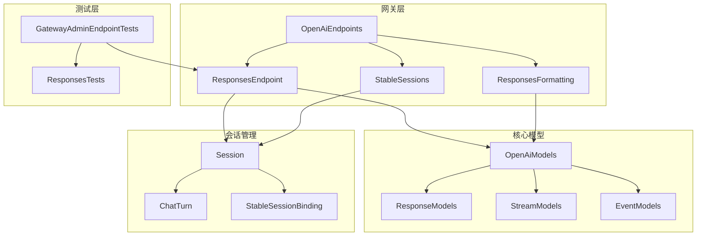
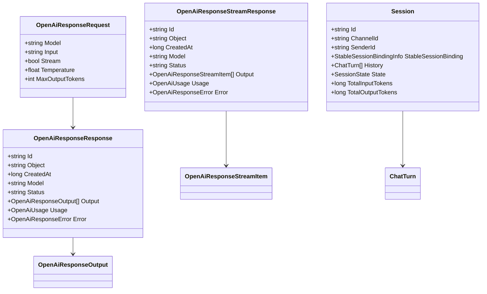
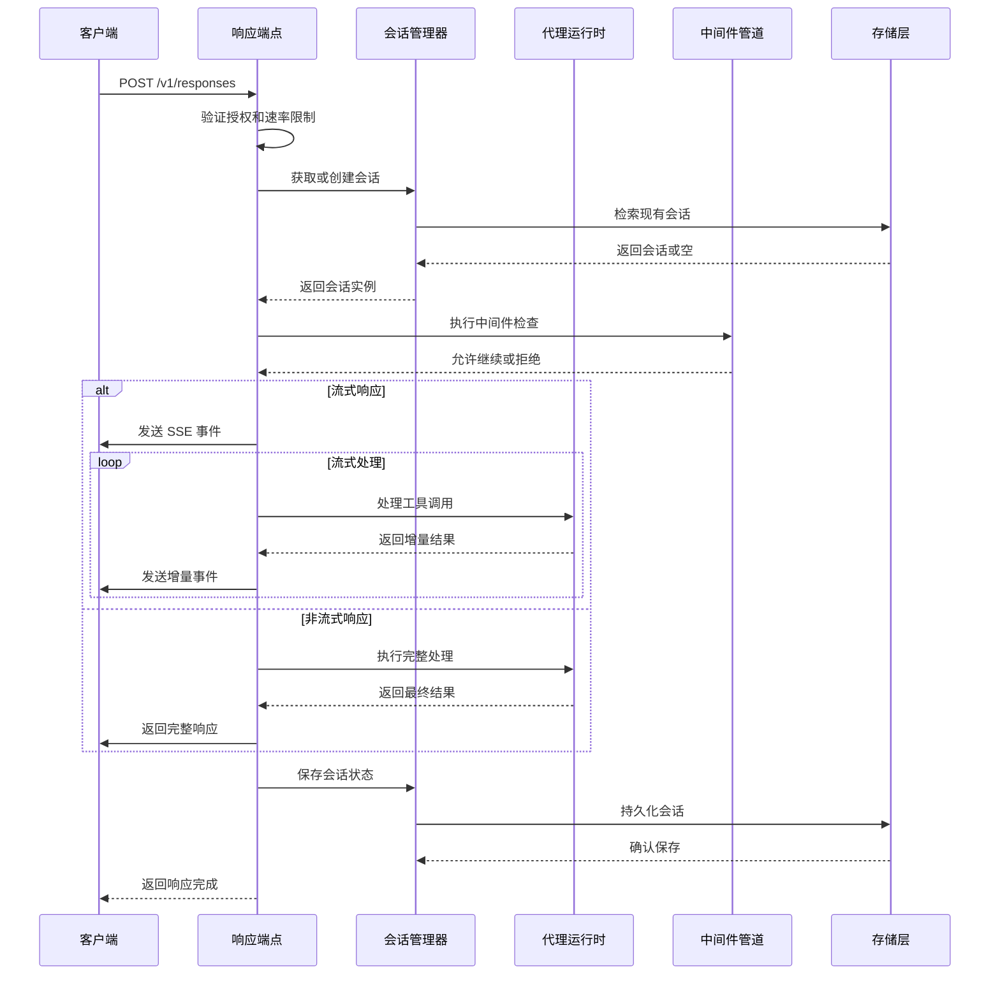
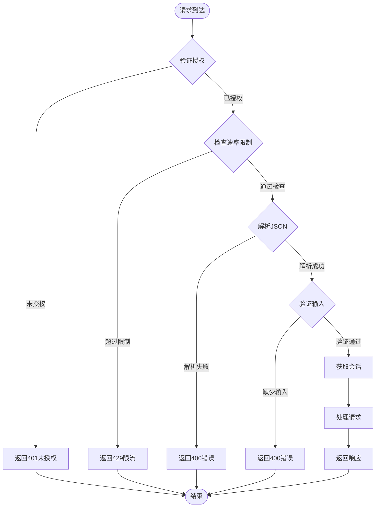
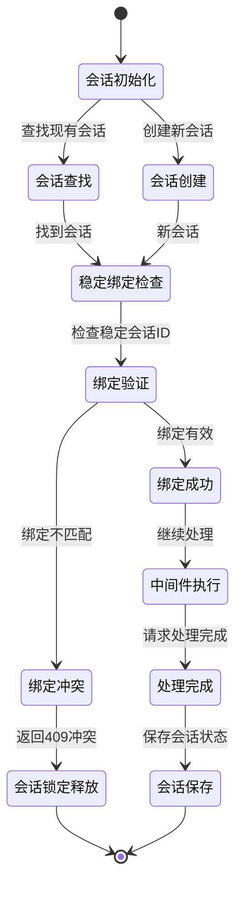
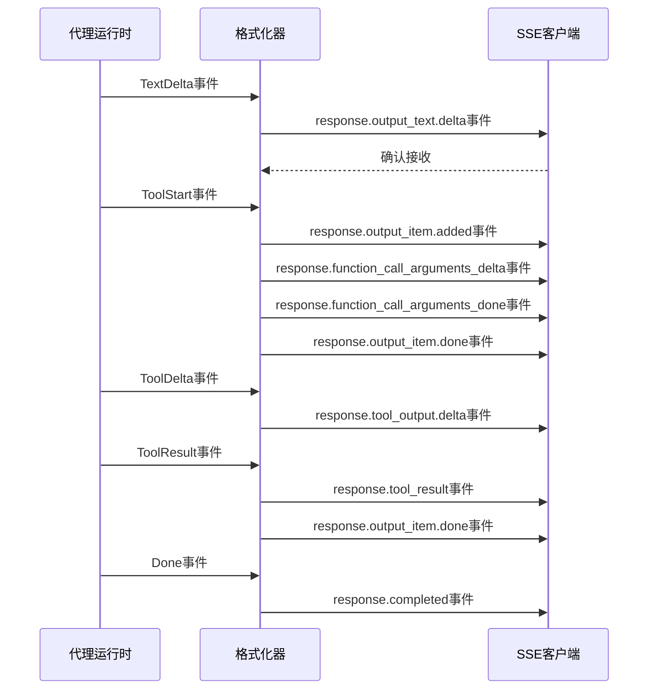
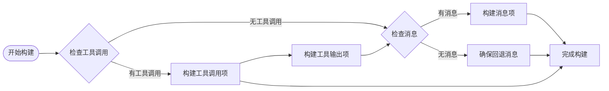
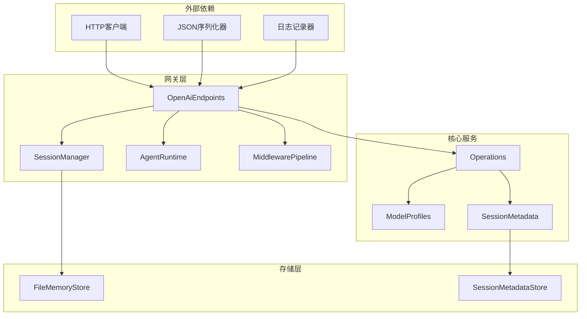

# 响应管理接口

<cite>
**本文档引用的文件**
- [OpenAiEndpoints.Responses.cs](file://src/OpenClaw.Gateway/Endpoints/OpenAiEndpoints.Responses.cs)
- [OpenAiEndpoints.ResponsesFormatting.cs](file://src/OpenClaw.Gateway/Endpoints/OpenAiEndpoints.ResponsesFormatting.cs)
- [OpenAiEndpoints.cs](file://src/OpenClaw.Gateway/Endpoints/OpenAiEndpoints.cs)
- [OpenAiEndpoints.StableSessions.cs](file://src/OpenClaw.Gateway/Endpoints/OpenAiEndpoints.StableSessions.cs)
- [OpenAiModels.cs](file://src/OpenClaw.Core/Models/OpenAiModels.cs)
- [Session.cs](file://src/OpenClaw.Core/Models/Session.cs)
- [GatewayAdminEndpointTests.cs](file://src/OpenClaw.Tests/GatewayAdminEndpointTests.cs)
- [EndpointMappingsExtensions.cs](file://src/OpenClaw.Gateway/Endpoints/EndpointMappingsExtensions.cs)
</cite>

## 目录
1. [简介](#简介)
2. [项目结构](#项目结构)
3. [核心组件](#核心组件)
4. [架构概览](#架构概览)
5. [详细组件分析](#详细组件分析)
6. [依赖关系分析](#依赖关系分析)
7. [性能考虑](#性能考虑)
8. [故障排除指南](#故障排除指南)
9. [结论](#结论)

## 简介

响应管理接口是 OpenClaw 项目中的核心 API 组件，提供标准化的响应生成服务。该接口实现了 OpenAI 兼容的 `/v1/responses` 端点，支持同步和流式两种响应模式，具备完整的会话管理、工具调用集成和状态跟踪功能。

本接口的主要特性包括：
- OpenAI 兼容的响应格式
- 支持流式和非流式响应
- 稳定会话绑定机制
- 工具调用和结果处理
- 完整的错误处理和状态管理
- 令牌使用统计和成本追踪

## 项目结构

响应管理接口在项目中的组织结构如下：

**图表来源**
- [OpenAiEndpoints.Responses.cs:1-614](file://src/OpenClaw.Gateway/Endpoints/OpenAiEndpoints.Responses.cs#L1-L614)
- [OpenAiEndpoints.cs:1-88](file://src/OpenClaw.Gateway/Endpoints/OpenAiEndpoints.cs#L1-L88)

**章节来源**
- [EndpointMappingsExtensions.cs:8-26](file://src/OpenClaw.Gateway/Endpoints/EndpointMappingsExtensions.cs#L8-L26)

## 核心组件

### 主要接口组件

响应管理接口由以下核心组件构成：

1. **响应端点处理器** - 处理 `/v1/responses` 请求的核心逻辑
2. **格式化组件** - 负责响应输出的格式化和事件生成
3. **稳定会话管理** - 实现跨请求的会话状态保持
4. **模型定义** - 定义所有响应相关的数据结构

### 数据模型架构

**图表来源**
- [OpenAiModels.cs:290-479](file://src/OpenClaw.Core/Models/OpenAiModels.cs#L290-L479)
- [Session.cs:15-200](file://src/OpenClaw.Core/Models/Session.cs#L15-L200)

**章节来源**
- [OpenAiModels.cs:280-479](file://src/OpenClaw.Core/Models/OpenAiModels.cs#L280-L479)
- [Session.cs:1-200](file://src/OpenClaw.Core/Models/Session.cs#L1-L200)

## 架构概览

响应管理接口采用分层架构设计，确保了清晰的关注点分离和可维护性。

**图表来源**
- [OpenAiEndpoints.Responses.cs:17-614](file://src/OpenClaw.Gateway/Endpoints/OpenAiEndpoints.Responses.cs#L17-L614)

## 详细组件分析

### 响应端点处理流程

响应端点是整个系统的核心处理单元，负责接收客户端请求、执行业务逻辑并返回适当的响应。

#### 授权和验证流程

**图表来源**
- [OpenAiEndpoints.Responses.cs:17-52](file://src/OpenClaw.Gateway/Endpoints/OpenAiEndpoints.Responses.cs#L17-L52)

#### 会话管理机制

稳定的会话绑定是响应管理的关键特性，允许跨多个请求保持对话上下文。

**图表来源**
- [OpenAiEndpoints.Responses.cs:65-85](file://src/OpenClaw.Gateway/Endpoints/OpenAiEndpoints.Responses.cs#L65-L85)
- [OpenAiEndpoints.StableSessions.cs:104-149](file://src/OpenClaw.Gateway/Endpoints/OpenAiEndpoints.StableSessions.cs#L104-L149)

**章节来源**
- [OpenAiEndpoints.Responses.cs:17-614](file://src/OpenClaw.Gateway/Endpoints/OpenAiEndpoints.Responses.cs#L17-L614)
- [OpenAiEndpoints.StableSessions.cs:104-149](file://src/OpenClaw.Gateway/Endpoints/OpenAiEndpoints.StableSessions.cs#L104-L149)

### 响应格式化和事件生成

响应格式化组件负责将代理运行时的结果转换为标准的 OpenAI 兼容格式，并生成相应的事件。

#### 流式响应事件序列

**图表来源**
- [OpenAiEndpoints.Responses.cs:373-559](file://src/OpenClaw.Gateway/Endpoints/OpenAiEndpoints.Responses.cs#L373-L559)
- [OpenAiEndpoints.ResponsesFormatting.cs:134-173](file://src/OpenClaw.Gateway/Endpoints/OpenAiEndpoints.ResponsesFormatting.cs#L134-L173)

#### 输出项构建逻辑

格式化器根据代理运行时的输出动态构建响应项，支持消息和工具调用两种类型：

**图表来源**
- [OpenAiEndpoints.ResponsesFormatting.cs:52-117](file://src/OpenClaw.Gateway/Endpoints/OpenAiEndpoints.ResponsesFormatting.cs#L52-L117)

**章节来源**
- [OpenAiEndpoints.ResponsesFormatting.cs:1-173](file://src/OpenClaw.Gateway/Endpoints/OpenAiEndpoints.ResponsesFormatting.cs#L1-L173)

### 错误处理和状态管理

系统实现了完善的错误处理机制，确保在各种异常情况下都能提供一致的响应格式。

#### 错误映射表

| 内部错误码 | 映射后错误码 | 描述 |
|------------|--------------|------|
| provider_failure | provider_error | 提供商连接失败 |
| session_token_limit | session_limit_exceeded | 会话令牌限制超限 |
| max_iterations | orchestration_limit_exceeded | 编排迭代限制超限 |
| 其他 | runtime_error | 运行时错误 |

#### 状态跟踪机制

会话状态通过以下方式跟踪：
- **会话状态枚举**：Active、Paused、Expired
- **令牌使用统计**：输入、输出、缓存读写令牌计数
- **执行检查点**：工具批次执行状态
- **合同政策**：执行限制和成本追踪

**章节来源**
- [OpenAiEndpoints.Responses.cs:29-40](file://src/OpenClaw.Gateway/Endpoints/OpenAiEndpoints.Responses.cs#L29-L40)
- [Session.cs:145-200](file://src/OpenClaw.Core/Models/Session.cs#L145-L200)

## 依赖关系分析

响应管理接口的依赖关系体现了清晰的分层架构：

**图表来源**
- [OpenAiEndpoints.Responses.cs:1-614](file://src/OpenClaw.Gateway/Endpoints/OpenAiEndpoints.Responses.cs#L1-L614)

**章节来源**
- [OpenAiEndpoints.Responses.cs:1-614](file://src/OpenClaw.Gateway/Endpoints/OpenAiEndpoints.Responses.cs#L1-L614)

## 性能考虑

### 速率限制策略

系统实现了多层速率限制机制：

1. **IP级限制**：基于远程IP地址的请求频率控制
2. **请求者级限制**：基于认证主体的个性化限制
3. **全局限制**：系统级的整体负载保护

### 内存管理优化

- **流式处理**：避免大响应的内存峰值
- **增量序列化**：按事件发送减少内存占用
- **会话缓存**：智能的会话生命周期管理

### 并发处理

- **异步I/O**：非阻塞的网络和存储操作
- **会话锁定**：防止并发修改同一会话
- **资源池**：复用连接和对象

## 故障排除指南

### 常见问题诊断

#### 401 未授权错误
- 检查请求头中的认证信息
- 验证API密钥的有效性
- 确认绑定地址配置

#### 429 限流错误
- 检查当前速率限制配置
- 实现指数退避重试策略
- 调整客户端请求频率

#### 409 冲突错误
- 检查稳定会话绑定是否正确
- 验证会话所有权范围
- 确认会话锁定状态

#### 500 服务器错误
- 检查代理运行时状态
- 验证模型配置
- 查看系统日志

**章节来源**
- [GatewayAdminEndpointTests.cs:4540-4739](file://src/OpenClaw.Tests/GatewayAdminEndpointTests.cs#L4540-L4739)

## 结论

响应管理接口提供了完整、高性能的响应生成服务，具有以下优势：

1. **标准化接口**：完全兼容 OpenAI API 规范
2. **灵活的响应模式**：支持流式和非流式两种模式
3. **强大的会话管理**：通过稳定会话绑定实现上下文保持
4. **完善的错误处理**：提供一致的错误响应格式
5. **可观测性**：完整的事件流和状态跟踪
6. **性能优化**：多层优化确保高吞吐量和低延迟

该接口为构建智能应用提供了坚实的基础，支持从简单的问答到复杂的多步骤工作流等各种场景。