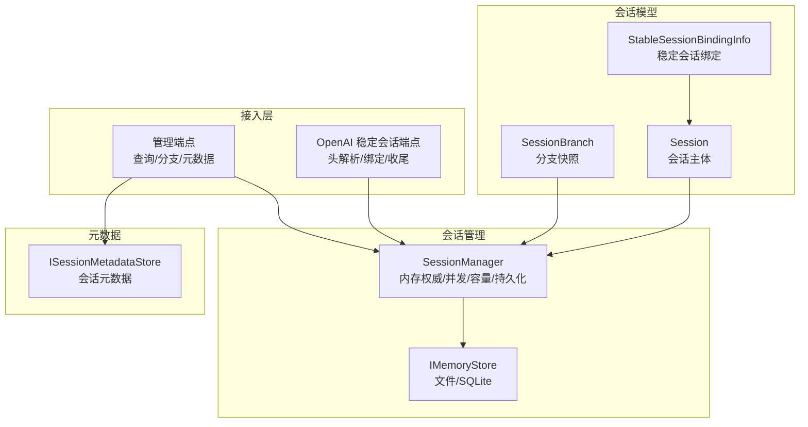
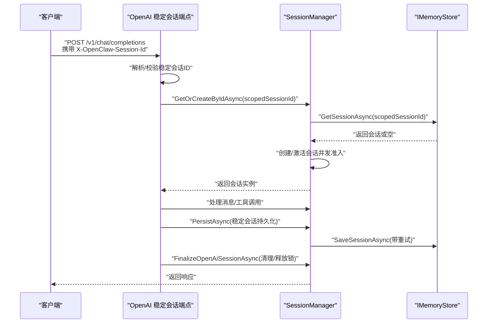
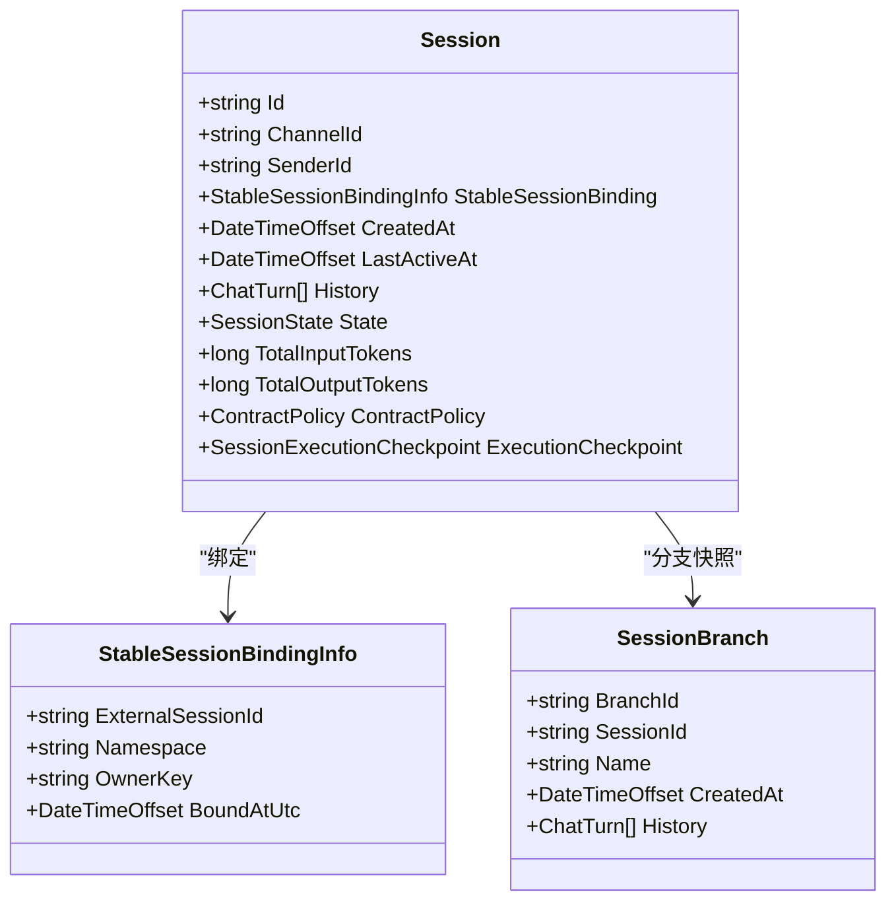
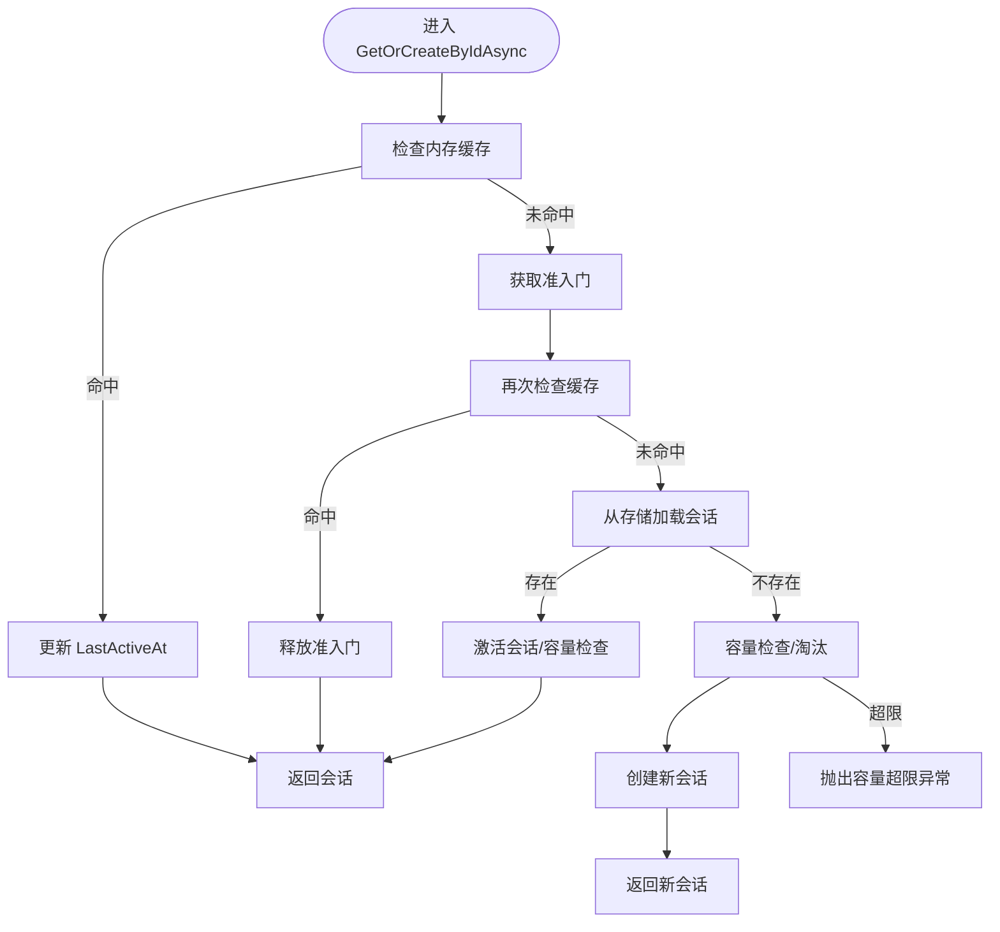
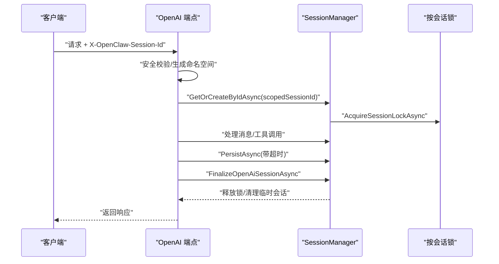
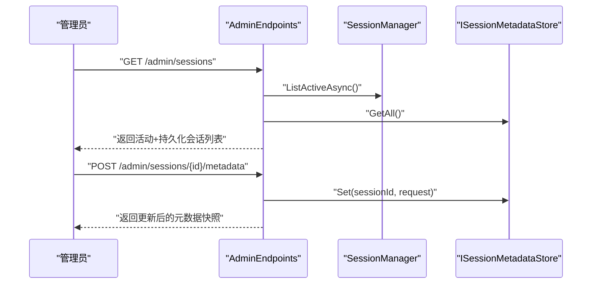
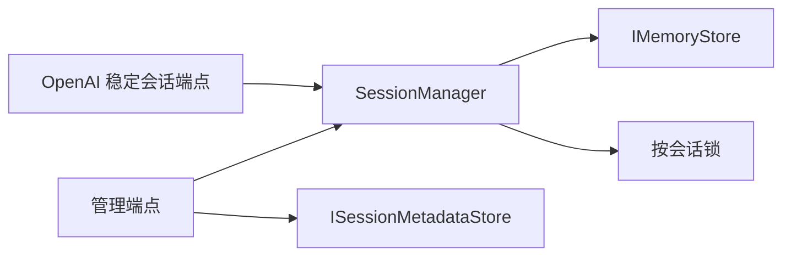

# 稳定会话接口

<cite>
**本文引用的文件**
- [Session.cs](file://src/OpenClaw.Core/Models/Session.cs)
- [SessionManager.cs](file://src/OpenClaw.Core/Sessions/SessionManager.cs)
- [OpenAiEndpoints.StableSessions.cs](file://src/OpenClaw.Gateway/Endpoints/OpenAiEndpoints.StableSessions.cs)
- [AdminEndpoints.Sessions.cs](file://src/OpenClaw.Gateway/Endpoints/AdminEndpoints.Sessions.cs)
- [ISessionMetadataStore.cs](file://src/OpenClaw.Core/Abstractions/ISessionMetadataStore.cs)
- [SessionBranch.cs](file://src/OpenClaw.Core/Models/SessionBranch.cs)
- [SessionAdminModels.cs](file://src/OpenClaw.Core/Models/SessionAdminModels.cs)
- [OpenClaw-Session-Management.md](file://docs/OpenClaw-Session-Management.md)
- [FileMemoryStore.cs](file://src/OpenClaw.Core/Memory/FileMemoryStore.cs)
</cite>

## 目录
1. [简介](#简介)
2. [项目结构](#项目结构)
3. [核心组件](#核心组件)
4. [架构总览](#架构总览)
5. [详细组件分析](#详细组件分析)
6. [依赖关系分析](#依赖关系分析)
7. [性能考量](#性能考量)
8. [故障排查指南](#故障排查指南)
9. [结论](#结论)
10. [附录](#附录)

## 简介
本文件聚焦“稳定会话接口”的设计与实现，涵盖稳定会话的创建、维护与管理机制，包括会话标识符管理、状态持久化、超时处理与会话恢复能力。文档提供完整的会话生命周期管理流程与最佳实践建议，包含会话数据结构、状态转换与错误恢复策略，帮助开发者在多渠道、多会话并发场景下构建可靠、可恢复的对话体验。

## 项目结构
稳定会话接口由以下模块协同实现：
- 会话模型与分支：定义会话数据结构、稳定会话绑定信息、分支快照等。
- 会话管理器：负责会话创建、并发准入、容量控制、持久化与过期清理。
- 稳定会话接入层：在 OpenAI 兼容端点中实现稳定会话头解析、绑定校验与生命周期收尾。
- 管理端点：提供会话查询、分支差异比较、元数据更新等管理能力。
- 元数据存储：独立的会话元数据（星标、标签、待办）持久化与检索。
- 存储实现：文件与 SQLite 两种后端，均实现会话与分支的持久化契约。

图示来源
- [Session.cs:15-143](file://src/OpenClaw.Core/Models/Session.cs#L15-L143)
- [SessionManager.cs:13-36](file://src/OpenClaw.Core/Sessions/SessionManager.cs#L13-L36)
- [OpenAiEndpoints.StableSessions.cs:9-87](file://src/OpenClaw.Gateway/Endpoints/OpenAiEndpoints.StableSessions.cs#L9-L87)
- [AdminEndpoints.Sessions.cs:40-93](file://src/OpenClaw.Gateway/Endpoints/AdminEndpoints.Sessions.cs#L40-L93)
- [ISessionMetadataStore.cs:5-10](file://src/OpenClaw.Core/Abstractions/ISessionMetadataStore.cs#L5-L10)
- [SessionBranch.cs:8-15](file://src/OpenClaw.Core/Models/SessionBranch.cs#L8-L15)

章节来源
- [OpenClaw-Session-Management.md:1-278](file://docs/OpenClaw-Session-Management.md#L1-L278)

## 核心组件
- 会话模型（Session）
  - 包含会话标识、渠道与发送者、历史记录、状态、令牌用量、合约基线、执行检查点等字段。
  - 支持稳定会话绑定信息（ExternalSessionId、Namespace、OwnerKey、BoundAtUtc）。
- 会话管理器（SessionManager）
  - 内存热缓存 + 持久化后端；提供并发安全的会话创建、加载、持久化、分支、恢复与过期清理。
  - 支持按会话粒度的独占锁，保障分支与持久化等关键操作的串行化。
- 稳定会话接入层（OpenAI 端点）
  - 解析请求头中的稳定会话 ID，生成命名空间，确保绑定一致性与请求者归属校验。
  - 在响应后进行稳定会话的持久化或临时会话的清理。
- 管理端点（AdminEndpoints）
  - 提供会话列表、详情、分支差异、元数据更新等管理能力。
- 元数据存储（ISessionMetadataStore）
  - 独立存储会话的星标、标签、待办等元数据，支持部分更新与检索。
- 存储实现（FileMemoryStore/SqliteMemoryStore）
  - 提供会话与分支的持久化、会话列表与全文检索能力。

章节来源
- [Session.cs:15-143](file://src/OpenClaw.Core/Models/Session.cs#L15-L143)
- [SessionManager.cs:13-36](file://src/OpenClaw.Core/Sessions/SessionManager.cs#L13-L36)
- [OpenAiEndpoints.StableSessions.cs:9-87](file://src/OpenClaw.Gateway/Endpoints/OpenAiEndpoints.StableSessions.cs#L9-L87)
- [AdminEndpoints.Sessions.cs:40-93](file://src/OpenClaw.Gateway/Endpoints/AdminEndpoints.Sessions.cs#L40-L93)
- [ISessionMetadataStore.cs:5-10](file://src/OpenClaw.Core/Abstractions/ISessionMetadataStore.cs#L5-L10)
- [FileMemoryStore.cs:1076-1156](file://src/OpenClaw.Core/Memory/FileMemoryStore.cs#L1076-L1156)

## 架构总览
稳定会话接口围绕 SessionManager 构建，形成“内存权威 + 持久化后端”的双层架构。接入层通过请求头传递稳定会话 ID，生成命名空间并绑定到会话对象；管理端点提供查询、分支与元数据能力；元数据存储独立于会话生命周期，便于扩展与维护。

图示来源
- [OpenAiEndpoints.StableSessions.cs:25-50](file://src/OpenClaw.Gateway/Endpoints/OpenAiEndpoints.StableSessions.cs#L25-L50)
- [SessionManager.cs:132-172](file://src/OpenClaw.Core/Sessions/SessionManager.cs#L132-L172)

章节来源
- [OpenClaw-Session-Management.md:27-80](file://docs/OpenClaw-Session-Management.md#L27-L80)

## 详细组件分析

### 会话模型与稳定会话绑定
- Session
  - 关键字段：Id、ChannelId、SenderId、StableSessionBinding、History、State、TotalInputTokens/TotalOutputTokens、ContractPolicy、ExecutionCheckpoint 等。
  - 稳定会话绑定：ExternalSessionId（外部稳定会话 ID）、Namespace（命名空间，基于请求者密钥哈希）、OwnerKey（请求者标识）、BoundAtUtc（绑定时间）。
- SessionBranch
  - 用于保存会话历史的分支快照，包含 BranchId、SessionId、Name、CreatedAt、History。
- 稳定会话命名空间
  - 基于请求者密钥（如 Bearer Token 的哈希）生成命名空间，避免跨请求者冲突。

图示来源
- [Session.cs:15-143](file://src/OpenClaw.Core/Models/Session.cs#L15-L143)
- [SessionBranch.cs:8-15](file://src/OpenClaw.Core/Models/SessionBranch.cs#L8-L15)

章节来源
- [Session.cs:15-143](file://src/OpenClaw.Core/Models/Session.cs#L15-L143)
- [SessionBranch.cs:8-15](file://src/OpenClaw.Core/Models/SessionBranch.cs#L8-L15)

### 会话管理器：并发、容量与持久化
- 并发与准入
  - 使用单一准入门（SemaphoreSlim 并发度 1）与双重检查锁定，避免缓存命中时的串行化开销。
  - 每个会话拥有独立的按会话锁，保障分支、持久化等关键操作的串行化。
- 容量控制与 LRU 淘汰
  - 通过 EnsureCapacityForAdmission -> SweepExpiredActiveSessions -> EvictLeastRecentlyActive 的三级策略，维持 MaxConcurrentSessions 上限。
  - 超限时抛出异常并记录容量拒绝指标。
- 持久化与重试
  - PersistAsync 使用三次重试与指数退避（100ms、200ms、400ms），失败时记录警告日志。
  - 支持 Best-effort 后台持久化队列，避免阻塞主流程。
- 过期清理
  - SweepExpiredActiveSessions 根据 SessionTimeoutMinutes 扫描并移除过期会话，转换为 Expired 状态并尝试持久化。

图示来源
- [SessionManager.cs:45-130](file://src/OpenClaw.Core/Sessions/SessionManager.cs#L45-L130)
- [SessionManager.cs:443-460](file://src/OpenClaw.Core/Sessions/SessionManager.cs#L443-L460)

章节来源
- [SessionManager.cs:13-36](file://src/OpenClaw.Core/Sessions/SessionManager.cs#L13-L36)
- [SessionManager.cs:45-130](file://src/OpenClaw.Core/Sessions/SessionManager.cs#L45-L130)
- [SessionManager.cs:132-172](file://src/OpenClaw.Core/Sessions/SessionManager.cs#L132-L172)
- [SessionManager.cs:338-359](file://src/OpenClaw.Core/Sessions/SessionManager.cs#L338-L359)
- [OpenClaw-Session-Management.md:27-80](file://docs/OpenClaw-Session-Management.md#L27-L80)

### 稳定会话接入层：头解析、绑定与生命周期
- 头解析与安全校验
  - 从请求头提取稳定会话 ID，进行长度与字符集安全校验（长度 0-128，允许字母数字与 -_.:，不允许 ..、/、\）。
- 绑定生成与校验
  - 基于请求者密钥生成命名空间，构造 Scoped SessionId（openai-stable:{namespace}:{externalId}）。
  - 校验当前会话的 SenderId 与 OwnerKey 是否一致；若绑定信息不匹配则拒绝。
- 生命周期收尾
  - 非稳定会话：移除内存中的临时会话。
  - 稳定会话：根据配置决定是否持久化；若无绑定且历史为空，也移除临时会话。
  - 释放稳定会话锁，避免孤儿锁。

图示来源
- [OpenAiEndpoints.StableSessions.cs:52-87](file://src/OpenClaw.Gateway/Endpoints/OpenAiEndpoints.StableSessions.cs#L52-L87)
- [OpenAiEndpoints.StableSessions.cs:12-50](file://src/OpenClaw.Gateway/Endpoints/OpenAiEndpoints.StableSessions.cs#L12-L50)
- [SessionManager.cs:474-483](file://src/OpenClaw.Core/Sessions/SessionManager.cs#L474-L483)

章节来源
- [OpenAiEndpoints.StableSessions.cs:9-149](file://src/OpenClaw.Gateway/Endpoints/OpenAiEndpoints.StableSessions.cs#L9-L149)
- [SessionManager.cs:474-530](file://src/OpenClaw.Core/Sessions/SessionManager.cs#L474-L530)

### 管理端点：会话列表、分支与元数据
- 会话列表与详情
  - 支持分页查询、按渠道/发送者/时间范围/状态/星标/标签过滤；合并活动会话与持久化会话。
- 分支差异
  - 计算当前会话与指定分支的共享前缀，返回两侧差异摘要，便于可视化展示。
- 元数据更新
  - 支持部分更新（仅设置 Starred/Tags/Todos 等），并记录审计日志。

图示来源
- [AdminEndpoints.Sessions.cs:40-93](file://src/OpenClaw.Gateway/Endpoints/AdminEndpoints.Sessions.cs#L40-L93)
- [AdminEndpoints.Sessions.cs:362-389](file://src/OpenClaw.Gateway/Endpoints/AdminEndpoints.Sessions.cs#L362-L389)
- [ISessionMetadataStore.cs:5-10](file://src/OpenClaw.Core/Abstractions/ISessionMetadataStore.cs#L5-L10)

章节来源
- [AdminEndpoints.Sessions.cs:40-93](file://src/OpenClaw.Gateway/Endpoints/AdminEndpoints.Sessions.cs#L40-L93)
- [AdminEndpoints.Sessions.cs:349-392](file://src/OpenClaw.Gateway/Endpoints/AdminEndpoints.Sessions.cs#L349-L392)
- [ISessionMetadataStore.cs:5-10](file://src/OpenClaw.Core/Abstractions/ISessionMetadataStore.cs#L5-L10)

### 存储实现：文件与 SQLite
- 文件存储（FileMemoryStore）
  - 会话与分支以 JSON 文件形式存储；支持会话列表与全文检索。
- SQLite 存储（SqliteMemoryStore）
  - 提供更丰富的查询能力，适合需要复杂检索与统计的场景。

章节来源
- [FileMemoryStore.cs:1076-1156](file://src/OpenClaw.Core/Memory/FileMemoryStore.cs#L1076-L1156)
- [FileMemoryStore.cs:1158-1261](file://src/OpenClaw.Core/Memory/FileMemoryStore.cs#L1158-L1261)

## 依赖关系分析
- 组件耦合
  - SessionManager 依赖 IMemoryStore（文件/SQLite）与 ISessionMetadataStore。
  - OpenAI 稳定会话端点依赖 SessionManager 与按会话锁。
  - 管理端点依赖 SessionManager、ISessionMetadataStore 与 ISessionAdminStore。
- 外部依赖
  - 日志与指标（ILogger/RuntimeMetrics）贯穿持久化与容量控制路径。
  - 请求头解析与安全校验在接入层完成，降低对下游组件的侵入。

图示来源
- [SessionManager.cs:13-36](file://src/OpenClaw.Core/Sessions/SessionManager.cs#L13-L36)
- [OpenAiEndpoints.StableSessions.cs:9-87](file://src/OpenClaw.Gateway/Endpoints/OpenAiEndpoints.StableSessions.cs#L9-L87)
- [AdminEndpoints.Sessions.cs:40-93](file://src/OpenClaw.Gateway/Endpoints/AdminEndpoints.Sessions.cs#L40-L93)
- [ISessionMetadataStore.cs:5-10](file://src/OpenClaw.Core/Abstractions/ISessionMetadataStore.cs#L5-L10)

章节来源
- [SessionManager.cs:13-36](file://src/OpenClaw.Core/Sessions/SessionManager.cs#L13-L36)
- [OpenAiEndpoints.StableSessions.cs:9-87](file://src/OpenClaw.Gateway/Endpoints/OpenAiEndpoints.StableSessions.cs#L9-L87)
- [AdminEndpoints.Sessions.cs:40-93](file://src/OpenClaw.Gateway/Endpoints/AdminEndpoints.Sessions.cs#L40-L93)

## 性能考量
- 并发与锁
  - 准入门与双重检查锁定减少缓存命中时的串行化开销；按会话锁避免同一会话的并发写入。
- 容量控制
  - EnsureCapacityForAdmission 的三级策略在高并发下平衡吞吐与资源占用；TODO 提示可使用优先队列优化 LRU 淘汰。
- 持久化
  - 指数退避重试与 Best-effort 后台持久化降低对请求延迟的影响；注意存储后端的 I/O 峰值。
- 查询与检索
  - 管理列表在涉及元数据过滤时需加载全部页面并进行内存匹配，建议合理设置分页大小与过滤条件。
  - 全文检索对磁盘文件进行扫描，建议控制查询文本长度与片段长度。

章节来源
- [SessionManager.cs:443-460](file://src/OpenClaw.Core/Sessions/SessionManager.cs#L443-L460)
- [OpenClaw-Session-Management.md:69-80](file://docs/OpenClaw-Session-Management.md#L69-L80)
- [FileMemoryStore.cs:1076-1156](file://src/OpenClaw.Core/Memory/FileMemoryStore.cs#L1076-L1156)
- [FileMemoryStore.cs:1158-1261](file://src/OpenClaw.Core/Memory/FileMemoryStore.cs#L1158-L1261)

## 故障排查指南
- 稳定会话绑定冲突
  - 现象：返回 409 冲突，提示“属于其他请求者范围”。
  - 原因：请求者 OwnerKey 与会话绑定不一致，或命名空间不匹配。
  - 处理：确认请求头中的稳定会话 ID 与当前请求者密钥一致；必要时重新绑定。
- 容量超限
  - 现象：抛出 InvalidOperationException，指标记录容量拒绝。
  - 原因：MaxConcurrentSessions 达到上限。
  - 处理：提升上限配置、优化会话生命周期、检查过期扫描触发频率。
- 持久化失败
  - 现象：日志出现警告，最终异常。
  - 原因：存储后端不可用或磁盘空间不足。
  - 处理：检查存储后端状态、磁盘配额；关注重试与 Best-effort 持久化队列。
- 会话锁未释放
  - 现象：长时间占用导致后续请求阻塞。
  - 处理：确保 FinalizeOpenAiSessionAsync 正常释放锁；启用锁清理任务（CleanupSessionLocksOnce）。

章节来源
- [OpenAiEndpoints.StableSessions.cs:94-122](file://src/OpenClaw.Gateway/Endpoints/OpenAiEndpoints.StableSessions.cs#L94-L122)
- [SessionManager.cs:456-460](file://src/OpenClaw.Core/Sessions/SessionManager.cs#L456-L460)
- [SessionManager.cs:144-172](file://src/OpenClaw.Core/Sessions/SessionManager.cs#L144-L172)
- [SessionManager.cs:485-530](file://src/OpenClaw.Core/Sessions/SessionManager.cs#L485-L530)

## 结论
稳定会话接口通过“请求头绑定 + 命名空间隔离 + 内存权威 + 持久化后端”的组合，实现了跨渠道、跨进程的稳定会话体验。SessionManager 提供了完善的并发控制、容量管理与持久化策略，接入层与管理端点进一步完善了会话生命周期与运维能力。遵循本文的最佳实践与故障排查建议，可在生产环境中获得稳定、可恢复的会话服务。

## 附录
- 会话状态枚举：Active、Paused、Expired。
- 会话数据结构要点：History、Token 计数器、ContractPolicy、ExecutionCheckpoint、StableSessionBinding。
- 管理端点能力：会话列表、详情、分支差异、元数据更新、导出等。
- 存储后端：文件 JSON 与 SQLite，分别适用于简单部署与复杂检索场景。

章节来源
- [Session.cs:145-150](file://src/OpenClaw.Core/Models/Session.cs#L145-L150)
- [SessionAdminModels.cs:3-18](file://src/OpenClaw.Core/Models/SessionAdminModels.cs#L3-L18)
- [AdminEndpoints.Sessions.cs:40-93](file://src/OpenClaw.Gateway/Endpoints/AdminEndpoints.Sessions.cs#L40-L93)
- [FileMemoryStore.cs:1076-1156](file://src/OpenClaw.Core/Memory/FileMemoryStore.cs#L1076-L1156)