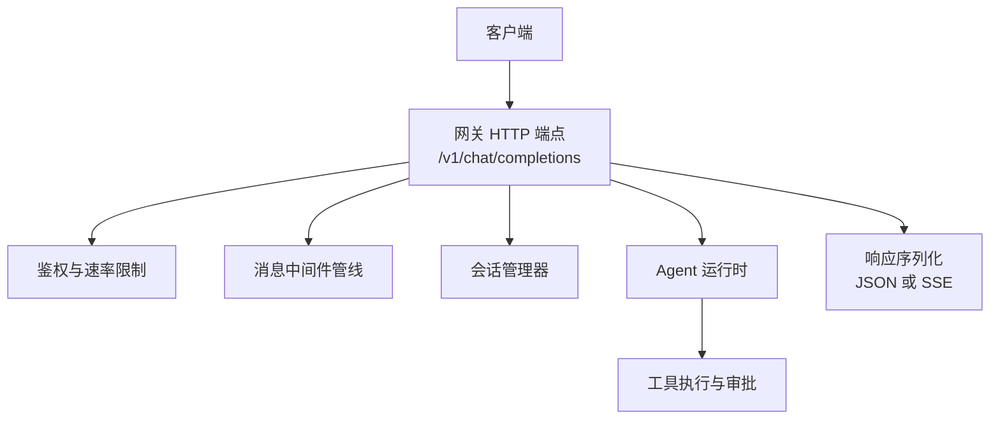
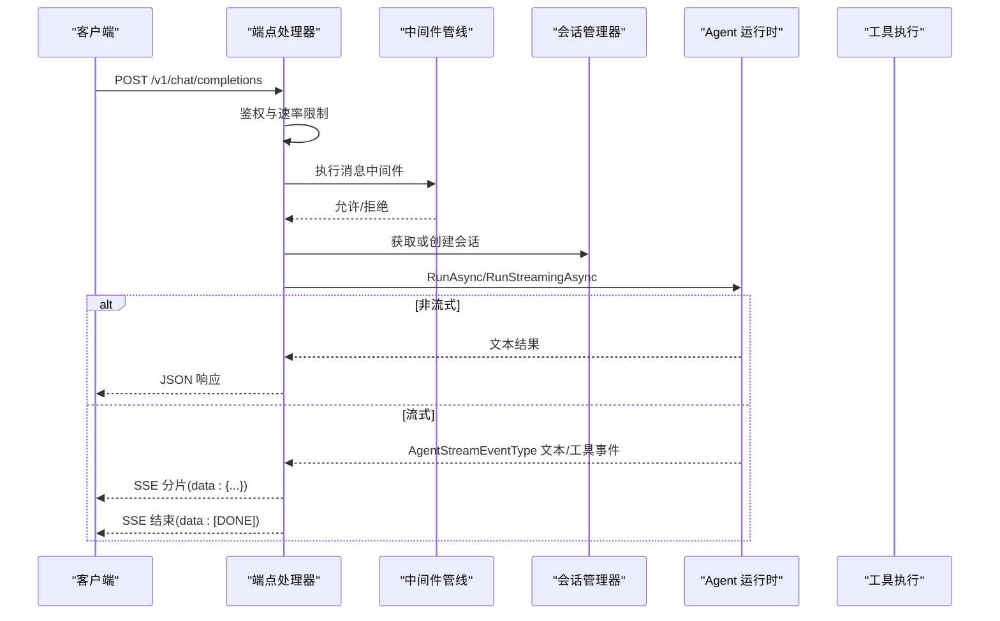
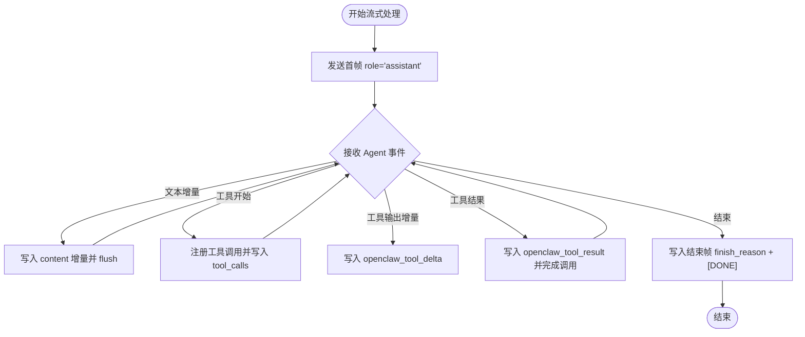
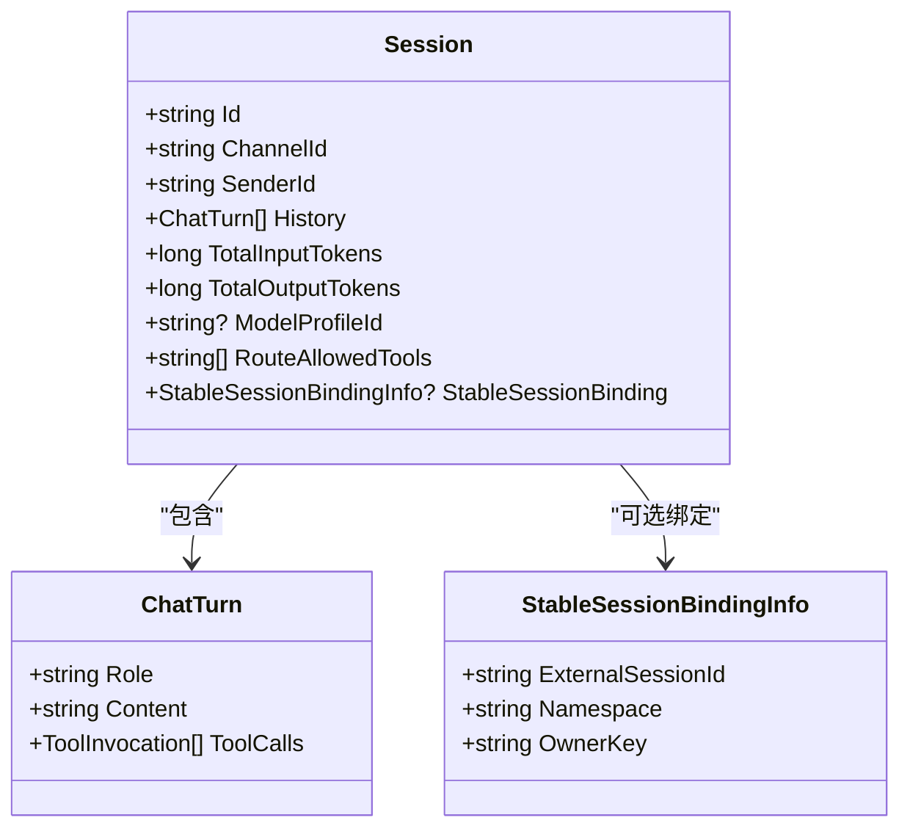
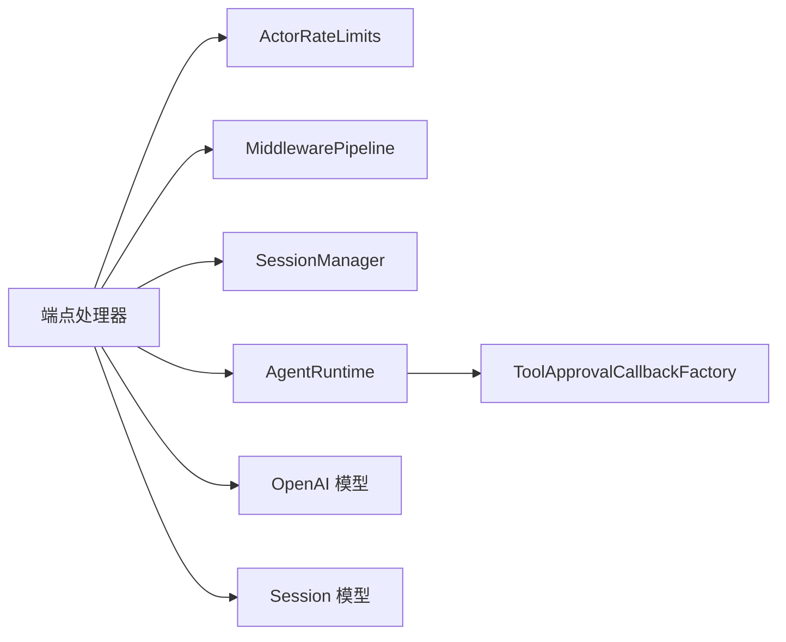

# 聊天补全接口

<cite>
**本文引用的文件**
- [OpenAiEndpoints.ChatCompletions.cs](file://src/OpenClaw.Gateway/Endpoints/OpenAiEndpoints.ChatCompletions.cs)
- [OpenAiEndpoints.cs](file://src/OpenClaw.Gateway/Endpoints/OpenAiEndpoints.cs)
- [OpenAiModels.cs](file://src/OpenClaw.Core/Models/OpenAiModels.cs)
- [Session.cs](file://src/OpenClaw.Core/Models/Session.cs)
- [OpenAiEndpointTests.cs](file://src/OpenClaw.Tests/OpenAiEndpointTests.cs)
- [LocalInferenceSupervisorTests.cs](file://src/OpenClaw.Tests/LocalInferenceSupervisorTests.cs)
- [RateLimitMiddleware.cs](file://src/OpenClaw.Core/Middleware/RateLimitMiddleware.cs)
- [OpenClawHttpClient.cs](file://src/OpenClaw.Client/OpenClawHttpClient.cs)
- [OpenClaw-Session-Management.md](file://docs/OpenClaw-Session-Management.md)
</cite>

## 目录
1. [简介](#简介)
2. [项目结构](#项目结构)
3. [核心组件](#核心组件)
4. [架构总览](#架构总览)
5. [详细组件分析](#详细组件分析)
6. [依赖关系分析](#依赖关系分析)
7. [性能考量](#性能考量)
8. [故障排查指南](#故障排查指南)
9. [结论](#结论)
10. [附录](#附录)

## 简介
本文件面向开发者与集成方，提供 OpenAI 兼容的聊天补全接口 /v1/chat/completions 的完整 API 规范与实现解析。内容涵盖：
- 请求参数与响应格式
- 流式与非流式响应处理机制
- 工具调用在流式响应中的映射
- 上下文管理、会话状态与稳定会话绑定
- 错误处理与速率限制
- 与标准 OpenAI API 的差异与扩展能力

## 项目结构
该接口由网关层的 HTTP 端点映射、请求/响应模型定义、会话管理与中间件共同组成。

图表来源
- [OpenAiEndpoints.ChatCompletions.cs:17-368](file://src/OpenClaw.Gateway/Endpoints/OpenAiEndpoints.ChatCompletions.cs#L17-L368)
- [OpenAiEndpoints.cs:13-20](file://src/OpenClaw.Gateway/Endpoints/OpenAiEndpoints.cs#L13-L20)

章节来源
- [OpenAiEndpoints.ChatCompletions.cs:17-368](file://src/OpenClaw.Gateway/Endpoints/OpenAiEndpoints.ChatCompletions.cs#L17-L368)
- [OpenAiEndpoints.cs:13-20](file://src/OpenClaw.Gateway/Endpoints/OpenAiEndpoints.cs#L13-L20)

## 核心组件
- 端点映射与控制流：负责鉴权、速率限制、请求体读取与反序列化、会话创建/绑定、中间件执行、工具审批回调、流式/非流式响应写入。
- 模型定义：OpenAI 兼容的请求/响应数据结构，含流式分片与工具调用相关字段。
- 会话模型：承载历史、令牌用量、模型配置、路由覆盖等会话状态。
- 中间件：如速率限制等消息级拦截与短路逻辑。
- 客户端：SDK/HTTP 客户端对 /v1/chat/completions 的调用封装。

章节来源
- [OpenAiModels.cs:23-31](file://src/OpenClaw.Core/Models/OpenAiModels.cs#L23-L31)
- [OpenAiModels.cs:188-196](file://src/OpenClaw.Core/Models/OpenAiModels.cs#L188-L196)
- [OpenAiModels.cs:227-254](file://src/OpenClaw.Core/Models/OpenAiModels.cs#L227-L254)
- [Session.cs:15-135](file://src/OpenClaw.Core/Models/Session.cs#L15-L135)
- [RateLimitMiddleware.cs:10-93](file://src/OpenClaw.Core/Middleware/RateLimitMiddleware.cs#L10-L93)
- [OpenClawHttpClient.cs:100](file://src/OpenClaw.Client/OpenClawHttpClient.cs#L100)

## 架构总览
以下序列图展示从客户端到 Agent 运行时再到工具执行的整体流程，以及流式响应的分片写入。

图表来源
- [OpenAiEndpoints.ChatCompletions.cs:17-368](file://src/OpenClaw.Gateway/Endpoints/OpenAiEndpoints.ChatCompletions.cs#L17-L368)
- [OpenAiEndpoints.cs:13-20](file://src/OpenClaw.Gateway/Endpoints/OpenAiEndpoints.cs#L13-L20)

## 详细组件分析

### 请求参数规范
- 端点：POST /v1/chat/completions
- 支持的参数（与 OpenAI 兼容子集）：
  - model：字符串，模型标识；可覆盖会话模型配置
  - messages：数组，消息列表（role/content），至少包含一条
  - stream：布尔，是否启用流式响应
  - temperature：浮点，推理温度（兼容字段，具体行为取决于后端）
  - max_tokens：整数，最大生成长度（兼容字段）
- 多模态 content 支持：content 可为字符串或对象数组，包含 text/image_url 等部分；ToPromptText 将图像转换为占位标记以便提示词处理。
- 请求体大小限制：最大 1MB，超限返回 413 Payload Too Large。

章节来源
- [OpenAiEndpoints.ChatCompletions.cs:35-52](file://src/OpenClaw.Gateway/Endpoints/OpenAiEndpoints.ChatCompletions.cs#L35-L52)
- [OpenAiEndpoints.cs:9](file://src/OpenClaw.Gateway/Endpoints/OpenAiEndpoints.cs#L9)
- [OpenAiModels.cs:23-31](file://src/OpenClaw.Core/Models/OpenAiModels.cs#L23-L31)
- [OpenAiModels.cs:39-84](file://src/OpenClaw.Core/Models/OpenAiModels.cs#L39-L84)

### 响应格式
- 非流式响应：
  - id：完成标识
  - object：固定为 "chat.completion"
  - created：时间戳
  - model：实际使用的模型
  - choices：数组，包含单个元素
    - index：索引
    - message：{ role, content }
    - finish_reason：停止原因
  - usage：{ prompt_tokens, completion_tokens, total_tokens }
- 流式响应（SSE）：
  - object：固定为 "chat.completion.chunk"
  - choices：数组，包含单个元素
    - index：索引
    - delta：包含以下之一或组合
      - role：assistant（首帧）
      - content：文本增量
      - tool_calls：工具调用声明（名称、参数起始）
      - openclaw_tool_delta：工具输出增量（内部字段）
      - openclaw_tool_result：工具结果（含状态、失败信息、下一步）
  - finish_reason：在结束帧出现
- SSE 行格式：每条数据前缀为 "data: "，末尾为 "\n\n"，结束帧为 "data: [DONE]\n\n"。

章节来源
- [OpenAiModels.cs:188-220](file://src/OpenClaw.Core/Models/OpenAiModels.cs#L188-L220)
- [OpenAiModels.cs:227-286](file://src/OpenClaw.Core/Models/OpenAiModels.cs#L227-L286)
- [OpenAiEndpointTests.cs:105-149](file://src/OpenClaw.Tests/OpenAiEndpointTests.cs#L105-L149)
- [OpenAiEndpointTests.cs:153-181](file://src/OpenClaw.Tests/OpenAiEndpointTests.cs#L153-L181)

### 流式响应处理机制
- 首帧：发送包含 role="assistant" 的 delta，随后立即 flush。
- 文本增量：当收到文本增量事件时，写入 content 增量并 flush。
- 工具调用：
  - 工具开始：注册工具调用，生成 call_id，发送 tool_calls 声明（名称、空参数）。
  - 工具输出增量：发送 openclaw_tool_delta，携带 call_id、工具名与内容增量。
  - 工具结果：发送 openclaw_tool_result，包含 call_id、工具名、内容、状态、失败信息、下一步；随后完成该工具调用并继续后续输出。
- 结束帧：发送空 delta 并附带 finish_reason，最后发送 [DONE]。

图表来源
- [OpenAiEndpoints.ChatCompletions.cs:215-318](file://src/OpenClaw.Gateway/Endpoints/OpenAiEndpoints.ChatCompletions.cs#L215-L318)
- [OpenAiModels.cs:244-286](file://src/OpenClaw.Core/Models/OpenAiModels.cs#L244-L286)

章节来源
- [OpenAiEndpoints.ChatCompletions.cs:175-318](file://src/OpenClaw.Gateway/Endpoints/OpenAiEndpoints.ChatCompletions.cs#L175-L318)
- [OpenAiModels.cs:244-286](file://src/OpenClaw.Core/Models/OpenAiModels.cs#L244-L286)

### 上下文管理与会话状态
- 会话创建与键解析：
  - 默认键：channelId:senderId
  - 显式键：支持通过稳定会话头绑定外部会话 ID
- 稳定会话绑定：
  - 通过 X-OpenClaw-Session-Id 头部传递外部会话标识
  - 绑定一致性校验，不一致返回 409 Conflict
  - 绑定成功时，退出时可选择持久化稳定会话
- 会话历史注入：
  - 当启用稳定会话历史水合时，将除最后一个用户消息外的历史注入会话
- 令牌用量：
  - usage 中的 prompt_tokens/completion_tokens/total_tokens 来源于会话累计计数器

图表来源
- [Session.cs:15-135](file://src/OpenClaw.Core/Models/Session.cs#L15-L135)
- [Session.cs:137-143](file://src/OpenClaw.Core/Models/Session.cs#L137-L143)
- [Session.cs:152-179](file://src/OpenClaw.Core/Models/Session.cs#L152-L179)

章节来源
- [OpenAiEndpoints.ChatCompletions.cs:66-96](file://src/OpenClaw.Gateway/Endpoints/OpenAiEndpoints.ChatCompletions.cs#L66-L96)
- [OpenAiEndpoints.ChatCompletions.cs:146-169](file://src/OpenClaw.Gateway/Endpoints/OpenAiEndpoints.ChatCompletions.cs#L146-L169)
- [OpenClaw-Session-Management.md:1-215](file://docs/OpenClaw-Session-Management.md#L1-L215)

### 工具调用与审批
- 工具调用在流式响应中的映射：
  - 工具开始：发送 tool_calls，包含 call_id、名称、初始参数为空
  - 工具输出增量：发送 openclaw_tool_delta，携带 call_id、工具名与内容增量
  - 工具结果：发送 openclaw_tool_result，包含 call_id、工具名、内容、状态、失败信息、下一步
- 审批回调：
  - 基于会话与请求者信息创建审批回调，用于工具执行前的授权决策
- 治理记录：
  - 审批通过/拒绝/过期等决策会被记录到治理账本，便于审计与追踪

章节来源
- [OpenAiEndpoints.ChatCompletions.cs:138-144](file://src/OpenClaw.Gateway/Endpoints/OpenAiEndpoints.ChatCompletions.cs#L138-L144)
- [OpenAiEndpoints.ChatCompletions.cs:250-310](file://src/OpenClaw.Gateway/Endpoints/OpenAiEndpoints.ChatCompletions.cs#L250-L310)
- [OpenAiModels.cs:256-286](file://src/OpenClaw.Core/Models/OpenAiModels.cs#L256-L286)

### 错误处理与鉴权/速率限制
- 鉴权：未通过鉴权返回 401 Unauthorized
- 速率限制：IP 级策略，超出返回 429 Too Many Requests
- 请求体错误：
  - 超大请求：413 Payload Too Large
  - JSON 解析失败：400 Bad Request
  - 缺少消息：400 Bad Request
- 中间件短路：若中间件拒绝，返回 429 并携带短路响应
- 稳定会话绑定不一致：409 Conflict

章节来源
- [OpenAiEndpoints.ChatCompletions.cs:19-30](file://src/OpenClaw.Gateway/Endpoints/OpenAiEndpoints.ChatCompletions.cs#L19-L30)
- [OpenAiEndpoints.ChatCompletions.cs:35-58](file://src/OpenClaw.Gateway/Endpoints/OpenAiEndpoints.ChatCompletions.cs#L35-L58)
- [OpenAiEndpoints.ChatCompletions.cs:85-93](file://src/OpenClaw.Gateway/Endpoints/OpenAiEndpoints.ChatCompletions.cs#L85-L93)
- [RateLimitMiddleware.cs:39-68](file://src/OpenClaw.Core/Middleware/RateLimitMiddleware.cs#L39-L68)

### 与标准 OpenAI API 的差异与扩展
- 差异点：
  - SSE 流式响应中，工具调用相关字段使用内部命名（如 openclaw_tool_delta、openclaw_tool_result），而非标准 function 类型的 arguments 字段
  - 非流式响应不包含 system_fingerprint 字段
- 扩展能力：
  - 稳定会话绑定（X-OpenClaw-Session-Id）
  - 预设头（X-OpenClaw-Preset）用于路由与工具预设选择
  - 会话级模型覆盖与模型配置选择
  - 会话历史水合与令牌用量统计

章节来源
- [OpenAiEndpoints.ChatCompletions.cs:127-137](file://src/OpenClaw.Gateway/Endpoints/OpenAiEndpoints.ChatCompletions.cs#L127-L137)
- [OpenAiEndpoints.ChatCompletions.cs:66-96](file://src/OpenClaw.Gateway/Endpoints/OpenAiEndpoints.ChatCompletions.cs#L66-L96)
- [OpenAiModels.cs:244-286](file://src/OpenClaw.Core/Models/OpenAiModels.cs#L244-L286)

### 请求/响应示例
- 示例请求（非流式）：
  - 方法：POST
  - 路径：/v1/chat/completions
  - 头部：Content-Type: application/json
  - 体：包含 model、messages、stream=false、temperature、max_tokens
- 示例响应（非流式）：
  - Content-Type: application/json
  - 体：包含 id、object、created、model、choices、usage
- 示例请求（流式）：
  - stream=true
- 示例响应（流式）：
  - Content-Type: text/event-stream
  - 多条 data: {...}，最后 data: [DONE]

章节来源
- [OpenAiEndpointTests.cs:15-101](file://src/OpenClaw.Tests/OpenAiEndpointTests.cs#L15-L101)
- [OpenAiEndpointTests.cs:105-149](file://src/OpenClaw.Tests/OpenAiEndpointTests.cs#L105-L149)
- [OpenAiEndpointTests.cs:153-181](file://src/OpenClaw.Tests/OpenAiEndpointTests.cs#L153-L181)
- [LocalInferenceSupervisorTests.cs:342-361](file://src/OpenClaw.Tests/LocalInferenceSupervisorTests.cs#L342-L361)

## 依赖关系分析
- 端点依赖：
  - 鉴权与速率限制：ActorRateLimits
  - 中间件：MiddlewarePipeline
  - 会话管理：SessionManager
  - Agent 运行时：AgentRuntime
  - 工具审批：ToolApprovalCallbackFactory
- 模型依赖：
  - OpenAI 请求/响应模型
  - 会话模型与工具调用相关类型

图表来源
- [OpenAiEndpoints.ChatCompletions.cs:25-144](file://src/OpenClaw.Gateway/Endpoints/OpenAiEndpoints.ChatCompletions.cs#L25-L144)
- [OpenAiModels.cs:23-31](file://src/OpenClaw.Core/Models/OpenAiModels.cs#L23-L31)
- [Session.cs:15-135](file://src/OpenClaw.Core/Models/Session.cs#L15-L135)

章节来源
- [OpenAiEndpoints.ChatCompletions.cs:25-144](file://src/OpenClaw.Gateway/Endpoints/OpenAiEndpoints.ChatCompletions.cs#L25-L144)
- [OpenAiModels.cs:23-31](file://src/OpenClaw.Core/Models/OpenAiModels.cs#L23-L31)
- [Session.cs:15-135](file://src/OpenClaw.Core/Models/Session.cs#L15-L135)

## 性能考量
- 流式响应采用 SSE，逐帧写入并 flush，降低首字延迟
- 会话令牌计数使用原子操作，避免锁竞争
- 会话持久化采用带重试的指数退避策略，提升可靠性
- 中间件速率限制基于滑动窗口，定期清理过期窗口，控制内存占用

章节来源
- [OpenAiEndpoints.ChatCompletions.cs:235-237](file://src/OpenClaw.Gateway/Endpoints/OpenAiEndpoints.ChatCompletions.cs#L235-L237)
- [Session.cs:117-131](file://src/OpenClaw.Core/Models/Session.cs#L117-L131)
- [OpenClaw-Session-Management.md:52-60](file://docs/OpenClaw-Session-Management.md#L52-L60)
- [RateLimitMiddleware.cs:70-91](file://src/OpenClaw.Core/Middleware/RateLimitMiddleware.cs#L70-L91)

## 故障排查指南
- 400 Bad Request
  - JSON 解析失败：检查请求体格式
  - 缺少消息：确保 messages 至少包含一条
- 401 Unauthorized：检查鉴权头或密钥
- 409 Conflict：稳定会话绑定不一致，确认绑定键与当前请求者匹配
- 413 Payload Too Large：压缩请求体或减少消息长度
- 429 Too Many Requests：降低请求频率或调整速率限制策略
- 流式响应无数据：
  - 确认 stream=true
  - 检查 SSE 客户端是否正确处理 data: 行与 [DONE] 结束帧

章节来源
- [OpenAiEndpoints.ChatCompletions.cs:35-58](file://src/OpenClaw.Gateway/Endpoints/OpenAiEndpoints.ChatCompletions.cs#L35-L58)
- [OpenAiEndpoints.ChatCompletions.cs:19-30](file://src/OpenClaw.Gateway/Endpoints/OpenAiEndpoints.ChatCompletions.cs#L19-L30)
- [OpenAiEndpointTests.cs:153-181](file://src/OpenClaw.Tests/OpenAiEndpointTests.cs#L153-L181)

## 结论
/v1/chat/completions 在本项目中实现了 OpenAI 兼容的聊天补全能力，并在稳定性、工具调用与会话管理方面提供了扩展特性。通过 SSE 流式输出与会话绑定，能够满足多轮对话与工具协作场景的需求。建议在生产环境中结合速率限制与中间件策略，确保系统的稳定性与安全性。

## 附录

### API 定义概览
- 端点：POST /v1/chat/completions
- 请求体字段：
  - model：字符串（可选）
  - messages：数组（必填）
  - stream：布尔（可选，默认 false）
  - temperature：浮点（可选）
  - max_tokens：整数（可选）
- 响应体字段（非流式）：
  - id、object、created、model、choices、usage
- 响应体字段（流式）：
  - object、choices[].delta（role、content、tool_calls、openclaw_tool_delta、openclaw_tool_result）、finish_reason

章节来源
- [OpenAiModels.cs:23-31](file://src/OpenClaw.Core/Models/OpenAiModels.cs#L23-L31)
- [OpenAiModels.cs:188-220](file://src/OpenClaw.Core/Models/OpenAiModels.cs#L188-L220)
- [OpenAiModels.cs:227-286](file://src/OpenClaw.Core/Models/OpenAiModels.cs#L227-L286)