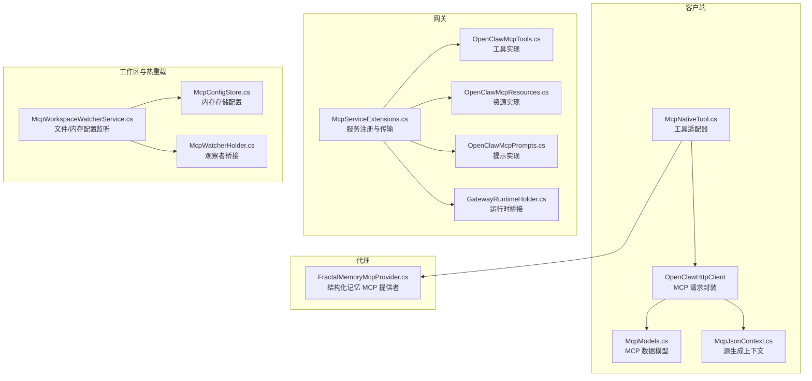
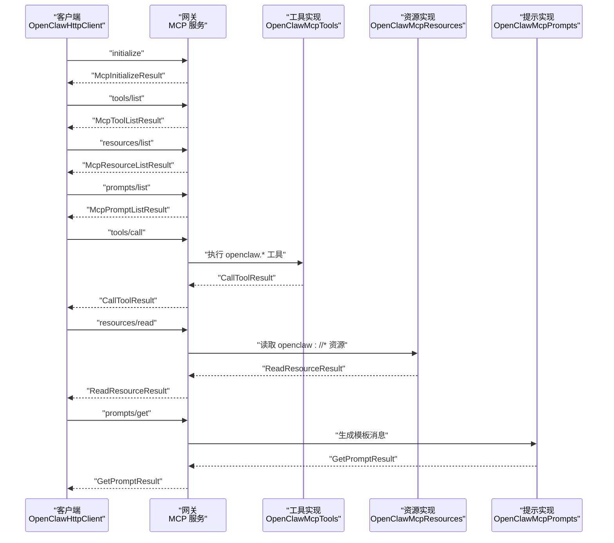
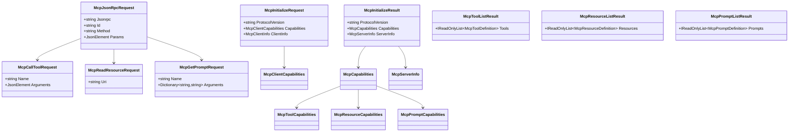
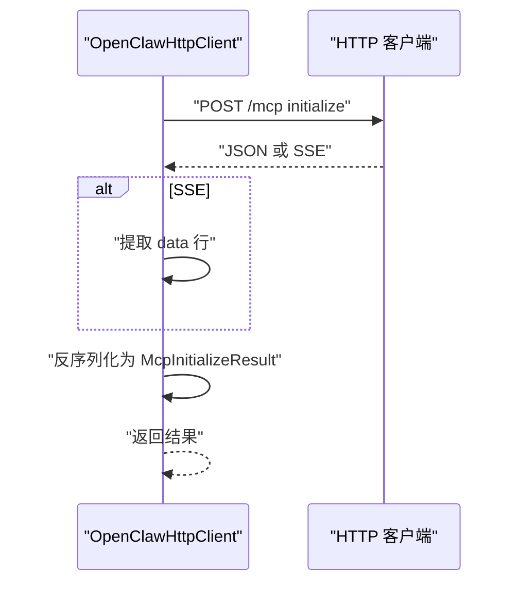
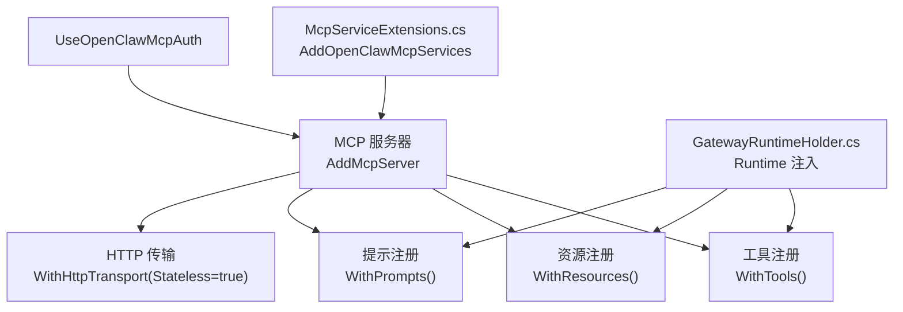
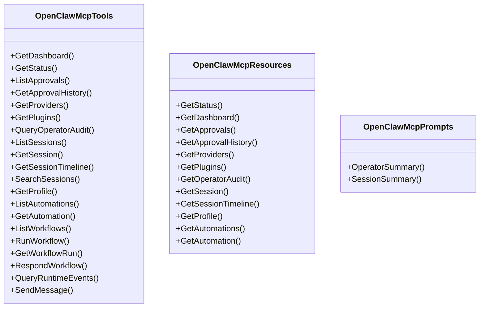
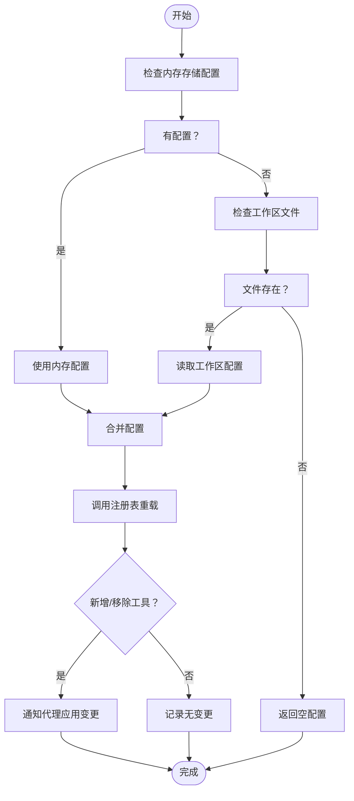
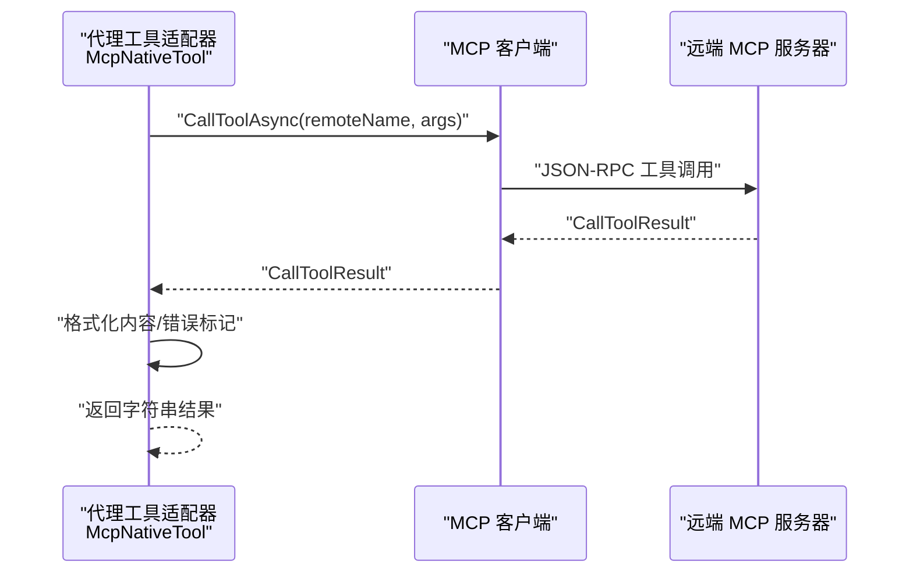
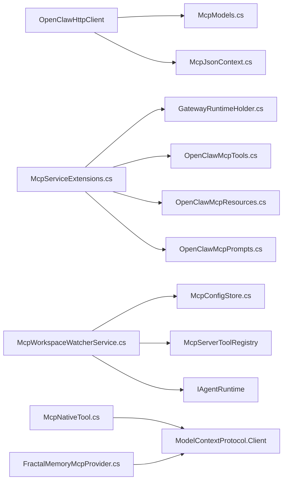

# MCP 协议

<cite>
**本文引用的文件**
- [McpModels.cs](file://src/OpenClaw.Client/McpModels.cs)
- [McpJsonContext.cs](file://src/OpenClaw.Client/McpJsonContext.cs)
- [OpenClawHttpClient.cs](file://src/OpenClaw.Client/OpenClawHttpClient.cs)
- [McpServiceExtensions.cs](file://src/OpenClaw.Gateway/Mcp/McpServiceExtensions.cs)
- [OpenClawMcpTools.cs](file://src/OpenClaw.Gateway/Mcp/OpenClawMcpTools.cs)
- [OpenClawMcpResources.cs](file://src/OpenClaw.Gateway/Mcp/OpenClawMcpResources.cs)
- [OpenClawMcpPrompts.cs](file://src/OpenClaw.Gateway/Mcp/OpenClawMcpPrompts.cs)
- [GatewayRuntimeHolder.cs](file://src/OpenClaw.Gateway/Mcp/GatewayRuntimeHolder.cs)
- [McpWatcherHolder.cs](file://src/OpenClaw.Gateway/Mcp/McpWatcherHolder.cs)
- [McpWorkspaceWatcherService.cs](file://src/OpenClaw.Gateway/McpWorkspaceWatcherService.cs)
- [McpConfigStore.cs](file://src/OpenClaw.Gateway/Mcp/McpConfigStore.cs)
- [McpNativeTool.cs](file://src/OpenClaw.Agent/Tools/McpNativeTool.cs)
- [FractalMemoryMcpProvider.cs](file://src/OpenClaw.Agent/Memory/FractalMemoryMcpProvider.cs)
</cite>

## 目录
1. [简介](#简介)
2. [项目结构](#项目结构)
3. [核心组件](#核心组件)
4. [架构总览](#架构总览)
5. [详细组件分析](#详细组件分析)
6. [依赖关系分析](#依赖关系分析)
7. [性能考量](#性能考量)
8. [故障排查指南](#故障排查指南)
9. [结论](#结论)
10. [附录](#附录)

## 简介
本文件系统性阐述 OpenClaw 中对 MCP（Model Context Protocol）协议的实现与使用，覆盖客户端与服务器交互、工具注册、资源与提示管理、消息格式与序列化、工作区热重载与安全授权等主题。文档面向开发者与运维人员，既提供代码级细节，也给出可操作的最佳实践。

## 项目结构
围绕 MCP 的实现主要分布在以下模块：
- 客户端侧：MCP 消息模型与 JSON 序列化上下文、HTTP 客户端封装、工具适配器
- 网关侧：MCP 服务注册与传输、工具/资源/提示实现、运行时桥接与鉴权中间件
- 工作区与热重载：工作区配置存储与监听、动态工具注册刷新
- 代理侧：MCP 工具适配器与结构化记忆 MCP 提供者

图表来源
- [OpenClawHttpClient.cs:262-320](file://src/OpenClaw.Client/OpenClawHttpClient.cs#L262-L320)
- [McpModels.cs:1-187](file://src/OpenClaw.Client/McpModels.cs#L1-L187)
- [McpJsonContext.cs:1-39](file://src/OpenClaw.Client/McpJsonContext.cs#L1-L39)
- [McpServiceExtensions.cs:20-55](file://src/OpenClaw.Gateway/Mcp/McpServiceExtensions.cs#L20-L55)
- [OpenClawMcpTools.cs:14-319](file://src/OpenClaw.Gateway/Mcp/OpenClawMcpTools.cs#L14-L319)
- [OpenClawMcpResources.cs:9-116](file://src/OpenClaw.Gateway/Mcp/OpenClawMcpResources.cs#L9-L116)
- [OpenClawMcpPrompts.cs:12-71](file://src/OpenClaw.Gateway/Mcp/OpenClawMcpPrompts.cs#L12-L71)
- [GatewayRuntimeHolder.cs:10-20](file://src/OpenClaw.Gateway/Mcp/GatewayRuntimeHolder.cs#L10-L20)
- [McpWorkspaceWatcherService.cs:20-221](file://src/OpenClaw.Gateway/McpWorkspaceWatcherService.cs#L20-L221)
- [McpConfigStore.cs:11-110](file://src/OpenClaw.Gateway/Mcp/McpConfigStore.cs#L11-L110)
- [McpWatcherHolder.cs:7-10](file://src/OpenClaw.Gateway/Mcp/McpWatcherHolder.cs#L7-L10)
- [McpNativeTool.cs:9-118](file://src/OpenClaw.Agent/Tools/McpNativeTool.cs#L9-L118)
- [FractalMemoryMcpProvider.cs:13-330](file://src/OpenClaw.Agent/Memory/FractalMemoryMcpProvider.cs#L13-L330)

章节来源
- [OpenClawHttpClient.cs:262-320](file://src/OpenClaw.Client/OpenClawHttpClient.cs#L262-L320)
- [McpServiceExtensions.cs:20-55](file://src/OpenClaw.Gateway/Mcp/McpServiceExtensions.cs#L20-L55)

## 核心组件
- 客户端模型与序列化
  - 定义了 JSON-RPC 2.0 封装、初始化请求/结果、工具/资源/提示相关模型，以及源生成上下文以提升序列化性能与安全性。
- 网关 MCP 服务
  - 通过官方 MCP AspNetCore 扩展注册工具、资源、提示，并注入运行时桥接对象。
- 工具/资源/提示实现
  - 工具类以“openclaw.*”命名兼容现有客户端；资源基于 URI 模板；提示为纯模板消息集合。
- 工作区热重载
  - 监听内存存储或工作区文件变更，动态加载/卸载 MCP 服务器并热更新工具集。
- 代理适配器
  - 将 MCP 工具调用包装为 ITool 接口；结构化记忆 MCP 提供者通过 STDIO 传输连接外部 MCP 服务器。

章节来源
- [McpModels.cs:1-187](file://src/OpenClaw.Client/McpModels.cs#L1-L187)
- [McpJsonContext.cs:1-39](file://src/OpenClaw.Client/McpJsonContext.cs#L1-L39)
- [OpenClawMcpTools.cs:14-319](file://src/OpenClaw.Gateway/Mcp/OpenClawMcpTools.cs#L14-L319)
- [OpenClawMcpResources.cs:9-116](file://src/OpenClaw.Gateway/Mcp/OpenClawMcpResources.cs#L9-L116)
- [OpenClawMcpPrompts.cs:12-71](file://src/OpenClaw.Gateway/Mcp/OpenClawMcpPrompts.cs#L12-L71)
- [McpWorkspaceWatcherService.cs:20-221](file://src/OpenClaw.Gateway/McpWorkspaceWatcherService.cs#L20-L221)
- [McpNativeTool.cs:9-118](file://src/OpenClaw.Agent/Tools/McpNativeTool.cs#L9-L118)
- [FractalMemoryMcpProvider.cs:13-330](file://src/OpenClaw.Agent/Memory/FractalMemoryMcpProvider.cs#L13-L330)

## 架构总览
下图展示客户端与网关之间的 MCP 交互路径，以及工作区热重载如何影响工具注册。

图表来源
- [OpenClawHttpClient.cs:262-320](file://src/OpenClaw.Client/OpenClawHttpClient.cs#L262-L320)
- [OpenClawMcpTools.cs:21-319](file://src/OpenClaw.Gateway/Mcp/OpenClawMcpTools.cs#L21-L319)
- [OpenClawMcpResources.cs:16-115](file://src/OpenClaw.Gateway/Mcp/OpenClawMcpResources.cs#L16-L115)
- [OpenClawMcpPrompts.cs:15-71](file://src/OpenClaw.Gateway/Mcp/OpenClawMcpPrompts.cs#L15-L71)

## 详细组件分析

### 客户端：MCP 模型与 JSON 序列化
- 模型设计
  - JSON-RPC 2.0 封装用于统一请求/响应结构。
  - 初始化请求包含协议版本、客户端能力与信息；初始化结果包含协议版本、能力与服务器信息。
  - 工具/资源/提示相关模型分别描述列表与读取/调用参数。
- 源生成上下文
  - 使用 [JsonSerializable] 对所有 MCP 模型进行源生成，启用驼峰命名、忽略空值、禁用缩进，提升性能与一致性。

图表来源
- [McpModels.cs:5-187](file://src/OpenClaw.Client/McpModels.cs#L5-L187)
- [McpJsonContext.cs:5-38](file://src/OpenClaw.Client/McpJsonContext.cs#L5-L38)

章节来源
- [McpModels.cs:1-187](file://src/OpenClaw.Client/McpModels.cs#L1-L187)
- [McpJsonContext.cs:1-39](file://src/OpenClaw.Client/McpJsonContext.cs#L1-L39)

### 客户端：HTTP 客户端与 MCP 方法封装
- 关键方法
  - initialize、tools/list、resources/list、resources/templates/list、resources/read、prompts/list、prompts/get、tools/call。
- 错误处理
  - 解析 SSE 响应时提取 data 行；对空响应体、错误字段、缺失结果进行显式校验与异常抛出。
- 使用建议
  - 在调用前确保已建立授权与会话；对流式响应按行解析并拼接文本。

图表来源
- [OpenClawHttpClient.cs:262-263](file://src/OpenClaw.Client/OpenClawHttpClient.cs#L262-L263)
- [OpenClawHttpClient.cs:1308-1325](file://src/OpenClaw.Client/OpenClawHttpClient.cs#L1308-L1325)

章节来源
- [OpenClawHttpClient.cs:262-320](file://src/OpenClaw.Client/OpenClawHttpClient.cs#L262-L320)
- [OpenClawHttpClient.cs:1308-1325](file://src/OpenClaw.Client/OpenClawHttpClient.cs#L1308-L1325)

### 网关：MCP 服务注册与传输
- 服务注册
  - 通过 AddMcpServer 注册 MCP 服务器，设置 ServerInfo；配置 HTTP 无状态传输；注册工具/资源/提示类型。
- 运行时桥接
  - 通过 GatewayRuntimeHolder 将网关运行时注入到工具/资源/提示实现中，实现业务能力访问。
- 鉴权与限流
  - 在 /mcp 路径上强制令牌鉴权与速率限制，复用网关通用策略。

图表来源
- [McpServiceExtensions.cs:20-91](file://src/OpenClaw.Gateway/Mcp/McpServiceExtensions.cs#L20-L91)
- [GatewayRuntimeHolder.cs:10-20](file://src/OpenClaw.Gateway/Mcp/GatewayRuntimeHolder.cs#L10-L20)

章节来源
- [McpServiceExtensions.cs:20-91](file://src/OpenClaw.Gateway/Mcp/McpServiceExtensions.cs#L20-L91)
- [GatewayRuntimeHolder.cs:10-20](file://src/OpenClaw.Gateway/Mcp/GatewayRuntimeHolder.cs#L10-L20)

### 网关：工具、资源与提示实现
- 工具实现
  - 以特性标注暴露工具方法，名称遵循 openclaw.* 兼容约定；参数通过 JSON 序列化为字符串返回。
- 资源实现
  - 以 URI 模板定义资源，支持路径参数；返回 JSON 序列化结果。
- 提示实现
  - 以纯模板方式生成用户消息，指导模型使用资源与工具。

图表来源
- [OpenClawMcpTools.cs:14-319](file://src/OpenClaw.Gateway/Mcp/OpenClawMcpTools.cs#L14-L319)
- [OpenClawMcpResources.cs:9-116](file://src/OpenClaw.Gateway/Mcp/OpenClawMcpResources.cs#L9-L116)
- [OpenClawMcpPrompts.cs:12-71](file://src/OpenClaw.Gateway/Mcp/OpenClawMcpPrompts.cs#L12-L71)

章节来源
- [OpenClawMcpTools.cs:14-319](file://src/OpenClaw.Gateway/Mcp/OpenClawMcpTools.cs#L14-L319)
- [OpenClawMcpResources.cs:9-116](file://src/OpenClaw.Gateway/Mcp/OpenClawMcpResources.cs#L9-L116)
- [OpenClawMcpPrompts.cs:12-71](file://src/OpenClaw.Gateway/Mcp/OpenClawMcpPrompts.cs#L12-L71)

### 工作区热重载与配置持久化
- 配置来源优先级
  - 内存存储配置（由管理 API 写入，容器内可靠）优先于工作区文件。
- 热重载流程
  - 监听变更事件，合并配置后调用注册表重载；计算新增/移除工具，通知代理运行时应用变更。
- 最佳实践
  - 通过内存存储写入配置，避免文件系统争用；在容器环境中依赖内存存储以保证一致性。

图表来源
- [McpWorkspaceWatcherService.cs:105-151](file://src/OpenClaw.Gateway/McpWorkspaceWatcherService.cs#L105-L151)
- [McpConfigStore.cs:53-89](file://src/OpenClaw.Gateway/Mcp/McpConfigStore.cs#L53-L89)

章节来源
- [McpWorkspaceWatcherService.cs:20-221](file://src/OpenClaw.Gateway/McpWorkspaceWatcherService.cs#L20-L221)
- [McpConfigStore.cs:11-110](file://src/OpenClaw.Gateway/Mcp/McpConfigStore.cs#L11-L110)

### 代理：MCP 工具适配器与结构化记忆提供者
- MCP 工具适配器
  - 将 MCP 工具调用封装为 ITool.ExecuteAsync，解析参数 JSON，调用远程工具，格式化返回内容。
- 结构化记忆 MCP 提供者
  - 通过 STDIO 传输连接外部 MCP 服务器，提供搜索、打开、最近条目、导出、手柄创建、验证与索引刷新等能力；内置超时与异常映射。

图表来源
- [McpNativeTool.cs:20-70](file://src/OpenClaw.Agent/Tools/McpNativeTool.cs#L20-L70)

章节来源
- [McpNativeTool.cs:9-118](file://src/OpenClaw.Agent/Tools/McpNativeTool.cs#L9-L118)
- [FractalMemoryMcpProvider.cs:222-277](file://src/OpenClaw.Agent/Memory/FractalMemoryMcpProvider.cs#L222-L277)

## 依赖关系分析
- 客户端依赖
  - OpenClawHttpClient 依赖 MCP 模型与源生成上下文；内部封装 JSON-RPC 请求/响应与 SSE 解析。
- 网关依赖
  - MCP 服务扩展依赖运行时持有者与集成门面；工具/资源/提示实现依赖运行时提供的业务能力。
- 工作区依赖
  - 工作区监听服务依赖注册表与代理运行时；配置存储提供原子写入与解析。
- 代理依赖
  - MCP 工具适配器依赖 MCP 客户端；结构化记忆提供者依赖 STDIO 传输与外部 MCP 服务器。

图表来源
- [OpenClawHttpClient.cs:262-320](file://src/OpenClaw.Client/OpenClawHttpClient.cs#L262-L320)
- [McpModels.cs:1-187](file://src/OpenClaw.Client/McpModels.cs#L1-L187)
- [McpJsonContext.cs:1-39](file://src/OpenClaw.Client/McpJsonContext.cs#L1-L39)
- [McpServiceExtensions.cs:20-55](file://src/OpenClaw.Gateway/Mcp/McpServiceExtensions.cs#L20-L55)
- [GatewayRuntimeHolder.cs:10-20](file://src/OpenClaw.Gateway/Mcp/GatewayRuntimeHolder.cs#L10-L20)
- [OpenClawMcpTools.cs:14-319](file://src/OpenClaw.Gateway/Mcp/OpenClawMcpTools.cs#L14-L319)
- [OpenClawMcpResources.cs:9-116](file://src/OpenClaw.Gateway/Mcp/OpenClawMcpResources.cs#L9-L116)
- [OpenClawMcpPrompts.cs:12-71](file://src/OpenClaw.Gateway/Mcp/OpenClawMcpPrompts.cs#L12-L71)
- [McpWorkspaceWatcherService.cs:20-221](file://src/OpenClaw.Gateway/McpWorkspaceWatcherService.cs#L20-L221)
- [McpConfigStore.cs:11-110](file://src/OpenClaw.Gateway/Mcp/McpConfigStore.cs#L11-L110)
- [McpNativeTool.cs:9-118](file://src/OpenClaw.Agent/Tools/McpNativeTool.cs#L9-L118)
- [FractalMemoryMcpProvider.cs:13-330](file://src/OpenClaw.Agent/Memory/FractalMemoryMcpProvider.cs#L13-L330)

章节来源
- [OpenClawHttpClient.cs:262-320](file://src/OpenClaw.Client/OpenClawHttpClient.cs#L262-L320)
- [McpServiceExtensions.cs:20-55](file://src/OpenClaw.Gateway/Mcp/McpServiceExtensions.cs#L20-L55)
- [McpWorkspaceWatcherService.cs:20-221](file://src/OpenClaw.Gateway/McpWorkspaceWatcherService.cs#L20-L221)

## 性能考量
- 源生成序列化
  - 使用 [JsonSerializable] 与源生成上下文，减少反射开销，提升序列化/反序列化性能与内存占用。
- 无状态 HTTP 传输
  - 网关采用 HTTP 无状态传输，降低连接管理复杂度，便于横向扩展。
- 流式响应解析
  - 客户端对 SSE 响应按行解析，避免一次性缓冲大块数据，提高实时性与内存效率。
- 工作区热重载去抖
  - 使用有界通道（丢弃最旧）合并快速文件事件，减少重复重载带来的 CPU 与 IO 压力。

章节来源
- [McpJsonContext.cs:34-38](file://src/OpenClaw.Client/McpJsonContext.cs#L34-L38)
- [McpServiceExtensions.cs:40-43](file://src/OpenClaw.Gateway/Mcp/McpServiceExtensions.cs#L40-L43)
- [OpenClawHttpClient.cs:214-260](file://src/OpenClaw.Client/OpenClawHttpClient.cs#L214-L260)
- [McpWorkspaceWatcherService.cs:31-40](file://src/OpenClaw.Gateway/McpWorkspaceWatcherService.cs#L31-L40)

## 故障排查指南
- 客户端错误
  - 空响应体、错误字段、缺少结果：在发送与解析阶段进行显式校验并抛出异常，便于定位问题。
  - SSE 解析失败：检查 data 行是否存在与 JSON 可解析性。
- 网关鉴权与限流
  - /mcp 路径未通过令牌鉴权或触发速率限制时，直接返回 401/429，需检查请求头与 IP 限流配置。
- 工作区配置
  - 内存存储配置缺失或解析失败时，回退到工作区文件；若两者均不可用则移除所有工作区服务器。
- 代理 MCP 工具
  - 参数 JSON 非法、调用超时、外部服务器不可用等均有明确异常映射与日志记录，便于快速诊断。

章节来源
- [OpenClawHttpClient.cs:1297-1306](file://src/OpenClaw.Client/OpenClawHttpClient.cs#L1297-L1306)
- [OpenClawHttpClient.cs:1308-1325](file://src/OpenClaw.Client/OpenClawHttpClient.cs#L1308-L1325)
- [McpServiceExtensions.cs:66-88](file://src/OpenClaw.Gateway/Mcp/McpServiceExtensions.cs#L66-L88)
- [McpWorkspaceWatcherService.cs:109-129](file://src/OpenClaw.Gateway/McpWorkspaceWatcherService.cs#L109-L129)
- [McpNativeTool.cs:58-70](file://src/OpenClaw.Agent/Tools/McpNativeTool.cs#L58-L70)
- [FractalMemoryMcpProvider.cs:239-277](file://src/OpenClaw.Agent/Memory/FractalMemoryMcpProvider.cs#L239-L277)

## 结论
OpenClaw 对 MCP 的实现遵循官方协议与最佳实践：客户端以源生成上下文提升性能，网关通过特性注册工具/资源/提示并注入运行时，工作区热重载保障动态扩展，代理适配器与结构化记忆提供者打通外部 MCP 服务器。整体方案具备良好的可维护性、可观测性与扩展性。

## 附录
- 协议版本与能力
  - 客户端初始化请求包含协议版本与客户端能力；初始化结果包含服务器能力与信息，用于协商与能力发现。
- 安全与合规
  - /mcp 路径强制令牌鉴权与速率限制；工具调用与资源读取均在受控网关内完成，避免直接暴露后端系统。
- 最佳实践清单
  - 使用内存存储持久化工作区 MCP 配置，避免文件争用；
  - 在容器环境优先依赖内存存储；
  - 对工具参数进行严格 JSON 校验与类型转换；
  - 合理设置超时与取消令牌，避免阻塞；
  - 记录关键错误与异常，便于排障。