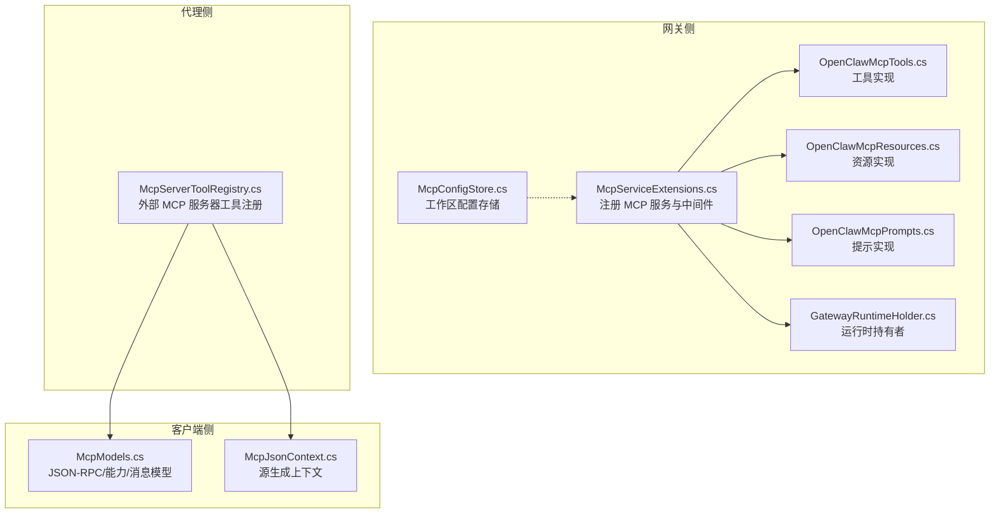
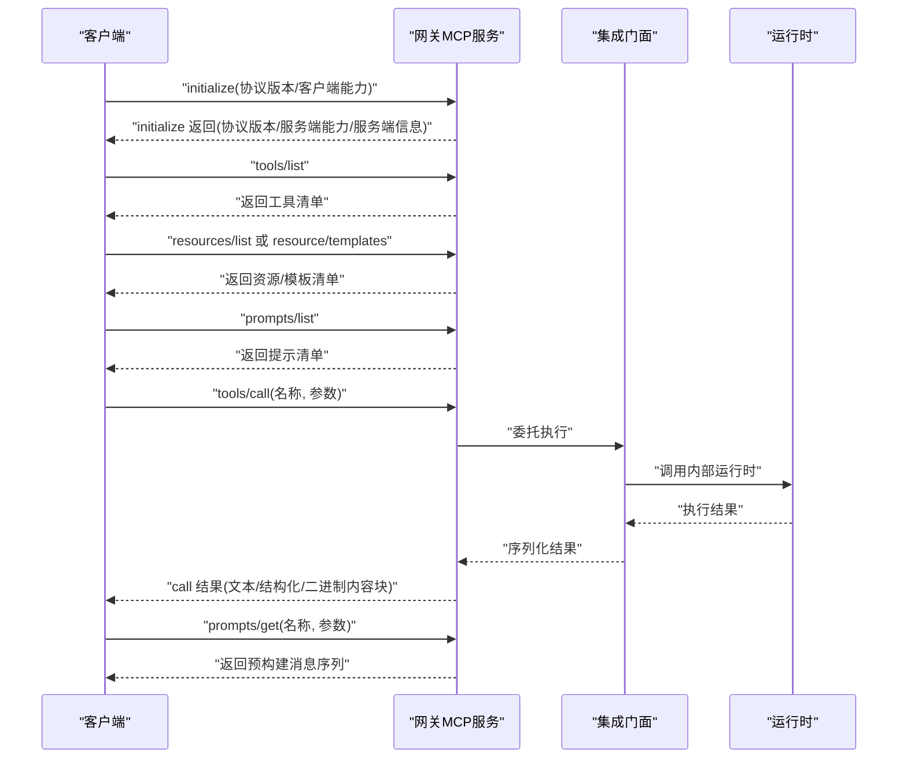
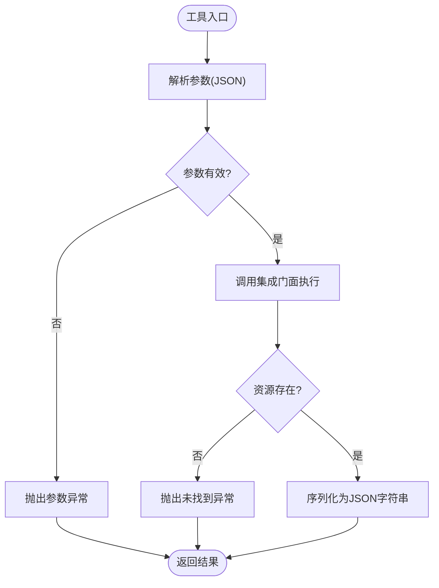
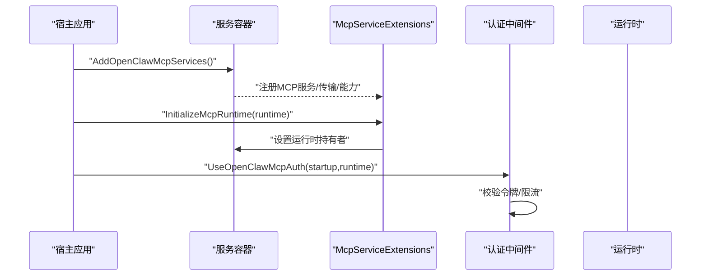
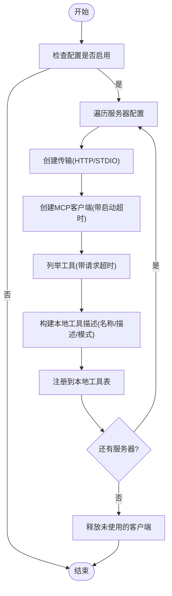
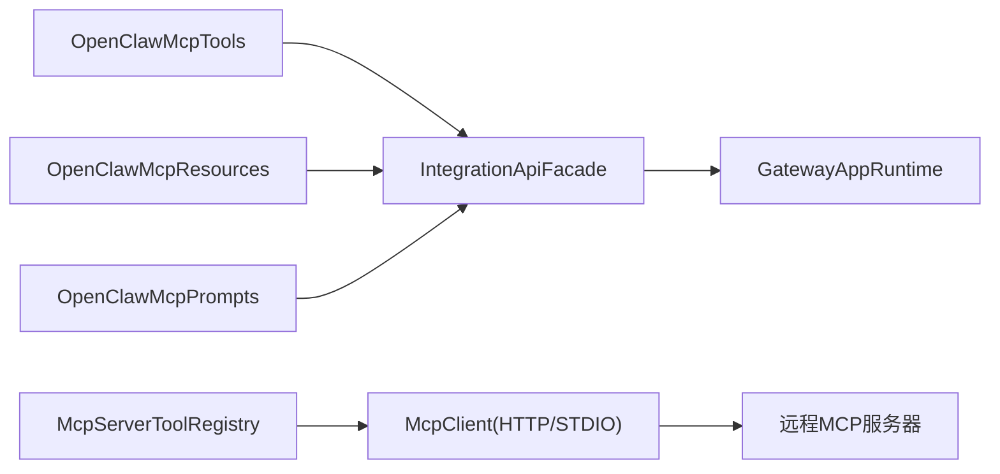

# MCP 协议

<cite>
**本文引用的文件**
- [OpenClawMcpResources.cs](file://src/OpenClaw.Gateway/Mcp/OpenClawMcpResources.cs)
- [OpenClawMcpTools.cs](file://src/OpenClaw.Gateway/Mcp/OpenClawMcpTools.cs)
- [OpenClawMcpPrompts.cs](file://src/OpenClaw.Gateway/Mcp/OpenClawMcpPrompts.cs)
- [McpServiceExtensions.cs](file://src/OpenClaw.Gateway/Mcp/McpServiceExtensions.cs)
- [McpConfigStore.cs](file://src/OpenClaw.Gateway/Mcp/McpConfigStore.cs)
- [GatewayRuntimeHolder.cs](file://src/OpenClaw.Gateway/Mcp/GatewayRuntimeHolder.cs)
- [McpModels.cs](file://src/OpenClaw.Client/McpModels.cs)
- [McpJsonContext.cs](file://src/OpenClaw.Client/McpJsonContext.cs)
- [McpServerToolRegistry.cs](file://src/OpenClaw.Agent/Plugins/McpServerToolRegistry.cs)
- [McpServerToolRegistryTests.cs](file://src/OpenClaw.Tests/McpServerToolRegistryTests.cs)
</cite>

## 目录
1. [简介](#简介)
2. [项目结构](#项目结构)
3. [核心组件](#核心组件)
4. [架构总览](#架构总览)
5. [详细组件分析](#详细组件分析)
6. [依赖关系分析](#依赖关系分析)
7. [性能考量](#性能考量)
8. [故障排查指南](#故障排查指南)
9. [结论](#结论)
10. [附录](#附录)

## 简介
本文件为 OpenClaw.NET 的 Model Context Protocol（MCP）协议参考文档，覆盖 MCP 服务器实现、资源访问、工具调用与提示管理的完整规范。内容包括：
- 协议消息格式与能力声明
- 握手过程与认证机制
- 错误处理策略
- 客户端集成示例与资源发现、工具注册流程
- 协议版本兼容性与扩展机制

该实现基于官方 ModelContextProtocol.AspNetCore SDK，提供 HTTP 无状态传输，支持工具、资源与提示三类能力，并在网关侧通过统一门面适配内部运行时。

## 项目结构
围绕 MCP 的关键代码分布在以下模块：
- 网关侧 MCP 服务端：工具、资源、提示的实现与服务注册
- 客户端侧模型定义：JSON-RPC 请求/响应、初始化参数、能力声明等
- 工具注册器：从外部 MCP 服务器发现并注册为本地工具
- 配置存储：工作区 MCP 配置持久化与加载

图表来源
- [McpServiceExtensions.cs:1-91](file://src/OpenClaw.Gateway/Mcp/McpServiceExtensions.cs#L1-L91)
- [OpenClawMcpTools.cs:1-319](file://src/OpenClaw.Gateway/Mcp/OpenClawMcpTools.cs#L1-L319)
- [OpenClawMcpResources.cs:1-116](file://src/OpenClaw.Gateway/Mcp/OpenClawMcpResources.cs#L1-L116)
- [OpenClawMcpPrompts.cs:1-71](file://src/OpenClaw.Gateway/Mcp/OpenClawMcpPrompts.cs#L1-L71)
- [GatewayRuntimeHolder.cs:1-21](file://src/OpenClaw.Gateway/Mcp/GatewayRuntimeHolder.cs#L1-L21)
- [McpConfigStore.cs:1-110](file://src/OpenClaw.Gateway/Mcp/McpConfigStore.cs#L1-L110)
- [McpModels.cs:1-187](file://src/OpenClaw.Client/McpModels.cs#L1-L187)
- [McpJsonContext.cs:1-39](file://src/OpenClaw.Client/McpJsonContext.cs#L1-L39)
- [McpServerToolRegistry.cs:1-369](file://src/OpenClaw.Agent/Plugins/McpServerToolRegistry.cs#L1-L369)

章节来源
- [McpServiceExtensions.cs:1-91](file://src/OpenClaw.Gateway/Mcp/McpServiceExtensions.cs#L1-L91)
- [OpenClawMcpTools.cs:1-319](file://src/OpenClaw.Gateway/Mcp/OpenClawMcpTools.cs#L1-L319)
- [OpenClawMcpResources.cs:1-116](file://src/OpenClaw.Gateway/Mcp/OpenClawMcpResources.cs#L1-L116)
- [OpenClawMcpPrompts.cs:1-71](file://src/OpenClaw.Gateway/Mcp/OpenClawMcpPrompts.cs#L1-L71)
- [GatewayRuntimeHolder.cs:1-21](file://src/OpenClaw.Gateway/Mcp/GatewayRuntimeHolder.cs#L1-L21)
- [McpConfigStore.cs:1-110](file://src/OpenClaw.Gateway/Mcp/McpConfigStore.cs#L1-L110)
- [McpModels.cs:1-187](file://src/OpenClaw.Client/McpModels.cs#L1-L187)
- [McpJsonContext.cs:1-39](file://src/OpenClaw.Client/McpJsonContext.cs#L1-L39)
- [McpServerToolRegistry.cs:1-369](file://src/OpenClaw.Agent/Plugins/McpServerToolRegistry.cs#L1-L369)

## 核心组件
- MCP 服务注册与中间件
  - 在服务注册阶段添加 MCP 服务器、HTTP 传输、工具/资源/提示注册，并注入运行时持有者。
  - 提供 MCP 认证中间件，对 /mcp 路径请求执行令牌校验与速率限制。
- 工具实现
  - 基于统一门面适配内部运行时，暴露状态、仪表盘、审批、会话、自动化、工作流、事件查询、消息入队等工具。
- 资源实现
  - 暴露 openclaw:// 前缀资源 URI，如状态、仪表盘、审批、插件、审计、会话详情与时间线、用户画像、自动化等。
- 提示实现
  - 提供模板化提示，指导模型使用资源与工具进行操作，如运营摘要与会话摘要。
- 客户端模型
  - 定义 JSON-RPC 请求/响应、初始化请求/结果、能力声明、工具/资源/提示定义与消息结构。
- 外部 MCP 工具注册
  - 连接外部 MCP 服务器，列举工具、解析输入模式，注册为本地工具；支持 HTTP/STDIO 传输与环境变量/密钥解析。

章节来源
- [McpServiceExtensions.cs:20-91](file://src/OpenClaw.Gateway/Mcp/McpServiceExtensions.cs#L20-L91)
- [OpenClawMcpTools.cs:14-319](file://src/OpenClaw.Gateway/Mcp/OpenClawMcpTools.cs#L14-L319)
- [OpenClawMcpResources.cs:9-116](file://src/OpenClaw.Gateway/Mcp/OpenClawMcpResources.cs#L9-L116)
- [OpenClawMcpPrompts.cs:12-71](file://src/OpenClaw.Gateway/Mcp/OpenClawMcpPrompts.cs#L12-L71)
- [McpModels.cs:5-187](file://src/OpenClaw.Client/McpModels.cs#L5-L187)
- [McpServerToolRegistry.cs:16-369](file://src/OpenClaw.Agent/Plugins/McpServerToolRegistry.cs#L16-L369)

## 架构总览
下图展示 MCP 服务器端到客户端的交互路径，以及工具/资源/提示的注册与调用流程。

图表来源
- [McpServiceExtensions.cs:32-46](file://src/OpenClaw.Gateway/Mcp/McpServiceExtensions.cs#L32-L46)
- [OpenClawMcpTools.cs:21-319](file://src/OpenClaw.Gateway/Mcp/OpenClawMcpTools.cs#L21-L319)
- [OpenClawMcpResources.cs:16-116](file://src/OpenClaw.Gateway/Mcp/OpenClawMcpResources.cs#L16-L116)
- [OpenClawMcpPrompts.cs:15-71](file://src/OpenClaw.Gateway/Mcp/OpenClawMcpPrompts.cs#L15-L71)
- [McpModels.cs:27-187](file://src/OpenClaw.Client/McpModels.cs#L27-L187)

## 详细组件分析

### 工具实现（OpenClawMcpTools）
- 能力范围
  - 获取状态、仪表盘快照、审批列表与历史、提供商路由与用量、插件健康、操作员审计、会话列表/详情/时间线、会话搜索、用户画像、自动化列表/详情、工作流运行与响应、运行时事件查询、消息入队等。
- 参数与返回
  - 工具方法通过特性标注名称、只读属性与描述；参数采用 JSON Schema 输入模式；返回值统一序列化为 JSON 字符串。
- 异常处理
  - 对不存在的会话或自动化抛出键未找到异常；工作流输入负载采用 JSON 解析，非法 JSON 抛出参数异常。

图表来源
- [OpenClawMcpTools.cs:303-317](file://src/OpenClaw.Gateway/Mcp/OpenClawMcpTools.cs#L303-L317)
- [OpenClawMcpTools.cs:117-126](file://src/OpenClaw.Gateway/Mcp/OpenClawMcpTools.cs#L117-L126)
- [OpenClawMcpTools.cs:182-191](file://src/OpenClaw.Gateway/Mcp/OpenClawMcpTools.cs#L182-L191)

章节来源
- [OpenClawMcpTools.cs:14-319](file://src/OpenClaw.Gateway/Mcp/OpenClawMcpTools.cs#L14-L319)

### 资源实现（OpenClawMcpResources）
- 资源 URI 模板
  - openclaw://status、openclaw://dashboard、openclaw://approvals、openclaw://approvals/history、openclaw://providers、openclaw://plugins、openclaw://operator-audit、openclaw://sessions/{sessionId}、openclaw://sessions/{sessionId}/timeline、openclaw://profiles/{actorId}、openclaw://automations、openclaw://automations/{automationId}。
- 行为特征
  - 读取内部运行时数据并序列化为 JSON 文本内容；对不存在的会话/画像等资源抛出未找到异常。

章节来源
- [OpenClawMcpResources.cs:9-116](file://src/OpenClaw.Gateway/Mcp/OpenClawMcpResources.cs#L9-L116)

### 提示实现（OpenClawMcpPrompts）
- 提示类型
  - openclaw_operator_summary：引导模型汇总网关健康状况，按顺序读取仪表盘、状态、审批、提供商、插件与审计等资源。
  - openclaw_session_summary：针对指定会话生成摘要，读取会话详情与时间线，并结合运行时事件与提供商活动解释当前状态。
- 输出结构
  - 返回预构建的消息序列（含角色与文本内容块），便于模型直接使用 MCP 资源与工具。

章节来源
- [OpenClawMcpPrompts.cs:12-71](file://src/OpenClaw.Gateway/Mcp/OpenClawMcpPrompts.cs#L12-L71)

### 服务注册与认证（McpServiceExtensions）
- 服务注册
  - 添加 MCP 服务器、HTTP 传输（无状态）、工具/资源/提示注册；设置 ServerInfo 名称与版本。
  - 注册运行时持有者，供后续初始化填充。
- 运行时初始化
  - 在应用启动后将实际运行时注入持有者，确保工具/资源/提示可访问。
- 认证与限流
  - 中间件对 /mcp 路径请求执行授权校验与 IP+动作维度的速率限制。

图表来源
- [McpServiceExtensions.cs:20-91](file://src/OpenClaw.Gateway/Mcp/McpServiceExtensions.cs#L20-L91)

章节来源
- [McpServiceExtensions.cs:11-91](file://src/OpenClaw.Gateway/Mcp/McpServiceExtensions.cs#L11-L91)

### 客户端模型与源生成（McpModels / McpJsonContext）
- JSON-RPC
  - 请求/响应结构、错误对象、初始化请求/结果、客户端能力与服务端信息。
- 能力声明
  - 工具、资源、提示的能力字段，用于客户端与服务端协商。
- 消息与内容
  - 工具调用结果的内容块类型（文本/结构化/图像等）。
- 源生成
  - 使用 System.Text.Json.SourceGeneration 生成序列化上下文，提升性能与安全性。

章节来源
- [McpModels.cs:5-187](file://src/OpenClaw.Client/McpModels.cs#L5-L187)
- [McpJsonContext.cs:5-39](file://src/OpenClaw.Client/McpJsonContext.cs#L5-L39)

### 外部 MCP 工具注册（McpServerToolRegistry）
- 功能
  - 连接外部 MCP 服务器（HTTP/STDIO），列举工具，解析输入模式，注册为本地工具。
  - 支持超时控制、并发加载互斥、环境变量与密钥解析、工具名前缀与规范化。
- 流程
  - 逐个服务器建立传输、创建客户端、列举工具、构造本地工具描述并注册。
- 错误处理
  - 任一服务器失败时清理已建立的客户端连接；释放资源时忽略异常以保证幂等。

图表来源
- [McpServerToolRegistry.cs:78-138](file://src/OpenClaw.Agent/Plugins/McpServerToolRegistry.cs#L78-L138)
- [McpServerToolRegistry.cs:225-246](file://src/OpenClaw.Agent/Plugins/McpServerToolRegistry.cs#L225-L246)

章节来源
- [McpServerToolRegistry.cs:16-369](file://src/OpenClaw.Agent/Plugins/McpServerToolRegistry.cs#L16-L369)

## 依赖关系分析
- 组件耦合
  - 工具/资源/提示均依赖集成门面与运行时持有者；运行时在应用初始化后注入。
  - 客户端模型独立于服务端实现，通过 JSON-RPC 协议交互。
- 外部依赖
  - 使用官方 ModelContextProtocol.AspNetCore SDK；HTTP 传输依赖 HttpClientTransport；STDIO 传输依赖 StdioClientTransport。
- 配置与持久化
  - 工作区 MCP 配置存储于内存卷目录，独立于工作区文件系统监听。

图表来源
- [OpenClawMcpTools.cs:17-319](file://src/OpenClaw.Gateway/Mcp/OpenClawMcpTools.cs#L17-L319)
- [OpenClawMcpResources.cs:12-116](file://src/OpenClaw.Gateway/Mcp/OpenClawMcpResources.cs#L12-L116)
- [OpenClawMcpPrompts.cs:13-71](file://src/OpenClaw.Gateway/Mcp/OpenClawMcpPrompts.cs#L13-L71)
- [McpServerToolRegistry.cs:99-103](file://src/OpenClaw.Agent/Plugins/McpServerToolRegistry.cs#L99-L103)

章节来源
- [McpServiceExtensions.cs:24-30](file://src/OpenClaw.Gateway/Mcp/McpServiceExtensions.cs#L24-L30)
- [GatewayRuntimeHolder.cs:10-20](file://src/OpenClaw.Gateway/Mcp/GatewayRuntimeHolder.cs#L10-L20)
- [McpServerToolRegistry.cs:225-246](file://src/OpenClaw.Agent/Plugins/McpServerToolRegistry.cs#L225-L246)

## 性能考量
- 序列化优化
  - 使用源生成上下文减少反射开销，提升 JSON-RPC 往返性能。
- 并发与互斥
  - 工具注册使用信号量确保并发安全，避免重复加载与竞态。
- 传输选择
  - HTTP 传输适合跨进程/网络场景；STDIO 传输适合本地进程内通信，延迟更低。
- 速率限制
  - 中间件对 /mcp 路径实施 IP+动作维度限流，防止滥用。

章节来源
- [McpJsonContext.cs:34-39](file://src/OpenClaw.Client/McpJsonContext.cs#L34-L39)
- [McpServerToolRegistry.cs:20-41](file://src/OpenClaw.Agent/Plugins/McpServerToolRegistry.cs#L20-L41)
- [McpServiceExtensions.cs:66-89](file://src/OpenClaw.Gateway/Mcp/McpServiceExtensions.cs#L66-L89)

## 故障排查指南
- 初始化失败
  - 检查客户端协议版本与服务端支持版本是否匹配；确认服务端 ServerInfo 与能力声明。
- 工具/资源未发现
  - 确认服务端已正确注册工具/资源/提示；客户端是否正确列举并缓存清单。
- 认证失败
  - /mcp 路径请求需满足网关端点授权策略；检查令牌与来源地址策略。
- 速率限制触发
  - 观察 429 Too Many Requests 响应，调整客户端重试策略与并发度。
- 外部 MCP 服务器不可达
  - 检查传输类型（HTTP/STDIO）、URL/命令与参数、超时设置；查看环境变量与密钥解析结果。
- 工具参数错误
  - 核对输入模式与 JSON 结构；注意非法 JSON 会导致参数异常。

章节来源
- [McpModels.cs:42-76](file://src/OpenClaw.Client/McpModels.cs#L42-L76)
- [McpServiceExtensions.cs:66-89](file://src/OpenClaw.Gateway/Mcp/McpServiceExtensions.cs#L66-L89)
- [McpServerToolRegistry.cs:225-246](file://src/OpenClaw.Agent/Plugins/McpServerToolRegistry.cs#L225-L246)
- [McpServerToolRegistryTests.cs:25-107](file://src/OpenClaw.Tests/McpServerToolRegistryTests.cs#L25-L107)

## 结论
OpenClaw.NET 的 MCP 实现遵循官方 SDK 规范，提供稳定的服务端能力与灵活的客户端交互方式。通过统一门面适配内部运行时，工具、资源与提示能够无缝对接业务能力；同时支持外部 MCP 服务器的动态发现与注册，增强生态扩展性。建议在生产环境中配合严格的认证与限流策略，确保安全与稳定性。

## 附录

### 协议版本与兼容性
- 协议版本
  - 客户端初始化返回的协议版本号用于双方协商。
- 服务端信息
  - 服务端名称与版本在初始化结果中返回，便于客户端识别与日志追踪。

章节来源
- [McpModels.cs:42-47](file://src/OpenClaw.Client/McpModels.cs#L42-L47)
- [McpServiceExtensions.cs:32-43](file://src/OpenClaw.Gateway/Mcp/McpServiceExtensions.cs#L32-L43)

### 扩展机制
- 工具/资源/提示扩展
  - 通过特性标注新增实现，无需修改核心框架；保持命名空间与前缀一致性。
- 外部 MCP 服务器
  - 支持多服务器配置与热重载占位；当前构建不支持运行时热交换 MCP 工具，但保留返回空增量的接口。

章节来源
- [OpenClawMcpTools.cs:14-319](file://src/OpenClaw.Gateway/Mcp/OpenClawMcpTools.cs#L14-L319)
- [OpenClawMcpResources.cs:9-116](file://src/OpenClaw.Gateway/Mcp/OpenClawMcpResources.cs#L9-L116)
- [OpenClawMcpPrompts.cs:12-71](file://src/OpenClaw.Gateway/Mcp/OpenClawMcpPrompts.cs#L12-L71)
- [McpServerToolRegistry.cs:357-367](file://src/OpenClaw.Agent/Plugins/McpServerToolRegistry.cs#L357-L367)