# MCP 协议

<cite>
**本文引用的文件**
- [OpenClawMcpTools.cs](file://src/OpenClaw.Gateway/Mcp/OpenClawMcpTools.cs)
- [OpenClawMcpResources.cs](file://src/OpenClaw.Gateway/Mcp/OpenClawMcpResources.cs)
- [OpenClawMcpPrompts.cs](file://src/OpenClaw.Gateway/Mcp/OpenClawMcpPrompts.cs)
- [McpServiceExtensions.cs](file://src/OpenClaw.Gateway/Mcp/McpServiceExtensions.cs)
- [GatewayRuntimeHolder.cs](file://src/OpenClaw.Gateway/Mcp/GatewayRuntimeHolder.cs)
- [McpWatcherHolder.cs](file://src/OpenClaw.Gateway/Mcp/McpWatcherHolder.cs)
- [McpConfigStore.cs](file://src/OpenClaw.Gateway/Mcp/McpConfigStore.cs)
- [McpWorkspaceWatcherService.cs](file://src/OpenClaw.Gateway/McpWorkspaceWatcherService.cs)
- [McpServerToolRegistry.cs](file://src/OpenClaw.Agent/Plugins/McpServerToolRegistry.cs)
- [McpNativeTool.cs](file://src/OpenClaw.Agent/Tools/McpNativeTool.cs)
- [FractalMemoryMcpProvider.cs](file://src/OpenClaw.Agent/Memory/FractalMemoryMcpProvider.cs)
- [McpModels.cs](file://src/OpenClaw.Client/McpModels.cs)
- [OpenClawHttpClient.cs](file://src/OpenClaw.Client/OpenClawHttpClient.cs)
- [OpenClawLiveClient.cs](file://src/OpenClaw.Client/OpenClawLiveClient.cs)
- [OpenClawWebSocketClient.cs](file://src/OpenClaw.Client/OpenClawWebSocketClient.cs)
- [McpServerToolRegistryTests.cs](file://src/OpenClaw.Tests/McpServerToolRegistryTests.cs)
</cite>

## 目录
1. [简介](#简介)
2. [项目结构](#项目结构)
3. [核心组件](#核心组件)
4. [架构总览](#架构总览)
5. [详细组件分析](#详细组件分析)
6. [依赖关系分析](#依赖关系分析)
7. [性能考虑](#性能考虑)
8. [故障排除指南](#故障排除指南)
9. [结论](#结论)
10. [附录](#附录)

## 简介
本文件为 OpenClaw.NET 的 MCP（Model Context Protocol）实现提供权威参考文档，覆盖协议工作原理、消息格式与通信流程；记录所有 MCP 端点的功能、参数与响应格式；详解提示管理、资源访问与工具调用的实现；说明 MCP 服务器配置、客户端连接与协议升级过程；提供客户端集成示例、消息处理代码与错误恢复机制；解释与 OpenClaw 内部系统的集成点与数据流转；并给出性能监控、调试工具与故障排除建议。

## 项目结构
MCP 在 OpenClaw 中分为“网关侧服务端”和“代理侧客户端”两部分：
- 网关侧（Gateway）：通过官方 MCP ASP.NET Core 扩展注册工具、资源与提示，暴露给外部 MCP 客户端或内部代理。
- 代理侧（Agent）：从已配置的 MCP 服务器发现工具，桥接为本地工具，供智能体执行。

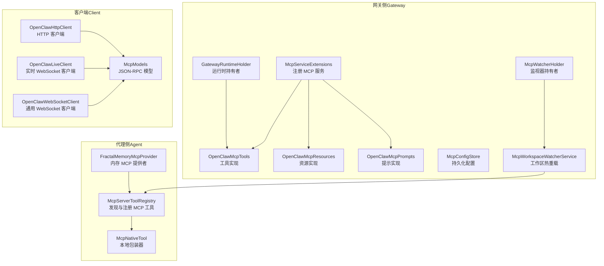

图表来源
- [McpServiceExtensions.cs:1-36](file://src/OpenClaw.Gateway/Mcp/McpServiceExtensions.cs#L1-L36)
- [OpenClawMcpTools.cs:1-319](file://src/OpenClaw.Gateway/Mcp/OpenClawMcpTools.cs#L1-L319)
- [OpenClawMcpResources.cs:1-116](file://src/OpenClaw.Gateway/Mcp/OpenClawMcpResources.cs#L1-L116)
- [OpenClawMcpPrompts.cs:1-71](file://src/OpenClaw.Gateway/Mcp/OpenClawMcpPrompts.cs#L1-L71)
- [GatewayRuntimeHolder.cs:1-21](file://src/OpenClaw.Gateway/Mcp/GatewayRuntimeHolder.cs#L1-L21)
- [McpWatcherHolder.cs:1-11](file://src/OpenClaw.Gateway/Mcp/McpWatcherHolder.cs#L1-L11)
- [McpConfigStore.cs:1-110](file://src/OpenClaw.Gateway/Mcp/McpConfigStore.cs#L1-L110)
- [McpWorkspaceWatcherService.cs:1-221](file://src/OpenClaw.Gateway/McpWorkspaceWatcherService.cs#L1-L221)
- [McpServerToolRegistry.cs:1-369](file://src/OpenClaw.Agent/Plugins/McpServerToolRegistry.cs#L1-L369)
- [McpNativeTool.cs:1-36](file://src/OpenClaw.Agent/Tools/McpNativeTool.cs#L1-L36)
- [FractalMemoryMcpProvider.cs:1-200](file://src/OpenClaw.Agent/Memory/FractalMemoryMcpProvider.cs#L1-L200)
- [McpModels.cs:1-187](file://src/OpenClaw.Client/McpModels.cs#L1-L187)
- [OpenClawHttpClient.cs:254-280](file://src/OpenClaw.Client/OpenClawHttpClient.cs#L254-L280)
- [OpenClawLiveClient.cs:1-303](file://src/OpenClaw.Client/OpenClawLiveClient.cs#L1-L303)
- [OpenClawWebSocketClient.cs:1-248](file://src/OpenClaw.Client/OpenClawWebSocketClient.cs#L1-L248)

章节来源
- [McpServiceExtensions.cs:1-36](file://src/OpenClaw.Gateway/Mcp/McpServiceExtensions.cs#L1-L36)
- [McpWorkspaceWatcherService.cs:1-221](file://src/OpenClaw.Gateway/McpWorkspaceWatcherService.cs#L1-L221)

## 核心组件
- 网关 MCP 服务注册与运行时桥接：通过扩展方法注册 MCP 服务器并注入运行时，使工具/资源/提示可访问内部系统。
- MCP 工具实现：以“openclaw.*”命名空间导出，封装对内部 API 的调用，返回序列化后的结果。
- MCP 资源实现：基于 URI 模板的只读资源，返回聚合状态、会话详情等 JSON。
- MCP 提示实现：纯模板提示，指导模型使用资源与工具。
- 工作区 MCP 配置与热重载：支持内存存储与工作区文件两种来源，无重启热更新。
- 代理侧 MCP 工具发现与桥接：从远端 MCP 服务器拉取工具清单，生成本地工具包装器。
- 客户端模型与 HTTP/WebSocket 客户端：定义 JSON-RPC 消息模型与连接生命周期。

章节来源
- [OpenClawMcpTools.cs:1-319](file://src/OpenClaw.Gateway/Mcp/OpenClawMcpTools.cs#L1-L319)
- [OpenClawMcpResources.cs:1-116](file://src/OpenClaw.Gateway/Mcp/OpenClawMcpResources.cs#L1-L116)
- [OpenClawMcpPrompts.cs:1-71](file://src/OpenClaw.Gateway/Mcp/OpenClawMcpPrompts.cs#L1-L71)
- [McpWorkspaceWatcherService.cs:1-221](file://src/OpenClaw.Gateway/McpWorkspaceWatcherService.cs#L1-L221)
- [McpServerToolRegistry.cs:1-369](file://src/OpenClaw.Agent/Plugins/McpServerToolRegistry.cs#L1-L369)
- [McpModels.cs:1-187](file://src/OpenClaw.Client/McpModels.cs#L1-L187)

## 架构总览
下图展示 MCP 服务器端与客户端之间的交互路径，以及与 OpenClaw 内部系统的集成点。

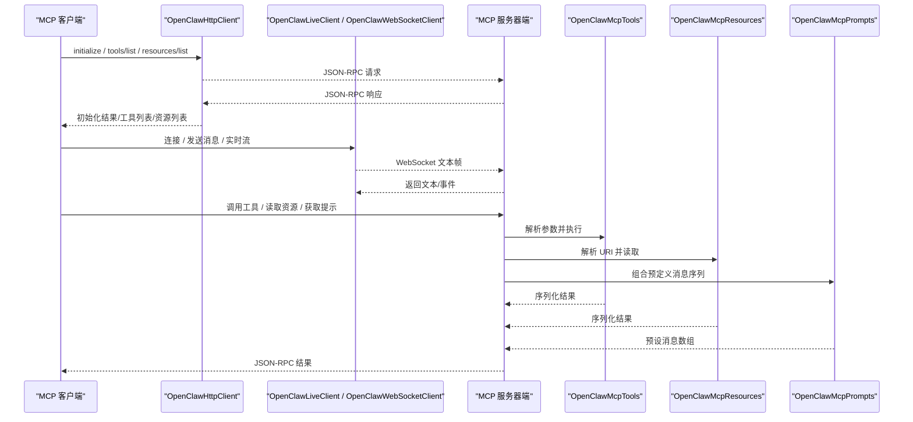

图表来源
- [OpenClawHttpClient.cs:254-280](file://src/OpenClaw.Client/OpenClawHttpClient.cs#L254-L280)
- [OpenClawLiveClient.cs:1-303](file://src/OpenClaw.Client/OpenClawLiveClient.cs#L1-L303)
- [OpenClawWebSocketClient.cs:1-248](file://src/OpenClaw.Client/OpenClawWebSocketClient.cs#L1-L248)
- [OpenClawMcpTools.cs:1-319](file://src/OpenClaw.Gateway/Mcp/OpenClawMcpTools.cs#L1-L319)
- [OpenClawMcpResources.cs:1-116](file://src/OpenClaw.Gateway/Mcp/OpenClawMcpResources.cs#L1-L116)
- [OpenClawMcpPrompts.cs:1-71](file://src/OpenClaw.Gateway/Mcp/OpenClawMcpPrompts.cs#L1-L71)

## 详细组件分析

### 网关 MCP 服务注册与运行时桥接
- 通过扩展方法注册 MCP 服务器，设置 ServerInfo、注入 IntegrationApiFacade，使工具/资源/提示可访问内部状态与 API。
- GatewayRuntimeHolder 与 McpWatcherHolder 在运行时构建后填充，确保请求处理前可用。

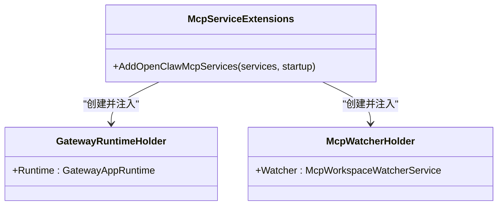

图表来源
- [McpServiceExtensions.cs:1-36](file://src/OpenClaw.Gateway/Mcp/McpServiceExtensions.cs#L1-L36)
- [GatewayRuntimeHolder.cs:1-21](file://src/OpenClaw.Gateway/Mcp/GatewayRuntimeHolder.cs#L1-L21)
- [McpWatcherHolder.cs:1-11](file://src/OpenClaw.Gateway/Mcp/McpWatcherHolder.cs#L1-L11)

章节来源
- [McpServiceExtensions.cs:1-36](file://src/OpenClaw.Gateway/Mcp/McpServiceExtensions.cs#L1-L36)
- [GatewayRuntimeHolder.cs:1-21](file://src/OpenClaw.Gateway/Mcp/GatewayRuntimeHolder.cs#L1-L21)
- [McpWatcherHolder.cs:1-11](file://src/OpenClaw.Gateway/Mcp/McpWatcherHolder.cs#L1-L11)

### MCP 工具实现（OpenClawMcpTools）
- 工具命名：统一以“openclaw.*”前缀，兼容现有客户端。
- 功能覆盖：仪表盘、状态、审批、审计、提供商、插件、会话、自动化、工作流、消息发送等。
- 参数与响应：每个工具方法均声明参数描述，返回序列化后的 JSON 字符串，使用 CoreJsonContext 进行序列化。

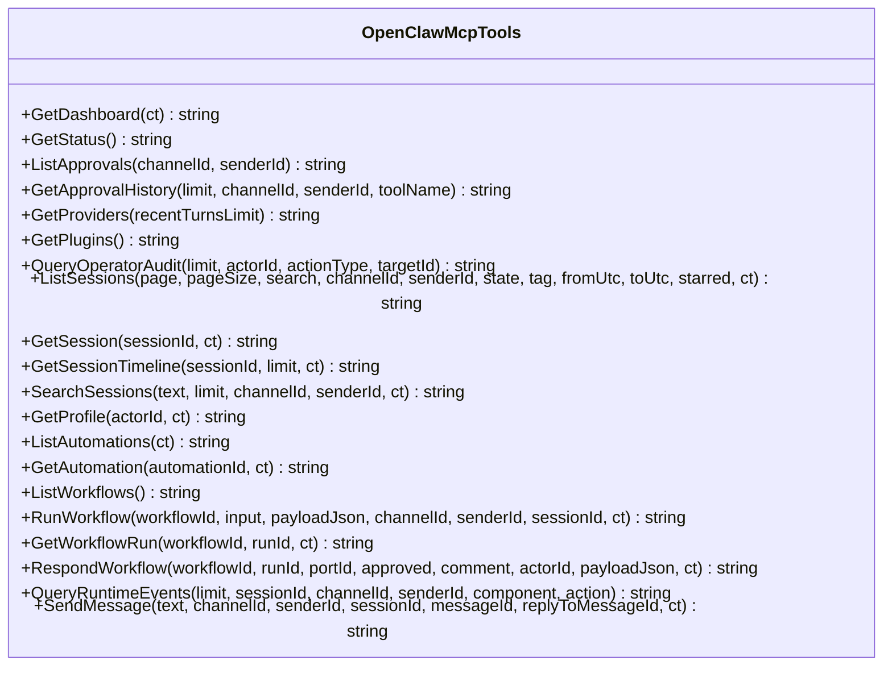

图表来源
- [OpenClawMcpTools.cs:1-319](file://src/OpenClaw.Gateway/Mcp/OpenClawMcpTools.cs#L1-L319)

章节来源
- [OpenClawMcpTools.cs:1-319](file://src/OpenClaw.Gateway/Mcp/OpenClawMcpTools.cs#L1-L319)

### MCP 资源实现（OpenClawMcpResources）
- 资源 URI 模板：如 openclaw://status、openclaw://dashboard、openclaw://sessions/{sessionId} 等。
- 行为：只读资源，按模板解析路径参数，返回聚合状态、会话详情、时间线、用户画像、自动化等 JSON。

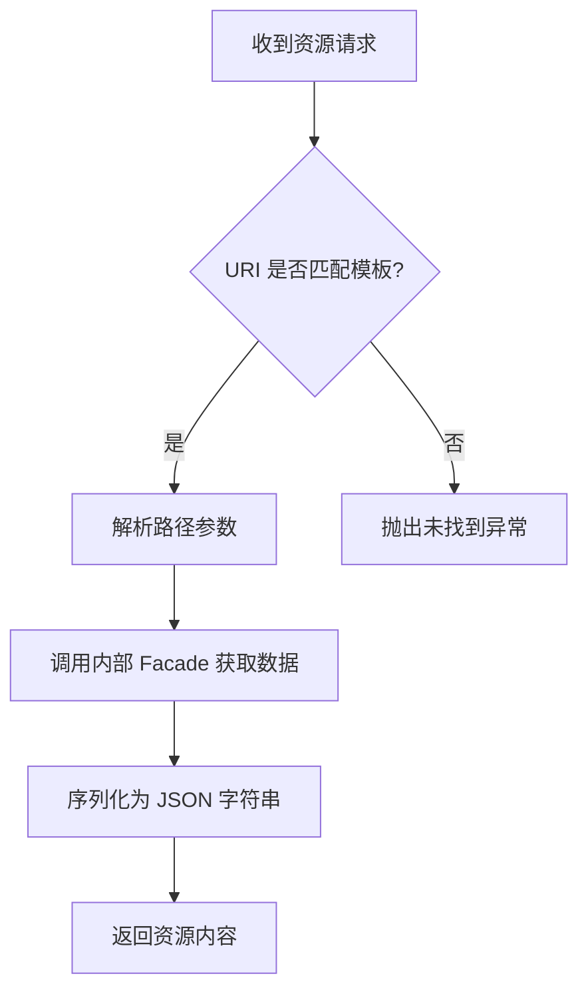

图表来源
- [OpenClawMcpResources.cs:1-116](file://src/OpenClaw.Gateway/Mcp/OpenClawMcpResources.cs#L1-L116)

章节来源
- [OpenClawMcpResources.cs:1-116](file://src/OpenClaw.Gateway/Mcp/OpenClawMcpResources.cs#L1-L116)

### MCP 提示实现（OpenClawMcpPrompts）
- 提示类型：纯模板，不进行 I/O，仅生成预设消息序列。
- 示例：openclaw_operator_summary、openclaw_session_summary，引导模型使用资源与工具。

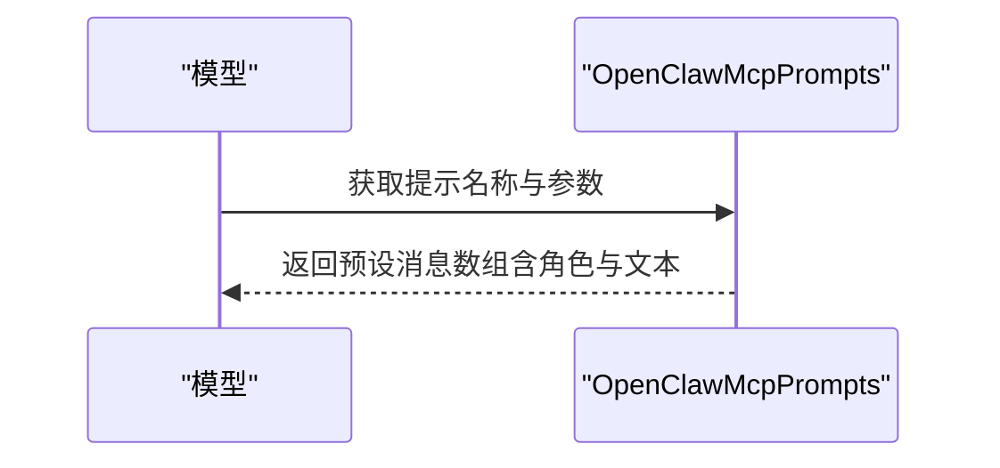

图表来源
- [OpenClawMcpPrompts.cs:1-71](file://src/OpenClaw.Gateway/Mcp/OpenClawMcpPrompts.cs#L1-L71)

章节来源
- [OpenClawMcpPrompts.cs:1-71](file://src/OpenClaw.Gateway/Mcp/OpenClawMcpPrompts.cs#L1-L71)

### 工作区 MCP 配置与热重载（McpConfigStore / McpWorkspaceWatcherService）
- 配置来源优先级：内存存储（McpConfigStore）> 工作区文件（.kingcrab/mcp.json）。
- 热重载机制：带缓冲通道的后台循环，合并快速事件，执行重载并应用到代理工具表。

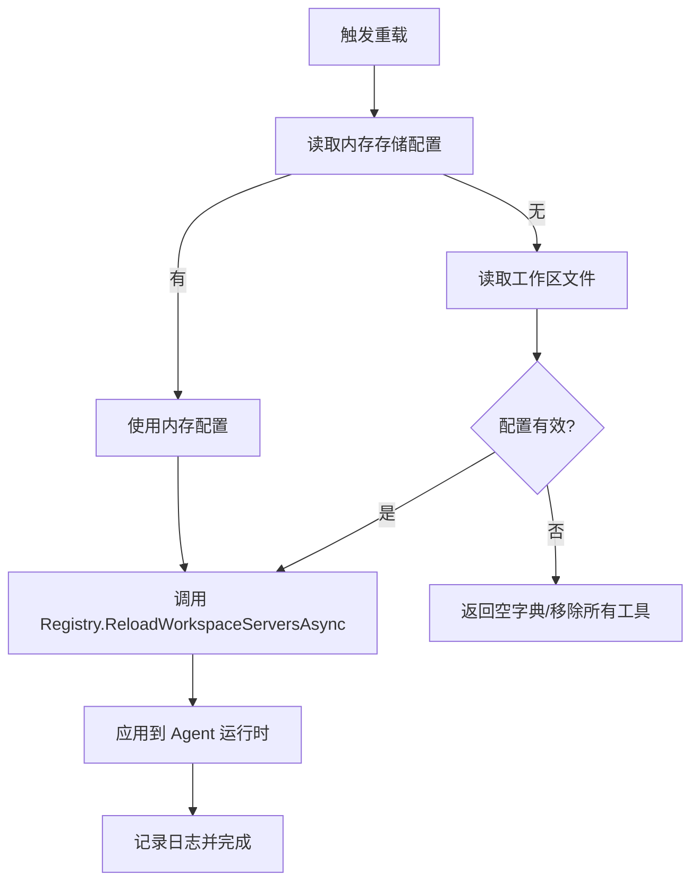

图表来源
- [McpConfigStore.cs:1-110](file://src/OpenClaw.Gateway/Mcp/McpConfigStore.cs#L1-L110)
- [McpWorkspaceWatcherService.cs:1-221](file://src/OpenClaw.Gateway/McpWorkspaceWatcherService.cs#L1-L221)

章节来源
- [McpConfigStore.cs:1-110](file://src/OpenClaw.Gateway/Mcp/McpConfigStore.cs#L1-L110)
- [McpWorkspaceWatcherService.cs:1-221](file://src/OpenClaw.Gateway/McpWorkspaceWatcherService.cs#L1-L221)

### 代理侧 MCP 工具发现与桥接（McpServerToolRegistry / McpNativeTool）
- 发现流程：遍历配置的 MCP 服务器，建立传输（stdio/http），初始化客户端，列出工具。
- 命名与描述：根据 serverId 与前缀规则生成本地工具名，拼接描述信息。
- 包装与注册：将远端工具包装为本地 ITool，注册到原生工具表。

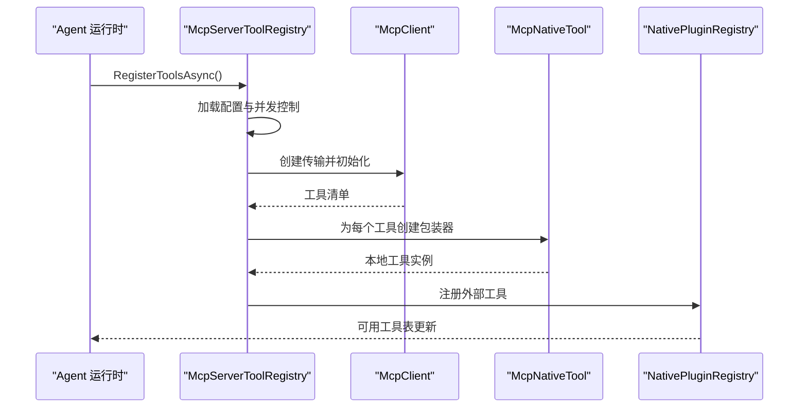

图表来源
- [McpServerToolRegistry.cs:1-369](file://src/OpenClaw.Agent/Plugins/McpServerToolRegistry.cs#L1-L369)
- [McpNativeTool.cs:1-36](file://src/OpenClaw.Agent/Tools/McpNativeTool.cs#L1-L36)

章节来源
- [McpServerToolRegistry.cs:1-369](file://src/OpenClaw.Agent/Plugins/McpServerToolRegistry.cs#L1-L369)
- [McpNativeTool.cs:1-36](file://src/OpenClaw.Agent/Tools/McpNativeTool.cs#L1-L36)

### 客户端模型与消息处理（McpModels / OpenClawHttpClient / WebSocket 客户端）
- JSON-RPC 模型：定义 initialize、tools/list、resources/read、prompts/get 等请求/响应结构。
- HTTP 客户端：封装 JSON-RPC 调用，提供 initialize、list tools/resources/templates、read resource 等方法。
- WebSocket 客户端：支持实时文本/音频/中断/关闭会话等信封类型，事件驱动接收与错误回调。

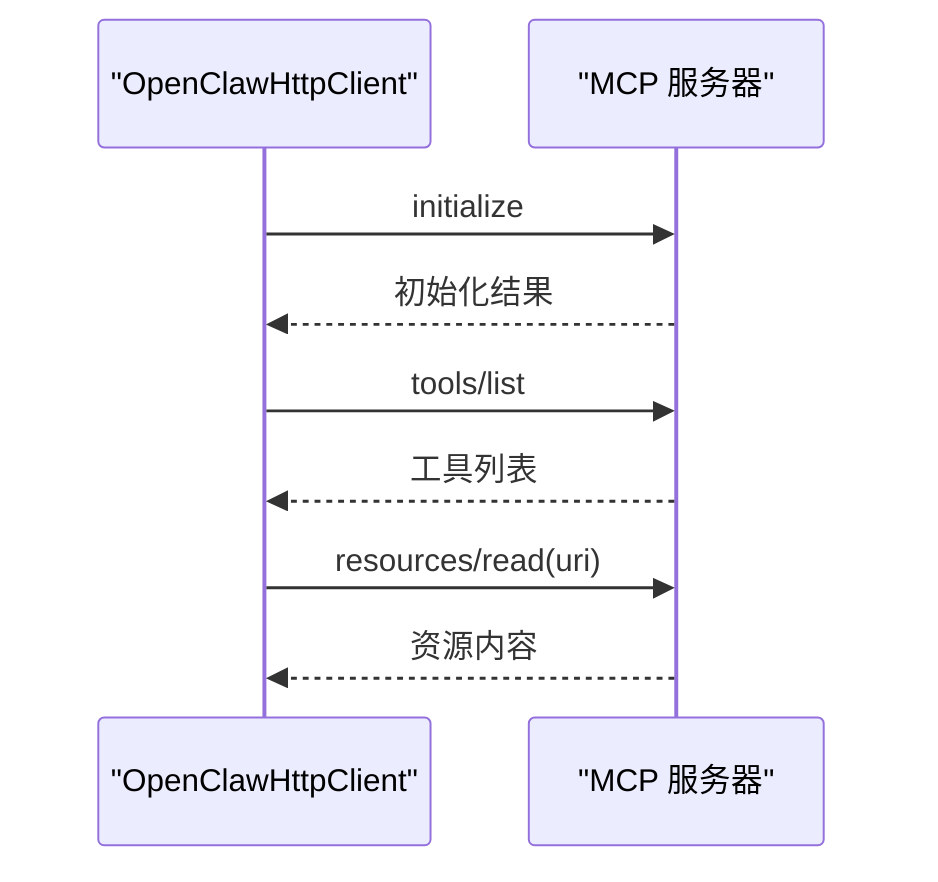

图表来源
- [McpModels.cs:1-187](file://src/OpenClaw.Client/McpModels.cs#L1-L187)
- [OpenClawHttpClient.cs:254-280](file://src/OpenClaw.Client/OpenClawHttpClient.cs#L254-L280)
- [OpenClawLiveClient.cs:1-303](file://src/OpenClaw.Client/OpenClawLiveClient.cs#L1-L303)
- [OpenClawWebSocketClient.cs:1-248](file://src/OpenClaw.Client/OpenClawWebSocketClient.cs#L1-L248)

章节来源
- [McpModels.cs:1-187](file://src/OpenClaw.Client/McpModels.cs#L1-L187)
- [OpenClawHttpClient.cs:254-280](file://src/OpenClaw.Client/OpenClawHttpClient.cs#L254-L280)
- [OpenClawLiveClient.cs:1-303](file://src/OpenClaw.Client/OpenClawLiveClient.cs#L1-L303)
- [OpenClawWebSocketClient.cs:1-248](file://src/OpenClaw.Client/OpenClawWebSocketClient.cs#L1-L248)

### 内存 MCP 提供者（FractalMemoryMcpProvider）
- 功能：封装对 Fractal Memory MCP 工具的调用，支持搜索、打开、最近条目、导出、手柄创建、校验与索引刷新。
- 错误处理：捕获异常并转换为友好的错误消息，区分超时、不可用、参数错误等场景。

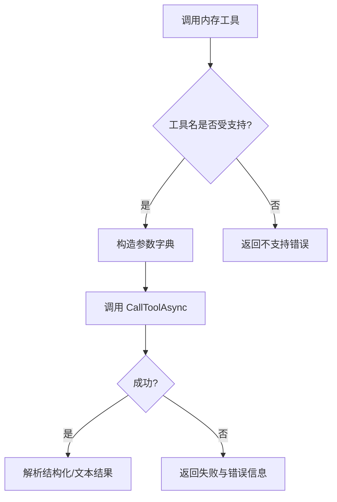

图表来源
- [FractalMemoryMcpProvider.cs:1-200](file://src/OpenClaw.Agent/Memory/FractalMemoryMcpProvider.cs#L1-L200)

章节来源
- [FractalMemoryMcpProvider.cs:1-200](file://src/OpenClaw.Agent/Memory/FractalMemoryMcpProvider.cs#L1-L200)

## 依赖关系分析
- 网关侧依赖：Microsoft.Extensions.DependencyInjection、ModelContextProtocol.AspNetCore、OpenClaw.Core.Abstractions/Models。
- 代理侧依赖：ModelContextProtocol.Client、OpenClaw.Core.Abstractions、安全策略（SecretResolver）。
- 客户端依赖：System.Net.WebSockets、System.Text.Json、OpenClaw.Core.Models。

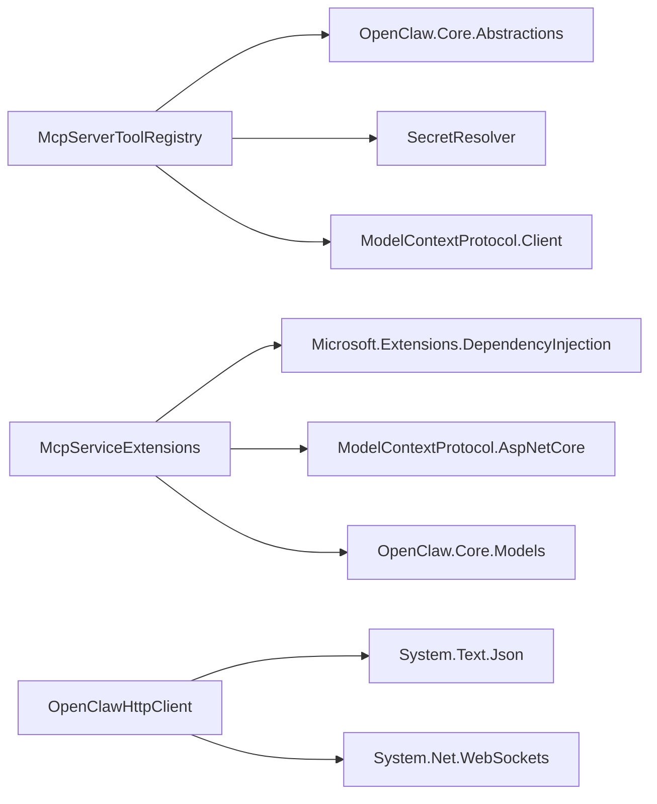

图表来源
- [McpServerToolRegistry.cs:1-369](file://src/OpenClaw.Agent/Plugins/McpServerToolRegistry.cs#L1-L369)
- [McpServiceExtensions.cs:1-36](file://src/OpenClaw.Gateway/Mcp/McpServiceExtensions.cs#L1-L36)
- [OpenClawHttpClient.cs:254-280](file://src/OpenClaw.Client/OpenClawHttpClient.cs#L254-L280)

章节来源
- [McpServerToolRegistry.cs:1-369](file://src/OpenClaw.Agent/Plugins/McpServerToolRegistry.cs#L1-L369)
- [McpServiceExtensions.cs:1-36](file://src/OpenClaw.Gateway/Mcp/McpServiceExtensions.cs#L1-L36)
- [OpenClawHttpClient.cs:254-280](file://src/OpenClaw.Client/OpenClawHttpClient.cs#L254-L280)

## 性能考虑
- 并发与锁：工具注册使用信号量与互斥保护，避免重复加载与竞态。
- 超时控制：客户端初始化与工具调用分别设置启动与请求超时，防止阻塞。
- 缓冲通道：工作区热重载使用带丢弃旧值模式的有界通道，合并频繁变更。
- 序列化开销：工具/资源返回统一使用 CoreJsonContext，减少反射成本。
- 连接复用：WebSocket 客户端在连接期间复用套接字，避免频繁握手。

章节来源
- [McpServerToolRegistry.cs:1-369](file://src/OpenClaw.Agent/Plugins/McpServerToolRegistry.cs#L1-L369)
- [McpWorkspaceWatcherService.cs:1-221](file://src/OpenClaw.Gateway/McpWorkspaceWatcherService.cs#L1-L221)
- [OpenClawLiveClient.cs:1-303](file://src/OpenClaw.Client/OpenClawLiveClient.cs#L1-L303)
- [OpenClawWebSocketClient.cs:1-248](file://src/OpenClaw.Client/OpenClawWebSocketClient.cs#L1-L248)

## 故障排除指南
- 工具发现失败
  - 检查 MCP 服务器配置（传输类型、URL/命令、环境变量与头）。
  - 查看初始化与工具列表请求的超时设置。
  - 关注日志中关于“空名称工具”“未设置环境变量引用”的错误。
- 资源读取异常
  - 确认 URI 模板匹配与路径参数解码。
  - 检查内部 Facade 查询是否返回空对象，必要时抛出“未找到”异常。
- 工作区热重载无效
  - 确认内存存储或工作区文件存在且可解析。
  - 观察“无工具变更”日志，确认实际配置字典是否为空。
- 客户端连接问题
  - WebSocket 客户端需在连接后发送信封；检查授权头与消息大小限制。
  - 实时客户端支持中断与关闭会话，注意连接状态判断。
- 内存 MCP 提供者
  - 关注可用性状态与错误消息；检查 Fractal 配置与命令可用性。

章节来源
- [McpServerToolRegistry.cs:1-369](file://src/OpenClaw.Agent/Plugins/McpServerToolRegistry.cs#L1-L369)
- [OpenClawMcpResources.cs:1-116](file://src/OpenClaw.Gateway/Mcp/OpenClawMcpResources.cs#L1-L116)
- [McpWorkspaceWatcherService.cs:1-221](file://src/OpenClaw.Gateway/McpWorkspaceWatcherService.cs#L1-L221)
- [OpenClawLiveClient.cs:1-303](file://src/OpenClaw.Client/OpenClawLiveClient.cs#L1-L303)
- [OpenClawWebSocketClient.cs:1-248](file://src/OpenClaw.Client/OpenClawWebSocketClient.cs#L1-L248)
- [FractalMemoryMcpProvider.cs:1-200](file://src/OpenClaw.Agent/Memory/FractalMemoryMcpProvider.cs#L1-L200)

## 结论
OpenClaw.NET 的 MCP 实现通过“网关侧服务端 + 代理侧客户端”的双层架构，实现了对内部系统能力的标准化暴露与外部工具/资源/提示的无缝集成。其设计强调可配置、可热重载、可观测与健壮的错误处理，适合在复杂生产环境中稳定运行。

## 附录

### MCP 端点一览（工具/资源/提示）
- 工具（openclaw.*）
  - openclaw.get_dashboard：获取聚合仪表盘快照。
  - openclaw.get_status：获取网关运行状态。
  - openclaw.list_approvals：列出待审批项（可选过滤）。
  - openclaw.get_approval_history：获取审批历史（可选过滤）。
  - openclaw.get_providers：获取提供商路由/用量/策略/近期轮次。
  - openclaw.get_plugins：获取插件健康列表。
  - openclaw.query_operator_audit：查询操作员审计（可选过滤）。
  - openclaw.list_sessions / openclaw.get_session / openclaw.get_session_timeline / openclaw.search_sessions：会话相关查询与时间线。
  - openclaw.get_profile：按 actorId 获取用户画像。
  - openclaw.list_automations / openclaw.get_automation：自动化清单与详情。
  - openclaw.list_workflows / openclaw.run_workflow / openclaw.get_workflow_run / openclaw.respond_workflow：工作流编排。
  - openclaw.query_runtime_events：查询运行时事件（可选过滤）。
  - openclaw.send_message：入站消息队列。
- 资源（openclaw://...）
  - openclaw://status、openclaw://dashboard、openclaw://approvals、openclaw://providers、openclaw://plugins、openclaw://operator-audit。
  - openclaw://sessions/{sessionId}、openclaw://sessions/{sessionId}/timeline。
  - openclaw://profiles/{actorId}。
  - openclaw://automations、openclaw://automations/{automationId}。
- 提示（openclaw_operator_summary、openclaw_session_summary）

章节来源
- [OpenClawMcpTools.cs:1-319](file://src/OpenClaw.Gateway/Mcp/OpenClawMcpTools.cs#L1-L319)
- [OpenClawMcpResources.cs:1-116](file://src/OpenClaw.Gateway/Mcp/OpenClawMcpResources.cs#L1-L116)
- [OpenClawMcpPrompts.cs:1-71](file://src/OpenClaw.Gateway/Mcp/OpenClawMcpPrompts.cs#L1-L71)

### MCP 客户端集成示例（步骤指引）
- 初始化与连接
  - 使用 OpenClawHttpClient 调用 initialize，随后调用 tools/list 与 resources/list 获取可用能力。
  - 如需实时交互，使用 OpenClawLiveClient 或 OpenClawWebSocketClient 建立 WebSocket 连接。
- 调用工具
  - 通过 tools/list 获取工具定义，构造 JSON-RPC 调用，传入参数 JSON。
- 读取资源
  - 使用 resources/list 获取资源定义，再调用 resources/read 读取内容。
- 获取提示
  - 使用 prompts/list 获取提示定义，再调用 prompts/get 获取消息序列。

章节来源
- [OpenClawHttpClient.cs:254-280](file://src/OpenClaw.Client/OpenClawHttpClient.cs#L254-L280)
- [OpenClawLiveClient.cs:1-303](file://src/OpenClaw.Client/OpenClawLiveClient.cs#L1-L303)
- [OpenClawWebSocketClient.cs:1-248](file://src/OpenClaw.Client/OpenClawWebSocketClient.cs#L1-L248)
- [McpModels.cs:1-187](file://src/OpenClaw.Client/McpModels.cs#L1-L187)

### 单元测试参考
- 测试工具注册与执行：验证 HTTP 服务器发现并执行工具的能力。
- 断言要点：服务器 URL、调用集合、工具注册数量与名称。

章节来源
- [McpServerToolRegistryTests.cs:1-41](file://src/OpenClaw.Tests/McpServerToolRegistryTests.cs#L1-L41)