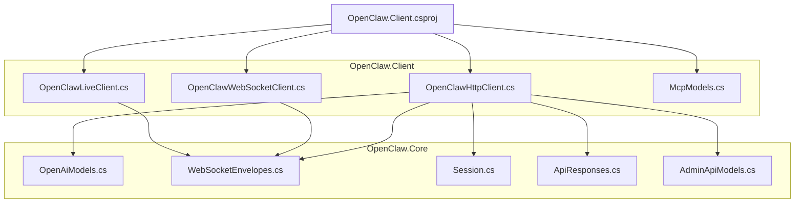
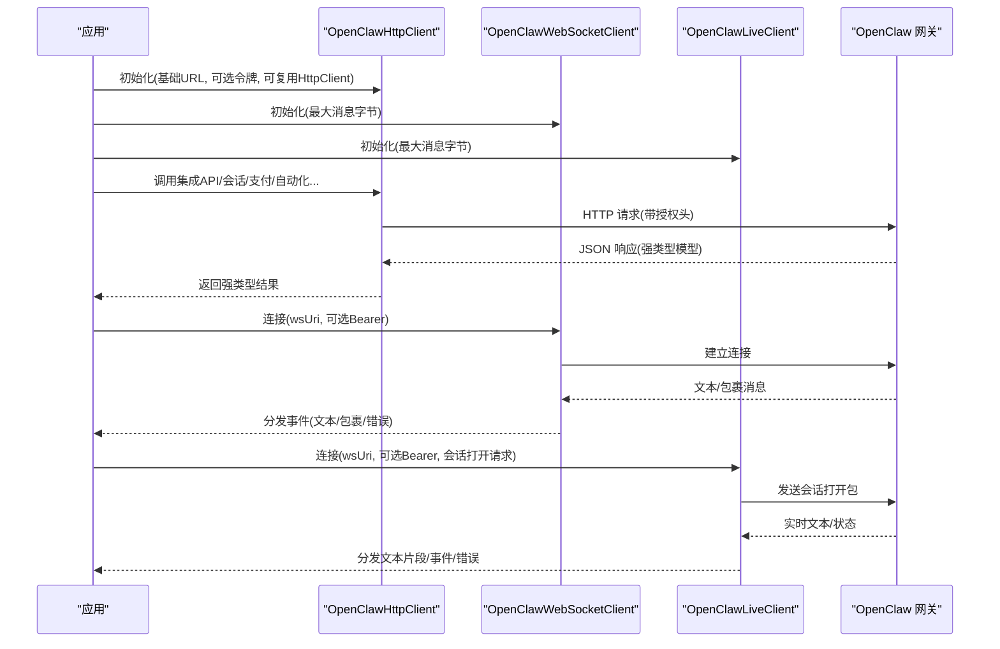
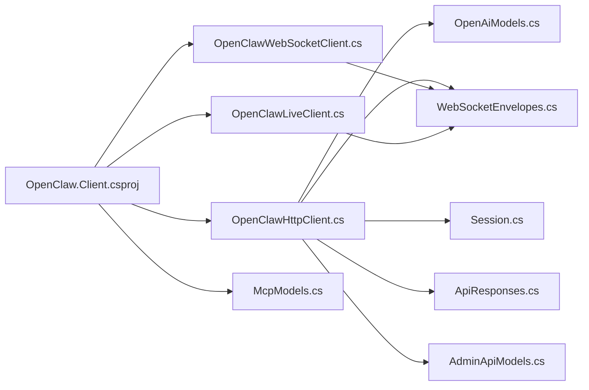

# SDK 接口

<cite>
**本文引用的文件**
- [OpenClaw.Client.csproj](file://src/OpenClaw.Client/OpenClaw.Client.csproj)
- [OpenClawHttpClient.cs](file://src/OpenClaw.Client/OpenClawHttpClient.cs)
- [OpenClawLiveClient.cs](file://src/OpenClaw.Client/OpenClawLiveClient.cs)
- [OpenClawWebSocketClient.cs](file://src/OpenClaw.Client/OpenClawWebSocketClient.cs)
- [McpModels.cs](file://src/OpenClaw.Client/McpModels.cs)
- [OpenAiModels.cs](file://src/OpenClaw.Core/Models/OpenAiModels.cs)
- [WebSocketEnvelopes.cs](file://src/OpenClaw.Core/Models/WebSocketEnvelopes.cs)
- [Session.cs](file://src/OpenClaw.Core/Models/Session.cs)
- [ApiResponses.cs](file://src/OpenClaw.Core/Models/ApiResponses.cs)
- [AdminApiModels.cs](file://src/OpenClaw.Core/Models/AdminApiModels.cs)
</cite>

## 目录
1. [简介](#简介)
2. [项目结构](#项目结构)
3. [核心组件](#核心组件)
4. [架构总览](#架构总览)
5. [详细组件分析](#详细组件分析)
6. [依赖关系分析](#依赖关系分析)
7. [性能考量](#性能考量)
8. [故障排查指南](#故障排查指南)
9. [结论](#结论)
10. [附录](#附录)

## 简介
本文件为 OpenClaw.NET 客户端 SDK 的技术文档，覆盖 HTTP 客户端、WebSocket 客户端与实时（Live）客户端的公共接口、类与方法规范。内容包括：
- 客户端初始化、配置选项、连接管理与资源清理
- 全部公开 API 的方法签名、参数说明、返回值类型与异常处理
- 典型用法示例路径（以源码路径代替具体代码）
- 版本兼容性、依赖要求与最佳实践

## 项目结构
SDK 位于 OpenClaw.Client 模块，面向 OpenClaw.NET 网关提供强类型的 HTTP 与 WebSocket 客户端能力，并通过 Core 模块共享数据模型。

图表来源
- [OpenClaw.Client.csproj:1-16](file://src/OpenClaw.Client/OpenClaw.Client.csproj#L1-L16)
- [OpenClawHttpClient.cs:1-120](file://src/OpenClaw.Client/OpenClawHttpClient.cs#L1-L120)
- [OpenClawWebSocketClient.cs:1-60](file://src/OpenClaw.Client/OpenClawWebSocketClient.cs#L1-L60)
- [OpenClawLiveClient.cs:1-60](file://src/OpenClaw.Client/OpenClawLiveClient.cs#L1-L60)
- [OpenAiModels.cs:1-60](file://src/OpenClaw.Core/Models/OpenAiModels.cs#L1-L60)
- [WebSocketEnvelopes.cs:1-60](file://src/OpenClaw.Core/Models/WebSocketEnvelopes.cs#L1-L60)
- [Session.cs:1-60](file://src/OpenClaw.Core/Models/Session.cs#L1-L60)
- [ApiResponses.cs:1-9](file://src/OpenClaw.Core/Models/ApiResponses.cs#L1-L9)
- [AdminApiModels.cs:1-60](file://src/OpenClaw.Core/Models/AdminApiModels.cs#L1-L60)

章节来源
- [OpenClaw.Client.csproj:1-16](file://src/OpenClaw.Client/OpenClaw.Client.csproj#L1-L16)

## 核心组件
- OpenClawHttpClient：HTTP 客户端，提供网关集成 API、会话管理、支付、自动化、工作流、内存与共享工件等接口。
- OpenClawWebSocketClient：通用 WebSocket 客户端，支持自定义 JSON 包裹与事件分发。
- OpenClawLiveClient：实时（Live）WebSocket 客户端，专用于“实时对话”场景，支持文本/音频输入、中断与会话关闭。
- MCP 模型：MCP 协议请求/响应与能力描述模型。
- 核心模型：OpenAI 兼容聊天补全模型、WebSocket 包裹、会话与操作结果模型等。

章节来源
- [OpenClawHttpClient.cs:10-120](file://src/OpenClaw.Client/OpenClawHttpClient.cs#L10-L120)
- [OpenClawWebSocketClient.cs:9-40](file://src/OpenClaw.Client/OpenClawWebSocketClient.cs#L9-L40)
- [OpenClawLiveClient.cs:9-40](file://src/OpenClaw.Client/OpenClawLiveClient.cs#L9-L40)
- [McpModels.cs:1-40](file://src/OpenClaw.Client/McpModels.cs#L1-L40)
- [OpenAiModels.cs:18-60](file://src/OpenClaw.Core/Models/OpenAiModels.cs#L18-L60)
- [WebSocketEnvelopes.cs:3-48](file://src/OpenClaw.Core/Models/WebSocketEnvelopes.cs#L3-L48)
- [Session.cs:11-60](file://src/OpenClaw.Core/Models/Session.cs#L11-L60)
- [ApiResponses.cs:1-9](file://src/OpenClaw.Core/Models/ApiResponses.cs#L1-L9)
- [AdminApiModels.cs:3-47](file://src/OpenClaw.Core/Models/AdminApiModels.cs#L3-L47)

## 架构总览
SDK 将 HTTP 与 WebSocket 两类通信通道与统一的模型层解耦，通过强类型 JSON 上下文进行序列化/反序列化，确保在 AOT 场景下的兼容性。

图表来源
- [OpenClawHttpClient.cs:91-182](file://src/OpenClaw.Client/OpenClawHttpClient.cs#L91-L182)
- [OpenClawWebSocketClient.cs:38-57](file://src/OpenClaw.Client/OpenClawWebSocketClient.cs#L38-L57)
- [OpenClawLiveClient.cs:60-87](file://src/OpenClaw.Client/OpenClawLiveClient.cs#L60-L87)
- [WebSocketEnvelopes.cs:7-48](file://src/OpenClaw.Core/Models/WebSocketEnvelopes.cs#L7-L48)

## 详细组件分析

### OpenClawHttpClient（HTTP 客户端）
职责与能力
- 网关集成 API：仪表盘、状态、提供商、插件、兼容性目录、账户、后端、会话、工作流、自动化、运行事件、消息、支付等。
- 会话管理：列出、详情、时间线、搜索、元数据更新、会话推广。
- 支付：查询状态、列出资金来源、发行虚拟卡、执行机器支付。
- MCP：初始化、工具/资源/提示列表、读取资源、调用工具。
- 实时 WebSocket URI 获取：提供构建 WebSocket URI 的便捷方法。

初始化与配置
- 构造函数参数
  - baseUrl: 必填，绝对地址，末尾斜杠会被规范化。
  - authToken: 可选，设置默认 Authorization 头为 Bearer。
  - httpClient: 可选，若传入则由外部管理生命周期；未传入则内部创建并持有。
- 默认行为
  - 设置 User-Agent。
  - 针对 SSE 的 Accept: text/event-stream。
  - 预设头支持：presetId 参数可附加到请求头。

主要 API（节选）
- 认证与会话
  - GetAuthSessionAsync(cancellationToken): 返回会话摘要。
- 聊天补全
  - ChatCompletionAsync(request, cancellationToken, presetId?): 返回非流式响应。
  - StreamChatCompletionAsync(request, onText, cancellationToken, presetId?): 流式返回拼接文本。
- MCP
  - InitializeMcpAsync(request, cancellationToken)
  - ListMcpToolsAsync(cancellationToken)
  - ListMcpResourcesAsync(cancellationToken)
  - ListMcpResourceTemplatesAsync(cancellationToken)
  - ReadMcpResourceAsync(uri, cancellationToken)
  - ListMcpPromptsAsync(cancellationToken)
  - GetMcpPromptAsync(name, arguments?, cancellationToken)
  - CallMcpToolAsync(name, arguments, cancellationToken)
- 集成 API
  - GetIntegrationDashboardAsync(cancellationToken)
  - GetIntegrationStatusAsync(cancellationToken)
  - GetIntegrationProvidersAsync(recentTurnsLimit, cancellationToken)
  - GetIntegrationPluginsAsync(cancellationToken)
  - GetCompatibilityCatalogAsync(status?, kind?, category?, cancellationToken)
  - GetIntegrationAccountsAsync(cancellationToken)
  - GetIntegrationAccountAsync(accountId, cancellationToken)
  - CreateIntegrationAccountAsync(request, cancellationToken)
  - DeleteIntegrationAccountAsync(accountId, cancellationToken)
  - GetIntegrationBackendsAsync(cancellationToken)
  - GetIntegrationBackendAsync(backendId, cancellationToken)
  - ProbeIntegrationBackendAsync(backendId, request, cancellationToken)
  - StartBackendSessionAsync(backendId, request, cancellationToken)
  - SendBackendInputAsync(backendId, sessionId, input, cancellationToken)
  - StopBackendSessionAsync(backendId, sessionId, cancellationToken)
  - GetBackendSessionAsync(backendId, sessionId, cancellationToken)
  - GetBackendEventsAsync(backendId, sessionId, afterSequence, limit, cancellationToken)
  - StreamBackendEventsAsync(backendId, sessionId, afterSequence, limit, onEvent, cancellationToken)
  - GetIntegrationOperatorAuditAsync(query, cancellationToken)
  - ListSessionsAsync(page, pageSize, query?, cancellationToken)
  - GetSessionAsync(sessionId, cancellationToken)
  - GetSessionTimelineAsync(sessionId, limit, cancellationToken)
  - SearchSessionsAsync(query, cancellationToken)
  - ListProfilesAsync(cancellationToken)
  - ListToolPresetsAsync(cancellationToken)
  - GetProfileAsync(actorId, cancellationToken)
  - SaveProfileAsync(actorId, profile, cancellationToken)
  - ListMemoryNotesAsync(prefix?, memoryClass?, projectId?, limit, cancellationToken)
  - SearchMemoryNotesAsync(query, memoryClass?, projectId?, limit, cancellationToken)
  - GetMemoryNoteAsync(key, cancellationToken)
  - SaveMemoryNoteAsync(request, cancellationToken)
  - DeleteMemoryNoteAsync(key, cancellationToken)
  - ExportMemoryConsoleAsync(..., include*, cancellationToken)
  - ImportMemoryConsoleAsync(bundle, cancellationToken)
  - GetFractalMemoryStatusAsync(cancellationToken)
  - SearchFractalMemoryAsync(query, limit, scope?, cancellationToken)
  - OpenFractalMemoryAsync(path, depth?, view?, cancellationToken)
  - ExportFractalMemoryAsync(path, mode?, cancellationToken)
  - GetRecentFractalMemoryAsync(days, limit, scope?, cancellationToken)
  - ValidateFractalMemoryAsync(cancellationToken)
  - RefreshFractalMemoryIndexAsync(cancellationToken)
  - CreateFractalMemoryHandoffAsync(path, cancellationToken)
  - ListSharedHarnessStateAsync(query, cancellationToken)
  - GetSharedHarnessStateAsync(id, cancellationToken)
  - GetSharedHarnessStateForSessionAsync(sessionId, cancellationToken)
  - DetectSharedHarnessStateConflictsAsync(id, cancellationToken)
  - ExportAgentBundleAsync(..., include*, cancellationToken)
  - ImportAgentBundleAsync(bundle, cancellationToken)
  - UpdateSessionMetadataAsync(sessionId, request, cancellationToken)
  - PromoteSessionAsync(sessionId, request, cancellationToken)
  - ListAutomationsAsync(cancellationToken)
  - ListAutomationTemplatesAsync(cancellationToken)
  - GetAutomationAsync(automationId, cancellationToken)
  - RunAutomationAsync(automationId, dryRun, cancellationToken)
  - DeleteAutomationAsync(automationId, cancellationToken)
  - GetAutomationRunsAsync(automationId, cancellationToken)
  - GetAutomationRunAsync(automationId, runId, cancellationToken)
  - ReplayAutomationRunAsync(automationId, runId, cancellationToken)
  - ClearAutomationQuarantineAsync(automationId, cancellationToken)
  - ListWorkflowsAsync(cancellationToken)
  - RunWorkflowAsync(workflowId, request, cancellationToken)
- 支付
  - GetPaymentSetupStatusAsync(provider?, cancellationToken)
  - ListPaymentFundingSourcesAsync(provider?, environment?, cancellationToken)
  - IssueVirtualCardAsync(request, yes, cancellationToken)
  - ExecuteMachinePaymentAsync(request, yes, cancellationToken)
  - GetPaymentStatusAsync(id, provider?, environment?, cancellationToken)
- 工具审批
  - GetIntegrationApprovalsAsync(channelId?, senderId?, cancellationToken)
  - GetIntegrationApprovalHistoryAsync(query, cancellationToken)
  - ApproveToolRequestAsync(approvalId, cancellationToken)
  - DenyToolRequestAsync(approvalId, cancellationToken)

异常与错误
- 输入校验：空字符串参数抛出 ArgumentException。
- HTTP 错误：非成功状态码时抛出基于响应体的异常。
- SSE/事件流：解析失败抛出无效操作异常。

资源清理
- 若构造时未传入 httpClient，则 Dispose 时释放内部 HttpClient。
- 提供 GetLiveWebSocketUri() 以获取实时 WebSocket URI。

章节来源
- [OpenClawHttpClient.cs:91-182](file://src/OpenClaw.Client/OpenClawHttpClient.cs#L91-L182)
- [OpenClawHttpClient.cs:187-202](file://src/OpenClaw.Client/OpenClawHttpClient.cs#L187-L202)
- [OpenClawHttpClient.cs:204-260](file://src/OpenClaw.Client/OpenClawHttpClient.cs#L204-L260)
- [OpenClawHttpClient.cs:262-320](file://src/OpenClaw.Client/OpenClawHttpClient.cs#L262-L320)
- [OpenClawHttpClient.cs:322-794](file://src/OpenClaw.Client/OpenClawHttpClient.cs#L322-L794)
- [OpenClawHttpClient.cs:796-800](file://src/OpenClaw.Client/OpenClawHttpClient.cs#L796-L800)
- [OpenAiModels.cs:18-60](file://src/OpenClaw.Core/Models/OpenAiModels.cs#L18-L60)
- [ApiResponses.cs:1-9](file://src/OpenClaw.Core/Models/ApiResponses.cs#L1-L9)
- [AdminApiModels.cs:3-47](file://src/OpenClaw.Core/Models/AdminApiModels.cs#L3-L47)

### OpenClawWebSocketClient（通用 WebSocket 客户端）
职责与能力
- 连接管理：建立连接、断开连接、优雅关闭。
- 消息收发：发送用户消息包裹、接收文本与服务端包裹。
- 事件分发：OnTextMessage、OnEnvelopeReceived、OnError。
- 最大消息限制：防止过大消息导致内存压力。

初始化与配置
- 构造函数参数
  - maxMessageBytes: 默认 256KB，超过阈值抛出异常。
- 连接
  - ConnectAsync(wsUri, bearerToken?, cancellationToken)
  - DisconnectAsync(cancellationToken)

主要 API
- ConnectAsync(wsUri, bearerToken?, cancellationToken)
- DisconnectAsync(cancellationToken)
- SendUserMessageAsync(text, messageId?, replyToMessageId?, cancellationToken)
- SendEnvelopeAsync(envelope, cancellationToken)

事件
- OnTextMessage: 接收原始文本帧。
- OnEnvelopeReceived: 解析后的服务器包裹。
- OnError: 异常或解析错误回调。

资源清理
- DisposeAsync 时断开连接并释放锁资源。

章节来源
- [OpenClawWebSocketClient.cs:18-57](file://src/OpenClaw.Client/OpenClawWebSocketClient.cs#L18-L57)
- [OpenClawWebSocketClient.cs:59-156](file://src/OpenClaw.Client/OpenClawWebSocketClient.cs#L59-L156)
- [OpenClawWebSocketClient.cs:158-247](file://src/OpenClaw.Client/OpenClawWebSocketClient.cs#L158-L247)
- [WebSocketEnvelopes.cs:7-48](file://src/OpenClaw.Core/Models/WebSocketEnvelopes.cs#L7-L48)

### OpenClawLiveClient（实时 WebSocket 客户端）
职责与能力
- 专用于“实时对话”场景，支持文本/音频输入、中断与会话关闭。
- 内置发送锁与最大消息限制，保障并发安全与稳定性。
- 事件：OnEnvelopeReceived、OnTextChunk、OnError。

初始化与配置
- 构造函数参数
  - maxMessageBytes: 默认 512KB。
- 连接
  - ConnectAsync(wsUri, bearerToken?, request, cancellationToken)
  - DisconnectAsync(cancellationToken)
  - CloseSessionAsync(cancellationToken)

主要 API
- ConnectAsync(wsUri, bearerToken?, request, cancellationToken)
- SendTextAsync(text, turnComplete, cancellationToken)
- SendAudioAsync(base64Data, mimeType, turnComplete, cancellationToken)
- InterruptAsync(cancellationToken)
- CloseSessionAsync(cancellationToken)
- DisconnectAsync(cancellationToken)

事件
- OnEnvelopeReceived: 实时服务器包裹。
- OnTextChunk: 文本增量。
- OnError: 错误回调。

资源清理
- DisposeAsync 时断开连接并释放锁资源。

章节来源
- [OpenClawLiveClient.cs:18-87](file://src/OpenClaw.Client/OpenClawLiveClient.cs#L18-L87)
- [OpenClawLiveClient.cs:89-123](file://src/OpenClaw.Client/OpenClawLiveClient.cs#L89-L123)
- [OpenClawLiveClient.cs:125-183](file://src/OpenClaw.Client/OpenClawLiveClient.cs#L125-L183)
- [OpenClawLiveClient.cs:185-210](file://src/OpenClaw.Client/OpenClawLiveClient.cs#L185-L210)
- [OpenClawLiveClient.cs:212-282](file://src/OpenClaw.Client/OpenClawLiveClient.cs#L212-L282)
- [OpenClawLiveClient.cs:284-302](file://src/OpenClaw.Client/OpenClawLiveClient.cs#L284-L302)

### MCP 模型与协议
- 请求/响应模型：McpJsonRpcRequest、McpJsonRpcResponse。
- 初始化：McpInitializeRequest/Result，包含协议版本、客户端/服务器能力与信息。
- 工具：McpCallToolRequest/Result、McpToolDefinition/列表。
- 资源：McpReadResourceRequest/Result、McpResourceDefinition/模板列表。
- 提示：McpGetPromptRequest/Result、McpPromptDefinition/消息列表。

章节来源
- [McpModels.cs:5-25](file://src/OpenClaw.Client/McpModels.cs#L5-L25)
- [McpModels.cs:27-47](file://src/OpenClaw.Client/McpModels.cs#L27-L47)
- [McpModels.cs:78-106](file://src/OpenClaw.Client/McpModels.cs#L78-L106)
- [McpModels.cs:108-149](file://src/OpenClaw.Client/McpModels.cs#L108-L149)
- [McpModels.cs:151-186](file://src/OpenClaw.Client/McpModels.cs#L151-L186)

### 核心模型（与 SDK 使用相关）
- OpenAI 兼容模型：OpenAiChatCompletionRequest/Response、Choice、Usage、消息内容与多部分。
- WebSocket 包裹：WsClientEnvelope、WsServerEnvelope（含工具审批、工件交付、阶段门等扩展字段）。
- 会话：Session、ChatTurn、ToolInvocation、稳定绑定信息与状态枚举。
- 操作结果：OperationStatusResponse。
- 认证会话：AuthSessionResponse。

章节来源
- [OpenAiModels.cs:18-60](file://src/OpenClaw.Core/Models/OpenAiModels.cs#L18-L60)
- [OpenAiModels.cs:188-200](file://src/OpenClaw.Core/Models/OpenAiModels.cs#L188-L200)
- [WebSocketEnvelopes.cs:7-48](file://src/OpenClaw.Core/Models/WebSocketEnvelopes.cs#L7-L48)
- [WebSocketEnvelopes.cs:53-108](file://src/OpenClaw.Core/Models/WebSocketEnvelopes.cs#L53-L108)
- [Session.cs:15-60](file://src/OpenClaw.Core/Models/Session.cs#L15-L60)
- [Session.cs:152-179](file://src/OpenClaw.Core/Models/Session.cs#L152-L179)
- [ApiResponses.cs:1-9](file://src/OpenClaw.Core/Models/ApiResponses.cs#L1-L9)
- [AdminApiModels.cs:27-47](file://src/OpenClaw.Core/Models/AdminApiModels.cs#L27-L47)

## 依赖关系分析
- OpenClaw.Client.csproj 明确引用 OpenClaw.Core 与 Payments.Abstractions，确保模型与支付抽象可用。
- OpenClawHttpClient 依赖 OpenClaw.Core 的模型上下文进行序列化/反序列化。
- WebSocket 客户端依赖 WebSocketEnvelopes 模型。
- Live 客户端依赖 WebSocketEnvelopes 模型。

图表来源
- [OpenClaw.Client.csproj:11-14](file://src/OpenClaw.Client/OpenClaw.Client.csproj#L11-L14)
- [OpenClawHttpClient.cs:1-10](file://src/OpenClaw.Client/OpenClawHttpClient.cs#L1-L10)
- [OpenClawWebSocketClient.cs:1-6](file://src/OpenClaw.Client/OpenClawWebSocketClient.cs#L1-L6)
- [OpenClawLiveClient.cs:1-6](file://src/OpenClaw.Client/OpenClawLiveClient.cs#L1-L6)
- [OpenAiModels.cs:1-5](file://src/OpenClaw.Core/Models/OpenAiModels.cs#L1-L5)
- [WebSocketEnvelopes.cs:1-6](file://src/OpenClaw.Core/Models/WebSocketEnvelopes.cs#L1-L6)
- [Session.cs:1-9](file://src/OpenClaw.Core/Models/Session.cs#L1-L9)
- [ApiResponses.cs:1-5](file://src/OpenClaw.Core/Models/ApiResponses.cs#L1-L5)
- [AdminApiModels.cs:1-5](file://src/OpenClaw.Core/Models/AdminApiModels.cs#L1-L5)

章节来源
- [OpenClaw.Client.csproj:11-14](file://src/OpenClaw.Client/OpenClaw.Client.csproj#L11-L14)

## 性能考量
- 流式处理：HTTP SSE 与 WebSocket 事件流均采用流式读取，避免一次性加载大块数据。
- 缓冲与池化：WebSocket 接收循环使用 ArrayPool<byte> 与 ArrayBufferWriter，降低 GC 压力。
- 最大消息限制：通过 maxMessageBytes 防止内存膨胀，超限直接抛错。
- 并发控制：Live 客户端使用信号量锁保证发送顺序与一致性。
- 序列化：使用 Source Generator 上下文，提升 AOT 场景性能与可靠性。

## 故障排查指南
常见问题与定位建议
- 连接失败
  - 检查基础 URL 是否为绝对地址且末尾无多余斜杠。
  - 确认网络可达与证书/代理配置。
- 认证失败
  - 确保 Authorization 头已正确设置为 Bearer 令牌。
  - 使用 GetAuthSessionAsync 验证会话有效性。
- SSE/事件流异常
  - 非成功状态码会触发 HTTP 错误异常。
  - 解析失败会抛出无效操作异常，检查响应格式。
- WebSocket 消息过大
  - 超过 maxMessageBytes 将抛出异常，适当增大阈值或拆分消息。
- 断开与清理
  - 使用 DisconnectAsync 或 DisposeAsync 清理资源，避免句柄泄漏。
  - Live 客户端在关闭会话后仍需显式断开连接。

章节来源
- [OpenClawHttpClient.cs:93-98](file://src/OpenClaw.Client/OpenClawHttpClient.cs#L93-L98)
- [OpenClawHttpClient.cs:217-219](file://src/OpenClaw.Client/OpenClawHttpClient.cs#L217-L219)
- [OpenClawWebSocketClient.cs:135-136](file://src/OpenClaw.Client/OpenClawWebSocketClient.cs#L135-L136)
- [OpenClawLiveClient.cs:189-190](file://src/OpenClaw.Client/OpenClawLiveClient.cs#L189-L190)
- [OpenClawLiveClient.cs:201-202](file://src/OpenClaw.Client/OpenClawLiveClient.cs#L201-L202)

## 结论
OpenClaw.Client SDK 提供了从 HTTP 到 WebSocket 的完整客户端能力，覆盖集成 API、会话管理、支付、自动化、MCP 以及实时对话场景。通过强类型模型与严格的错误处理，SDK 在 AOT 与多平台环境下具备良好的稳定性与可维护性。建议在生产中结合超时、重试与资源清理策略，确保长连接与高吞吐场景的可靠性。

## 附录

### 典型用法示例（以源码路径代替具体代码）
- 认证与会话
  - [GetAuthSessionAsync 示例路径:187-188](file://src/OpenClaw.Client/OpenClawHttpClient.cs#L187-L188)
- 聊天补全（非流式/流式）
  - [ChatCompletionAsync 示例路径:190-202](file://src/OpenClaw.Client/OpenClawHttpClient.cs#L190-L202)
  - [StreamChatCompletionAsync 示例路径:204-260](file://src/OpenClaw.Client/OpenClawHttpClient.cs#L204-L260)
- MCP 工具调用
  - [CallMcpToolAsync 示例路径:309-320](file://src/OpenClaw.Client/OpenClawHttpClient.cs#L309-L320)
- WebSocket 通用客户端
  - [ConnectAsync/SendUserMessageAsync 示例路径:38-128](file://src/OpenClaw.Client/OpenClawWebSocketClient.cs#L38-L128)
- 实时 Live 客户端
  - [ConnectAsync/SendTextAsync/SendAudioAsync 示例路径:60-110](file://src/OpenClaw.Client/OpenClawLiveClient.cs#L60-L110)
- 会话管理
  - [ListSessionsAsync/GetSessionAsync/GetSessionTimelineAsync 示例路径:517-540](file://src/OpenClaw.Client/OpenClawHttpClient.cs#L517-L540)
- 支付
  - [IssueVirtualCardAsync/ExecuteMachinePaymentAsync/GetPaymentStatusAsync 示例路径:334-359](file://src/OpenClaw.Client/OpenClawHttpClient.cs#L334-L359)
- 自动化与工作流
  - [ListAutomationsAsync/RunAutomationAsync/GetAutomationRunsAsync 示例路径:753-779](file://src/OpenClaw.Client/OpenClawHttpClient.cs#L753-L779)
- 内存与共享工件
  - [SaveMemoryNoteAsync/ExportMemoryConsoleAsync/ExportAgentBundleAsync 示例路径:583-718](file://src/OpenClaw.Client/OpenClawHttpClient.cs#L583-L718)

### 版本兼容性与依赖要求
- 项目声明支持 AOT（IsAotCompatible=true），适合 AOT/裁剪部署。
- 依赖 OpenClaw.Core 与 OpenClaw.Payments.Abstractions，确保模型与支付抽象可用。
- 使用 System.Text.Json.SourceGeneration（通过 CoreJsonContext/McpJsonContext 等）实现高性能序列化。

章节来源
- [OpenClaw.Client.csproj:2-8](file://src/OpenClaw.Client/OpenClaw.Client.csproj#L2-L8)
- [OpenClaw.Client.csproj:11-14](file://src/OpenClaw.Client/OpenClaw.Client.csproj#L11-L14)