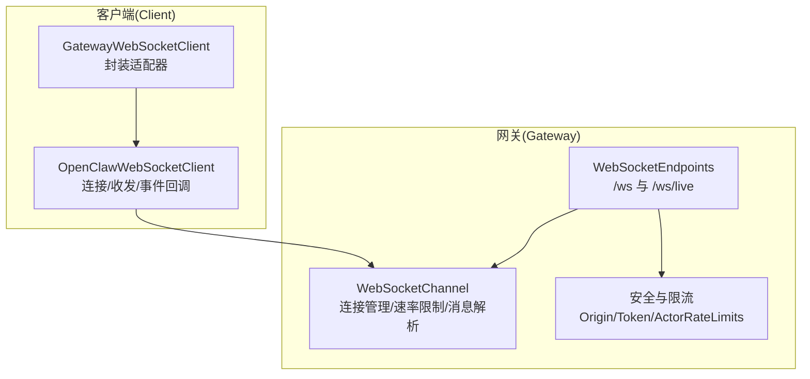
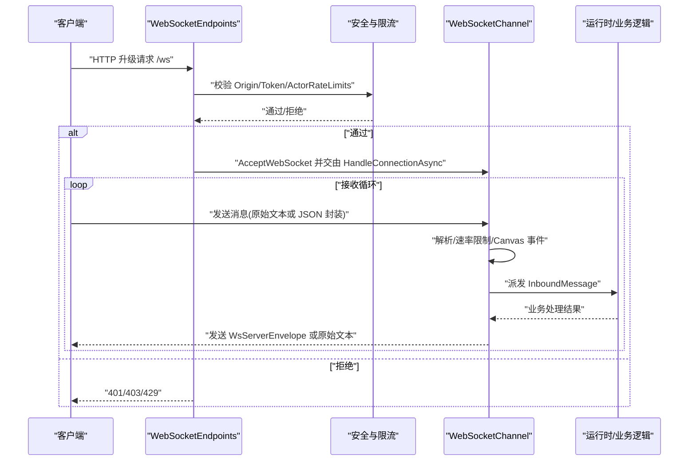
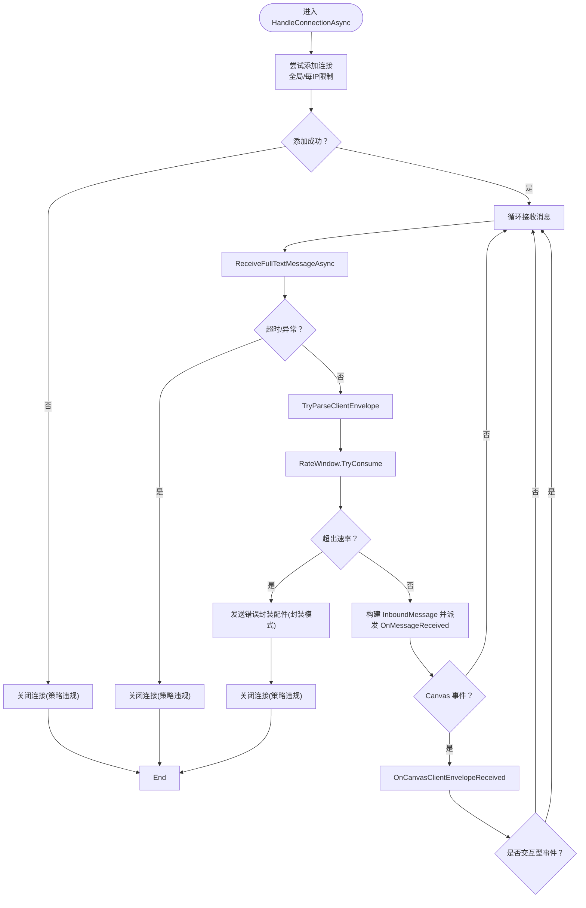
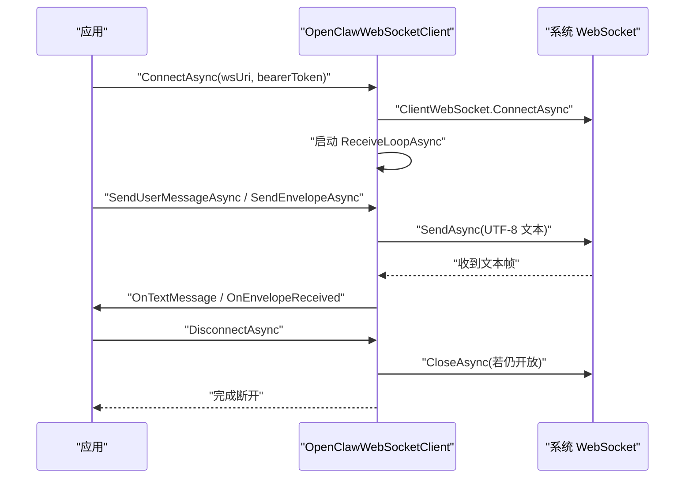
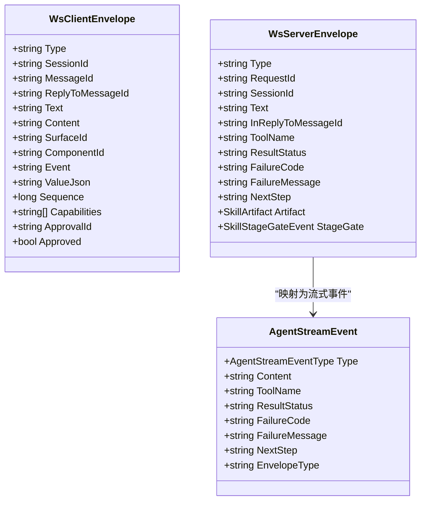
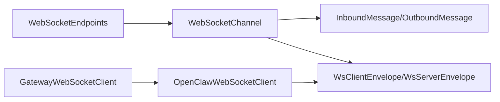

# WebSocket API

<cite>
**本文引用的文件**
- [WebSocketChannel.cs](file://src/OpenClaw.Channels/WebSocketChannel.cs)
- [OpenClawWebSocketClient.cs](file://src/OpenClaw.Client/OpenClawWebSocketClient.cs)
- [GatewayWebSocketClient.cs](file://src/OpenClaw.Companion/Services/GatewayWebSocketClient.cs)
- [WebSocketEnvelopes.cs](file://src/OpenClaw.Core/Models/WebSocketEnvelopes.cs)
- [WebSocketEndpoints.cs](file://src/OpenClaw.Gateway/Endpoints/WebSocketEndpoints.cs)
- [Messages.cs](file://src/OpenClaw.Core/Models/Messages.cs)
- [StreamingTypes.cs](file://src/OpenClaw.Core/Models/StreamingTypes.cs)
- [OpenClawWebSocketClientTests.cs](file://src/OpenClaw.Tests/OpenClawWebSocketClientTests.cs)
- [WebSocketChannelTests.cs](file://src/OpenClaw.Tests/WebSocketChannelTests.cs)
- [TestWebSocket.cs](file://src/OpenClaw.Tests/TestWebSocket.cs)
- [PipelineExtensions.cs](file://src/OpenClaw.Gateway/Pipeline/PipelineExtensions.cs)
</cite>

## 目录
1. [简介](#简介)
2. [项目结构](#项目结构)
3. [核心组件](#核心组件)
4. [架构总览](#架构总览)
5. [详细组件分析](#详细组件分析)
6. [依赖关系分析](#依赖关系分析)
7. [性能考量](#性能考量)
8. [故障排查指南](#故障排查指南)
9. [结论](#结论)
10. [附录](#附录)

## 简介
本文件为 OpenClaw.NET 的 WebSocket API 参考文档，覆盖实时通信协议、消息格式、事件类型与双向交互模式。内容包括：
- 连接建立与鉴权校验
- 消息传递与两种模式（原始文本与 JSON 封装）
- 错误处理、速率限制与连接关闭策略
- 流式事件与工具审批流程
- 客户端实现要点、序列化与性能优化建议
- 连接池管理、流量控制与安全考虑

## 项目结构
OpenClaw.NET 的 WebSocket 能力由三部分组成：
- 网关端点：负责接入校验、升级与会话桥接
- 通道适配器：负责连接生命周期、消息解析与路由
- 客户端库：负责连接、收发、事件回调与资源释放

**图表来源**
- [WebSocketEndpoints.cs:18-61](file://src/OpenClaw.Gateway/Endpoints/WebSocketEndpoints.cs#L18-L61)
- [WebSocketChannel.cs:76-151](file://src/OpenClaw.Channels/WebSocketChannel.cs#L76-L151)
- [OpenClawWebSocketClient.cs:38-57](file://src/OpenClaw.Client/OpenClawWebSocketClient.cs#L38-L57)
- [GatewayWebSocketClient.cs:24-34](file://src/OpenClaw.Companion/Services/GatewayWebSocketClient.cs#L24-L34)

**章节来源**
- [WebSocketEndpoints.cs:18-61](file://src/OpenClaw.Gateway/Endpoints/WebSocketEndpoints.cs#L18-L61)
- [WebSocketChannel.cs:76-151](file://src/OpenClaw.Channels/WebSocketChannel.cs#L76-L151)
- [OpenClawWebSocketClient.cs:38-57](file://src/OpenClaw.Client/OpenClawWebSocketClient.cs#L38-L57)
- [GatewayWebSocketClient.cs:24-34](file://src/OpenClaw.Companion/Services/GatewayWebSocketClient.cs#L24-L34)

## 核心组件
- 网关端点
  - 提供 /ws 与 /ws/live 两条路径，分别用于通用 WebSocket 控制面与直播会话桥接
  - 在接入前进行请求合法性校验（WebSocket 请求、Origin 白名单、授权令牌、IP 速率限制）
- 通道适配器
  - 维护连接表、按 IP 与全局连接数限制
  - 支持每连接速率限制（按分钟计数）
  - 解析客户端消息，支持 JSON 封装与原始文本两种模式
  - 提供流式事件发送能力（仅封装模式）
- 客户端库
  - 提供连接、断开、发送用户消息与任意封装配件
  - 内置收包循环，反序列化为服务端封装配件并分发到回调
  - 并发安全：发送锁、状态锁、生命周期门控

**章节来源**
- [WebSocketEndpoints.cs:18-94](file://src/OpenClaw.Gateway/Endpoints/WebSocketEndpoints.cs#L18-L94)
- [WebSocketChannel.cs:16-74](file://src/OpenClaw.Channels/WebSocketChannel.cs#L16-L74)
- [OpenClawWebSocketClient.cs:9-37](file://src/OpenClaw.Client/OpenClawWebSocketClient.cs#L9-L37)

## 架构总览
下图展示从客户端发起连接到服务端处理与回传的端到端流程。

**图表来源**
- [WebSocketEndpoints.cs:18-94](file://src/OpenClaw.Gateway/Endpoints/WebSocketEndpoints.cs#L18-L94)
- [WebSocketChannel.cs:76-151](file://src/OpenClaw.Channels/WebSocketChannel.cs#L76-L151)

**章节来源**
- [WebSocketEndpoints.cs:18-94](file://src/OpenClaw.Gateway/Endpoints/WebSocketEndpoints.cs#L18-L94)
- [WebSocketChannel.cs:76-151](file://src/OpenClaw.Channels/WebSocketChannel.cs#L76-L151)

## 详细组件分析

### 1) 网关端点与接入校验
- /ws
  - 接受 WebSocket 升级，执行安全校验后将连接委派给通道适配器
- /ws/live
  - 先接收一次文本开包请求，再桥接到直播会话服务
- 校验项
  - WebSocket 请求头检查
  - Origin 白名单校验
  - 非本地绑定时的授权令牌校验（支持引导令牌与账户令牌）
  - IP 级速率限制（ActorRateLimits）

**章节来源**
- [WebSocketEndpoints.cs:18-61](file://src/OpenClaw.Gateway/Endpoints/WebSocketEndpoints.cs#L18-L61)
- [WebSocketEndpoints.cs:63-94](file://src/OpenClaw.Gateway/Endpoints/WebSocketEndpoints.cs#L63-L94)
- [WebSocketEndpoints.cs:96-118](file://src/OpenClaw.Gateway/Endpoints/WebSocketEndpoints.cs#L96-L118)
- [WebSocketEndpoints.cs:120-149](file://src/OpenClaw.Gateway/Endpoints/WebSocketEndpoints.cs#L120-L149)

### 2) 通道适配器（服务端）
- 连接管理
  - 全局最大连接数与每 IP 最大连接数限制
  - 连接移除时清理资源与发送锁
- 消息处理
  - 接收完整文本帧，支持超时与长度限制
  - 优先尝试解析为 JSON 客户端封装配件；否则作为原始文本处理
  - Canvas 客户端事件（如 a2ui_event/a2ui_action）可被单独派发
- 速率限制
  - 按连接每分钟消息数限制；超过则发送错误封装配件并关闭连接
- 发送路径
  - 封装模式：使用 WsServerEnvelope；非封装模式：直接发送文本
  - 发送并发通过每连接发送锁保证；发送预留与完成确保生命周期安全

**图表来源**
- [WebSocketChannel.cs:76-151](file://src/OpenClaw.Channels/WebSocketChannel.cs#L76-L151)
- [WebSocketChannel.cs:435-510](file://src/OpenClaw.Channels/WebSocketChannel.cs#L435-L510)
- [WebSocketChannel.cs:523-581](file://src/OpenClaw.Channels/WebSocketChannel.cs#L523-L581)

**章节来源**
- [WebSocketChannel.cs:76-151](file://src/OpenClaw.Channels/WebSocketChannel.cs#L76-L151)
- [WebSocketChannel.cs:334-370](file://src/OpenClaw.Channels/WebSocketChannel.cs#L334-L370)
- [WebSocketChannel.cs:435-510](file://src/OpenClaw.Channels/WebSocketChannel.cs#L435-L510)
- [WebSocketChannel.cs:523-581](file://src/OpenClaw.Channels/WebSocketChannel.cs#L523-L581)

### 3) 客户端库（通用）
- 连接与断开
  - ConnectAsync 支持设置 Authorization 头
  - DisconnectAsync 有序取消收包任务、关闭套接字并释放资源
- 发送
  - SendUserMessageAsync/SendEnvelopeAsync：序列化为 UTF-8 文本并通过 WebSocket 发送
  - 发送前进行消息大小校验与并发锁保护
- 接收
  - ReceiveLoopAsync 循环接收，组装完整消息后回调 OnTextMessage 与 OnEnvelopeReceived
  - 对回调异常进行捕获并转为 OnError 回调，保证循环继续

**图表来源**
- [OpenClawWebSocketClient.cs:38-57](file://src/OpenClaw.Client/OpenClawWebSocketClient.cs#L38-L57)
- [OpenClawWebSocketClient.cs:119-156](file://src/OpenClaw.Client/OpenClawWebSocketClient.cs#L119-L156)
- [OpenClawWebSocketClient.cs:158-227](file://src/OpenClaw.Client/OpenClawWebSocketClient.cs#L158-L227)

**章节来源**
- [OpenClawWebSocketClient.cs:38-117](file://src/OpenClaw.Client/OpenClawWebSocketClient.cs#L38-L117)
- [OpenClawWebSocketClient.cs:119-156](file://src/OpenClaw.Client/OpenClawWebSocketClient.cs#L119-L156)
- [OpenClawWebSocketClient.cs:158-227](file://src/OpenClaw.Client/OpenClawWebSocketClient.cs#L158-L227)

### 4) 客户端封装（Companion）
- GatewayWebSocketClient 作为对 OpenClawWebSocketClient 的轻量封装，透传事件与方法，便于上层使用。

**章节来源**
- [GatewayWebSocketClient.cs:24-34](file://src/OpenClaw.Companion/Services/GatewayWebSocketClient.cs#L24-L34)

### 5) 消息与事件模型
- 客户端封装配件（WsClientEnvelope）
  - 通用字段：Type、SessionId、MessageId、ReplyToMessageId、Text/Content、SurfaceId、ComponentId、Event/ValueJson、Sequence、Capabilities、ApprovalId/Approved 等
  - 用于承载用户消息、Canvas 交互、工具审批决策等
- 服务端封装配件（WsServerEnvelope）
  - 通用字段：Type、RequestId、SessionId、Text/InReplyToMessageId、ToolName/ArgumentsPreview、ResultStatus/FailureCode/FailureMessage、NextStep、Artifact/StageGate 等
  - 用于承载助手回复、流式增量、工具执行结果、错误与阶段门事件
- 流式事件（AgentStreamEvent）
  - 文本增量、工具开始/增量/结果、错误、完成等
  - 映射到对应的封装配件 Type（assistant_chunk、tool_start、tool_chunk、tool_result、error、assistant_done）

**图表来源**
- [WebSocketEnvelopes.cs:7-48](file://src/OpenClaw.Core/Models/WebSocketEnvelopes.cs#L7-L48)
- [WebSocketEnvelopes.cs:53-108](file://src/OpenClaw.Core/Models/WebSocketEnvelopes.cs#L53-L108)
- [StreamingTypes.cs:31-87](file://src/OpenClaw.Core/Models/StreamingTypes.cs#L31-L87)

**章节来源**
- [WebSocketEnvelopes.cs:7-48](file://src/OpenClaw.Core/Models/WebSocketEnvelopes.cs#L7-L48)
- [WebSocketEnvelopes.cs:53-108](file://src/OpenClaw.Core/Models/WebSocketEnvelopes.cs#L53-L108)
- [StreamingTypes.cs:31-87](file://src/OpenClaw.Core/Models/StreamingTypes.cs#L31-L87)

### 6) 错误处理与重连机制
- 网关端点
  - 校验失败返回 400/401/403/429
  - 异常时向直播会话发送错误封装配件
- 通道适配器
  - 接收超时、消息过大、速率超限均触发关闭
  - Canvas 交互型事件不会中断后续处理
- 客户端
  - 断开时等待在途发送完成后再释放资源
  - 回调异常被捕获并转为 OnError，不中断接收循环

**章节来源**
- [WebSocketEndpoints.cs:63-94](file://src/OpenClaw.Gateway/Endpoints/WebSocketEndpoints.cs#L63-L94)
- [WebSocketChannel.cs:470-482](file://src/OpenClaw.Channels/WebSocketChannel.cs#L470-L482)
- [WebSocketChannel.cs:96-112](file://src/OpenClaw.Channels/WebSocketChannel.cs#L96-L112)
- [OpenClawWebSocketClient.cs:59-117](file://src/OpenClaw.Client/OpenClawWebSocketClient.cs#L59-L117)
- [OpenClawWebSocketClient.cs:219-222](file://src/OpenClaw.Client/OpenClawWebSocketClient.cs#L219-L222)

### 7) 状态管理与连接池
- 连接池
  - 使用并发字典维护 clientId 到 ConnectionState 的映射
  - 记录每 IP 连接数，支持每 IP 与全局上限
- 生命周期
  - 连接添加/移除时更新计数与字典
  - 发送预留与完成确保并发安全
- 心跳与保活
  - 网关侧启用 WebSocket 保活心跳（默认 30 秒）

**章节来源**
- [WebSocketChannel.cs:18-21](file://src/OpenClaw.Channels/WebSocketChannel.cs#L18-L21)
- [WebSocketChannel.cs:334-370](file://src/OpenClaw.Channels/WebSocketChannel.cs#L334-L370)
- [WebSocketChannel.cs:383-412](file://src/OpenClaw.Channels/WebSocketChannel.cs#L383-L412)
- [PipelineExtensions.cs:78-81](file://src/OpenClaw.Gateway/Pipeline/PipelineExtensions.cs#L78-L81)

### 8) 工具审批与 Canvas 交互
- 审批决策
  - 客户端通过 WsClientEnvelope(Type="tool_approval_decision") 上报审批结果
  - 服务端解析后携带 ApprovalId/Approved 字段
- Canvas 交互
  - a2ui_event/a2ui_action 等类型的消息会被识别并可单独派发
  - 通道适配器提供专用派发入口 OnCanvasClientEnvelopeReceived

**章节来源**
- [WebSocketChannel.cs:583-587](file://src/OpenClaw.Channels/WebSocketChannel.cs#L583-L587)
- [WebSocketChannel.cs:589-593](file://src/OpenClaw.Channels/WebSocketChannel.cs#L589-L593)
- [WebSocketEnvelopes.cs:45-48](file://src/OpenClaw.Core/Models/WebSocketEnvelopes.cs#L45-L48)

## 依赖关系分析
- 组件耦合
  - WebSocketEndpoints 依赖 GatewayStartupContext 与 GatewayAppRuntime，后者持有 WebSocketChannel
  - WebSocketChannel 依赖 CoreJsonContext 进行封装配件序列化
  - 客户端库依赖 CoreJsonContext 与系统 WebSocket API
- 外部依赖
  - ASP.NET Core WebSockets、System.Text.Json
  - 网关侧还依赖安全与限流策略（ActorRateLimits、Origin 白名单）

**图表来源**
- [WebSocketEndpoints.cs:18-26](file://src/OpenClaw.Gateway/Endpoints/WebSocketEndpoints.cs#L18-L26)
- [WebSocketChannel.cs:153-170](file://src/OpenClaw.Channels/WebSocketChannel.cs#L153-L170)
- [OpenClawWebSocketClient.cs:130-156](file://src/OpenClaw.Client/OpenClawWebSocketClient.cs#L130-L156)
- [GatewayWebSocketClient.cs:24-34](file://src/OpenClaw.Companion/Services/GatewayWebSocketClient.cs#L24-L34)

**章节来源**
- [WebSocketEndpoints.cs:18-26](file://src/OpenClaw.Gateway/Endpoints/WebSocketEndpoints.cs#L18-L26)
- [WebSocketChannel.cs:153-170](file://src/OpenClaw.Channels/WebSocketChannel.cs#L153-L170)
- [OpenClawWebSocketClient.cs:130-156](file://src/OpenClaw.Client/OpenClawWebSocketClient.cs#L130-L156)
- [GatewayWebSocketClient.cs:24-34](file://src/OpenClaw.Companion/Services/GatewayWebSocketClient.cs#L24-L34)

## 性能考量
- 缓冲与内存
  - 接收循环使用数组池与可增长缓冲，避免频繁分配
  - 发送路径采用 UTF-8 字节缓存，避免重复编码
- 并发与锁
  - 每连接发送锁防止并发写入竞争
  - 生命周期门控与发送预留/完成机制避免竞态
- 速率与背压
  - 每连接每分钟速率限制，超限立即关闭，避免雪崩
  - 全局与每 IP 连接上限，防止资源耗尽
- 序列化
  - 使用 CoreJsonContext 进行封装配件序列化，减少反射开销
- 心跳与保活
  - 网关启用 WebSocket 保活，降低中间设备误判断开

**章节来源**
- [WebSocketChannel.cs:435-510](file://src/OpenClaw.Channels/WebSocketChannel.cs#L435-L510)
- [WebSocketChannel.cs:192-232](file://src/OpenClaw.Channels/WebSocketChannel.cs#L192-L232)
- [WebSocketChannel.cs:383-412](file://src/OpenClaw.Channels/WebSocketChannel.cs#L383-L412)
- [OpenClawWebSocketClient.cs:130-156](file://src/OpenClaw.Client/OpenClawWebSocketClient.cs#L130-L156)
- [PipelineExtensions.cs:78-81](file://src/OpenClaw.Gateway/Pipeline/PipelineExtensions.cs#L78-L81)

## 故障排查指南
- 常见问题定位
  - 400：非 WebSocket 请求
  - 401：未提供有效授权令牌（非本地绑定）
  - 403：Origin 不在白名单
  - 429：IP 速率限制触发
- 通道适配器
  - 接收超时：检查客户端心跳与网络稳定性
  - 消息过大：调整 MaxMessageBytes 或拆分消息
  - 速率超限：降低发送频率或提升限额
- 客户端
  - 发送阻塞：确认发送锁与断开顺序，避免并发冲突
  - 回调异常：检查 OnTextMessage/OnEnvelopeReceived 中的异常处理

**章节来源**
- [WebSocketEndpoints.cs:63-94](file://src/OpenClaw.Gateway/Endpoints/WebSocketEndpoints.cs#L63-L94)
- [WebSocketChannel.cs:470-482](file://src/OpenClaw.Channels/WebSocketChannel.cs#L470-L482)
- [WebSocketChannel.cs:491-495](file://src/OpenClaw.Channels/WebSocketChannel.cs#L491-L495)
- [OpenClawWebSocketClientTests.cs:9-26](file://src/OpenClaw.Tests/OpenClawWebSocketClientTests.cs#L9-L26)
- [WebSocketChannelTests.cs:420-433](file://src/OpenClaw.Tests/WebSocketChannelTests.cs#L420-L433)

## 结论
OpenClaw.NET 的 WebSocket API 通过清晰的端点校验、严格的连接与速率管理、灵活的消息封装与流式事件支持，提供了稳定可靠的实时通信基础。客户端库与通道适配器分工明确，既满足通用控制面需求，又为上层业务（如 Canvas 交互、工具审批、直播桥接）提供扩展点。

## 附录

### A. 消息与事件类型速查
- 客户端消息
  - 用户消息：user_message
  - 工具审批决策：tool_approval_decision
  - Canvas 事件：canvas_ready/canvas_ack/canvas_snapshot_result/canvas_eval_result/a2ui_event/a2ui_action/a2ui_error/a2ui_sync_result
- 服务端事件
  - 助手回复：assistant_message
  - 流式增量：assistant_chunk
  - 工具事件：tool_start/tool_chunk/tool_result
  - 结束与错误：assistant_done/error

**章节来源**
- [WebSocketEnvelopes.cs:7-48](file://src/OpenClaw.Core/Models/WebSocketEnvelopes.cs#L7-L48)
- [WebSocketEnvelopes.cs:53-108](file://src/OpenClaw.Core/Models/WebSocketEnvelopes.cs#L53-L108)
- [StreamingTypes.cs:77-86](file://src/OpenClaw.Core/Models/StreamingTypes.cs#L77-L86)

### B. 客户端实现要点
- 连接
  - 设置 Authorization 头（可选）
  - 启动独立接收循环
- 发送
  - 使用 SendUserMessageAsync 或 SendEnvelopeAsync
  - 注意消息大小限制与发送锁
- 接收
  - 订阅 OnTextMessage 与 OnEnvelopeReceived
  - 捕获 OnError 并记录日志
- 断开
  - 调用 DisconnectAsync，等待在途发送完成

**章节来源**
- [OpenClawWebSocketClient.cs:38-117](file://src/OpenClaw.Client/OpenClawWebSocketClient.cs#L38-L117)
- [OpenClawWebSocketClient.cs:119-156](file://src/OpenClaw.Client/OpenClawWebSocketClient.cs#L119-L156)
- [OpenClawWebSocketClient.cs:158-227](file://src/OpenClaw.Client/OpenClawWebSocketClient.cs#L158-L227)

### C. 测试与验证
- 行为验证
  - 发送与断开并发：在途发送完成后断开
  - 回调异常：捕获并继续接收
  - 速率超限：发送错误封装配件并关闭连接
  - 接收超时：关闭连接
- 测试辅助
  - TestWebSocket 支持阻塞/队列/关闭模拟

**章节来源**
- [OpenClawWebSocketClientTests.cs:9-26](file://src/OpenClaw.Tests/OpenClawWebSocketClientTests.cs#L9-L26)
- [OpenClawWebSocketClientTests.cs:28-56](file://src/OpenClaw.Tests/OpenClawWebSocketClientTests.cs#L28-L56)
- [WebSocketChannelTests.cs:408-417](file://src/OpenClaw.Tests/WebSocketChannelTests.cs#L408-L417)
- [WebSocketChannelTests.cs:420-433](file://src/OpenClaw.Tests/WebSocketChannelTests.cs#L420-L433)
- [TestWebSocket.cs](file://src/OpenClaw.Tests/TestWebSocket.cs)