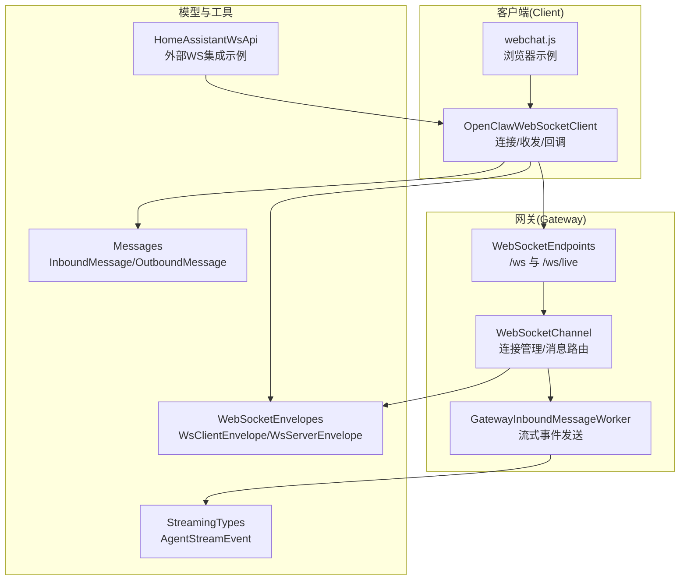
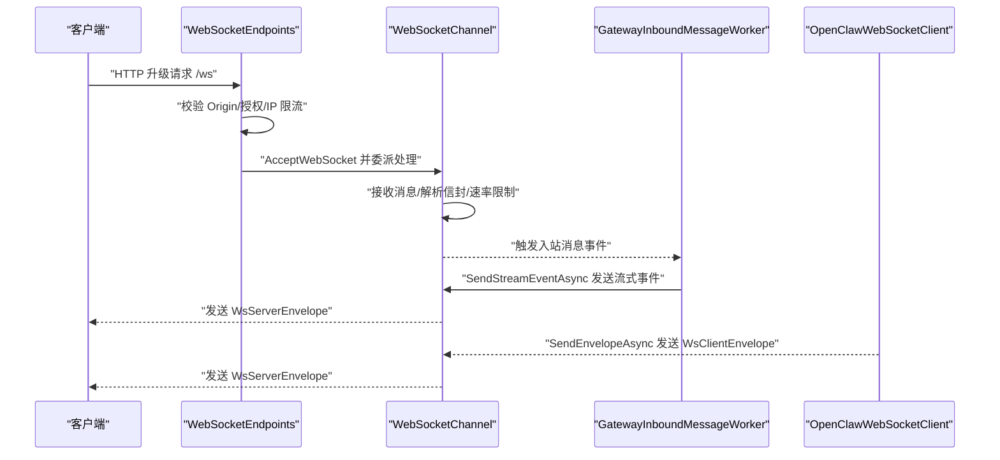
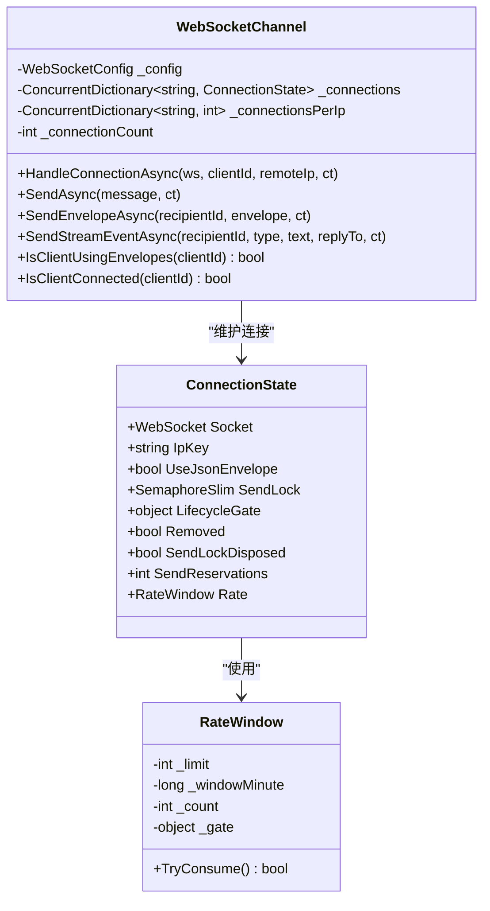
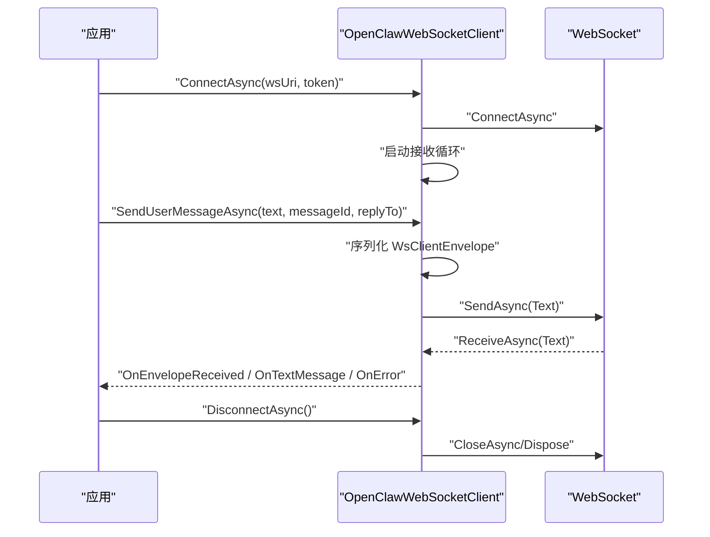
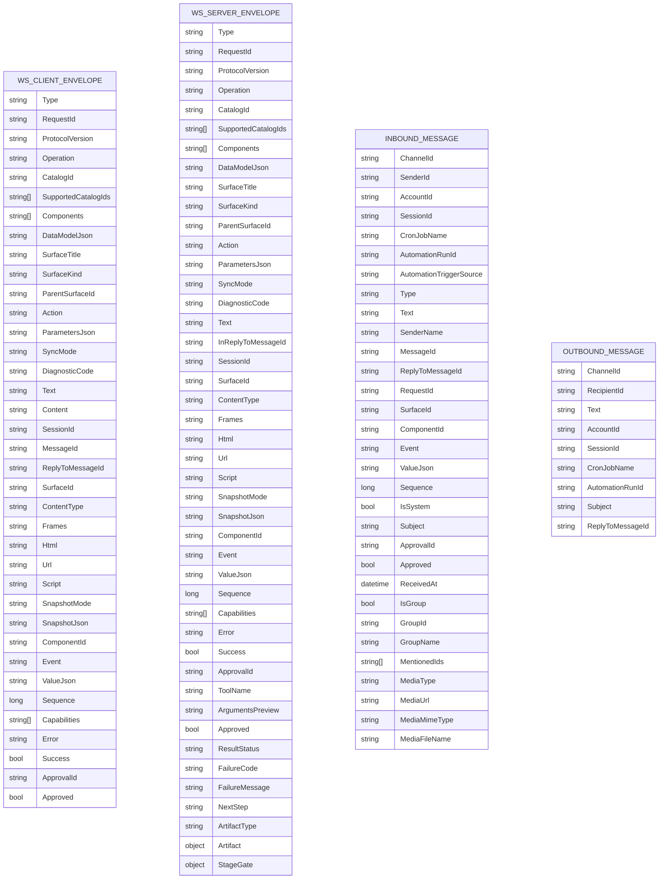
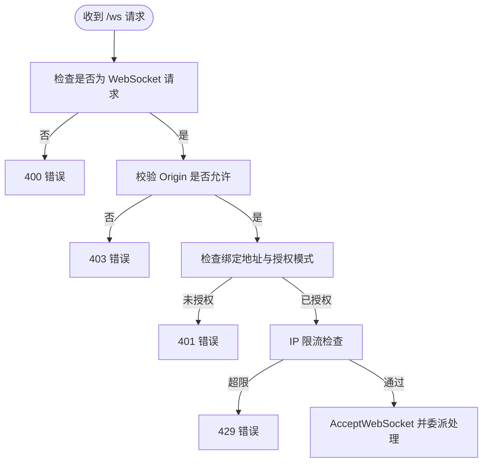
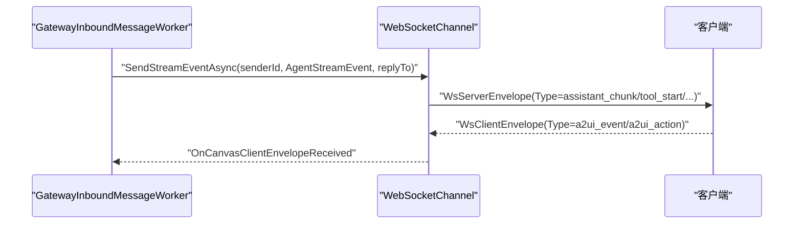
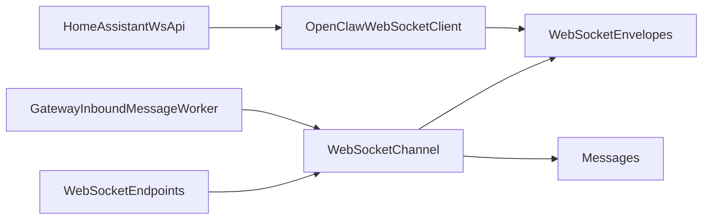

# WebSocket API

<cite>
**本文档引用的文件**
- [WebSocketChannel.cs](file://src/OpenClaw.Channels/WebSocketChannel.cs)
- [WebSocketEnvelopes.cs](file://src/OpenClaw.Core/Models/WebSocketEnvelopes.cs)
- [OpenClawWebSocketClient.cs](file://src/OpenClaw.Client/OpenClawWebSocketClient.cs)
- [WebSocketEndpoints.cs](file://src/OpenClaw.Gateway/Endpoints/WebSocketEndpoints.cs)
- [WebSocketChannelTests.cs](file://src/OpenClaw.Tests/WebSocketChannelTests.cs)
- [OpenClawWebSocketClientTests.cs](file://src/OpenClaw.Tests/OpenClawWebSocketClientTests.cs)
- [GatewayInboundMessageWorker.cs](file://src/OpenClaw.Gateway/Extensions/GatewayInboundMessageWorker.cs)
- [webchat.js](file://src/OpenClaw.Gateway/wwwroot/webchat.js)
- [Messages.cs](file://src/OpenClaw.Core/Models/Messages.cs)
- [StreamingTypes.cs](file://src/OpenClaw.Core/Models/StreamingTypes.cs)
- [HomeAssistantEventBridge.cs](file://src/OpenClaw.Agent/Integrations/HomeAssistantEventBridge.cs)
- [HomeAssistantWsApi.cs](file://src/OpenClaw.Agent/Tools/HomeAssistantWsApi.cs)
</cite>

## 目录
1. [简介](#简介)
2. [项目结构](#项目结构)
3. [核心组件](#核心组件)
4. [架构总览](#架构总览)
5. [详细组件分析](#详细组件分析)
6. [依赖关系分析](#依赖关系分析)
7. [性能考量](#性能考量)
8. [故障排除指南](#故障排除指南)
9. [结论](#结论)
10. [附录](#附录)

## 简介
本文件为 Kingcrab 项目的 WebSocket API 技术文档，覆盖连接建立、消息格式、事件类型与实时交互模式；文档化入站消息处理、出站消息传递与会话管理机制；解释消息协议规范、连接状态管理、速率限制与错误处理；并提供客户端连接示例、消息收发流程与最佳实践。

## 项目结构
WebSocket 相关实现分布在以下模块：
- 网关端点：负责握手校验与路由到通道适配器
- 通道适配器：负责连接生命周期、消息解析与路由、速率限制与并发控制
- 客户端库：提供通用 WebSocket 客户端封装与事件回调
- 消息模型：定义入/出站消息与 WebSocket 信封格式
- 测试用例：验证连接、速率限制、消息路由等行为
- 示例前端：演示客户端连接与事件处理

图表来源
- [WebSocketEndpoints.cs:18-61](file://src/OpenClaw.Gateway/Endpoints/WebSocketEndpoints.cs#L18-L61)
- [WebSocketChannel.cs:76-151](file://src/OpenClaw.Channels/WebSocketChannel.cs#L76-L151)
- [OpenClawWebSocketClient.cs:38-57](file://src/OpenClaw.Client/OpenClawWebSocketClient.cs#L38-L57)
- [WebSocketEnvelopes.cs:7-108](file://src/OpenClaw.Core/Models/WebSocketEnvelopes.cs#L7-L108)
- [Messages.cs:6-61](file://src/OpenClaw.Core/Models/Messages.cs#L6-L61)
- [StreamingTypes.cs:31-87](file://src/OpenClaw.Core/Models/StreamingTypes.cs#L31-L87)
- [HomeAssistantWsApi.cs:34-107](file://src/OpenClaw.Agent/Tools/HomeAssistantWsApi.cs#L34-L107)

章节来源
- [WebSocketEndpoints.cs:18-61](file://src/OpenClaw.Gateway/Endpoints/WebSocketEndpoints.cs#L18-L61)
- [WebSocketChannel.cs:76-151](file://src/OpenClaw.Channels/WebSocketChannel.cs#L76-L151)
- [OpenClawWebSocketClient.cs:38-57](file://src/OpenClaw.Client/OpenClawWebSocketClient.cs#L38-L57)
- [WebSocketEnvelopes.cs:7-108](file://src/OpenClaw.Core/Models/WebSocketEnvelopes.cs#L7-L108)
- [Messages.cs:6-61](file://src/OpenClaw.Core/Models/Messages.cs#L6-L61)
- [StreamingTypes.cs:31-87](file://src/OpenClaw.Core/Models/StreamingTypes.cs#L31-L87)
- [HomeAssistantWsApi.cs:34-107](file://src/OpenClaw.Agent/Tools/HomeAssistantWsApi.cs#L34-L107)

## 核心组件
- WebSocketChannel：网关侧通道适配器，支持原始文本与 JSON 信封两种消息模式，按连接进行路由；内置速率限制、并发发送锁、IP 连接数限制与连接生命周期管理。
- OpenClawWebSocketClient：客户端库，提供连接、断开、发送/接收事件回调；支持最大消息大小限制与并发发送控制。
- WebSocketEnvelopes：WebSocket 信封模型，定义客户端到服务端与服务端到客户端的消息结构，涵盖 Canvas/A2UI、工具审批、流式事件等字段。
- WebSocketEndpoints：网关端点，负责 /ws 与 /ws/live 握手校验（Origin、授权令牌、IP 限流），并交由通道适配器处理连接。
- GatewayInboundMessageWorker：在运行时将 AgentStreamEvent 转换为 WebSocket 信封事件并发送给客户端。
- webchat.js：浏览器示例，展示连接、事件监听与消息发送流程。

章节来源
- [WebSocketChannel.cs:16-75](file://src/OpenClaw.Channels/WebSocketChannel.cs#L16-L75)
- [OpenClawWebSocketClient.cs:9-37](file://src/OpenClaw.Client/OpenClawWebSocketClient.cs#L9-L37)
- [WebSocketEnvelopes.cs:7-108](file://src/OpenClaw.Core/Models/WebSocketEnvelopes.cs#L7-L108)
- [WebSocketEndpoints.cs:18-61](file://src/OpenClaw.Gateway/Endpoints/WebSocketEndpoints.cs#L18-L61)
- [GatewayInboundMessageWorker.cs:608-629](file://src/OpenClaw.Gateway/Extensions/GatewayInboundMessageWorker.cs#L608-L629)
- [webchat.js:832-861](file://src/OpenClaw.Gateway/wwwroot/webchat.js#L832-L861)

## 架构总览
WebSocket API 的整体交互流程如下：

图表来源
- [WebSocketEndpoints.cs:18-61](file://src/OpenClaw.Gateway/Endpoints/WebSocketEndpoints.cs#L18-L61)
- [WebSocketChannel.cs:76-151](file://src/OpenClaw.Channels/WebSocketChannel.cs#L76-L151)
- [OpenClawWebSocketClient.cs:119-156](file://src/OpenClaw.Client/OpenClawWebSocketClient.cs#L119-L156)
- [GatewayInboundMessageWorker.cs:608-629](file://src/OpenClaw.Gateway/Extensions/GatewayInboundMessageWorker.cs#L608-L629)

## 详细组件分析

### WebSocketChannel 组件
- 连接管理
  - 使用 ConcurrentDictionary 维护 clientId 到 ConnectionState 的映射，支持每 IP 最大连接数限制与全局最大连接数限制。
  - 提供 TryAddConnectionForTest/RemoveConnectionForTest 用于测试场景。
- 入站消息处理
  - 接收完整文本消息，支持分片重组；对非文本帧直接忽略。
  - 解析 WsClientEnvelope，识别 Canvas/A2UI 事件与用户消息；将 CanvasEnvelope 通过 OnCanvasClientEnvelopeReceived 分发。
  - 支持“遗留”content 字段兼容，提取 text 内容。
- 出站消息与流式事件
  - SendAsync：根据客户端是否启用 JSON 信封选择发送原始文本或 WsServerEnvelope。
  - SendStreamEventAsync：仅对启用 JSON 信封的客户端发送增量事件（如 assistant_chunk、tool_chunk）。
  - SendEnvelopeAsync：直接发送指定 WsServerEnvelope。
- 速率限制与并发
  - RateWindow：基于分钟窗口的令牌桶式速率限制，超过则发送 error 信封并关闭连接。
  - SendLock：每个连接的发送互斥锁，防止并发写入导致帧交错。
  - SendReservations：发送预约计数，确保连接移除时不会残留未完成的发送任务。
- 错误处理与超时
  - 接收超时：配置 ReceiveTimeoutSeconds，超时自动关闭连接。
  - 异常捕获：忽略 ObjectDisposedException/WebSocketException/InvalidOperationException 等常见异常，保证稳健性。

图表来源
- [WebSocketChannel.cs:16-75](file://src/OpenClaw.Channels/WebSocketChannel.cs#L16-L75)
- [WebSocketChannel.cs:23-65](file://src/OpenClaw.Channels/WebSocketChannel.cs#L23-L65)

章节来源
- [WebSocketChannel.cs:76-151](file://src/OpenClaw.Channels/WebSocketChannel.cs#L76-L151)
- [WebSocketChannel.cs:153-190](file://src/OpenClaw.Channels/WebSocketChannel.cs#L153-L190)
- [WebSocketChannel.cs:247-296](file://src/OpenClaw.Channels/WebSocketChannel.cs#L247-L296)
- [WebSocketChannel.cs:334-370](file://src/OpenClaw.Channels/WebSocketChannel.cs#L334-L370)
- [WebSocketChannel.cs:435-510](file://src/OpenClaw.Channels/WebSocketChannel.cs#L435-L510)

### OpenClawWebSocketClient 组件
- 连接与断开
  - ConnectAsync：建立连接并启动接收循环；支持可选 Authorization 头。
  - DisconnectAsync：安全断开，等待在途发送完成后再释放资源。
- 发送与接收
  - SendEnvelopeAsync：序列化 WsClientEnvelope 并发送；受最大消息大小限制。
  - ReceiveLoopAsync：接收完整消息，分别触发 OnTextMessage 与 OnEnvelopeReceived 回调；异常通过 OnError 回调通知。
- 状态与并发
  - IsConnected：当前连接状态。
  - _sendLock：发送互斥，保障并发安全。
  - 最大消息大小限制，防止内存压力。

图表来源
- [OpenClawWebSocketClient.cs:38-57](file://src/OpenClaw.Client/OpenClawWebSocketClient.cs#L38-L57)
- [OpenClawWebSocketClient.cs:119-156](file://src/OpenClaw.Client/OpenClawWebSocketClient.cs#L119-L156)
- [OpenClawWebSocketClient.cs:158-227](file://src/OpenClaw.Client/OpenClawWebSocketClient.cs#L158-L227)

章节来源
- [OpenClawWebSocketClient.cs:38-117](file://src/OpenClaw.Client/OpenClawWebSocketClient.cs#L38-L117)
- [OpenClawWebSocketClient.cs:119-156](file://src/OpenClaw.Client/OpenClawWebSocketClient.cs#L119-L156)
- [OpenClawWebSocketClient.cs:158-227](file://src/OpenClaw.Client/OpenClawWebSocketClient.cs#L158-L227)

### WebSocketEnvelopes 与消息模型
- WsClientEnvelope：客户端到服务端的 JSON 信封，支持 user_message、tool_approval_decision、Canvas/A2UI 事件等。
- WsServerEnvelope：服务端到客户端的 JSON 信封，支持 assistant_message、assistant_chunk、tool_start/tool_chunk/tool_result、error、assistant_done 等。
- InboundMessage/OutboundMessage：跨通道的统一消息模型，用于内部路由与处理。

图表来源
- [WebSocketEnvelopes.cs:7-108](file://src/OpenClaw.Core/Models/WebSocketEnvelopes.cs#L7-L108)
- [Messages.cs:6-61](file://src/OpenClaw.Core/Models/Messages.cs#L6-L61)

章节来源
- [WebSocketEnvelopes.cs:7-108](file://src/OpenClaw.Core/Models/WebSocketEnvelopes.cs#L7-L108)
- [Messages.cs:6-61](file://src/OpenClaw.Core/Models/Messages.cs#L6-L61)

### 端点与握手校验
- /ws：标准 WebSocket 控制面，进行 Origin 白名单、授权令牌（可选）、IP 限流检查后接受连接。
- /ws/live：直播会话端点，先接收开放请求，再桥接业务服务。
- 校验失败返回相应状态码（400/403/401/429）。

图表来源
- [WebSocketEndpoints.cs:63-94](file://src/OpenClaw.Gateway/Endpoints/WebSocketEndpoints.cs#L63-L94)
- [WebSocketEndpoints.cs:18-61](file://src/OpenClaw.Gateway/Endpoints/WebSocketEndpoints.cs#L18-L61)

章节来源
- [WebSocketEndpoints.cs:18-61](file://src/OpenClaw.Gateway/Endpoints/WebSocketEndpoints.cs#L18-L61)
- [WebSocketEndpoints.cs:63-149](file://src/OpenClaw.Gateway/Endpoints/WebSocketEndpoints.cs#L63-L149)

### 流式事件与 Canvas/A2UI 交互
- AgentStreamEvent：将 Agent 运行时的增量事件映射为 WebSocket 信封类型（assistant_chunk、tool_start、tool_chunk、tool_result、error、assistant_done）。
- Canvas/A2UI：通道适配器识别特定类型（如 a2ui_event/a2ui_action/canvas_ready 等），并通过 OnCanvasClientEnvelopeReceived 分发，同时可选择性地将 CanvasEnvelope 转换为可读文本。

图表来源
- [GatewayInboundMessageWorker.cs:608-629](file://src/OpenClaw.Gateway/Extensions/GatewayInboundMessageWorker.cs#L608-L629)
- [WebSocketChannel.cs:247-296](file://src/OpenClaw.Channels/WebSocketChannel.cs#L247-L296)
- [WebSocketChannel.cs:583-587](file://src/OpenClaw.Channels/WebSocketChannel.cs#L583-L587)
- [StreamingTypes.cs:77-87](file://src/OpenClaw.Core/Models/StreamingTypes.cs#L77-L87)

章节来源
- [GatewayInboundMessageWorker.cs:608-629](file://src/OpenClaw.Gateway/Extensions/GatewayInboundMessageWorker.cs#L608-L629)
- [WebSocketChannel.cs:583-594](file://src/OpenClaw.Channels/WebSocketChannel.cs#L583-L594)
- [StreamingTypes.cs:31-87](file://src/OpenClaw.Core/Models/StreamingTypes.cs#L31-L87)

### 客户端连接示例与消息收发
- 浏览器示例：webchat.js 展示了连接建立、事件监听与消息发送流程。
- 客户端库：OpenClawWebSocketClient 提供统一的连接、断开、发送与回调接口。

章节来源
- [webchat.js:832-861](file://src/OpenClaw.Gateway/wwwroot/webchat.js#L832-L861)
- [OpenClawWebSocketClient.cs:38-57](file://src/OpenClaw.Client/OpenClawWebSocketClient.cs#L38-L57)
- [OpenClawWebSocketClient.cs:119-156](file://src/OpenClaw.Client/OpenClawWebSocketClient.cs#L119-L156)

## 依赖关系分析
- WebSocketChannel 依赖 WebSocketEnvelopes 与 Messages 模型，通过事件向运行时分发入站消息，并从运行时接收出站消息。
- WebSocketEndpoints 将 HTTP 升级请求委派给 WebSocketChannel 处理。
- GatewayInboundMessageWorker 在运行时将 AgentStreamEvent 转换为 WebSocket 信封事件并发送。
- OpenClawWebSocketClient 与 WebSocketEnvelopes 互操作，实现双向消息收发。
- HomeAssistantWsApi 展示了外部 WebSocket 集成模式，可作为客户端参考。

图表来源
- [WebSocketEndpoints.cs:18-61](file://src/OpenClaw.Gateway/Endpoints/WebSocketEndpoints.cs#L18-L61)
- [WebSocketChannel.cs:76-151](file://src/OpenClaw.Channels/WebSocketChannel.cs#L76-L151)
- [WebSocketEnvelopes.cs:7-108](file://src/OpenClaw.Core/Models/WebSocketEnvelopes.cs#L7-L108)
- [Messages.cs:6-61](file://src/OpenClaw.Core/Models/Messages.cs#L6-L61)
- [GatewayInboundMessageWorker.cs:608-629](file://src/OpenClaw.Gateway/Extensions/GatewayInboundMessageWorker.cs#L608-L629)
- [OpenClawWebSocketClient.cs:119-156](file://src/OpenClaw.Client/OpenClawWebSocketClient.cs#L119-L156)
- [HomeAssistantWsApi.cs:34-107](file://src/OpenClaw.Agent/Tools/HomeAssistantWsApi.cs#L34-L107)

章节来源
- [WebSocketEndpoints.cs:18-61](file://src/OpenClaw.Gateway/Endpoints/WebSocketEndpoints.cs#L18-L61)
- [WebSocketChannel.cs:76-151](file://src/OpenClaw.Channels/WebSocketChannel.cs#L76-L151)
- [GatewayInboundMessageWorker.cs:608-629](file://src/OpenClaw.Gateway/Extensions/GatewayInboundMessageWorker.cs#L608-L629)
- [OpenClawWebSocketClient.cs:119-156](file://src/OpenClaw.Client/OpenClawWebSocketClient.cs#L119-L156)
- [HomeAssistantWsApi.cs:34-107](file://src/OpenClaw.Agent/Tools/HomeAssistantWsApi.cs#L34-L107)

## 性能考量
- 速率限制：每连接每分钟消息数限制，超限立即发送 error 信封并关闭连接，避免过载。
- 并发控制：每个连接独立 SendLock，防止并发写入；发送预留计数确保连接移除时无悬挂任务。
- 内存与缓冲：接收缓冲使用 ArrayPool<byte> 与 ArrayBufferWriter<byte>，支持分片重组与最大消息大小限制。
- 超时与健壮性：接收超时自动关闭连接；异常捕获避免崩溃传播。
- 流式事件：仅对启用 JSON 信封的客户端发送增量事件，减少带宽与 CPU 开销。

章节来源
- [WebSocketChannel.cs:41-65](file://src/OpenClaw.Channels/WebSocketChannel.cs#L41-L65)
- [WebSocketChannel.cs:192-232](file://src/OpenClaw.Channels/WebSocketChannel.cs#L192-L232)
- [WebSocketChannel.cs:435-510](file://src/OpenClaw.Channels/WebSocketChannel.cs#L435-L510)
- [WebSocketChannel.cs:420-479](file://src/OpenClaw.Channels/WebSocketChannel.cs#L420-L479)

## 故障排除指南
- 连接被拒绝
  - 400：非 WebSocket 请求。
  - 403：Origin 不在白名单。
  - 401：非本地绑定但缺少有效授权令牌。
  - 429：IP 限流触发。
- 速率限制
  - 通道会发送 error 信封并关闭连接；客户端应重试或降频。
- 接收超时
  - 若超过 ReceiveTimeoutSeconds 未收到消息，通道主动关闭连接。
- 客户端回调异常
  - 客户端回调异常会被捕获并通过 OnError 通知，随后继续处理后续消息。
- 测试验证
  - 单元测试覆盖了连接路由、速率限制、消息重组、Canvas 事件分发、接收超时等关键行为。

章节来源
- [WebSocketEndpoints.cs:63-94](file://src/OpenClaw.Gateway/Endpoints/WebSocketEndpoints.cs#L63-L94)
- [WebSocketChannel.cs:96-112](file://src/OpenClaw.Channels/WebSocketChannel.cs#L96-L112)
- [WebSocketChannel.cs:420-479](file://src/OpenClaw.Channels/WebSocketChannel.cs#L420-L479)
- [OpenClawWebSocketClientTests.cs:28-56](file://src/OpenClaw.Tests/OpenClawWebSocketClientTests.cs#L28-L56)
- [WebSocketChannelTests.cs:419-433](file://src/OpenClaw.Tests/WebSocketChannelTests.cs#L419-L433)

## 结论
本 WebSocket API 以通道适配器为核心，结合严格的速率限制、并发控制与健壮的错误处理，实现了稳定可靠的实时通信能力。通过 JSON 信封与流式事件，既满足传统文本消息，也支持现代 Canvas/A2UI 与增量输出场景。客户端库提供了简洁易用的接口，便于快速集成。

## 附录

### 消息类型与字段说明
- user_message
  - 客户端发送用户输入；服务端回传 assistant_message 或流式 assistant_chunk。
  - 关键字段：Type、Text/Content、MessageId、ReplyToMessageId、SessionId。
- tool_approval_decision
  - 客户端对工具调用审批的决策；服务端可据此继续或中止流程。
  - 关键字段：Type、ApprovalId、Approved。
- assistant_message / assistant_chunk / assistant_done
  - 服务端对用户消息的响应；assistant_chunk 为增量内容，assistant_done 表示结束。
  - 关键字段：Type、Text、InReplyToMessageId、ToolName、ResultStatus、FailureCode、NextStep。
- tool_start / tool_chunk / tool_result
  - 工具执行过程中的事件；tool_result 包含结果与状态。
  - 关键字段：Type、ToolName、ArgumentsPreview、ResultStatus、FailureCode、FailureMessage、NextStep。
- error
  - 错误事件；可携带错误码与描述。
  - 关键字段：Type、Error、ErrorCode。
- canvas_ready / canvas_ack / canvas_snapshot_result / canvas_eval_result / a2ui_event / a2ui_action / a2ui_error / a2ui_sync_result
  - Canvas/A2UI 交互事件；通道适配器识别并分发。
  - 关键字段：Type、SurfaceId、ComponentId、Event/Action、ValueJson/DataModelJson、Sequence、RequestId。

章节来源
- [WebSocketEnvelopes.cs:7-108](file://src/OpenClaw.Core/Models/WebSocketEnvelopes.cs#L7-L108)
- [StreamingTypes.cs:77-87](file://src/OpenClaw.Core/Models/StreamingTypes.cs#L77-L87)
- [WebSocketChannel.cs:589-594](file://src/OpenClaw.Channels/WebSocketChannel.cs#L589-L594)

### 客户端连接与消息收发示例路径
- 连接建立与断开
  - [OpenClawWebSocketClient.cs:38-57](file://src/OpenClaw.Client/OpenClawWebSocketClient.cs#L38-L57)
  - [OpenClawWebSocketClient.cs:59-117](file://src/OpenClaw.Client/OpenClawWebSocketClient.cs#L59-L117)
- 发送用户消息
  - [OpenClawWebSocketClient.cs:119-128](file://src/OpenClaw.Client/OpenClawWebSocketClient.cs#L119-L128)
  - [OpenClawWebSocketClient.cs:130-156](file://src/OpenClaw.Client/OpenClawWebSocketClient.cs#L130-L156)
- 接收消息与事件
  - [OpenClawWebSocketClient.cs:158-227](file://src/OpenClaw.Client/OpenClawWebSocketClient.cs#L158-L227)
- 浏览器示例
  - [webchat.js:832-861](file://src/OpenClaw.Gateway/wwwroot/webchat.js#L832-L861)

### 外部集成参考
- Home Assistant WebSocket 集成
  - [HomeAssistantEventBridge.cs:202-232](file://src/OpenClaw.Agent/Integrations/HomeAssistantEventBridge.cs#L202-L232)
  - [HomeAssistantWsApi.cs:118-158](file://src/OpenClaw.Agent/Tools/HomeAssistantWsApi.cs#L118-L158)