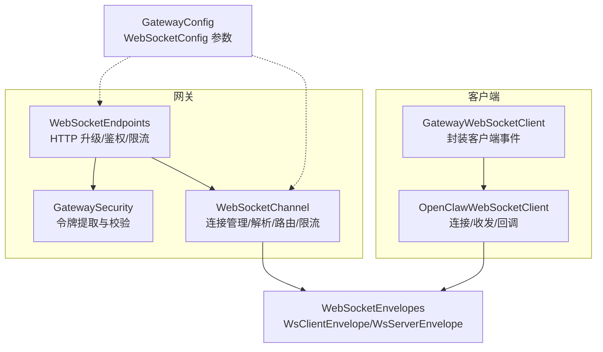
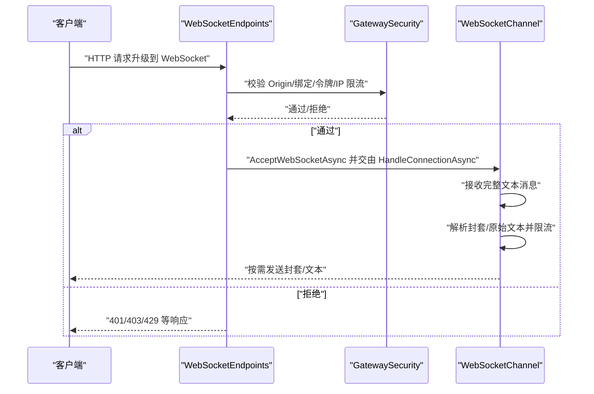
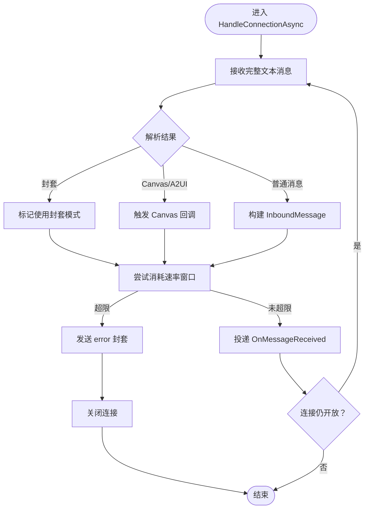
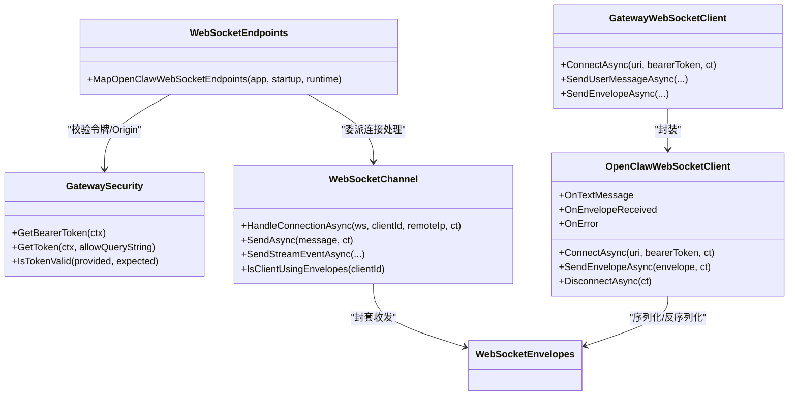

# WebSocket API

<cite>
**本文引用的文件**
- [WebSocketChannel.cs](file://src/OpenClaw.Channels/WebSocketChannel.cs)
- [OpenClawWebSocketClient.cs](file://src/OpenClaw.Client/OpenClawWebSocketClient.cs)
- [GatewayWebSocketClient.cs](file://src/OpenClaw.Companion/Services/GatewayWebSocketClient.cs)
- [WebSocketEnvelopes.cs](file://src/OpenClaw.Core/Models/WebSocketEnvelopes.cs)
- [WebSocketEndpoints.cs](file://src/OpenClaw.Gateway/Endpoints/WebSocketEndpoints.cs)
- [GatewayConfig.cs](file://src/OpenClaw.Core/Models/GatewayConfig.cs)
- [OpenClawWebSocketClientTests.cs](file://src/OpenClaw.Tests/OpenClawWebSocketClientTests.cs)
- [WebSocketChannelTests.cs](file://src/OpenClaw.Tests/WebSocketChannelTests.cs)
- [GatewaySecurity.cs](file://src/OpenClaw.Gateway/GatewaySecurity.cs)
- [StreamingTypes.cs](file://src/OpenClaw.Core/Models/StreamingTypes.cs)
- [webchat.html](file://src/OpenClaw.Gateway/wwwroot/webchat.html)
</cite>

## 目录
1. [简介](#简介)
2. [项目结构](#项目结构)
3. [核心组件](#核心组件)
4. [架构总览](#架构总览)
5. [详细组件分析](#详细组件分析)
6. [依赖关系分析](#依赖关系分析)
7. [性能考量](#性能考量)
8. [故障排查指南](#故障排查指南)
9. [结论](#结论)
10. [附录](#附录)

## 简介
本文件系统性阐述 OpenClaw.NET 的 WebSocket API，覆盖连接建立、握手与认证、消息格式与事件类型、实时交互模式、入站/出站消息处理与路由、连接生命周期与重连策略、错误处理、客户端示例、状态同步机制、序列化与安全选项，以及并发连接管理与性能优化建议。目标读者包括后端开发者、集成工程师与前端对接人员。

## 项目结构
WebSocket API 涉及的关键模块与文件：
- 网关端点：负责 HTTP 到 WebSocket 的升级、请求校验与速率限制
- 通道适配器：负责单连接的收发、解析、路由、限流与连接管理
- 客户端库：提供通用 WebSocket 客户端封装（含事件回调）
- 配置模型：定义 WebSocket 连接与速率限制等参数
- 消息模型：定义客户端/服务端消息封套结构
- 测试用例：验证行为边界（速率限制、超时、回调异常等）

图表来源
- [WebSocketEndpoints.cs:13-61](file://src/OpenClaw.Gateway/Endpoints/WebSocketEndpoints.cs#L13-L61)
- [GatewaySecurity.cs:8-44](file://src/OpenClaw.Gateway/GatewaySecurity.cs#L8-L44)
- [WebSocketChannel.cs:16-74](file://src/OpenClaw.Channels/WebSocketChannel.cs#L16-L74)
- [OpenClawWebSocketClient.cs:9-37](file://src/OpenClaw.Client/OpenClawWebSocketClient.cs#L9-L37)
- [GatewayWebSocketClient.cs:5-22](file://src/OpenClaw.Companion/Services/GatewayWebSocketClient.cs#L5-L22)
- [GatewayConfig.cs:386-393](file://src/OpenClaw.Core/Models/GatewayConfig.cs#L386-L393)
- [WebSocketEnvelopes.cs:7-108](file://src/OpenClaw.Core/Models/WebSocketEnvelopes.cs#L7-L108)

章节来源
- [WebSocketEndpoints.cs:13-61](file://src/OpenClaw.Gateway/Endpoints/WebSocketEndpoints.cs#L13-L61)
- [WebSocketChannel.cs:16-74](file://src/OpenClaw.Channels/WebSocketChannel.cs#L16-L74)
- [OpenClawWebSocketClient.cs:9-37](file://src/OpenClaw.Client/OpenClawWebSocketClient.cs#L9-L37)
- [GatewayWebSocketClient.cs:5-22](file://src/OpenClaw.Companion/Services/GatewayWebSocketClient.cs#L5-L22)
- [GatewayConfig.cs:386-393](file://src/OpenClaw.Core/Models/GatewayConfig.cs#L386-L393)
- [WebSocketEnvelopes.cs:7-108](file://src/OpenClaw.Core/Models/WebSocketEnvelopes.cs#L7-L108)

## 核心组件
- 网关端点与握手
  - 路由 /ws 与 /ws/live，进行 WebSocket 请求升级
  - 校验 Origin、绑定地址与令牌策略，执行 IP 级限流
- 通道适配器（服务端）
  - 维护每连接状态、IP 连接数、速率窗口
  - 解析客户端封套或原始文本，路由到业务管线
  - 支持 JSON 封套模式与原始文本模式；仅封套模式支持流式事件
- 客户端库
  - 提供连接/断开、发送用户消息、发送封套、接收文本与封套事件
  - 内置发送锁、最大消息长度检查、接收循环与错误回调
- 消息模型
  - 客户端封套（WsClientEnvelope）与服务端封套（WsServerEnvelope），统一承载消息类型、会话/消息 ID、内容与扩展字段
- 配置
  - 最大消息字节、最大连接数、每 IP 最大连接数、每连接每分钟消息数、接收超时等

章节来源
- [WebSocketEndpoints.cs:18-60](file://src/OpenClaw.Gateway/Endpoints/WebSocketEndpoints.cs#L18-L60)
- [WebSocketChannel.cs:76-151](file://src/OpenClaw.Channels/WebSocketChannel.cs#L76-L151)
- [OpenClawWebSocketClient.cs:38-117](file://src/OpenClaw.Client/OpenClawWebSocketClient.cs#L38-L117)
- [WebSocketEnvelopes.cs:7-108](file://src/OpenClaw.Core/Models/WebSocketEnvelopes.cs#L7-L108)
- [GatewayConfig.cs:386-393](file://src/OpenClaw.Core/Models/GatewayConfig.cs#L386-L393)

## 架构总览
WebSocket API 的端到端交互流程如下：

图表来源
- [WebSocketEndpoints.cs:18-94](file://src/OpenClaw.Gateway/Endpoints/WebSocketEndpoints.cs#L18-L94)
- [GatewaySecurity.cs:13-44](file://src/OpenClaw.Gateway/GatewaySecurity.cs#L13-L44)
- [WebSocketChannel.cs:76-151](file://src/OpenClaw.Channels/WebSocketChannel.cs#L76-L151)

## 详细组件分析

### 连接建立与握手
- 升级路径
  - /ws：通用控制平面
  - /ws/live：直播会话桥接
- 握手校验
  - 必须是 WebSocket 请求
  - Origin 白名单/匹配校验
  - 非回环绑定时要求有效令牌（支持引导令牌与账户令牌）
  - IP 级限流（bucket: websocket 或 websocket_live）
- 成功后将连接委派给通道适配器进行消息循环

章节来源
- [WebSocketEndpoints.cs:18-60](file://src/OpenClaw.Gateway/Endpoints/WebSocketEndpoints.cs#L18-L60)
- [WebSocketEndpoints.cs:63-94](file://src/OpenClaw.Gateway/Endpoints/WebSocketEndpoints.cs#L63-L94)
- [GatewaySecurity.cs:13-44](file://src/OpenClaw.Gateway/GatewaySecurity.cs#L13-L44)

### 认证与授权
- 令牌来源优先级：Authorization 头（Bearer） > 查询参数（可配置是否允许）
- 支持两种模式：
  - 引导令牌：启动配置中的固定令牌
  - 账户令牌：通过 OperatorAccountService 认证
- 回环绑定（127.0.0.1）默认放行，非回环绑定必须携带有效令牌

章节来源
- [GatewaySecurity.cs:13-44](file://src/OpenClaw.Gateway/GatewaySecurity.cs#L13-L44)
- [WebSocketEndpoints.cs:96-118](file://src/OpenClaw.Gateway/Endpoints/WebSocketEndpoints.cs#L96-L118)

### 消息格式与事件类型
- 客户端封套（WsClientEnvelope）
  - 基本字段：Type、SessionId、MessageId、ReplyToMessageId、Text/Content 等
  - Canvas/A2UI 扩展：SurfaceId/ComponentId/Event/ValueJson/Sequence 等
  - 工具审批：ApprovalId、Approved
- 服务端封套（WsServerEnvelope）
  - 基本字段：Type、Text、InReplyToMessageId、SessionId 等
  - 流式事件映射：assistant_chunk、tool_start、tool_chunk、tool_result、error、assistant_done 等
  - 艺术品/阶段门：Artifact、StageGate 等扩展
- 文本模式
  - 若首字符不是 {，则视为原始文本直接透传

章节来源
- [WebSocketEnvelopes.cs:7-108](file://src/OpenClaw.Core/Models/WebSocketEnvelopes.cs#L7-L108)
- [StreamingTypes.cs:71-87](file://src/OpenClaw.Core/Models/StreamingTypes.cs#L71-L87)

### 入站消息处理与路由
- 接收循环
  - 读取完整文本消息（支持分片拼接，受最大消息长度限制）
  - 解析客户端封套：识别 user_message、tool_approval_decision、Canvas/A2UI 事件/动作等
  - 若为 Canvas/A2UI 交互封套，触发 OnCanvasClientEnvelopeReceived
- 速率限制
  - 每连接每分钟速率窗口，超限则发送 error 封套并关闭连接
- 路由到业务
  - 将解析后的 InboundMessage 投递到 OnMessageReceived（业务管线）

图表来源
- [WebSocketChannel.cs:76-151](file://src/OpenClaw.Channels/WebSocketChannel.cs#L76-L151)
- [WebSocketChannel.cs:523-581](file://src/OpenClaw.Channels/WebSocketChannel.cs#L523-L581)

章节来源
- [WebSocketChannel.cs:76-151](file://src/OpenClaw.Channels/WebSocketChannel.cs#L76-L151)
- [WebSocketChannel.cs:523-581](file://src/OpenClaw.Channels/WebSocketChannel.cs#L523-L581)

### 出站消息传递与流式事件
- 普通消息
  - 若客户端使用封套：发送 WsServerEnvelope（Type=assistant_message）
  - 否则：发送原始文本
- 流式事件
  - 仅对使用封套模式的客户端生效
  - 支持多种事件类型映射（文本增量、工具开始/增量/结果、错误、完成）
- 发送路径
  - 使用 per-connection SendLock 保证并发安全
  - 发送前保留发送配额，完成后释放

章节来源
- [WebSocketChannel.cs:153-170](file://src/OpenClaw.Channels/WebSocketChannel.cs#L153-L170)
- [WebSocketChannel.cs:247-296](file://src/OpenClaw.Channels/WebSocketChannel.cs#L247-L296)
- [StreamingTypes.cs:71-87](file://src/OpenClaw.Core/Models/StreamingTypes.cs#L71-L87)

### 连接生命周期管理
- 建立
  - 通过 /ws 升级成功后，通道适配器维护 ConnectionState（Socket、IP 键、封套模式、发送锁、速率窗口、生命周期门等）
- 断开
  - 主动断开：清理接收任务、取消令牌、关闭 Socket、释放资源
  - 被动断开：收到 Close 或异常时清理并移除连接
- 连接上限
  - 总连接数与每 IP 连接数均有限制，超过即拒绝并关闭
- 关闭语义
  - 正常关闭使用 NormalClosure，错误/超限使用 PolicyViolation/MessageTooBig 等

章节来源
- [WebSocketChannel.cs:334-381](file://src/OpenClaw.Channels/WebSocketChannel.cs#L334-L381)
- [WebSocketChannel.cs:642-648](file://src/OpenClaw.Channels/WebSocketChannel.cs#L642-L648)
- [OpenClawWebSocketClient.cs:59-117](file://src/OpenClaw.Client/OpenClawWebSocketClient.cs#L59-L117)

### 重连策略与错误处理
- 客户端
  - 连接失败：根据返回状态码（401/403/429/400）决定是否重试
  - 接收循环异常：捕获并触发 OnError，继续运行直到连接关闭
  - 断开等待在途发送完成，避免数据丢失
- 服务端
  - 速率超限：发送 error 封套并关闭
  - 接收超时：关闭连接
  - 连接上限/每 IP 上限：拒绝并关闭
- 测试验证
  - 速率超限与接收超时的行为已在单元测试中覆盖

章节来源
- [OpenClawWebSocketClient.cs:158-227](file://src/OpenClaw.Client/OpenClawWebSocketClient.cs#L158-L227)
- [WebSocketChannel.cs:96-112](file://src/OpenClaw.Channels/WebSocketChannel.cs#L96-L112)
- [WebSocketChannel.cs:420-433](file://src/OpenClaw.Channels/WebSocketChannel.cs#L420-L433)
- [OpenClawWebSocketClientTests.cs:9-26](file://src/OpenClaw.Tests/OpenClawWebSocketClientTests.cs#L9-L26)
- [WebSocketChannelTests.cs:419-433](file://src/OpenClaw.Tests/WebSocketChannelTests.cs#L419-L433)

### 客户端连接示例与消息收发
- 基础客户端
  - 连接：设置 Authorization 头（Bearer），发起 ConnectAsync
  - 发送：SendUserMessageAsync 或 SendEnvelopeAsync
  - 接收：订阅 OnTextMessage 与 OnEnvelopeReceived
  - 断开：DisconnectAsync
- 封装客户端（Companion）
  - GatewayWebSocketClient 对外暴露相同事件，内部委托 OpenClawWebSocketClient
- 前端示例
  - webchat.html 展示了如何基于令牌构造 ws://host/ws?token=... 并处理 onopen/onmessage

章节来源
- [OpenClawWebSocketClient.cs:38-156](file://src/OpenClaw.Client/OpenClawWebSocketClient.cs#L38-L156)
- [GatewayWebSocketClient.cs:24-34](file://src/OpenClaw.Companion/Services/GatewayWebSocketClient.cs#L24-L34)
- [webchat.html:4352-4390](file://src/OpenClaw.Gateway/wwwroot/webchat.html#L4352-L4390)

### 状态同步机制
- Canvas/A2UI 事件
  - 客户端发送 a2ui_event/a2ui_action，服务端解析后可触发业务逻辑
  - 服务端可通过 SendStreamEventAsync 发送流式事件，实现状态推进
- 会话与消息 ID
  - 封套中携带 SessionId/MessageId/ReplyToMessageId，确保上下文一致性

章节来源
- [WebSocketChannel.cs:583-593](file://src/OpenClaw.Channels/WebSocketChannel.cs#L583-L593)
- [WebSocketChannel.cs:247-296](file://src/OpenClaw.Channels/WebSocketChannel.cs#L247-L296)
- [WebSocketEnvelopes.cs:7-48](file://src/OpenClaw.Core/Models/WebSocketEnvelopes.cs#L7-L48)

### 序列化、压缩与加密
- 序列化
  - 使用 System.Text.Json，采用 CoreJsonContext 进行封套序列化
- 压缩
  - 未内置压缩；如需压缩可在应用层自行实现
- 加密
  - 建议通过 HTTPS/TLS 传输，确保 WebSocket 在 wss:// 下运行

章节来源
- [WebSocketEnvelopes.cs:7-108](file://src/OpenClaw.Core/Models/WebSocketEnvelopes.cs#L7-L108)
- [WebSocketChannel.cs:158-167](file://src/OpenClaw.Channels/WebSocketChannel.cs#L158-L167)
- [OpenClawWebSocketClient.cs:132-150](file://src/OpenClaw.Client/OpenClawWebSocketClient.cs#L132-L150)

### 并发连接管理与资源清理
- 并发
  - 每连接发送使用 SemaphoreSlim 串行化，避免竞态
  - 发送预留/完成机制防止连接移除时的数据竞争
- 清理
  - 连接移除时释放 Socket、发送锁与相关计数
  - 关闭时使用正常关闭码，避免资源泄漏

章节来源
- [WebSocketChannel.cs:192-232](file://src/OpenClaw.Channels/WebSocketChannel.cs#L192-L232)
- [WebSocketChannel.cs:383-433](file://src/OpenClaw.Channels/WebSocketChannel.cs#L383-L433)
- [WebSocketChannel.cs:298-317](file://src/OpenClaw.Channels/WebSocketChannel.cs#L298-L317)

## 依赖关系分析

图表来源
- [WebSocketEndpoints.cs:13-61](file://src/OpenClaw.Gateway/Endpoints/WebSocketEndpoints.cs#L13-L61)
- [GatewaySecurity.cs:8-44](file://src/OpenClaw.Gateway/GatewaySecurity.cs#L8-L44)
- [WebSocketChannel.cs:16-74](file://src/OpenClaw.Channels/WebSocketChannel.cs#L16-L74)
- [OpenClawWebSocketClient.cs:9-37](file://src/OpenClaw.Client/OpenClawWebSocketClient.cs#L9-L37)
- [GatewayWebSocketClient.cs:5-22](file://src/OpenClaw.Companion/Services/GatewayWebSocketClient.cs#L5-L22)
- [WebSocketEnvelopes.cs:7-108](file://src/OpenClaw.Core/Models/WebSocketEnvelopes.cs#L7-L108)

## 性能考量
- 连接与速率
  - 合理设置 MaxConnections、MaxConnectionsPerIp、MessagesPerMinutePerConnection
  - 对高吞吐场景启用封套模式以支持流式事件
- 内存与缓冲
  - 使用 ArrayPool<byte> 与 ArrayBufferWriter<byte> 降低 GC 压力
  - 控制 MaxMessageBytes，避免内存膨胀
- 超时与稳定性
  - 设置 ReceiveTimeoutSeconds，避免阻塞导致资源占用
  - 对异常与取消进行显式处理，确保快速恢复

章节来源
- [GatewayConfig.cs:386-393](file://src/OpenClaw.Core/Models/GatewayConfig.cs#L386-L393)
- [WebSocketChannel.cs:435-510](file://src/OpenClaw.Channels/WebSocketChannel.cs#L435-L510)
- [OpenClawWebSocketClient.cs:160-161](file://src/OpenClaw.Client/OpenClawWebSocketClient.cs#L160-L161)

## 故障排查指南
- 常见错误与对策
  - 400 Bad Request：非 WebSocket 请求或握手失败
  - 401 Unauthorized：非回环绑定缺少有效令牌
  - 403 Forbidden：Origin 不被允许
  - 429 Too Many Requests：IP 限流或速率超限
  - 连接被关闭：检查服务端日志与封套错误消息
- 行为验证
  - 速率超限：服务端会发送 error 封套并关闭连接
  - 接收超时：服务端主动关闭
  - 回调异常：客户端 OnError 会被触发，但接收循环继续

章节来源
- [WebSocketEndpoints.cs:63-94](file://src/OpenClaw.Gateway/Endpoints/WebSocketEndpoints.cs#L63-L94)
- [WebSocketChannel.cs:96-112](file://src/OpenClaw.Channels/WebSocketChannel.cs#L96-L112)
- [WebSocketChannel.cs:420-433](file://src/OpenClaw.Channels/WebSocketChannel.cs#L420-L433)
- [OpenClawWebSocketClientTests.cs:29-56](file://src/OpenClaw.Tests/OpenClawWebSocketClientTests.cs#L29-L56)
- [WebSocketChannelTests.cs:419-433](file://src/OpenClaw.Tests/WebSocketChannelTests.cs#L419-L433)

## 结论
OpenClaw.NET 的 WebSocket API 以清晰的封套模型与严格的连接/速率管控为基础，既满足通用聊天场景，又为 Canvas/A2UI 与流式事件提供了扩展能力。通过合理的配置与客户端实践，可在安全性、稳定性与性能之间取得良好平衡。

## 附录

### 配置项速览（GatewayConfig.WebSocketConfig）
- MaxMessageBytes：最大消息字节数
- MaxConnections：最大连接数
- MaxConnectionsPerIp：每 IP 最大连接数
- MessagesPerMinutePerConnection：每连接每分钟消息数
- ReceiveTimeoutSeconds：接收超时秒数

章节来源
- [GatewayConfig.cs:386-393](file://src/OpenClaw.Core/Models/GatewayConfig.cs#L386-L393)

### 事件类型映射（流式事件）
- assistant_chunk ↔ 文本增量
- tool_start / tool_chunk / tool_result ↔ 工具执行流
- error ↔ 错误
- assistant_done ↔ 完成

章节来源
- [StreamingTypes.cs:71-87](file://src/OpenClaw.Core/Models/StreamingTypes.cs#L71-L87)