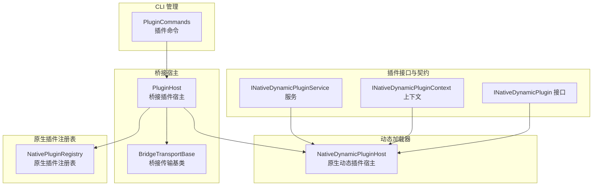
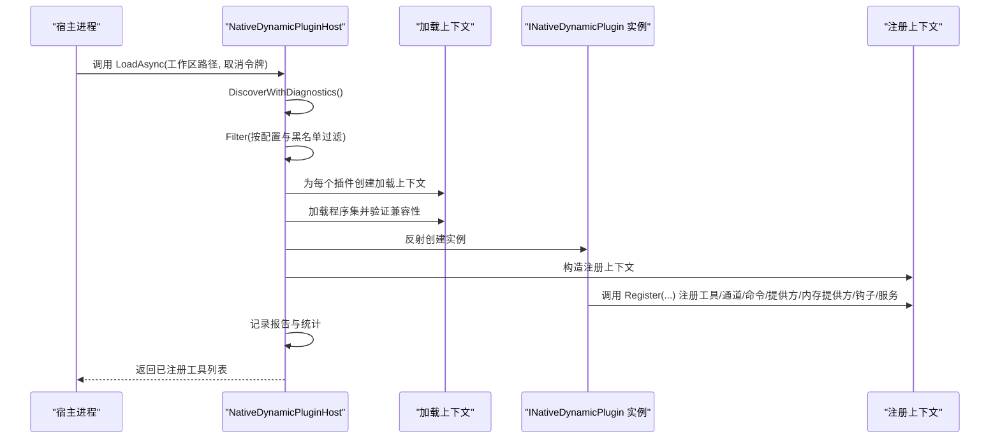
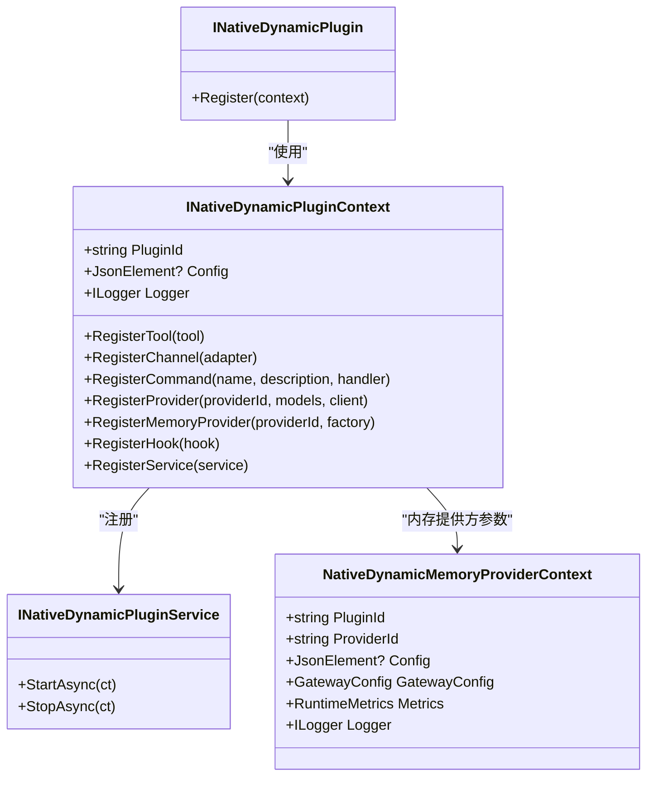
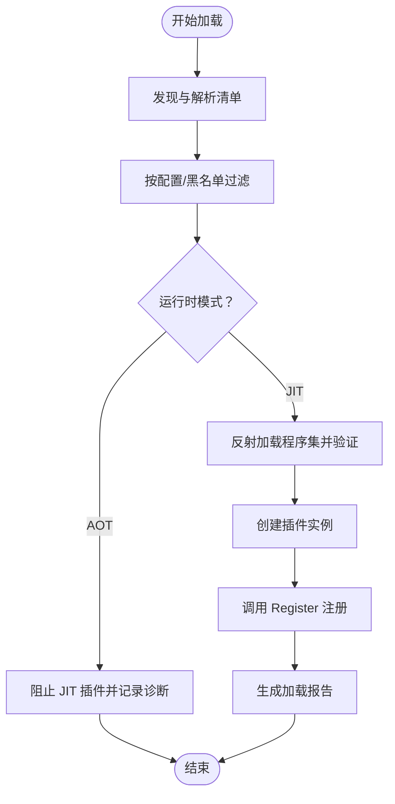
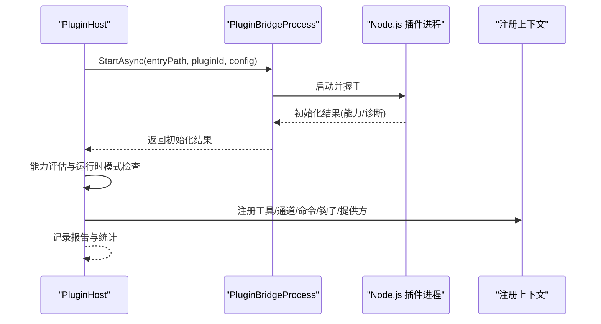
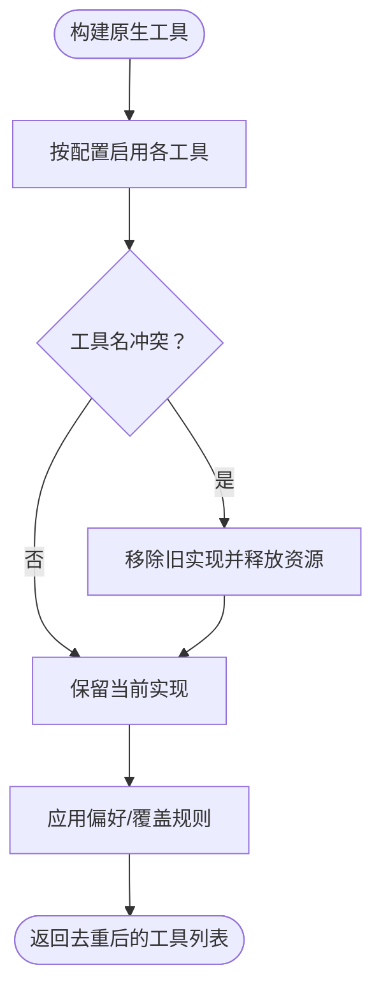
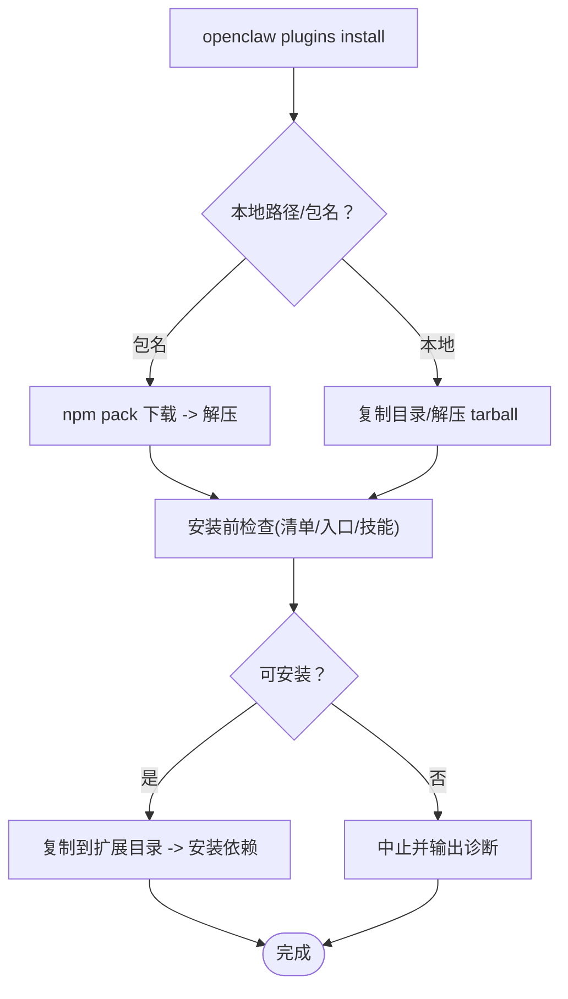
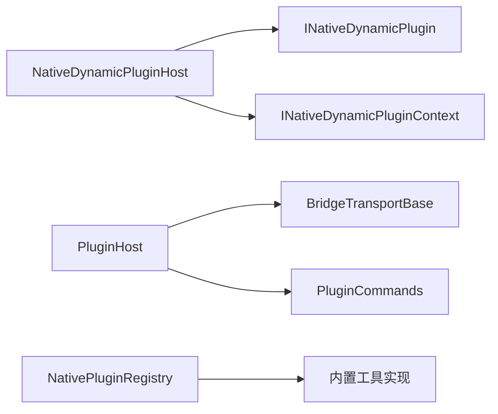

# 插件 API

<cite>
**本文引用的文件**
- [INativeDynamicPlugin.cs](file://src/OpenClaw.PluginKit/INativeDynamicPlugin.cs)
- [NativeDynamicPluginHost.cs](file://src/OpenClaw.Agent/Plugins/NativeDynamicPluginHost.cs)
- [PluginHost.cs](file://src/OpenClaw.Agent/Plugins/PluginHost.cs)
- [NativePluginRegistry.cs](file://src/OpenClaw.Agent/Plugins/NativePluginRegistry.cs)
- [PluginCommands.cs](file://src/OpenClaw.Cli/PluginCommands.cs)
- [openclaw.native-plugin.json（就业教练工作流）](file://src/OpenClaw.Plugins.EmploymentCoachWorkflow/openclaw.native-plugin.json)
- [openclaw.native-plugin.json（MemPalace 内存）](file://src/OpenClaw.Plugins.Mempalace/openclaw.native-plugin.json)
- [BridgeTransportBase.cs](file://src/OpenClaw.Agent/Plugins/BridgeTransportBase.cs)
- [EmploymentCoachWorkflowPlugin.cs](file://src/OpenClaw.Plugins.EmploymentCoachWorkflow/EmploymentCoachWorkflowPlugin.cs)
- [MempalaceMemoryPlugin.cs](file://src/OpenClaw.Plugins.Mempalace/MempalaceMemoryPlugin.cs)
</cite>

## 目录
1. [简介](#简介)
2. [项目结构](#项目结构)
3. [核心组件](#核心组件)
4. [架构总览](#架构总览)
5. [详细组件分析](#详细组件分析)
6. [依赖关系分析](#依赖关系分析)
7. [性能考量](#性能考量)
8. [故障排查指南](#故障排查指南)
9. [结论](#结论)
10. [附录](#附录)

## 简介
本文件为 OpenClaw.NET 插件 API 的完整参考文档，覆盖原生动态插件接口、动态加载机制、能力评估与生命周期管理，以及工具暴露、配置管理与错误处理。文档同时提供插件开发示例、调试技巧与性能优化建议，并讨论插件隔离、安全控制与版本管理策略。

## 项目结构
OpenClaw 的插件系统由以下关键模块组成：
- 插件接口定义：位于 PluginKit，定义原生动态插件的注册上下文与服务契约。
- 动态加载器：负责发现、验证、加载与卸载原生动态插件。
- 桥接插件宿主：负责发现、启动与通信 Node.js 插件桥进程，注册工具、通道、命令、事件钩子与模型提供方。
- 原生插件注册表：管理内置 C# 工具的“原生副本”，并支持与桥接插件工具的偏好选择。
- CLI 插件管理：提供安装、移除、列出与搜索插件的能力。
- 传输层抽象：桥接传输基类，统一请求/响应与通知分发。
- 示例插件：展示如何实现原生动态插件与内存提供者。

图表来源
- [INativeDynamicPlugin.cs:11-46](file://src/OpenClaw.PluginKit/INativeDynamicPlugin.cs#L11-L46)
- [NativeDynamicPluginHost.cs:16-51](file://src/OpenClaw.Agent/Plugins/NativeDynamicPluginHost.cs#L16-L51)
- [PluginHost.cs:10-53](file://src/OpenClaw.Agent/Plugins/PluginHost.cs#L10-L53)
- [BridgeTransportBase.cs:10-24](file://src/OpenClaw.Agent/Plugins/BridgeTransportBase.cs#L10-L24)
- [NativePluginRegistry.cs:9-20](file://src/OpenClaw.Agent/Plugins/NativePluginRegistry.cs#L9-L20)
- [PluginCommands.cs:9-37](file://src/OpenClaw.Cli/PluginCommands.cs#L9-L37)

章节来源
- [INativeDynamicPlugin.cs:11-46](file://src/OpenClaw.PluginKit/INativeDynamicPlugin.cs#L11-L46)
- [NativeDynamicPluginHost.cs:16-51](file://src/OpenClaw.Agent/Plugins/NativeDynamicPluginHost.cs#L16-L51)
- [PluginHost.cs:10-53](file://src/OpenClaw.Agent/Plugins/PluginHost.cs#L10-L53)
- [BridgeTransportBase.cs:10-24](file://src/OpenClaw.Agent/Plugins/BridgeTransportBase.cs#L10-L24)
- [NativePluginRegistry.cs:9-20](file://src/OpenClaw.Agent/Plugins/NativePluginRegistry.cs#L9-L20)
- [PluginCommands.cs:9-37](file://src/OpenClaw.Cli/PluginCommands.cs#L9-L37)

## 核心组件
- 原生动态插件接口与上下文
  - INativeDynamicPlugin：插件入口，通过 Register 方法接收上下文进行注册。
  - INativeDynamicPluginContext：提供插件 ID、配置、日志记录器，以及注册工具、通道、命令、模型提供方、内存提供方工厂、事件钩子与服务的能力。
  - INativeDynamicPluginService：声明周期服务接口，支持异步启动与停止。
  - NativeDynamicMemoryProviderContext：内存提供方上下文，包含插件 ID、提供方 ID、配置、网关配置、运行指标与日志器。
- 动态加载器
  - NativeDynamicPluginHost：负责发现、过滤、加载原生动态插件；在 AOT 模式下阻止 JIT 插件；对失败加载进行清理；生成结构化诊断报告。
- 桥接插件宿主
  - PluginHost：负责发现、过滤、启动 Node.js 插件桥进程；校验兼容性与能力；注册工具、通道、命令、事件钩子与模型提供方；提供重启计数与内存快照查询。
- 原生插件注册表
  - NativePluginRegistry：构建内置 C# 工具的“原生副本”；支持重复工具名覆盖与资源托管；提供工具偏好解析逻辑。
- CLI 插件管理
  - PluginCommands：提供安装、移除、列出、搜索插件；支持从 npm/ClawHub 或本地源安装；执行安装前检查与信任级别判定。
- 传输层抽象
  - BridgeTransportBase：统一桥接传输的读写循环、请求/响应与通知分发；维护挂起请求、超时与取消；提供可扩展的 StartAsync 实现。

章节来源
- [INativeDynamicPlugin.cs:11-46](file://src/OpenClaw.PluginKit/INativeDynamicPlugin.cs#L11-L46)
- [NativeDynamicPluginHost.cs:64-169](file://src/OpenClaw.Agent/Plugins/NativeDynamicPluginHost.cs#L64-L169)
- [PluginHost.cs:95-179](file://src/OpenClaw.Agent/Plugins/PluginHost.cs#L95-L179)
- [NativePluginRegistry.cs:13-104](file://src/OpenClaw.Agent/Plugins/NativePluginRegistry.cs#L13-L104)
- [PluginCommands.cs:18-37](file://src/OpenClaw.Cli/PluginCommands.cs#L18-L37)
- [BridgeTransportBase.cs:10-89](file://src/OpenClaw.Agent/Plugins/BridgeTransportBase.cs#L10-L89)

## 架构总览
OpenClaw 支持两类插件：
- 原生动态插件（.NET，JIT-only）
  - 通过 openclaw.native-plugin.json 清单声明入口程序集与类型，由 NativeDynamicPluginHost 发现与加载。
- 桥接插件（Node.js）
  - 通过 openclaw.plugin.json 清单声明入口文件或扩展点，由 PluginHost 启动 Node.js 进程并通过桥接传输通信。

图表来源
- [NativeDynamicPluginHost.cs:64-345](file://src/OpenClaw.Agent/Plugins/NativeDynamicPluginHost.cs#L64-L345)

章节来源
- [NativeDynamicPluginHost.cs:64-345](file://src/OpenClaw.Agent/Plugins/NativeDynamicPluginHost.cs#L64-L345)

## 详细组件分析

### 原生动态插件接口与上下文
- 接口职责
  - INativeDynamicPlugin：插件生命周期入口，负责在 Register 中完成所有注册。
  - INativeDynamicPluginContext：提供注册 API，包括工具、通道、命令、模型提供方、内存提供方工厂、事件钩子与服务。
  - INativeDynamicPluginService：用于长生命周期服务的启动/停止。
- 数据结构与复杂度
  - 注册集合为线性增长，去重基于名称比较，冲突时保留后注册项。
- 错误处理
  - 类型不存在、不实现接口、清单解析失败、配置不合法等均会记录诊断并中断加载。
- 性能影响
  - 反射加载与 JIT 仅在原生动态模式启用；AOT 模式下直接阻止加载。

图表来源
- [INativeDynamicPlugin.cs:11-46](file://src/OpenClaw.PluginKit/INativeDynamicPlugin.cs#L11-L46)

章节来源
- [INativeDynamicPlugin.cs:11-46](file://src/OpenClaw.PluginKit/INativeDynamicPlugin.cs#L11-L46)

### 原生动态插件加载与生命周期
- 发现与过滤
  - 支持多路径扫描与工作区路径合并；去重插件 ID；校验清单与程序集路径是否在根目录内。
- 兼容性与能力评估
  - 校验最小宿主版本与插件 API 版本；AOT 模式下禁止 JIT-only 插件；计算请求能力集合。
- 注册与回滚
  - 成功注册后记录报告；失败时清理已启动的服务与加载上下文，回滚到之前状态。
- 生命周期
  - 提供异步释放，逐个停止服务并卸载程序集上下文。

图表来源
- [NativeDynamicPluginHost.cs:86-169](file://src/OpenClaw.Agent/Plugins/NativeDynamicPluginHost.cs#L86-L169)

章节来源
- [NativeDynamicPluginHost.cs:86-169](file://src/OpenClaw.Agent/Plugins/NativeDynamicPluginHost.cs#L86-L169)

### 桥接插件宿主与传输层
- 发现与过滤
  - 通过 PluginDiscovery 解析清单，按允许/拒绝列表与启用状态过滤。
- 启动与兼容性
  - 启动 Node.js 桥进程，等待初始化结果；校验能力与运行时模式；记录技能目录与诊断。
- 注册与路由
  - 将工具包装为桥接工具；通道消息与认证事件通过通知处理器分发至对应适配器；命令注册到聊天处理器。
- 传输层
  - 统一请求/响应与通知协议；维护挂起请求、超时与取消；提供可扩展 StartAsync。

图表来源
- [PluginHost.cs:181-396](file://src/OpenClaw.Agent/Plugins/PluginHost.cs#L181-L396)
- [BridgeTransportBase.cs:40-75](file://src/OpenClaw.Agent/Plugins/BridgeTransportBase.cs#L40-L75)

章节来源
- [PluginHost.cs:181-396](file://src/OpenClaw.Agent/Plugins/PluginHost.cs#L181-L396)
- [BridgeTransportBase.cs:40-75](file://src/OpenClaw.Agent/Plugins/BridgeTransportBase.cs#L40-L75)

### 原生插件注册表与工具偏好
- 构建内置工具副本：根据配置启用 WebSearch、Git、CodeExec、ImageGen、PDF、Calendar、Email、Database、InboxZero、HomeAssistant、MQTT、Notion 等工具。
- 重复工具名处理：若与现有工具同名，先移除旧实现再注册新实现，并尝试释放旧资源。
- 偏好解析：支持全局偏好与逐工具覆盖，确保每种工具名只保留一个实现。

图表来源
- [NativePluginRegistry.cs:20-104](file://src/OpenClaw.Agent/Plugins/NativePluginRegistry.cs#L20-L104)
- [NativePluginRegistry.cs:137-233](file://src/OpenClaw.Agent/Plugins/NativePluginRegistry.cs#L137-L233)

章节来源
- [NativePluginRegistry.cs:20-104](file://src/OpenClaw.Agent/Plugins/NativePluginRegistry.cs#L20-L104)
- [NativePluginRegistry.cs:137-233](file://src/OpenClaw.Agent/Plugins/NativePluginRegistry.cs#L137-L233)

### CLI 插件管理
- 安装
  - 支持从 npm/ClawHub 或本地路径安装；下载 tarball、解压、检查清单与入口文件、决定目标目录、安装依赖。
- 移除
  - 删除扩展目录中的插件目录，提示重启以生效。
- 列出
  - 扫描扩展目录，输出插件清单、信任级别与声明表面信息。
- 搜索
  - 查询 npm 包，输出匹配结果。
- 安装前检查
  - 验证清单、入口文件、技能目录存在性与合法性，计算错误/警告数量，判定信任级别。

图表来源
- [PluginCommands.cs:39-159](file://src/OpenClaw.Cli/PluginCommands.cs#L39-L159)
- [PluginCommands.cs:161-242](file://src/OpenClaw.Cli/PluginCommands.cs#L161-L242)
- [PluginCommands.cs:275-317](file://src/OpenClaw.Cli/PluginCommands.cs#L275-L317)
- [PluginCommands.cs:319-364](file://src/OpenClaw.Cli/PluginCommands.cs#L319-L364)

章节来源
- [PluginCommands.cs:39-159](file://src/OpenClaw.Cli/PluginCommands.cs#L39-L159)
- [PluginCommands.cs:161-242](file://src/OpenClaw.Cli/PluginCommands.cs#L161-L242)
- [PluginCommands.cs:275-317](file://src/OpenClaw.Cli/PluginCommands.cs#L275-L317)
- [PluginCommands.cs:319-364](file://src/OpenClaw.Cli/PluginCommands.cs#L319-L364)

### 插件开发示例
- 原生动态插件
  - 使用 openclaw.native-plugin.json 声明入口程序集与类型，实现 INativeDynamicPlugin，在 Register 中调用上下文 API 注册工具/通道/命令/提供方/内存提供方/钩子/服务。
  - 示例清单：就业教练工作流、MemPalace 内存提供者。
- 内存提供者
  - 在 Register 中通过 RegisterMemoryProvider 注册工厂方法，返回 IMemoryStore 实例；可结合 NativeDynamicMemoryProviderContext 获取网关配置与指标。
- 原生工具
  - 可通过 NativePluginRegistry 注册内置工具副本，或在桥接插件中通过注册上下文暴露工具。

章节来源
- [openclaw.native-plugin.json（就业教练工作流）:1-11](file://src/OpenClaw.Plugins.EmploymentCoachWorkflow/openclaw.native-plugin.json#L1-L11)
- [openclaw.native-plugin.json（MemPalace 内存）:1-10](file://src/OpenClaw.Plugins.Mempalace/openclaw.native-plugin.json#L1-L10)
- [EmploymentCoachWorkflowPlugin.cs:5-10](file://src/OpenClaw.Plugins.EmploymentCoachWorkflow/EmploymentCoachWorkflowPlugin.cs#L5-L10)
- [MempalaceMemoryPlugin.cs:8-19](file://src/OpenClaw.Plugins.Mempalace/MempalaceMemoryPlugin.cs#L8-L19)

## 依赖关系分析
- 组件耦合
  - NativeDynamicPluginHost 依赖 PluginKit 接口与 Core 抽象；PluginHost 依赖桥接传输与 Core 模型。
  - NativePluginRegistry 依赖具体工具实现与配置。
- 外部依赖
  - CLI 依赖 npm 与文件系统；桥接传输依赖 Node.js 进程与 JSON 协议。
- 循环依赖
  - 插件注册为单向依赖，无循环引用迹象。

图表来源
- [NativeDynamicPluginHost.cs:16-51](file://src/OpenClaw.Agent/Plugins/NativeDynamicPluginHost.cs#L16-L51)
- [PluginHost.cs:14-53](file://src/OpenClaw.Agent/Plugins/PluginHost.cs#L14-L53)
- [NativePluginRegistry.cs:13-20](file://src/OpenClaw.Agent/Plugins/NativePluginRegistry.cs#L13-L20)

章节来源
- [NativeDynamicPluginHost.cs:16-51](file://src/OpenClaw.Agent/Plugins/NativeDynamicPluginHost.cs#L16-L51)
- [PluginHost.cs:14-53](file://src/OpenClaw.Agent/Plugins/PluginHost.cs#L14-L53)
- [NativePluginRegistry.cs:13-20](file://src/OpenClaw.Agent/Plugins/NativePluginRegistry.cs#L13-L20)

## 性能考量
- 原生动态插件
  - 仅在 JIT 模式可用，避免 AOT 下的反射与 JIT 开销；建议将稳定工具迁移为原生副本以减少跨进程开销。
- 桥接插件
  - 通过传输层统一协议，注意请求/响应与通知的序列化成本；合理设置超时与取消以避免阻塞。
- 工具偏好
  - 优先选择原生工具可降低延迟；在需要桥接生态能力时再选择桥接工具。
- 资源管理
  - 服务与通道适配器需在关闭时正确释放；原生注册表在替换工具时主动释放旧资源。

## 故障排查指南
- 原生动态插件
  - AOT 模式加载失败：确认插件声明为 JIT-only 并在 AOT 模式下被阻止。
  - 程序集加载失败：检查清单中的程序集路径是否在根目录内且存在。
  - 版本不兼容：核对最小宿主版本与插件 API 主版本号。
  - 注册冲突：工具名重复时后注册覆盖前注册，检查日志中的警告。
- 桥接插件
  - 初始化失败：检查能力声明与运行时模式；查看诊断信息与错误码。
  - 通道消息未到达：确认通知处理器已设置并能定位到目标适配器。
- CLI 安装
  - npm 命令不可用：确保已安装 npm；检查网络与权限。
  - 安装前检查失败：修正清单、入口文件或技能目录路径。

章节来源
- [NativeDynamicPluginHost.cs:86-169](file://src/OpenClaw.Agent/Plugins/NativeDynamicPluginHost.cs#L86-L169)
- [PluginHost.cs:212-272](file://src/OpenClaw.Agent/Plugins/PluginHost.cs#L212-L272)
- [PluginCommands.cs:425-458](file://src/OpenClaw.Cli/PluginCommands.cs#L425-L458)

## 结论
OpenClaw 的插件系统通过原生动态插件与桥接插件两条路径，提供了灵活的扩展能力。原生动态插件强调强类型与性能，桥接插件强调生态与快速迭代。通过严格的发现、过滤、兼容性评估与生命周期管理，系统在保证稳定性的同时兼顾了可观测性与可维护性。建议在生产环境中优先采用原生工具与受信桥接插件，并配合 CLI 进行安装与诊断。

## 附录
- 安全与隔离
  - 运行时模式限制：AOT 模式下阻止 JIT-only 插件，降低攻击面。
  - 插件隔离：原生动态插件运行在独立的程序集加载上下文中，桥接插件运行在独立的 Node.js 进程中。
  - 通道与钩子：通过通知处理器与适配器实现消息路由与鉴权事件处理。
- 版本管理
  - 最小宿主版本与插件 API 主版本号校验，防止不兼容升级。
- 配置管理
  - 插件清单与配置 Schema 支持声明式能力与参数校验；CLI 提供安装前检查与信任级别判定。