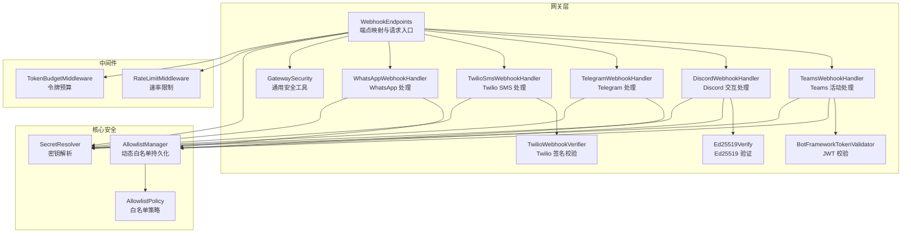
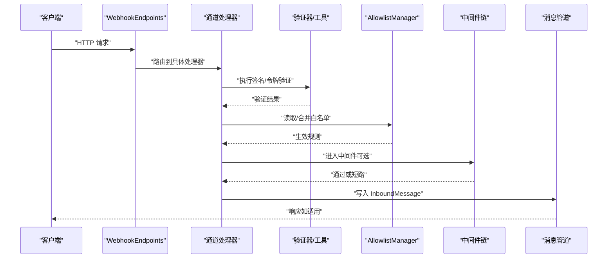
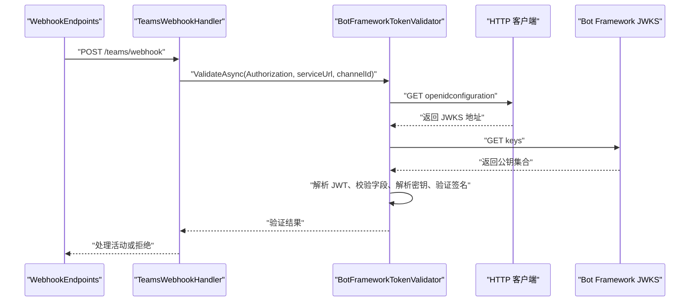
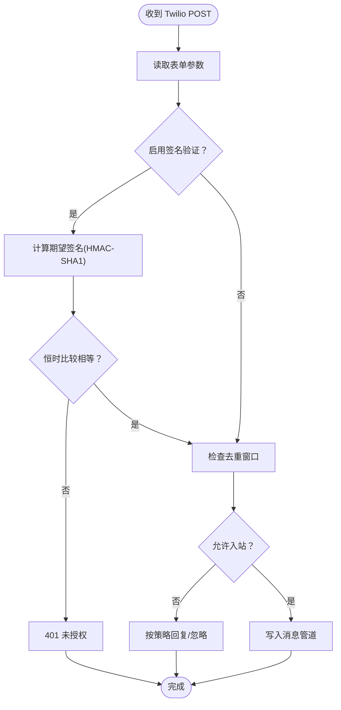
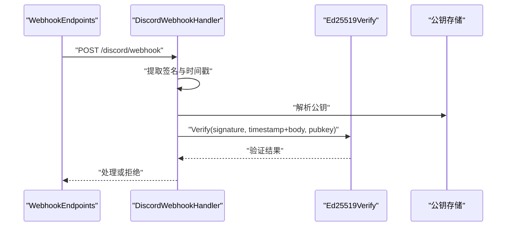
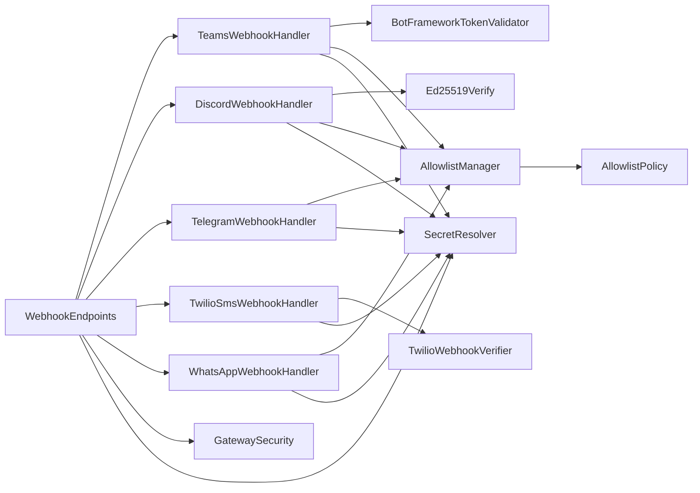

# 认证授权

<cite>
**本文引用的文件**
- [BotFrameworkTokenValidator.cs](file://src/OpenClaw.Gateway/BotFrameworkTokenValidator.cs)
- [Ed25519Verify.cs](file://src/OpenClaw.Gateway/Ed25519Verify.cs)
- [TwilioWebhookVerifier.cs](file://src/OpenClaw.Gateway/TwilioWebhookVerifier.cs)
- [GatewaySecurity.cs](file://src/OpenClaw.Gateway/GatewaySecurity.cs)
- [WebhookEndpoints.cs](file://src/OpenClaw.Gateway/Endpoints/WebhookEndpoints.cs)
- [TeamsWebhookHandler.cs](file://src/OpenClaw.Gateway/TeamsWebhookHandler.cs)
- [DiscordWebhookHandler.cs](file://src/OpenClaw.Gateway/DiscordWebhookHandler.cs)
- [TelegramWebhookHandler.cs](file://src/OpenClaw.Gateway/TelegramWebhookHandler.cs)
- [TwilioSmsWebhookHandler.cs](file://src/OpenClaw.Gateway/TwilioSmsWebhookHandler.cs)
- [WhatsAppWebhookHandler.cs](file://src/OpenClaw.Gateway/WhatsAppWebhookHandler.cs)
- [SecretResolver.cs](file://src/OpenClaw.Core/Security/SecretResolver.cs)
- [AllowlistManager.cs](file://src/OpenClaw.Core/Security/AllowlistManager.cs)
- [AllowlistPolicy.cs](file://src/OpenClaw.Core/Security/AllowlistPolicy.cs)
- [RateLimitMiddleware.cs](file://src/OpenClaw.Core/Middleware/RateLimitMiddleware.cs)
- [TokenBudgetMiddleware.cs](file://src/OpenClaw.Core/Middleware/TokenBudgetMiddleware.cs)
- [GatewayConfig.cs](file://src/OpenClaw.Core/Models/GatewayConfig.cs)
</cite>

## 目录
1. [简介](#简介)
2. [项目结构](#项目结构)
3. [核心组件](#核心组件)
4. [架构总览](#架构总览)
5. [详细组件分析](#详细组件分析)
6. [依赖关系分析](#依赖关系分析)
7. [性能考量](#性能考量)
8. [故障排查指南](#故障排查指南)
9. [结论](#结论)
10. [附录](#附录)

## 简介
本文件为 OpenClaw.NET 认证授权系统的权威参考，覆盖以下认证与安全主题：
- JWT 令牌校验（Bot Framework/Teams）
- Twilio Webhook 签名验证
- Discord 交互式 Webhook 的 Ed25519 数字签名验证
- 通用网关安全工具（Bearer Token、HMAC SHA-256、查询参数令牌）
- 密钥与机密管理（SecretResolver）
- 白名单策略与动态允许列表
- 速率限制与会话令牌预算中间件
- 权限控制与通道级策略（Teams 组策略、Discord 频道/服务器白名单）

## 项目结构
认证授权相关代码主要分布在以下模块：
- 网关层（Gateway）：Webhook 端点、各平台验证器与处理器
- 核心安全（Core.Security）：密钥解析、白名单管理与策略
- 中间件（Core.Middleware）：速率限制与令牌预算

图表来源
- [WebhookEndpoints.cs](file://src/OpenClaw.Gateway/Endpoints/WebhookEndpoints.cs)
- [TeamsWebhookHandler.cs](file://src/OpenClaw.Gateway/TeamsWebhookHandler.cs)
- [DiscordWebhookHandler.cs](file://src/OpenClaw.Gateway/DiscordWebhookHandler.cs)
- [TelegramWebhookHandler.cs](file://src/OpenClaw.Gateway/TelegramWebhookHandler.cs)
- [TwilioSmsWebhookHandler.cs](file://src/OpenClaw.Gateway/TwilioSmsWebhookHandler.cs)
- [WhatsAppWebhookHandler.cs](file://src/OpenClaw.Gateway/WhatsAppWebhookHandler.cs)
- [BotFrameworkTokenValidator.cs](file://src/OpenClaw.Gateway/BotFrameworkTokenValidator.cs)
- [Ed25519Verify.cs](file://src/OpenClaw.Gateway/Ed25519Verify.cs)
- [TwilioWebhookVerifier.cs](file://src/OpenClaw.Gateway/TwilioWebhookVerifier.cs)
- [GatewaySecurity.cs](file://src/OpenClaw.Gateway/GatewaySecurity.cs)
- [SecretResolver.cs](file://src/OpenClaw.Core/Security/SecretResolver.cs)
- [AllowlistManager.cs](file://src/OpenClaw.Core/Security/AllowlistManager.cs)
- [AllowlistPolicy.cs](file://src/OpenClaw.Core/Security/AllowlistPolicy.cs)
- [RateLimitMiddleware.cs](file://src/OpenClaw.Core/Middleware/RateLimitMiddleware.cs)
- [TokenBudgetMiddleware.cs](file://src/OpenClaw.Core/Middleware/TokenBudgetMiddleware.cs)

章节来源
- [WebhookEndpoints.cs](file://src/OpenClaw.Gateway/Endpoints/WebhookEndpoints.cs)
- [GatewaySecurity.cs](file://src/OpenClaw.Gateway/GatewaySecurity.cs)
- [SecretResolver.cs](file://src/OpenClaw.Core/Security/SecretResolver.cs)
- [AllowlistManager.cs](file://src/OpenClaw.Core/Security/AllowlistManager.cs)
- [AllowlistPolicy.cs](file://src/OpenClaw.Core/Security/AllowlistPolicy.cs)
- [RateLimitMiddleware.cs](file://src/OpenClaw.Core/Middleware/RateLimitMiddleware.cs)
- [TokenBudgetMiddleware.cs](file://src/OpenClaw.Core/Middleware/TokenBudgetMiddleware.cs)

## 核心组件
- BotFrameworkTokenValidator：验证 Microsoft Teams 使用的 RS256 JWT，校验签发者、受众、过期时间、serviceUrl 匹配、密钥来源与渠道背书，并进行签名验证。
- Ed25519Verify：使用 BouncyCastle 对 Discord 交互 Webhook 的 Ed25519 签名进行验证。
- TwilioWebhookVerifier：对 Twilio 请求体与查询参数按规范计算 HMAC-SHA1 并进行恒时比较。
- GatewaySecurity：提供 Bearer Token 提取、查询参数令牌支持、恒时令牌比较、HMAC-SHA256 签名验证等通用能力。
- 各通道处理器：TeamsWebhookHandler、DiscordWebhookHandler、TelegramWebhookHandler、TwilioSmsWebhookHandler、WhatsAppWebhookHandler 负责解析请求、执行签名/令牌校验、白名单过滤与入站消息投递。
- SecretResolver：集中解析机密，支持 env:、raw: 前缀与裸字符串回退。
- AllowlistManager/AllowlistPolicy：动态白名单持久化与匹配策略（严格/传统）。
- RateLimitMiddleware/TokenBudgetMiddleware：基于会话的速率限制与令牌/成本预算控制。

章节来源
- [BotFrameworkTokenValidator.cs](file://src/OpenClaw.Gateway/BotFrameworkTokenValidator.cs)
- [Ed25519Verify.cs](file://src/OpenClaw.Gateway/Ed25519Verify.cs)
- [TwilioWebhookVerifier.cs](file://src/OpenClaw.Gateway/TwilioWebhookVerifier.cs)
- [GatewaySecurity.cs](file://src/OpenClaw.Gateway/GatewaySecurity.cs)
- [TeamsWebhookHandler.cs](file://src/OpenClaw.Gateway/TeamsWebhookHandler.cs)
- [DiscordWebhookHandler.cs](file://src/OpenClaw.Gateway/DiscordWebhookHandler.cs)
- [TelegramWebhookHandler.cs](file://src/OpenClaw.Gateway/TelegramWebhookHandler.cs)
- [TwilioSmsWebhookHandler.cs](file://src/OpenClaw.Gateway/TwilioSmsWebhookHandler.cs)
- [WhatsAppWebhookHandler.cs](file://src/OpenClaw.Gateway/WhatsAppWebhookHandler.cs)
- [SecretResolver.cs](file://src/OpenClaw.Core/Security/SecretResolver.cs)
- [AllowlistManager.cs](file://src/OpenClaw.Core/Security/AllowlistManager.cs)
- [AllowlistPolicy.cs](file://src/OpenClaw.Core/Security/AllowlistPolicy.cs)
- [RateLimitMiddleware.cs](file://src/OpenClaw.Core/Middleware/RateLimitMiddleware.cs)
- [TokenBudgetMiddleware.cs](file://src/OpenClaw.Core/Middleware/TokenBudgetMiddleware.cs)

## 架构总览
下图展示从 HTTP 入口到消息管道的整体认证与授权流程：

图表来源
- [WebhookEndpoints.cs](file://src/OpenClaw.Gateway/Endpoints/WebhookEndpoints.cs)
- [TeamsWebhookHandler.cs](file://src/OpenClaw.Gateway/TeamsWebhookHandler.cs)
- [DiscordWebhookHandler.cs](file://src/OpenClaw.Gateway/DiscordWebhookHandler.cs)
- [TelegramWebhookHandler.cs](file://src/OpenClaw.Gateway/TelegramWebhookHandler.cs)
- [TwilioSmsWebhookHandler.cs](file://src/OpenClaw.Gateway/TwilioSmsWebhookHandler.cs)
- [WhatsAppWebhookHandler.cs](file://src/OpenClaw.Gateway/WhatsAppWebhookHandler.cs)
- [AllowlistManager.cs](file://src/OpenClaw.Core/Security/AllowlistManager.cs)
- [RateLimitMiddleware.cs](file://src/OpenClaw.Core/Middleware/RateLimitMiddleware.cs)
- [TokenBudgetMiddleware.cs](file://src/OpenClaw.Core/Middleware/TokenBudgetMiddleware.cs)

## 详细组件分析

### Bot Framework/Teams JWT 验证
- 支持算法：RS256
- 校验项：签发者、受众、过期时间、服务地址一致性、密钥来源（kid/x5t）、渠道背书、签名验证
- 密钥获取：通过 OpenId Connect 元数据与 JWKS 获取并缓存
- 时间容差：内置时钟偏差容忍
- 通道绑定：校验 serviceUrl 与 incoming 活动一致

图表来源
- [TeamsWebhookHandler.cs](file://src/OpenClaw.Gateway/TeamsWebhookHandler.cs)
- [BotFrameworkTokenValidator.cs](file://src/OpenClaw.Gateway/BotFrameworkTokenValidator.cs)

章节来源
- [TeamsWebhookHandler.cs](file://src/OpenClaw.Gateway/TeamsWebhookHandler.cs)
- [BotFrameworkTokenValidator.cs](file://src/OpenClaw.Gateway/BotFrameworkTokenValidator.cs)

### Twilio Webhook 验证
- 签名算法：HMAC-SHA1
- 签名内容：URL + 排序后的表单键值拼接
- 恒时比较：防止时序攻击
- 防重放：基于消息 ID 或哈希的去重窗口
- 配置项：启用/禁用签名验证、最大入站字符数、自动回复策略

图表来源
- [TwilioSmsWebhookHandler.cs](file://src/OpenClaw.Gateway/TwilioSmsWebhookHandler.cs)
- [TwilioWebhookVerifier.cs](file://src/OpenClaw.Gateway/TwilioWebhookVerifier.cs)
- [WebhookEndpoints.cs](file://src/OpenClaw.Gateway/Endpoints/WebhookEndpoints.cs)

章节来源
- [TwilioSmsWebhookHandler.cs](file://src/OpenClaw.Gateway/TwilioSmsWebhookHandler.cs)
- [TwilioWebhookVerifier.cs](file://src/OpenClaw.Gateway/TwilioWebhookVerifier.cs)
- [WebhookEndpoints.cs](file://src/OpenClaw.Gateway/Endpoints/WebhookEndpoints.cs)

### Discord 交互式 Webhook（Ed25519）
- 签名头：X-Signature-Ed25519、X-Signature-Timestamp
- 验证内容：timestamp + 原始请求体
- 时间戳窗口：默认 300 秒，防止重放
- 公钥来源：配置中提供或通过 SecretResolver 解析
- 类型处理：ping（类型 1）直接回显；应用命令（类型 2）解析选项并入队

图表来源
- [DiscordWebhookHandler.cs](file://src/OpenClaw.Gateway/DiscordWebhookHandler.cs)
- [Ed25519Verify.cs](file://src/OpenClaw.Gateway/Ed25519Verify.cs)
- [WebhookEndpoints.cs](file://src/OpenClaw.Gateway/Endpoints/WebhookEndpoints.cs)

章节来源
- [DiscordWebhookHandler.cs](file://src/OpenClaw.Gateway/DiscordWebhookHandler.cs)
- [Ed25519Verify.cs](file://src/OpenClaw.Gateway/Ed25519Verify.cs)
- [WebhookEndpoints.cs](file://src/OpenClaw.Gateway/Endpoints/WebhookEndpoints.cs)

### Telegram Webhook（可选签名）
- 可选签名验证：X-Telegram-Bot-Api-Secret-Token
- 去重键：update_id，缺失时使用请求体哈希
- 白名单：基于用户 ID 的允许列表
- 文本截断：超过阈值自动截断

章节来源
- [TelegramWebhookHandler.cs](file://src/OpenClaw.Gateway/TelegramWebhookHandler.cs)
- [WebhookEndpoints.cs](file://src/OpenClaw.Gateway/Endpoints/WebhookEndpoints.cs)

### WhatsApp Webhook（官方/桥接）
- GET 验证：hub.mode/hub.verify_token/hub.challenge
- POST 处理：根据类型分派至官方或桥接逻辑
- 白名单：动态允许列表与静态配置合并
- 去重：基于消息 ID 或哈希

章节来源
- [WhatsAppWebhookHandler.cs](file://src/OpenClaw.Gateway/WhatsAppWebhookHandler.cs)
- [WebhookEndpoints.cs](file://src/OpenClaw.Gateway/Endpoints/WebhookEndpoints.cs)

### 通用安全工具与密钥管理
- Bearer Token 提取与查询参数令牌支持
- 恒时令牌比较与 HMAC-SHA256 签名验证
- SecretResolver：env: 强制环境变量解析、raw: 直接字面量、裸字符串回退并告警
- 白名单策略：严格模式（通配符/通配符匹配）、传统模式（空即允许）

章节来源
- [GatewaySecurity.cs](file://src/OpenClaw.Gateway/GatewaySecurity.cs)
- [SecretResolver.cs](file://src/OpenClaw.Core/Security/SecretResolver.cs)
- [AllowlistPolicy.cs](file://src/OpenClaw.Core/Security/AllowlistPolicy.cs)

### 权限控制与策略
- Teams：租户白名单、提及要求、群组策略（允许列表/禁用）
- Discord：服务器/频道白名单、用户白名单
- Telegram/WhatsApp：动态/静态允许列表
- 动态白名单：以 JSON 文件形式持久化，支持并发更新与原子替换

章节来源
- [TeamsWebhookHandler.cs](file://src/OpenClaw.Gateway/TeamsWebhookHandler.cs)
- [DiscordWebhookHandler.cs](file://src/OpenClaw.Gateway/DiscordWebhookHandler.cs)
- [TelegramWebhookHandler.cs](file://src/OpenClaw.Gateway/TelegramWebhookHandler.cs)
- [AllowlistManager.cs](file://src/OpenClaw.Core/Security/AllowlistManager.cs)
- [AllowlistPolicy.cs](file://src/OpenClaw.Core/Security/AllowlistPolicy.cs)

### 速率限制与令牌预算
- 速率限制：每会话每分钟消息数限制，带空闲 TTL 清理
- 令牌预算：会话内输入/输出令牌总量限制，可选美元成本预算回调

章节来源
- [RateLimitMiddleware.cs](file://src/OpenClaw.Core/Middleware/RateLimitMiddleware.cs)
- [TokenBudgetMiddleware.cs](file://src/OpenClaw.Core/Middleware/TokenBudgetMiddleware.cs)

## 依赖关系分析
- WebhookEndpoints 是所有外部入口的统一入口，负责：
  - 读取请求体与头部
  - 执行签名/令牌验证
  - 去重与死信记录
  - 将消息写入管道
- 各处理器依赖验证器与工具类，同时与 AllowlistManager 协作实现细粒度权限控制。
- SecretResolver 作为全局机密解析中心，被所有组件共享。

图表来源
- [WebhookEndpoints.cs](file://src/OpenClaw.Gateway/Endpoints/WebhookEndpoints.cs)
- [TeamsWebhookHandler.cs](file://src/OpenClaw.Gateway/TeamsWebhookHandler.cs)
- [DiscordWebhookHandler.cs](file://src/OpenClaw.Gateway/DiscordWebhookHandler.cs)
- [TelegramWebhookHandler.cs](file://src/OpenClaw.Gateway/TelegramWebhookHandler.cs)
- [TwilioSmsWebhookHandler.cs](file://src/OpenClaw.Gateway/TwilioSmsWebhookHandler.cs)
- [WhatsAppWebhookHandler.cs](file://src/OpenClaw.Gateway/WhatsAppWebhookHandler.cs)
- [BotFrameworkTokenValidator.cs](file://src/OpenClaw.Gateway/BotFrameworkTokenValidator.cs)
- [Ed25519Verify.cs](file://src/OpenClaw.Gateway/Ed25519Verify.cs)
- [TwilioWebhookVerifier.cs](file://src/OpenClaw.Gateway/TwilioWebhookVerifier.cs)
- [GatewaySecurity.cs](file://src/OpenClaw.Gateway/GatewaySecurity.cs)
- [AllowlistManager.cs](file://src/OpenClaw.Core/Security/AllowlistManager.cs)
- [AllowlistPolicy.cs](file://src/OpenClaw.Core/Security/AllowlistPolicy.cs)
- [SecretResolver.cs](file://src/OpenClaw.Core/Security/SecretResolver.cs)

## 性能考量
- JWT/JWK 缓存：Bot Framework 密钥快照按小时缓存，避免频繁拉取 JWKS。
- 恒时比较：HMAC 与令牌比较采用固定时间比较，降低侧信道风险。
- 去重窗口：基于消息 ID 或哈希的去重，减少重复处理开销。
- 中间件清理：速率限制中间件定期清理空闲窗口，避免内存膨胀。
- 请求体大小限制：各通道端点均设置最大请求字节数，防止超大负载。

## 故障排查指南
- Teams JWT 验证失败
  - 检查 Authorization 头是否为 Bearer 令牌
  - 确认签发者、受众、过期时间、serviceUrl 是否匹配
  - 校验密钥来源与渠道背书
  - 查看日志中的警告信息定位原因
  章节来源
  - [BotFrameworkTokenValidator.cs](file://src/OpenClaw.Gateway/BotFrameworkTokenValidator.cs)
  - [TeamsWebhookHandler.cs](file://src/OpenClaw.Gateway/TeamsWebhookHandler.cs)

- Twilio 签名验证失败
  - 确认已配置正确的 Auth Token
  - 检查请求参数排序与 URL 拼接
  - 使用恒时比较确保无时序泄漏
  章节来源
  - [TwilioWebhookVerifier.cs](file://src/OpenClaw.Gateway/TwilioWebhookVerifier.cs)
  - [TwilioSmsWebhookHandler.cs](file://src/OpenClaw.Gateway/TwilioSmsWebhookHandler.cs)

- Discord Ed25519 验证失败
  - 确认公钥长度与格式正确
  - 检查时间戳是否在 300 秒窗口内
  - 平台需支持 Ed25519，否则将拒绝所有请求
  章节来源
  - [Ed25519Verify.cs](file://src/OpenClaw.Gateway/Ed25519Verify.cs)
  - [DiscordWebhookHandler.cs](file://src/OpenClaw.Gateway/DiscordWebhookHandler.cs)

- 速率限制触发
  - 检查每分钟消息数配置
  - 观察空闲 TTL 与清理频率
  - 适当提高限额或优化调用节奏
  章节来源
  - [RateLimitMiddleware.cs](file://src/OpenClaw.Core/Middleware/RateLimitMiddleware.cs)

- 令牌预算超限
  - 调整会话令牌上限或成本预算回调
  - 分析会话中输入/输出占比
  章节来源
  - [TokenBudgetMiddleware.cs](file://src/OpenClaw.Core/Middleware/TokenBudgetMiddleware.cs)

- 白名单不生效
  - 动态白名单优先于静态配置
  - 严格模式下空列表表示拒绝，传统模式为空列表表示允许
  章节来源
  - [AllowlistManager.cs](file://src/OpenClaw.Core/Security/AllowlistManager.cs)
  - [AllowlistPolicy.cs](file://src/OpenClaw.Core/Security/AllowlistPolicy.cs)

## 结论
OpenClaw.NET 在网关层提供了完善的多通道认证与授权能力：
- 通过 BotFrameworkTokenValidator 实现 Teams 的强 JWT 校验
- 通过 TwilioWebhookVerifier 与 Ed25519Verify 实现 Twilio 与 Discord 的签名验证
- 通过 GatewaySecurity 提供通用令牌与签名工具
- 通过 SecretResolver、AllowlistManager/Policy 实现机密与权限治理
- 通过 RateLimitMiddleware 与 TokenBudgetMiddleware 实现资源保护

建议在生产环境中：
- 启用签名验证与令牌校验
- 使用 SecretResolver 的 env: 前缀强制从环境变量读取机密
- 合理配置白名单与速率限制
- 定期轮换密钥并监控日志

## 附录
- 配置要点
  - 允许查询参数令牌：GatewayConfig.Security.AllowQueryStringToken
  - 允许公网绑定的安全配置：StrictPublicBindProfile、AllowUnsafeToolingOnPublicBind
  - 已知代理与信任转发头：KnownProxies、TrustForwardedHeaders
- 最佳实践
  - 机密管理：优先使用 env:，避免 raw:；对裸字符串回退进行告警
  - 签名验证：始终启用；对不支持的算法/曲线进行拒绝
  - 白名单：严格模式下明确列出允许项；动态白名单用于运行时调整
  - 速率与预算：结合业务场景设置合理限额，避免滥用

章节来源
- [GatewayConfig.cs](file://src/OpenClaw.Core/Models/GatewayConfig.cs)
- [SecretResolver.cs](file://src/OpenClaw.Core/Security/SecretResolver.cs)
- [AllowlistPolicy.cs](file://src/OpenClaw.Core/Security/AllowlistPolicy.cs)
- [GatewaySecurity.cs](file://src/OpenClaw.Gateway/GatewaySecurity.cs)