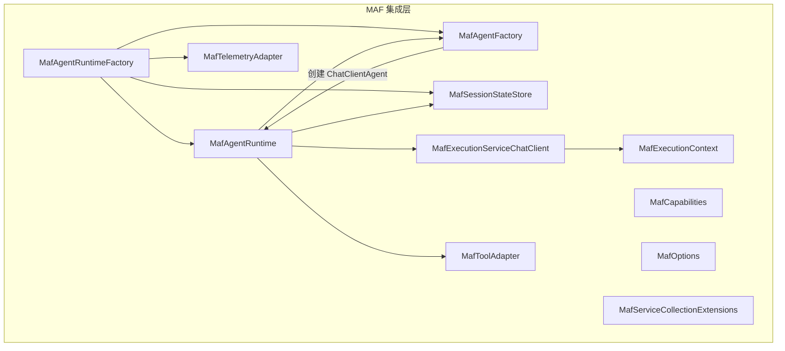
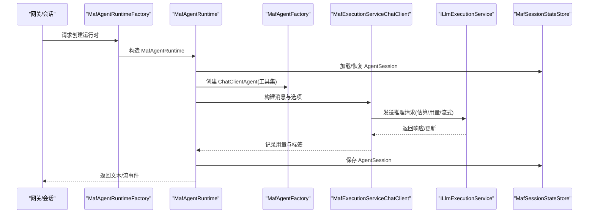
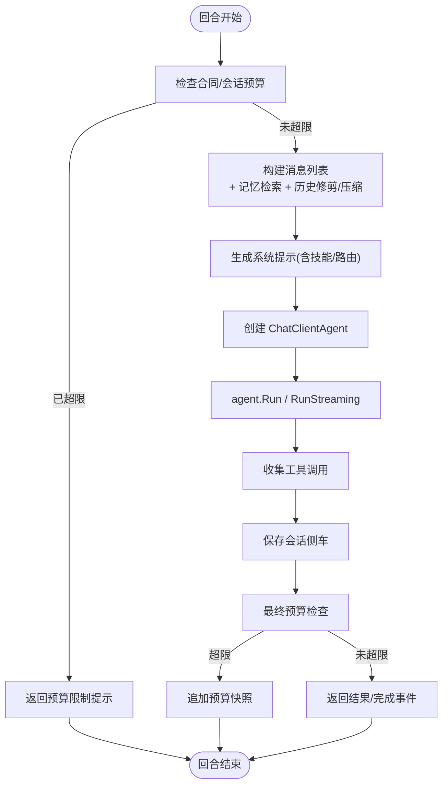
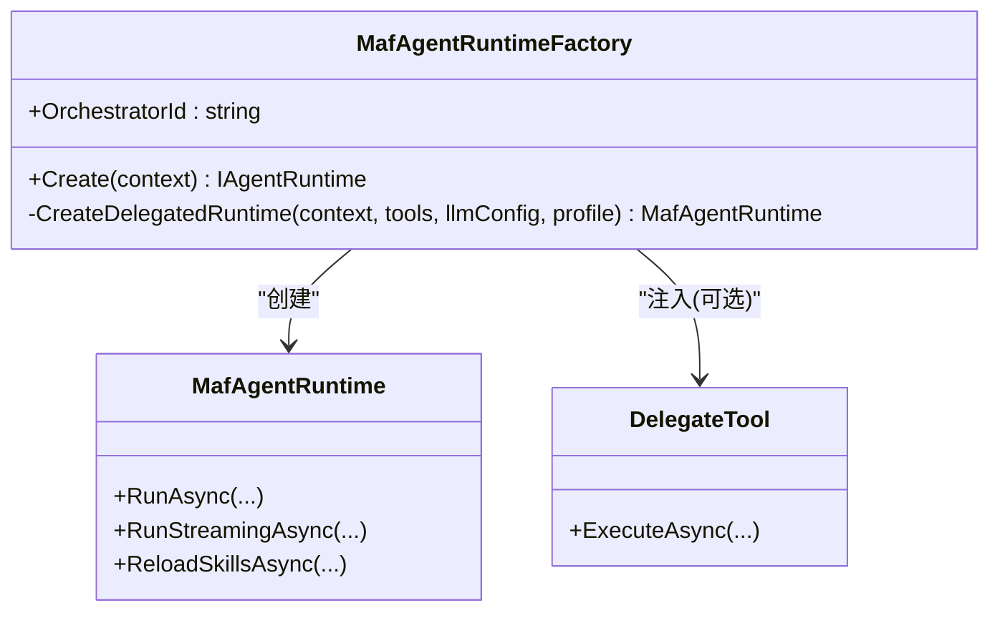
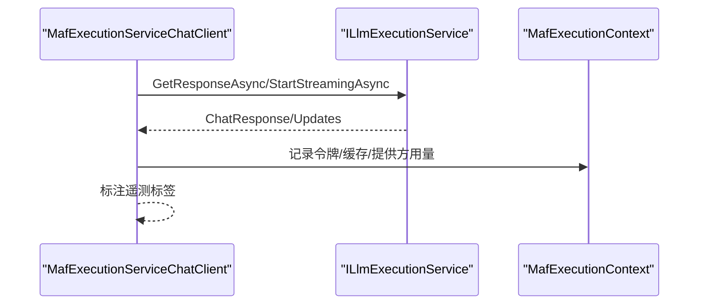
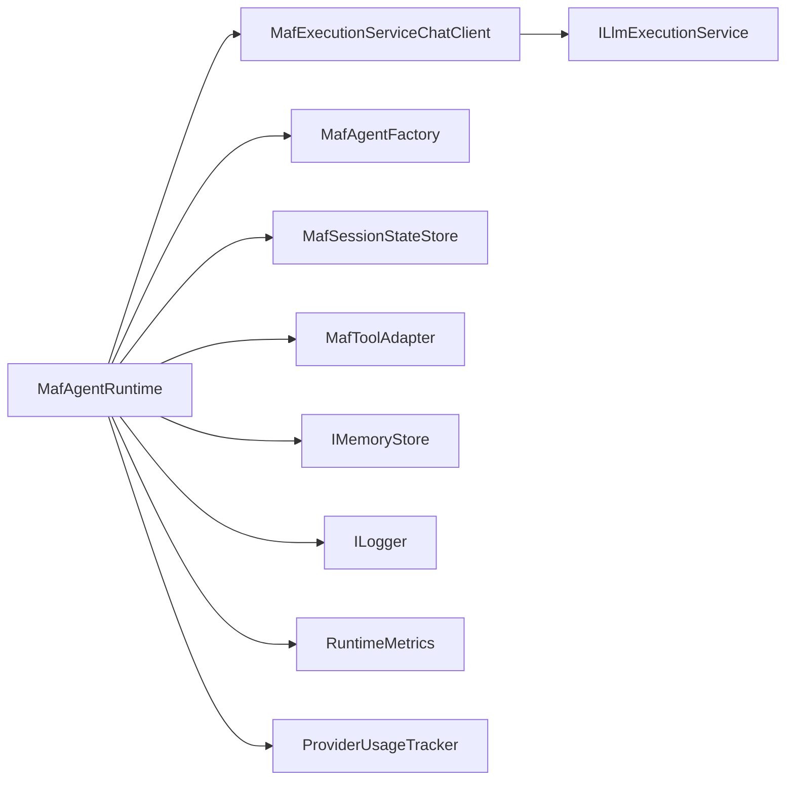

# MAF 集成

<cite>
**本文引用的文件**
- [MafAgentRuntime.cs](file://src/OpenClaw.Agent/MafAgentRuntime.cs)
- [MafAgentRuntimeFactory.cs](file://src/OpenClaw.Agent/MafAgentRuntimeFactory.cs)
- [MafAgentFactory.cs](file://src/OpenClaw.Agent/MafAgentFactory.cs)
- [MafExecutionServiceChatClient.cs](file://src/OpenClaw.Agent/MafExecutionServiceChatClient.cs)
- [MafToolAdapter.cs](file://src/OpenClaw.Agent/MafToolAdapter.cs)
- [MafSessionStateStore.cs](file://src/OpenClaw.Agent/MafSessionStateStore.cs)
- [MafTelemetryAdapter.cs](file://src/OpenClaw.Agent/MafTelemetryAdapter.cs)
- [MafExecutionContext.cs](file://src/OpenClaw.Agent/MafExecutionContext.cs)
- [MafCapabilities.cs](file://src/OpenClaw.Agent/MafCapabilities.cs)
- [MafOptions.cs](file://src/OpenClaw.Agent/MafOptions.cs)
- [MafServiceCollectionExtensions.cs](file://src/OpenClaw.Agent/MafServiceCollectionExtensions.cs)
- [MafAgentRuntimeTests.cs](file://src/OpenClaw.Tests/MafAgentRuntimeTests.cs)
- [MafGatewayIntegrationTests.cs](file://src/OpenClaw.Tests/MafGatewayIntegrationTests.cs)
- [MafAdapterTests.cs](file://src/OpenClaw.Tests/MafAdapterTests.cs)
- [maf-aot-jit-plan.md](file://docs/maf-aot-jit/maf-aot-jit-plan.md)
- [maf-aot-jit-findings.md](file://docs/maf-aot-jit/maf-aot-jit-findings.md)
- [maf-aot-jit-readiness.md](file://docs/maf-aot-jit/maf-aot-jit-readiness.md)
</cite>

## 目录
1. [简介](#简介)
2. [项目结构](#项目结构)
3. [核心组件](#核心组件)
4. [架构总览](#架构总览)
5. [详细组件分析](#详细组件分析)
6. [依赖关系分析](#依赖关系分析)
7. [性能与运行时模式](#性能与运行时模式)
8. [配置参数与模型选择](#配置参数与模型选择)
9. [错误处理与调试](#错误处理与调试)
10. [最佳实践与故障排除](#最佳实践与故障排除)
11. [结论](#结论)

## 简介
本文件面向在 OpenClaw 中集成 Microsoft Agent Framework（MAF）的工程团队，系统性阐述 MAF 运行时的集成架构、ChatClientAgent 的使用与配置、工具适配器、执行服务聊天客户端、会话状态存储、运行时选项与能力检测等核心模块，并结合 AOT/JIT 运行时模式、性能优化策略、内存管理机制、配置参数、模型选择逻辑、错误处理与调试方法，提供可操作的最佳实践与故障排除指南。

## 项目结构
MAF 集成位于 OpenClaw.Agent 命名空间下，围绕 IAgentRuntimeFactory 抽象构建，通过工厂注入与服务注册完成对 ChatClientAgent 的封装与运行时编排。关键文件包括：
- 运行时与工厂：MafAgentRuntime、MafAgentRuntimeFactory、MafAgentFactory
- 执行桥接：MafExecutionServiceChatClient
- 工具适配：MafToolAdapter
- 会话状态：MafSessionStateStore
- 能力与选项：MafCapabilities、MafOptions、MafServiceCollectionExtensions
- 执行上下文：MafExecutionContext
- 观测与遥测：MafTelemetryAdapter
- 测试与文档：单元测试与 AOT/JIT 实验文档

**图表来源**
- [MafAgentRuntimeFactory.cs:1-166](file://src/OpenClaw.Agent/MafAgentRuntimeFactory.cs#L1-166)
- [MafAgentRuntime.cs:1-1184](file://src/OpenClaw.Agent/MafAgentRuntime.cs#L1-1184)
- [MafAgentFactory.cs:1-37](file://src/OpenClaw.Agent/MafAgentFactory.cs#L1-37)
- [MafExecutionServiceChatClient.cs:1-188](file://src/OpenClaw.Agent/MafExecutionServiceChatClient.cs#L1-188)
- [MafToolAdapter.cs:1-63](file://src/OpenClaw.Agent/MafToolAdapter.cs#L1-63)
- [MafSessionStateStore.cs:1-197](file://src/OpenClaw.Agent/MafSessionStateStore.cs#L1-197)
- [MafExecutionContext.cs:1-46](file://src/OpenClaw.Agent/MafExecutionContext.cs#L1-46)
- [MafCapabilities.cs:1-17](file://src/OpenClaw.Agent/MafCapabilities.cs#L1-17)
- [MafOptions.cs:1-44](file://src/OpenClaw.Agent/MafOptions.cs#L1-44)
- [MafServiceCollectionExtensions.cs:1-107](file://src/OpenClaw.Agent/MafServiceCollectionExtensions.cs#L1-107)
- [MafTelemetryAdapter.cs:1-25](file://src/OpenClaw.Agent/MafTelemetryAdapter.cs#L1-25)

**章节来源**
- [MafAgentRuntimeFactory.cs:1-166](file://src/OpenClaw.Agent/MafAgentRuntimeFactory.cs#L1-166)
- [MafAgentRuntime.cs:1-1184](file://src/OpenClaw.Agent/MafAgentRuntime.cs#L1-1184)
- [MafAgentFactory.cs:1-37](file://src/OpenClaw.Agent/MafAgentFactory.cs#L1-37)
- [MafExecutionServiceChatClient.cs:1-188](file://src/OpenClaw.Agent/MafExecutionServiceChatClient.cs#L1-188)
- [MafToolAdapter.cs:1-63](file://src/OpenClaw.Agent/MafToolAdapter.cs#L1-63)
- [MafSessionStateStore.cs:1-197](file://src/OpenClaw.Agent/MafSessionStateStore.cs#L1-197)
- [MafExecutionContext.cs:1-46](file://src/OpenClaw.Agent/MafExecutionContext.cs#L1-46)
- [MafCapabilities.cs:1-17](file://src/OpenClaw.Agent/MafCapabilities.cs#L1-17)
- [MafOptions.cs:1-44](file://src/OpenClaw.Agent/MafOptions.cs#L1-44)
- [MafServiceCollectionExtensions.cs:1-107](file://src/OpenClaw.Agent/MafServiceCollectionExtensions.cs#L1-107)
- [MafTelemetryAdapter.cs:1-25](file://src/OpenClaw.Agent/MafTelemetryAdapter.cs#L1-25)

## 核心组件
- MafAgentRuntime：MAF 运行时主控制器，负责回合编排、消息构建、记忆检索、历史压缩、工具调用与会话状态持久化，以及流式与非流式响应生成。
- MafAgentRuntimeFactory：IAgentRuntimeFactory 实现，负责根据运行时状态与配置创建 MafAgentRuntime，并支持代理委托工具以实现跨配置的运行时切换。
- MafAgentFactory：封装 ChatClientAgent 创建过程，统一注入名称、描述、工具集与服务提供者。
- MafExecutionServiceChatClient：IChatClient 实现，将 MAF 的推理请求转发至 ILlmExecutionService，记录用量与遥测，并支持流式与非流式响应。
- MafToolAdapter：将 ITool 包装为 AIFunction，桥接工具参数、执行与流事件写入。
- MafSessionStateStore：会话侧车存储，基于历史哈希与版本校验恢复/保存 MAF AgentSession，确保跨重启的一致性。
- MafExecutionContext / MafExecutionContextScope：线程本地执行上下文，贯穿回合生命周期，承载会话、令牌预算、工具调用记录与流事件写入回调。
- MafCapabilities：能力检测与运行时模式支持声明（JIT/AOT）。
- MafOptions / MafServiceCollectionExtensions：运行时选项与服务注册入口，支持从配置加载并注入到运行时。
- MafTelemetryAdapter：启动运行活动并标注运行模式、提供方与模型等标签。

**章节来源**
- [MafAgentRuntime.cs:17-118](file://src/OpenClaw.Agent/MafAgentRuntime.cs#L17-L118)
- [MafAgentRuntimeFactory.cs:9-166](file://src/OpenClaw.Agent/MafAgentRuntimeFactory.cs#L9-L166)
- [MafAgentFactory.cs:8-37](file://src/OpenClaw.Agent/MafAgentFactory.cs#L8-L37)
- [MafExecutionServiceChatClient.cs:10-188](file://src/OpenClaw.Agent/MafExecutionServiceChatClient.cs#L10-L188)
- [MafToolAdapter.cs:9-63](file://src/OpenClaw.Agent/MafToolAdapter.cs#L9-L63)
- [MafSessionStateStore.cs:12-197](file://src/OpenClaw.Agent/MafSessionStateStore.cs#L12-L197)
- [MafExecutionContext.cs:6-46](file://src/OpenClaw.Agent/MafExecutionContext.cs#L6-L46)
- [MafCapabilities.cs:5-17](file://src/OpenClaw.Agent/MafCapabilities.cs#L5-L17)
- [MafOptions.cs:3-44](file://src/OpenClaw.Agent/MafOptions.cs#L3-L44)
- [MafServiceCollectionExtensions.cs:7-107](file://src/OpenClaw.Agent/MafServiceCollectionExtensions.cs#L7-L107)
- [MafTelemetryAdapter.cs:7-25](file://src/OpenClaw.Agent/MafTelemetryAdapter.cs#L7-L25)

## 架构总览
MAF 集成采用“网关表面不变、运行时可插拔”的设计：OpenClaw 保留网关、会话、策略、安全与可观测性；MAF 仅作为可选的“推理与编排后端”。运行时通过工厂选择，工具通过适配器桥接，执行通过执行服务统一计费与用量统计。

**图表来源**
- [MafAgentRuntimeFactory.cs:119-166](file://src/OpenClaw.Agent/MafAgentRuntimeFactory.cs#L119-L166)
- [MafAgentRuntime.cs:203-337](file://src/OpenClaw.Agent/MafAgentRuntime.cs#L203-L337)
- [MafAgentFactory.cs:24-36](file://src/OpenClaw.Agent/MafAgentFactory.cs#L24-L36)
- [MafExecutionServiceChatClient.cs:32-125](file://src/OpenClaw.Agent/MafExecutionServiceChatClient.cs#L32-L125)
- [MafSessionStateStore.cs:36-144](file://src/OpenClaw.Agent/MafSessionStateStore.cs#L36-L144)

## 详细组件分析

### MafAgentRuntime：回合编排与消息管线
- 任务入口：RunAsync/RunStreamingAsync，分别处理非流式与流式回合。
- 历史管理：支持按阈值压缩与简单修剪，或基于摘要的压缩以降低上下文长度。
- 记忆检索：在用户消息非空且启用时，按前缀与上限检索相关记忆条目并插入到消息列表中。
- 系统提示：动态拼接技能段落与路由指令，支持投影约束与阻断路由提示。
- 工具调用：收集工具调用并在回合结束后写入历史；流式模式下通过通道推送增量事件。
- 合同与配额：回合前后检查合同预算与会话令牌预算，必要时提前终止并记录快照。
- 错误处理：捕获模型选择异常与通用异常，返回友好提示并记录指标。

**图表来源**
- [MafAgentRuntime.cs:203-337](file://src/OpenClaw.Agent/MafAgentRuntime.cs#L203-L337)
- [MafAgentRuntime.cs:339-423](file://src/OpenClaw.Agent/MafAgentRuntime.cs#L339-L423)
- [MafAgentRuntime.cs:684-764](file://src/OpenClaw.Agent/MafAgentRuntime.cs#L684-L764)
- [MafAgentRuntime.cs:625-682](file://src/OpenClaw.Agent/MafAgentRuntime.cs#L625-L682)

**章节来源**
- [MafAgentRuntime.cs:203-337](file://src/OpenClaw.Agent/MafAgentRuntime.cs#L203-L337)
- [MafAgentRuntime.cs:339-423](file://src/OpenClaw.Agent/MafAgentRuntime.cs#L339-L423)
- [MafAgentRuntime.cs:625-682](file://src/OpenClaw.Agent/MafAgentRuntime.cs#L625-L682)
- [MafAgentRuntime.cs:684-764](file://src/OpenClaw.Agent/MafAgentRuntime.cs#L684-L764)

### MafAgentRuntimeFactory：运行时工厂与代理委托
- 能力校验：EnsureSupported 确保运行时模式为 JIT/AOT。
- 代理委托：当启用委托时，注入 DelegateTool，允许在回合中动态切换工具集与 LLM 配置，同时复用共享工具执行器。

**图表来源**
- [MafAgentRuntimeFactory.cs:9-166](file://src/OpenClaw.Agent/MafAgentRuntimeFactory.cs#L9-L166)
- [MafAgentRuntime.cs:181-201](file://src/OpenClaw.Agent/MafAgentRuntime.cs#L181-L201)

**章节来源**
- [MafAgentRuntimeFactory.cs:9-166](file://src/OpenClaw.Agent/MafAgentRuntimeFactory.cs#L9-L166)

### MafAgentFactory：ChatClientAgent 创建
- 统一注入 Agent 名称、描述、工具集与服务提供者，屏蔽底层框架差异。

**章节来源**
- [MafAgentFactory.cs:8-37](file://src/OpenClaw.Agent/MafAgentFactory.cs#L8-L37)

### MafExecutionServiceChatClient：执行桥接与用量记录
- 将 ChatClientAgent 的请求转交 ILlmExecutionService，计算估算、记录输入/输出令牌、缓存命中与提供方用量，并在流式场景聚合 UsageContent 更新。

**图表来源**
- [MafExecutionServiceChatClient.cs:32-125](file://src/OpenClaw.Agent/MafExecutionServiceChatClient.cs#L32-L125)
- [MafExecutionContext.cs:6-17](file://src/OpenClaw.Agent/MafExecutionContext.cs#L6-L17)

**章节来源**
- [MafExecutionServiceChatClient.cs:10-188](file://src/OpenClaw.Agent/MafExecutionServiceChatClient.cs#L10-L188)
- [MafExecutionContext.cs:6-46](file://src/OpenClaw.Agent/MafExecutionContext.cs#L6-L46)

### MafToolAdapter：工具适配与流事件
- 将 ITool 参数序列化为 JSON，调用共享 OpenClawToolExecutor 执行，支持流式增量事件推送与工具调用记录。

**章节来源**
- [MafToolAdapter.cs:9-63](file://src/OpenClaw.Agent/MafToolAdapter.cs#L9-L63)

### MafSessionStateStore：会话侧车与一致性
- 基于历史哈希、会话 ID、包版本与模式版本进行一致性校验，失败则回退新建会话。
- 使用临时文件写入与原子移动避免损坏。

**章节来源**
- [MafSessionStateStore.cs:12-197](file://src/OpenClaw.Agent/MafSessionStateStore.cs#L12-L197)

### MafExecutionContext：线程本地上下文
- 暴露会话、回合上下文、系统/技能提示长度、会话令牌预算、工具调用列表、合约用量回调、审批回调与流事件写入器。

**章节来源**
- [MafExecutionContext.cs:6-46](file://src/OpenClaw.Agent/MafExecutionContext.cs#L6-L46)

### MafCapabilities 与 MafOptions：能力与配置
- 能力：声明支持 JIT/AOT 模式。
- 选项：Agent 名称/描述、会话侧车路径、是否启用流式、A2A 支持与路径前缀、版本、公共基础 URL、A2A 技能清单等。

**章节来源**
- [MafCapabilities.cs:5-17](file://src/OpenClaw.Agent/MafCapabilities.cs#L5-L17)
- [MafOptions.cs:3-44](file://src/OpenClaw.Agent/MafOptions.cs#L3-L44)

### MafServiceCollectionExtensions：服务注册
- 从配置节加载 MafOptions 并注册到容器，兼容新旧配置节名。

**章节来源**
- [MafServiceCollectionExtensions.cs:7-107](file://src/OpenClaw.Agent/MafServiceCollectionExtensions.cs#L7-L107)

### MafTelemetryAdapter：遥测标签
- 启动活动并设置运行器 ID、运行模式、会话/渠道 ID，以及提供方与模型标签。

**章节来源**
- [MafTelemetryAdapter.cs:7-25](file://src/OpenClaw.Agent/MafTelemetryAdapter.cs#L7-L25)

## 依赖关系分析
- 解耦与内聚：运行时与工厂、工具适配器、执行桥接、会话存储之间通过接口与共享执行器保持低耦合高内聚。
- 外部依赖：Microsoft.Agents.AI、Microsoft.Extensions.AI、ILlmExecutionService、IMemoryStore、ILogger 等。
- 循环依赖：未见直接循环；执行上下文通过 AsyncLocal 传递，避免显式循环。

**图表来源**
- [MafAgentRuntime.cs:17-118](file://src/OpenClaw.Agent/MafAgentRuntime.cs#L17-L118)
- [MafExecutionServiceChatClient.cs:10-30](file://src/OpenClaw.Agent/MafExecutionServiceChatClient.cs#L10-L30)
- [MafToolAdapter.cs:9-21](file://src/OpenClaw.Agent/MafToolAdapter.cs#L9-L21)

**章节来源**
- [MafAgentRuntime.cs:17-118](file://src/OpenClaw.Agent/MafAgentRuntime.cs#L17-L118)
- [MafExecutionServiceChatClient.cs:10-30](file://src/OpenClaw.Agent/MafExecutionServiceChatClient.cs#L10-L30)
- [MafToolAdapter.cs:9-21](file://src/OpenClaw.Agent/MafToolAdapter.cs#L9-L21)

## 性能与运行时模式
- AOT/JIT 实验矩阵显示：在相同工具链与提供方请求次数下，MAF 在 JIT 与 AOT 下均能与原生路径保持一致的事件形态与令牌统计；AOT 下启动时间略优，HTTP 回合时间在某些场景下略有波动。
- 建议：
  - 在 JIT 下优先验证工具链与会话连续性；在 AOT 下关注发布与运行时反射/裁剪影响。
  - 使用会话侧车与历史压缩减少上下文开销。
  - 启用流式以改善端到端延迟，但需注意下游提供方对流式的支持与稳定性。

**章节来源**
- [maf-aot-jit-findings.md:1-24](file://docs/maf-aot-jit/maf-aot-jit-findings.md#L1-L24)
- [maf-aot-jit-readiness.md:31-46](file://docs/maf-aot-jit/maf-aot-jit-readiness.md#L31-L46)

## 配置参数与模型选择
- 运行时选择：通过配置 OpenClaw:Runtime:Mode 与 Orchestrator 控制 JIT/AOT 与 native/maf。
- MAF 选项：AgentName、AgentDescription、SessionSidecarPath、EnableStreaming、EnableA2A、A2A 路径前缀/版本/公共基础 URL、A2ASkills 列表。
- 模型选择：RunAsync/RunStreamingAsync 中根据会话覆盖或全局配置构造 ChatOptions，支持温度、最大输出令牌与 JSON Schema 响应格式。
- 记忆检索：Recall 开关、最大条数与字符上限、前缀过滤。
- 历史压缩：阈值、保留最近轮次、摘要生成与替换。

**章节来源**
- [MafOptions.cs:3-44](file://src/OpenClaw.Agent/MafOptions.cs#L3-L44)
- [MafAgentRuntime.cs:568-587](file://src/OpenClaw.Agent/MafAgentRuntime.cs#L568-L587)
- [MafAgentRuntime.cs:625-682](file://src/OpenClaw.Agent/MafAgentRuntime.cs#L625-L682)
- [MafAgentRuntime.cs:684-764](file://src/OpenClaw.Agent/MafAgentRuntime.cs#L684-L764)
- [MafServiceCollectionExtensions.cs:22-105](file://src/OpenClaw.Agent/MafServiceCollectionExtensions.cs#L22-L105)

## 错误处理与调试
- 模型选择异常：捕获 ModelSelectionException 并返回用户可理解的提示。
- 提供方失败：记录错误并返回兜底提示；流式场景在通道中发出错误事件后完成。
- 预算与配额：合同预算与会话令牌预算检查前置，超限时尽早返回。
- 调试建议：
  - 启用详细日志与遥测标签，定位提供方与模型。
  - 使用单元测试与集成测试覆盖回合、工具、流式与会话恢复路径。
  - 关注会话侧车哈希一致性与版本兼容性。

**章节来源**
- [MafAgentRuntime.cs:324-336](file://src/OpenClaw.Agent/MafAgentRuntime.cs#L324-L336)
- [MafAgentRuntime.cs:529-561](file://src/OpenClaw.Agent/MafAgentRuntime.cs#L529-L561)
- [MafAgentRuntimeTests.cs:1-396](file://src/OpenClaw.Tests/MafAgentRuntimeTests.cs#L1-L396)
- [MafGatewayIntegrationTests.cs:420-549](file://src/OpenClaw.Tests/MafGatewayIntegrationTests.cs#L420-L549)
- [MafAdapterTests.cs:433-470](file://src/OpenClaw.Tests/MafAdapterTests.cs#L433-L470)

## 最佳实践与故障排除
- 最佳实践
  - 在 JIT 下先验证工具链与会话连续性，再尝试 AOT。
  - 使用会话侧车路径隔离 MAF 存储，避免与其它实验冲突。
  - 合理设置历史轮次与压缩阈值，平衡上下文长度与记忆检索成本。
  - 对关键工具启用审批与审计日志，确保合规与可追溯。
- 故障排除
  - 启动失败：确认 Runtime.Orchestrator=maf 仅在 MAF-enabled 构件中启用。
  - 会话不连续：检查历史哈希与包版本一致性，清理损坏侧车。
  - 流式异常：确认提供方支持流式并检查通道写入取消。
  - 预算超限：调整合同与会话令牌预算，或优化系统提示长度。

**章节来源**
- [MafServiceCollectionExtensions.cs:22-105](file://src/OpenClaw.Agent/MafServiceCollectionExtensions.cs#L22-L105)
- [MafSessionStateStore.cs:36-144](file://src/OpenClaw.Agent/MafSessionStateStore.cs#L36-L144)
- [MafAgentRuntime.cs:226-237](file://src/OpenClaw.Agent/MafAgentRuntime.cs#L226-L237)
- [maf-aot-jit-plan.md:150-172](file://docs/maf-aot-jit/maf-aot-jit-plan.md#L150-L172)

## 结论
MAF 作为可选的推理与编排后端，在 OpenClaw 中通过工厂与适配器实现低侵入集成。其在 JIT 与 AOT 下均具备可行性，配合会话侧车、历史压缩与用量追踪，可在保证可观测性与合规性的前提下提升端到端体验。建议在生产环境中优先在 JIT 下验证完整链路，再视需求引入 AOT，并持续关注性能与发布约束。