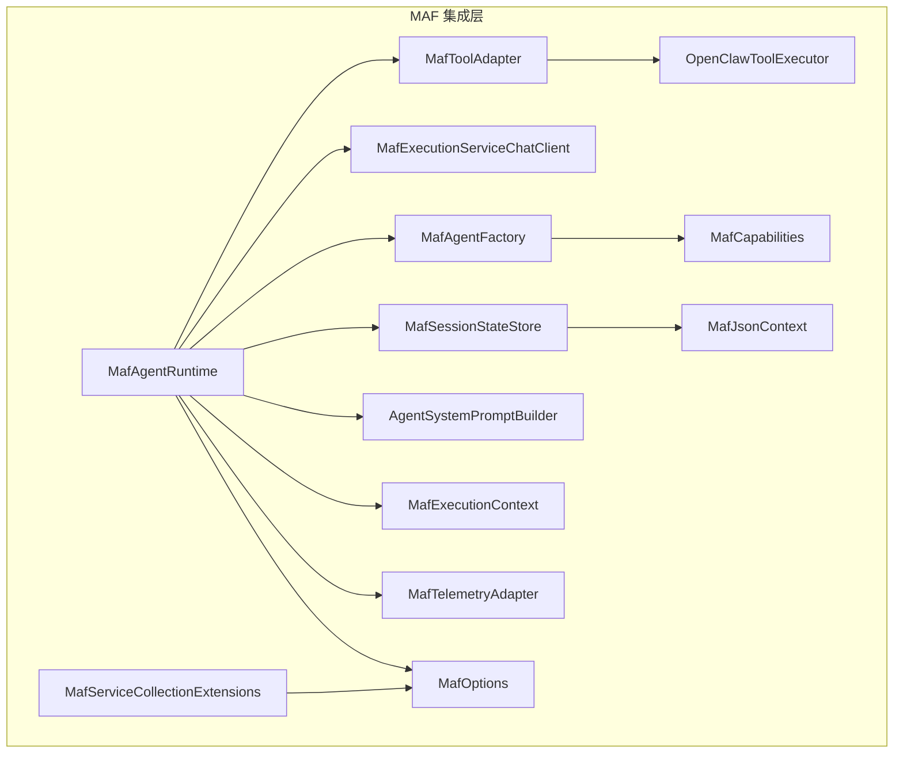
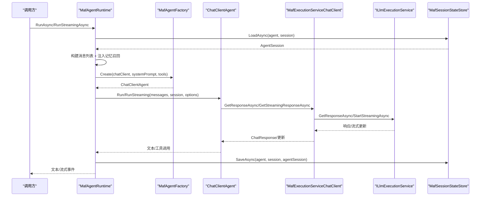
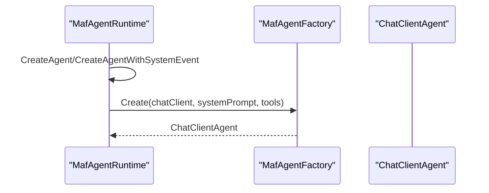
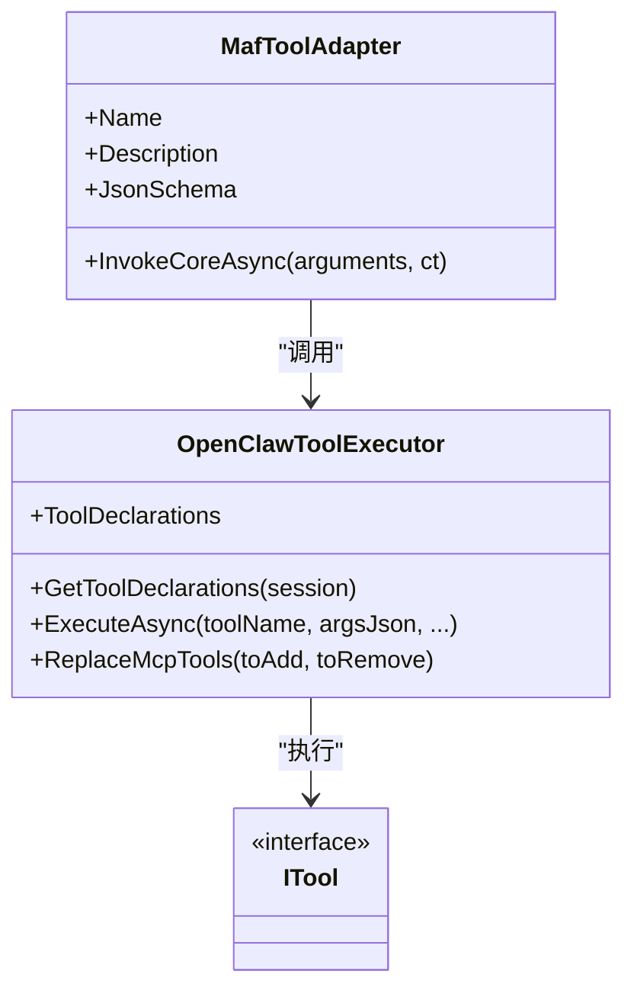
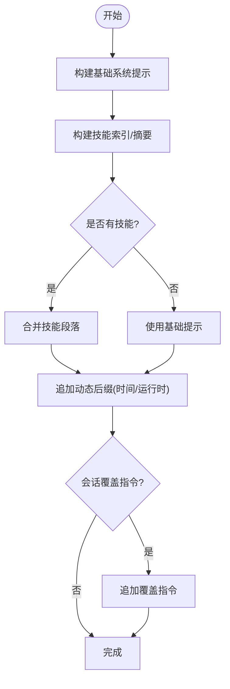
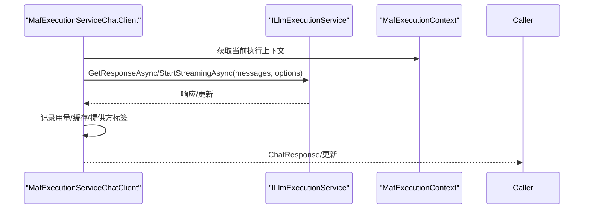
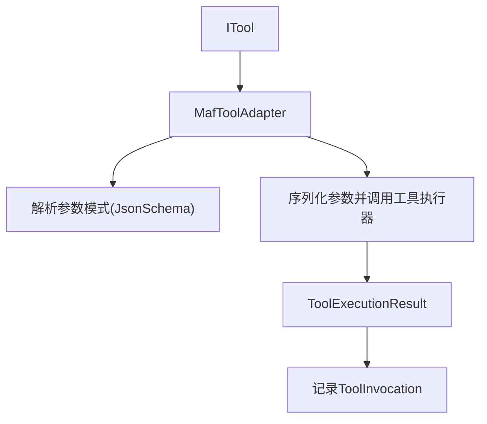
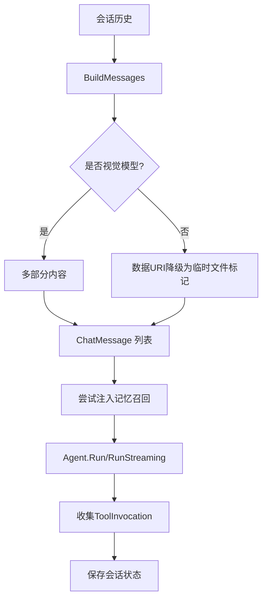
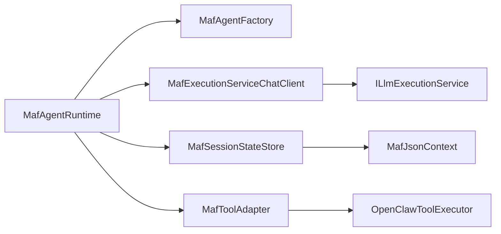

# MAF 集成架构

<cite>
**本文档引用的文件**
- [MafAgentRuntime.cs](file://src/OpenClaw.Agent/MafAgentRuntime.cs)
- [MafAgentRuntimeFactory.cs](file://src/OpenClaw.Agent/MafAgentRuntimeFactory.cs)
- [MafAgentFactory.cs](file://src/OpenClaw.Agent/MafAgentFactory.cs)
- [MafExecutionServiceChatClient.cs](file://src/OpenClaw.Agent/MafExecutionServiceChatClient.cs)
- [MafToolAdapter.cs](file://src/OpenClaw.Agent/MafToolAdapter.cs)
- [MafSessionStateStore.cs](file://src/OpenClaw.Agent/MafSessionStateStore.cs)
- [MafTelemetryAdapter.cs](file://src/OpenClaw.Agent/MafTelemetryAdapter.cs)
- [MafOptions.cs](file://src/OpenClaw.Agent/MafOptions.cs)
- [MafCapabilities.cs](file://src/OpenClaw.Agent/MafCapabilities.cs)
- [MafExecutionContext.cs](file://src/OpenClaw.Agent/MafExecutionContext.cs)
- [MafServiceCollectionExtensions.cs](file://src/OpenClaw.Agent/MafServiceCollectionExtensions.cs)
- [MafJsonContext.cs](file://src/OpenClaw.Agent/MafJsonContext.cs)
- [OpenClawToolExecutor.cs](file://src/OpenClaw.Agent/OpenClawToolExecutor.cs)
- [AgentSystemPromptBuilder.cs](file://src/OpenClaw.Agent/AgentSystemPromptBuilder.cs)
</cite>

## 目录
1. [简介](#简介)
2. [项目结构](#项目结构)
3. [核心组件](#核心组件)
4. [架构总览](#架构总览)
5. [详细组件分析](#详细组件分析)
6. [依赖关系分析](#依赖关系分析)
7. [性能考虑](#性能考虑)
8. [故障排查指南](#故障排查指南)
9. [结论](#结论)
10. [附录](#附录)

## 简介
本文件面向 MAF（Microsoft Agent Framework）在 OpenClaw 中的集成架构，系统性阐述 MAF 代理运行时如何与 Microsoft Agent Framework 集成，包括 ChatClientAgent 的创建过程、AI 工具适配器的实现、系统提示的构建机制、执行服务聊天客户端的工作原理、外部工具到 MAF 工具格式的转换、推理过程中的消息构建、工具调用协调与会话状态管理，并提供最佳实践、性能优化建议与常见问题解决方案。

## 项目结构
MAF 集成位于 OpenClaw.Agent 命名空间下，围绕以下关键类展开：
- 运行时与工厂：MafAgentRuntime、MafAgentRuntimeFactory、MafAgentFactory
- 执行桥接：MafExecutionServiceChatClient
- 工具适配：MafToolAdapter、OpenClawToolExecutor
- 会话状态：MafSessionStateStore
- 配置与能力：MafOptions、MafCapabilities、MafExecutionContext、MafServiceCollectionExtensions、MafJsonContext
- 系统提示：AgentSystemPromptBuilder

**图表来源**
- [MafAgentRuntime.cs:17-118](file://src/OpenClaw.Agent/MafAgentRuntime.cs#L17-L118)
- [MafAgentFactory.cs:8-36](file://src/OpenClaw.Agent/MafAgentFactory.cs#L8-L36)
- [MafExecutionServiceChatClient.cs:10-30](file://src/OpenClaw.Agent/MafExecutionServiceChatClient.cs#L10-L30)
- [MafSessionStateStore.cs:12-34](file://src/OpenClaw.Agent/MafSessionStateStore.cs#L12-L34)
- [MafToolAdapter.cs:9-21](file://src/OpenClaw.Agent/MafToolAdapter.cs#L9-L21)
- [OpenClawToolExecutor.cs:30-100](file://src/OpenClaw.Agent/OpenClawToolExecutor.cs#L30-L100)
- [MafOptions.cs:3-35](file://src/OpenClaw.Agent/MafOptions.cs#L3-L35)
- [MafCapabilities.cs:5-16](file://src/OpenClaw.Agent/MafCapabilities.cs#L5-L16)
- [MafExecutionContext.cs:6-17](file://src/OpenClaw.Agent/MafExecutionContext.cs#L6-L17)
- [MafTelemetryAdapter.cs:7-24](file://src/OpenClaw.Agent/MafTelemetryAdapter.cs#L7-L24)
- [MafJsonContext.cs:7-21](file://src/OpenClaw.Agent/MafJsonContext.cs#L7-L21)
- [MafServiceCollectionExtensions.cs:7-20](file://src/OpenClaw.Agent/MafServiceCollectionExtensions.cs#L7-L20)
- [AgentSystemPromptBuilder.cs:7-27](file://src/OpenClaw.Agent/AgentSystemPromptBuilder.cs#L7-L27)

**章节来源**
- [MafAgentRuntime.cs:17-118](file://src/OpenClaw.Agent/MafAgentRuntime.cs#L17-L118)
- [MafServiceCollectionExtensions.cs:9-20](file://src/OpenClaw.Agent/MafServiceCollectionExtensions.cs#L9-L20)

## 核心组件
- MafAgentRuntime：MAF 运行时核心，负责回合编排、消息构建、工具声明与调用、会话状态加载/保存、历史压缩/修剪、内存召回注入、预算控制与合同状态管理。
- MafAgentRuntimeFactory：运行时工厂，支持委托配置与代理工具注入，确保 MAF 能力约束与配置隔离。
- MafAgentFactory：ChatClientAgent 创建器，封装 MAF Agent 构造参数（名称、描述、工具列表）。
- MafExecutionServiceChatClient：IChatClient 实现，桥接 ILlmExecutionService，记录用量与遥测，支持同步与流式响应。
- MafToolAdapter：ITool 到 AIFunction 的适配器，负责参数模式、调用参数序列化、工具执行结果回传与流事件写入。
- OpenClawToolExecutor：统一工具执行器，负责治理授权、钩子链路、沙箱路由、超时与错误处理、审计与度量。
- MafSessionStateStore：会话侧车存储，基于 JSON 序列化与历史哈希校验，支持版本迁移与容错。
- MafOptions：MAF 运行时配置项，如 Agent 名称、会话侧车路径、流式开关、A2A 集成等。
- MafCapabilities：能力标识与模式支持检查。
- MafExecutionContext：线程本地执行上下文，贯穿一次推理的会话、令牌预算、工具调用集合、审批回调与流事件写入器。
- MafTelemetryAdapter：活动标签与提供方标记。
- MafJsonContext：会话侧车序列化上下文。
- AgentSystemPromptBuilder：系统提示构建器，含基础提示、可选工作区提示文件注入、动态时间戳与运行时信息。

**章节来源**
- [MafAgentRuntime.cs:17-118](file://src/OpenClaw.Agent/MafAgentRuntime.cs#L17-L118)
- [MafAgentRuntimeFactory.cs:9-40](file://src/OpenClaw.Agent/MafAgentRuntimeFactory.cs#L9-L40)
- [MafAgentFactory.cs:8-36](file://src/OpenClaw.Agent/MafAgentFactory.cs#L8-L36)
- [MafExecutionServiceChatClient.cs:10-30](file://src/OpenClaw.Agent/MafExecutionServiceChatClient.cs#L10-L30)
- [MafToolAdapter.cs:9-21](file://src/OpenClaw.Agent/MafToolAdapter.cs#L9-L21)
- [OpenClawToolExecutor.cs:30-100](file://src/OpenClaw.Agent/OpenClawToolExecutor.cs#L30-L100)
- [MafSessionStateStore.cs:12-34](file://src/OpenClaw.Agent/MafSessionStateStore.cs#L12-L34)
- [MafOptions.cs:3-35](file://src/OpenClaw.Agent/MafOptions.cs#L3-L35)
- [MafCapabilities.cs:5-16](file://src/OpenClaw.Agent/MafCapabilities.cs#L5-L16)
- [MafExecutionContext.cs:6-17](file://src/OpenClaw.Agent/MafExecutionContext.cs#L6-L17)
- [MafTelemetryAdapter.cs:7-24](file://src/OpenClaw.Agent/MafTelemetryAdapter.cs#L7-L24)
- [MafJsonContext.cs:7-21](file://src/OpenClaw.Agent/MafJsonContext.cs#L7-L21)
- [AgentSystemPromptBuilder.cs:7-27](file://src/OpenClaw.Agent/AgentSystemPromptBuilder.cs#L7-L27)

## 架构总览
MAF 集成采用“运行时-工厂-适配器-执行器-会话存储”的分层设计，通过 MafExecutionContext 在一次推理中贯穿上下文，确保工具调用、流式事件、用量统计与会话状态的一致性。

**图表来源**
- [MafAgentRuntime.cs:203-337](file://src/OpenClaw.Agent/MafAgentRuntime.cs#L203-L337)
- [MafAgentRuntime.cs:339-423](file://src/OpenClaw.Agent/MafAgentRuntime.cs#L339-L423)
- [MafAgentFactory.cs:24-35](file://src/OpenClaw.Agent/MafAgentFactory.cs#L24-L35)
- [MafExecutionServiceChatClient.cs:32-65](file://src/OpenClaw.Agent/MafExecutionServiceChatClient.cs#L32-L65)
- [MafExecutionServiceChatClient.cs:67-125](file://src/OpenClaw.Agent/MafExecutionServiceChatClient.cs#L67-L125)
- [MafSessionStateStore.cs:36-105](file://src/OpenClaw.Agent/MafSessionStateStore.cs#L36-L105)

**章节来源**
- [MafAgentRuntime.cs:203-337](file://src/OpenClaw.Agent/MafAgentRuntime.cs#L203-L337)
- [MafAgentRuntime.cs:339-423](file://src/OpenClaw.Agent/MafAgentRuntime.cs#L339-L423)
- [MafAgentFactory.cs:24-35](file://src/OpenClaw.Agent/MafAgentFactory.cs#L24-L35)
- [MafExecutionServiceChatClient.cs:32-65](file://src/OpenClaw.Agent/MafExecutionServiceChatClient.cs#L32-L65)
- [MafExecutionServiceChatClient.cs:67-125](file://src/OpenClaw.Agent/MafExecutionServiceChatClient.cs#L67-L125)
- [MafSessionStateStore.cs:36-105](file://src/OpenClaw.Agent/MafSessionStateStore.cs#L36-L105)

## 详细组件分析

### ChatClientAgent 创建流程
- MafAgentRuntime 在每次推理前根据会话与用户消息决定是否注入系统级事件提示，随后调用 MafAgentFactory.Create 构造 ChatClientAgent。
- 工厂将 systemPrompt、工具列表与运行时选项传递给底层 ChatClientAgent 构造函数。

**图表来源**
- [MafAgentRuntime.cs:425-447](file://src/OpenClaw.Agent/MafAgentRuntime.cs#L425-L447)
- [MafAgentFactory.cs:24-35](file://src/OpenClaw.Agent/MafAgentFactory.cs#L24-L35)

**章节来源**
- [MafAgentRuntime.cs:425-447](file://src/OpenClaw.Agent/MafAgentRuntime.cs#L425-L447)
- [MafAgentFactory.cs:24-35](file://src/OpenClaw.Agent/MafAgentFactory.cs#L24-L35)

### AI 工具适配器与执行链路
- MafToolAdapter 将 ITool 包装为 AIFunction，解析参数模式并序列化调用参数；在 InvokeCoreAsync 中通过 OpenClawToolExecutor 执行工具。
- OpenClawToolExecutor 负责治理授权、钩子链、沙箱路由、超时与错误处理、审计与度量，并生成 ToolExecutionResult。

**图表来源**
- [MafToolAdapter.cs:9-21](file://src/OpenClaw.Agent/MafToolAdapter.cs#L9-L21)
- [MafToolAdapter.cs:31-61](file://src/OpenClaw.Agent/MafToolAdapter.cs#L31-L61)
- [OpenClawToolExecutor.cs:30-100](file://src/OpenClaw.Agent/OpenClawToolExecutor.cs#L30-L100)
- [OpenClawToolExecutor.cs:134-162](file://src/OpenClaw.Agent/OpenClawToolExecutor.cs#L134-L162)

**章节来源**
- [MafToolAdapter.cs:9-21](file://src/OpenClaw.Agent/MafToolAdapter.cs#L9-L21)
- [MafToolAdapter.cs:31-61](file://src/OpenClaw.Agent/MafToolAdapter.cs#L31-L61)
- [OpenClawToolExecutor.cs:30-100](file://src/OpenClaw.Agent/OpenClawToolExecutor.cs#L30-L100)
- [OpenClawToolExecutor.cs:134-162](file://src/OpenClaw.Agent/OpenClawToolExecutor.cs#L134-L162)

### 系统提示构建机制
- AgentSystemPromptBuilder 提供基础系统提示与可选工作区提示文件注入；MafAgentRuntime 在每轮推理中组合技能索引与动态后缀（时间、运行时信息），并支持会话覆盖指令。

**图表来源**
- [AgentSystemPromptBuilder.cs:20-27](file://src/OpenClaw.Agent/AgentSystemPromptBuilder.cs#L20-L27)
- [AgentSystemPromptBuilder.cs:112-118](file://src/OpenClaw.Agent/AgentSystemPromptBuilder.cs#L112-L118)
- [MafAgentRuntime.cs:589-620](file://src/OpenClaw.Agent/MafAgentRuntime.cs#L589-L620)

**章节来源**
- [AgentSystemPromptBuilder.cs:20-27](file://src/OpenClaw.Agent/AgentSystemPromptBuilder.cs#L20-L27)
- [AgentSystemPromptBuilder.cs:112-118](file://src/OpenClaw.Agent/AgentSystemPromptBuilder.cs#L112-L118)
- [MafAgentRuntime.cs:589-620](file://src/OpenClaw.Agent/MafAgentRuntime.cs#L589-L620)

### 执行服务聊天客户端工作原理
- MafExecutionServiceChatClient 实现 IChatClient，将 ChatMessage 列表与 ChatOptions 交由 ILlmExecutionService 处理，记录输入/输出令牌、缓存用量、提供方与模型标签，并在流式场景聚合 UsageContent 统计。

**图表来源**
- [MafExecutionServiceChatClient.cs:32-65](file://src/OpenClaw.Agent/MafExecutionServiceChatClient.cs#L32-L65)
- [MafExecutionServiceChatClient.cs:67-125](file://src/OpenClaw.Agent/MafExecutionServiceChatClient.cs#L67-L125)
- [MafExecutionContext.cs:6-17](file://src/OpenClaw.Agent/MafExecutionContext.cs#L6-L17)

**章节来源**
- [MafExecutionServiceChatClient.cs:32-65](file://src/OpenClaw.Agent/MafExecutionServiceChatClient.cs#L32-L65)
- [MafExecutionServiceChatClient.cs:67-125](file://src/OpenClaw.Agent/MafExecutionServiceChatClient.cs#L67-L125)
- [MafExecutionContext.cs:6-17](file://src/OpenClaw.Agent/MafExecutionContext.cs#L6-L17)

### 外部工具到 MAF 工具格式的转换
- MafToolAdapter 从 ITool 参数模式解析 JsonElement，作为 AIFunction 的 JsonSchema；调用时序列化参数字典，通过 OpenClawToolExecutor 执行并收集 ToolInvocation。

**图表来源**
- [MafToolAdapter.cs:15-21](file://src/OpenClaw.Agent/MafToolAdapter.cs#L15-L21)
- [MafToolAdapter.cs:31-61](file://src/OpenClaw.Agent/MafToolAdapter.cs#L31-L61)
- [OpenClawToolExecutor.cs:134-162](file://src/OpenClaw.Agent/OpenClawToolExecutor.cs#L134-L162)

**章节来源**
- [MafToolAdapter.cs:15-21](file://src/OpenClaw.Agent/MafToolAdapter.cs#L15-L21)
- [MafToolAdapter.cs:31-61](file://src/OpenClaw.Agent/MafToolAdapter.cs#L31-L61)
- [OpenClawToolExecutor.cs:134-162](file://src/OpenClaw.Agent/OpenClawToolExecutor.cs#L134-L162)

### 推理过程中的消息构建、工具调用协调与会话状态管理
- 消息构建：BuildMessages 将会话历史转为 ChatMessage 列表，支持视觉模型的多部分内容与非视觉模型的数据 URI 降级为临时文件标记。
- 工具调用协调：MafExecutionContext 持有 ToolInvocations 列表，在推理结束时写入会话历史；流式场景通过 StreamEventWriter 发送增量事件。
- 会话状态管理：MafSessionStateStore 基于历史哈希与包版本校验，支持会话序列化/反序列化与迁移。

**图表来源**
- [MafAgentRuntime.cs:766-809](file://src/OpenClaw.Agent/MafAgentRuntime.cs#L766-L809)
- [MafAgentRuntime.cs:625-682](file://src/OpenClaw.Agent/MafAgentRuntime.cs#L625-L682)
- [MafAgentRuntime.cs:272-288](file://src/OpenClaw.Agent/MafAgentRuntime.cs#L272-L288)
- [MafAgentRuntime.cs:349-423](file://src/OpenClaw.Agent/MafAgentRuntime.cs#L349-L423)
- [MafSessionStateStore.cs:36-105](file://src/OpenClaw.Agent/MafSessionStateStore.cs#L36-L105)

**章节来源**
- [MafAgentRuntime.cs:766-809](file://src/OpenClaw.Agent/MafAgentRuntime.cs#L766-L809)
- [MafAgentRuntime.cs:625-682](file://src/OpenClaw.Agent/MafAgentRuntime.cs#L625-L682)
- [MafAgentRuntime.cs:272-288](file://src/OpenClaw.Agent/MafAgentRuntime.cs#L272-L288)
- [MafAgentRuntime.cs:349-423](file://src/OpenClaw.Agent/MafAgentRuntime.cs#L349-L423)
- [MafSessionStateStore.cs:36-105](file://src/OpenClaw.Agent/MafSessionStateStore.cs#L36-L105)

## 依赖关系分析
- 运行时对工厂、执行客户端、会话存储、工具适配器与执行器存在直接依赖。
- 工具适配器依赖 OpenClawToolExecutor 完成治理、钩子与执行。
- 执行客户端依赖 ILlmExecutionService 并通过 MafExecutionContext 获取上下文。
- 会话存储依赖 MafJsonContext 进行序列化。

**图表来源**
- [MafAgentRuntime.cs:17-118](file://src/OpenClaw.Agent/MafAgentRuntime.cs#L17-L118)
- [MafExecutionServiceChatClient.cs:10-30](file://src/OpenClaw.Agent/MafExecutionServiceChatClient.cs#L10-L30)
- [MafSessionStateStore.cs:12-34](file://src/OpenClaw.Agent/MafSessionStateStore.cs#L12-L34)
- [MafToolAdapter.cs:9-21](file://src/OpenClaw.Agent/MafToolAdapter.cs#L9-L21)
- [OpenClawToolExecutor.cs:30-100](file://src/OpenClaw.Agent/OpenClawToolExecutor.cs#L30-L100)
- [MafJsonContext.cs:19-21](file://src/OpenClaw.Agent/MafJsonContext.cs#L19-L21)

**章节来源**
- [MafAgentRuntime.cs:17-118](file://src/OpenClaw.Agent/MafAgentRuntime.cs#L17-L118)
- [MafExecutionServiceChatClient.cs:10-30](file://src/OpenClaw.Agent/MafExecutionServiceChatClient.cs#L10-L30)
- [MafSessionStateStore.cs:12-34](file://src/OpenClaw.Agent/MafSessionStateStore.cs#L12-L34)
- [MafToolAdapter.cs:9-21](file://src/OpenClaw.Agent/MafToolAdapter.cs#L9-L21)
- [OpenClawToolExecutor.cs:30-100](file://src/OpenClaw.Agent/OpenClawToolExecutor.cs#L30-L100)
- [MafJsonContext.cs:19-21](file://src/OpenClaw.Agent/MafJsonContext.cs#L19-L21)

## 性能考虑
- 历史压缩与修剪：当启用压缩时，对早期对话进行摘要以降低上下文长度；否则按最大轮次修剪。
- 记忆召回限制：限制召回条目数量与字符上限，避免过度占用上下文。
- 流式响应：仅在启用流式且提供者支持时使用，减少首字节延迟。
- 用量估算与缓存：优先使用实际用量，回退到估算值；记录缓存读写令牌。
- 会话侧车：采用 SHA256 历史哈希校验，失败即回退新建会话，保障一致性。

**章节来源**
- [MafAgentRuntime.cs:684-764](file://src/OpenClaw.Agent/MafAgentRuntime.cs#L684-L764)
- [MafAgentRuntime.cs:625-682](file://src/OpenClaw.Agent/MafAgentRuntime.cs#L625-L682)
- [MafExecutionServiceChatClient.cs:134-186](file://src/OpenClaw.Agent/MafExecutionServiceChatClient.cs#L134-L186)
- [MafSessionStateStore.cs:184-195](file://src/OpenClaw.Agent/MafSessionStateStore.cs#L184-L195)

## 故障排查指南
- 模型选择失败：捕获 ModelSelectionException 并返回友好提示。
- 提供方不可达：捕获异常并记录错误，返回兜底消息。
- 合同预算耗尽：在回合前后检查运行时与令牌预算，必要时拒绝继续执行并附带快照。
- 工具超时/失败：OpenClawToolExecutor 记录超时与失败指标，返回标准化错误与下一步建议。
- 会话侧车损坏：历史哈希或版本不匹配时自动丢弃并重建会话。

**章节来源**
- [MafAgentRuntime.cs:324-336](file://src/OpenClaw.Agent/MafAgentRuntime.cs#L324-L336)
- [MafAgentRuntime.cs:1155-1174](file://src/OpenClaw.Agent/MafAgentRuntime.cs#L1155-L1174)
- [OpenClawToolExecutor.cs:483-530](file://src/OpenClaw.Agent/OpenClawToolExecutor.cs#L483-L530)
- [MafSessionStateStore.cs:48-104](file://src/OpenClaw.Agent/MafSessionStateStore.cs#L48-L104)

## 结论
MAF 集成通过清晰的分层与上下文驱动的设计，实现了从工具适配、系统提示构建、消息与会话管理到执行与流式的完整闭环。借助 MafExecutionContext 与 MafExecutionServiceChatClient，推理过程具备可观测性与可扩展性；配合 OpenClawToolExecutor 的治理与钩子体系，确保安全与合规。建议在生产环境中启用历史压缩、合理设置预算与召回策略，并结合流式能力优化用户体验。

## 附录
- 配置入口：通过 MafServiceCollectionExtensions.AddMicrosoftAgentFramework 注册 MAF 相关服务与选项。
- 能力约束：MafCapabilities.EnsureSupported 保证运行模式兼容 JIT/AOT。
- 会话侧车：MafJsonContext 提供稳定序列化契约，支持版本演进与迁移。

**章节来源**
- [MafServiceCollectionExtensions.cs:9-20](file://src/OpenClaw.Agent/MafServiceCollectionExtensions.cs#L9-L20)
- [MafCapabilities.cs:12-15](file://src/OpenClaw.Agent/MafCapabilities.cs#L12-L15)
- [MafJsonContext.cs:19-21](file://src/OpenClaw.Agent/MafJsonContext.cs#L19-L21)