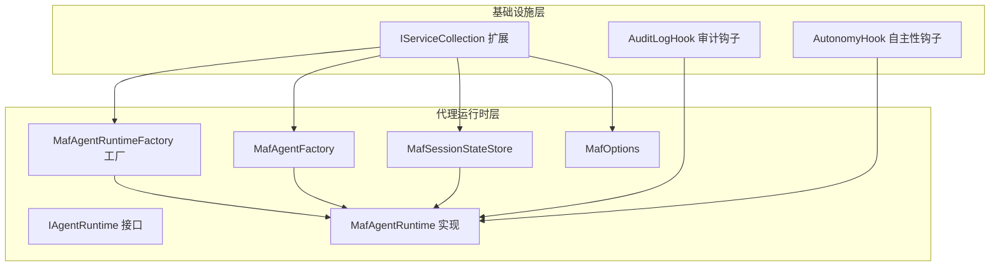
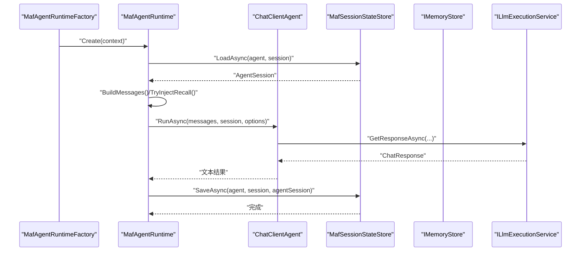
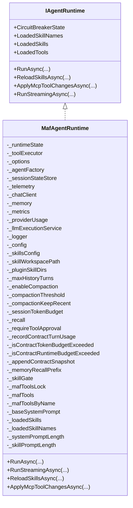
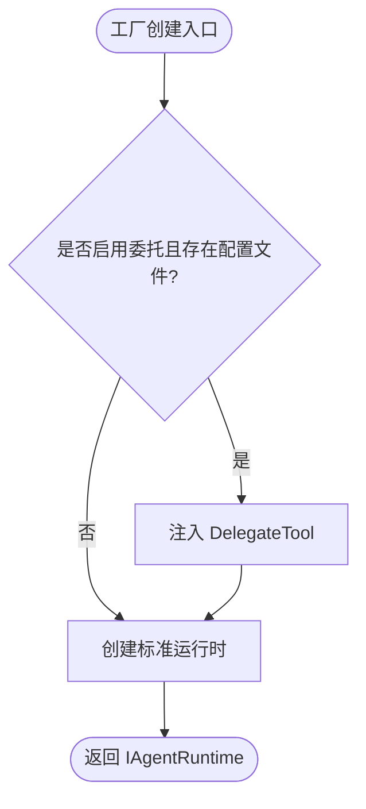
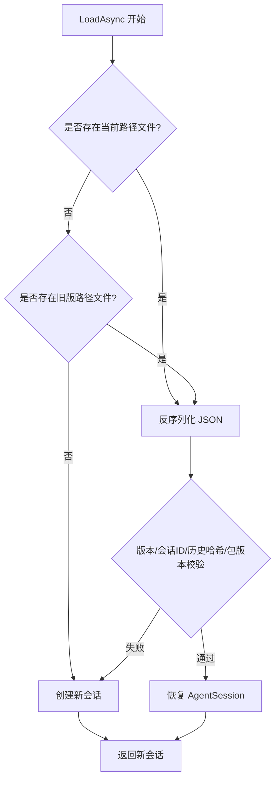
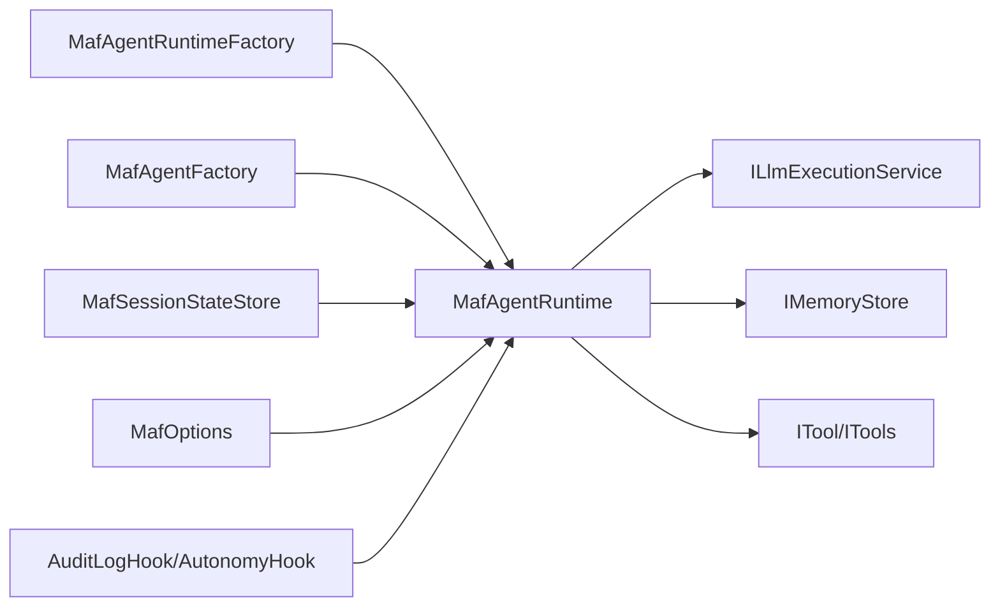
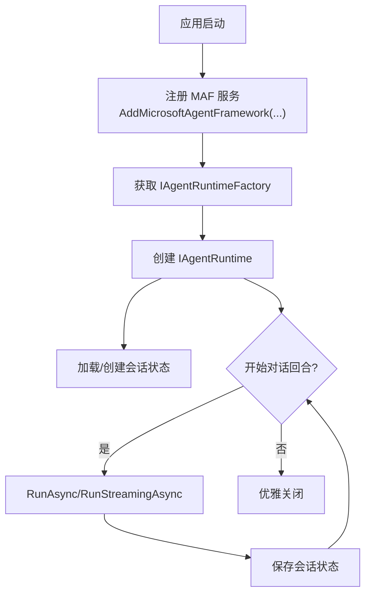
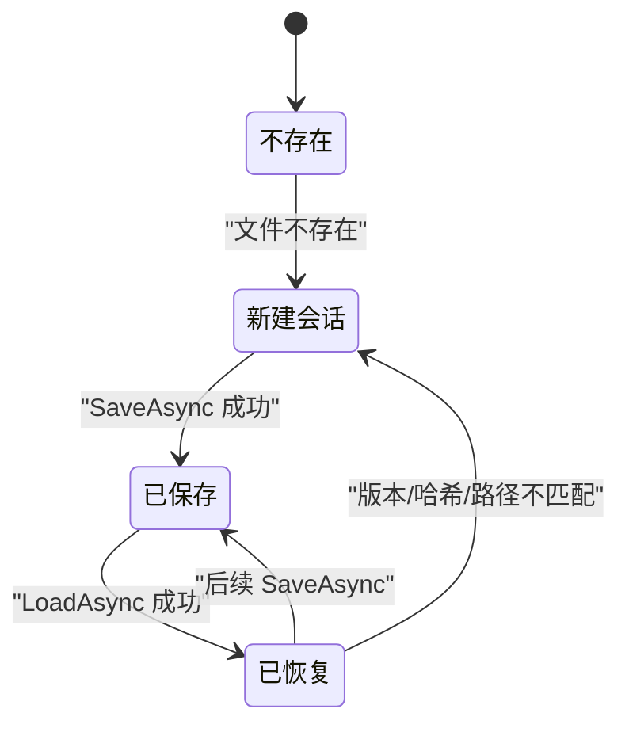

# 代理生命周期管理

<cite>
**本文引用的文件**
- [MafAgentRuntime.cs](file://src/OpenClaw.Agent/MafAgentRuntime.cs)
- [MafAgentRuntimeFactory.cs](file://src/OpenClaw.Agent/MafAgentRuntimeFactory.cs)
- [IAgentRuntime.cs](file://src/OpenClaw.Agent/IAgentRuntime.cs)
- [IAgentRuntimeFactory.cs](file://src/OpenClaw.Agent/IAgentRuntimeFactory.cs)
- [MafOptions.cs](file://src/OpenClaw.Agent/MafOptions.cs)
- [MafSessionStateStore.cs](file://src/OpenClaw.Agent/MafSessionStateStore.cs)
- [MafAgentFactory.cs](file://src/OpenClaw.Agent/MafAgentFactory.cs)
- [MafServiceCollectionExtensions.cs](file://src/OpenClaw.Agent/MafServiceCollectionExtensions.cs)
- [AuditLogHook.cs](file://src/OpenClaw.Agent/AuditLogHook.cs)
- [AutonomyHook.cs](file://src/OpenClaw.Agent/AutonomyHook.cs)
- [MafAgentRuntimeTests.cs](file://src/OpenClaw.Tests/MafAgentRuntimeTests.cs)
</cite>

## 目录
1. [简介](#简介)
2. [项目结构](#项目结构)
3. [核心组件](#核心组件)
4. [架构总览](#架构总览)
5. [详细组件分析](#详细组件分析)
6. [依赖关系分析](#依赖关系分析)
7. [性能考量](#性能考量)
8. [故障排查指南](#故障排查指南)
9. [结论](#结论)
10. [附录](#附录)

## 简介
本文件系统性阐述 OpenClaw 代理在 Microsoft Agent Framework（MAF）运行时下的生命周期管理：从代理创建、初始化、运行到销毁的全过程；详解 MafAgentRuntime 构造函数参数、依赖注入配置与初始化流程；文档化代理状态管理与会话状态存储机制；解析运行时工厂模式与委托运行时的实现；并覆盖代理配置选项、性能参数调优、错误处理策略、与网关服务的集成点及生命周期钩子机制。文末提供启动流程图、状态转换图与最佳实践建议。

## 项目结构
OpenClaw 代理生命周期管理主要位于 OpenClaw.Agent 模块中，围绕以下关键类型展开：
- 运行时接口与实现：IAgentRuntime、MafAgentRuntime
- 工厂与注入：IAgentRuntimeFactory、MafAgentRuntimeFactory、MafAgentFactory、MafServiceCollectionExtensions
- 会话状态存储：MafSessionStateStore
- 配置项：MafOptions
- 生命周期钩子：AuditLogHook、AutonomyHook
- 测试用例：MafAgentRuntimeTests

图表来源
- [MafServiceCollectionExtensions.cs:1-107](file://src/OpenClaw.Agent/MafServiceCollectionExtensions.cs#L1-L107)
- [MafAgentRuntimeFactory.cs:1-166](file://src/OpenClaw.Agent/MafAgentRuntimeFactory.cs#L1-L166)
- [MafAgentRuntime.cs:1-1184](file://src/OpenClaw.Agent/MafAgentRuntime.cs#L1-L1184)
- [MafAgentFactory.cs:1-37](file://src/OpenClaw.Agent/MafAgentFactory.cs#L1-L37)
- [MafSessionStateStore.cs:1-197](file://src/OpenClaw.Agent/MafSessionStateStore.cs#L1-L197)
- [MafOptions.cs:1-44](file://src/OpenClaw.Agent/MafOptions.cs#L1-L44)
- [AuditLogHook.cs:1-63](file://src/OpenClaw.Agent/AuditLogHook.cs#L1-L63)
- [AutonomyHook.cs:1-238](file://src/OpenClaw.Agent/AutonomyHook.cs#L1-L238)

章节来源
- [MafServiceCollectionExtensions.cs:1-107](file://src/OpenClaw.Agent/MafServiceCollectionExtensions.cs#L1-L107)
- [MafAgentRuntimeFactory.cs:1-166](file://src/OpenClaw.Agent/MafAgentRuntimeFactory.cs#L1-L166)
- [MafAgentRuntime.cs:1-1184](file://src/OpenClaw.Agent/MafAgentRuntime.cs#L1-L1184)

## 核心组件
- IAgentRuntime：定义代理运行时的核心能力，包括同步/流式对话、技能重载、工具热替换等。
- MafAgentRuntime：MAF 运行时的具体实现，负责构建系统提示、消息编排、工具执行、会话状态读写、历史压缩与记忆检索注入、错误处理与遥测。
- IAgentRuntimeFactory/AgentRuntimeFactoryContext：工厂接口与上下文，承载所有运行时所需的依赖和服务。
- MafAgentRuntimeFactory：根据配置与委托策略创建运行时实例，并可注入 DelegateTool 以支持跨运行时委派。
- MafAgentFactory：封装 ChatClientAgent 的创建，统一设置代理名称、描述与工具集合。
- MafSessionStateStore：会话状态持久化与恢复，基于文件侧车（sidecar）与历史哈希校验。
- MafOptions：MAF 运行时配置项，如启用流式、A2A、会话侧车路径等。
- AuditLogHook/AutonomyHook：内置工具执行钩子，分别用于审计日志与自主性/路径/命令安全策略。

章节来源
- [IAgentRuntime.cs:1-51](file://src/OpenClaw.Agent/IAgentRuntime.cs#L1-L51)
- [MafAgentRuntime.cs:1-1184](file://src/OpenClaw.Agent/MafAgentRuntime.cs#L1-L1184)
- [IAgentRuntimeFactory.cs:1-66](file://src/OpenClaw.Agent/IAgentRuntimeFactory.cs#L1-L66)
- [MafAgentRuntimeFactory.cs:1-166](file://src/OpenClaw.Agent/MafAgentRuntimeFactory.cs#L1-L166)
- [MafAgentFactory.cs:1-37](file://src/OpenClaw.Agent/MafAgentFactory.cs#L1-L37)
- [MafSessionStateStore.cs:1-197](file://src/OpenClaw.Agent/MafSessionStateStore.cs#L1-L197)
- [MafOptions.cs:1-44](file://src/OpenClaw.Agent/MafOptions.cs#L1-L44)
- [AuditLogHook.cs:1-63](file://src/OpenClaw.Agent/AuditLogHook.cs#L1-L63)
- [AutonomyHook.cs:1-238](file://src/OpenClaw.Agent/AutonomyHook.cs#L1-L238)

## 架构总览
下图展示从工厂创建运行时到一次完整对话回合的交互关系与数据流：

图表来源
- [MafAgentRuntimeFactory.cs:119-164](file://src/OpenClaw.Agent/MafAgentRuntimeFactory.cs#L119-L164)
- [MafAgentRuntime.cs:203-337](file://src/OpenClaw.Agent/MafAgentRuntime.cs#L203-L337)
- [MafSessionStateStore.cs:36-144](file://src/OpenClaw.Agent/MafSessionStateStore.cs#L36-L144)

## 详细组件分析

### MafAgentRuntime：运行时生命周期与核心逻辑
- 构造函数参数与依赖注入
  - 接收 AgentRuntimeFactoryContext、MafOptions、MafAgentFactory、MafSessionStateStore、MafTelemetryAdapter 等。
  - 从上下文提取 LLM 配置、内存存储、工具集、技能配置、工作区路径、插件技能目录、合约预算回调等。
  - 初始化 OpenClawToolExecutor、MafExecutionServiceChatClient、工具适配器字典、系统提示长度与技能提示长度缓存。
- 初始化流程
  - 应用技能 ApplySkills，构建基础系统提示与技能片段。
  - 基于上下文配置初始化历史轮次上限、压缩阈值、保留最近轮数、会话令牌预算、记忆检索配置、合约预算检查回调等。
- 运行阶段（同步）
  - 合约预算检查与会话令牌预算检查。
  - 创建 ChatClientAgent（普通或带系统事件增强），加载会话状态。
  - 构建消息列表，按需进行记忆检索注入与历史压缩/修剪。
  - 在 MafExecutionContextScope 中推入回合上下文（会话、回合上下文、工具调用收集、审批回调、合约记录等），调用 agent.RunAsync 并追加历史。
  - 保存会话状态，再次检查合约预算，返回响应文本。
- 运行阶段（流式）
  - 类似同步流程，但通过通道与事件流式输出增量文本，异常时返回错误事件并完成流。
- 错误处理
  - 捕获 OperationCanceledException、ModelSelectionException、通用异常，分别记录指标与日志，返回用户可读提示。
- 工具与技能
  - 支持热替换 MCP 工具集合，更新工具声明与名称映射。
  - 支持重新加载技能，触发 SkillsReloaded 事件。
- 记忆检索与历史压缩
  - 记忆检索：基于 IMemoryNoteSearch 搜索相关笔记，插入用户消息位置，受最大条目与字符限制。
  - 历史压缩：当轮次超过阈值时，摘要早期对话并插入系统消息，否则简单修剪。
- 状态管理
  - 使用对象锁保护工具与技能列表的并发访问。
  - 通过 MafExecutionContextScope 传递回合上下文，确保工具执行与流式输出的一致性。

图表来源
- [IAgentRuntime.cs:8-51](file://src/OpenClaw.Agent/IAgentRuntime.cs#L8-L51)
- [MafAgentRuntime.cs:17-1184](file://src/OpenClaw.Agent/MafAgentRuntime.cs#L17-L1184)

章节来源
- [MafAgentRuntime.cs:57-118](file://src/OpenClaw.Agent/MafAgentRuntime.cs#L57-L118)
- [MafAgentRuntime.cs:203-337](file://src/OpenClaw.Agent/MafAgentRuntime.cs#L203-L337)
- [MafAgentRuntime.cs:339-423](file://src/OpenClaw.Agent/MafAgentRuntime.cs#L339-L423)
- [MafAgentRuntime.cs:625-682](file://src/OpenClaw.Agent/MafAgentRuntime.cs#L625-L682)
- [MafAgentRuntime.cs:684-764](file://src/OpenClaw.Agent/MafAgentRuntime.cs#L684-L764)

### MafAgentRuntimeFactory：工厂模式与委托运行时
- 职责
  - 根据上下文创建 MafAgentRuntime 实例。
  - 支持“委托”模式：当配置启用且存在代理配置文件时，注入 DelegateTool 并为每个配置文件创建独立的“委派运行时”，实现按配置隔离的运行时拓扑。
- 关键点
  - 通过 AgentRuntimeFactoryContext 注入所有依赖。
  - CreateDelegatedRuntime 会复制并定制 GatewayConfig（如 LLM 配置、历史轮次上限等）后创建运行时。
  - OrchestratorId 与能力校验由 MafCapabilities.EnsureSupported 完成。

图表来源
- [MafAgentRuntimeFactory.cs:119-164](file://src/OpenClaw.Agent/MafAgentRuntimeFactory.cs#L119-L164)
- [MafAgentRuntimeFactory.cs:42-72](file://src/OpenClaw.Agent/MafAgentRuntimeFactory.cs#L42-L72)

章节来源
- [MafAgentRuntimeFactory.cs:9-166](file://src/OpenClaw.Agent/MafAgentRuntimeFactory.cs#L9-L166)

### MafAgentFactory：代理实例创建
- 将 MafOptions、LoggerFactory、ServiceProvider 注入 ChatClientAgent，统一设置代理名称、描述与工具集合。
- 作为运行时内部的轻量封装，便于集中配置代理行为。

章节来源
- [MafAgentFactory.cs:8-37](file://src/OpenClaw.Agent/MafAgentFactory.cs#L8-L37)

### MafSessionStateStore：会话状态存储与恢复
- 存储机制
  - 以 SessionId 的 SHA256 哈希命名文件，JSON 序列化 AgentSession。
  - 写入采用临时文件 + 原子移动，保证一致性。
- 恢复策略
  - 若不存在或版本不匹配、会话 ID 不一致、历史哈希不一致、MAF 包版本不一致，则回退到新建会话。
- 兼容性
  - 支持旧版侧车路径迁移与兼容。
- 历史哈希
  - 基于模型覆盖、系统提示覆盖、路由预设、允许工具集合与历史 JSON 组合计算哈希，确保状态与上下文一致。

图表来源
- [MafSessionStateStore.cs:36-105](file://src/OpenClaw.Agent/MafSessionStateStore.cs#L36-L105)
- [MafSessionStateStore.cs:107-144](file://src/OpenClaw.Agent/MafSessionStateStore.cs#L107-L144)
- [MafSessionStateStore.cs:184-196](file://src/OpenClaw.Agent/MafSessionStateStore.cs#L184-L196)

章节来源
- [MafSessionStateStore.cs:12-197](file://src/OpenClaw.Agent/MafSessionStateStore.cs#L12-L197)

### MafOptions：配置项与默认行为
- 主要配置
  - AgentName、AgentDescription：代理元数据。
  - SessionSidecarPath：会话侧车存储根路径，默认 sessions。
  - EnableStreaming/EnableStreamingFallback：是否启用流式响应。
  - EnableA2A、A2APathPrefix、A2AVersion、A2APublicBaseUrl、A2ASkills：A2A 集成相关。
- 配置来源
  - 优先读取新节名称，若不存在则回退到旧节名称。
  - 支持从 IConfiguration 动态装配。

章节来源
- [MafOptions.cs:3-44](file://src/OpenClaw.Agent/MafOptions.cs#L3-L44)
- [MafServiceCollectionExtensions.cs:22-105](file://src/OpenClaw.Agent/MafServiceCollectionExtensions.cs#L22-L105)

### 生命周期钩子：审计与自主性控制
- AuditLogHook
  - 在工具执行前后记录审计日志，始终允许执行。
- AutonomyHook
  - 强制自主性模式（只读/全权限）、工作区限制、路径/命令白名单/黑名单策略，作为“硬拒绝层”。

章节来源
- [AuditLogHook.cs:10-63](file://src/OpenClaw.Agent/AuditLogHook.cs#L10-L63)
- [AutonomyHook.cs:14-238](file://src/OpenClaw.Agent/AutonomyHook.cs#L14-L238)

## 依赖关系分析
- 低耦合高内聚
  - MafAgentRuntime 通过上下文聚合所需依赖，避免直接感知容器细节。
  - MafAgentRuntimeFactory 仅负责运行时实例化与委托策略，职责单一。
- 外部依赖
  - Microsoft.Agents.AI ChatClientAgent 提供底层推理能力。
  - IMemoryStore 提供记忆检索能力（可选）。
  - IToolHook/IChatClient/ILlmExecutionService 等抽象解耦具体实现。
- 循环依赖
  - 未发现循环依赖迹象；工厂与运行时之间为单向依赖。

图表来源
- [MafAgentRuntimeFactory.cs:17-40](file://src/OpenClaw.Agent/MafAgentRuntimeFactory.cs#L17-L40)
- [MafAgentRuntime.cs:57-118](file://src/OpenClaw.Agent/MafAgentRuntime.cs#L57-L118)
- [MafAgentFactory.cs:14-35](file://src/OpenClaw.Agent/MafAgentFactory.cs#L14-L35)
- [MafSessionStateStore.cs:22-34](file://src/OpenClaw.Agent/MafSessionStateStore.cs#L22-L34)
- [MafOptions.cs:3-35](file://src/OpenClaw.Agent/MafOptions.cs#L3-L35)
- [AuditLogHook.cs:10-63](file://src/OpenClaw.Agent/AuditLogHook.cs#L10-L63)
- [AutonomyHook.cs:14-238](file://src/OpenClaw.Agent/AutonomyHook.cs#L14-L238)

章节来源
- [MafAgentRuntimeFactory.cs:1-166](file://src/OpenClaw.Agent/MafAgentRuntimeFactory.cs#L1-L166)
- [MafAgentRuntime.cs:1-1184](file://src/OpenClaw.Agent/MafAgentRuntime.cs#L1-L1184)

## 性能考量
- 历史压缩
  - 当历史轮次超过阈值时，使用摘要模型生成上下文摘要，减少上下文长度，提升吞吐与降低成本。
- 记忆检索
  - 限制检索条目与字符上限，避免大段不受信任内容进入上下文。
- 流式输出
  - 通过通道与事件流式返回，降低首字节延迟，改善用户体验。
- 并发与锁
  - 技能与工具列表访问使用细粒度锁，避免竞争条件。
- 指标与遥测
  - 请求计数、LLM 错误计数、记忆检索次数与命中数、历史压缩次数等指标用于性能观测。

章节来源
- [MafAgentRuntime.cs:684-764](file://src/OpenClaw.Agent/MafAgentRuntime.cs#L684-L764)
- [MafAgentRuntime.cs:625-682](file://src/OpenClaw.Agent/MafAgentRuntime.cs#L625-L682)
- [MafAgentRuntime.cs:339-423](file://src/OpenClaw.Agent/MafAgentRuntime.cs#L339-L423)

## 故障排查指南
- 常见问题与定位
  - 会话状态无法恢复：检查侧车文件是否存在、版本与包版本是否匹配、历史哈希是否一致。
  - 记忆检索失败：确认 IMemoryNoteSearch 可用、查询前缀与限制参数合理。
  - 流式输出中断：检查通道写入与取消令牌，关注模型选择失败与提供方异常分支。
  - 工具执行被拒：检查 AutonomyHook 的路径/命令策略与工作区限制。
- 日志与指标
  - 运行时会在关键节点记录信息与警告，错误时增加 LLM 错误指标。
- 单元测试参考
  - MafAgentRuntimeTests 提供了运行回合、历史修剪、技能重载等场景的断言示例，可用于验证行为。

章节来源
- [MafSessionStateStore.cs:36-105](file://src/OpenClaw.Agent/MafSessionStateStore.cs#L36-L105)
- [MafAgentRuntime.cs:320-337](file://src/OpenClaw.Agent/MafAgentRuntime.cs#L320-L337)
- [MafAgentRuntime.cs:524-562](file://src/OpenClaw.Agent/MafAgentRuntime.cs#L524-L562)
- [AutonomyHook.cs:28-82](file://src/OpenClaw.Agent/AutonomyHook.cs#L28-L82)
- [MafAgentRuntimeTests.cs:1-200](file://src/OpenClaw.Tests/MafAgentRuntimeTests.cs#L1-L200)

## 结论
本文档系统梳理了 OpenClaw 代理在 MAF 运行时下的生命周期管理：从工厂创建、运行时初始化、回合执行、状态持久化到错误处理与性能优化。通过清晰的依赖注入与工厂模式，实现了可扩展、可观测、可治理的代理运行时。配合钩子机制与配置项，可在不同场景下灵活调整行为与安全策略。

## 附录

### 启动流程图（端到端）

图表来源
- [MafServiceCollectionExtensions.cs:9-20](file://src/OpenClaw.Agent/MafServiceCollectionExtensions.cs#L9-L20)
- [MafAgentRuntimeFactory.cs:119-164](file://src/OpenClaw.Agent/MafAgentRuntimeFactory.cs#L119-L164)
- [MafAgentRuntime.cs:203-337](file://src/OpenClaw.Agent/MafAgentRuntime.cs#L203-L337)
- [MafSessionStateStore.cs:36-144](file://src/OpenClaw.Agent/MafSessionStateStore.cs#L36-L144)

### 状态转换图（会话侧车）

图表来源
- [MafSessionStateStore.cs:36-144](file://src/OpenClaw.Agent/MafSessionStateStore.cs#L36-L144)

### 最佳实践指南
- 配置建议
  - 合理设置 MaxHistoryTurns 与 EnableCompaction，平衡上下文长度与成本。
  - 启用 SessionTokenBudget 以防止会话无限增长。
  - 使用 A2A 集成时，明确 A2APathPrefix 与 A2AVersion，便于网关路由。
- 安全建议
  - 通过 AutonomyHook 设置工作区限制与命令白名单，必要时启用只读模式。
  - 审计钩子应开启以记录工具执行轨迹。
- 性能建议
  - 对长对话启用历史压缩；对频繁检索开启记忆召回并限制条目与字符数。
  - 在流式场景下，合理设置通道容量与取消策略，避免背压。
- 可观测性
  - 关注请求计数、LLM 错误、记忆检索命中与历史压缩次数等指标，定期评估与调优。