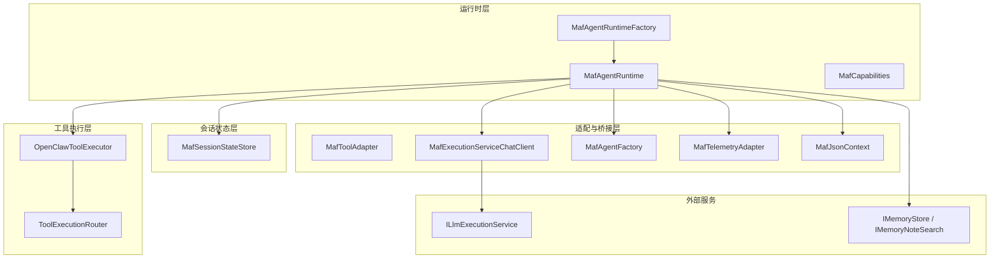
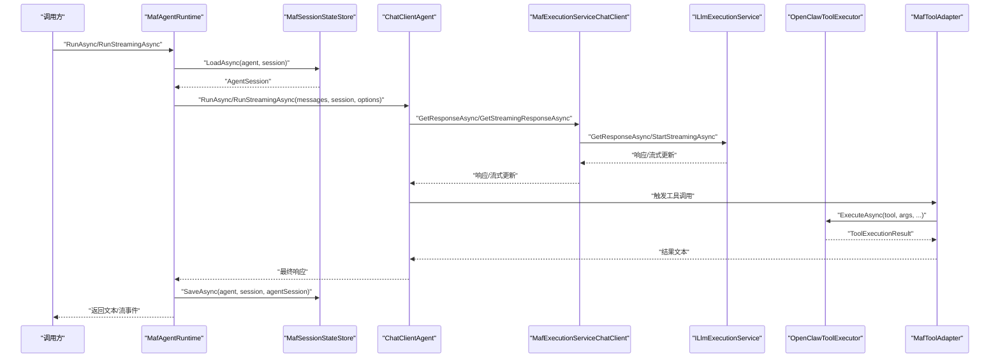
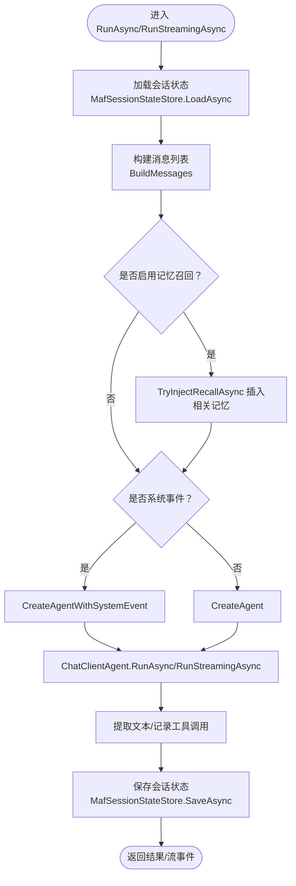
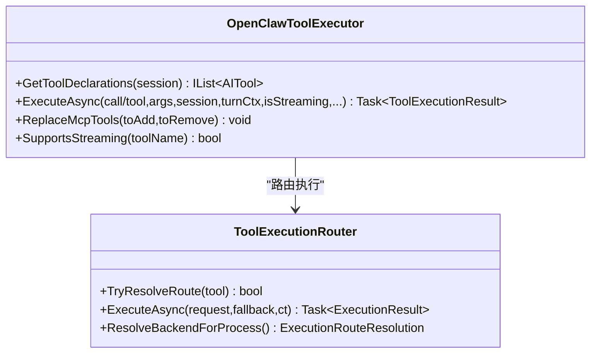
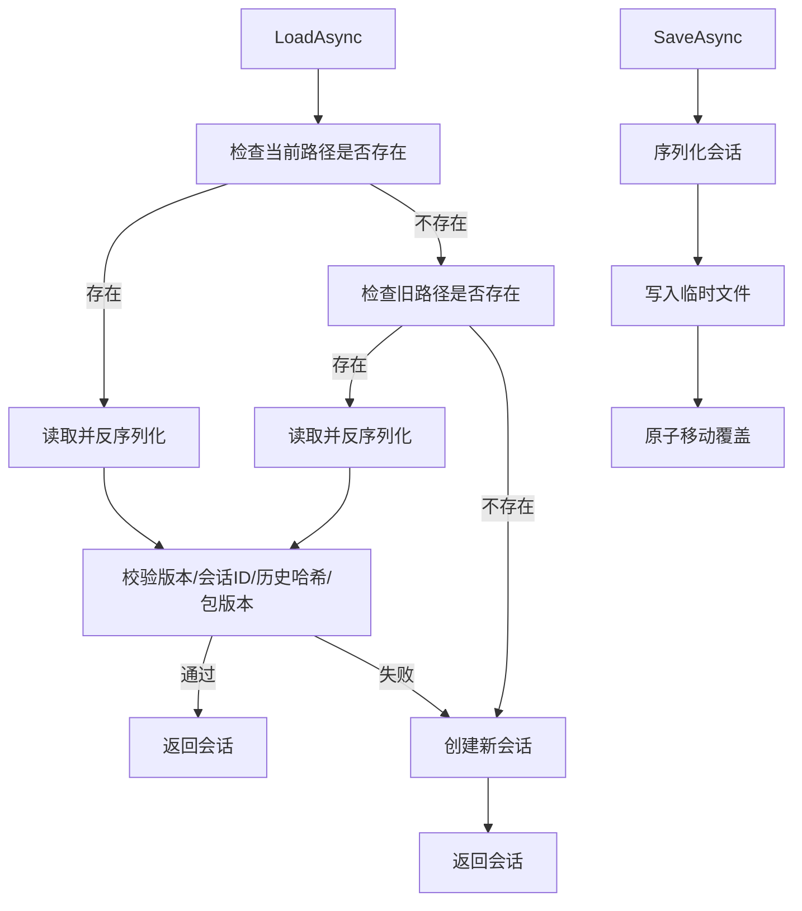
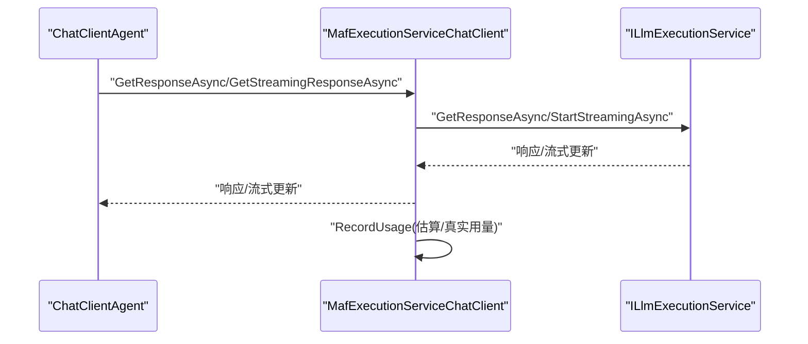
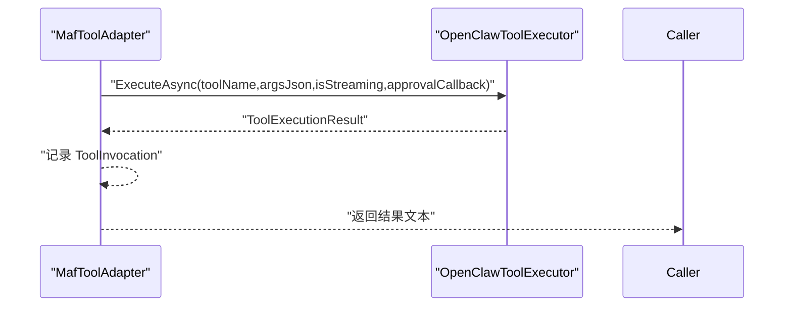
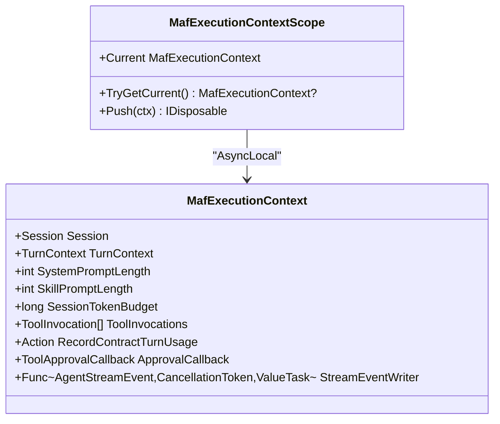
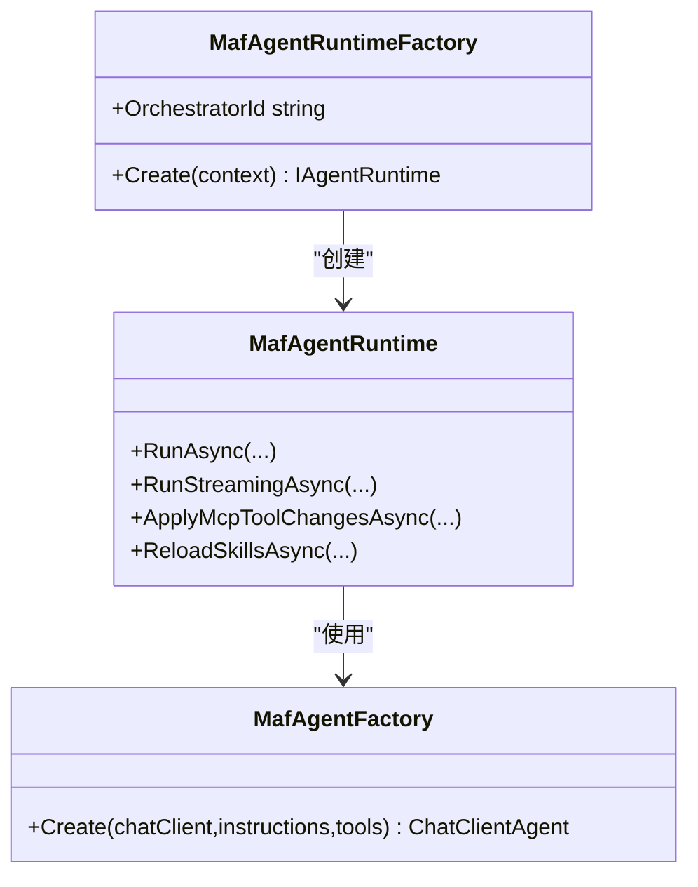
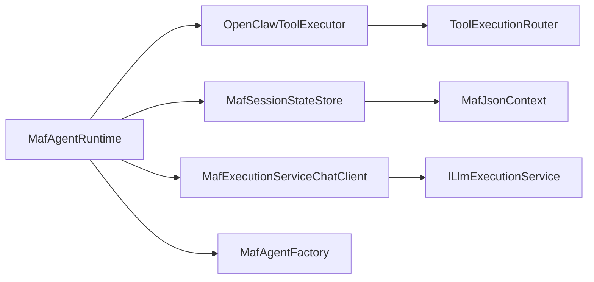

# 代理运行时

<cite>
**本文引用的文件**
- [MafAgentRuntime.cs](file://src/OpenClaw.Agent/MafAgentRuntime.cs)
- [IAgentRuntime.cs](file://src/OpenClaw.Agent/IAgentRuntime.cs)
- [MafAgentRuntimeFactory.cs](file://src/OpenClaw.Agent/MafAgentRuntimeFactory.cs)
- [MafOptions.cs](file://src/OpenClaw.Agent/MafOptions.cs)
- [MafExecutionContext.cs](file://src/OpenClaw.Agent/MafExecutionContext.cs)
- [OpenClawToolExecutor.cs](file://src/OpenClaw.Agent/OpenClawToolExecutor.cs)
- [MafSessionStateStore.cs](file://src/OpenClaw.Agent/MafSessionStateStore.cs)
- [MafToolAdapter.cs](file://src/OpenClaw.Agent/MafToolAdapter.cs)
- [MafTelemetryAdapter.cs](file://src/OpenClaw.Agent/MafTelemetryAdapter.cs)
- [MafExecutionServiceChatClient.cs](file://src/OpenClaw.Agent/MafExecutionServiceChatClient.cs)
- [MafAgentFactory.cs](file://src/OpenClaw.Agent/MafAgentFactory.cs)
- [MafCapabilities.cs](file://src/OpenClaw.Agent/MafCapabilities.cs)
- [MafJsonContext.cs](file://src/OpenClaw.Agent/MafJsonContext.cs)
- [ToolExecutionRouter.cs](file://src/OpenClaw.Agent/Execution/ToolExecutionRouter.cs)
</cite>

## 目录
1. [简介](#简介)
2. [项目结构](#项目结构)
3. [核心组件](#核心组件)
4. [架构总览](#架构总览)
5. [详细组件分析](#详细组件分析)
6. [依赖关系分析](#依赖关系分析)
7. [性能考量](#性能考量)
8. [故障排查指南](#故障排查指南)
9. [结论](#结论)
10. [附录](#附录)

## 简介
本文件面向“代理运行时”（MAF：Microsoft Agent Framework）的技术文档，聚焦于 MafAgentRuntime 的核心逻辑、会话管理机制、工具执行器与记忆处理系统。内容覆盖代理生命周期管理、对话状态跟踪、工具调用流程与响应生成过程，并提供接口定义、配置项说明、使用模式、调试技巧与性能优化建议，帮助开发者在不同运行模式下稳定地集成与扩展代理能力。

## 项目结构
MAF 运行时位于 OpenClaw.Agent 模块中，围绕以下关键职责组织：
- 运行时入口与生命周期：MafAgentRuntime 实现 IAgentRuntime，负责单轮对话的编排、历史压缩/修剪、记忆召回注入、工具声明与调用、会话状态持久化。
- 工具执行链路：OpenClawToolExecutor 负责工具授权、治理、钩子、沙箱路由、超时控制、审计与度量。
- 会话状态：MafSessionStateStore 提供基于文件的会话侧车（sidecar）加载/保存，支持历史哈希校验与版本兼容。
- 执行客户端桥接：MafExecutionServiceChatClient 将 MAF 的 IChatClient 与底层 ILlmExecutionService 对接，统一记录用量与指标。
- 工厂与能力：MafAgentFactory 创建 ChatClientAgent；MafAgentRuntimeFactory 组装运行时并支持委托运行；MafCapabilities 定义运行模式支持范围。

图表来源
- [MafAgentRuntime.cs:17-118](file://src/OpenClaw.Agent/MafAgentRuntime.cs#L17-L118)
- [MafAgentRuntimeFactory.cs:9-40](file://src/OpenClaw.Agent/MafAgentRuntimeFactory.cs#L9-L40)
- [MafAgentFactory.cs:8-36](file://src/OpenClaw.Agent/MafAgentFactory.cs#L8-L36)
- [MafSessionStateStore.cs:12-34](file://src/OpenClaw.Agent/MafSessionStateStore.cs#L12-L34)
- [MafExecutionServiceChatClient.cs:10-30](file://src/OpenClaw.Agent/MafExecutionServiceChatClient.cs#L10-L30)
- [OpenClawToolExecutor.cs:30-100](file://src/OpenClaw.Agent/OpenClawToolExecutor.cs#L30-L100)
- [ToolExecutionRouter.cs:7-63](file://src/OpenClaw.Agent/Execution/ToolExecutionRouter.cs#L7-L63)
- [MafTelemetryAdapter.cs:7-24](file://src/OpenClaw.Agent/MafTelemetryAdapter.cs#L7-L24)
- [MafJsonContext.cs:7-21](file://src/OpenClaw.Agent/MafJsonContext.cs#L7-L21)

章节来源
- [MafAgentRuntime.cs:17-118](file://src/OpenClaw.Agent/MafAgentRuntime.cs#L17-L118)
- [MafAgentRuntimeFactory.cs:9-40](file://src/OpenClaw.Agent/MafAgentRuntimeFactory.cs#L9-L40)
- [MafAgentFactory.cs:8-36](file://src/OpenClaw.Agent/MafAgentFactory.cs#L8-L36)
- [MafSessionStateStore.cs:12-34](file://src/OpenClaw.Agent/MafSessionStateStore.cs#L12-L34)
- [MafExecutionServiceChatClient.cs:10-30](file://src/OpenClaw.Agent/MafExecutionServiceChatClient.cs#L10-L30)
- [OpenClawToolExecutor.cs:30-100](file://src/OpenClaw.Agent/OpenClawToolExecutor.cs#L30-L100)
- [ToolExecutionRouter.cs:7-63](file://src/OpenClaw.Agent/Execution/ToolExecutionRouter.cs#L7-L63)
- [MafTelemetryAdapter.cs:7-24](file://src/OpenClaw.Agent/MafTelemetryAdapter.cs#L7-L24)
- [MafJsonContext.cs:7-21](file://src/OpenClaw.Agent/MafJsonContext.cs#L7-L21)

## 核心组件
- MafAgentRuntime：实现 IAgentRuntime，负责每轮对话的完整生命周期，包括系统提示构建、消息构造、记忆召回注入、工具调用、历史压缩/修剪、会话状态保存与预算检查。
- OpenClawToolExecutor：封装工具授权、治理策略、钩子、沙箱路由、超时与审计，统一产出标准化的 ToolExecutionResult。
- MafSessionStateStore：基于 JSON 的会话侧车持久化，带版本与历史哈希校验，确保会话状态可恢复且安全。
- MafExecutionServiceChatClient：将 MAF 的 IChatClient 与 ILlmExecutionService 对接，统一记录用量、缓存与指标。
- MafAgentFactory：创建 ChatClientAgent，注入名称、描述、工具与服务。
- MafAgentRuntimeFactory：组装运行时上下文，支持委托运行与工具热替换。
- MafToolAdapter：将 ITool 包装为 AITool，桥接工具执行与流式事件。
- MafExecutionContext/MafExecutionContextScope：在线程本地作用域内传递会话、令牌用量、工具调用列表与审批回调。
- MafOptions：运行时特性开关（如流式、A2A）、会话侧车路径等。
- MafCapabilities：声明运行模式支持（JIT/AOT）。
- MafJsonContext：会话侧车序列化上下文。

章节来源
- [IAgentRuntime.cs:8-50](file://src/OpenClaw.Agent/IAgentRuntime.cs#L8-L50)
- [MafAgentRuntime.cs:17-118](file://src/OpenClaw.Agent/MafAgentRuntime.cs#L17-L118)
- [OpenClawToolExecutor.cs:30-100](file://src/OpenClaw.Agent/OpenClawToolExecutor.cs#L30-L100)
- [MafSessionStateStore.cs:12-34](file://src/OpenClaw.Agent/MafSessionStateStore.cs#L12-L34)
- [MafExecutionServiceChatClient.cs:10-30](file://src/OpenClaw.Agent/MafExecutionServiceChatClient.cs#L10-L30)
- [MafAgentFactory.cs:8-36](file://src/OpenClaw.Agent/MafAgentFactory.cs#L8-L36)
- [MafAgentRuntimeFactory.cs:9-40](file://src/OpenClaw.Agent/MafAgentRuntimeFactory.cs#L9-L40)
- [MafToolAdapter.cs:9-30](file://src/OpenClaw.Agent/MafToolAdapter.cs#L9-L30)
- [MafExecutionContext.cs:6-17](file://src/OpenClaw.Agent/MafExecutionContext.cs#L6-L17)
- [MafOptions.cs:3-35](file://src/OpenClaw.Agent/MafOptions.cs#L3-L35)
- [MafCapabilities.cs:5-16](file://src/OpenClaw.Agent/MafCapabilities.cs#L5-L16)
- [MafJsonContext.cs:7-21](file://src/OpenClaw.Agent/MafJsonContext.cs#L7-L21)

## 架构总览
下图展示一次典型对话从请求到响应的关键交互：

图表来源
- [MafAgentRuntime.cs:203-337](file://src/OpenClaw.Agent/MafAgentRuntime.cs#L203-L337)
- [MafAgentRuntime.cs:339-423](file://src/OpenClaw.Agent/MafAgentRuntime.cs#L339-L423)
- [MafSessionStateStore.cs:36-105](file://src/OpenClaw.Agent/MafSessionStateStore.cs#L36-L105)
- [MafExecutionServiceChatClient.cs:32-65](file://src/OpenClaw.Agent/MafExecutionServiceChatClient.cs#L32-L65)
- [MafExecutionServiceChatClient.cs:67-125](file://src/OpenClaw.Agent/MafExecutionServiceChatClient.cs#L67-L125)
- [MafToolAdapter.cs:31-61](file://src/OpenClaw.Agent/MafToolAdapter.cs#L31-L61)
- [OpenClawToolExecutor.cs:134-162](file://src/OpenClaw.Agent/OpenClawToolExecutor.cs#L134-L162)

## 详细组件分析

### MafAgentRuntime：运行时核心
- 生命周期与入口
  - 同步与流式两类入口：RunAsync 与 RunStreamingAsync，均通过 MafExecutionContextScope 注入上下文，记录用量、工具调用与审批回调。
  - 支持系统事件（isSystemEvent=true）：将事件文本作为系统级指令注入，避免在历史中显式出现用户触发。
- 历史管理
  - 支持两种策略：启用压缩（CompactHistoryAsync）或简单修剪（TrimHistory）。压缩通过摘要模型生成“先前对话摘要”以降低上下文长度。
- 记忆召回
  - TryInjectRecallAsync 在消息列表中插入相关记忆片段，受最大条数与字符上限限制，并对空值与前缀进行回退处理。
- 系统提示与技能
  - GetSystemPrompt 动态拼接基础系统提示与技能索引/修补后的技能指令，支持被会话覆盖与动态后缀追加。
  - ResolveSkillsForTurn 基于投影契约对技能进行解析与阻断/修补，形成每轮生效的技能集合。
- 预算与合同
  - TryRejectContractBudget 检查合同运行时与令牌预算，必要时写入快照并提前终止。
- 输出与保存
  - 提取文本、记录工具调用、追加会话历史，并通过 MafSessionStateStore 保存 AgentSession。

图表来源
- [MafAgentRuntime.cs:203-337](file://src/OpenClaw.Agent/MafAgentRuntime.cs#L203-L337)
- [MafAgentRuntime.cs:339-423](file://src/OpenClaw.Agent/MafAgentRuntime.cs#L339-L423)
- [MafAgentRuntime.cs:625-682](file://src/OpenClaw.Agent/MafAgentRuntime.cs#L625-L682)
- [MafAgentRuntime.cs:766-809](file://src/OpenClaw.Agent/MafAgentRuntime.cs#L766-L809)
- [MafAgentRuntime.cs:425-447](file://src/OpenClaw.Agent/MafAgentRuntime.cs#L425-L447)
- [MafSessionStateStore.cs:107-144](file://src/OpenClaw.Agent/MafSessionStateStore.cs#L107-L144)

章节来源
- [MafAgentRuntime.cs:17-118](file://src/OpenClaw.Agent/MafAgentRuntime.cs#L17-L118)
- [MafAgentRuntime.cs:203-337](file://src/OpenClaw.Agent/MafAgentRuntime.cs#L203-L337)
- [MafAgentRuntime.cs:339-423](file://src/OpenClaw.Agent/MafAgentRuntime.cs#L339-L423)
- [MafAgentRuntime.cs:625-682](file://src/OpenClaw.Agent/MafAgentRuntime.cs#L625-L682)
- [MafAgentRuntime.cs:684-764](file://src/OpenClaw.Agent/MafAgentRuntime.cs#L684-L764)
- [MafAgentRuntime.cs:766-809](file://src/OpenClaw.Agent/MafAgentRuntime.cs#L766-L809)
- [MafAgentRuntime.cs:1076-1082](file://src/OpenClaw.Agent/MafAgentRuntime.cs#L1076-L1082)
- [MafAgentRuntime.cs:1155-1182](file://src/OpenClaw.Agent/MafAgentRuntime.cs#L1155-L1182)

### OpenClawToolExecutor：工具执行器
- 授权与治理
  - 通过 IToolGovernanceService 进行授权决策，支持参数红化、替换参数、不可用回退与审计记录。
- 钩子与预检
  - IToolHook/IToolHookWithContext 在执行前后触发，支持动作感知策略与计划-执行-验证（PEV）决策。
- 沙箱与路由
  - ToolExecutionRouter 根据工具与配置选择后端（local/docker/ssh/opensandbox），支持模板与工作区要求。
- 超时与流式
  - 统一超时控制（ToolTimeoutSeconds），IStreamingTool 支持增量回调；失败分类与下一步建议。
- 结果归档
  - 记录 ToolExecutionResult，包含调用耗时、状态、失败码、治理信息与审计条目。

图表来源
- [OpenClawToolExecutor.cs:30-100](file://src/OpenClaw.Agent/OpenClawToolExecutor.cs#L30-L100)
- [OpenClawToolExecutor.cs:134-162](file://src/OpenClaw.Agent/OpenClawToolExecutor.cs#L134-L162)
- [ToolExecutionRouter.cs:7-63](file://src/OpenClaw.Agent/Execution/ToolExecutionRouter.cs#L7-L63)
- [ToolExecutionRouter.cs:114-157](file://src/OpenClaw.Agent/Execution/ToolExecutionRouter.cs#L114-L157)

章节来源
- [OpenClawToolExecutor.cs:30-100](file://src/OpenClaw.Agent/OpenClawToolExecutor.cs#L30-L100)
- [OpenClawToolExecutor.cs:134-162](file://src/OpenClaw.Agent/OpenClawToolExecutor.cs#L134-L162)
- [OpenClawToolExecutor.cs:163-630](file://src/OpenClaw.Agent/OpenClawToolExecutor.cs#L163-L630)
- [ToolExecutionRouter.cs:7-63](file://src/OpenClaw.Agent/Execution/ToolExecutionRouter.cs#L7-L63)
- [ToolExecutionRouter.cs:114-157](file://src/OpenClaw.Agent/Execution/ToolExecutionRouter.cs#L114-L157)

### MafSessionStateStore：会话状态存储
- 加载策略
  - 优先当前路径，其次兼容旧路径；校验 SchemaVersion、SessionId、HistoryHash 与 MAF 包版本，不一致则重新创建会话。
- 保存策略
  - 序列化 AgentSession 到 JSON，写入临时文件后原子移动覆盖，失败清理临时文件。
- 哈希策略
  - 基于 modelOverride、systemPromptOverride、routePresetId、routeAllowedTools 与历史序列化结果计算 SHA256，确保状态与上下文一致性。

图表来源
- [MafSessionStateStore.cs:36-105](file://src/OpenClaw.Agent/MafSessionStateStore.cs#L36-L105)
- [MafSessionStateStore.cs:107-144](file://src/OpenClaw.Agent/MafSessionStateStore.cs#L107-L144)
- [MafJsonContext.cs:7-15](file://src/OpenClaw.Agent/MafJsonContext.cs#L7-L15)

章节来源
- [MafSessionStateStore.cs:12-34](file://src/OpenClaw.Agent/MafSessionStateStore.cs#L12-L34)
- [MafSessionStateStore.cs:36-105](file://src/OpenClaw.Agent/MafSessionStateStore.cs#L36-L105)
- [MafSessionStateStore.cs:107-144](file://src/OpenClaw.Agent/MafSessionStateStore.cs#L107-L144)
- [MafJsonContext.cs:7-15](file://src/OpenClaw.Agent/MafJsonContext.cs#L7-L15)

### MafExecutionServiceChatClient：执行客户端桥接
- 统一用量统计
  - 记录输入/输出令牌、缓存读写、提供商与模型标签、会话与转录上下文用量。
- 流式与非流式
  - 非流式：一次性获取响应；流式：逐段返回更新，聚合 UsageContent 并在结束时补记估算。
- 上下文绑定
  - 从 MafExecutionContextScope 获取会话、技能提示长度、预算与合约记录回调。

图表来源
- [MafExecutionServiceChatClient.cs:32-65](file://src/OpenClaw.Agent/MafExecutionServiceChatClient.cs#L32-L65)
- [MafExecutionServiceChatClient.cs:67-125](file://src/OpenClaw.Agent/MafExecutionServiceChatClient.cs#L67-L125)
- [MafExecutionServiceChatClient.cs:134-186](file://src/OpenClaw.Agent/MafExecutionServiceChatClient.cs#L134-L186)

章节来源
- [MafExecutionServiceChatClient.cs:10-30](file://src/OpenClaw.Agent/MafExecutionServiceChatClient.cs#L10-L30)
- [MafExecutionServiceChatClient.cs:32-65](file://src/OpenClaw.Agent/MafExecutionServiceChatClient.cs#L32-L65)
- [MafExecutionServiceChatClient.cs:67-125](file://src/OpenClaw.Agent/MafExecutionServiceChatClient.cs#L67-L125)
- [MafExecutionServiceChatClient.cs:134-186](file://src/OpenClaw.Agent/MafExecutionServiceChatClient.cs#L134-L186)

### MafToolAdapter：工具适配器
- 将 ITool 包装为 AITool，暴露名称、描述与参数模式。
- 在 InvokeCoreAsync 中：
  - 读取 MafExecutionContextScope，决定是否流式事件。
  - 调用 OpenClawToolExecutor.ExecuteAsync，收集 ToolInvocation 并返回结果文本。
  - 触发 ToolStarted/ToolDelta/ToolCompleted 流事件（若有）。

图表来源
- [MafToolAdapter.cs:31-61](file://src/OpenClaw.Agent/MafToolAdapter.cs#L31-L61)
- [OpenClawToolExecutor.cs:134-162](file://src/OpenClaw.Agent/OpenClawToolExecutor.cs#L134-L162)

章节来源
- [MafToolAdapter.cs:9-30](file://src/OpenClaw.Agent/MafToolAdapter.cs#L9-L30)
- [MafToolAdapter.cs:31-61](file://src/OpenClaw.Agent/MafToolAdapter.cs#L31-L61)

### MafExecutionContext：执行上下文
- 作用域：MafExecutionContextScope 使用 AsyncLocal 存储当前上下文，提供 Current/TryGetCurrent/Push。
- 内容：包含 Session、TurnContext、系统提示长度、技能提示长度、会话令牌预算、工具调用列表、合约记录回调、审批回调与流事件写入器。

图表来源
- [MafExecutionContext.cs:6-17](file://src/OpenClaw.Agent/MafExecutionContext.cs#L6-L17)
- [MafExecutionContext.cs:19-45](file://src/OpenClaw.Agent/MafExecutionContext.cs#L19-L45)

章节来源
- [MafExecutionContext.cs:6-17](file://src/OpenClaw.Agent/MafExecutionContext.cs#L6-L17)
- [MafExecutionContext.cs:19-45](file://src/OpenClaw.Agent/MafExecutionContext.cs#L19-L45)

### MafAgentRuntimeFactory 与工厂族
- MafAgentRuntimeFactory：根据配置创建 MafAgentRuntime，支持委托运行（DelegateTool）与工具热替换。
- MafAgentFactory：创建 ChatClientAgent，注入名称、描述、工具与服务提供者。
- MafCapabilities：声明支持 JIT/AOT 模式。

图表来源
- [MafAgentRuntimeFactory.cs:9-40](file://src/OpenClaw.Agent/MafAgentRuntimeFactory.cs#L9-L40)
- [MafAgentRuntime.cs:17-118](file://src/OpenClaw.Agent/MafAgentRuntime.cs#L17-L118)
- [MafAgentFactory.cs:8-36](file://src/OpenClaw.Agent/MafAgentFactory.cs#L8-L36)
- [MafCapabilities.cs:5-16](file://src/OpenClaw.Agent/MafCapabilities.cs#L5-L16)

章节来源
- [MafAgentRuntimeFactory.cs:9-40](file://src/OpenClaw.Agent/MafAgentRuntimeFactory.cs#L9-L40)
- [MafAgentRuntimeFactory.cs:119-164](file://src/OpenClaw.Agent/MafAgentRuntimeFactory.cs#L119-L164)
- [MafAgentFactory.cs:8-36](file://src/OpenClaw.Agent/MafAgentFactory.cs#L8-L36)
- [MafCapabilities.cs:5-16](file://src/OpenClaw.Agent/MafCapabilities.cs#L5-L16)

## 依赖关系分析
- 运行时对工具执行器的依赖：通过 MafToolAdapter 间接依赖 OpenClawToolExecutor，后者再依赖 ToolExecutionRouter 与多种执行后端。
- 运行时对会话状态的依赖：MafSessionStateStore 提供加载/保存，依赖 MafJsonContext 进行序列化。
- 运行时对 LLM 执行服务的依赖：MafExecutionServiceChatClient 将 MAF IChatClient 与 ILlmExecutionService 对接，统一用量与指标。
- 运行时对能力与工厂的依赖：MafCapabilities 与 MafAgentFactory/Factory 组合保证运行时装配正确。

图表来源
- [MafAgentRuntime.cs:17-118](file://src/OpenClaw.Agent/MafAgentRuntime.cs#L17-L118)
- [OpenClawToolExecutor.cs:30-100](file://src/OpenClaw.Agent/OpenClawToolExecutor.cs#L30-L100)
- [MafSessionStateStore.cs:12-34](file://src/OpenClaw.Agent/MafSessionStateStore.cs#L12-L34)
- [MafExecutionServiceChatClient.cs:10-30](file://src/OpenClaw.Agent/MafExecutionServiceChatClient.cs#L10-L30)
- [MafAgentFactory.cs:8-36](file://src/OpenClaw.Agent/MafAgentFactory.cs#L8-L36)
- [ToolExecutionRouter.cs:7-63](file://src/OpenClaw.Agent/Execution/ToolExecutionRouter.cs#L7-L63)
- [MafJsonContext.cs:7-21](file://src/OpenClaw.Agent/MafJsonContext.cs#L7-L21)

章节来源
- [MafAgentRuntime.cs:17-118](file://src/OpenClaw.Agent/MafAgentRuntime.cs#L17-L118)
- [OpenClawToolExecutor.cs:30-100](file://src/OpenClaw.Agent/OpenClawToolExecutor.cs#L30-L100)
- [MafSessionStateStore.cs:12-34](file://src/OpenClaw.Agent/MafSessionStateStore.cs#L12-L34)
- [MafExecutionServiceChatClient.cs:10-30](file://src/OpenClaw.Agent/MafExecutionServiceChatClient.cs#L10-L30)
- [MafAgentFactory.cs:8-36](file://src/OpenClaw.Agent/MafAgentFactory.cs#L8-L36)
- [ToolExecutionRouter.cs:7-63](file://src/OpenClaw.Agent/Execution/ToolExecutionRouter.cs#L7-L63)
- [MafJsonContext.cs:7-21](file://src/OpenClaw.Agent/MafJsonContext.cs#L7-L21)

## 性能考量
- 历史压缩
  - 当历史超过阈值时，使用摘要模型生成“先前对话摘要”，显著降低上下文长度，减少令牌消耗与延迟。
- 记忆召回
  - 限制最大条数与字符上限，避免大段未信任数据污染上下文；在无项目前缀命中时自动回退至全局搜索。
- 工具执行
  - 统一超时控制与失败分类，避免长时间阻塞；流式工具支持增量回调，改善用户体验。
- 用量与缓存
  - 统计输入/输出令牌、缓存读写与提供商用量，支持估算与真实用量混合记录，便于成本控制与优化。
- 会话侧车
  - 历史哈希校验与版本兼容，避免无效恢复导致的重复计算与状态不一致。

章节来源
- [MafAgentRuntime.cs:684-764](file://src/OpenClaw.Agent/MafAgentRuntime.cs#L684-L764)
- [MafAgentRuntime.cs:625-682](file://src/OpenClaw.Agent/MafAgentRuntime.cs#L625-L682)
- [OpenClawToolExecutor.cs:483-530](file://src/OpenClaw.Agent/OpenClawToolExecutor.cs#L483-L530)
- [MafExecutionServiceChatClient.cs:134-186](file://src/OpenClaw.Agent/MafExecutionServiceChatClient.cs#L134-L186)
- [MafSessionStateStore.cs:184-195](file://src/OpenClaw.Agent/MafSessionStateStore.cs#L184-L195)

## 故障排查指南
- 运行时错误
  - 捕获模型选择异常与通用异常，返回友好提示并记录错误计数与日志。
- 工具执行失败
  - 分类失败码（超时、沙箱限制、操作员认证、浏览器后端缺失、能力不可用等），记录失败原因与下一步建议。
- 会话恢复失败
  - 当历史哈希不匹配、版本不兼容或反序列化异常时，自动回退到新建会话，避免状态污染。
- 流式异常
  - 流式过程中捕获模型选择失败与提供方异常，发送错误事件并完成流通道。
- 预算与合同
  - 在关键节点检查合同预算与运行时预算，必要时写入快照并提前终止。

章节来源
- [MafAgentRuntime.cs:320-337](file://src/OpenClaw.Agent/MafAgentRuntime.cs#L320-L337)
- [OpenClawToolExecutor.cs:483-530](file://src/OpenClaw.Agent/OpenClawToolExecutor.cs#L483-L530)
- [MafSessionStateStore.cs:97-104](file://src/OpenClaw.Agent/MafSessionStateStore.cs#L97-L104)
- [MafAgentRuntime.cs:524-562](file://src/OpenClaw.Agent/MafAgentRuntime.cs#L524-L562)
- [MafAgentRuntime.cs:1155-1182](file://src/OpenClaw.Agent/MafAgentRuntime.cs#L1155-L1182)

## 结论
MAF 代理运行时通过清晰的分层设计与严格的上下文绑定，实现了从对话编排、工具治理、会话状态管理到用量统计与可观测性的全链路闭环。其历史压缩、记忆召回与流式执行等特性在保障安全性的同时提升了性能与用户体验。配合工厂与能力模块，运行时可在不同部署模式下灵活装配与扩展。

## 附录

### 接口与配置要点
- IAgentRuntime
  - RunAsync/RunStreamingAsync：同步与流式对话入口。
  - ApplyMcpToolChangesAsync：热替换 MCP 工具表面。
  - ReloadSkillsAsync：重载技能定义。
- MafOptions
  - EnableStreaming/EnableA2A/A2A 路径与版本、会话侧车路径等。
- MafExecutionContext
  - 会话、令牌预算、工具调用列表、审批回调与流事件写入器。
- MafCapabilities
  - 支持 JIT/AOT 模式。

章节来源
- [IAgentRuntime.cs:8-50](file://src/OpenClaw.Agent/IAgentRuntime.cs#L8-L50)
- [MafOptions.cs:3-35](file://src/OpenClaw.Agent/MafOptions.cs#L3-L35)
- [MafExecutionContext.cs:6-17](file://src/OpenClaw.Agent/MafExecutionContext.cs#L6-L17)
- [MafCapabilities.cs:5-16](file://src/OpenClaw.Agent/MafCapabilities.cs#L5-L16)