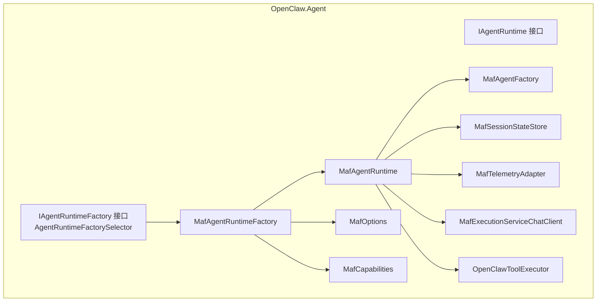
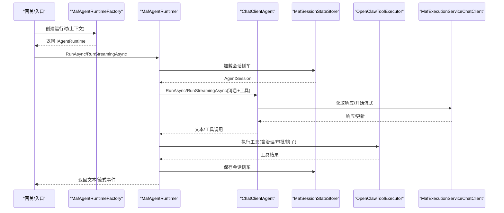
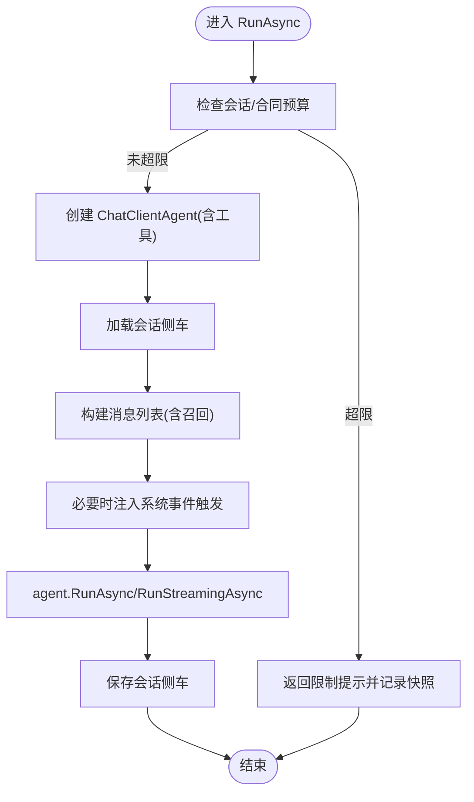
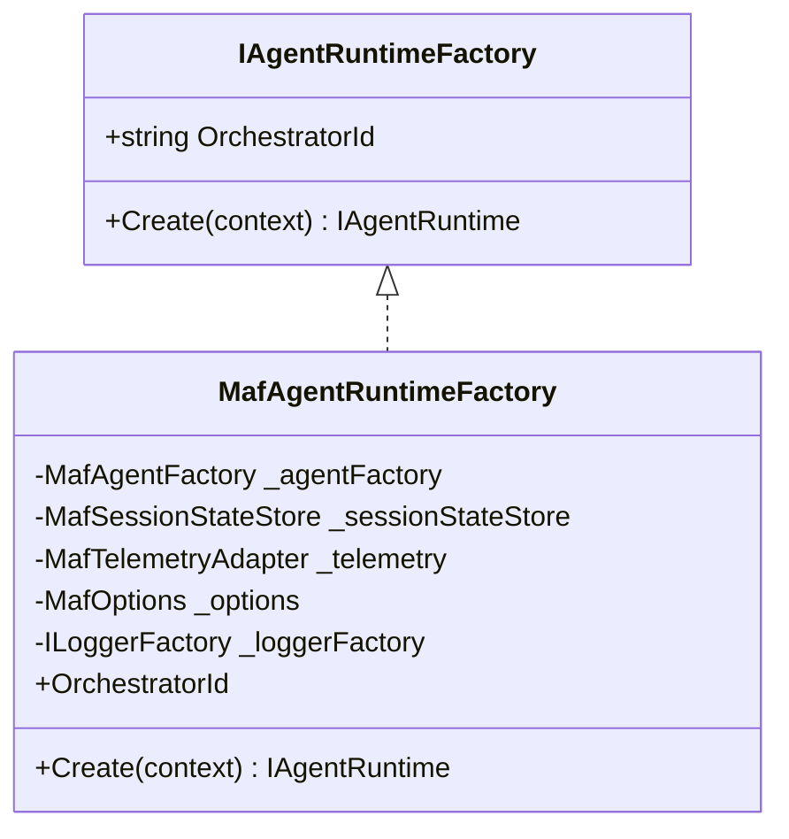
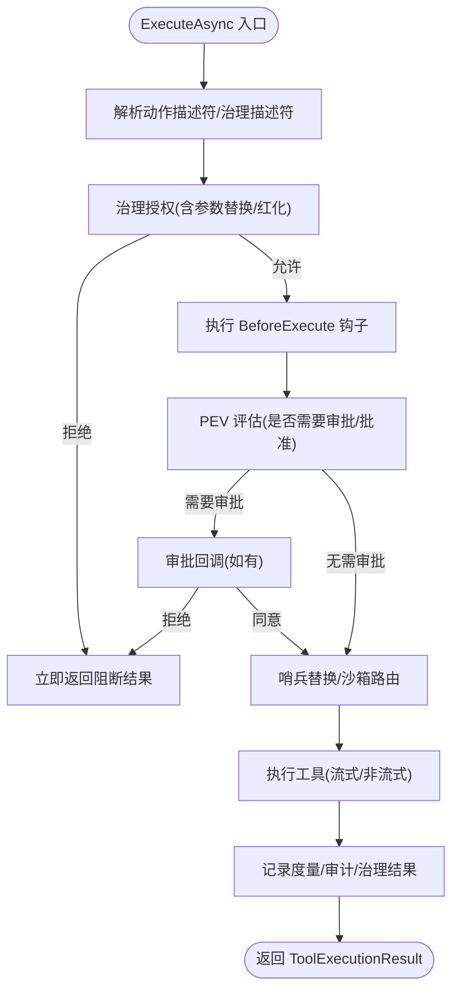
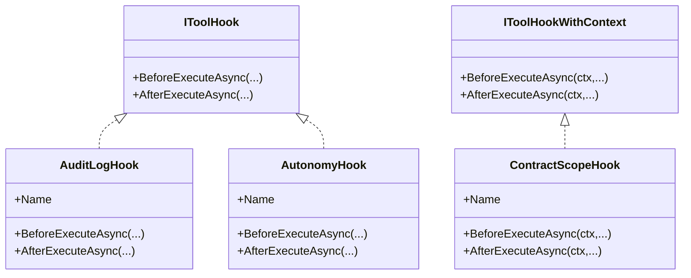
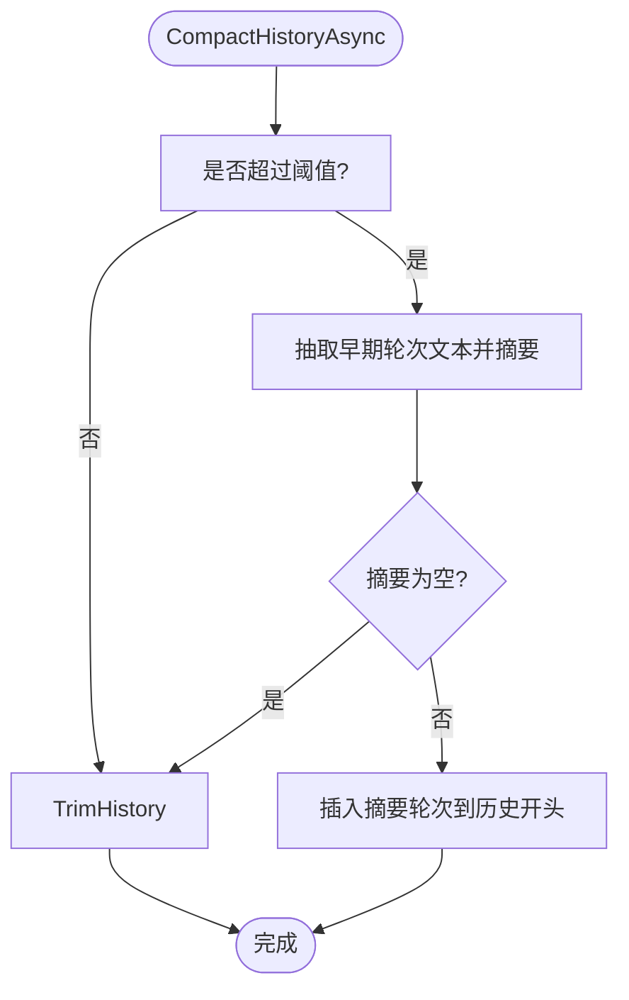
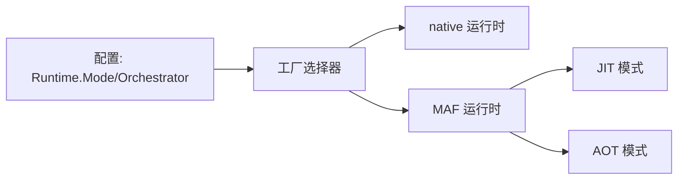
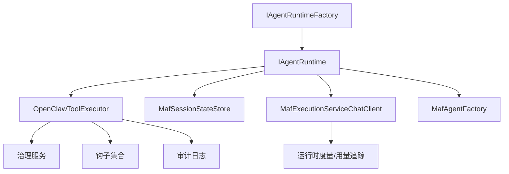

# 代理运行时

<cite>
**本文引用的文件**
- [IAgentRuntime.cs](file://src/OpenClaw.Agent/IAgentRuntime.cs)
- [IAgentRuntimeFactory.cs](file://src/OpenClaw.Agent/IAgentRuntimeFactory.cs)
- [MafAgentRuntime.cs](file://src/OpenClaw.Agent/MafAgentRuntime.cs)
- [MafAgentRuntimeFactory.cs](file://src/OpenClaw.Agent/MafAgentRuntimeFactory.cs)
- [MafAgentFactory.cs](file://src/OpenClaw.Agent/MafAgentFactory.cs)
- [MafSessionStateStore.cs](file://src/OpenClaw.Agent/MafSessionStateStore.cs)
- [MafTelemetryAdapter.cs](file://src/OpenClaw.Agent/MafTelemetryAdapter.cs)
- [MafExecutionServiceChatClient.cs](file://src/OpenClaw.Agent/MafExecutionServiceChatClient.cs)
- [OpenClawToolExecutor.cs](file://src/OpenClaw.Agent/OpenClawToolExecutor.cs)
- [AuditLogHook.cs](file://src/OpenClaw.Agent/AuditLogHook.cs)
- [AutonomyHook.cs](file://src/OpenClaw.Agent/AutonomyHook.cs)
- [ContractScopeHook.cs](file://src/OpenClaw.Agent/ContractScopeHook.cs)
- [MafOptions.cs](file://src/OpenClaw.Agent/MafOptions.cs)
- [MafCapabilities.cs](file://src/OpenClaw.Agent/MafCapabilities.cs)
- [RuntimeModels.cs](file://src/OpenClaw.Core/Models/RuntimeModels.cs)
- [maf-aot-jit-plan.md](file://docs/maf-aot-jit/maf-aot-jit-plan.md)
- [maf-aot-jit-readiness.md](file://docs/maf-aot-jit/maf-aot-jit-readiness.md)
</cite>

## 目录
1. [引言](#引言)
2. [项目结构](#项目结构)
3. [核心组件](#核心组件)
4. [架构总览](#架构总览)
5. [详细组件分析](#详细组件分析)
6. [依赖关系分析](#依赖关系分析)
7. [性能考虑](#性能考虑)
8. [故障排查指南](#故障排查指南)
9. [结论](#结论)
10. [附录](#附录)

## 引言
本文件面向代理运行时系统（Microsoft Agent Framework，简称 MAF）的技术文档，聚焦于 MAF 作为可选编排后端在 OpenClaw 中的实现与集成。内容涵盖：
- 工厂模式与运行时选择机制
- 生命周期管理（会话状态持久化与恢复）
- 推理流程、工具执行协调与会话状态管理
- 配置项、性能调优与内存管理
- AOT 与 JIT 模式下的运行时差异与选择策略
- 扩展点、钩子机制与审计日志
- 实际使用示例与性能优化建议

## 项目结构
MAF 运行时位于 OpenClaw.Agent 子项目中，围绕 IAgentRuntime 抽象与 IAgentRuntimeFactory 工厂接口构建，通过 MafAgentRuntimeFactory 注册并创建 MafAgentRuntime；同时提供 MafAgentFactory、MafSessionStateStore、MafTelemetryAdapter、MafExecutionServiceChatClient 等配套组件。

**图表来源**
- [IAgentRuntime.cs:8-50](file://src/OpenClaw.Agent/IAgentRuntime.cs#L8-L50)
- [IAgentRuntimeFactory.cs:40-65](file://src/OpenClaw.Agent/IAgentRuntimeFactory.cs#L40-L65)
- [MafAgentRuntimeFactory.cs:9-31](file://src/OpenClaw.Agent/MafAgentRuntimeFactory.cs#L9-L31)
- [MafAgentRuntime.cs:17-118](file://src/OpenClaw.Agent/MafAgentRuntime.cs#L17-L118)
- [MafAgentFactory.cs:8-36](file://src/OpenClaw.Agent/MafAgentFactory.cs#L8-L36)
- [MafSessionStateStore.cs:12-34](file://src/OpenClaw.Agent/MafSessionStateStore.cs#L12-L34)
- [MafTelemetryAdapter.cs:7-24](file://src/OpenClaw.Agent/MafTelemetryAdapter.cs#L7-L24)
- [MafExecutionServiceChatClient.cs:10-30](file://src/OpenClaw.Agent/MafExecutionServiceChatClient.cs#L10-L30)
- [OpenClawToolExecutor.cs:30-100](file://src/OpenClaw.Agent/OpenClawToolExecutor.cs#L30-L100)
- [MafOptions.cs:3-35](file://src/OpenClaw.Agent/MafOptions.cs#L3-L35)
- [MafCapabilities.cs:5-16](file://src/OpenClaw.Agent/MafCapabilities.cs#L5-L16)

**章节来源**
- [MafAgentRuntimeFactory.cs:9-31](file://src/OpenClaw.Agent/MafAgentRuntimeFactory.cs#L9-L31)
- [MafAgentRuntime.cs:17-118](file://src/OpenClaw.Agent/MafAgentRuntime.cs#L17-L118)

## 核心组件
- IAgentRuntime：定义代理运行时的核心能力，包括同步/流式推理、技能重载、MCP 工具热替换等。
- IAgentRuntimeFactory：抽象工厂接口，负责根据上下文创建具体运行时实例，并提供工厂选择器。
- MafAgentRuntime：基于 Microsoft Agents AI 的 ChatClientAgent 实现的 MAF 运行时，封装推理、工具执行、会话状态、内存召回与历史压缩等。
- MafAgentRuntimeFactory：MAF 运行时工厂，支持委托运行时以适配不同 LLM 配置与最大历史轮次。
- MafAgentFactory：用于创建 ChatClientAgent 的工厂。
- MafSessionStateStore：会话侧车（sidecar）存储，负责会话状态的序列化/反序列化与版本/历史一致性校验。
- MafTelemetryAdapter：遥测适配器，为运行活动打标签并关联运行模式与会话信息。
- MafExecutionServiceChatClient：桥接 ILlmExecutionService 的 IChatClient 实现，记录用量与提供追踪。
- OpenClawToolExecutor：共享工具执行器，统一处理工具声明、治理授权、审批、钩子、沙箱路由、审计与度量。
- 钩子与审计：AuditLogHook、AutonomyHook、ContractScopeHook 提供审计与安全约束；ToolAuditLog 记录工具调用审计事件。
- 配置：MafOptions 定义 MAF 运行时的名称、描述、会话侧车路径、流式开关、A2A 能力等。

**章节来源**
- [IAgentRuntime.cs:8-50](file://src/OpenClaw.Agent/IAgentRuntime.cs#L8-L50)
- [IAgentRuntimeFactory.cs:40-65](file://src/OpenClaw.Agent/IAgentRuntimeFactory.cs#L40-L65)
- [MafAgentRuntime.cs:17-118](file://src/OpenClaw.Agent/MafAgentRuntime.cs#L17-L118)
- [MafAgentRuntimeFactory.cs:9-31](file://src/OpenClaw.Agent/MafAgentRuntimeFactory.cs#L9-L31)
- [MafAgentFactory.cs:8-36](file://src/OpenClaw.Agent/MafAgentFactory.cs#L8-L36)
- [MafSessionStateStore.cs:12-34](file://src/OpenClaw.Agent/MafSessionStateStore.cs#L12-L34)
- [MafTelemetryAdapter.cs:7-24](file://src/OpenClaw.Agent/MafTelemetryAdapter.cs#L7-L24)
- [MafExecutionServiceChatClient.cs:10-30](file://src/OpenClaw.Agent/MafExecutionServiceChatClient.cs#L10-L30)
- [OpenClawToolExecutor.cs:30-100](file://src/OpenClaw.Agent/OpenClawToolExecutor.cs#L30-L100)
- [AuditLogHook.cs:10-62](file://src/OpenClaw.Agent/AuditLogHook.cs#L10-L62)
- [AutonomyHook.cs:14-82](file://src/OpenClaw.Agent/AutonomyHook.cs#L14-L82)
- [ContractScopeHook.cs:13-32](file://src/OpenClaw.Agent/ContractScopeHook.cs#L13-L32)
- [MafOptions.cs:3-35](file://src/OpenClaw.Agent/MafOptions.cs#L3-L35)

## 架构总览
MAF 运行时通过工厂模式接入 OpenClaw 的运行时选择体系，保持与原生运行时的兼容性与默认行为不变。推理由 ChatClientAgent 驱动，工具执行经由 OpenClawToolExecutor 统一调度，会话状态通过 MafSessionStateStore 侧车持久化，遥测与用量通过 MafTelemetryAdapter 与 MafExecutionServiceChatClient 记录。

**图表来源**
- [MafAgentRuntimeFactory.cs:119-164](file://src/OpenClaw.Agent/MafAgentRuntimeFactory.cs#L119-L164)
- [MafAgentRuntime.cs:203-337](file://src/OpenClaw.Agent/MafAgentRuntime.cs#L203-L337)
- [MafExecutionServiceChatClient.cs:32-65](file://src/OpenClaw.Agent/MafExecutionServiceChatClient.cs#L32-L65)
- [OpenClawToolExecutor.cs:134-162](file://src/OpenClaw.Agent/OpenClawToolExecutor.cs#L134-L162)
- [MafSessionStateStore.cs:36-104](file://src/OpenClaw.Agent/MafSessionStateStore.cs#L36-L104)

## 详细组件分析

### MafAgentRuntime：推理、工具与会话
- 推理流程
  - 同步：构建消息列表、注入记忆召回、必要时追加系统事件触发、进入 agent.RunAsync 并保存会话侧车。
  - 流式：使用有界通道承载 AgentStreamEvent，逐段写入文本增量，完成后标记完成并保存会话侧车。
- 工具执行
  - 通过 OpenClawToolExecutor 统一执行，支持治理授权、审批回调、钩子、沙箱路由、超时与审计。
- 会话状态
  - 使用 MafSessionStateStore 读取/写入 JSON 侧车，包含版本号、会话 ID、历史哈希与状态快照。
- 内存与历史
  - 支持历史压缩（阈值与保留最近轮次）或简单修剪；支持记忆召回注入用户消息相关笔记。
- 预算与合同
  - 支持会话令牌预算与合同级预算/时长检查，必要时提前终止并记录快照。

**图表来源**
- [MafAgentRuntime.cs:203-337](file://src/OpenClaw.Agent/MafAgentRuntime.cs#L203-L337)
- [MafAgentRuntime.cs:339-423](file://src/OpenClaw.Agent/MafAgentRuntime.cs#L339-L423)
- [MafSessionStateStore.cs:36-104](file://src/OpenClaw.Agent/MafSessionStateStore.cs#L36-L104)
- [MafAgentRuntime.cs:625-682](file://src/OpenClaw.Agent/MafAgentRuntime.cs#L625-L682)

**章节来源**
- [MafAgentRuntime.cs:17-118](file://src/OpenClaw.Agent/MafAgentRuntime.cs#L17-L118)
- [MafAgentRuntime.cs:203-337](file://src/OpenClaw.Agent/MafAgentRuntime.cs#L203-L337)
- [MafAgentRuntime.cs:339-423](file://src/OpenClaw.Agent/MafAgentRuntime.cs#L339-L423)
- [MafAgentRuntime.cs:625-682](file://src/OpenClaw.Agent/MafAgentRuntime.cs#L625-L682)

### MafAgentRuntimeFactory：工厂模式与委托运行时
- OrchestratorId 固定为 MAF。
- Create：确保能力支持后创建 MafAgentRuntime；若启用委托，则注入 DelegateTool 并创建“委托运行时”。
- CreateDelegatedRuntime：按传入的 LLM 配置与最大历史轮次生成新的 GatewayConfig，并创建运行时。

**图表来源**
- [IAgentRuntimeFactory.cs:40-45](file://src/OpenClaw.Agent/IAgentRuntimeFactory.cs#L40-L45)
- [MafAgentRuntimeFactory.cs:9-31](file://src/OpenClaw.Agent/MafAgentRuntimeFactory.cs#L9-L31)

**章节来源**
- [MafAgentRuntimeFactory.cs:119-164](file://src/OpenClaw.Agent/MafAgentRuntimeFactory.cs#L119-L164)

### OpenClawToolExecutor：工具执行协调
- 工具声明与过滤：按会话预设与路由限制筛选可用工具。
- 治理授权：解析动作描述符，结合治理服务进行授权决策与参数替换/红化。
- 审批与钩子：支持审批回调、前后钩子（含上下文），以及计划-执行-验证（PEV）评估。
- 执行路由：支持流式工具收集与非流式工具路由，统一超时、失败分类与度量记录。
- 审计与度量：记录工具调用耗时、失败码、治理结果与审计条目。

**图表来源**
- [OpenClawToolExecutor.cs:134-162](file://src/OpenClaw.Agent/OpenClawToolExecutor.cs#L134-L162)
- [OpenClawToolExecutor.cs:388-433](file://src/OpenClaw.Agent/OpenClawToolExecutor.cs#L388-L433)
- [OpenClawToolExecutor.cs:556-577](file://src/OpenClaw.Agent/OpenClawToolExecutor.cs#L556-L577)

**章节来源**
- [OpenClawToolExecutor.cs:30-100](file://src/OpenClaw.Agent/OpenClawToolExecutor.cs#L30-L100)
- [OpenClawToolExecutor.cs:134-162](file://src/OpenClaw.Agent/OpenClawToolExecutor.cs#L134-L162)
- [OpenClawToolExecutor.cs:388-433](file://src/OpenClaw.Agent/OpenClawToolExecutor.cs#L388-L433)
- [OpenClawToolExecutor.cs:556-577](file://src/OpenClaw.Agent/OpenClawToolExecutor.cs#L556-L577)

### 钩子机制与审计日志
- AuditLogHook：始终放行，仅记录工具调用前后的审计信息。
- AutonomyHook：基于自治模式、工作区限制、路径/命令白黑名单实施硬性拒绝层。
- ContractScopeHook：按合同范围限制工具调用次数、路径访问与特定工具（如 shell/code_exec）的授予。

**图表来源**
- [AuditLogHook.cs:10-62](file://src/OpenClaw.Agent/AuditLogHook.cs#L10-L62)
- [AutonomyHook.cs:14-82](file://src/OpenClaw.Agent/AutonomyHook.cs#L14-L82)
- [ContractScopeHook.cs:13-32](file://src/OpenClaw.Agent/ContractScopeHook.cs#L13-L32)

**章节来源**
- [AuditLogHook.cs:10-62](file://src/OpenClaw.Agent/AuditLogHook.cs#L10-L62)
- [AutonomyHook.cs:14-82](file://src/OpenClaw.Agent/AutonomyHook.cs#L14-L82)
- [ContractScopeHook.cs:13-32](file://src/OpenClaw.Agent/ContractScopeHook.cs#L13-L32)

### 会话状态管理与历史压缩
- 侧车存储：SHA256 历史哈希校验、版本号匹配、会话 ID 对齐，不一致则重新创建会话。
- 历史压缩：当超过阈值且保留最近轮次时，对早期对话进行摘要总结并移除中间轮次，减少上下文开销。
- 简单修剪：未启用压缩时按最大历史轮次直接裁剪。

**图表来源**
- [MafAgentRuntime.cs:684-764](file://src/OpenClaw.Agent/MafAgentRuntime.cs#L684-L764)

**章节来源**
- [MafSessionStateStore.cs:36-104](file://src/OpenClaw.Agent/MafSessionStateStore.cs#L36-L104)
- [MafAgentRuntime.cs:684-764](file://src/OpenClaw.Agent/MafAgentRuntime.cs#L684-L764)

### 配置选项与运行时模式
- MafOptions：代理名称/描述、会话侧车路径、流式开关、A2A 开关与路径前缀等。
- 运行时选择：通过配置中的 Runtime.Mode 与 Runtime.Orchestrator 控制；MAF 仅在 MAF-enabled 构件中可用。
- 模式支持：MAF 支持 JIT 与 AOT（在 MAF-enabled 构件中）。

**图表来源**
- [MafOptions.cs:3-35](file://src/OpenClaw.Agent/MafOptions.cs#L3-L35)
- [MafCapabilities.cs:5-16](file://src/OpenClaw.Agent/MafCapabilities.cs#L5-L16)
- [RuntimeModels.cs:42-59](file://src/OpenClaw.Core/Models/RuntimeModels.cs#L42-L59)
- [maf-aot-jit-plan.md:78-99](file://docs/maf-aot-jit/maf-aot-jit-plan.md#L78-L99)

**章节来源**
- [MafOptions.cs:3-35](file://src/OpenClaw.Agent/MafOptions.cs#L3-L35)
- [MafCapabilities.cs:5-16](file://src/OpenClaw.Agent/MafCapabilities.cs#L5-L16)
- [RuntimeModels.cs:42-59](file://src/OpenClaw.Core/Models/RuntimeModels.cs#L42-L59)
- [maf-aot-jit-plan.md:78-99](file://docs/maf-aot-jit/maf-aot-jit-plan.md#L78-L99)
- [maf-aot-jit-readiness.md:31-46](file://docs/maf-aot-jit/maf-aot-jit-readiness.md#L31-L46)

## 依赖关系分析
- 松耦合：IAgentRuntimeFactory 与 IAgentRuntime 解耦，MAF 作为可插拔后端存在。
- 工具执行共享：OpenClawToolExecutor 将治理、审批、钩子、沙箱与审计集中在一个执行器中，降低重复实现。
- 会话状态独立：MafSessionStateStore 与 ChatClientAgent 解耦，便于替换与测试。
- 遥测与用量：MafExecutionServiceChatClient 通过 ILlmExecutionService 记录用量与提供者信息，避免直接耦合具体 SDK。

**图表来源**
- [IAgentRuntimeFactory.cs:40-45](file://src/OpenClaw.Agent/IAgentRuntimeFactory.cs#L40-L45)
- [MafAgentRuntime.cs:17-118](file://src/OpenClaw.Agent/MafAgentRuntime.cs#L17-L118)
- [OpenClawToolExecutor.cs:30-100](file://src/OpenClaw.Agent/OpenClawToolExecutor.cs#L30-L100)
- [MafExecutionServiceChatClient.cs:10-30](file://src/OpenClaw.Agent/MafExecutionServiceChatClient.cs#L10-L30)

**章节来源**
- [IAgentRuntimeFactory.cs:40-45](file://src/OpenClaw.Agent/IAgentRuntimeFactory.cs#L40-L45)
- [MafAgentRuntime.cs:17-118](file://src/OpenClaw.Agent/MafAgentRuntime.cs#L17-L118)
- [OpenClawToolExecutor.cs:30-100](file://src/OpenClaw.Agent/OpenClawToolExecutor.cs#L30-L100)

## 性能考虑
- 历史压缩：在长对话场景下显著降低上下文长度，建议合理设置阈值与保留轮次。
- 流式输出：启用流式可提升感知延迟，但需注意通道背压与错误传播。
- 工具超时：统一的工具超时配置可避免长时间阻塞，建议按工具类型与资源占用调整。
- 记忆召回：限制召回条数与字符上限，避免大段外部数据污染系统提示。
- 用量与缓存：通过 MafExecutionServiceChatClient 记录输入/输出 token 与缓存读写，辅助成本控制与性能优化。

[本节为通用指导，无需列出具体文件来源]

## 故障排查指南
- 工具执行失败
  - 检查治理授权与参数替换是否生效；查看审计日志与治理结果记录。
  - 关注超时与沙箱异常，确认工具超时秒数与沙箱策略。
- 会话侧车问题
  - 版本不匹配、历史哈希不一致或会话 ID 不符会导致丢弃并重建会话。
- 流式异常
  - 捕获模型选择异常与提供者失败，确保通道正确完成与错误事件写出。
- 预算与合同
  - 会话令牌预算与合同预算超限会提前终止并记录快照，检查配置与使用情况。

**章节来源**
- [OpenClawToolExecutor.cs:483-530](file://src/OpenClaw.Agent/OpenClawToolExecutor.cs#L483-L530)
- [MafSessionStateStore.cs:36-104](file://src/OpenClaw.Agent/MafSessionStateStore.cs#L36-L104)
- [MafAgentRuntime.cs:320-336](file://src/OpenClaw.Agent/MafAgentRuntime.cs#L320-L336)
- [MafAgentRuntime.cs:524-561](file://src/OpenClaw.Agent/MafAgentRuntime.cs#L524-L561)

## 结论
MAF 作为可选编排后端在 OpenClaw 中实现了清晰的边界与可插拔性：推理由 ChatClientAgent 承担，工具执行通过共享执行器统一治理与审计，会话状态以侧车形式持久化，遥测与用量由执行服务记录。该设计在 JIT 与 AOT 下均具备可行性，并与原生运行时保持一致的默认行为与兼容性。建议在需要更丰富的框架集成或特定推理能力时采用 MAF 后端，并结合配置与钩子机制实现安全与可观测性。

[本节为总结性内容，无需列出具体文件来源]

## 附录

### 实际使用示例（步骤说明）
- 选择运行时
  - 在配置中设置 Runtime.Orchestrator 为 maf，并确保使用 MAF-enabled 构件。
- 启动流程
  - 网关启动时通过工厂选择器选择 MafAgentRuntimeFactory，创建 MafAgentRuntime。
- 推理调用
  - 调用 RunAsync 或 RunStreamingAsync，传入 Session、用户消息与可选审批回调。
- 工具调用
  - 工具执行经由 OpenClawToolExecutor，自动应用治理、审批、钩子与审计。
- 会话恢复
  - 通过 MafSessionStateStore 自动加载/保存会话侧车，支持重启恢复。

**章节来源**
- [MafAgentRuntimeFactory.cs:119-164](file://src/OpenClaw.Agent/MafAgentRuntimeFactory.cs#L119-L164)
- [MafAgentRuntime.cs:203-337](file://src/OpenClaw.Agent/MafAgentRuntime.cs#L203-L337)
- [OpenClawToolExecutor.cs:134-162](file://src/OpenClaw.Agent/OpenClawToolExecutor.cs#L134-L162)
- [MafSessionStateStore.cs:36-104](file://src/OpenClaw.Agent/MafSessionStateStore.cs#L36-L104)

### 性能优化建议
- 合理设置 Memory.EnableCompaction、CompactionThreshold 与 CompactionKeepRecent，平衡上下文长度与摘要质量。
- 为高风险工具设置 RequireToolApproval 与审批回调，降低失败成本。
- 使用 Tooling.ToolTimeoutSeconds 与 Tooling.ApprovalRequiredTools 策略控制工具执行时间与权限。
- 启用 Prompt Caching 并监控缓存读写，降低重复输入 token 成本。

[本节为通用指导，无需列出具体文件来源]