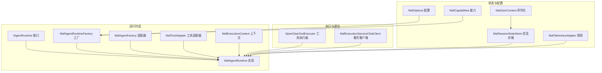
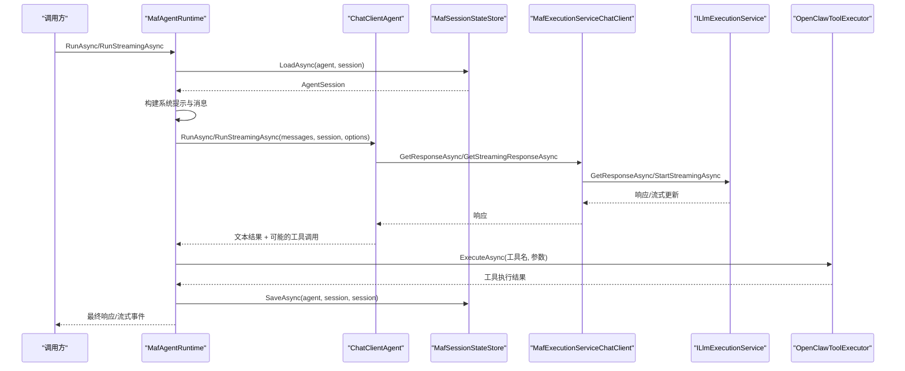
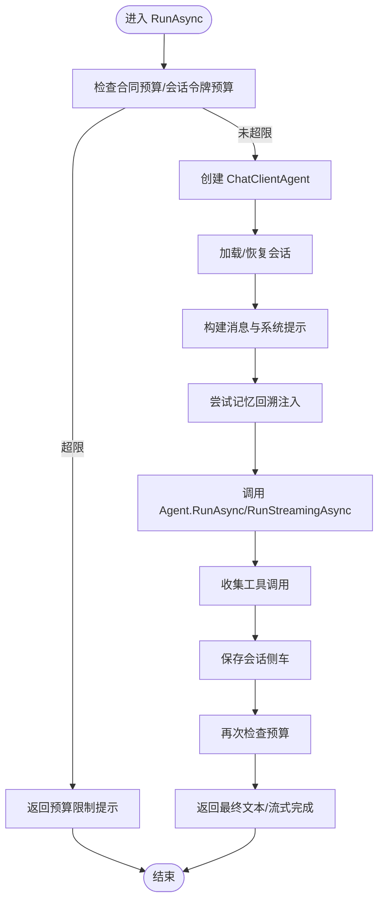
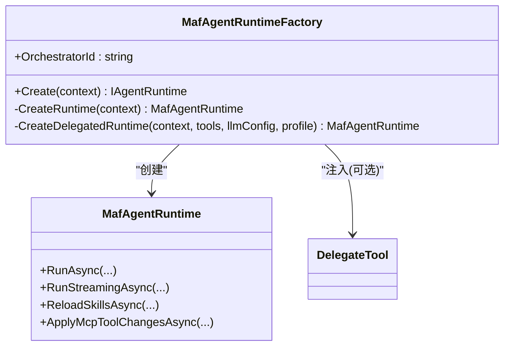
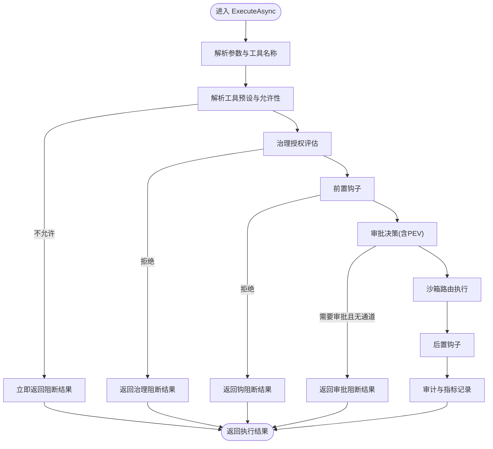
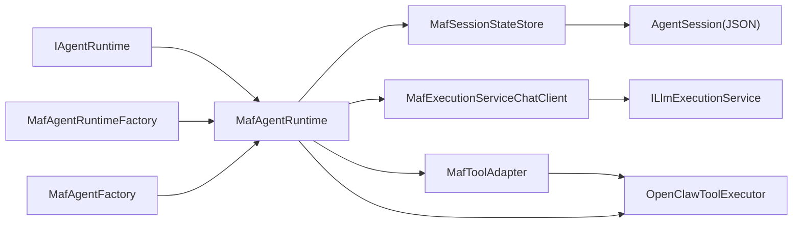

# 代理运行时

<cite>
**本文引用的文件**
- [MafAgentRuntime.cs](file://src/OpenClaw.Agent/MafAgentRuntime.cs)
- [MafAgentRuntimeFactory.cs](file://src/OpenClaw.Agent/MafAgentRuntimeFactory.cs)
- [MafOptions.cs](file://src/OpenClaw.Agent/MafOptions.cs)
- [MafExecutionContext.cs](file://src/OpenClaw.Agent/MafExecutionContext.cs)
- [IAgentRuntime.cs](file://src/OpenClaw.Agent/IAgentRuntime.cs)
- [MafAgentFactory.cs](file://src/OpenClaw.Agent/MafAgentFactory.cs)
- [MafSessionStateStore.cs](file://src/OpenClaw.Agent/MafSessionStateStore.cs)
- [MafTelemetryAdapter.cs](file://src/OpenClaw.Agent/MafTelemetryAdapter.cs)
- [MafToolAdapter.cs](file://src/OpenClaw.Agent/MafToolAdapter.cs)
- [OpenClawToolExecutor.cs](file://src/OpenClaw.Agent/OpenClawToolExecutor.cs)
- [MafCapabilities.cs](file://src/OpenClaw.Agent/MafCapabilities.cs)
- [MafExecutionServiceChatClient.cs](file://src/OpenClaw.Agent/MafExecutionServiceChatClient.cs)
- [MafJsonContext.cs](file://src/OpenClaw.Agent/MafJsonContext.cs)
</cite>

## 目录
1. [简介](#简介)
2. [项目结构](#项目结构)
3. [核心组件](#核心组件)
4. [架构总览](#架构总览)
5. [详细组件分析](#详细组件分析)
6. [依赖关系分析](#依赖关系分析)
7. [性能考量](#性能考量)
8. [故障排查指南](#故障排查指南)
9. [结论](#结论)
10. [附录](#附录)

## 简介
本文件为代理运行时系统的技术文档，聚焦于基于 Microsoft Agent Framework（MAF）的运行时实现。内容涵盖代理生命周期管理、会话处理、工具执行框架、内存交互机制、MAF 集成、原生运行时选择（AOT/JIT）、两种运行时模式差异、代理推理与决策机制、上下文管理、工具注册与调用流程、错误处理策略、配置项、性能调优与调试技巧，以及与网关服务、工具系统、记忆存储的协作关系。

## 项目结构
代理运行时位于 OpenClaw.Agent 工程中，围绕 IAgentRuntime 接口与 MafAgentRuntime 实现展开，并通过工厂、适配器、执行器、会话状态存储等模块协同工作。核心文件包括：
- 运行时接口与实现：IAgentRuntime、MafAgentRuntime
- 工厂与适配器：MafAgentRuntimeFactory、MafAgentFactory、MafToolAdapter
- 执行与聊天客户端：OpenClawToolExecutor、MafExecutionServiceChatClient
- 会话状态：MafSessionStateStore、MafExecutionContext
- 配置与能力：MafOptions、MafCapabilities
- 观测性：MafTelemetryAdapter、MafJsonContext

**图表来源**
- [MafAgentRuntime.cs:17-118](file://src/OpenClaw.Agent/MafAgentRuntime.cs#L17-L118)
- [MafAgentRuntimeFactory.cs:9-40](file://src/OpenClaw.Agent/MafAgentRuntimeFactory.cs#L9-L40)
- [MafAgentFactory.cs:8-36](file://src/OpenClaw.Agent/MafAgentFactory.cs#L8-L36)
- [MafToolAdapter.cs:9-62](file://src/OpenClaw.Agent/MafToolAdapter.cs#L9-L62)
- [OpenClawToolExecutor.cs:30-100](file://src/OpenClaw.Agent/OpenClawToolExecutor.cs#L30-L100)
- [MafExecutionServiceChatClient.cs:10-30](file://src/OpenClaw.Agent/MafExecutionServiceChatClient.cs#L10-L30)
- [MafSessionStateStore.cs:12-34](file://src/OpenClaw.Agent/MafSessionStateStore.cs#L12-L34)
- [MafOptions.cs:3-35](file://src/OpenClaw.Agent/MafOptions.cs#L3-L35)
- [MafCapabilities.cs:5-16](file://src/OpenClaw.Agent/MafCapabilities.cs#L5-L16)
- [MafTelemetryAdapter.cs:7-24](file://src/OpenClaw.Agent/MafTelemetryAdapter.cs#L7-L24)
- [MafJsonContext.cs:7-21](file://src/OpenClaw.Agent/MafJsonContext.cs#L7-L21)

**章节来源**
- [MafAgentRuntime.cs:17-118](file://src/OpenClaw.Agent/MafAgentRuntime.cs#L17-L118)
- [MafAgentRuntimeFactory.cs:9-40](file://src/OpenClaw.Agent/MafAgentRuntimeFactory.cs#L9-L40)
- [MafOptions.cs:3-35](file://src/OpenClaw.Agent/MafOptions.cs#L3-L35)

## 核心组件
- IAgentRuntime：定义代理运行时的核心能力，包括同步/流式对话、技能重载、工具热替换等。
- MafAgentRuntime：MAF 运行时实现，负责构建系统提示、消息编排、会话加载/保存、工具调用、流式事件产出、预算与合同控制。
- MafAgentRuntimeFactory：根据运行时状态与配置创建运行时实例，支持委托运行时与工具注入。
- MafAgentFactory：封装 ChatClientAgent 的创建，注入工具与描述信息。
- OpenClawToolExecutor：统一的工具执行器，负责工具授权、审批、沙箱路由、超时与错误处理、审计与指标记录。
- MafExecutionServiceChatClient：将 MAF 调用桥接到 ILlmExecutionService，记录用量与观测数据。
- MafSessionStateStore：会话侧车文件的持久化与恢复，含历史哈希校验与版本兼容。
- MafExecutionContext：线程本地的执行上下文，贯穿一次推理与工具调用链路。
- MafToolAdapter：将 ITool 包装为 AITool，桥接 MAF 工具调用与 OpenClawToolExecutor。
- MafOptions：MAF 运行时配置，如流式开关、A2A 开关与路径、会话侧车路径等。
- MafCapabilities：声明运行时能力与 AOT/JIT 支持性。
- MafTelemetryAdapter：启动运行活动并打标签，便于分布式追踪。
- MafJsonContext：会话侧车序列化上下文。

**章节来源**
- [IAgentRuntime.cs:8-50](file://src/OpenClaw.Agent/IAgentRuntime.cs#L8-L50)
- [MafAgentRuntime.cs:17-118](file://src/OpenClaw.Agent/MafAgentRuntime.cs#L17-L118)
- [MafAgentRuntimeFactory.cs:9-40](file://src/OpenClaw.Agent/MafAgentRuntimeFactory.cs#L9-L40)
- [MafAgentFactory.cs:8-36](file://src/OpenClaw.Agent/MafAgentFactory.cs#L8-L36)
- [OpenClawToolExecutor.cs:30-100](file://src/OpenClaw.Agent/OpenClawToolExecutor.cs#L30-L100)
- [MafExecutionServiceChatClient.cs:10-30](file://src/OpenClaw.Agent/MafExecutionServiceChatClient.cs#L10-L30)
- [MafSessionStateStore.cs:12-34](file://src/OpenClaw.Agent/MafSessionStateStore.cs#L12-L34)
- [MafExecutionContext.cs:6-45](file://src/OpenClaw.Agent/MafExecutionContext.cs#L6-L45)
- [MafToolAdapter.cs:9-62](file://src/OpenClaw.Agent/MafToolAdapter.cs#L9-L62)
- [MafOptions.cs:3-35](file://src/OpenClaw.Agent/MafOptions.cs#L3-L35)
- [MafCapabilities.cs:5-16](file://src/OpenClaw.Agent/MafCapabilities.cs#L5-L16)
- [MafTelemetryAdapter.cs:7-24](file://src/OpenClaw.Agent/MafTelemetryAdapter.cs#L7-L24)
- [MafJsonContext.cs:7-21](file://src/OpenClaw.Agent/MafJsonContext.cs#L7-L21)

## 架构总览
MAF 运行时以 MafAgentRuntime 为核心，围绕以下主线工作：
- 生命周期：创建 ChatClientAgent → 加载/恢复会话 → 构建消息与系统提示 → 推理生成文本 → 记录工具调用 → 保存会话 → 合同与预算检查。
- 工具执行：MafToolAdapter 将工具调用转交 OpenClawToolExecutor，后者完成治理、审批、沙箱路由、超时与错误处理、审计与指标。
- 会话管理：MafSessionStateStore 基于历史哈希与版本号安全恢复或创建新会话，确保跨进程/重启一致性。
- 观测与度量：MafTelemetryAdapter 与 MafExecutionServiceChatClient 记录提供商、模型、用量、缓存命中等指标。

**图表来源**
- [MafAgentRuntime.cs:203-337](file://src/OpenClaw.Agent/MafAgentRuntime.cs#L203-L337)
- [MafAgentRuntime.cs:339-423](file://src/OpenClaw.Agent/MafAgentRuntime.cs#L339-L423)
- [MafSessionStateStore.cs:36-104](file://src/OpenClaw.Agent/MafSessionStateStore.cs#L36-L104)
- [MafExecutionServiceChatClient.cs:32-65](file://src/OpenClaw.Agent/MafExecutionServiceChatClient.cs#L32-L65)
- [OpenClawToolExecutor.cs:134-630](file://src/OpenClaw.Agent/OpenClawToolExecutor.cs#L134-L630)

## 详细组件分析

### MafAgentRuntime：推理与会话主控
- 职责
  - 构建系统提示（含技能片段与动态后缀）
  - 编排消息列表（含图像标记处理、数据 URI 处理）
  - 历史压缩与回溯注入（记忆检索）
  - 同步与流式推理
  - 工具调用收集与会话保存
  - 合同预算与会话令牌预算检查
- 关键流程
  - RunAsync/RunStreamingAsync：入口方法，设置 TurnContext 与 MafExecutionContext，调用 Agent.Run*，在工具调用后写入会话历史，保存会话侧车。
  - TryInjectRecallAsync：从记忆存储检索相关笔记并插入用户消息，支持项目前缀过滤与字符上限。
  - CompactHistoryAsync/TrimHistory：当启用压缩时，对早期对话进行摘要并保留最近若干轮。
  - CreateChatOptions：按会话覆盖参数构造 ChatOptions，支持 JSON Schema 响应格式与推理强度附加属性。
- 错误处理
  - 捕获模型选择异常与通用异常，记录 LLM 错误计数，返回友好提示。
  - 流式模式下捕获模型选择失败与提供方异常，发送错误事件并完成流。

**图表来源**
- [MafAgentRuntime.cs:203-337](file://src/OpenClaw.Agent/MafAgentRuntime.cs#L203-L337)
- [MafAgentRuntime.cs:339-423](file://src/OpenClaw.Agent/MafAgentRuntime.cs#L339-L423)
- [MafAgentRuntime.cs:625-682](file://src/OpenClaw.Agent/MafAgentRuntime.cs#L625-L682)
- [MafAgentRuntime.cs:684-764](file://src/OpenClaw.Agent/MafAgentRuntime.cs#L684-L764)

**章节来源**
- [MafAgentRuntime.cs:17-118](file://src/OpenClaw.Agent/MafAgentRuntime.cs#L17-L118)
- [MafAgentRuntime.cs:203-337](file://src/OpenClaw.Agent/MafAgentRuntime.cs#L203-L337)
- [MafAgentRuntime.cs:339-423](file://src/OpenClaw.Agent/MafAgentRuntime.cs#L339-L423)
- [MafAgentRuntime.cs:625-682](file://src/OpenClaw.Agent/MafAgentRuntime.cs#L625-L682)
- [MafAgentRuntime.cs:684-764](file://src/OpenClaw.Agent/MafAgentRuntime.cs#L684-L764)

### MafAgentRuntimeFactory：运行时创建与委托
- 职责
  - 校验运行时能力（AOT/JIT 支持）
  - 在启用委托时注入 DelegateTool 并创建委托运行时
  - 复制/改写配置（LLM、记忆、历史轮次等）
- 关键点
  - EnsureSupported：确保运行时模式受支持
  - CreateDelegatedRuntime：按代理配置与最大历史轮次生成新的 GatewayConfig
  - 注入 DelegateTool：使代理具备跨运行时委派能力

**图表来源**
- [MafAgentRuntimeFactory.cs:9-40](file://src/OpenClaw.Agent/MafAgentRuntimeFactory.cs#L9-L40)
- [MafAgentRuntimeFactory.cs:119-164](file://src/OpenClaw.Agent/MafAgentRuntimeFactory.cs#L119-L164)

**章节来源**
- [MafAgentRuntimeFactory.cs:9-40](file://src/OpenClaw.Agent/MafAgentRuntimeFactory.cs#L9-L40)
- [MafAgentRuntimeFactory.cs:119-164](file://src/OpenClaw.Agent/MafAgentRuntimeFactory.cs#L119-L164)

### OpenClawToolExecutor：工具执行框架
- 职责
  - 工具授权与治理：基于工具动作描述符与治理策略评估
  - 审批流程：支持预设/默认策略与用户回调
  - 沙箱路由：根据工具类型与配置选择执行后端
  - 超时与错误处理：统一分类失败码与下一步建议
  - 审计与指标：记录调用耗时、字节数、治理结果与可用性
  - 流式工具：支持增量回调
- 关键流程
  - ExecuteAsync：解析参数、授权、审批、沙箱执行、钩子前后置、审计与指标
  - ReplaceMcpTools：原子替换 MCP 工具声明，支持热重载
  - 支持 IStreamingTool 的增量收集

**图表来源**
- [OpenClawToolExecutor.cs:134-630](file://src/OpenClaw.Agent/OpenClawToolExecutor.cs#L134-L630)

**章节来源**
- [OpenClawToolExecutor.cs:30-100](file://src/OpenClaw.Agent/OpenClawToolExecutor.cs#L30-L100)
- [OpenClawToolExecutor.cs:134-630](file://src/OpenClaw.Agent/OpenClawToolExecutor.cs#L134-L630)

### MafExecutionServiceChatClient：LLM 执行桥接
- 职责
  - 将 MAF 的 ChatClient 调用桥接至 ILlmExecutionService
  - 记录输入/输出 token、缓存使用、提供商与模型标签
  - 提供流式与非流式两种路径
- 关键点
  - 使用 MafExecutionContext 获取技能提示长度估算
  - 统一记录用量与观测数据到 TurnContext 与 RuntimeMetrics

**章节来源**
- [MafExecutionServiceChatClient.cs:10-30](file://src/OpenClaw.Agent/MafExecutionServiceChatClient.cs#L10-L30)
- [MafExecutionServiceChatClient.cs:32-65](file://src/OpenClaw.Agent/MafExecutionServiceChatClient.cs#L32-L65)
- [MafExecutionServiceChatClient.cs:67-125](file://src/OpenClaw.Agent/MafExecutionServiceChatClient.cs#L67-L125)
- [MafExecutionServiceChatClient.cs:134-186](file://src/OpenClaw.Agent/MafExecutionServiceChatClient.cs#L134-L186)

### MafSessionStateStore：会话状态持久化
- 职责
  - 会话侧车文件的加载与保存
  - 历史哈希校验与版本兼容
  - 兼容旧路径迁移
- 关键点
  - LoadAsync：校验版本、会话 ID、历史哈希、包版本，不满足则重新创建
  - SaveAsync：序列化 AgentSession 至 JSON，原子写入
  - ComputeHistoryHash：对历史、模型覆盖、系统提示覆盖、路由预设与允许工具集进行哈希

**章节来源**
- [MafSessionStateStore.cs:12-34](file://src/OpenClaw.Agent/MafSessionStateStore.cs#L12-L34)
- [MafSessionStateStore.cs:36-104](file://src/OpenClaw.Agent/MafSessionStateStore.cs#L36-L104)
- [MafSessionStateStore.cs:107-144](file://src/OpenClaw.Agent/MafSessionStateStore.cs#L107-L144)
- [MafSessionStateStore.cs:184-195](file://src/OpenClaw.Agent/MafSessionStateStore.cs#L184-L195)

### MafExecutionContext：执行上下文
- 职责
  - 通过 AsyncLocal 传递当前推理上下文
  - 提供工具调用收集、流式事件写入、会话与预算信息
- 关键点
  - Push/RestoreScope：进入/退出作用域
  - TryGetCurrent：在不确定上下文场景下的安全访问

**章节来源**
- [MafExecutionContext.cs:6-45](file://src/OpenClaw.Agent/MafExecutionContext.cs#L6-L45)

### MafToolAdapter：工具适配器
- 职责
  - 将 ITool 包装为 AITool，暴露名称、描述与参数 JSON Schema
  - 在调用时桥接 MafExecutionContext，触发流式事件、调用 OpenClawToolExecutor、记录工具调用
- 关键点
  - InvokeCoreAsync：序列化参数、写入 ToolStarted/ToolDelta/ToolCompleted 流事件、收集 ToolInvocation

**章节来源**
- [MafToolAdapter.cs:9-62](file://src/OpenClaw.Agent/MafToolAdapter.cs#L9-L62)

### MafOptions 与 MafCapabilities：配置与能力
- MafOptions：流式开关、A2A 开关与路径、会话侧车路径等
- MafCapabilities：声明 OrchestratorId 与 AOT/JIT 支持性

**章节来源**
- [MafOptions.cs:3-35](file://src/OpenClaw.Agent/MafOptions.cs#L3-L35)
- [MafCapabilities.cs:5-16](file://src/OpenClaw.Agent/MafCapabilities.cs#L5-L16)

### MafTelemetryAdapter：观测与追踪
- 职责
  - 启动运行活动并打标签（运行时模式、会话/渠道 ID、提供商/模型）

**章节来源**
- [MafTelemetryAdapter.cs:7-24](file://src/OpenClaw.Agent/MafTelemetryAdapter.cs#L7-L24)

### MafJsonContext：序列化上下文
- 职责
  - 会话侧车与 A2A 卡片的 JSON 序列化支持

**章节来源**
- [MafJsonContext.cs:7-21](file://src/OpenClaw.Agent/MafJsonContext.cs#L7-L21)

## 依赖关系分析
- 运行时依赖
  - IAgentRuntime → MafAgentRuntime
  - MafAgentRuntimeFactory → MafAgentRuntime
  - MafAgentFactory → ChatClientAgent
  - MafToolAdapter → OpenClawToolExecutor
  - MafExecutionServiceChatClient → ILlmExecutionService
  - MafSessionStateStore ↔ AgentSession(JSON)
- 内聚与耦合
  - MafAgentRuntime 对工具、会话、聊天客户端、记忆、指标、治理有强依赖，但通过适配器与执行器解耦具体实现
  - OpenClawToolExecutor 作为工具执行中枢，集中处理治理、审批、沙箱与审计，内聚度高
- 外部依赖
  - Microsoft.Agents.AI、Microsoft.Extensions.AI、Microsoft.Extensions.Logging
  - JSON 序列化上下文（MafJsonContext）

**图表来源**
- [MafAgentRuntime.cs:17-118](file://src/OpenClaw.Agent/MafAgentRuntime.cs#L17-L118)
- [MafAgentRuntimeFactory.cs:9-40](file://src/OpenClaw.Agent/MafAgentRuntimeFactory.cs#L9-L40)
- [MafAgentFactory.cs:8-36](file://src/OpenClaw.Agent/MafAgentFactory.cs#L8-L36)
- [MafToolAdapter.cs:9-62](file://src/OpenClaw.Agent/MafToolAdapter.cs#L9-L62)
- [OpenClawToolExecutor.cs:30-100](file://src/OpenClaw.Agent/OpenClawToolExecutor.cs#L30-L100)
- [MafExecutionServiceChatClient.cs:10-30](file://src/OpenClaw.Agent/MafExecutionServiceChatClient.cs#L10-L30)
- [MafSessionStateStore.cs:12-34](file://src/OpenClaw.Agent/MafSessionStateStore.cs#L12-L34)

**章节来源**
- [MafAgentRuntime.cs:17-118](file://src/OpenClaw.Agent/MafAgentRuntime.cs#L17-L118)
- [MafAgentRuntimeFactory.cs:9-40](file://src/OpenClaw.Agent/MafAgentRuntimeFactory.cs#L9-L40)
- [MafToolAdapter.cs:9-62](file://src/OpenClaw.Agent/MafToolAdapter.cs#L9-L62)
- [OpenClawToolExecutor.cs:30-100](file://src/OpenClaw.Agent/OpenClawToolExecutor.cs#L30-L100)
- [MafExecutionServiceChatClient.cs:10-30](file://src/OpenClaw.Agent/MafExecutionServiceChatClient.cs#L10-L30)
- [MafSessionStateStore.cs:12-34](file://src/OpenClaw.Agent/MafSessionStateStore.cs#L12-L34)

## 性能考量
- 历史压缩
  - 当会话轮次超过阈值时，先摘要早期对话再裁剪，减少上下文长度与 token 消耗
  - 建议合理设置压缩阈值与保留最近轮次，平衡上下文质量与成本
- 流式推理
  - 启用流式可提升感知延迟；注意流式事件写入通道的背压与单读者/单写者约束
- 工具执行
  - 设置合理的工具超时时间，避免长时间阻塞
  - 对 IStreamingTool 使用增量回调，降低一次性输出带来的内存峰值
- 记忆回溯
  - 回溯条目数量与字符上限需限制，防止过度污染系统提示
- 观测与指标
  - 利用 RuntimeMetrics 与 ProviderUsageTracker 监控 token、缓存命中与错误率，及时发现异常

[本节为通用指导，无需特定文件引用]

## 故障排查指南
- 运行时模式不支持
  - 确认运行时状态是否为 JIT/AOT；MAF 运行时仅支持这两种模式
- 会话侧车加载失败
  - 检查历史哈希、版本号、会话 ID 是否匹配；必要时清理旧侧车或迁移路径
- 工具执行被阻断
  - 检查工具预设、路由允许工具、治理策略与审批通道；查看审计日志与失败码
- 流式异常
  - 捕获模型选择失败与提供方异常，确认流式通道写入是否完成
- 预算超限
  - 合同预算与会话令牌预算均会阻止继续推理；调整预算或开始新会话

**章节来源**
- [MafCapabilities.cs:9-16](file://src/OpenClaw.Agent/MafCapabilities.cs#L9-L16)
- [MafSessionStateStore.cs:36-104](file://src/OpenClaw.Agent/MafSessionStateStore.cs#L36-L104)
- [OpenClawToolExecutor.cs:196-305](file://src/OpenClaw.Agent/OpenClawToolExecutor.cs#L196-L305)
- [MafAgentRuntime.cs:320-337](file://src/OpenClaw.Agent/MafAgentRuntime.cs#L320-L337)
- [MafAgentRuntime.cs:346-381](file://src/OpenClaw.Agent/MafAgentRuntime.cs#L346-L381)

## 结论
该代理运行时以 MAF 为核心，结合统一的工具执行框架、严格的治理与审批、完善的会话状态持久化与观测体系，实现了可扩展、可观测、可治理的智能体推理与工具调用闭环。通过 AOT/JIT 双模式支持与灵活的委托运行时机制，系统可在不同部署环境下保持一致的行为与性能特征。

[本节为总结，无需特定文件引用]

## 附录

### AOT 与 JIT 运行时模式差异
- 支持范围
  - MAF 运行时仅支持 JIT 与 AOT 两种模式
- 选择依据
  - 由运行时状态决定有效模式；工厂在创建时进行能力校验
- 影响点
  - 模型加载、插件与工具的可用性可能因模式而异；在配置与部署层面需明确模式

**章节来源**
- [MafCapabilities.cs:9-16](file://src/OpenClaw.Agent/MafCapabilities.cs#L9-L16)
- [MafAgentRuntimeFactory.cs:119-124](file://src/OpenClaw.Agent/MafAgentRuntimeFactory.cs#L119-L124)

### 配置选项清单（摘自 MafOptions）
- AgentName：代理名称
- AgentDescription：代理描述
- SessionSidecarPath：会话侧车存储路径
- EnableStreaming：是否启用流式
- EnableA2A：是否启用 A2A
- A2APathPrefix/A2AVersion/A2APublicBaseUrl/A2ASkills：A2A 相关配置

**章节来源**
- [MafOptions.cs:3-35](file://src/OpenClaw.Agent/MafOptions.cs#L3-L35)

### 工具注册与调用流程（代码级路径）
- 工具注册
  - MafAgentRuntime 构造时将 ITool 列表包装为 AITool 并建立字典映射
  - ApplyMcpToolChangesAsync 原子替换 MCP 工具声明
- 工具调用
  - MafToolAdapter.InvokeCoreAsync 触发 OpenClawToolExecutor.ExecuteAsync
  - OpenClawToolExecutor 完成授权、审批、沙箱执行、钩子与审计

**章节来源**
- [MafAgentRuntime.cs:112-118](file://src/OpenClaw.Agent/MafAgentRuntime.cs#L112-L118)
- [MafAgentRuntime.cs:157-179](file://src/OpenClaw.Agent/MafAgentRuntime.cs#L157-L179)
- [MafToolAdapter.cs:31-61](file://src/OpenClaw.Agent/MafToolAdapter.cs#L31-L61)
- [OpenClawToolExecutor.cs:134-630](file://src/OpenClaw.Agent/OpenClawToolExecutor.cs#L134-L630)

### 与网关服务、工具系统、记忆存储的协作
- 网关服务
  - 通过 ILlmExecutionService 与 MafExecutionServiceChatClient 协作，统一执行与观测
- 工具系统
  - 通过 OpenClawToolExecutor 与 ITool/IToolPresetResolver/IToolGovernanceService 协作，实现治理、审批与沙箱路由
- 记忆存储
  - 通过 IMemoryNoteSearch 在推理前注入相关记忆，支持项目前缀与字符上限控制

**章节来源**
- [MafExecutionServiceChatClient.cs:10-30](file://src/OpenClaw.Agent/MafExecutionServiceChatClient.cs#L10-L30)
- [OpenClawToolExecutor.cs:30-100](file://src/OpenClaw.Agent/OpenClawToolExecutor.cs#L30-L100)
- [MafAgentRuntime.cs:625-682](file://src/OpenClaw.Agent/MafAgentRuntime.cs#L625-L682)