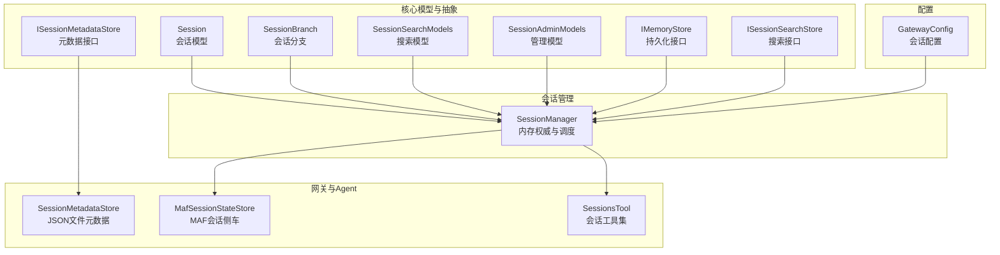
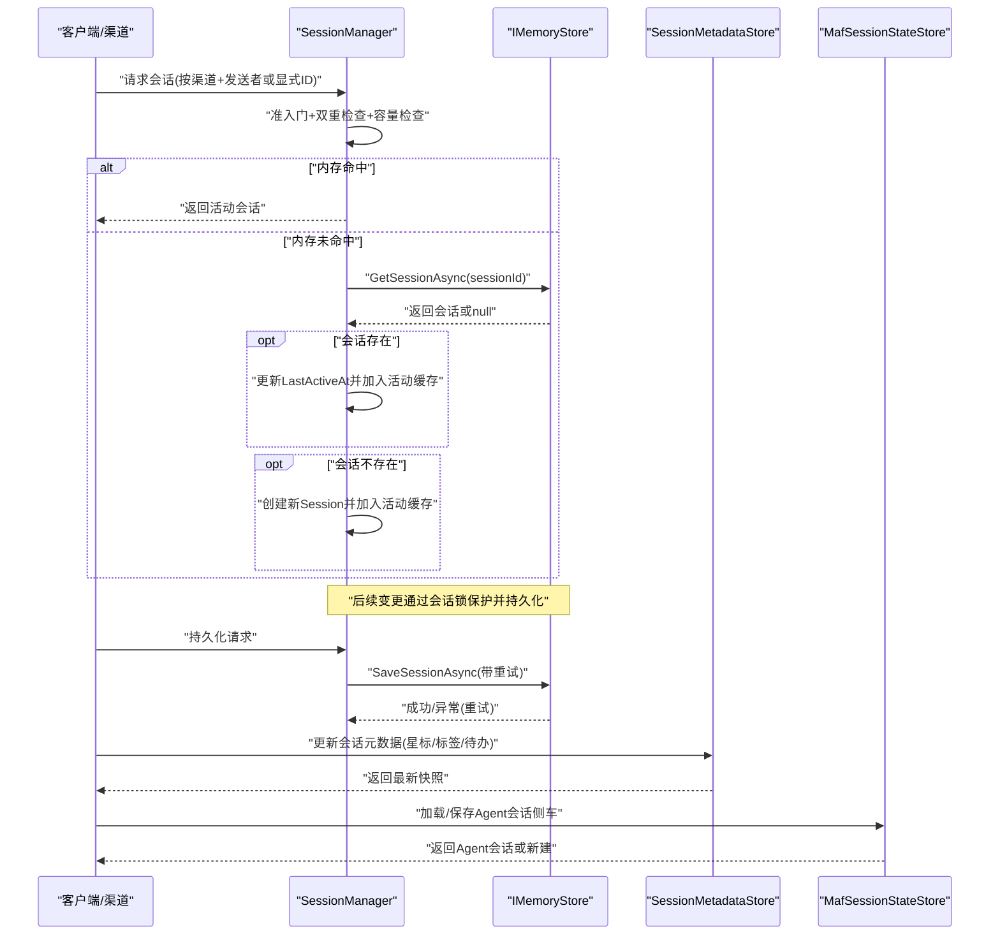
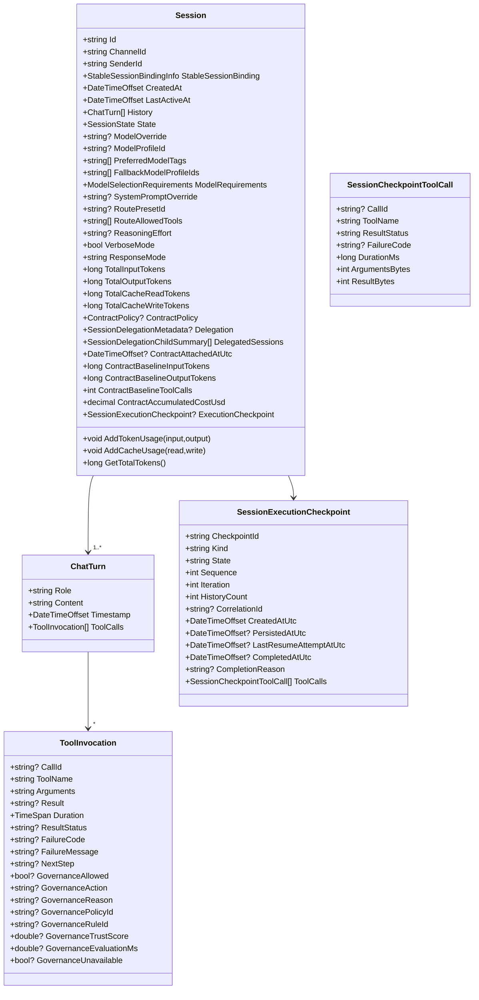
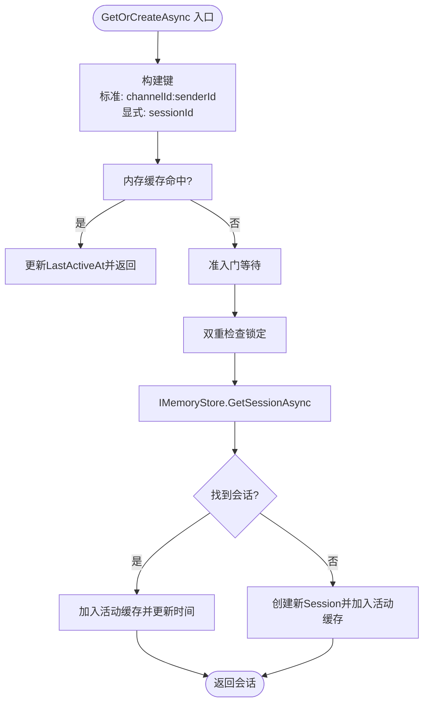
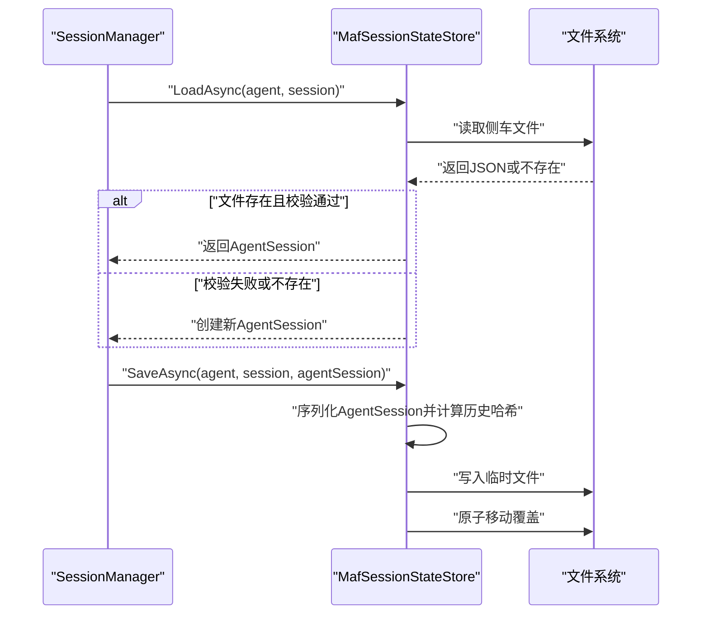
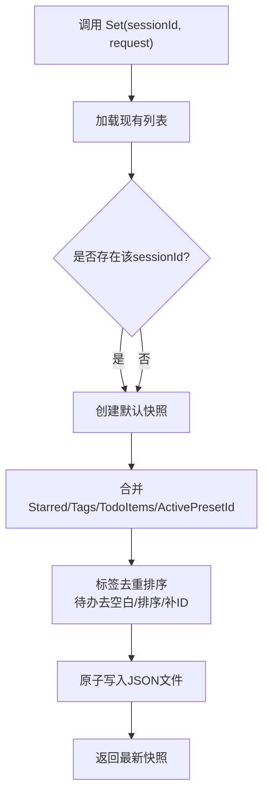
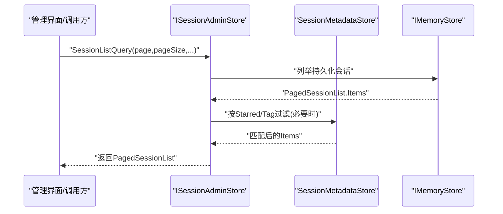
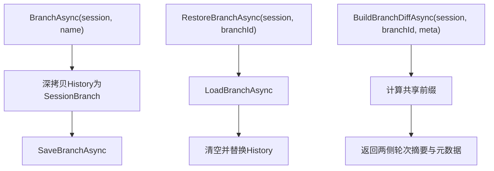
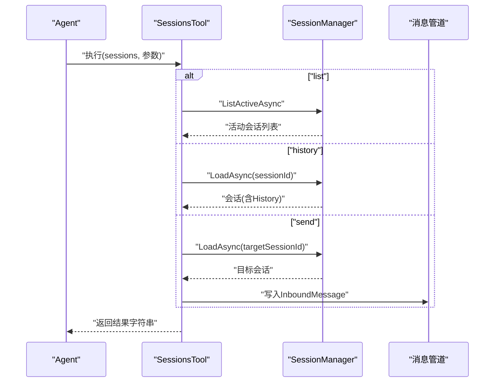
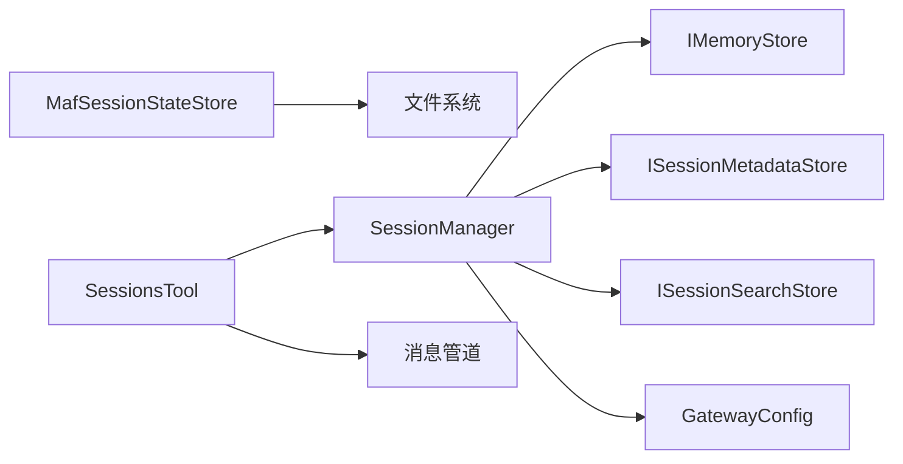

# 会话管理

<cite>
**本文引用的文件**
- [Session.cs](file://src/OpenClaw.Core/Models/Session.cs)
- [SessionBranch.cs](file://src/OpenClaw.Core/Models/SessionBranch.cs)
- [SessionSearchModels.cs](file://src/OpenClaw.Core/Models/SessionSearchModels.cs)
- [SessionAdminModels.cs](file://src/OpenClaw.Core/Models/SessionAdminModels.cs)
- [SessionManager.cs](file://src/OpenClaw.Core/Sessions/SessionManager.cs)
- [ISessionMetadataStore.cs](file://src/OpenClaw.Core/Abstractions/ISessionMetadataStore.cs)
- [ISessionSearchStore.cs](file://src/OpenClaw.Core/Abstractions/ISessionSearchStore.cs)
- [IMemoryStore.cs](file://src/OpenClaw.Core/Abstractions/IMemoryStore.cs)
- [SessionMetadataStore.cs](file://src/OpenClaw.Gateway/SessionMetadataStore.cs)
- [MafSessionStateStore.cs](file://src/OpenClaw.Agent/MafSessionStateStore.cs)
- [SessionsTool.cs](file://src/OpenClaw.Agent/Tools/SessionsTool.cs)
- [GatewayConfig.cs](file://src/OpenClaw.Core/Models/GatewayConfig.cs)
- [OpenClaw-Session-Management.md](file://docs/OpenClaw-Session-Management.md)
</cite>

## 目录
1. [简介](#简介)
2. [项目结构](#项目结构)
3. [核心组件](#核心组件)
4. [架构总览](#架构总览)
5. [详细组件分析](#详细组件分析)
6. [依赖关系分析](#依赖关系分析)
7. [性能考量](#性能考量)
8. [故障排查指南](#故障排查指南)
9. [结论](#结论)
10. [附录](#附录)

## 简介
本文件系统化阐述会话管理子系统的生命周期、状态持久化、历史记录维护、会话状态存储与搜索能力。重点覆盖以下方面：
- Session 模型的数据结构与字段语义
- 会话状态的加载与保存流程（含重试与幂等）
- 会话元数据管理（星标、标签、待办）
- 会话搜索与管理列表
- 会话分支与差异分析
- 关键接口与配置项
- 使用模式与性能优化建议

## 项目结构
会话管理相关代码主要分布在如下模块：
- 核心模型与抽象：OpenClaw.Core/Models 与 OpenClaw.Core/Abstractions
- 会话管理器：OpenClaw.Core/Sessions
- 网关侧元数据存储：OpenClaw.Gateway
- Agent 侧会话状态存储：OpenClaw.Agent
- 管理与搜索工具：OpenClaw.Agent/Tools
- 配置：OpenClaw.Core/Models/GatewayConfig.cs

图表来源
- [Session.cs:15-135](file://src/OpenClaw.Core/Models/Session.cs#L15-L135)
- [SessionBranch.cs:8-15](file://src/OpenClaw.Core/Models/SessionBranch.cs#L8-L15)
- [SessionSearchModels.cs:3-29](file://src/OpenClaw.Core/Models/SessionSearchModels.cs#L3-L29)
- [SessionAdminModels.cs:3-39](file://src/OpenClaw.Core/Models/SessionAdminModels.cs#L3-L39)
- [IMemoryStore.cs:9-23](file://src/OpenClaw.Core/Abstractions/IMemoryStore.cs#L9-L23)
- [ISessionMetadataStore.cs:5-10](file://src/OpenClaw.Core/Abstractions/ISessionMetadataStore.cs#L5-L10)
- [ISessionSearchStore.cs:5-9](file://src/OpenClaw.Core/Abstractions/ISessionSearchStore.cs#L5-L9)
- [SessionManager.cs:13-624](file://src/OpenClaw.Core/Sessions/SessionManager.cs#L13-L624)
- [SessionMetadataStore.cs:7-135](file://src/OpenClaw.Gateway/SessionMetadataStore.cs#L7-L135)
- [MafSessionStateStore.cs:12-197](file://src/OpenClaw.Agent/MafSessionStateStore.cs#L12-L197)
- [SessionsTool.cs:17-139](file://src/OpenClaw.Agent/Tools/SessionsTool.cs#L17-L139)
- [GatewayConfig.cs:50-79](file://src/OpenClaw.Core/Models/GatewayConfig.cs#L50-L79)

章节来源
- [OpenClaw-Session-Management.md:1-278](file://docs/OpenClaw-Session-Management.md#L1-L278)

## 核心组件
- Session 模型：承载会话标识、渠道/发送者、历史轮次、状态、Token 计数、模型与路由覆盖、委托元数据、执行检查点等。
- SessionManager：内存权威，负责会话创建、加载、持久化、分支、差异分析、容量控制与过期淘汰。
- IMemoryStore：会话与分支的持久化契约，默认文件/SQLite 实现。
- 元数据存储：独立 JSON 文件，保存星标、标签、活动预设与待办事项。
- MAF 会话状态存储：Agent 侧车文件，基于历史哈希与版本校验的加载/保存。
- 会话工具：提供列出、读取历史、跨会话发送消息的能力。

章节来源
- [Session.cs:15-135](file://src/OpenClaw.Core/Models/Session.cs#L15-L135)
- [SessionManager.cs:13-624](file://src/OpenClaw.Core/Sessions/SessionManager.cs#L13-L624)
- [IMemoryStore.cs:9-23](file://src/OpenClaw.Core/Abstractions/IMemoryStore.cs#L9-L23)
- [SessionMetadataStore.cs:7-135](file://src/OpenClaw.Gateway/SessionMetadataStore.cs#L7-L135)
- [MafSessionStateStore.cs:12-197](file://src/OpenClaw.Agent/MafSessionStateStore.cs#L12-L197)
- [SessionsTool.cs:17-139](file://src/OpenClaw.Agent/Tools/SessionsTool.cs#L17-L139)

## 架构总览
会话管理贯穿“消息入口 → 会话管理器 → 持久化层/元数据/搜索 → Agent 工具”的链路，形成“内存权威 + 多后端存储”的高可用架构。

图表来源
- [SessionManager.cs:45-172](file://src/OpenClaw.Core/Sessions/SessionManager.cs#L45-L172)
- [IMemoryStore.cs:11-12](file://src/OpenClaw.Core/Abstractions/IMemoryStore.cs#L11-L12)
- [SessionMetadataStore.cs:26-84](file://src/OpenClaw.Gateway/SessionMetadataStore.cs#L26-L84)
- [MafSessionStateStore.cs:36-144](file://src/OpenClaw.Agent/MafSessionStateStore.cs#L36-L144)

## 详细组件分析

### Session 模型与数据结构
- 关键字段
  - 标识与归属：Id、ChannelId、SenderId、StableSessionBinding
  - 时间与状态：CreatedAt、LastActiveAt、State（Active/Paused/Expired）
  - 历史与工具：History（ChatTurn 列表）、ToolCalls
  - Token 与成本：TotalInputTokens、TotalOutputTokens、TotalCacheReadTokens、TotalCacheWriteTokens、Contract* 基线与累计成本
  - 路由与模型：ModelOverride、ModelProfileId、PreferredModelTags、FallbackModelProfileIds、ModelRequirements、SystemPromptOverride、RoutePresetId、RouteAllowedTools、ReasoningEffort、VerboseMode、ResponseMode
  - 委托与执行：Delegation、DelegatedSessions、ExecutionCheckpoint
- 历史轮次结构：ChatTurn 包含 Role、Content、Timestamp、ToolCalls；ToolInvocation 记录调用、结果、治理与耗时等
- AOT 友好：通过 JsonSerializable 标记，支持零分配序列化

图表来源
- [Session.cs:15-289](file://src/OpenClaw.Core/Models/Session.cs#L15-L289)

章节来源
- [Session.cs:15-289](file://src/OpenClaw.Core/Models/Session.cs#L15-L289)

### SessionManager：内存权威与调度
- 创建与键解析
  - 标准路径：GetOrCreateAsync(channelId, senderId)，键为 channelId:senderId
  - 显式路径：GetOrCreateByIdAsync(sessionId, channelId, senderId)，适用于 Webhook/定时任务/子 Agent
  - 准入门（并发度1）+ 双重检查锁定，避免对缓存命中的串行化
- 容量控制与淘汰
  - EnsureCapacityForAdmission：先扫过期，再 LRU 淘汰，最后抛出容量拒绝
  - SweepExpiredActiveSessions：按 LastActiveAt 超过 SessionTimeoutMinutes 的会话标记为 Expired 并尽力持久化
- 持久化与重试
  - PersistAsync：带三次指数退避（100ms、200ms、400ms），异常时记录警告并最终抛出
  - 支持 sessionLockHeld 参数，避免重复加锁
- 会话锁与清理
  - AcquireSessionLockAsync：按会话粒度独占信号量，租约自动释放
  - CleanupSessionLocksOnce：清理孤儿锁（非活动会话且长时间未使用）
- 分支与差异
  - BranchAsync/RestoreBranchAsync/ListBranchesAsync/BuildBranchDiffAsync：基于 IMemoryStore 的分支持久化与比较
- 查询与扫描
  - ListActive/TryGetActive/TryGetActiveById/TryGetActiveByContractId/LoadAsync/RemoveActive/IsActive/ActiveCount

图表来源
- [SessionManager.cs:45-130](file://src/OpenClaw.Core/Sessions/SessionManager.cs#L45-L130)

章节来源
- [SessionManager.cs:13-624](file://src/OpenClaw.Core/Sessions/SessionManager.cs#L13-L624)
- [OpenClaw-Session-Management.md:27-81](file://docs/OpenClaw-Session-Management.md#L27-L81)

### 会话状态存储：IMemoryStore 与 MAF 侧车
- IMemoryStore
  - 会话：GetSessionAsync/SaveSessionAsync
  - 分支：SaveBranchAsync/LoadBranchAsync/ListBranchesAsync/DeleteBranchAsync
  - 笔记：LoadNote/SaveNote/DeleteNote/ListNotesWithPrefix
- MafSessionStateStore
  - 加载：根据 sessionId 与历史哈希、包版本校验，决定是否复用 Agent 会话侧车
  - 保存：序列化 Agent 会话，写入临时文件后原子移动覆盖
  - 历史哈希：对 History 与若干路由覆盖字段进行 SHA256 拼接哈希，确保一致性

图表来源
- [MafSessionStateStore.cs:36-144](file://src/OpenClaw.Agent/MafSessionStateStore.cs#L36-L144)
- [IMemoryStore.cs:11-23](file://src/OpenClaw.Core/Abstractions/IMemoryStore.cs#L11-L23)

章节来源
- [IMemoryStore.cs:9-23](file://src/OpenClaw.Core/Abstractions/IMemoryStore.cs#L9-L23)
- [MafSessionStateStore.cs:12-197](file://src/OpenClaw.Agent/MafSessionStateStore.cs#L12-L197)

### 会话元数据管理：星标、标签与待办
- 存储位置：admin/session-metadata.json
- 接口：ISessionMetadataStore(Get/GetAll/Set)
- 网关实现：SessionMetadataStore
  - Get：若不存在返回默认快照（星标=false、空标签、空待办）
  - GetAll：返回 sessionId -> 快照 字典
  - Set：支持部分更新（Starred/Tags/TodoItems/ActivePresetId），并对标签与待办进行规范化与去重排序
- 规范化规则
  - 标签：去空白、大小写不敏感去重、排序
  - 待办：自动生成唯一 ID（todo_{guid} 截断）、去除空白、按完成状态与创建时间排序

图表来源
- [ISessionMetadataStore.cs:5-10](file://src/OpenClaw.Core/Abstractions/ISessionMetadataStore.cs#L5-L10)
- [SessionMetadataStore.cs:49-84](file://src/OpenClaw.Gateway/SessionMetadataStore.cs#L49-L84)

章节来源
- [ISessionMetadataStore.cs:5-10](file://src/OpenClaw.Core/Abstractions/ISessionMetadataStore.cs#L5-L10)
- [SessionMetadataStore.cs:7-135](file://src/OpenClaw.Gateway/SessionMetadataStore.cs#L7-L135)
- [OpenClaw-Session-Management.md:127-139](file://docs/OpenClaw-Session-Management.md#L127-L139)

### 会话搜索与管理列表
- 管理列表（ISessionAdminStore）
  - 查询模型：SessionListQuery（支持 Search、ChannelId、SenderId、FromUtc、ToUtc、State、Starred、Tag）
  - 分页：PagedSessionList（Page、PageSize、HasMore、Items）
  - 关键点：当使用 Starred/Tag 过滤时，需先加载全部持久化页面，再应用元数据匹配，内存分页
- 全文搜索（ISessionSearchStore）
  - 查询模型：SessionSearchQuery（Text、ChannelId、SenderId、FromUtc、ToUtc、Limit、SnippetLength）
  - 结果模型：SessionSearchHit（SessionId、ChannelId、SenderId、Role、Timestamp、Snippet、Score）
  - 结果模型：SessionSearchResult（Query、Items）

图表来源
- [SessionAdminModels.cs:20-39](file://src/OpenClaw.Core/Models/SessionAdminModels.cs#L20-L39)
- [SessionMetadataStore.cs:41-47](file://src/OpenClaw.Gateway/SessionMetadataStore.cs#L41-L47)
- [ISessionSearchStore.cs:5-9](file://src/OpenClaw.Core/Abstractions/ISessionSearchStore.cs#L5-L9)
- [SessionSearchModels.cs:3-29](file://src/OpenClaw.Core/Models/SessionSearchModels.cs#L3-L29)

章节来源
- [SessionAdminModels.cs:3-39](file://src/OpenClaw.Core/Models/SessionAdminModels.cs#L3-L39)
- [SessionSearchModels.cs:3-29](file://src/OpenClaw.Core/Models/SessionSearchModels.cs#L3-L29)
- [OpenClaw-Session-Management.md:141-167](file://docs/OpenClaw-Session-Management.md#L141-L167)

### 会话分支与差异分析
- 分支创建：BranchAsync 将 History 深拷贝为 SessionBranch，写入 IMemoryStore
- 分支恢复：RestoreBranchAsync 原子替换当前 History
- 差异分析：BuildBranchDiffAsync 计算共享前缀，返回两侧轮次摘要
- 列表：ListBranchesAsync

图表来源
- [SessionManager.cs:180-250](file://src/OpenClaw.Core/Sessions/SessionManager.cs#L180-L250)
- [SessionBranch.cs:8-15](file://src/OpenClaw.Core/Models/SessionBranch.cs#L8-L15)

章节来源
- [SessionManager.cs:174-250](file://src/OpenClaw.Core/Sessions/SessionManager.cs#L174-L250)
- [SessionBranch.cs:8-15](file://src/OpenClaw.Core/Models/SessionBranch.cs#L8-L15)

### 会话工具：跨会话编排
- SessionsTool
  - 动作：list/history/send
  - 列出：返回活动会话清单
  - 历史：读取最近 N 轮（默认 10）
  - 发送：将消息作为 InboundMessage 写入管道，投递至目标会话

图表来源
- [SessionsTool.cs:50-118](file://src/OpenClaw.Agent/Tools/SessionsTool.cs#L50-L118)
- [SessionManager.cs:297-303](file://src/OpenClaw.Core/Sessions/SessionManager.cs#L297-L303)

章节来源
- [SessionsTool.cs:17-139](file://src/OpenClaw.Agent/Tools/SessionsTool.cs#L17-L139)

## 依赖关系分析
- SessionManager 依赖 IMemoryStore 进行持久化，依赖 ISessionMetadataStore/ISessionSearchStore 提供管理与搜索能力
- MafSessionStateStore 与文件系统交互，负责 Agent 会话侧车的加载/保存
- SessionsTool 依赖 SessionManager 与消息管道
- 配置 GatewayConfig 控制 SessionManager 的超时与并发上限

图表来源
- [SessionManager.cs:19-36](file://src/OpenClaw.Core/Sessions/SessionManager.cs#L19-L36)
- [IMemoryStore.cs:9-23](file://src/OpenClaw.Core/Abstractions/IMemoryStore.cs#L9-L23)
- [ISessionMetadataStore.cs:5-10](file://src/OpenClaw.Core/Abstractions/ISessionMetadataStore.cs#L5-L10)
- [ISessionSearchStore.cs:5-9](file://src/OpenClaw.Core/Abstractions/ISessionSearchStore.cs#L5-L9)
- [MafSessionStateStore.cs:12-34](file://src/OpenClaw.Agent/MafSessionStateStore.cs#L12-L34)
- [SessionsTool.cs:17-46](file://src/OpenClaw.Agent/Tools/SessionsTool.cs#L17-L46)
- [GatewayConfig.cs:50-51](file://src/OpenClaw.Core/Models/GatewayConfig.cs#L50-L51)

章节来源
- [SessionManager.cs:13-624](file://src/OpenClaw.Core/Sessions/SessionManager.cs#L13-L624)
- [GatewayConfig.cs:50-79](file://src/OpenClaw.Core/Models/GatewayConfig.cs#L50-L79)

## 性能考量
- 内存与锁
  - 活跃会话使用 ConcurrentDictionary，按会话粒度的信号量锁避免跨会话竞争
  - 容量淘汰采用 O(n) LRU 扫描，TODO 提示可改用优先队列降为 O(log n)
- 持久化
  - 三次指数退避减少瞬时冲突与抖动
  - 后台尽力持久化队列（QueueBestEffortPersist）降低主线程阻塞
- 搜索与管理
  - 元数据过滤需加载全部持久化页面后再内存分页，建议在高基数场景下限制过滤范围或增加索引
- 并发与吞吐
  - 准入门（并发度1）保障创建一致性，但可能成为热点；可通过合理的会话键设计与预热降低争用

章节来源
- [SessionManager.cs:399-460](file://src/OpenClaw.Core/Sessions/SessionManager.cs#L399-L460)
- [SessionManager.cs:462-472](file://src/OpenClaw.Core/Sessions/SessionManager.cs#L462-L472)
- [OpenClaw-Session-Management.md:79-79](file://docs/OpenClaw-Session-Management.md#L79-L79)

## 故障排查指南
- 持久化失败
  - 现象：日志出现 Warning，随后抛出异常
  - 处理：检查存储路径权限、磁盘空间、网络挂载；确认 IMemoryStore 实现幂等与单会话串行写入
- 会话容量拒绝
  - 现象：抛出 InvalidOperationException，指标 IncrementSessionCapacityRejects 增加
  - 处理：提升 MaxConcurrentSessions 或缩短 SessionTimeoutMinutes；检查是否存在会话泄漏
- 孤儿锁
  - 现象：长时间占用信号量导致资源泄露
  - 处理：调用 CleanupSessionLocksOnce 或等待 SessionManager 正常关闭释放
- MAF 侧车加载失败
  - 现象：历史哈希不匹配、版本不一致或文件损坏
  - 处理：删除对应侧车文件或升级包版本；确认历史与路由覆盖字段未被外部修改
- 元数据写入失败
  - 现象：原子写入失败，抛出 InvalidOperationException
  - 处理：检查 admin/session-metadata.json 权限与磁盘空间

章节来源
- [SessionManager.cs:147-171](file://src/OpenClaw.Core/Sessions/SessionManager.cs#L147-L171)
- [SessionManager.cs:485-530](file://src/OpenClaw.Core/Sessions/SessionManager.cs#L485-L530)
- [SessionMetadataStore.cs:103-112](file://src/OpenClaw.Gateway/SessionMetadataStore.cs#L103-L112)
- [MafSessionStateStore.cs:59-95](file://src/OpenClaw.Agent/MafSessionStateStore.cs#L59-L95)

## 结论
会话管理子系统通过“内存权威 + 多后端存储 + 元数据与搜索”的组合，实现了高可用、可扩展且可观测的多轮对话生命周期管理。SessionManager 作为中枢协调器，结合 IMemoryStore、MAF 侧车与元数据存储，满足从创建、活跃、持久化到过期淘汰的全链路需求。在生产环境中，建议合理配置超时与并发上限，关注孤儿锁与持久化重试策略，并在高基数场景下优化搜索与管理列表的过滤路径。

## 附录
- 配置参考（GatewayConfig）
  - SessionTimeoutMinutes：空闲过期时间（分钟）
  - MaxConcurrentSessions：活动会话上限（0=无限制）
  - SessionTokenBudget：会话总令牌预算（0=无限制）
  - EnableEstimatedTokenAdmissionControl：启用估算令牌准入控制
  - SessionRateLimitPerMinute：每分钟会话速率限制（0=无限制）
  - Memory.StoragePath：存储根路径
  - Memory.Provider：存储提供者（file/sqlite/mempalace）

章节来源
- [GatewayConfig.cs:50-79](file://src/OpenClaw.Core/Models/GatewayConfig.cs#L50-L79)
- [OpenClaw-Session-Management.md:231-240](file://docs/OpenClaw-Session-Management.md#L231-L240)