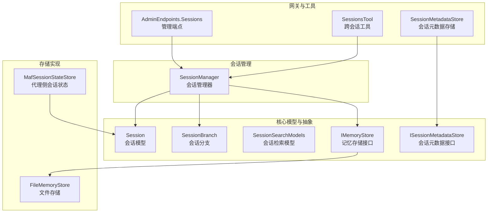
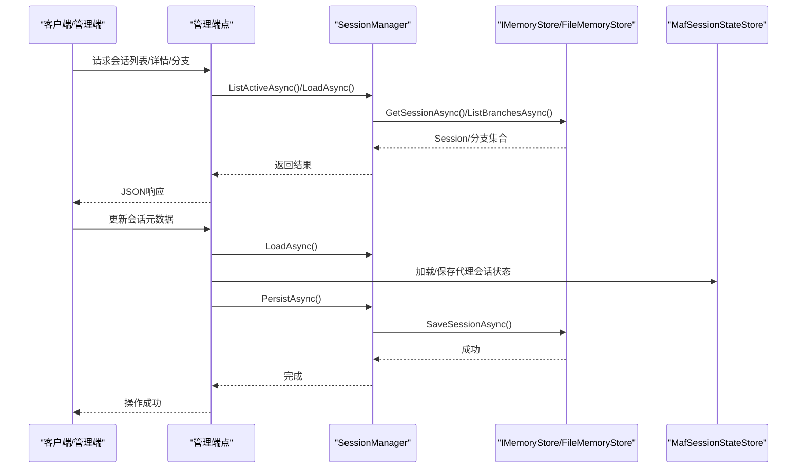
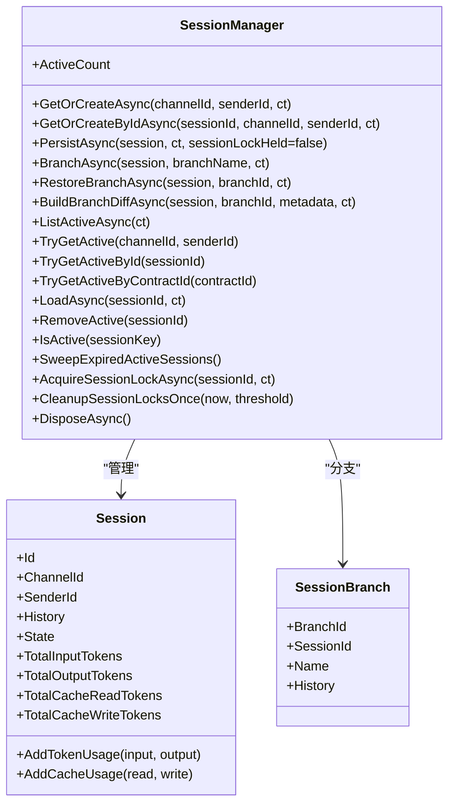
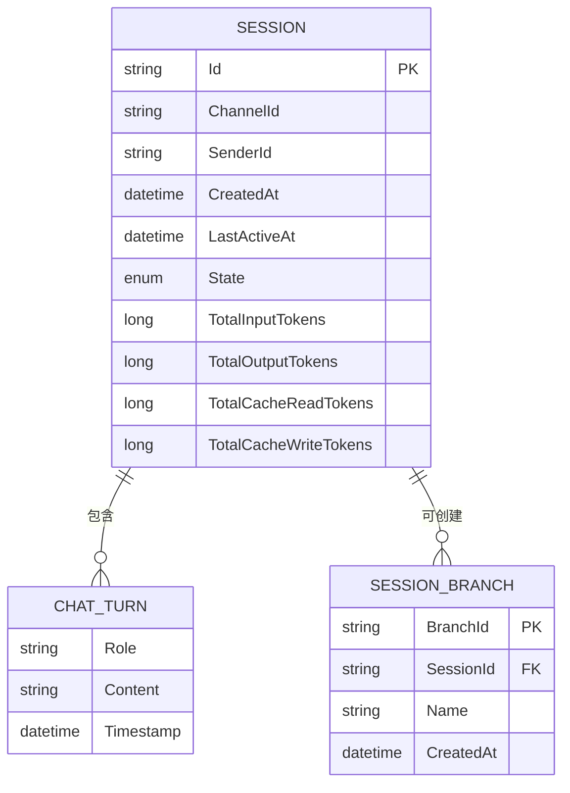
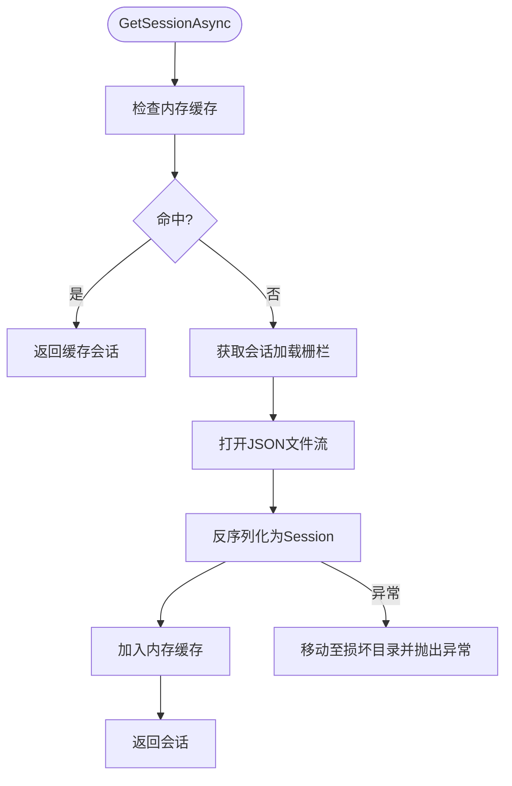
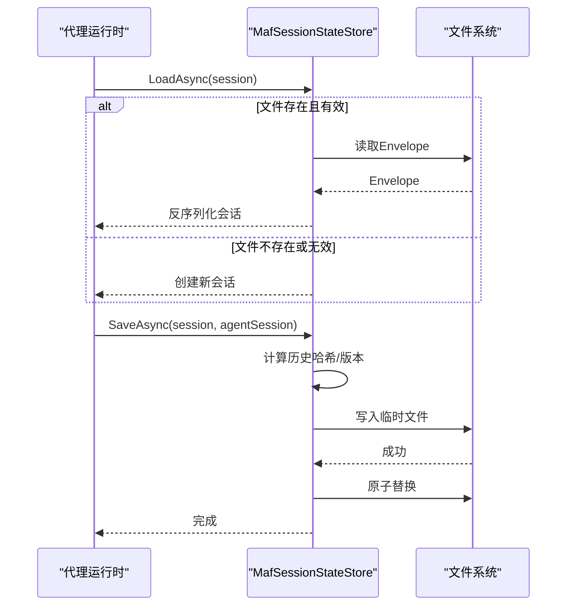
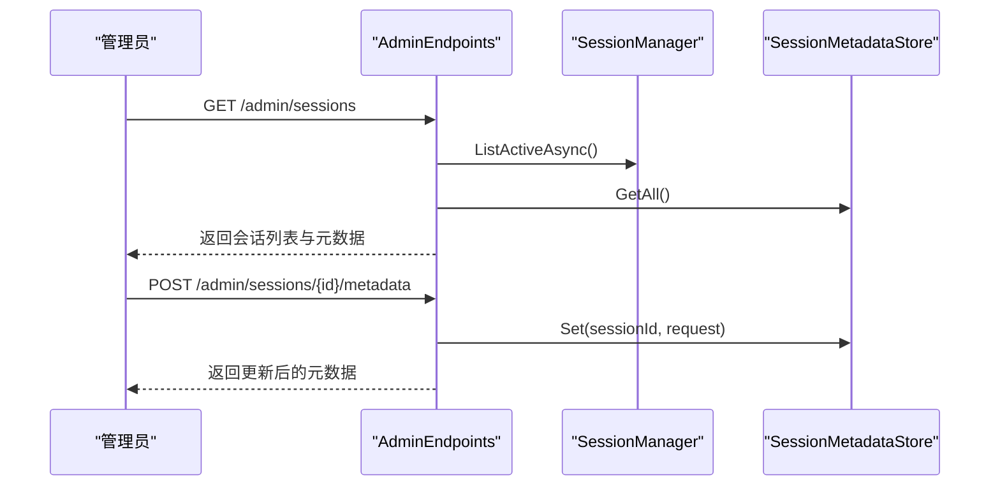
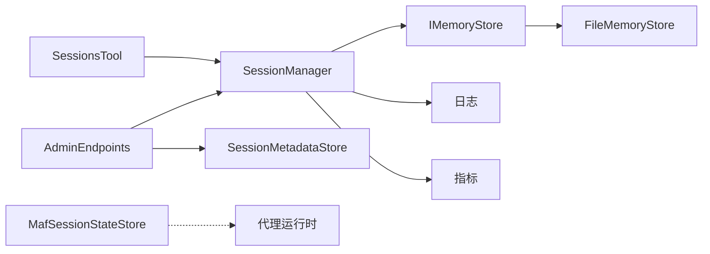

# 会话管理

<cite>
**本文档引用的文件**
- [SessionManager.cs](file://src/OpenClaw.Core/Sessions/SessionManager.cs)
- [Session.cs](file://src/OpenClaw.Core/Models/Session.cs)
- [SessionBranch.cs](file://src/OpenClaw.Core/Models/SessionBranch.cs)
- [ISessionMetadataStore.cs](file://src/OpenClaw.Core/Abstractions/ISessionMetadataStore.cs)
- [SessionMetadataStore.cs](file://src/OpenClaw.Gateway/SessionMetadataStore.cs)
- [SessionsTool.cs](file://src/OpenClaw.Agent/Tools/SessionsTool.cs)
- [MafSessionStateStore.cs](file://src/OpenClaw.Agent/MafSessionStateStore.cs)
- [IMemoryStore.cs](file://src/OpenClaw.Core/Abstractions/IMemoryStore.cs)
- [FileMemoryStore.cs](file://src/OpenClaw.Core/Memory/FileMemoryStore.cs)
- [GatewayConfig.cs](file://src/OpenClaw.Core/Models/GatewayConfig.cs)
- [AdminEndpoints.Sessions.cs](file://src/OpenClaw.Gateway/Endpoints/AdminEndpoints.Sessions.cs)
- [SessionSearchModels.cs](file://src/OpenClaw.Core/Models/SessionSearchModels.cs)
</cite>

## 目录
1. [简介](#简介)
2. [项目结构](#项目结构)
3. [核心组件](#核心组件)
4. [架构总览](#架构总览)
5. [详细组件分析](#详细组件分析)
6. [依赖关系分析](#依赖关系分析)
7. [性能考量](#性能考量)
8. [故障排查指南](#故障排查指南)
9. [结论](#结论)
10. [附录](#附录)

## 简介
本文件系统性阐述会话管理子系统的设计与实现，覆盖会话创建、维护与清理机制；会话状态存储、历史记录管理与分支会话处理；会话令牌预算与历史压缩、上下文截断等核心算法；会话持久化策略、并发访问控制与状态同步机制；会话配置选项、性能优化建议与故障恢复策略；以及会话与代理运行时、记忆存储的协作关系。

## 项目结构
会话管理相关代码主要分布在以下模块：
- 核心模型与抽象：会话数据结构、分支、搜索模型与存储接口
- 会话管理器：负责会话生命周期、并发控制、持久化与清理
- 存储实现：文件型与SQLite型记忆存储，支持会话与分支读写
- 代理侧会话状态：与代理运行时的会话状态协同
- 管理端点：会话列表、详情、分支、导出、差异对比与元数据管理
- 工具：跨会话发现与消息派发能力

图表来源
- [SessionManager.cs:13-624](file://src/OpenClaw.Core/Sessions/SessionManager.cs#L13-L624)
- [Session.cs:15-135](file://src/OpenClaw.Core/Models/Session.cs#L15-L135)
- [SessionBranch.cs:8-15](file://src/OpenClaw.Core/Models/SessionBranch.cs#L8-L15)
- [IMemoryStore.cs:9-23](file://src/OpenClaw.Core/Abstractions/IMemoryStore.cs#L9-L23)
- [ISessionMetadataStore.cs:5-10](file://src/OpenClaw.Core/Abstractions/ISessionMetadataStore.cs#L5-L10)
- [FileMemoryStore.cs:27-76](file://src/OpenClaw.Core/Memory/FileMemoryStore.cs#L27-L76)
- [MafSessionStateStore.cs:12-197](file://src/OpenClaw.Agent/MafSessionStateStore.cs#L12-L197)
- [AdminEndpoints.Sessions.cs:30-437](file://src/OpenClaw.Gateway/Endpoints/AdminEndpoints.Sessions.cs#L30-L437)
- [SessionsTool.cs:17-139](file://src/OpenClaw.Agent/Tools/SessionsTool.cs#L17-L139)
- [SessionMetadataStore.cs:7-135](file://src/OpenClaw.Gateway/SessionMetadataStore.cs#L7-L135)

章节来源
- [SessionManager.cs:13-624](file://src/OpenClaw.Core/Sessions/SessionManager.cs#L13-L624)
- [Session.cs:15-135](file://src/OpenClaw.Core/Models/Session.cs#L15-L135)
- [SessionBranch.cs:8-15](file://src/OpenClaw.Core/Models/SessionBranch.cs#L8-L15)
- [IMemoryStore.cs:9-23](file://src/OpenClaw.Core/Abstractions/IMemoryStore.cs#L9-L23)
- [ISessionMetadataStore.cs:5-10](file://src/OpenClaw.Core/Abstractions/ISessionMetadataStore.cs#L5-L10)
- [FileMemoryStore.cs:27-76](file://src/OpenClaw.Core/Memory/FileMemoryStore.cs#L27-L76)
- [MafSessionStateStore.cs:12-197](file://src/OpenClaw.Agent/MafSessionStateStore.cs#L12-L197)
- [AdminEndpoints.Sessions.cs:30-437](file://src/OpenClaw.Gateway/Endpoints/AdminEndpoints.Sessions.cs#L30-L437)
- [SessionsTool.cs:17-139](file://src/OpenClaw.Agent/Tools/SessionsTool.cs#L17-L139)
- [SessionMetadataStore.cs:7-135](file://src/OpenClaw.Gateway/SessionMetadataStore.cs#L7-L135)

## 核心组件
- 会话模型（Session）：包含会话标识、通道与发送者、创建与活跃时间、历史记录、状态、令牌用量、合同基线与执行检查点等字段，并提供令牌计数累加方法。
- 会话分支（SessionBranch）：保存某时刻的历史快照，用于探索替代路径并可回溯恢复。
- 会话管理器（SessionManager）：提供获取/创建会话、持久化、分支创建/恢复/列举、活动会话扫描、过期清理、容量控制、并发锁管理与后台最佳-effort持久化等能力。
- 记忆存储接口（IMemoryStore）：定义会话与笔记的读写、分支的存取与列举、删除等操作。
- 文件存储实现（FileMemoryStore）：基于文件系统与内存LRU缓存的会话存储，支持并发加载分段栅栏、迁移与损坏隔离。
- 代理侧会话状态（MafSessionStateStore）：在代理运行时侧保存/加载会话状态，通过历史哈希校验与版本兼容性保障一致性。
- 管理端点（AdminEndpoints.Sessions）：提供会话列表、详情、分支、导出、差异对比、元数据更新等管理能力。
- 跨会话工具（SessionsTool）：允许代理列出活动会话、读取历史或向目标会话派发消息。
- 会话元数据（SessionMetadataStore）：管理会话星标、标签、待办事项等元信息，采用原子JSON文件持久化。

章节来源
- [Session.cs:15-135](file://src/OpenClaw.Core/Models/Session.cs#L15-L135)
- [SessionBranch.cs:8-15](file://src/OpenClaw.Core/Models/SessionBranch.cs#L8-L15)
- [SessionManager.cs:13-624](file://src/OpenClaw.Core/Sessions/SessionManager.cs#L13-L624)
- [IMemoryStore.cs:9-23](file://src/OpenClaw.Core/Abstractions/IMemoryStore.cs#L9-L23)
- [FileMemoryStore.cs:27-76](file://src/OpenClaw.Core/Memory/FileMemoryStore.cs#L27-L76)
- [MafSessionStateStore.cs:12-197](file://src/OpenClaw.Agent/MafSessionStateStore.cs#L12-L197)
- [AdminEndpoints.Sessions.cs:30-437](file://src/OpenClaw.Gateway/Endpoints/AdminEndpoints.Sessions.cs#L30-L437)
- [SessionsTool.cs:17-139](file://src/OpenClaw.Agent/Tools/SessionsTool.cs#L17-L139)
- [SessionMetadataStore.cs:7-135](file://src/OpenClaw.Gateway/SessionMetadataStore.cs#L7-L135)

## 架构总览
会话管理器作为核心协调者，连接代理运行时、记忆存储与管理端点。代理侧通过MafSessionStateStore与运行时会话状态保持一致；管理端点通过SessionManager暴露会话查询、分支与导出能力；FileMemoryStore提供会话与分支的持久化；SessionsTool提供跨会话发现与消息派发。

图表来源
- [AdminEndpoints.Sessions.cs:40-93](file://src/OpenClaw.Gateway/Endpoints/AdminEndpoints.Sessions.cs#L40-L93)
- [SessionManager.cs:132-172](file://src/OpenClaw.Core/Sessions/SessionManager.cs#L132-L172)
- [FileMemoryStore.cs:78-170](file://src/OpenClaw.Core/Memory/FileMemoryStore.cs#L78-L170)
- [MafSessionStateStore.cs:36-144](file://src/OpenClaw.Agent/MafSessionStateStore.cs#L36-L144)

## 详细组件分析

### 会话管理器（SessionManager）
- 并发与容量控制
  - 使用并发字典维护活动会话，使用信号量门控确保并发创建的正确性。
  - 最大并发会话数限制，超过阈值时先清理过期再按最久未活跃驱逐。
- 生命周期管理
  - 获取/创建：根据channelId+senderId或显式sessionId获取或创建会话；若磁盘存在则加载并激活。
  - 过期清理：基于超时阈值扫描并移除过期会话，同时标记为Expired并队列最佳-effort持久化。
  - 主动移除：支持按ID从内存中移除会话，适用于请求级临时会话。
- 持久化与重试
  - 提供带指数退避的持久化重试机制，失败后记录警告并最终抛出异常。
  - 后台最佳-effort持久化任务队列，完成后清理挂起任务。
- 分支与差异
  - 创建分支：深拷贝当前历史生成分支，返回分支ID。
  - 恢复分支：从存储加载分支并替换当前会话历史。
  - 构建差异：计算共享前缀与各自独有回合摘要，便于对比与审计。
- 并发锁与清理
  - 会话级信号量锁，支持清理孤儿锁并释放资源。
- 活动会话扫描与查询
  - 支持按channelId+senderId、sessionId、contractId快速查找。
  - 列举所有活动会话，便于监控与运维。

图表来源
- [SessionManager.cs:45-321](file://src/OpenClaw.Core/Sessions/SessionManager.cs#L45-L321)
- [Session.cs:15-135](file://src/OpenClaw.Core/Models/Session.cs#L15-L135)
- [SessionBranch.cs:8-15](file://src/OpenClaw.Core/Models/SessionBranch.cs#L8-L15)

章节来源
- [SessionManager.cs:45-321](file://src/OpenClaw.Core/Sessions/SessionManager.cs#L45-L321)
- [Session.cs:15-135](file://src/OpenClaw.Core/Models/Session.cs#L15-L135)
- [SessionBranch.cs:8-15](file://src/OpenClaw.Core/Models/SessionBranch.cs#L8-L15)

### 会话模型与分支
- 会话模型（Session）
  - 历史记录为回合列表，每个回合包含角色、内容与工具调用。
  - 提供令牌用量与缓存读写用量的原子累加器，支持总令牌统计。
  - 支持稳定会话绑定、模型配置、路由偏好、合同基线与执行检查点等扩展字段。
- 会话分支（SessionBranch）
  - 保存分支ID、所属会话ID、分支名称与创建时间，以及历史快照。

图表来源
- [Session.cs:15-135](file://src/OpenClaw.Core/Models/Session.cs#L15-L135)
- [SessionBranch.cs:8-15](file://src/OpenClaw.Core/Models/SessionBranch.cs#L8-L15)

章节来源
- [Session.cs:15-135](file://src/OpenClaw.Core/Models/Session.cs#L15-L135)
- [SessionBranch.cs:8-15](file://src/OpenClaw.Core/Models/SessionBranch.cs#L8-L15)

### 记忆存储与文件存储
- 接口职责
  - 会话：GetSessionAsync、SaveSessionAsync
  - 分支：SaveBranchAsync、LoadBranchAsync、ListBranchesAsync、DeleteBranchAsync
  - 笔记：LoadNoteAsync、SaveNoteAsync、DeleteNoteAsync、ListNotesWithPrefixAsync
- 文件存储实现
  - 使用URL安全Base64编码的文件名防止路径穿越。
  - 会话加载采用分段栅栏（64个）避免热点会话争用。
  - 内存LRU缓存提升重复读取性能。
  - 损坏文件隔离：读取异常时移动到损坏目录并记录告警。
  - 兼容旧版未编码文件名的迁移逻辑。

图表来源
- [FileMemoryStore.cs:78-170](file://src/OpenClaw.Core/Memory/FileMemoryStore.cs#L78-L170)
- [FileMemoryStore.cs:191-200](file://src/OpenClaw.Core/Memory/FileMemoryStore.cs#L191-L200)

章节来源
- [IMemoryStore.cs:9-23](file://src/OpenClaw.Core/Abstractions/IMemoryStore.cs#L9-L23)
- [FileMemoryStore.cs:27-76](file://src/OpenClaw.Core/Memory/FileMemoryStore.cs#L27-L76)
- [FileMemoryStore.cs:78-170](file://src/OpenClaw.Core/Memory/FileMemoryStore.cs#L78-L170)
- [FileMemoryStore.cs:191-200](file://src/OpenClaw.Core/Memory/FileMemoryStore.cs#L191-L200)

### 代理侧会话状态（MafSessionStateStore）
- 设计要点
  - 会话状态文件采用分片哈希命名，避免单目录文件过多。
  - 通过历史哈希、会话ID与包版本校验，确保状态与当前会话一致且可兼容。
  - 失败时自动回退到新建会话，保证可用性。
- 保存流程
  - 序列化代理会话状态为Envelope，包含版本、会话ID、历史哈希与状态数据。
  - 写入临时文件后原子移动覆盖，清理临时文件。

图表来源
- [MafSessionStateStore.cs:36-144](file://src/OpenClaw.Agent/MafSessionStateStore.cs#L36-L144)
- [MafSessionStateStore.cs:184-195](file://src/OpenClaw.Agent/MafSessionStateStore.cs#L184-L195)

章节来源
- [MafSessionStateStore.cs:36-144](file://src/OpenClaw.Agent/MafSessionStateStore.cs#L36-L144)
- [MafSessionStateStore.cs:184-195](file://src/OpenClaw.Agent/MafSessionStateStore.cs#L184-L195)

### 管理端点与跨会话工具
- 管理端点
  - 列表/详情：结合SessionManager与SessionMetadataStore返回会话与元数据。
  - 分支：列举、恢复、差异对比。
  - 导出：构建纯文本转录。
  - 元数据：增删改查。
- 跨会话工具（SessionsTool）
  - 列出活动会话、读取最近历史、向目标会话派发消息。
  - 通过管道写入InboundMessage实现跨会话通信。

图表来源
- [AdminEndpoints.Sessions.cs:40-93](file://src/OpenClaw.Gateway/Endpoints/AdminEndpoints.Sessions.cs#L40-L93)
- [AdminEndpoints.Sessions.cs:362-389](file://src/OpenClaw.Gateway/Endpoints/AdminEndpoints.Sessions.cs#L362-L389)
- [SessionMetadataStore.cs:41-84](file://src/OpenClaw.Gateway/SessionMetadataStore.cs#L41-L84)

章节来源
- [AdminEndpoints.Sessions.cs:40-93](file://src/OpenClaw.Gateway/Endpoints/AdminEndpoints.Sessions.cs#L40-L93)
- [AdminEndpoints.Sessions.cs:261-327](file://src/OpenClaw.Gateway/Endpoints/AdminEndpoints.Sessions.cs#L261-L327)
- [AdminEndpoints.Sessions.cs:346-360](file://src/OpenClaw.Gateway/Endpoints/AdminEndpoints.Sessions.cs#L346-L360)
- [AdminEndpoints.Sessions.cs:362-389](file://src/OpenClaw.Gateway/Endpoints/AdminEndpoints.Sessions.cs#L362-L389)
- [SessionsTool.cs:71-118](file://src/OpenClaw.Agent/Tools/SessionsTool.cs#L71-L118)
- [SessionMetadataStore.cs:41-84](file://src/OpenClaw.Gateway/SessionMetadataStore.cs#L41-L84)

## 依赖关系分析
- 组件耦合
  - SessionManager依赖IMemoryStore进行会话与分支持久化，依赖日志与指标进行可观测性。
  - AdminEndpoints依赖SessionManager与SessionMetadataStore提供管理能力。
  - SessionsTool依赖SessionManager与消息管道实现跨会话通信。
  - MafSessionStateStore独立于SessionManager，仅与代理运行时交互。
- 外部依赖
  - 文件系统（FileMemoryStore）、JSON序列化、内存缓存、日志与指标库。
- 循环依赖
  - 当前设计无循环依赖，各模块职责清晰。

图表来源
- [SessionManager.cs:29-36](file://src/OpenClaw.Core/Sessions/SessionManager.cs#L29-L36)
- [AdminEndpoints.Sessions.cs:30-437](file://src/OpenClaw.Gateway/Endpoints/AdminEndpoints.Sessions.cs#L30-L437)
- [SessionsTool.cs:17-46](file://src/OpenClaw.Agent/Tools/SessionsTool.cs#L17-L46)
- [MafSessionStateStore.cs:12-34](file://src/OpenClaw.Agent/MafSessionStateStore.cs#L12-L34)
- [FileMemoryStore.cs:27-76](file://src/OpenClaw.Core/Memory/FileMemoryStore.cs#L27-L76)

章节来源
- [SessionManager.cs:29-36](file://src/OpenClaw.Core/Sessions/SessionManager.cs#L29-L36)
- [AdminEndpoints.Sessions.cs:30-437](file://src/OpenClaw.Gateway/Endpoints/AdminEndpoints.Sessions.cs#L30-L437)
- [SessionsTool.cs:17-46](file://src/OpenClaw.Agent/Tools/SessionsTool.cs#L17-L46)
- [MafSessionStateStore.cs:12-34](file://src/OpenClaw.Agent/MafSessionStateStore.cs#L12-L34)
- [FileMemoryStore.cs:27-76](file://src/OpenClaw.Core/Memory/FileMemoryStore.cs#L27-L76)

## 性能考量
- 并发与容量
  - 使用信号量门控与会话级锁避免竞态；最大并发会话数阈值与过期清理降低内存占用。
  - 会话加载分段栅栏减少热点争用，内存LRU缓存降低磁盘I/O。
- 持久化与重试
  - 指数退避重试减少抖动；后台最佳-effort持久化避免阻塞主流程。
- 历史与上下文
  - 配置项支持最大历史回合数、启用压缩与阈值、保留近期回合数量，平衡成本与效果。
- 搜索与检索
  - 支持会话文本检索与命中片段长度控制，便于快速定位。

章节来源
- [SessionManager.cs:443-460](file://src/OpenClaw.Core/Sessions/SessionManager.cs#L443-L460)
- [FileMemoryStore.cs:78-170](file://src/OpenClaw.Core/Memory/FileMemoryStore.cs#L78-L170)
- [GatewayConfig.cs:175-214](file://src/OpenClaw.Core/Models/GatewayConfig.cs#L175-L214)
- [SessionSearchModels.cs:3-29](file://src/OpenClaw.Core/Models/SessionSearchModels.cs#L3-L29)

## 故障排查指南
- 会话无法加载
  - 检查文件存储是否损坏隔离与迁移逻辑；确认会话ID编码与文件名匹配。
- 持久化失败
  - 查看重试日志与异常堆栈；确认磁盘空间与权限；关注后台最佳-effort持久化队列。
- 分支恢复失败
  - 确认分支ID归属当前会话；检查分支是否存在；验证会话历史一致性。
- 并发冲突
  - 关注会话级锁与门控；避免在高并发场景下频繁创建/销毁会话。
- 元数据写入失败
  - 检查原子JSON写入错误；确认存储路径可写。

章节来源
- [FileMemoryStore.cs:191-200](file://src/OpenClaw.Core/Memory/FileMemoryStore.cs#L191-L200)
- [SessionManager.cs:132-172](file://src/OpenClaw.Core/Sessions/SessionManager.cs#L132-L172)
- [SessionManager.cs:200-214](file://src/OpenClaw.Core/Sessions/SessionManager.cs#L200-L214)
- [SessionMetadataStore.cs:103-112](file://src/OpenClaw.Gateway/SessionMetadataStore.cs#L103-L112)

## 结论
会话管理子系统通过明确的职责划分与健壮的并发控制，实现了会话的全生命周期管理。结合文件存储的高可靠与代理侧状态的协同，满足了多渠道、多会话场景下的稳定性与可运维性。通过配置化的令牌预算、历史压缩与检索能力，进一步提升了成本与性能的平衡。

## 附录

### 会话配置选项（节选）
- 并发与超时
  - 最大并发会话数、会话超时分钟数
- 令牌预算与准入控制
  - 会话令牌预算总量、启用估算令牌准入控制
  - 会话每分钟速率限制
- 记忆与压缩
  - 最大历史回合数、启用压缩、压缩阈值与保留近期回合数
- 存储与保留
  - 记忆存储提供方与存储路径、保留策略与归档设置

章节来源
- [GatewayConfig.cs:50-66](file://src/OpenClaw.Core/Models/GatewayConfig.cs#L50-L66)
- [GatewayConfig.cs:175-214](file://src/OpenClaw.Core/Models/GatewayConfig.cs#L175-L214)
- [GatewayConfig.cs:203-214](file://src/OpenClaw.Core/Models/GatewayConfig.cs#L203-L214)