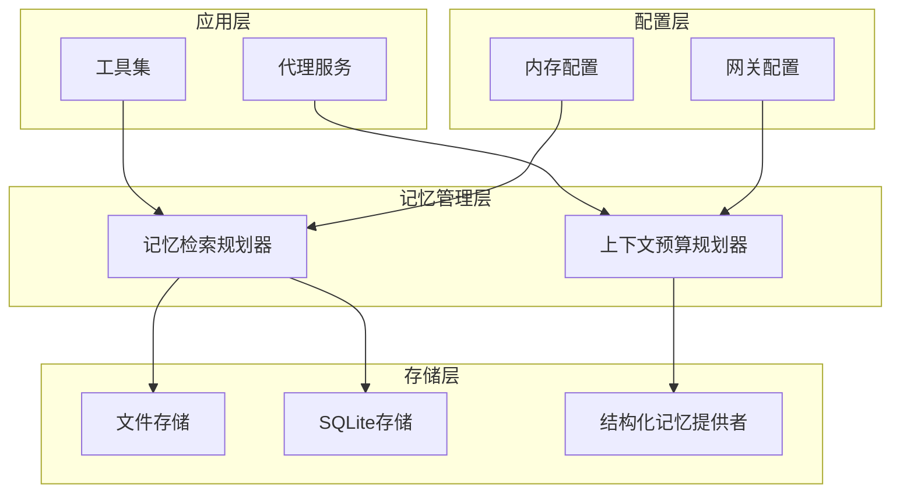
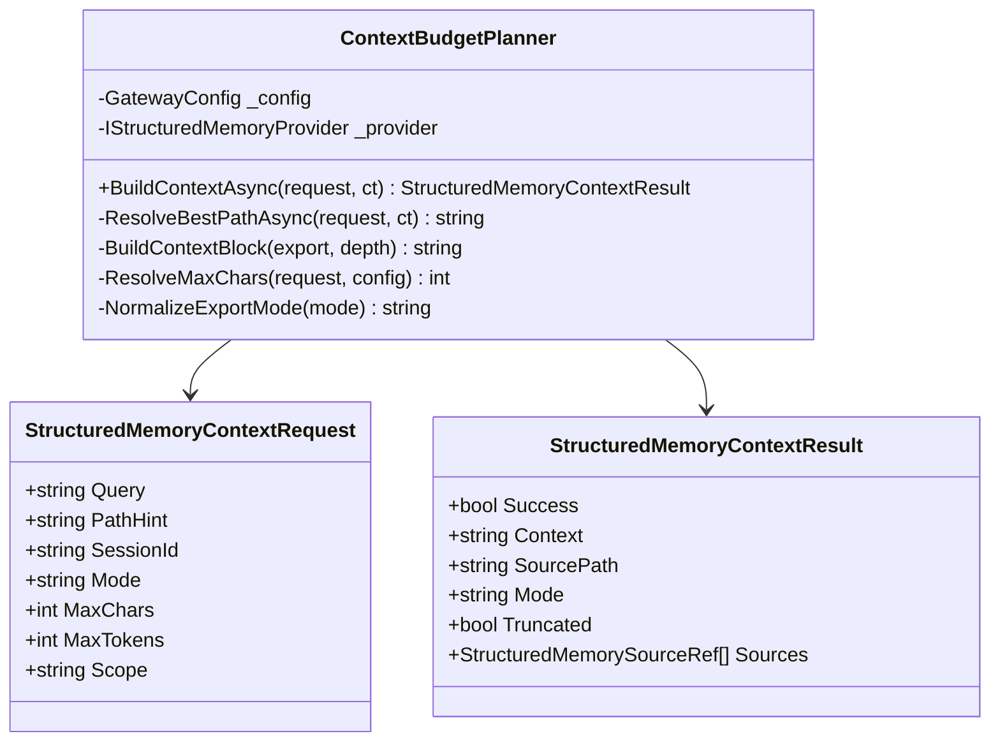
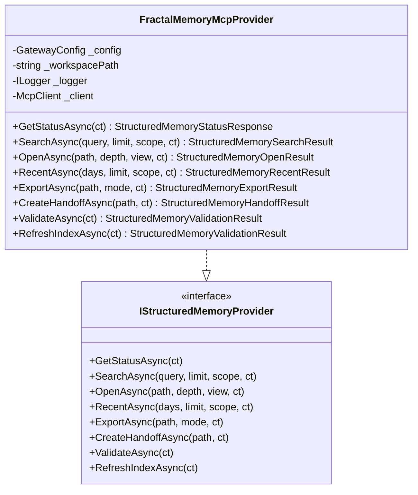
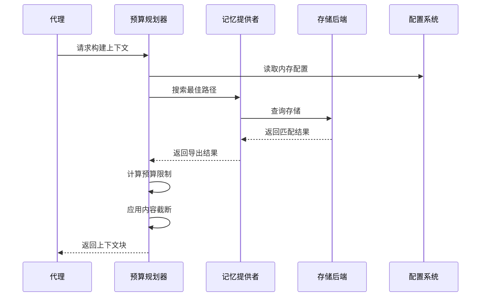
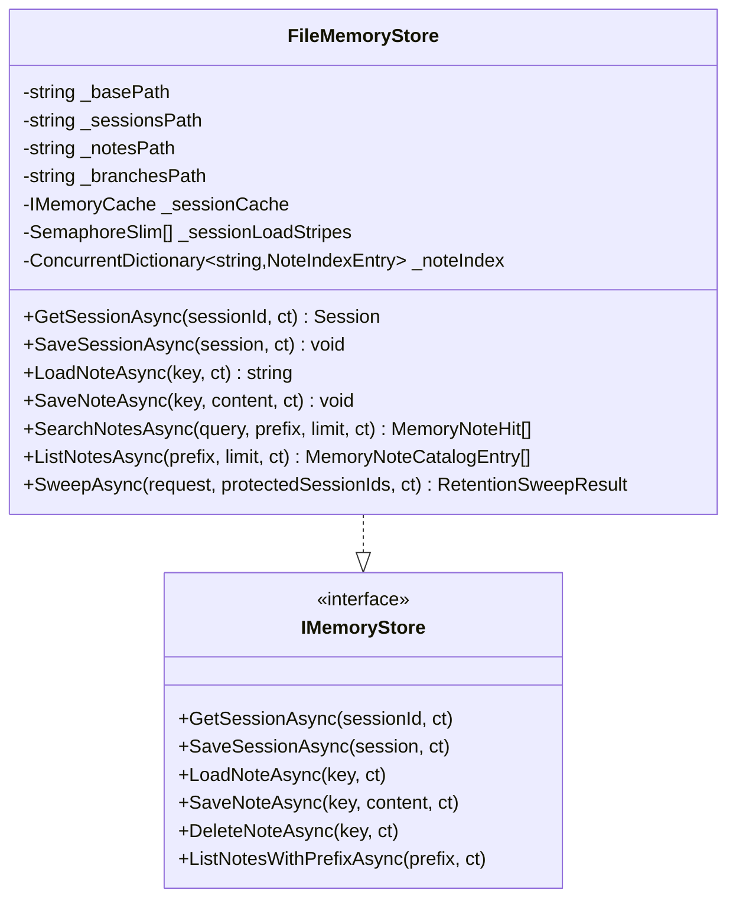
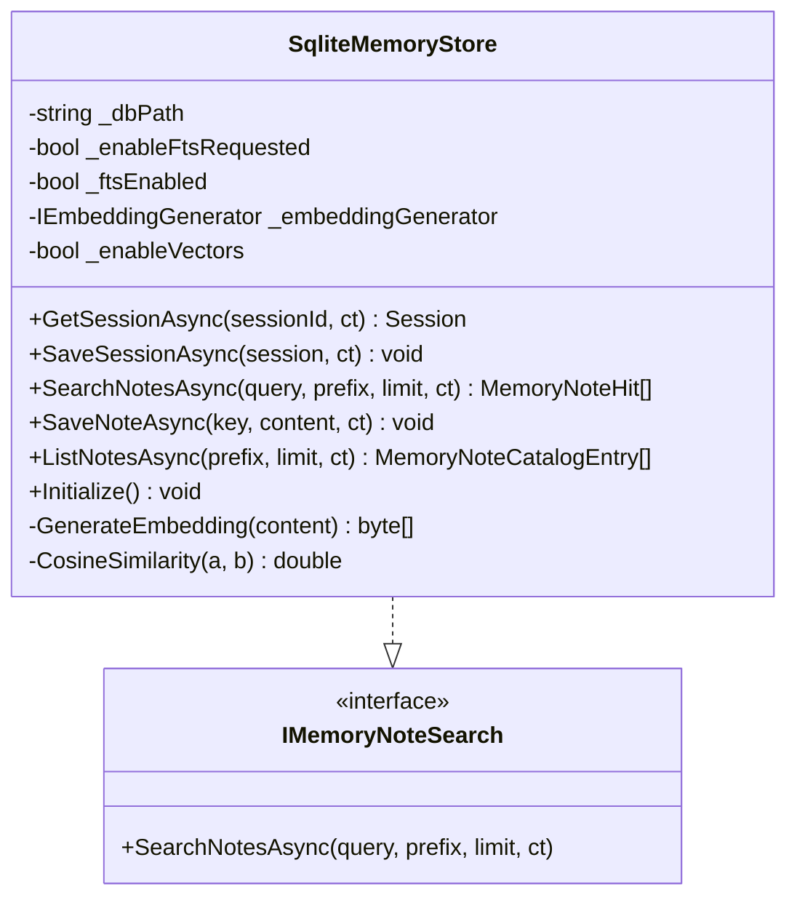
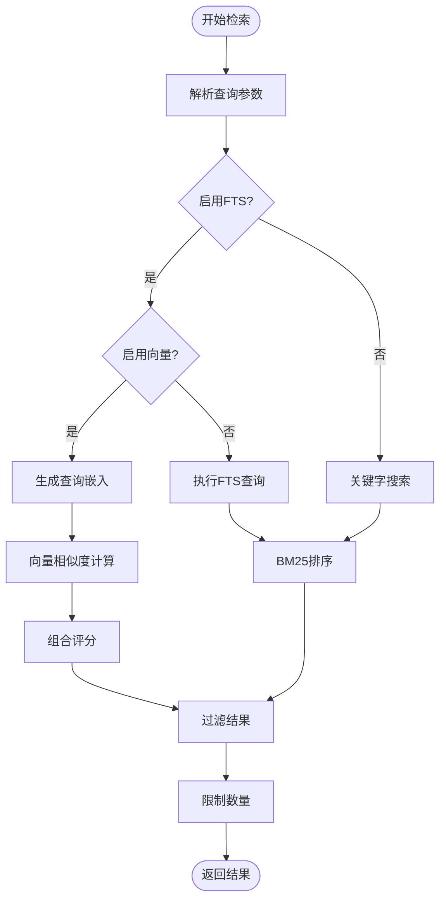
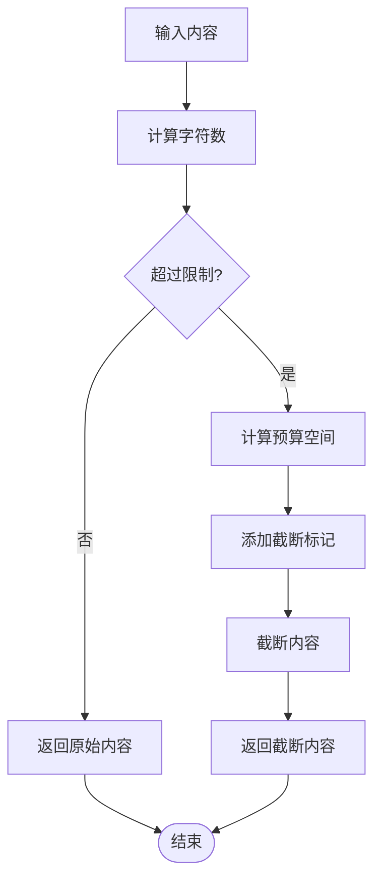
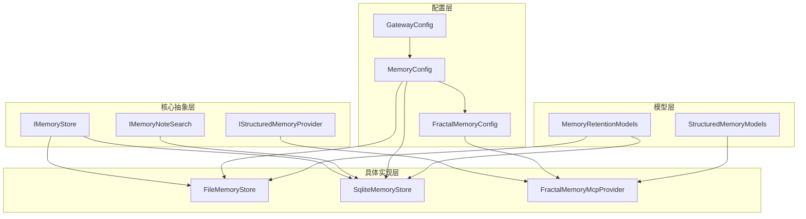

# 内存交互机制

<cite>
**本文档引用的文件**
- [ContextBudgetPlanner.cs](file://src/OpenClaw.Core/Memory/ContextBudgetPlanner.cs)
- [FileMemoryStore.cs](file://src/OpenClaw.Core/Memory/FileMemoryStore.cs)
- [SqliteMemoryStore.cs](file://src/OpenClaw.Core/Memory/SqliteMemoryStore.cs)
- [MemoryRetentionArchive.cs](file://src/OpenClaw.Core/Memory/MemoryRetentionArchive.cs)
- [FractalMemoryMcpProvider.cs](file://src/OpenClaw.Agent/Memory/FractalMemoryMcpProvider.cs)
- [FractalMemoryTools.cs](file://src/OpenClaw.Agent/Tools/FractalMemoryTools.cs)
- [MemorySearchTool.cs](file://src/OpenClaw.Agent/Tools/MemorySearchTool.cs)
- [MemoryGetTool.cs](file://src/OpenClaw.Agent/Tools/MemoryGetTool.cs)
- [StructuredMemoryModels.cs](file://src/OpenClaw.Core/Models/StructuredMemoryModels.cs)
- [MemoryRetentionModels.cs](file://src/OpenClaw.Core/Models/MemoryRetentionModels.cs)
- [GatewayConfig.cs](file://src/OpenClaw.Core/Models/GatewayConfig.cs)
- [IMemoryStore.cs](file://src/OpenClaw.Core/Abstractions/IMemoryStore.cs)
- [IStructuredMemoryProvider.cs](file://src/OpenClaw.Core/Abstractions/IStructuredMemoryProvider.cs)
</cite>

## 目录
1. [引言](#引言)
2. [项目结构](#项目结构)
3. [核心组件](#核心组件)
4. [架构概览](#架构概览)
5. [详细组件分析](#详细组件分析)
6. [依赖关系分析](#依赖关系分析)
7. [性能考虑](#性能考虑)
8. [故障排除指南](#故障排除指南)
9. [结论](#结论)

## 引言

内存交互机制是OpenClaw系统中实现智能代理记忆管理的核心基础设施。该机制通过代理与记忆存储的深度集成，实现了上下文预算规划、记忆召回、内容截断等关键功能。本文档将深入分析这一复杂的内存管理系统，涵盖从底层存储到上层应用的完整技术栈。

## 项目结构

OpenClaw的内存交互机制采用分层架构设计，主要包含以下核心层次：

**图表来源**
- [ContextBudgetPlanner.cs:1-167](file://src/OpenClaw.Core/Memory/ContextBudgetPlanner.cs#L1-L167)
- [FractalMemoryMcpProvider.cs:1-828](file://src/OpenClaw.Agent/Memory/FractalMemoryMcpProvider.cs#L1-L828)

**章节来源**
- [ContextBudgetPlanner.cs:1-167](file://src/OpenClaw.Core/Memory/ContextBudgetPlanner.cs#L1-L167)
- [GatewayConfig.cs:175-262](file://src/OpenClaw.Core/Models/GatewayConfig.cs#L175-L262)

## 核心组件

### 上下文预算规划器

上下文预算规划器是内存交互机制的核心协调器，负责根据配置和请求动态计算可用的上下文空间。

**图表来源**
- [ContextBudgetPlanner.cs:7-167](file://src/OpenClaw.Core/Memory/ContextBudgetPlanner.cs#L7-L167)
- [StructuredMemoryModels.cs:108-128](file://src/OpenClaw.Core/Models/StructuredMemoryModels.cs#L108-L128)

### 结构化记忆提供者

结构化记忆提供者通过MCP协议与外部Fractal Memory系统交互，实现复杂的知识管理和检索功能。

**图表来源**
- [FractalMemoryMcpProvider.cs:13-18](file://src/OpenClaw.Agent/Memory/FractalMemoryMcpProvider.cs#L13-L18)
- [IStructuredMemoryProvider.cs:5-15](file://src/OpenClaw.Core/Abstractions/IStructuredMemoryProvider.cs#L5-L15)

**章节来源**
- [FractalMemoryMcpProvider.cs:1-828](file://src/OpenClaw.Agent/Memory/FractalMemoryMcpProvider.cs#L1-L828)
- [ContextBudgetPlanner.cs:1-167](file://src/OpenClaw.Core/Memory/ContextBudgetPlanner.cs#L1-L167)

## 架构概览

内存交互机制的整体架构体现了现代AI系统的典型特征：灵活的存储后端、强大的检索能力、智能的预算控制和可扩展的记忆管理。

**图表来源**
- [ContextBudgetPlanner.cs:19-84](file://src/OpenClaw.Core/Memory/ContextBudgetPlanner.cs#L19-L84)
- [FractalMemoryMcpProvider.cs:70-159](file://src/OpenClaw.Agent/Memory/FractalMemoryMcpProvider.cs#L70-L159)

## 详细组件分析

### 文件存储系统

文件存储系统提供了本地优先的记忆管理能力，支持会话和笔记的持久化存储。

**图表来源**
- [FileMemoryStore.cs:32-800](file://src/OpenClaw.Core/Memory/FileMemoryStore.cs#L32-L800)
- [IMemoryStore.cs:9-23](file://src/OpenClaw.Core/Abstractions/IMemoryStore.cs#L9-L23)

文件存储系统的关键特性包括：

1. **内存缓存机制**：使用LRU缓存管理会话数据，提高访问性能
2. **并发控制**：通过分段信号量防止重复加载同一会话
3. **数据完整性**：实现原子写入和损坏文件隔离
4. **索引管理**：维护笔记索引以支持快速搜索

**章节来源**
- [FileMemoryStore.cs:1-800](file://src/OpenClaw.Core/Memory/FileMemoryStore.cs#L1-L800)

### SQLite存储系统

SQLite存储系统提供了更强大的查询能力和向量化搜索功能。

**图表来源**
- [SqliteMemoryStore.cs:12-800](file://src/OpenClaw.Core/Memory/SqliteMemoryStore.cs#L12-L800)

SQLite存储系统的核心优势：

1. **全文搜索**：集成FTS5引擎支持高效的文本检索
2. **向量搜索**：支持嵌入向量的相似度计算
3. **事务保证**：完整的ACID事务支持
4. **性能优化**：WAL模式和适当的索引策略

**章节来源**
- [SqliteMemoryStore.cs:1-800](file://src/OpenClaw.Core/Memory/SqliteMemoryStore.cs#L1-L800)

### 记忆检索算法

记忆检索算法结合了多种技术来提供高质量的结果排序：

**图表来源**
- [SqliteMemoryStore.cs:319-490](file://src/OpenClaw.Core/Memory/SqliteMemoryStore.cs#L319-L490)

检索算法的关键特性：

1. **多级评分**：结合BM25和余弦相似度计算综合分数
2. **动态阈值**：根据查询类型自动调整搜索策略
3. **结果重排**：基于更新时间和相关性进行二次排序

**章节来源**
- [SqliteMemoryStore.cs:319-490](file://src/OpenClaw.Core/Memory/SqliteMemoryStore.cs#L319-L490)

### 内容截断策略

内容截断策略确保输出符合预定义的大小限制：

**图表来源**
- [ContextBudgetPlanner.cs:62-73](file://src/OpenClaw.Core/Memory/ContextBudgetPlanner.cs#L62-L73)

截断策略的核心规则：

1. **安全边界**：预留足够的空间给截断标记
2. **语义保持**：尽量在单词边界处截断
3. **上下文完整性**：确保截断后的上下文仍然有意义

**章节来源**
- [ContextBudgetPlanner.cs:62-73](file://src/OpenClaw.Core/Memory/ContextBudgetPlanner.cs#L62-L73)

## 依赖关系分析

内存交互机制的依赖关系体现了清晰的关注点分离：

**图表来源**
- [IMemoryStore.cs:9-23](file://src/OpenClaw.Core/Abstractions/IMemoryStore.cs#L9-L23)
- [IStructuredMemoryProvider.cs:5-15](file://src/OpenClaw.Core/Abstractions/IStructuredMemoryProvider.cs#L5-L15)
- [GatewayConfig.cs:175-262](file://src/OpenClaw.Core/Models/GatewayConfig.cs#L175-L262)

**章节来源**
- [GatewayConfig.cs:175-262](file://src/OpenClaw.Core/Models/GatewayConfig.cs#L175-L262)
- [IMemoryStore.cs:1-24](file://src/OpenClaw.Core/Abstractions/IMemoryStore.cs#L1-L24)
- [IStructuredMemoryProvider.cs:1-16](file://src/OpenClaw.Core/Abstractions/IStructuredMemoryProvider.cs#L1-L16)

## 性能考虑

内存交互机制在多个层面进行了性能优化：

### 缓存策略
- **会话缓存**：文件存储使用LRU缓存减少磁盘I/O
- **并发控制**：分段信号量避免重复加载同一会话
- **索引缓存**：SQLite存储利用内置缓存机制

### 查询优化
- **索引策略**：为常用查询字段建立适当索引
- **查询限制**：合理设置查询结果数量上限
- **延迟加载**：按需加载大文件内容

### 内存管理
- **流式处理**：大文件采用流式读取避免内存峰值
- **垃圾回收**：及时释放不再使用的对象引用
- **连接池**：数据库连接复用减少开销

## 故障排除指南

### 常见问题及解决方案

**内存损坏问题**
- 症状：会话文件无法读取或加载失败
- 解决方案：系统会自动将损坏文件移动到隔离目录
- 预防措施：定期检查存储空间和权限设置

**搜索性能问题**
- 症状：搜索响应时间过长
- 解决方案：启用SQLite FTS和向量搜索功能
- 优化建议：合理设置搜索限制和索引配置

**内存溢出问题**
- 症状：应用程序占用内存持续增长
- 解决方案：检查缓存配置和连接池设置
- 预防措施：监控内存使用情况和定期重启

**章节来源**
- [FileMemoryStore.cs:191-223](file://src/OpenClaw.Core/Memory/FileMemoryStore.cs#L191-L223)
- [SqliteMemoryStore.cs:54-148](file://src/OpenClaw.Core/Memory/SqliteMemoryStore.cs#L54-L148)

## 结论

OpenClaw的内存交互机制通过精心设计的架构和实现，为AI代理提供了强大而灵活的记忆管理能力。该系统不仅支持多种存储后端，还具备智能的预算控制、高效的检索算法和完善的缓存策略。

关键优势包括：
- **模块化设计**：清晰的抽象层分离关注点
- **性能优化**：多层缓存和查询优化
- **可靠性保障**：完整的错误处理和数据保护
- **可扩展性**：支持新的存储后端和检索算法

未来改进方向可能包括：
- 更智能的缓存淘汰策略
- 分布式存储支持
- 实时同步机制
- 更丰富的检索语义