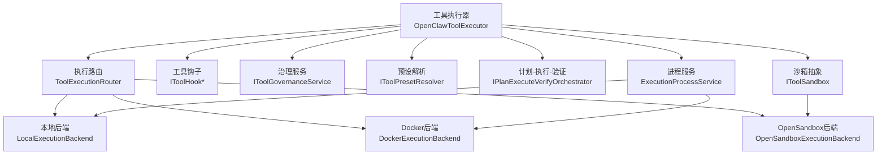
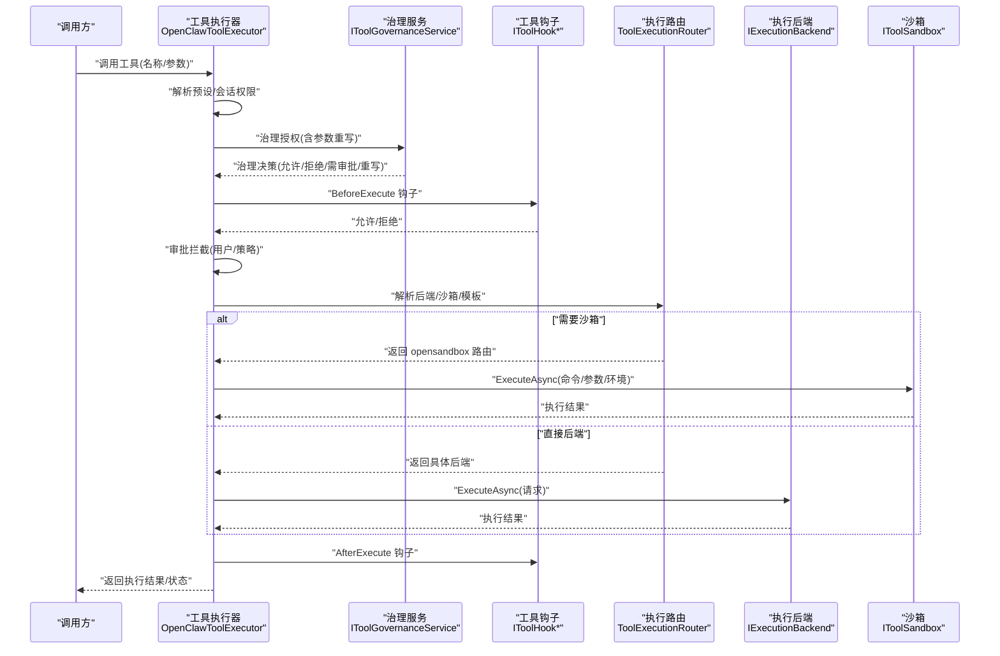
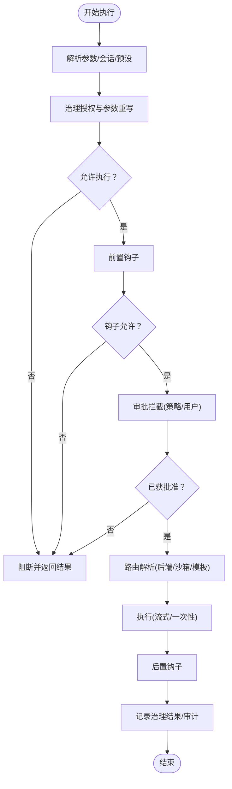
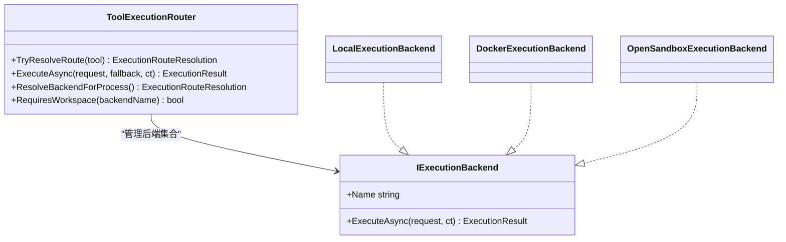
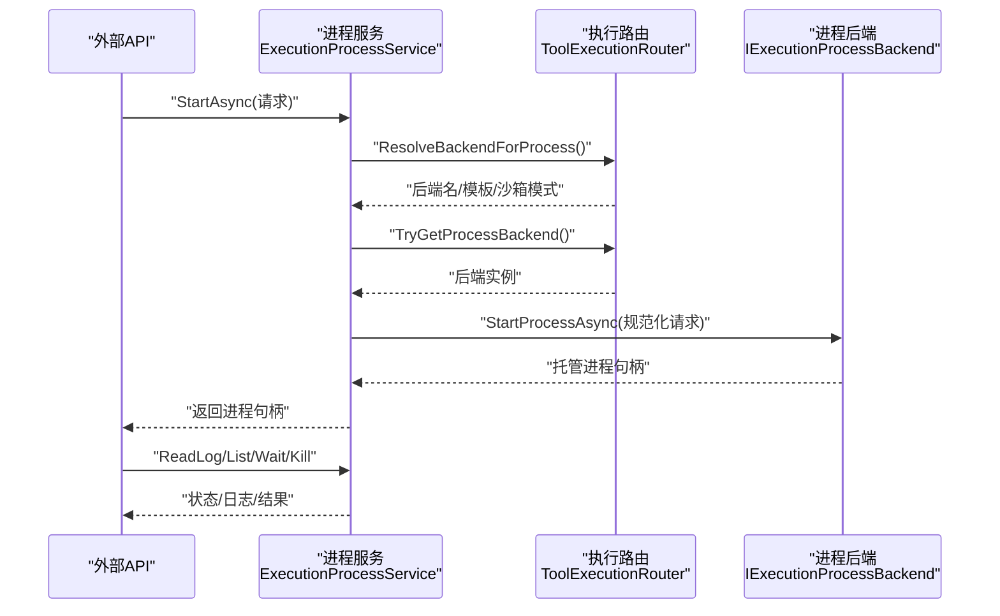
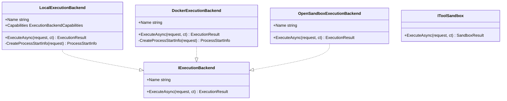
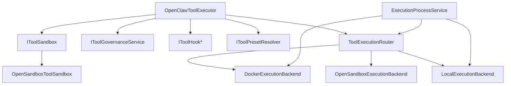

# 工具执行

<cite>
**本文引用的文件**
- [OpenClawToolExecutor.cs](file://src/OpenClaw.Agent/OpenClawToolExecutor.cs)
- [ToolExecutionRouter.cs](file://src/OpenClaw.Agent/Execution/ToolExecutionRouter.cs)
- [ExecutionProcessService.cs](file://src/OpenClaw.Agent/Execution/ExecutionProcessService.cs)
- [IExecutionBackend.cs](file://src/OpenClaw.Core/Abstractions/IExecutionBackend.cs)
- [LocalExecutionBackend.cs](file://src/OpenClaw.Agent/Execution/LocalExecutionBackend.cs)
- [DockerExecutionBackend.cs](file://src/OpenClaw.Agent/Execution/DockerExecutionBackend.cs)
- [OpenSandboxExecutionBackend.cs](file://src/OpenClaw.Agent/Execution/OpenSandboxExecutionBackend.cs)
- [IToolSandbox.cs](file://src/OpenClaw.Core/Abstractions/IToolSandbox.cs)
- [OpenSandboxToolSandbox.cs](file://src/OpenClawNet.Sandbox.OpenSandbox/OpenSandboxToolSandbox.cs)
- [OpenSandboxExecutionBackend.cs](file://src/OpenClaw.Agent/Execution/OpenSandboxExecutionBackend.cs)
- [ToolSandboxException.cs](file://src/OpenClaw.Core/Abstractions/ToolSandboxException.cs)
- [ProcessExecutionBackendBase.cs](file://src/OpenClaw.Agent/Execution/ProcessExecutionBackendBase.cs)
- [ExecutionModels.cs](file://src/OpenClaw.Core/Models/ExecutionModels.cs)
- [GatewayConfig.cs](file://src/OpenClaw.Core/Models/GatewayConfig.cs)
- [ToolGovernanceModels.cs](file://src/OpenClaw.Core/Models/ToolGovernanceModels.cs)
- [ToolActionPolicyResolver.cs](file://src/OpenClaw.Core/Pipeline/ToolActionPolicyResolver.cs)
- [ToolApprovalService.cs](file://src/OpenClaw.Core/Pipeline/ToolApprovalService.cs)
- [ToolUsageTracker.cs](file://src/OpenClaw.Core/Observability/ToolUsageTracker.cs)
- [RuntimeMetrics.cs](file://src/OpenClaw.Core/Observability/RuntimeMetrics.cs)
- [ToolAuditLog.cs](file://src/OpenClaw.Core/Observability/ToolAuditLog.cs)
- [IRedactionPipeline.cs](file://src/OpenClaw.Core/Security/IRedactionPipeline.cs)
- [ISentinelSubstitutionService.cs](file://src/OpenClaw.Core/Security/ISentinelSubstitutionService.cs)
- [ToolPresetResolver.cs](file://src/OpenClaw.Core/Pipeline/ToolPresetResolver.cs)
- [IPlanExecuteVerifyOrchestrator.cs](file://src/OpenClaw.Core/Abstractions/IPlanExecuteVerifyOrchestrator.cs)
- [NoopPlanExecuteVerifyOrchestrator.cs](file://src/OpenClaw.Core/Abstractions/NoopPlanExecuteVerifyOrchestrator.cs)
- [OpenSandboxOptions.cs](file://src/OpenClawNet.Sandbox.OpenSandbox/OpenSandboxOptions.cs)
- [OpenSandboxServiceCollectionExtensions.cs](file://src/OpenClawNet.Sandbox.OpenSandbox/OpenSandboxServiceCollectionExtensions.cs)
</cite>

## 目录
1. [简介](#简介)
2. [项目结构](#项目结构)
3. [核心组件](#核心组件)
4. [架构总览](#架构总览)
5. [详细组件分析](#详细组件分析)
6. [依赖关系分析](#依赖关系分析)
7. [性能考量](#性能考量)
8. [故障排除指南](#故障排除指南)
9. [结论](#结论)
10. [附录](#附录)

## 简介
本文件面向“工具执行系统”的技术文档，聚焦于工具执行器的核心逻辑、执行后端管理、进程服务协调与工具调用流程。内容涵盖工具声明与筛选、工具调用拦截（治理、审批、钩子）、执行后端选择策略、进程生命周期管理以及工具沙箱机制。文档提供实现细节、接口定义、配置选项与使用模式，并辅以流程图与时序图帮助理解。

## 项目结构
工具执行相关代码主要分布在以下模块：
- 执行器：OpenClawToolExecutor 负责工具声明、调用拦截、治理与审批、钩子、超时与错误处理、结果归档与审计。
- 执行路由：ToolExecutionRouter 负责根据工具与配置解析执行后端与沙箱模式。
- 进程服务：ExecutionProcessService 负责后台长任务进程的启动、状态查询、日志读取、输入写入与终止。
- 后端实现：LocalExecutionBackend、DockerExecutionBackend、OpenSandboxExecutionBackend 实现具体执行逻辑。
- 沙箱抽象：IToolSandbox 及 OpenSandboxToolSandbox 提供沙箱执行能力。
- 模型与配置：ExecutionModels、GatewayConfig、ToolGovernanceModels 等承载执行请求、后端配置与治理模型。
- 安全与可观测性：IRedactionPipeline、ISentinelSubstitutionService、ToolUsageTracker、RuntimeMetrics、ToolAuditLog 等贯穿执行链路。

图表来源
- [OpenClawToolExecutor.cs:30-100](file://src/OpenClaw.Agent/OpenClawToolExecutor.cs#L30-L100)
- [ToolExecutionRouter.cs:7-63](file://src/OpenClaw.Agent/Execution/ToolExecutionRouter.cs#L7-L63)
- [ExecutionProcessService.cs:278-299](file://src/OpenClaw.Agent/Execution/ExecutionProcessService.cs#L278-L299)
- [LocalExecutionBackend.cs:6-25](file://src/OpenClaw.Agent/Execution/LocalExecutionBackend.cs#L6-L25)
- [DockerExecutionBackend.cs:6-20](file://src/OpenClaw.Agent/Execution/DockerExecutionBackend.cs#L6-L20)
- [OpenSandboxExecutionBackend.cs:7-20](file://src/OpenClaw.Agent/Execution/OpenSandboxExecutionBackend.cs#L7-L20)
- [IToolSandbox.cs:5-10](file://src/OpenClaw.Core/Abstractions/IToolSandbox.cs#L5-L10)

章节来源
- [OpenClawToolExecutor.cs:30-100](file://src/OpenClaw.Agent/OpenClawToolExecutor.cs#L30-L100)
- [ToolExecutionRouter.cs:7-63](file://src/OpenClaw.Agent/Execution/ToolExecutionRouter.cs#L7-L63)
- [ExecutionProcessService.cs:278-299](file://src/OpenClaw.Agent/Execution/ExecutionProcessService.cs#L278-L299)

## 核心组件
- 工具执行器 OpenClawToolExecutor
  - 职责：构建工具声明、按会话与预设筛选工具、治理授权、审批拦截、钩子前后置回调、超时与异常处理、结果归档与审计。
  - 关键点：支持流式工具；原子替换 MCP 工具集；治理决策可重写参数；PEV 决策影响审批需求；审计与指标埋点。
- 执行路由 ToolExecutionRouter
  - 职责：解析工具到后端的路由，决定是否需要工作区与沙箱模式；支持回退后端；解析默认后端模板。
  - 关键点：支持配置化路由与沙箱策略；对 process/shell 工具有特殊默认路径。
- 进程服务 ExecutionProcessService
  - 职责：管理后台长任务进程的生命周期（启动、状态、日志、输入、终止）；超时监控；历史清理；运行事件上报。
  - 关键点：仅在隔离进程后端上启动后台进程；支持 PTY；限制保留数量与时间。
- 执行后端 IExecutionBackend 及其实现
  - IExecutionBackend：统一的执行接口。
  - LocalExecutionBackend：本地进程执行，支持工作区校验与环境注入。
  - DockerExecutionBackend：通过 docker CLI 在容器中执行命令。
  - OpenSandboxExecutionBackend：委托 IToolSandbox 执行，内置超时控制。
- 沙箱 IToolSandbox 与 OpenSandboxToolSandbox
  - IToolSandbox：抽象沙箱执行接口。
  - OpenSandboxToolSandbox：具体沙箱实现，提供安全隔离的执行环境。

章节来源
- [OpenClawToolExecutor.cs:30-100](file://src/OpenClaw.Agent/OpenClawToolExecutor.cs#L30-L100)
- [ToolExecutionRouter.cs:7-63](file://src/OpenClaw.Agent/Execution/ToolExecutionRouter.cs#L7-L63)
- [ExecutionProcessService.cs:278-299](file://src/OpenClaw.Agent/Execution/ExecutionProcessService.cs#L278-L299)
- [IExecutionBackend.cs:5-12](file://src/OpenClaw.Core/Abstractions/IExecutionBackend.cs#L5-L12)
- [LocalExecutionBackend.cs:6-25](file://src/OpenClaw.Agent/Execution/LocalExecutionBackend.cs#L6-L25)
- [DockerExecutionBackend.cs:6-20](file://src/OpenClaw.Agent/Execution/DockerExecutionBackend.cs#L6-L20)
- [OpenSandboxExecutionBackend.cs:7-20](file://src/OpenClaw.Agent/Execution/OpenSandboxExecutionBackend.cs#L7-L20)
- [IToolSandbox.cs:5-10](file://src/OpenClaw.Core/Abstractions/IToolSandbox.cs#L5-L10)
- [OpenSandboxToolSandbox.cs](file://src/OpenClawNet.Sandbox.OpenSandbox/OpenSandboxToolSandbox.cs)

## 架构总览
下图展示从工具调用到执行完成的关键交互：

图表来源
- [OpenClawToolExecutor.cs:134-630](file://src/OpenClaw.Agent/OpenClawToolExecutor.cs#L134-L630)
- [ToolExecutionRouter.cs:114-157](file://src/OpenClaw.Agent/Execution/ToolExecutionRouter.cs#L114-L157)
- [OpenSandboxExecutionBackend.cs:22-67](file://src/OpenClaw.Agent/Execution/OpenSandboxExecutionBackend.cs#L22-L67)
- [IToolSandbox.cs:7-9](file://src/OpenClaw.Core/Abstractions/IToolSandbox.cs#L7-L9)

## 详细组件分析

### 组件A：工具执行器 OpenClawToolExecutor
- 工具声明与筛选
  - 构建工具字典与声明列表；按会话与预设过滤可用工具；支持热更新替换 MCP 工具。
- 调用拦截与治理
  - 解析动作描述符与治理描述符；治理服务可重写参数或要求审批；记录治理结果与审计。
- 审批与钩子
  - 支持策略驱动的审批需求；前置钩子可阻断执行；后置钩子用于统计与观测。
- 流式与一次性工具
  - IStreamingTool 使用流式收集；非流式工具走路由执行。
- 超时与异常处理
  - 全局工具超时；沙箱异常分类；操作取消与超时区分；失败计数与指标上报。
- 结果归档与审计
  - 记录调用时长、失败原因、治理策略、字节数等；写入审计日志。

图表来源
- [OpenClawToolExecutor.cs:134-630](file://src/OpenClaw.Agent/OpenClawToolExecutor.cs#L134-L630)

章节来源
- [OpenClawToolExecutor.cs:30-100](file://src/OpenClaw.Agent/OpenClawToolExecutor.cs#L30-L100)
- [OpenClawToolExecutor.cs:134-630](file://src/OpenClaw.Agent/OpenClawToolExecutor.cs#L134-L630)

### 组件B：执行路由 ToolExecutionRouter
- 路由解析
  - 支持配置化工具到后端的映射；若工具未显式配置，则依据沙箱策略决定是否走 opensandbox；否则回退到默认后端。
- 沙箱模式
  - 基于配置与工具默认模式解析有效沙箱模式；记录解析来源与原因。
- 回退后端
  - 当主后端失败且允许回退时，自动尝试回退后端（排除本地回退的限制）。
- 默认后端
  - 对 process/shell 工具有特殊默认路径；否则使用配置的默认后端与模板。

图表来源
- [ToolExecutionRouter.cs:7-63](file://src/OpenClaw.Agent/Execution/ToolExecutionRouter.cs#L7-L63)
- [IExecutionBackend.cs:5-12](file://src/OpenClaw.Core/Abstractions/IExecutionBackend.cs#L5-L12)
- [LocalExecutionBackend.cs:6-25](file://src/OpenClaw.Agent/Execution/LocalExecutionBackend.cs#L6-L25)
- [DockerExecutionBackend.cs:6-20](file://src/OpenClaw.Agent/Execution/DockerExecutionBackend.cs#L6-L20)
- [OpenSandboxExecutionBackend.cs:7-20](file://src/OpenClaw.Agent/Execution/OpenSandboxExecutionBackend.cs#L7-L20)

章节来源
- [ToolExecutionRouter.cs:7-63](file://src/OpenClaw.Agent/Execution/ToolExecutionRouter.cs#L7-L63)

### 组件C：进程服务 ExecutionProcessService
- 生命周期管理
  - 启动：解析路由与后端能力，创建托管进程；注册退出回调与超时监控；上报运行事件。
  - 查询：按会话过滤列出状态；读取日志分片；等待退出。
  - 输入输出：向进程标准输入写入；读取 stdout/stderr 分片。
  - 终止：支持按会话终止；优雅关闭与强制杀死。
- 资源与历史
  - 限制保留的已完成进程数量与时间；定期清理；记录指标。
- 能力约束
  - 拒绝在不支持的后端上启动后台进程；拒绝不支持 PTY 的后端。

图表来源
- [ExecutionProcessService.cs:301-377](file://src/OpenClaw.Agent/Execution/ExecutionProcessService.cs#L301-L377)
- [ToolExecutionRouter.cs:164-203](file://src/OpenClaw.Agent/Execution/ToolExecutionRouter.cs#L164-L203)

章节来源
- [ExecutionProcessService.cs:278-299](file://src/OpenClaw.Agent/Execution/ExecutionProcessService.cs#L278-L299)
- [ExecutionProcessService.cs:301-377](file://src/OpenClaw.Agent/Execution/ExecutionProcessService.cs#L301-L377)
- [ExecutionProcessService.cs:379-451](file://src/OpenClaw.Agent/Execution/ExecutionProcessService.cs#L379-L451)

### 组件D：执行后端与沙箱
- IExecutionBackend 接口
  - 统一的执行入口，接收 ExecutionRequest 并返回 ExecutionResult。
- LocalExecutionBackend
  - 本地进程执行；支持工作区校验；环境变量合并；支持 PTY 与交互输入。
- DockerExecutionBackend
  - 通过 docker CLI 运行容器；支持镜像、工作目录、环境变量注入。
- OpenSandboxExecutionBackend
  - 将执行委托给 IToolSandbox；内置超时控制；返回标准化结果。
- IToolSandbox 抽象
  - ExecuteAsync 接收 SandboxExecutionRequest，返回 SandboxResult。
- OpenSandboxToolSandbox
  - 具体沙箱实现，提供安全隔离执行环境。

图表来源
- [IExecutionBackend.cs:5-12](file://src/OpenClaw.Core/Abstractions/IExecutionBackend.cs#L5-L12)
- [LocalExecutionBackend.cs:6-25](file://src/OpenClaw.Agent/Execution/LocalExecutionBackend.cs#L6-L25)
- [DockerExecutionBackend.cs:6-20](file://src/OpenClaw.Agent/Execution/DockerExecutionBackend.cs#L6-L20)
- [OpenSandboxExecutionBackend.cs:7-20](file://src/OpenClaw.Agent/Execution/OpenSandboxExecutionBackend.cs#L7-L20)
- [IToolSandbox.cs:5-10](file://src/OpenClaw.Core/Abstractions/IToolSandbox.cs#L5-L10)

章节来源
- [IExecutionBackend.cs:5-12](file://src/OpenClaw.Core/Abstractions/IExecutionBackend.cs#L5-L12)
- [LocalExecutionBackend.cs:6-25](file://src/OpenClaw.Agent/Execution/LocalExecutionBackend.cs#L6-L25)
- [DockerExecutionBackend.cs:6-20](file://src/OpenClaw.Agent/Execution/DockerExecutionBackend.cs#L6-L20)
- [OpenSandboxExecutionBackend.cs:7-20](file://src/OpenClaw.Agent/Execution/OpenSandboxExecutionBackend.cs#L7-L20)
- [IToolSandbox.cs:5-10](file://src/OpenClaw.Core/Abstractions/IToolSandbox.cs#L5-L10)
- [OpenSandboxToolSandbox.cs](file://src/OpenClawNet.Sandbox.OpenSandbox/OpenSandboxToolSandbox.cs)

## 依赖关系分析
- 执行器依赖
  - 路由器：用于解析后端与沙箱。
  - 治理服务：用于授权与参数重写。
  - 预设解析器：用于按会话筛选工具。
  - 钩子：用于前置/后置拦截与观测。
  - 沙箱：用于需要隔离的工具执行。
  - 审计与指标：贯穿执行链路。
- 路由器依赖
  - 后端集合：本地、Docker、SSH、OpenSandbox。
  - 配置：ExecutionProfiles、ExecutionTools、默认后端。
- 进程服务依赖
  - 路由器：解析后端与模板。
  - 后端：必须为进程后端（如 Docker/SSH）。
- 沙箱依赖
  - OpenSandboxToolSandbox：提供具体沙箱实现。
  - OpenSandboxOptions/扩展：配置沙箱行为。

图表来源
- [OpenClawToolExecutor.cs:42-49](file://src/OpenClaw.Agent/OpenClawToolExecutor.cs#L42-L49)
- [ToolExecutionRouter.cs:20-62](file://src/OpenClaw.Agent/Execution/ToolExecutionRouter.cs#L20-L62)
- [ExecutionProcessService.cs:294-299](file://src/OpenClaw.Agent/Execution/ExecutionProcessService.cs#L294-L299)
- [OpenSandboxToolSandbox.cs](file://src/OpenClawNet.Sandbox.OpenSandbox/OpenSandboxToolSandbox.cs)

章节来源
- [OpenClawToolExecutor.cs:42-49](file://src/OpenClaw.Agent/OpenClawToolExecutor.cs#L42-L49)
- [ToolExecutionRouter.cs:20-62](file://src/OpenClaw.Agent/Execution/ToolExecutionRouter.cs#L20-L62)
- [ExecutionProcessService.cs:294-299](file://src/OpenClaw.Agent/Execution/ExecutionProcessService.cs#L294-L299)

## 性能考量
- 超时与并发
  - 工具级超时与沙箱超时双重控制；流式工具采用独立取消令牌；后台进程超时监控。
- 资源占用
  - 进程历史保留上限与过期时间控制内存占用；完成后台进程异步释放。
- 观测与度量
  - 计数器覆盖失败、超时、完成、终止、历史淘汰；运行时事件用于调试与告警。
- I/O 与缓冲
  - 日志读取采用分片与偏移，避免大块数据拷贝；标准输出/错误分别缓冲。

## 故障排除指南
- 工具未知或被会话/预设禁止
  - 现象：立即返回失败，提示使用已声明工具或放宽预设。
  - 处理：检查工具声明与预设解析；确认会话允许工具列表。
- 治理拒绝或不可用
  - 现象：根据治理决策返回阻断或提示检查侧车可用性。
  - 处理：调整治理策略或修复侧车；必要时切换 fail-open/fail-closed。
- 需要审批但无审批通道
  - 现象：自动拒绝，建议使用支持交互审批的表面或降低要求。
  - 处理：启用浏览器聊天或在受信本地会话禁用审批。
- 沙箱执行失败
  - 现象：返回阻断结果，失败码分类处理。
  - 处理：检查沙箱配置与能力；查看沙箱异常信息。
- 后端不支持后台进程
  - 现象：启动后台进程时报错，提示路由到进程后端或禁用沙箱。
  - 处理：将 process 工具路由到 Docker/SSH；或降低沙箱要求。
- PTY 不支持
  - 现象：请求 PTY 但后端不支持。
  - 处理：更换支持 PTY 的后端或关闭 PTY。
- 进程历史过多
  - 现象：历史进程被清理。
  - 处理：定期轮询清理正常；关注保留上限与过期时间。

章节来源
- [OpenClawToolExecutor.cs:167-196](file://src/OpenClaw.Agent/OpenClawToolExecutor.cs#L167-L196)
- [OpenClawToolExecutor.cs:275-305](file://src/OpenClaw.Agent/OpenClawToolExecutor.cs#L275-L305)
- [OpenClawToolExecutor.cs:410-432](file://src/OpenClaw.Agent/OpenClawToolExecutor.cs#L410-L432)
- [ToolSandboxException.cs](file://src/OpenClaw.Core/Abstractions/ToolSandboxException.cs)
- [ExecutionProcessService.cs:306-321](file://src/OpenClaw.Agent/Execution/ExecutionProcessService.cs#L306-L321)
- [ExecutionProcessService.cs:337-338](file://src/OpenClaw.Agent/Execution/ExecutionProcessService.cs#L337-L338)
- [ExecutionProcessService.cs:491-520](file://src/OpenClaw.Agent/Execution/ExecutionProcessService.cs#L491-L520)

## 结论
工具执行系统通过“执行器 + 路由器 + 进程服务 + 后端/沙箱”的分层设计，实现了灵活、可观测、可扩展的工具执行能力。执行器负责策略与治理拦截，路由器负责后端与沙箱选择，进程服务负责后台任务生命周期管理，后端与沙箱提供执行载体。该架构既满足本地开发场景，也支持容器与沙箱隔离的生产环境。

## 附录
- 关键接口与模型
  - IExecutionBackend、ExecutionRequest/ExecutionResult
  - IToolSandbox、SandboxExecutionRequest/SandboxResult
  - GatewayConfig、ExecutionToolRouteConfig、ExecutionBackendProfileConfig
  - ToolGovernanceContext/GovernanceDecision
- 配置要点
  - ExecutionProfiles：后端类型、镜像/工作目录、环境变量、超时。
  - Execution.Tools：工具到后端的显式路由。
  - Tooling：工具超时、审批要求、允许工具列表、工作区根路径。
  - OpenSandbox：超时、模板、能力开关。
- 使用模式
  - 工具声明：在构造执行器时传入工具集合；支持热更新替换。
  - 流式工具：实现 IStreamingTool；在执行时传入 onDelta 回调。
  - 后台进程：通过 ExecutionProcessService 启动；确保后端支持进程能力。
  - 沙箱工具：实现 ISandboxCapableTool；通过路由自动进入 opensandbox。

章节来源
- [ExecutionModels.cs](file://src/OpenClaw.Core/Models/ExecutionModels.cs)
- [GatewayConfig.cs](file://src/OpenClaw.Core/Models/GatewayConfig.cs)
- [ToolGovernanceModels.cs](file://src/OpenClaw.Core/Models/ToolGovernanceModels.cs)
- [OpenSandboxOptions.cs](file://src/OpenClawNet.Sandbox.OpenSandbox/OpenSandboxOptions.cs)
- [OpenSandboxServiceCollectionExtensions.cs](file://src/OpenClawNet.Sandbox.OpenSandbox/OpenSandboxServiceCollectionExtensions.cs)