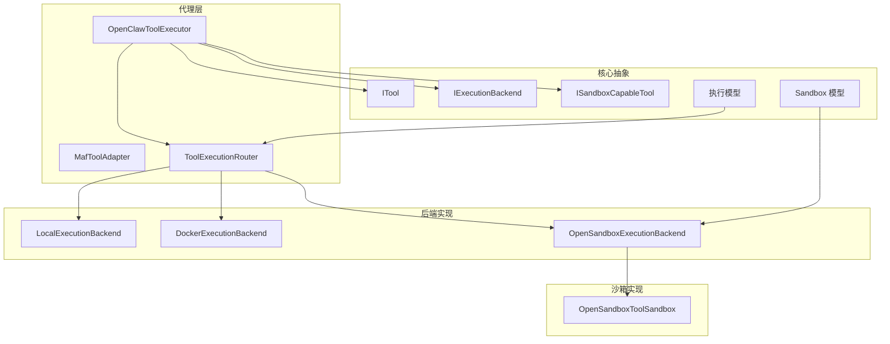
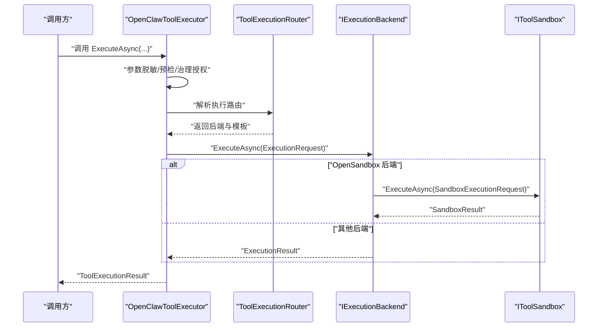
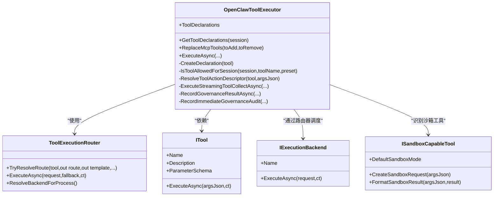
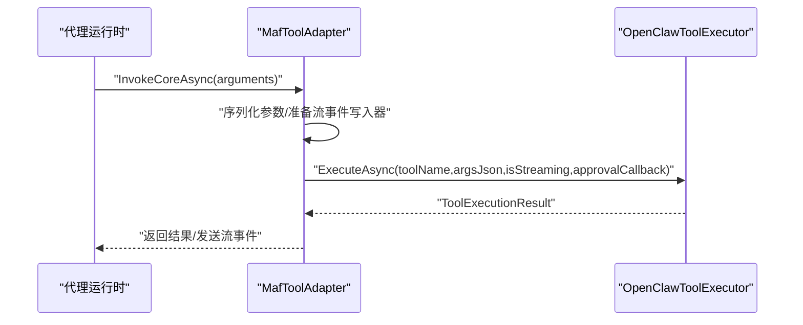
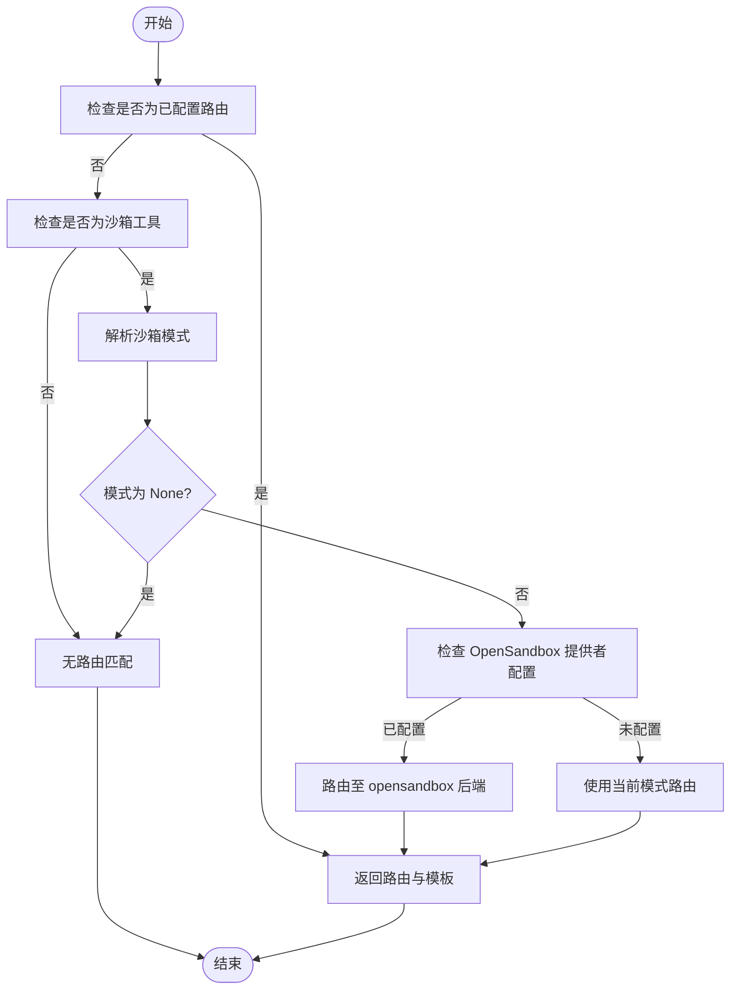
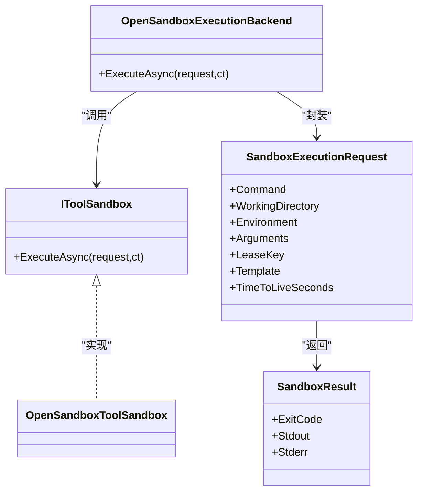
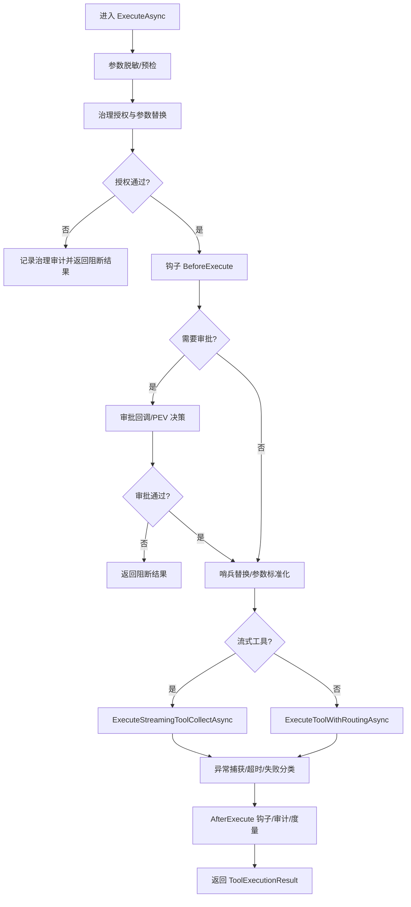
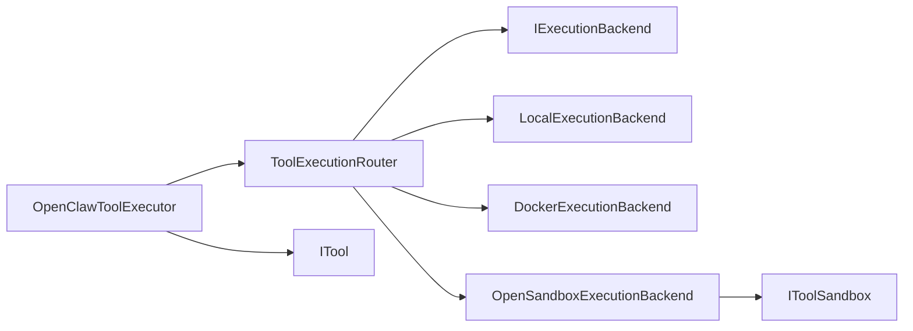

# 工具执行框架

<cite>
**本文引用的文件**
- [OpenClawToolExecutor.cs](file://src/OpenClaw.Agent/OpenClawToolExecutor.cs)
- [ITool.cs](file://src/OpenClaw.Core/Abstractions/ITool.cs)
- [MafToolAdapter.cs](file://src/OpenClaw.Agent/MafToolAdapter.cs)
- [ToolExecutionRouter.cs](file://src/OpenClaw.Agent/Execution/ToolExecutionRouter.cs)
- [LocalExecutionBackend.cs](file://src/OpenClaw.Agent/Execution/LocalExecutionBackend.cs)
- [DockerExecutionBackend.cs](file://src/OpenClaw.Agent/Execution/DockerExecutionBackend.cs)
- [OpenSandboxExecutionBackend.cs](file://src/OpenClaw.Agent/Execution/OpenSandboxExecutionBackend.cs)
- [IExecutionBackend.cs](file://src/OpenClaw.Core/Abstractions/IExecutionBackend.cs)
- [ISandboxCapableTool.cs](file://src/OpenClaw.Core/Abstractions/ISandboxCapableTool.cs)
- [SandboxModels.cs](file://src/OpenClaw.Core/Models/SandboxModels.cs)
- [ExecutionModels.cs](file://src/OpenClaw.Core/Models/ExecutionModels.cs)
- [ToolSandboxException.cs](file://src/OpenClaw.Core/Abstractions/ToolSandboxException.cs)
- [OpenSandboxToolSandbox.cs](file://src/OpenClawNet.Sandbox.OpenSandbox/OpenSandboxToolSandbox.cs)
- [OpenSandboxToolSandboxTests.cs](file://src/OpenClaw.Tests/OpenSandboxToolSandboxTests.cs)
- [OpenClawToolExecutorTests.cs](file://src/OpenClaw.Tests/OpenClawToolExecutorTests.cs)
</cite>

## 目录
1. [简介](#简介)
2. [项目结构](#项目结构)
3. [核心组件](#核心组件)
4. [架构总览](#架构总览)
5. [详细组件分析](#详细组件分析)
6. [依赖分析](#依赖分析)
7. [性能考虑](#性能考虑)
8. [故障排查指南](#故障排查指南)
9. [结论](#结论)
10. [附录](#附录)

## 简介
本技术文档系统性阐述工具执行框架的设计与实现，重点覆盖以下方面：
- 工具发现、注册、调用与管理机制
- OpenClawToolExecutor 的工作原理与执行流水线
- 工具适配器模式（MafToolAdapter）
- 沙箱执行环境与后端路由（ToolExecutionRouter）及多后端实现
- 权限控制、超时管理、错误处理与重试策略
- 回调机制、审计日志与治理记录
- 工具开发指南、性能监控与调试技巧
- 工具与代理运行时、安全策略的集成关系

## 项目结构
工具执行框架主要分布在以下模块：
- 代理层：工具执行器、工具适配器、执行路由
- 核心抽象与模型：工具接口、执行后端接口、沙箱能力接口、执行与沙箱模型
- 后端实现：本地、Docker、OpenSandbox 执行后端
- 沙箱实现：OpenSandbox 工具沙箱
- 测试：执行器与沙箱相关测试

**图表来源**
- [OpenClawToolExecutor.cs:30-100](file://src/OpenClaw.Agent/OpenClawToolExecutor.cs#L30-L100)
- [MafToolAdapter.cs:9-21](file://src/OpenClaw.Agent/MafToolAdapter.cs#L9-L21)
- [ToolExecutionRouter.cs:7-63](file://src/OpenClaw.Agent/Execution/ToolExecutionRouter.cs#L7-L63)
- [LocalExecutionBackend.cs:6-28](file://src/OpenClaw.Agent/Execution/LocalExecutionBackend.cs#L6-L28)
- [DockerExecutionBackend.cs:6-20](file://src/OpenClaw.Agent/Execution/DockerExecutionBackend.cs#L6-L20)
- [OpenSandboxExecutionBackend.cs:7-22](file://src/OpenClaw.Agent/Execution/OpenSandboxExecutionBackend.cs#L7-L22)
- [ISandboxCapableTool.cs:5-12](file://src/OpenClaw.Core/Abstractions/ISandboxCapableTool.cs#L5-L12)
- [SandboxModels.cs:3-27](file://src/OpenClaw.Core/Models/SandboxModels.cs#L3-L27)
- [ExecutionModels.cs:8-86](file://src/OpenClaw.Core/Models/ExecutionModels.cs#L8-L86)

**章节来源**
- [OpenClawToolExecutor.cs:30-100](file://src/OpenClaw.Agent/OpenClawToolExecutor.cs#L30-L100)
- [ToolExecutionRouter.cs:7-63](file://src/OpenClaw.Agent/Execution/ToolExecutionRouter.cs#L7-L63)

## 核心组件
- 工具接口 ITool：最小化设计，仅包含名称、描述、参数模式与异步执行方法，便于 AOT 剪枝。
- 执行后端接口 IExecutionBackend：统一后端执行契约，支持不同执行环境（本地、Docker、SSH、OpenSandbox）。
- 沙箱能力接口 ISandboxCapableTool：声明默认沙箱模式、创建沙箱请求与格式化结果。
- 执行与沙箱模型：定义执行配置、后端配置、路由配置、执行请求/结果、沙箱请求/结果与沙箱模式枚举。

**章节来源**
- [ITool.cs:6-16](file://src/OpenClaw.Core/Abstractions/ITool.cs#L6-L16)
- [IExecutionBackend.cs:5-12](file://src/OpenClaw.Core/Abstractions/IExecutionBackend.cs#L5-L12)
- [ISandboxCapableTool.cs:5-12](file://src/OpenClaw.Core/Abstractions/ISandboxCapableTool.cs#L5-L12)
- [ExecutionModels.cs:8-86](file://src/OpenClaw.Core/Models/ExecutionModels.cs#L8-L86)
- [SandboxModels.cs:3-27](file://src/OpenClaw.Core/Models/SandboxModels.cs#L3-L27)

## 架构总览
工具执行框架采用“执行器 + 路由器 + 多后端”的分层架构：
- OpenClawToolExecutor 负责工具生命周期管理、权限与治理决策、超时与错误处理、钩子与审计、使用量统计与指标上报。
- ToolExecutionRouter 负责根据配置与工具特性解析执行路由，选择后端与模板，并在失败时进行回退。
- 各 ExecutionBackend 实现具体执行逻辑；OpenSandboxExecutionBackend 将执行委托给 IToolSandbox 实现。

**图表来源**
- [OpenClawToolExecutor.cs:134-630](file://src/OpenClaw.Agent/OpenClawToolExecutor.cs#L134-L630)
- [ToolExecutionRouter.cs:114-157](file://src/OpenClaw.Agent/Execution/ToolExecutionRouter.cs#L114-L157)
- [OpenSandboxExecutionBackend.cs:22-67](file://src/OpenClaw.Agent/Execution/OpenSandboxExecutionBackend.cs#L22-L67)
- [OpenSandboxToolSandbox.cs](file://src/OpenClawNet.Sandbox.OpenSandbox/OpenSandboxToolSandbox.cs)

## 详细组件分析

### OpenClawToolExecutor 组件分析
OpenClawToolExecutor 是工具执行的核心编排器，负责：
- 工具注册与声明：构建工具字典与 AI 工具声明列表，支持热重载替换 MCP 工具。
- 会话与预设过滤：按会话允许工具集与工具预设筛选可调用工具。
- 权限与治理：整合工具治理服务进行授权、参数红/替换、不可用降级策略。
- 钩子与审批：在执行前后触发钩子，支持交互式审批回调。
- 流式与非流式执行：对 IStreamingTool 支持增量回调，非流式聚合结果。
- 超时与错误分类：统一异常捕获、超时判定、失败分类与度量上报。
- 审计与使用统计：记录治理结果、审计条目、工具使用追踪与指标。

**图表来源**
- [OpenClawToolExecutor.cs:30-100](file://src/OpenClaw.Agent/OpenClawToolExecutor.cs#L30-L100)
- [ToolExecutionRouter.cs:7-63](file://src/OpenClaw.Agent/Execution/ToolExecutionRouter.cs#L7-L63)
- [ITool.cs:6-16](file://src/OpenClaw.Core/Abstractions/ITool.cs#L6-L16)
- [ISandboxCapableTool.cs:5-12](file://src/OpenClaw.Core/Abstractions/ISandboxCapableTool.cs#L5-L12)

**章节来源**
- [OpenClawToolExecutor.cs:104-132](file://src/OpenClaw.Agent/OpenClawToolExecutor.cs#L104-L132)
- [OpenClawToolExecutor.cs:134-630](file://src/OpenClaw.Agent/OpenClawToolExecutor.cs#L134-L630)

### 工具适配器模式（MafToolAdapter）
MafToolAdapter 将 ITool 适配为 AIFunction，桥接代理运行时与工具执行器：
- 解析工具参数模式，序列化调用参数
- 在流式场景下通过流事件写入器发送工具开始/增量/完成事件
- 调用 OpenClawToolExecutor.ExecuteAsync 并收集调用结果

**图表来源**
- [MafToolAdapter.cs:31-61](file://src/OpenClaw.Agent/MafToolAdapter.cs#L31-L61)
- [OpenClawToolExecutor.cs:134-161](file://src/OpenClaw.Agent/OpenClawToolExecutor.cs#L134-L161)

**章节来源**
- [MafToolAdapter.cs:9-62](file://src/OpenClaw.Agent/MafToolAdapter.cs#L9-L62)

### 执行路由与后端实现
ToolExecutionRouter 根据配置与工具特性解析执行路由：
- 配置优先：若为已配置路由，直接返回后端与模板
- 沙箱能力：对 ISandboxCapableTool 解析沙箱模式，必要时回退到 OpenSandbox 后端
- 回退策略：当首选后端失败且允许回退时，尝试备用后端
- 进程后端判定：判断是否为隔离进程后端，用于安全与资源管理

**图表来源**
- [ToolExecutionRouter.cs:65-112](file://src/OpenClaw.Agent/Execution/ToolExecutionRouter.cs#L65-L112)

**章节来源**
- [ToolExecutionRouter.cs:20-63](file://src/OpenClaw.Agent/Execution/ToolExecutionRouter.cs#L20-L63)
- [ToolExecutionRouter.cs:114-157](file://src/OpenClaw.Agent/Execution/ToolExecutionRouter.cs#L114-L157)
- [ToolExecutionRouter.cs:164-203](file://src/OpenClaw.Agent/Execution/ToolExecutionRouter.cs#L164-L203)
- [ToolExecutionRouter.cs:236-251](file://src/OpenClaw.Agent/Execution/ToolExecutionRouter.cs#L236-L251)

#### 后端实现要点
- LocalExecutionBackend：本地进程执行，支持工作目录校验、环境变量注入、交互式输入与 PTY（非 Windows）
- DockerExecutionBackend：通过 docker CLI 运行容器，支持镜像、工作目录、环境变量与命令参数拼装
- OpenSandboxExecutionBackend：将执行请求转换为 SandboxExecutionRequest，交由 IToolSandbox 执行并处理超时

**章节来源**
- [LocalExecutionBackend.cs:27-99](file://src/OpenClaw.Agent/Execution/LocalExecutionBackend.cs#L27-L99)
- [DockerExecutionBackend.cs:19-66](file://src/OpenClaw.Agent/Execution/DockerExecutionBackend.cs#L19-L66)
- [OpenSandboxExecutionBackend.cs:22-67](file://src/OpenClaw.Agent/Execution/OpenSandboxExecutionBackend.cs#L22-L67)

### 沙箱执行环境
- IToolSandbox：统一沙箱执行接口，接收命令、参数、环境变量、工作目录、模板与租约信息
- SandboxExecutionRequest/SandboxResult：沙箱请求/结果模型
- OpenSandboxToolSandbox：OpenSandbox 提供商的具体实现（位于 OpenSandbox 包中）

**图表来源**
- [IToolSandbox.cs:5-10](file://src/OpenClaw.Core/Abstractions/IToolSandbox.cs#L5-L10)
- [SandboxModels.cs:10-27](file://src/OpenClaw.Core/Models/SandboxModels.cs#L10-L27)
- [OpenSandboxExecutionBackend.cs:22-67](file://src/OpenClaw.Agent/Execution/OpenSandboxExecutionBackend.cs#L22-L67)
- [OpenSandboxToolSandbox.cs](file://src/OpenClawNet.Sandbox.OpenSandbox/OpenSandboxToolSandbox.cs)

**章节来源**
- [IToolSandbox.cs:5-10](file://src/OpenClaw.Core/Abstractions/IToolSandbox.cs#L5-L10)
- [SandboxModels.cs:10-27](file://src/OpenClaw.Core/Models/SandboxModels.cs#L10-L27)
- [OpenSandboxExecutionBackend.cs:13-67](file://src/OpenClaw.Agent/Execution/OpenSandboxExecutionBackend.cs#L13-L67)

### 权限控制、超时管理、错误处理与重试
- 权限与治理：工具治理服务授权、参数红/替换、不可用降级策略；记录治理结果与审计
- 超时管理：工具级超时与沙箱超时，统一异常分类与度量上报
- 错误处理：区分操作员鉴权缺失、浏览器后端缺失、运行时能力不可用等特殊失败码；流式工具增量收集
- 重试机制：框架未内置自动重试，但提供治理不可用提示与回退后端策略

**图表来源**
- [OpenClawToolExecutor.cs:134-630](file://src/OpenClaw.Agent/OpenClawToolExecutor.cs#L134-L630)

**章节来源**
- [OpenClawToolExecutor.cs:163-630](file://src/OpenClaw.Agent/OpenClawToolExecutor.cs#L163-L630)

### 回调机制、审计日志与治理记录
- 审计日志：记录工具调用时间、失败/超时、治理决策、参数与结果大小等
- 治理记录：向治理服务上报执行结果，包含状态、失败码、耗时、字节数等
- 钩子：BeforeExecute/AfterExecute 两阶段钩子，支持上下文感知钩子

**章节来源**
- [OpenClawToolExecutor.cs:545-597](file://src/OpenClaw.Agent/OpenClawToolExecutor.cs#L545-L597)
- [OpenClawToolExecutor.cs:703-736](file://src/OpenClaw.Agent/OpenClawToolExecutor.cs#L703-L736)
- [OpenClawToolExecutor.cs:746-767](file://src/OpenClaw.Agent/OpenClawToolExecutor.cs#L746-L767)

### 工具开发指南
- 实现 ITool：提供 Name、Description、ParameterSchema 与 ExecuteAsync
- 可选实现 ISandboxCapableTool：声明默认沙箱模式、创建沙箱请求与格式化结果
- 参数模式：遵循 JSON Schema 规范，确保运行时正确序列化与反序列化
- 流式工具：实现 IStreamingTool 以支持增量回调
- 安全与合规：利用治理与红/替换管道，避免敏感信息泄露与越权行为

**章节来源**
- [ITool.cs:6-16](file://src/OpenClaw.Core/Abstractions/ITool.cs#L6-L16)
- [ISandboxCapableTool.cs:5-12](file://src/OpenClaw.Core/Abstractions/ISandboxCapableTool.cs#L5-L12)

### 性能监控与调试技巧
- 指标与度量：工具调用次数、失败次数、超时次数、执行耗时直方图
- 使用追踪：记录工具调用耗时与失败/超时状态
- 调试建议：启用详细日志、使用审计日志定位治理拒绝原因、验证工作目录与环境变量配置

**章节来源**
- [OpenClawToolExecutor.cs:536-542](file://src/OpenClaw.Agent/OpenClawToolExecutor.cs#L536-L542)

## 依赖分析
- 组件耦合与内聚：OpenClawToolExecutor 对外通过 ITool、IExecutionBackend、IToolSandbox 等接口解耦，内聚于治理、钩子、审计与指标
- 直接与间接依赖：执行器依赖路由器与后端；路由器依赖后端实现与沙箱；沙箱后端依赖 IToolSandbox
- 外部依赖：Docker CLI、OpenSandbox 提供商、运行时能力（PTY、交互式输入）

**图表来源**
- [OpenClawToolExecutor.cs:44-49](file://src/OpenClaw.Agent/OpenClawToolExecutor.cs#L44-L49)
- [ToolExecutionRouter.cs:16-62](file://src/OpenClaw.Agent/Execution/ToolExecutionRouter.cs#L16-L62)
- [OpenSandboxExecutionBackend.cs:9-18](file://src/OpenClaw.Agent/Execution/OpenSandboxExecutionBackend.cs#L9-L18)

**章节来源**
- [OpenClawToolExecutor.cs:44-49](file://src/OpenClaw.Agent/OpenClawToolExecutor.cs#L44-L49)
- [ToolExecutionRouter.cs:16-62](file://src/OpenClaw.Agent/Execution/ToolExecutionRouter.cs#L16-L62)

## 性能考虑
- 超时设置：工具级超时与后端超时需结合任务类型合理配置，避免过短导致误判或过长影响响应
- 资源隔离：优先使用 OpenSandbox 或 Docker 后端隔离执行环境，降低相互影响
- 日志与审计：适度开启审计与治理记录，避免高频写入影响性能
- 流式输出：对长耗时工具启用流式回调，提升用户体验并减少一次性大块输出

## 故障排查指南
- 工具未知/被阻断：检查工具注册、会话预设与治理授权；查看阻断原因与下一步建议
- 治理不可用：依据治理不可用提示调整策略或回退通道
- 超时问题：检查后端超时配置、任务复杂度与资源限制
- 沙箱异常：关注 ToolSandboxException 分类与失败码，核对沙箱提供商配置
- 审计与钩子：通过审计日志定位治理拒绝与钩子异常

**章节来源**
- [OpenClawToolExecutor.cs:167-196](file://src/OpenClaw.Agent/OpenClawToolExecutor.cs#L167-L196)
- [OpenClawToolExecutor.cs:275-305](file://src/OpenClaw.Agent/OpenClawToolExecutor.cs#L275-L305)
- [OpenClawToolExecutor.cs:483-530](file://src/OpenClaw.Agent/OpenClawToolExecutor.cs#L483-L530)
- [ToolSandboxException.cs](file://src/OpenClaw.Core/Abstractions/ToolSandboxException.cs)

## 结论
工具执行框架通过清晰的分层与接口抽象，实现了从工具发现、注册、治理授权、权限控制、超时与错误处理到审计与指标的完整闭环。配合多后端与沙箱执行能力，既满足本地开发的灵活性，又兼顾生产环境的安全与隔离需求。建议在实际部署中结合业务场景优化超时与回退策略，并充分利用审计与治理记录进行持续改进。

## 附录
- 关键模型与配置参考路径：
  - [ExecutionModels.cs:8-86](file://src/OpenClaw.Core/Models/ExecutionModels.cs#L8-L86)
  - [SandboxModels.cs:3-27](file://src/OpenClaw.Core/Models/SandboxModels.cs#L3-L27)
- 相关测试参考路径：
  - [OpenClawToolExecutorTests.cs](file://src/OpenClaw.Tests/OpenClawToolExecutorTests.cs)
  - [OpenSandboxToolSandboxTests.cs](file://src/OpenClaw.Tests/OpenSandboxToolSandboxTests.cs)