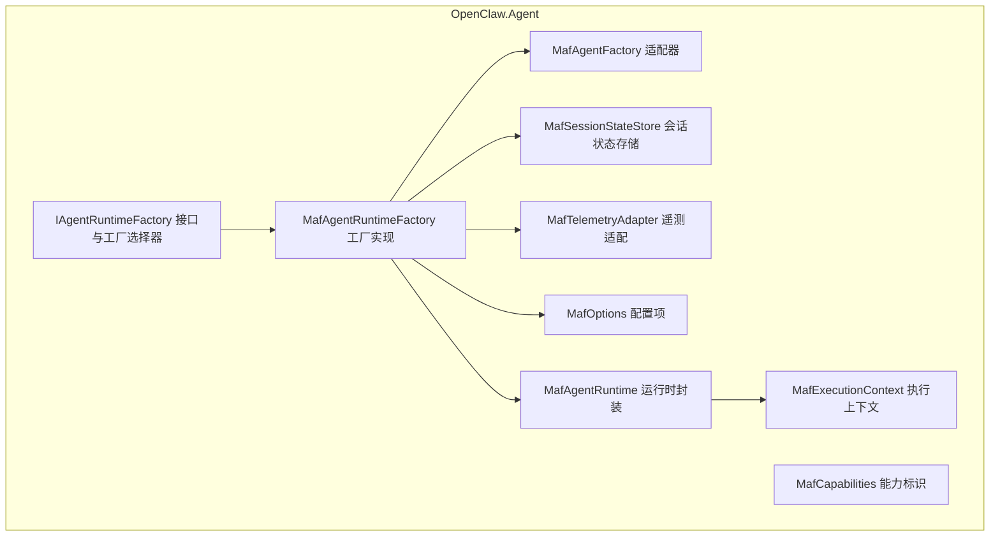
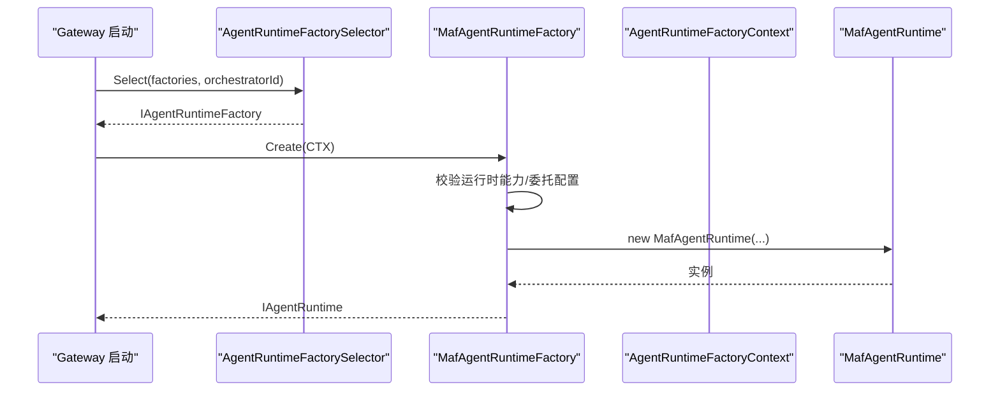
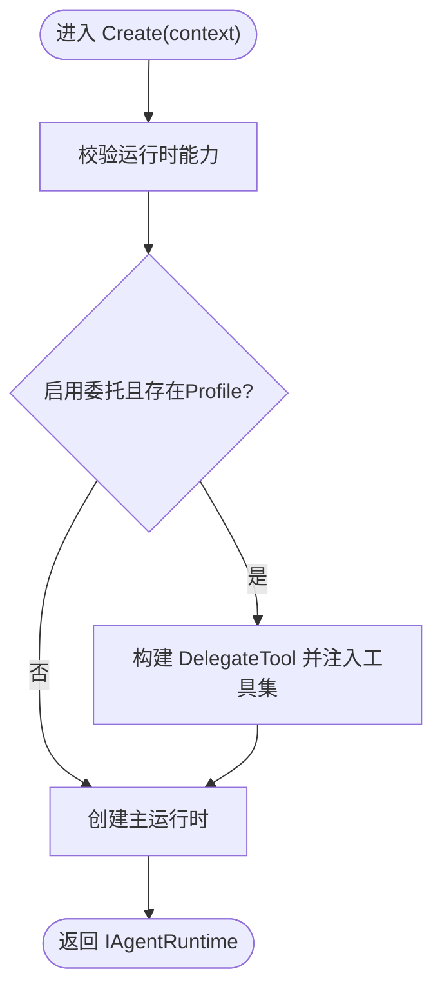
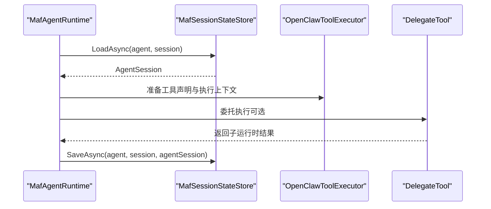
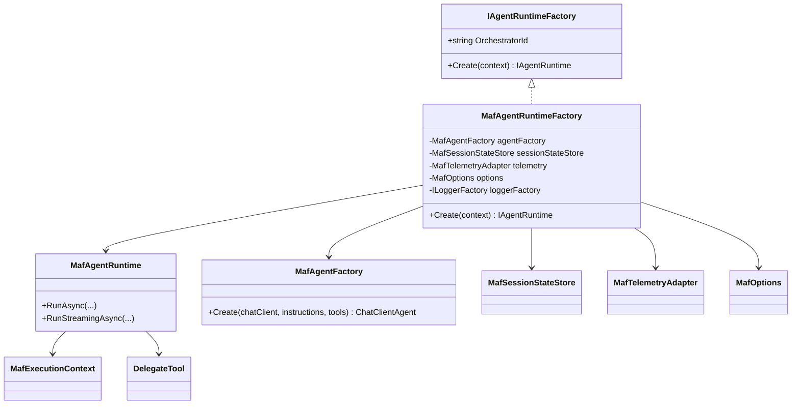

# 工厂模式实现

<cite>
**本文引用的文件**
- [MafAgentRuntimeFactory.cs](file://src/OpenClaw.Agent/MafAgentRuntimeFactory.cs)
- [IAgentRuntimeFactory.cs](file://src/OpenClaw.Agent/IAgentRuntimeFactory.cs)
- [MafAgentFactory.cs](file://src/OpenClaw.Agent/MafAgentFactory.cs)
- [MafServiceCollectionExtensions.cs](file://src/OpenClaw.Agent/MafServiceCollectionExtensions.cs)
- [MafOptions.cs](file://src/OpenClaw.Agent/MafOptions.cs)
- [MafCapabilities.cs](file://src/OpenClaw.Agent/MafCapabilities.cs)
- [MafExecutionContext.cs](file://src/OpenClaw.Agent/MafExecutionContext.cs)
- [MafSessionStateStore.cs](file://src/OpenClaw.Agent/MafSessionStateStore.cs)
- [MafTelemetryAdapter.cs](file://src/OpenClaw.Agent/MafTelemetryAdapter.cs)
- [MafAgentRuntime.cs](file://src/OpenClaw.Agent/MafAgentRuntime.cs)
- [DelegateTool.cs](file://src/OpenClaw.Agent/Tools/DelegateTool.cs)
- [RuntimeInitializationExtensions.RuntimeFactories.cs](file://src/OpenClaw.Gateway/Composition/RuntimeInitializationExtensions.RuntimeFactories.cs)
- [AgentRuntimeFactorySelectorTests.cs](file://src/OpenClaw.Tests/AgentRuntimeFactorySelectorTests.cs)
- [openclaw-gateway-startup-layers.md](file://docs/openclaw-gateway-startup-layers.md)
- [maf-aot-jit-readiness.md](file://docs/maf-aot-jit/maf-aot-jit-readiness.md)
</cite>

## 目录
1. [简介](#简介)
2. [项目结构](#项目结构)
3. [核心组件](#核心组件)
4. [架构总览](#架构总览)
5. [详细组件分析](#详细组件分析)
6. [依赖关系分析](#依赖关系分析)
7. [性能考量](#性能考量)
8. [故障排查指南](#故障排查指南)
9. [结论](#结论)
10. [附录](#附录)

## 简介
本文件围绕代理运行时工厂模式实现进行系统化技术文档整理，重点覆盖 MAF（Microsoft Agent Framework）代理运行时工厂的设计与实现，包括：
- 工厂方法的职责与调用链路
- 工厂上下文（AgentRuntimeFactoryContext）的组成与作用
- 依赖注入配置与运行时生命周期管理
- 不同运行时类型的工厂选择策略与配置参数传递机制
- 错误处理流程与最佳实践
- 扩展点设计与调试技巧

## 项目结构
MAF 运行时工厂位于 OpenClaw.Agent 子项目中，围绕工厂接口、工厂实现、服务注册扩展、运行时封装与工具委托等模块协同工作。

图示来源
- [MafAgentRuntimeFactory.cs:9-166](file://src/OpenClaw.Agent/MafAgentRuntimeFactory.cs#L9-L166)
- [IAgentRuntimeFactory.cs:10-65](file://src/OpenClaw.Agent/IAgentRuntimeFactory.cs#L10-L65)
- [MafAgentFactory.cs:8-37](file://src/OpenClaw.Agent/MafAgentFactory.cs#L8-L37)
- [MafAgentRuntime.cs:17-118](file://src/OpenClaw.Agent/MafAgentRuntime.cs#L17-L118)
- [MafSessionStateStore.cs:12-197](file://src/OpenClaw.Agent/MafSessionStateStore.cs#L12-L197)
- [MafTelemetryAdapter.cs:7-25](file://src/OpenClaw.Agent/MafTelemetryAdapter.cs#L7-L25)
- [MafExecutionContext.cs:6-46](file://src/OpenClaw.Agent/MafExecutionContext.cs#L6-L46)
- [MafOptions.cs:3-44](file://src/OpenClaw.Agent/MafOptions.cs#L3-L44)
- [MafCapabilities.cs:5-17](file://src/OpenClaw.Agent/MafCapabilities.cs#L5-L17)

章节来源
- [MafAgentRuntimeFactory.cs:1-166](file://src/OpenClaw.Agent/MafAgentRuntimeFactory.cs#L1-L166)
- [IAgentRuntimeFactory.cs:1-66](file://src/OpenClaw.Agent/IAgentRuntimeFactory.cs#L1-L66)
- [MafServiceCollectionExtensions.cs:1-107](file://src/OpenClaw.Agent/MafServiceCollectionExtensions.cs#L1-L107)

## 核心组件
- 工厂接口与选择器
  - IAgentRuntimeFactory：定义工厂契约，暴露 OrchestratorId 与 Create 方法。
  - AgentRuntimeFactorySelector：根据配置的 orchestratorId 选择具体工厂实现，未匹配时抛出明确错误信息。
- MAF 工厂实现
  - MafAgentRuntimeFactory：负责创建 MafAgentRuntime 实例，支持委托运行时（DelegateTool）的动态生成与配置覆盖。
- 运行时封装
  - MafAgentRuntime：封装 MAF 代理运行时，负责对话回合、工具执行、会话状态持久化、流式输出、预算控制与遥测。
- 适配与支撑
  - MafAgentFactory：将 IChatClient/instructions/tools 封装为 ChatClientAgent。
  - MafSessionStateStore：会话侧车文件的加载/保存与历史哈希校验。
  - MafTelemetryAdapter：运行活动的追踪与标签设置。
  - MafExecutionContext：线程本地的执行上下文，贯穿回合与工具调用。
  - MafOptions：MAF 相关配置项（名称、描述、会话侧车路径、是否启用流式、A2A 开关与版本等）。
  - MafCapabilities：声明 MAF 的 OrchestratorId 与模式支持能力。

章节来源
- [IAgentRuntimeFactory.cs:10-65](file://src/OpenClaw.Agent/IAgentRuntimeFactory.cs#L10-L65)
- [MafAgentRuntimeFactory.cs:9-166](file://src/OpenClaw.Agent/MafAgentRuntimeFactory.cs#L9-L166)
- [MafAgentRuntime.cs:17-118](file://src/OpenClaw.Agent/MafAgentRuntime.cs#L17-L118)
- [MafAgentFactory.cs:8-37](file://src/OpenClaw.Agent/MafAgentFactory.cs#L8-L37)
- [MafSessionStateStore.cs:12-197](file://src/OpenClaw.Agent/MafSessionStateStore.cs#L12-L197)
- [MafTelemetryAdapter.cs:7-25](file://src/OpenClaw.Agent/MafTelemetryAdapter.cs#L7-L25)
- [MafExecutionContext.cs:6-46](file://src/OpenClaw.Agent/MafExecutionContext.cs#L6-L46)
- [MafOptions.cs:3-44](file://src/OpenClaw.Agent/MafOptions.cs#L3-L44)
- [MafCapabilities.cs:5-17](file://src/OpenClaw.Agent/MafCapabilities.cs#L5-L17)

## 架构总览
MAF 工厂模式采用“接口 + 工厂实现 + 上下文”的组合，配合依赖注入完成运行时实例的创建与生命周期管理。Gateway 在启动阶段通过工厂选择器定位 MAF 工厂，传入完整的 AgentRuntimeFactoryContext，工厂据此构造运行时并返回统一的 IAgentRuntime。

图示来源
- [RuntimeInitializationExtensions.RuntimeFactories.cs:289-310](file://src/OpenClaw.Gateway/Composition/RuntimeInitializationExtensions.RuntimeFactories.cs#L289-L310)
- [IAgentRuntimeFactory.cs:47-65](file://src/OpenClaw.Agent/IAgentRuntimeFactory.cs#L47-L65)
- [MafAgentRuntimeFactory.cs:119-164](file://src/OpenClaw.Agent/MafAgentRuntimeFactory.cs#L119-L164)
- [MafAgentRuntime.cs:57-118](file://src/OpenClaw.Agent/MafAgentRuntime.cs#L57-L118)

章节来源
- [openclaw-gateway-startup-layers.md:144-179](file://docs/openclaw-gateway-startup-layers.md#L144-L179)
- [RuntimeInitializationExtensions.RuntimeFactories.cs:276-310](file://src/OpenClaw.Gateway/Composition/RuntimeInitializationExtensions.RuntimeFactories.cs#L276-L310)

## 详细组件分析

### 工厂上下文（AgentRuntimeFactoryContext）
- 组成要素
  - 服务容器、配置、运行时状态、聊天客户端、工具集合、内存存储、指标、用量追踪、LLM 执行服务、技能定义与配置、工作区路径、插件技能目录、日志器、钩子、工具审批策略、沙箱与审计等。
- 作用
  - 作为工厂创建运行时的“输入装配盘”，确保运行时具备完整的能力边界与可观测性。
  - 支持委托运行时对配置进行局部覆盖（如 LLM 参数与历史轮次上限），实现按需定制。

章节来源
- [IAgentRuntimeFactory.cs:10-38](file://src/OpenClaw.Agent/IAgentRuntimeFactory.cs#L10-L38)

### 工厂方法与运行时创建流程
- 工厂方法 Create
  - 先校验运行时能力（EnsureSupported），再判断是否启用委托（Delegation）。
  - 若启用委托且存在可用 Profile，则注入 DelegateTool，动态生成委托运行时；否则直接创建主运行时。
- 委托运行时的创建
  - 通过 CreateDelegatedRuntime 构造新的 AgentRuntimeFactoryContext，覆盖 LLM 配置与记忆历史轮次上限等参数。
  - 使用相同的工厂方法创建子运行时，形成可嵌套的委托链。

图示来源
- [MafAgentRuntimeFactory.cs:119-164](file://src/OpenClaw.Agent/MafAgentRuntimeFactory.cs#L119-L164)
- [MafAgentRuntimeFactory.cs:42-72](file://src/OpenClaw.Agent/MafAgentRuntimeFactory.cs#L42-L72)

章节来源
- [MafAgentRuntimeFactory.cs:33-164](file://src/OpenClaw.Agent/MafAgentRuntimeFactory.cs#L33-L164)

### 运行时生命周期与关键行为
- 会话状态管理
  - MafSessionStateStore 负责加载/保存 MAF 会话侧车文件，基于历史哈希与包版本进行一致性校验，失败时回退到新建会话。
- 工具执行与委托
  - 运行时内部通过 OpenClawToolExecutor 统一调度工具执行，支持审批回调、钩子、沙箱与治理策略。
  - DelegateTool 支持按 Profile 限定工具集、限制最大深度、记录父会话委托摘要与变更预估。
- 流式输出与错误处理
  - RunStreamingAsync 使用有界通道承载事件流，捕获模型选择失败与提供方异常，返回标准化错误事件并完成流。
- 预算与合同控制
  - 运行时在回合开始与结束检查会话令牌预算与合同预算，必要时终止并记录快照。

图示来源
- [MafAgentRuntime.cs:203-337](file://src/OpenClaw.Agent/MafAgentRuntime.cs#L203-L337)
- [MafSessionStateStore.cs:36-144](file://src/OpenClaw.Agent/MafSessionStateStore.cs#L36-L144)
- [DelegateTool.cs:80-191](file://src/OpenClaw.Agent/Tools/DelegateTool.cs#L80-L191)

章节来源
- [MafAgentRuntime.cs:17-1184](file://src/OpenClaw.Agent/MafAgentRuntime.cs#L17-L1184)
- [MafSessionStateStore.cs:12-197](file://src/OpenClaw.Agent/MafSessionStateStore.cs#L12-L197)
- [DelegateTool.cs:16-298](file://src/OpenClaw.Agent/Tools/DelegateTool.cs#L16-L298)

### 依赖注入与配置
- 服务注册
  - MafServiceCollectionExtensions.AddMicrosoftAgentFramework 将 MafOptions、MafTelemetryAdapter、MafSessionStateStore、MafAgentFactory 与 MafAgentRuntimeFactory 注册为单例。
- 配置项
  - MafOptions 提供 AgentName、AgentDescription、SessionSidecarPath、EnableStreaming、EnableA2A、A2APathPrefix、A2AVersion、A2APublicBaseUrl 以及 A2A 技能列表等。
- 运行时模式
  - MafCapabilities 声明 OrchestratorId 为 MAF，并声明支持 JIT/AOT 模式。

章节来源
- [MafServiceCollectionExtensions.cs:9-20](file://src/OpenClaw.Agent/MafServiceCollectionExtensions.cs#L9-L20)
- [MafOptions.cs:3-44](file://src/OpenClaw.Agent/MafOptions.cs#L3-L44)
- [MafCapabilities.cs:5-17](file://src/OpenClaw.Agent/MafCapabilities.cs#L5-L17)

### 工厂选择策略与错误处理
- 选择策略
  - AgentRuntimeFactorySelector.Select 根据配置的 orchestratorId 归一化后匹配已注册工厂；未找到时抛出明确错误，提示缺少 MAF 适配器或未注册对应工厂。
- 错误处理
  - 工厂层：当 MAF 未启用时，选择器返回帮助性错误消息。
  - 运行时层：RunAsync/RumStreamingAsync 捕获模型选择异常与通用异常，记录指标与日志，并返回用户可理解的提示。

章节来源
- [IAgentRuntimeFactory.cs:47-65](file://src/OpenClaw.Agent/IAgentRuntimeFactory.cs#L47-L65)
- [AgentRuntimeFactorySelectorTests.cs:1-43](file://src/OpenClaw.Tests/AgentRuntimeFactorySelectorTests.cs#L1-L43)
- [MafAgentRuntime.cs:320-337](file://src/OpenClaw.Agent/MafAgentRuntime.cs#L320-L337)

## 依赖关系分析
- 组件耦合
  - MafAgentRuntimeFactory 依赖 MafAgentFactory、MafSessionStateStore、MafTelemetryAdapter、MafOptions、ILoggerFactory。
  - MafAgentRuntime 依赖 MafAgentFactory、MafSessionStateStore、MafTelemetryAdapter、OpenClawToolExecutor、MafExecutionContext。
- 外部集成
  - 通过 IServiceProvider 获取 IToolPresetResolver、IToolGovernanceService 等可选服务。
  - 与 Gateway 的运行时初始化扩展协作，注入 ChatClient、IMemoryStore、ILlmExecutionService、RuntimeMetrics、ProviderUsage 等。

图示来源
- [IAgentRuntimeFactory.cs:40-65](file://src/OpenClaw.Agent/IAgentRuntimeFactory.cs#L40-L65)
- [MafAgentRuntimeFactory.cs:9-40](file://src/OpenClaw.Agent/MafAgentRuntimeFactory.cs#L9-L40)
- [MafAgentRuntime.cs:17-118](file://src/OpenClaw.Agent/MafAgentRuntime.cs#L17-L118)
- [MafAgentFactory.cs:8-37](file://src/OpenClaw.Agent/MafAgentFactory.cs#L8-L37)
- [MafSessionStateStore.cs:12-197](file://src/OpenClaw.Agent/MafSessionStateStore.cs#L12-L197)
- [MafTelemetryAdapter.cs:7-25](file://src/OpenClaw.Agent/MafTelemetryAdapter.cs#L7-L25)
- [MafExecutionContext.cs:6-46](file://src/OpenClaw.Agent/MafExecutionContext.cs#L6-L46)
- [MafOptions.cs:3-44](file://src/OpenClaw.Agent/MafOptions.cs#L3-L44)
- [DelegateTool.cs:16-78](file://src/OpenClaw.Agent/Tools/DelegateTool.cs#L16-L78)

章节来源
- [MafAgentRuntimeFactory.cs:9-166](file://src/OpenClaw.Agent/MafAgentRuntimeFactory.cs#L9-L166)
- [MafAgentRuntime.cs:17-118](file://src/OpenClaw.Agent/MafAgentRuntime.cs#L17-L118)

## 性能考量
- 历史压缩与修剪
  - 当启用压缩时，超过阈值的历史会被摘要化压缩；否则按最大轮次上限简单修剪，减少上下文长度与推理成本。
- 流式输出
  - RunStreamingAsync 使用有界通道承载事件流，避免内存膨胀；同时在异常情况下快速完成通道写入。
- 会话侧车
  - 通过历史哈希与包版本校验，避免无效恢复带来的额外开销；失败时回退新建会话，确保一致性。

章节来源
- [MafAgentRuntime.cs:684-764](file://src/OpenClaw.Agent/MafAgentRuntime.cs#L684-L764)
- [MafSessionStateStore.cs:36-144](file://src/OpenClaw.Agent/MafSessionStateStore.cs#L36-L144)

## 故障排查指南
- 工厂选择失败
  - 症状：指定 orchestratorId 为 MAF 但未注册对应工厂。
  - 处理：确认已添加 MAF 适配器并正确注册工厂；参考选择器的错误消息定位问题。
- 运行时异常
  - 模型选择失败：捕获 ModelSelectionException 并返回用户友好提示。
  - 提供方不可达：增加重试与熔断策略，记录错误并返回兜底消息。
- 会话恢复失败
  - 检查历史哈希与包版本是否匹配；必要时清理侧车文件或调整存储路径。
- 委托循环或超深
  - 检查 DelegationConfig 的 MaxDepth 设置；确保子运行时工具集中排除自委托以避免环路。

章节来源
- [IAgentRuntimeFactory.cs:47-65](file://src/OpenClaw.Agent/IAgentRuntimeFactory.cs#L47-L65)
- [MafAgentRuntime.cs:320-337](file://src/OpenClaw.Agent/MafAgentRuntime.cs#L320-L337)
- [MafSessionStateStore.cs:36-104](file://src/OpenClaw.Agent/MafSessionStateStore.cs#L36-L104)
- [DelegateTool.cs:86-103](file://src/OpenClaw.Agent/Tools/DelegateTool.cs#L86-L103)

## 结论
MAF 代理运行时工厂通过清晰的接口与上下文装配，实现了运行时实例的可插拔创建与委托执行能力。其依赖注入配置与生命周期管理保证了可观测性与稳定性，配合会话侧车与预算控制提升了长对话的可靠性。工厂选择器与能力声明使得多运行时并存成为可能，便于在不同模式（JIT/AOT）与编排器之间灵活切换。

## 附录

### 工厂配置最佳实践
- 明确声明 OrchestratorId 与模式支持，确保选择器能正确匹配。
- 将 MAF 相关选项集中于配置段，便于运维与审计。
- 对委托运行时进行深度限制与工具集隔离，避免无限递归与权限扩大。
- 启用会话侧车并定期清理无效文件，平衡一致性与性能。

章节来源
- [MafCapabilities.cs:5-17](file://src/OpenClaw.Agent/MafCapabilities.cs#L5-L17)
- [MafOptions.cs:3-44](file://src/OpenClaw.Agent/MafOptions.cs#L3-L44)
- [DelegateTool.cs:102-120](file://src/OpenClaw.Agent/Tools/DelegateTool.cs#L102-L120)
- [MafSessionStateStore.cs:146-195](file://src/OpenClaw.Agent/MafSessionStateStore.cs#L146-L195)

### 调试技巧
- 使用选择器单元测试验证工厂注册与错误消息。
- 在运行时层开启详细日志，关注回合开始/结束、预算检查与流式事件。
- 利用遥测标签区分编排器、运行模式与会话标识，便于跨组件关联分析。
- 在委托工具中记录父/子会话映射与工具使用统计，辅助复盘与优化。

章节来源
- [AgentRuntimeFactorySelectorTests.cs:1-43](file://src/OpenClaw.Tests/AgentRuntimeFactorySelectorTests.cs#L1-L43)
- [MafTelemetryAdapter.cs:9-23](file://src/OpenClaw.Agent/MafTelemetryAdapter.cs#L9-L23)
- [MafAgentRuntime.cs:203-337](file://src/OpenClaw.Agent/MafAgentRuntime.cs#L203-L337)
- [DelegateTool.cs:174-190](file://src/OpenClaw.Agent/Tools/DelegateTool.cs#L174-L190)