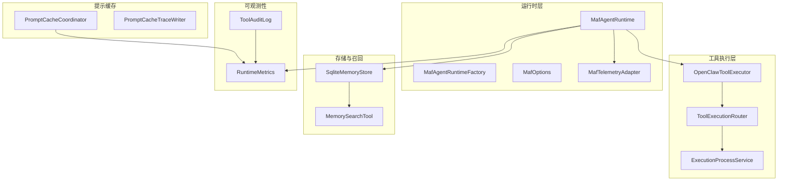
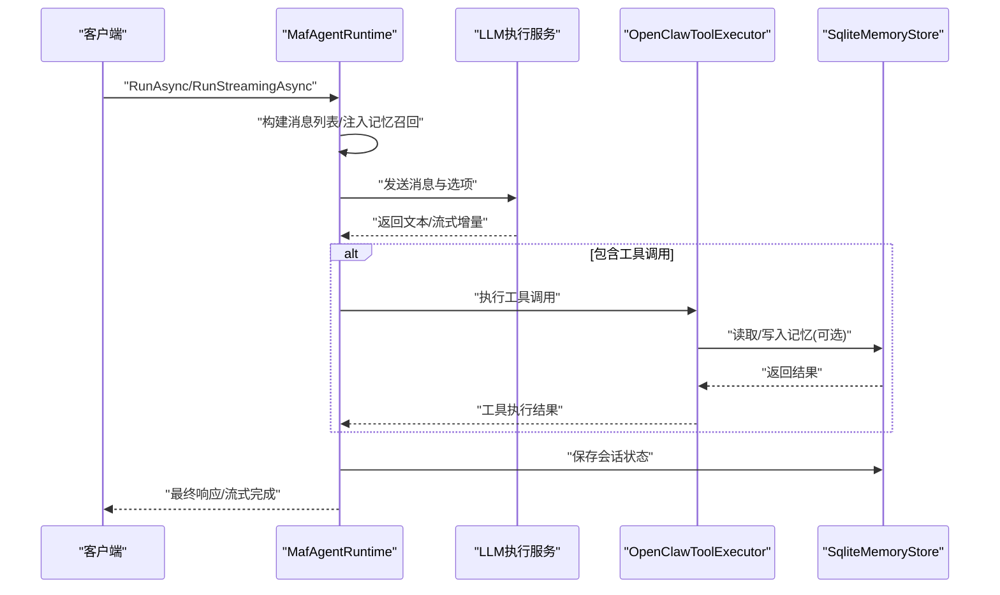
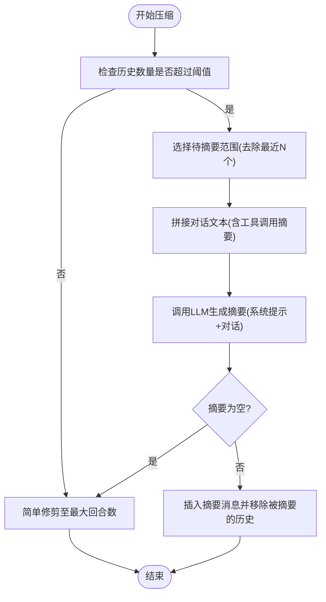
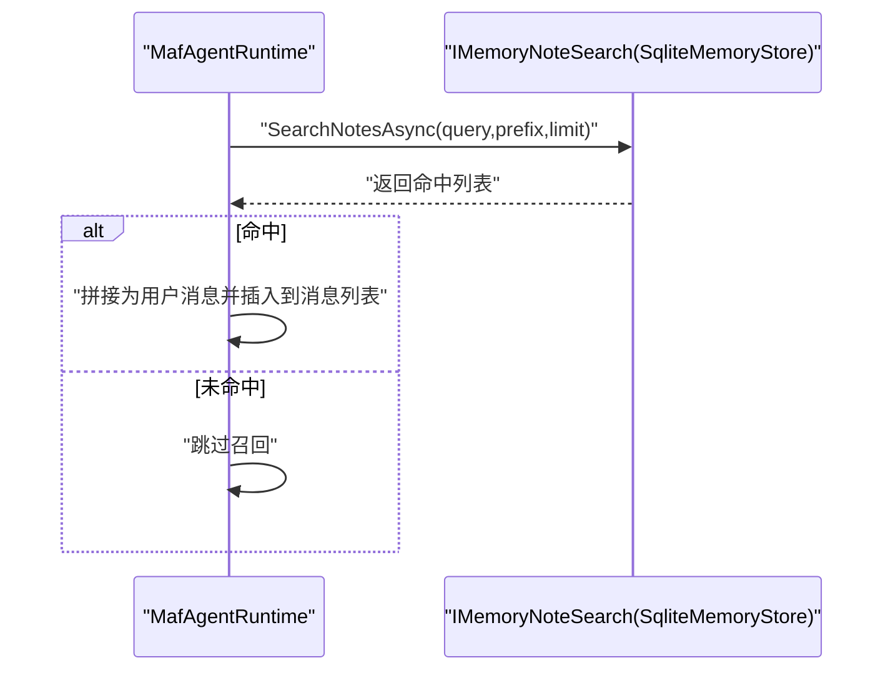
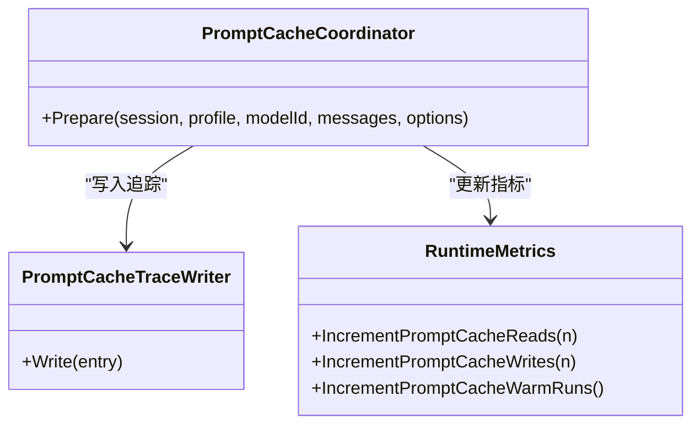
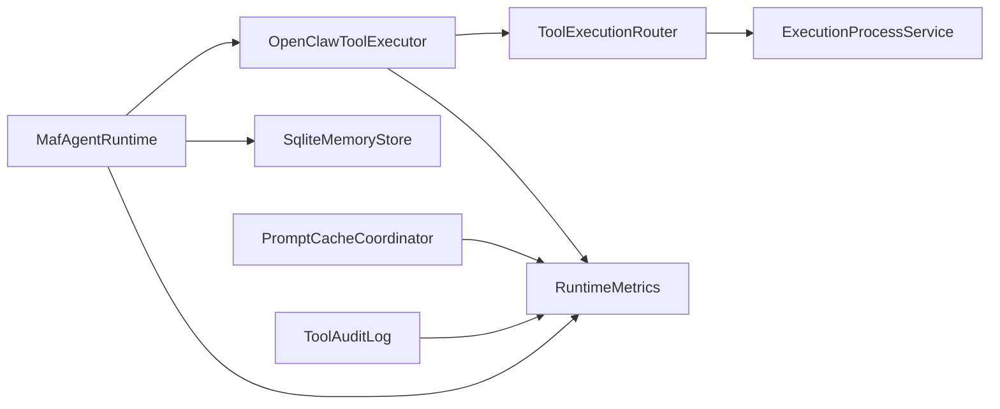

# 性能优化策略

<cite>
**本文引用的文件**
- [MafAgentRuntime.cs](file://src/OpenClaw.Agent/MafAgentRuntime.cs)
- [MafAgentRuntimeFactory.cs](file://src/OpenClaw.Agent/MafAgentRuntimeFactory.cs)
- [MafOptions.cs](file://src/OpenClaw.Agent/MafOptions.cs)
- [MafTelemetryAdapter.cs](file://src/OpenClaw.Agent/MafTelemetryAdapter.cs)
- [RuntimeMetrics.cs](file://src/OpenClaw.Core/Observability/RuntimeMetrics.cs)
- [OpenClawToolExecutor.cs](file://src/OpenClaw.Agent/OpenClawToolExecutor.cs)
- [SqliteMemoryStore.cs](file://src/OpenClaw.Core/Memory/SqliteMemoryStore.cs)
- [MemorySearchTool.cs](file://src/OpenClaw.Agent/Tools/MemorySearchTool.cs)
- [ExecutionProcessService.cs](file://src/OpenClaw.Agent/Execution/ExecutionProcessService.cs)
- [ToolExecutionRouter.cs](file://src/OpenClaw.Agent/Execution/ToolExecutionRouter.cs)
- [PromptCacheCoordinator.cs](file://src/OpenClaw.Gateway/PromptCaching/PromptCacheCoordinator.cs)
- [PromptCacheTraceWriter.cs](file://src/OpenClaw.Gateway/PromptCaching/PromptCacheTraceWriter.cs)
- [ToolAuditLog.cs](file://src/OpenClaw.Core/Observability/ToolAuditLog.cs)
- [openclaw-memory-recall-and-retention.md](file://docs/openclaw-memory-recall-and-retention.md)
- [maf-aot-jit-findings.md](file://docs/maf-aot-jit/maf-aot-jit-findings.md)
</cite>

## 目录
1. [引言](#引言)
2. [项目结构](#项目结构)
3. [核心组件](#核心组件)
4. [架构总览](#架构总览)
5. [详细组件分析](#详细组件分析)
6. [依赖关系分析](#依赖关系分析)
7. [性能考量](#性能考量)
8. [故障排查指南](#故障排查指南)
9. [结论](#结论)
10. [附录](#附录)

## 引言
本技术文档聚焦于 MAF（Microsoft Agent Framework）代理运行时的性能优化策略，涵盖运行时性能监控指标、内存使用优化、并发处理策略、会话历史压缩算法、记忆召回优化、工具执行缓存机制、性能瓶颈识别方法、性能测试与基准策略、AOT 与 JIT 模式对比、资源限制配置以及负载均衡实现。文档旨在帮助开发者与运维人员在生产环境中稳定、高效地运行 MAF 代理。

## 项目结构
MAF 运行时位于 OpenClaw.Agent 子项目中，围绕 MafAgentRuntime 核心类构建，配合工具执行器、内存存储、可观测性与网关侧提示缓存等模块协同工作。关键模块包括：
- 运行时与会话管理：MafAgentRuntime、MafAgentRuntimeFactory、MafOptions、MafTelemetryAdapter
- 工具执行与治理：OpenClawToolExecutor、ToolExecutionRouter、ExecutionProcessService
- 内存与召回：SqliteMemoryStore、MemorySearchTool、记忆召回配置与指标
- 可观测性与审计：RuntimeMetrics、ToolAuditLog
- 提示缓存：PromptCacheCoordinator、PromptCacheTraceWriter
- AOT/JIT 对比：maf-aot-jit-findings.md

图示来源
- [MafAgentRuntime.cs:17-118](file://src/OpenClaw.Agent/MafAgentRuntime.cs#L17-L118)
- [MafAgentRuntimeFactory.cs:9-166](file://src/OpenClaw.Agent/MafAgentRuntimeFactory.cs#L9-L166)
- [OpenClawToolExecutor.cs:30-100](file://src/OpenClaw.Agent/OpenClawToolExecutor.cs#L30-L100)
- [SqliteMemoryStore.cs:12-45](file://src/OpenClaw.Core/Memory/SqliteMemoryStore.cs#L12-L45)
- [PromptCacheCoordinator.cs:92-121](file://src/OpenClaw.Gateway/PromptCaching/PromptCacheCoordinator.cs#L92-L121)

章节来源
- [MafAgentRuntime.cs:17-118](file://src/OpenClaw.Agent/MafAgentRuntime.cs#L17-L118)
- [MafAgentRuntimeFactory.cs:9-166](file://src/OpenClaw.Agent/MafAgentRuntimeFactory.cs#L9-L166)
- [MafOptions.cs:1-44](file://src/OpenClaw.Agent/MafOptions.cs#L1-L44)
- [MafTelemetryAdapter.cs:7-24](file://src/OpenClaw.Agent/MafTelemetryAdapter.cs#L7-L24)

## 核心组件
- MafAgentRuntime：负责单轮对话的编排、会话历史构建、工具调用、流式输出、历史压缩与记忆召回注入、合约预算控制与会话状态持久化。
- OpenClawToolExecutor：统一的工具执行入口，负责工具声明、权限与治理决策、超时控制、流式收集、审计记录与指标统计。
- SqliteMemoryStore：基于 SQLite 的持久化存储，支持 FTS5 全文检索与可选向量嵌入，提供会话、分支与笔记的读写与召回。
- RuntimeMetrics：轻量级无锁计数器与仪表盘指标，覆盖请求、LLM 调用、工具调用、内存召回、提示缓存等关键指标。
- PromptCacheCoordinator：提示缓存准备与预热协调，结合稳定指纹与易变后缀，减少重复计算与令牌消耗。
- ExecutionProcessService/ToolExecutionRouter：工具执行路由与进程生命周期管理，支持本地与沙箱后端选择、回退策略与超时控制。

章节来源
- [MafAgentRuntime.cs:17-118](file://src/OpenClaw.Agent/MafAgentRuntime.cs#L17-L118)
- [OpenClawToolExecutor.cs:30-100](file://src/OpenClaw.Agent/OpenClawToolExecutor.cs#L30-L100)
- [SqliteMemoryStore.cs:12-45](file://src/OpenClaw.Core/Memory/SqliteMemoryStore.cs#L12-L45)
- [RuntimeMetrics.cs:10-312](file://src/OpenClaw.Core/Observability/RuntimeMetrics.cs#L10-L312)
- [PromptCacheCoordinator.cs:92-121](file://src/OpenClaw.Gateway/PromptCaching/PromptCacheCoordinator.cs#L92-L121)
- [ExecutionProcessService.cs:281-309](file://src/OpenClaw.Agent/Execution/ExecutionProcessService.cs#L281-L309)
- [ToolExecutionRouter.cs:7-40](file://src/OpenClaw.Agent/Execution/ToolExecutionRouter.cs#L7-L40)

## 架构总览
MAF 运行时通过工厂创建运行实例，接收用户消息后构建上下文消息列表，按需注入记忆召回，调用 LLM 执行服务生成响应；期间根据工具声明与治理策略执行工具调用，支持流式输出；完成后更新会话状态并持久化。可观测性贯穿始终，通过活动追踪、指标计数与审计日志保障性能与稳定性。

图示来源
- [MafAgentRuntime.cs:203-337](file://src/OpenClaw.Agent/MafAgentRuntime.cs#L203-L337)
- [OpenClawToolExecutor.cs:134-630](file://src/OpenClaw.Agent/OpenClawToolExecutor.cs#L134-L630)
- [SqliteMemoryStore.cs:150-207](file://src/OpenClaw.Core/Memory/SqliteMemoryStore.cs#L150-L207)

## 详细组件分析

### 会话历史压缩算法
MAF 支持两种历史压缩策略：
- 自动压缩：当会话历史超过阈值时，对早期回合进行摘要生成，保留最近若干回合，插入一条系统摘要消息，降低上下文长度与令牌消耗。
- 简单修剪：未启用压缩时，按最大回合数简单移除最早条目。

图示来源
- [MafAgentRuntime.cs:684-764](file://src/OpenClaw.Agent/MafAgentRuntime.cs#L684-L764)
- [MafAgentRuntime.cs:1076-1082](file://src/OpenClaw.Agent/MafAgentRuntime.cs#L1076-L1082)

章节来源
- [MafAgentRuntime.cs:684-764](file://src/OpenClaw.Agent/MafAgentRuntime.cs#L684-L764)
- [MafAgentRuntime.cs:1076-1082](file://src/OpenClaw.Agent/MafAgentRuntime.cs#L1076-L1082)

### 记忆召回优化
- 召回触发：在构建消息前，若启用记忆召回且用户输入非空，则通过 IMemoryNoteSearch 接口检索相关笔记。
- 多路回退：优先按带前缀的键空间检索，失败则尝试无前缀检索；命中后按最大字符上限拼接为用户消息插入到第二条位置。
- 指标统计：独立统计召回搜索次数与命中数量，便于评估召回效果与成本。

图示来源
- [MafAgentRuntime.cs:625-682](file://src/OpenClaw.Agent/MafAgentRuntime.cs#L625-L682)
- [SqliteMemoryStore.cs:319-490](file://src/OpenClaw.Core/Memory/SqliteMemoryStore.cs#L319-L490)
- [openclaw-memory-recall-and-retention.md:67-194](file://docs/openclaw-memory-recall-and-retention.md#L67-L194)

章节来源
- [MafAgentRuntime.cs:625-682](file://src/OpenClaw.Agent/MafAgentRuntime.cs#L625-L682)
- [SqliteMemoryStore.cs:319-490](file://src/OpenClaw.Core/Memory/SqliteMemoryStore.cs#L319-L490)
- [openclaw-memory-recall-and-retention.md:67-194](file://docs/openclaw-memory-recall-and-retention.md#L67-L194)

### 工具执行缓存机制
- 提示缓存协调：根据模型能力与方言，将系统提示的稳定部分与易变后缀分离，生成稳定指纹，结合工具签名与响应格式，决定是否启用提示缓存与保留策略。
- 缓存追踪：通过 PromptCacheTraceWriter 将缓存事件写入文件，便于离线分析与回归验证。
- 运行时指标：通过 RuntimeMetrics 统计提示缓存读写次数与预热行为，辅助容量规划。

图示来源
- [PromptCacheCoordinator.cs:92-121](file://src/OpenClaw.Gateway/PromptCaching/PromptCacheCoordinator.cs#L92-L121)
- [PromptCacheTraceWriter.cs:89-125](file://src/OpenClaw.Gateway/PromptCaching/PromptCacheTraceWriter.cs#L89-L125)
- [RuntimeMetrics.cs:52-56](file://src/OpenClaw.Core/Observability/RuntimeMetrics.cs#L52-L56)

章节来源
- [PromptCacheCoordinator.cs:92-121](file://src/OpenClaw.Gateway/PromptCaching/PromptCacheCoordinator.cs#L92-L121)
- [PromptCacheTraceWriter.cs:89-125](file://src/OpenClaw.Gateway/PromptCaching/PromptCacheTraceWriter.cs#L89-L125)
- [RuntimeMetrics.cs:52-56](file://src/OpenClaw.Core/Observability/RuntimeMetrics.cs#L52-L56)

### 并发处理与资源限制
- 会话并发：通过 GatewayConfig 中的 MaxConcurrentSessions 与 SessionRateLimitPerMinute 控制并发与速率，避免资源争用导致的抖动。
- 工具超时：OpenClawToolExecutor 统一的工具超时控制，结合 ExecutionProcessService 的进程生命周期管理，确保长时间任务不会阻塞主线程。
- 内存与 IO：SqliteMemoryStore 使用 WAL 模式与 NORMAL 同步级别，在吞吐与可靠性间平衡；FTS5 触发器与向量嵌入按需启用，避免不必要的开销。

章节来源
- [OpenClawToolExecutor.cs:483-530](file://src/OpenClaw.Agent/OpenClawToolExecutor.cs#L483-L530)
- [ExecutionProcessService.cs:281-309](file://src/OpenClaw.Agent/Execution/ExecutionProcessService.cs#L281-L309)
- [SqliteMemoryStore.cs:54-90](file://src/OpenClaw.Core/Memory/SqliteMemoryStore.cs#L54-L90)

### AOT 与 JIT 模式性能对比
- 测量矩阵：包含启动耗时、HTTP 轮次耗时、提供商请求数、令牌输入/输出、事件形态一致性等。
- 结果概要：AOT 在启动与轮次上均优于 JIT；不同 Orchestrator（native/maf）差异较小，事件形态一致，适合进行相对比较而非绝对性能断言。

章节来源
- [maf-aot-jit-findings.md:1-24](file://docs/maf-aot-jit/maf-aot-jit-findings.md#L1-L24)

## 依赖关系分析
- 运行时依赖：MafAgentRuntime 依赖工具执行器、内存存储、LLM 执行服务、会话状态存储、遥测适配器与运行时指标。
- 工具执行链：OpenClawToolExecutor 通过 ToolExecutionRouter 选择后端（local/opensandbox 等），必要时通过 ExecutionProcessService 管理进程生命周期。
- 存储与检索：SqliteMemoryStore 提供笔记检索与会话分支管理，支持 FTS5 与可选向量嵌入，提升召回质量与速度。
- 可观测性：RuntimeMetrics 作为全局计数器，ToolAuditLog 作为审计通道，PromptCacheTraceWriter 记录缓存轨迹。

图示来源
- [MafAgentRuntime.cs:17-118](file://src/OpenClaw.Agent/MafAgentRuntime.cs#L17-L118)
- [OpenClawToolExecutor.cs:30-100](file://src/OpenClaw.Agent/OpenClawToolExecutor.cs#L30-L100)
- [ToolExecutionRouter.cs:7-40](file://src/OpenClaw.Agent/Execution/ToolExecutionRouter.cs#L7-L40)
- [ExecutionProcessService.cs:281-309](file://src/OpenClaw.Agent/Execution/ExecutionProcessService.cs#L281-L309)
- [SqliteMemoryStore.cs:12-45](file://src/OpenClaw.Core/Memory/SqliteMemoryStore.cs#L12-L45)
- [RuntimeMetrics.cs:10-312](file://src/OpenClaw.Core/Observability/RuntimeMetrics.cs#L10-L312)
- [ToolAuditLog.cs:39-62](file://src/OpenClaw.Core/Observability/ToolAuditLog.cs#L39-L62)
- [PromptCacheCoordinator.cs:92-121](file://src/OpenClaw.Gateway/PromptCaching/PromptCacheCoordinator.cs#L92-L121)

## 性能考量
- 历史压缩与令牌预算：合理设置 MaxHistoryTurns、EnableCompaction、CompactionThreshold、CompactionKeepRecent 与 SessionTokenBudget，避免上下文膨胀导致延迟与成本上升。
- 召回规模与字符上限：通过 MemoryRecall 的 maxNotes 与 maxChars 控制召回规模，结合 RuntimeMetrics 的 MemoryRecallSearches 与 MemoryRecallHits 指标持续优化命中率与成本。
- 工具超时与回退：为高风险工具设置合理的 ToolTimeoutSeconds，利用 ToolExecutionRouter 的回退策略与 ExecutionProcessService 的进程回收，降低单点故障影响。
- 提示缓存预热：结合 PromptCacheCoordinator 的稳定指纹与易变后缀分离策略，对热点会话进行预热，显著降低重复计算与令牌消耗。
- 数据库与索引：启用 WAL 与 NORMAL 同步，FTS5 触发器与向量列按需开启，避免不必要的磁盘与 CPU 开销。

章节来源
- [MafAgentRuntime.cs:92-105](file://src/OpenClaw.Agent/MafAgentRuntime.cs#L92-L105)
- [MafAgentRuntime.cs:625-682](file://src/OpenClaw.Agent/MafAgentRuntime.cs#L625-L682)
- [OpenClawToolExecutor.cs:483-530](file://src/OpenClaw.Agent/OpenClawToolExecutor.cs#L483-L530)
- [SqliteMemoryStore.cs:54-90](file://src/OpenClaw.Core/Memory/SqliteMemoryStore.cs#L54-L90)
- [PromptCacheCoordinator.cs:92-121](file://src/OpenClaw.Gateway/PromptCaching/PromptCacheCoordinator.cs#L92-L121)

## 故障排查指南
- 指标定位：通过 RuntimeMetrics 的 TotalLlmCalls、TotalToolCalls、TotalToolTimeouts、TotalLlmErrors、MemoryRecallSearches、PromptCacheReads/Writes 等指标快速定位异常类型与发生阶段。
- 审计与追踪：ToolAuditLog 记录工具调用的时长、失败原因、治理决策与字节数，结合 MafTelemetryAdapter 的活动标签（运行模式、提供方、会话 ID）进行关联分析。
- 回溯与复现：利用 PromptCacheTraceWriter 的缓存事件文件与 MemorySearchTool 的检索结果，复现问题场景并验证修复效果。
- 常见问题：
  - 工具超时：检查 ToolTimeoutSeconds 与后端可用性，必要时启用回退或调整策略。
  - 召回不命中：确认 MemoryRecall 配置与前缀过滤，观察 MemoryRecallSearches/MemoryRecallHits 指标变化。
  - LLM 错误：关注 TotalLlmErrors 与 CircuitBreakerState，结合 ProviderUsage 与 TurnContext 记录定位具体轮次。

章节来源
- [RuntimeMetrics.cs:10-312](file://src/OpenClaw.Core/Observability/RuntimeMetrics.cs#L10-L312)
- [ToolAuditLog.cs:39-62](file://src/OpenClaw.Core/Observability/ToolAuditLog.cs#L39-L62)
- [MafTelemetryAdapter.cs:7-24](file://src/OpenClaw.Agent/MafTelemetryAdapter.cs#L7-L24)
- [PromptCacheTraceWriter.cs:89-125](file://src/OpenClaw.Gateway/PromptCaching/PromptCacheTraceWriter.cs#L89-L125)
- [MemorySearchTool.cs:31-60](file://src/OpenClaw.Agent/Tools/MemorySearchTool.cs#L31-L60)

## 结论
通过历史压缩、记忆召回、工具执行缓存与统一的可观测性体系，MAF 运行时能够在复杂多轮对话与工具调用场景下保持稳定的性能表现。结合 AOT/JIT 对比与资源限制配置，可在不同部署环境下实现更优的启动与响应性能。建议持续监控关键指标，定期评估召回与缓存策略，并根据业务负载动态调整并发与超时参数。

## 附录
- 性能测试与基准策略
  - 基准场景：固定提示 + 工具调用 + 流式输出，分别测量 AOT/JIT 下的启动与轮次耗时。
  - 指标采集：TotalRequests、TotalLlmCalls、TotalInputTokens/TotalOutputTokens、TotalToolCalls、TotalToolTimeouts、PromptCacheReads/Writes、MemoryRecallSearches/Hits。
  - 回归验证：使用 PromptCacheTraceWriter 输出的缓存事件文件进行离线回归分析。
- 资源限制配置要点
  - 并发与速率：MaxConcurrentSessions、SessionRateLimitPerMinute
  - 令牌预算：SessionTokenBudget、EstimatedTokenAdmissionControl
  - 历史与召回：MaxHistoryTurns、EnableCompaction、CompactionThreshold/KeepRecent、MemoryRecall.maxNotes/maxChars
  - 工具超时：Tooling.ToolTimeoutSeconds、Execution 后端可用性与回退策略
- 负载均衡实现建议
  - 前置反向代理或服务网格：基于会话 ID 的粘性策略与健康检查
  - 进程级隔离：ExecutionProcessService 的进程池与回收策略
  - 提示缓存预热：热点会话的稳定指纹预热，降低下游压力

章节来源
- [maf-aot-jit-findings.md:1-24](file://docs/maf-aot-jit/maf-aot-jit-findings.md#L1-L24)
- [MafAgentRuntime.cs:92-105](file://src/OpenClaw.Agent/MafAgentRuntime.cs#L92-L105)
- [OpenClawToolExecutor.cs:483-530](file://src/OpenClaw.Agent/OpenClawToolExecutor.cs#L483-L530)
- [PromptCacheCoordinator.cs:92-121](file://src/OpenClaw.Gateway/PromptCaching/PromptCacheCoordinator.cs#L92-L121)
- [ExecutionProcessService.cs:281-309](file://src/OpenClaw.Agent/Execution/ExecutionProcessService.cs#L281-L309)