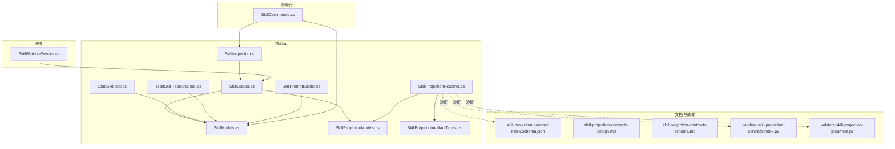
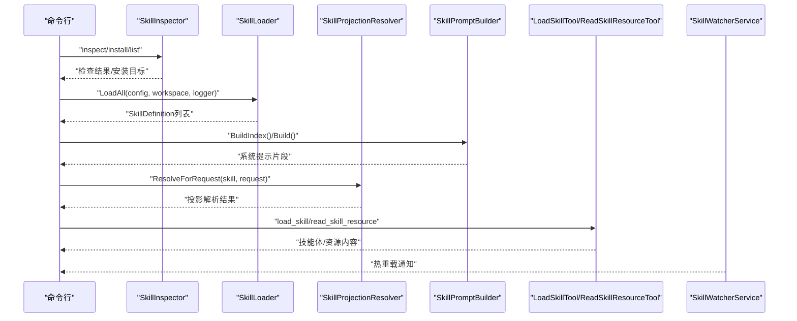
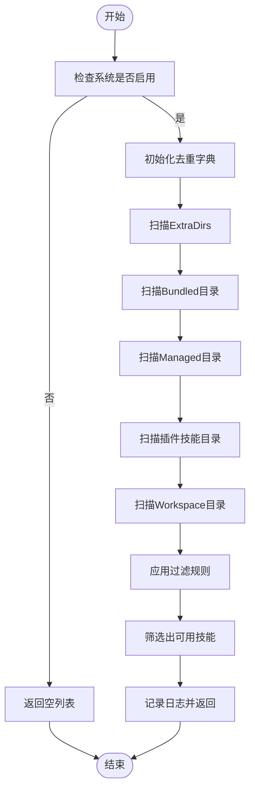
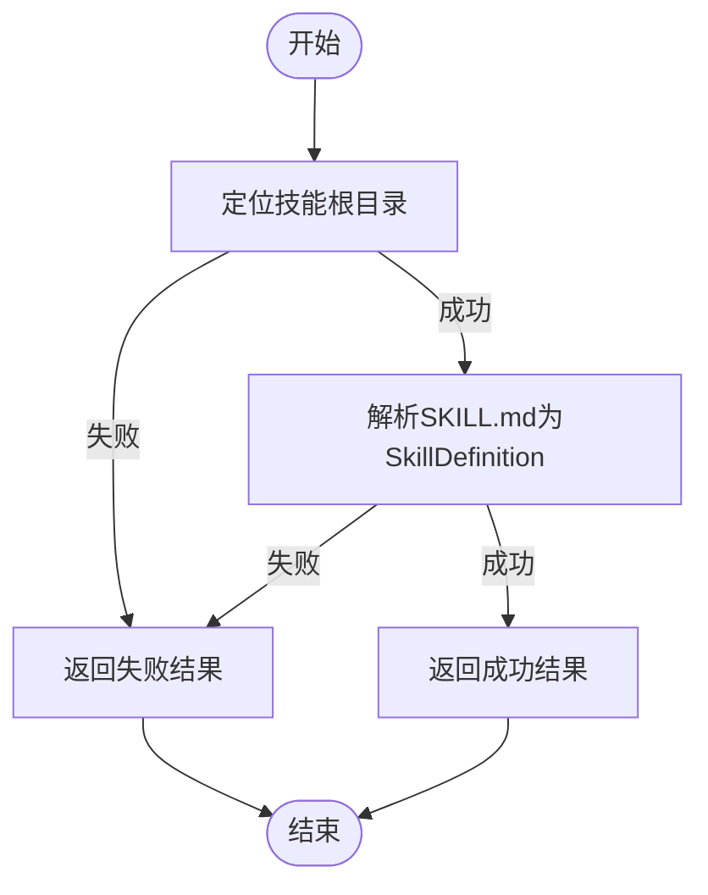
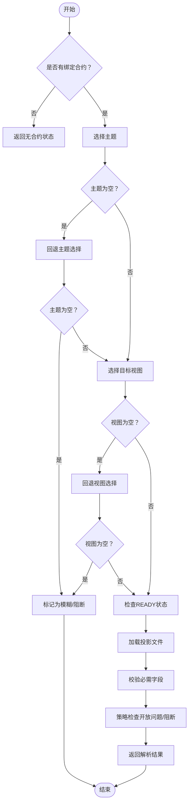
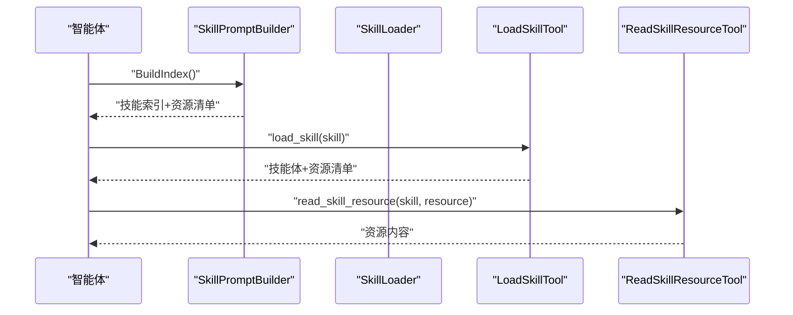
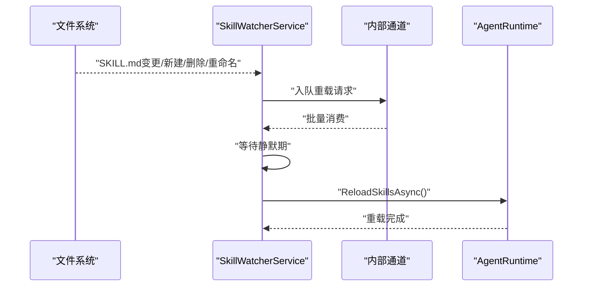
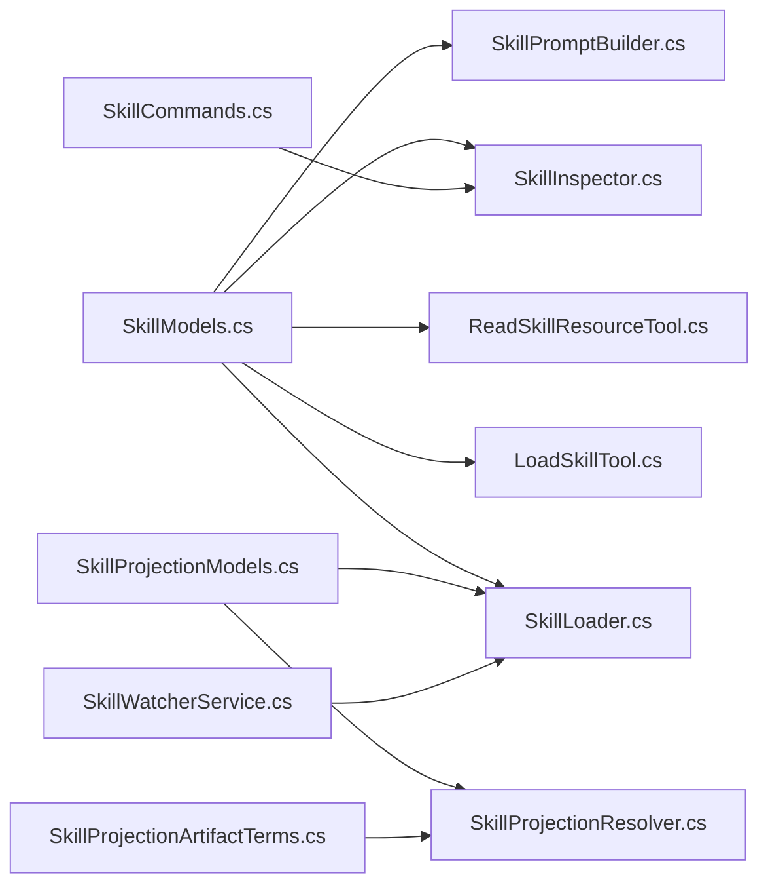

# 技能管理

<cite>
**本文档引用的文件**
- [SkillLoader.cs](file://src/OpenClaw.Core/Skills/SkillLoader.cs)
- [SkillInspector.cs](file://src/OpenClaw.Core/Skills/SkillInspector.cs)
- [SkillProjectionResolver.cs](file://src/OpenClaw.Core/Skills/SkillProjectionResolver.cs)
- [SkillModels.cs](file://src/OpenClaw.Core/Skills/SkillModels.cs)
- [SkillProjectionModels.cs](file://src/OpenClaw.Core/Models/SkillProjectionModels.cs)
- [SkillProjectionArtifactTerms.cs](file://src/OpenClaw.Core/Skills/SkillProjectionArtifactTerms.cs)
- [SkillWatcherService.cs](file://src/OpenClaw.Gateway/SkillWatcherService.cs)
- [SkillCommands.cs](file://src/OpenClaw.Cli/SkillCommands.cs)
- [LoadSkillTool.cs](file://src/OpenClaw.Core/Skills/LoadSkillTool.cs)
- [ReadSkillResourceTool.cs](file://src/OpenClaw.Core/Skills/ReadSkillResourceTool.cs)
- [SkillPromptBuilder.cs](file://src/OpenClaw.Core/Skills/SkillPromptBuilder.cs)
- [skill-projection-contract-index.schema.json](file://docs/skill-projection-contract-index.schema.json)
- [skill-projection-contracts-design.md](file://docs/skill-projection-contracts-design.md)
- [skill-projection-contracts-schema.md](file://docs/skill-projection-contracts-schema.md)
- [validate-skill-projection-contract-index.py](file://scripts/validate-skill-projection-contract-index.py)
- [validate-skill-projection-document.py](file://scripts/validate-skill-projection-document.py)
</cite>

## 目录
1. [简介](#简介)
2. [项目结构](#项目结构)
3. [核心组件](#核心组件)
4. [架构总览](#架构总览)
5. [详细组件分析](#详细组件分析)
6. [依赖关系分析](#依赖关系分析)
7. [性能考虑](#性能考虑)
8. [故障排除指南](#故障排除指南)
9. [结论](#结论)
10. [附录](#附录)

## 简介
本文件面向技能管理系统的技术文档，围绕以下关键能力展开：技能的加载机制（SkillLoader）、技能解析与验证（SkillInspector）、技能投影解析与路由（SkillProjectionResolver），以及技能热重载流程（SkillWatcherService）。文档将详细说明各组件的职责、数据结构、处理逻辑、配置选项、使用模式，并提供流程图与开发指南，帮助开发者快速理解并扩展技能系统。

## 项目结构
技能管理功能主要分布在以下模块：
- 核心库（OpenClaw.Core）：技能定义、加载、解析、投影、工具与提示构建
- 网关（OpenClaw.Gateway）：技能文件监控与热重载
- 命令行（OpenClaw.Cli）：技能检查、安装、列出
- 文档与脚本：投影合约的JSON Schema与验证脚本

**图表来源**
- [SkillLoader.cs:11-109](file://src/OpenClaw.Core/Skills/SkillLoader.cs#L11-L109)
- [SkillInspector.cs:6-47](file://src/OpenClaw.Core/Skills/SkillInspector.cs#L6-L47)
- [SkillProjectionResolver.cs:10-67](file://src/OpenClaw.Core/Skills/SkillProjectionResolver.cs#L10-L67)
- [SkillModels.cs:8-214](file://src/OpenClaw.Core/Skills/SkillModels.cs#L8-L214)
- [SkillProjectionModels.cs:1-182](file://src/OpenClaw.Core/Models/SkillProjectionModels.cs#L1-L182)
- [SkillProjectionArtifactTerms.cs:1-22](file://src/OpenClaw.Core/Skills/SkillProjectionArtifactTerms.cs#L1-L22)
- [LoadSkillTool.cs:17-75](file://src/OpenClaw.Core/Skills/LoadSkillTool.cs#L17-L75)
- [ReadSkillResourceTool.cs:21-128](file://src/OpenClaw.Core/Skills/ReadSkillResourceTool.cs#L21-L128)
- [SkillPromptBuilder.cs:9-63](file://src/OpenClaw.Core/Skills/SkillPromptBuilder.cs#L9-L63)
- [SkillWatcherService.cs:7-89](file://src/OpenClaw.Gateway/SkillWatcherService.cs#L7-L89)
- [SkillCommands.cs:6-129](file://src/OpenClaw.Cli/SkillCommands.cs#L6-L129)
- [skill-projection-contract-index.schema.json:1-54](file://docs/skill-projection-contract-index.schema.json#L1-L54)
- [validate-skill-projection-contract-index.py:1-35](file://scripts/validate-skill-projection-contract-index.py#L1-L35)
- [validate-skill-projection-document.py](file://scripts/validate-skill-projection-document.py)

**章节来源**
- [SkillLoader.cs:11-109](file://src/OpenClaw.Core/Skills/SkillLoader.cs#L11-L109)
- [SkillInspector.cs:6-47](file://src/OpenClaw.Core/Skills/SkillInspector.cs#L6-L47)
- [SkillProjectionResolver.cs:10-67](file://src/OpenClaw.Core/Skills/SkillProjectionResolver.cs#L10-L67)
- [SkillWatcherService.cs:7-89](file://src/OpenClaw.Gateway/SkillWatcherService.cs#L7-L89)
- [SkillCommands.cs:6-129](file://src/OpenClaw.Cli/SkillCommands.cs#L6-L129)

## 核心组件
本节概述技能管理的关键组件及其职责：
- SkillLoader：扫描技能目录、解析SKILL.md、过滤条件、生成SkillDefinition集合
- SkillInspector：对本地技能包进行检查与验证
- SkillProjectionResolver：根据请求文本解析技能投影路由，生成投影解析结果
- SkillWatcherService：监控技能文件变更并触发热重载
- LoadSkillTool / ReadSkillResourceTool：实现渐进披露的工具接口
- SkillPromptBuilder：构建系统提示中的技能索引与指令片段
- 投影模型与工具：SkillProjectionModels、SkillProjectionArtifactTerms

**章节来源**
- [SkillLoader.cs:11-109](file://src/OpenClaw.Core/Skills/SkillLoader.cs#L11-L109)
- [SkillInspector.cs:6-47](file://src/OpenClaw.Core/Skills/SkillInspector.cs#L6-L47)
- [SkillProjectionResolver.cs:10-67](file://src/OpenClaw.Core/Skills/SkillProjectionResolver.cs#L10-L67)
- [SkillWatcherService.cs:7-89](file://src/OpenClaw.Gateway/SkillWatcherService.cs#L7-L89)
- [LoadSkillTool.cs:17-75](file://src/OpenClaw.Core/Skills/LoadSkillTool.cs#L17-L75)
- [ReadSkillResourceTool.cs:21-128](file://src/OpenClaw.Core/Skills/ReadSkillResourceTool.cs#L21-L128)
- [SkillPromptBuilder.cs:9-63](file://src/OpenClaw.Core/Skills/SkillPromptBuilder.cs#L9-L63)
- [SkillProjectionModels.cs:1-182](file://src/OpenClaw.Core/Models/SkillProjectionModels.cs#L1-L182)
- [SkillProjectionArtifactTerms.cs:1-22](file://src/OpenClaw.Core/Skills/SkillProjectionArtifactTerms.cs#L1-L22)

## 架构总览
技能管理系统的整体流程包括：技能发现与加载、技能验证、投影解析与路由、渐进披露工具调用、热重载监控与触发。

**图表来源**
- [SkillCommands.cs:30-129](file://src/OpenClaw.Cli/SkillCommands.cs#L30-L129)
- [SkillInspector.cs:8-47](file://src/OpenClaw.Core/Skills/SkillInspector.cs#L8-L47)
- [SkillLoader.cs:17-109](file://src/OpenClaw.Core/Skills/SkillLoader.cs#L17-L109)
- [SkillProjectionResolver.cs:12-67](file://src/OpenClaw.Core/Skills/SkillProjectionResolver.cs#L12-L67)
- [SkillPromptBuilder.cs:20-63](file://src/OpenClaw.Core/Skills/SkillPromptBuilder.cs#L20-L63)
- [LoadSkillTool.cs:43-75](file://src/OpenClaw.Core/Skills/LoadSkillTool.cs#L43-L75)
- [ReadSkillResourceTool.cs:52-128](file://src/OpenClaw.Core/Skills/ReadSkillResourceTool.cs#L52-L128)
- [SkillWatcherService.cs:39-89](file://src/OpenClaw.Gateway/SkillWatcherService.cs#L39-L89)

## 详细组件分析

### SkillLoader：技能发现与加载
SkillLoader负责从多个来源扫描技能目录，解析SKILL.md，应用过滤规则，最终输出可用的SkillDefinition集合。其核心流程如下：

- 目录扫描顺序：ExtraDirs < Bundled < Managed < Plugin < Workspace（高优先级覆盖低优先级）
- 过滤规则：
  - 允许Bundled白名单
  - 按Entries禁用特定技能
  - 按Metadata要求过滤（OS、二进制、环境变量、配置）
- 要求检测缓存：PATH二进制查找结果缓存，避免重复扫描
- 资源扫描：仅列举references/与scripts/下的文件清单，不加载内容（渐进披露）

**图表来源**
- [SkillLoader.cs:17-109](file://src/OpenClaw.Core/Skills/SkillLoader.cs#L17-L109)
- [SkillLoader.cs:160-208](file://src/OpenClaw.Core/Skills/SkillLoader.cs#L160-L208)
- [SkillLoader.cs:213-323](file://src/OpenClaw.Core/Skills/SkillLoader.cs#L213-L323)
- [SkillLoader.cs:329-384](file://src/OpenClaw.Core/Skills/SkillLoader.cs#L329-L384)
- [SkillLoader.cs:390-436](file://src/OpenClaw.Core/Skills/SkillLoader.cs#L390-L436)
- [SkillLoader.cs:441-493](file://src/OpenClaw.Core/Skills/SkillLoader.cs#L441-L493)

**章节来源**
- [SkillLoader.cs:11-552](file://src/OpenClaw.Core/Skills/SkillLoader.cs#L11-L552)
- [SkillModels.cs:8-214](file://src/OpenClaw.Core/Skills/SkillModels.cs#L8-L214)

### SkillInspector：技能验证与检查
SkillInspector用于CLI与管理工具对本地技能包进行验证，支持：
- 定位技能根目录（含递归查找SKILL.md）
- 解析单个技能定义
- 批量检查已安装技能根目录

**图表来源**
- [SkillInspector.cs:8-47](file://src/OpenClaw.Core/Skills/SkillInspector.cs#L8-L47)
- [SkillInspector.cs:49-96](file://src/OpenClaw.Core/Skills/SkillInspector.cs#L49-L96)

**章节来源**
- [SkillInspector.cs:6-110](file://src/OpenClaw.Core/Skills/SkillInspector.cs#L6-L110)
- [SkillCommands.cs:30-129](file://src/OpenClaw.Cli/SkillCommands.cs#L30-L129)

### SkillProjectionResolver：投影解析与路由
SkillProjectionResolver根据请求文本与技能绑定的投影合约，选择合适的主题与目标视图，并加载对应的投影文档。核心流程：

- 主题选择与视图选择采用信号匹配与评分维度，支持阈值与降级策略
- 支持READY状态优先、回退视图顺序、显式资源请求加分
- 投影文件加载与字段校验，支持提示约束、允许术语、禁止假设、必要澄清、推理路径、源摘要、交付制品、丢弃项与开放问题

**图表来源**
- [SkillProjectionResolver.cs:12-67](file://src/OpenClaw.Core/Skills/SkillProjectionResolver.cs#L12-L67)
- [SkillProjectionResolver.cs:110-218](file://src/OpenClaw.Core/Skills/SkillProjectionResolver.cs#L110-L218)
- [SkillProjectionResolver.cs:220-346](file://src/OpenClaw.Core/Skills/SkillProjectionResolver.cs#L220-L346)
- [SkillProjectionResolver.cs:399-452](file://src/OpenClaw.Core/Skills/SkillProjectionResolver.cs#L399-L452)

**章节来源**
- [SkillProjectionResolver.cs:10-613](file://src/OpenClaw.Core/Skills/SkillProjectionResolver.cs#L10-L613)
- [SkillProjectionModels.cs:1-182](file://src/OpenClaw.Core/Models/SkillProjectionModels.cs#L1-L182)
- [SkillProjectionArtifactTerms.cs:1-22](file://src/OpenClaw.Core/Skills/SkillProjectionArtifactTerms.cs#L1-L22)

### 渐进披露与工具链
- LoadSkillTool：按技能名动态加载完整SKILL.md体，支持资源清单重发
- ReadSkillResourceTool：按技能名+资源路径读取references/scripts下的单个资源，带大小限制与安全校验
- SkillPromptBuilder：构建系统提示中的技能索引（仅元数据+资源清单），避免一次性注入全部SKILL.md体

**图表来源**
- [SkillPromptBuilder.cs:110-145](file://src/OpenClaw.Core/Skills/SkillPromptBuilder.cs#L110-L145)
- [LoadSkillTool.cs:43-75](file://src/OpenClaw.Core/Skills/LoadSkillTool.cs#L43-L75)
- [ReadSkillResourceTool.cs:52-128](file://src/OpenClaw.Core/Skills/ReadSkillResourceTool.cs#L52-L128)

**章节来源**
- [LoadSkillTool.cs:17-165](file://src/OpenClaw.Core/Skills/LoadSkillTool.cs#L17-L165)
- [ReadSkillResourceTool.cs:21-340](file://src/OpenClaw.Core/Skills/ReadSkillResourceTool.cs#L21-L340)
- [SkillPromptBuilder.cs:9-354](file://src/OpenClaw.Core/Skills/SkillPromptBuilder.cs#L9-L354)

### 技能热重载流程
SkillWatcherService监控技能目录（ExtraDirs/Bundled/Managed/Plugin/Workspace）下SKILL.md的变化，通过防抖与静默期合并多次变更，最终触发AgentRuntime.ReloadSkillsAsync进行热重载。

**图表来源**
- [SkillWatcherService.cs:39-89](file://src/OpenClaw.Gateway/SkillWatcherService.cs#L39-L89)
- [SkillWatcherService.cs:193-255](file://src/OpenClaw.Gateway/SkillWatcherService.cs#L193-L255)

**章节来源**
- [SkillWatcherService.cs:7-257](file://src/OpenClaw.Gateway/SkillWatcherService.cs#L7-L257)

## 依赖关系分析
- SkillLoader依赖SkillModels与SkillProjectionModels（用于绑定投影合约与元数据）
- SkillInspector依赖SkillLoader进行解析
- SkillProjectionResolver依赖SkillProjectionModels与SkillProjectionArtifactTerms
- LoadSkillTool/ReadSkillResourceTool依赖SkillPromptBuilder与SkillModels
- SkillWatcherService依赖AgentRuntime与SkillsConfig
- CLI命令依赖SkillInspector与安装/解压逻辑

**图表来源**
- [SkillModels.cs:8-214](file://src/OpenClaw.Core/Skills/SkillModels.cs#L8-L214)
- [SkillProjectionModels.cs:1-182](file://src/OpenClaw.Core/Models/SkillProjectionModels.cs#L1-L182)
- [SkillProjectionArtifactTerms.cs:1-22](file://src/OpenClaw.Core/Skills/SkillProjectionArtifactTerms.cs#L1-L22)
- [SkillLoader.cs:11-109](file://src/OpenClaw.Core/Skills/SkillLoader.cs#L11-L109)
- [SkillInspector.cs:6-47](file://src/OpenClaw.Core/Skills/SkillInspector.cs#L6-L47)
- [SkillProjectionResolver.cs:10-67](file://src/OpenClaw.Core/Skills/SkillProjectionResolver.cs#L10-L67)
- [LoadSkillTool.cs:17-75](file://src/OpenClaw.Core/Skills/LoadSkillTool.cs#L17-L75)
- [ReadSkillResourceTool.cs:21-128](file://src/OpenClaw.Core/Skills/ReadSkillResourceTool.cs#L21-L128)
- [SkillPromptBuilder.cs:9-63](file://src/OpenClaw.Core/Skills/SkillPromptBuilder.cs#L9-L63)
- [SkillCommands.cs:6-129](file://src/OpenClaw.Cli/SkillCommands.cs#L6-L129)
- [SkillWatcherService.cs:7-89](file://src/OpenClaw.Gateway/SkillWatcherService.cs#L7-L89)

**章节来源**
- [SkillLoader.cs:11-109](file://src/OpenClaw.Core/Skills/SkillLoader.cs#L11-L109)
- [SkillProjectionResolver.cs:10-67](file://src/OpenClaw.Core/Skills/SkillProjectionResolver.cs#L10-L67)
- [SkillWatcherService.cs:7-89](file://src/OpenClaw.Gateway/SkillWatcherService.cs#L7-L89)

## 性能考虑
- 路径与二进制查找缓存：SkillLoader对PATH二进制检测使用并发字典缓存，减少重复I/O
- 渐进披露：仅在模型请求时加载SKILL.md与资源，降低提示成本
- 防抖与静默期：SkillWatcherService对频繁变更进行合并，避免抖动
- 字符成本估算：SkillPromptBuilder提供估算方法，便于权衡索引与全文注入的成本

**章节来源**
- [SkillLoader.cs:503-536](file://src/OpenClaw.Core/Skills/SkillLoader.cs#L503-L536)
- [SkillPromptBuilder.cs:228-298](file://src/OpenClaw.Core/Skills/SkillPromptBuilder.cs#L228-L298)
- [SkillWatcherService.cs:215-232](file://src/OpenClaw.Gateway/SkillWatcherService.cs#L215-L232)

## 故障排除指南
- 技能未加载
  - 检查SkillsConfig.Enabled与Load.*开关
  - 确认技能目录存在且包含SKILL.md
  - 查看日志中的过滤原因（OS/二进制/环境变量/配置）
- 投影解析阻断
  - 检查投影文件是否存在与可解析
  - 开放问题或阻断策略导致的阻断
  - 视图状态非READY或未找到匹配路由
- 资源读取失败
  - 资源超过最大字节数限制
  - 路径越界或包含符号链接
  - 资源路径不在技能根目录内
- 热重载无效
  - 确认Watch开启与目录可监控
  - 检查文件系统事件是否触发
  - 关注静默期设置是否过短或过长

**章节来源**
- [SkillLoader.cs:441-493](file://src/OpenClaw.Core/Skills/SkillLoader.cs#L441-L493)
- [SkillProjectionResolver.cs:153-204](file://src/OpenClaw.Core/Skills/SkillProjectionResolver.cs#L153-L204)
- [ReadSkillResourceTool.cs:100-128](file://src/OpenClaw.Core/Skills/ReadSkillResourceTool.cs#L100-L128)
- [SkillWatcherService.cs:39-89](file://src/OpenClaw.Gateway/SkillWatcherService.cs#L39-L89)

## 结论
技能管理系统通过清晰的职责划分与渐进披露机制，在保证安全性的同时提升了灵活性与性能。SkillLoader负责可靠发现与过滤，SkillInspector提供验证能力，SkillProjectionResolver实现基于请求的精确路由，配合热重载与工具链形成完整的技能生命周期管理闭环。建议在生产环境中结合Schema校验与自动化脚本，确保投影合约的稳定性与一致性。

## 附录

### 技能格式规范（SKILL.md）
- 前言块（YAML风格键值对）位于三行分隔符之间
- 支持的键：
  - name、description、metadata、user-invocable、disable-model-invocation、command-dispatch、command-tool、command-arg-mode、homepage
- metadata支持openclaw子对象，包含：
  - always、emoji、homepage、primaryEnv、skillKey、os、requires（bins、anyBins、env、config）
- 指令体中的{baseDir}占位符会被技能目录替换
- references/与scripts/下的文件将被列举为资源清单

**章节来源**
- [SkillLoader.cs:213-323](file://src/OpenClaw.Core/Skills/SkillLoader.cs#L213-L323)
- [SkillLoader.cs:329-384](file://src/OpenClaw.Core/Skills/SkillLoader.cs#L329-L384)
- [SkillModels.cs:182-214](file://src/OpenClaw.Core/Skills/SkillModels.cs#L182-L214)

### 投影合约与Schema
- 合约索引（contract-index.json）与投影文档（*.projection.json）需遵循对应JSON Schema
- 建议按“接线正确性—编辑器诊断—显式校验”的三层流程维护
- 提供Python验证脚本辅助校验

**章节来源**
- [skill-projection-contract-index.schema.json:1-54](file://docs/skill-projection-contract-index.schema.json#L1-L54)
- [skill-projection-contracts-design.md:328-353](file://docs/skill-projection-contracts-design.md#L328-L353)
- [skill-projection-contracts-schema.md:918-975](file://docs/skill-projection-contracts-schema.md#L918-L975)
- [validate-skill-projection-contract-index.py:16-35](file://scripts/validate-skill-projection-contract-index.py#L16-L35)
- [validate-skill-projection-document.py](file://scripts/validate-skill-projection-document.py)

### 配置选项速查
- SkillsConfig
  - Enabled：总开关
  - Load：ExtraDirs、IncludeBundled、IncludeManaged、ManagedRoot、IncludeWorkspace、Watch、WatchDebounceMs
  - Entries：按技能名或skillKey覆盖（Enabled、ApiKey、Env、Config）
  - AllowBundled：仅允许的捆绑技能白名单
  - InstructionPrompt：自定义系统提示模板（支持{skills}、{load_instruction}、{resource_instruction}）
  - MaxResourceReadBytes：read_skill_resource最大字节数（<=0使用默认256KB）
- SkillEntryConfig：技能级覆盖（Enabled、ApiKey、Env、Config）

**章节来源**
- [SkillModels.cs:8-40](file://src/OpenClaw.Core/Skills/SkillModels.cs#L8-L40)
- [SkillModels.cs:72-84](file://src/OpenClaw.Core/Skills/SkillModels.cs#L72-L84)

### 使用模式与最佳实践
- 使用SkillCommands进行技能检查与安装，支持tarball解压安装与干运行预检
- 在系统提示中使用SkillPromptBuilder.BuildIndex进行渐进披露，避免一次性注入全部SKILL.md
- 通过LoadSkillTool与ReadSkillResourceTool按需加载技能体与资源
- 启用SkillWatcherService的Watch以获得热重载体验
- 对投影合约严格遵循Schema并使用验证脚本

**章节来源**
- [SkillCommands.cs:30-129](file://src/OpenClaw.Cli/SkillCommands.cs#L30-L129)
- [SkillPromptBuilder.cs:110-145](file://src/OpenClaw.Core/Skills/SkillPromptBuilder.cs#L110-L145)
- [LoadSkillTool.cs:43-75](file://src/OpenClaw.Core/Skills/LoadSkillTool.cs#L43-L75)
- [ReadSkillResourceTool.cs:52-128](file://src/OpenClaw.Core/Skills/ReadSkillResourceTool.cs#L52-L128)
- [SkillWatcherService.cs:39-89](file://src/OpenClaw.Gateway/SkillWatcherService.cs#L39-L89)