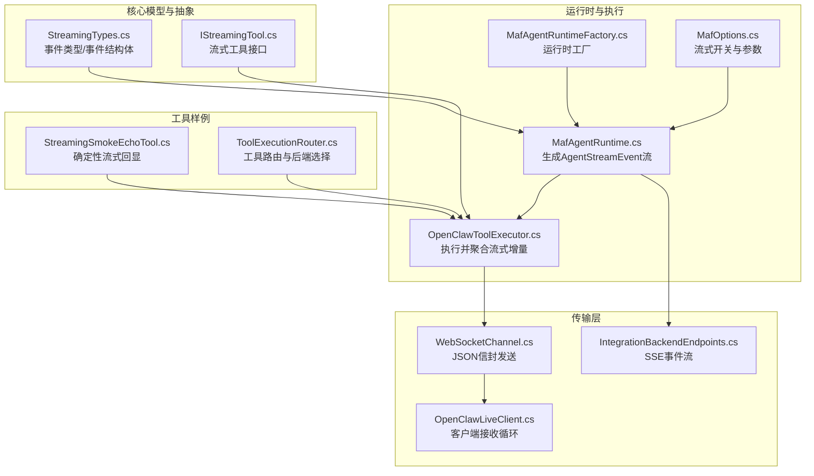
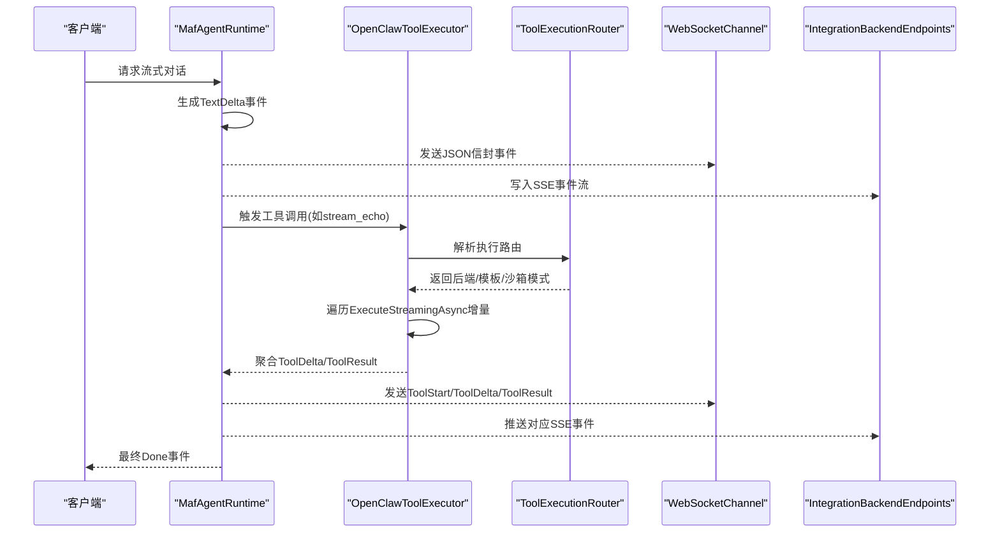
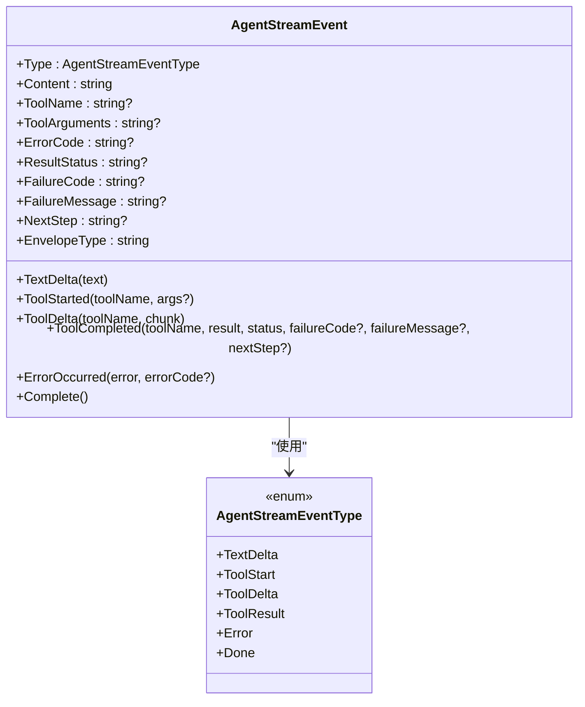
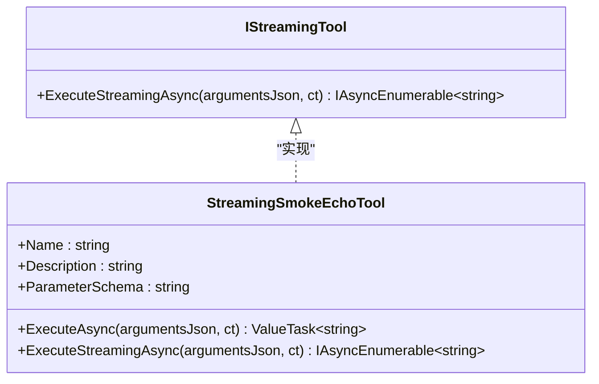
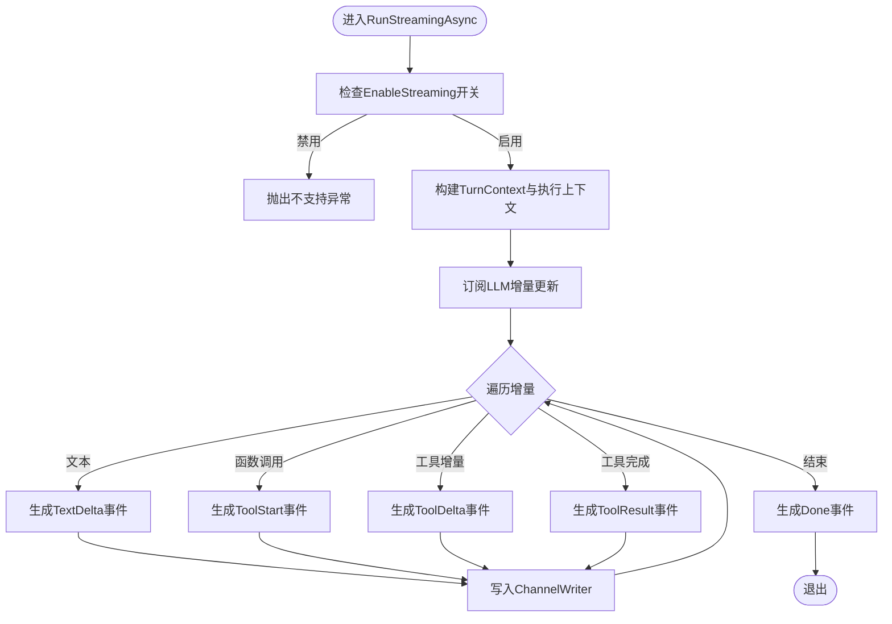
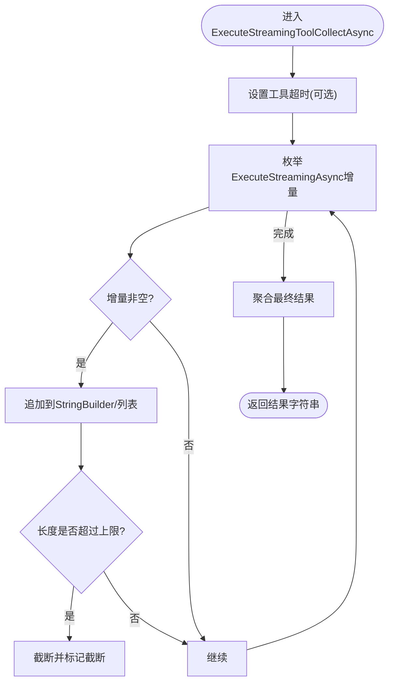
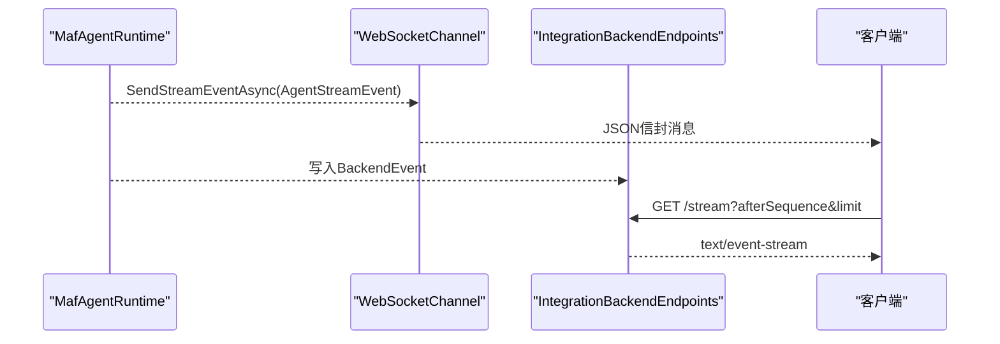
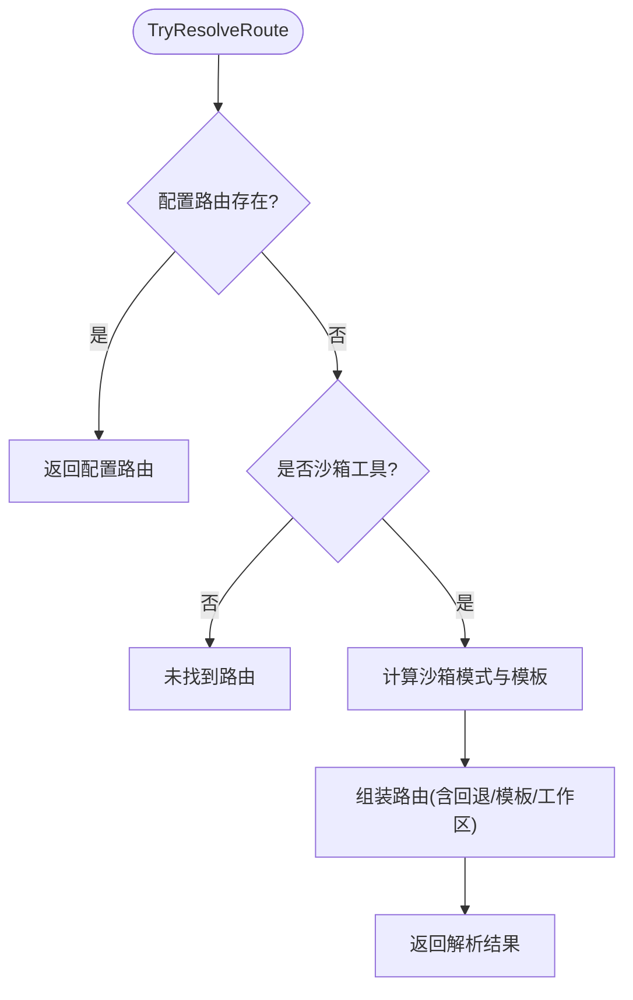
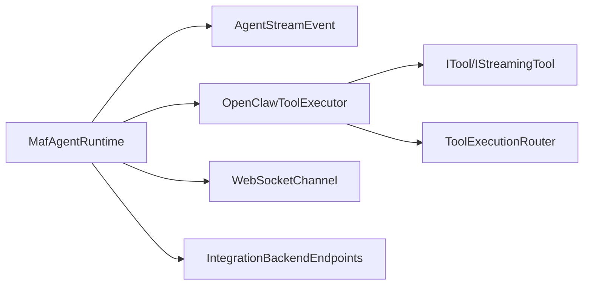

# 流式响应处理

<cite>
**本文引用的文件**
- [StreamingTypes.cs](file://src/OpenClaw.Core/Models/StreamingTypes.cs)
- [IStreamingTool.cs](file://src/OpenClaw.Core/Abstractions/IStreamingTool.cs)
- [MafAgentRuntime.cs](file://src/OpenClaw.Agent/MafAgentRuntime.cs)
- [OpenClawToolExecutor.cs](file://src/OpenClaw.Agent/OpenClawToolExecutor.cs)
- [WebSocketChannel.cs](file://src/OpenClaw.Channels/WebSocketChannel.cs)
- [IntegrationBackendEndpoints.cs](file://src/OpenClaw.Gateway/Endpoints/IntegrationBackendEndpoints.cs)
- [StreamingSmokeEchoTool.cs](file://src/OpenClaw.Agent/Tools/StreamingSmokeEchoTool.cs)
- [MafAgentRuntimeFactory.cs](file://src/OpenClaw.Agent/MafAgentRuntimeFactory.cs)
- [MafOptions.cs](file://src/OpenClaw.Agent/MafOptions.cs)
- [MafGatewayIntegrationTests.cs](file://src/OpenClaw.Tests/MafGatewayIntegrationTests.cs)
- [GatewayWorkersTests.cs](file://src/OpenClaw.Tests/GatewayWorkersTests.cs)
- [OpenAiEndpoints.ResponsesFormatting.cs](file://src/OpenClaw.Gateway/Endpoints/OpenAiEndpoints.ResponsesFormatting.cs)
- [OpenClawLiveClient.cs](file://src/OpenClaw.Client/OpenClawLiveClient.cs)
- [ToolExecutionRouter.cs](file://src/OpenClaw.Agent/Execution/ToolExecutionRouter.cs)
</cite>

## 目录
1. [引言](#引言)
2. [项目结构](#项目结构)
3. [核心组件](#核心组件)
4. [架构总览](#架构总览)
5. [详细组件分析](#详细组件分析)
6. [依赖关系分析](#依赖关系分析)
7. [性能考量](#性能考量)
8. [故障排查指南](#故障排查指南)
9. [结论](#结论)
10. [附录](#附录)

## 引言
本技术文档聚焦于流式响应处理系统，系统性阐述事件驱动的流式输出模型、增量文本与工具输出的分发机制、生产者-消费者的通道模式、工具执行的流式化改造以及错误处理策略。文档以 AgentStreamEvent 事件模型为核心，结合 MAF 运行时、WebSocket 通道、SSE 端点与工具执行器等关键模块，给出实现细节、配置选项、使用模式与性能优化建议，并通过流程图与序列图帮助读者快速理解端到端数据流。

## 项目结构
围绕流式响应的关键代码分布在以下模块：
- 核心模型与抽象：定义事件类型与流式工具接口
- 运行时与执行：MAF 运行时负责生成事件流；工具执行器负责收集与转发增量输出
- 传输层：WebSocket 通道与 SSE 端点负责将事件发送给客户端
- 工具样例：提供可复用的流式工具实现参考

图表来源
- [StreamingTypes.cs:1-88](file://src/OpenClaw.Core/Models/StreamingTypes.cs#L1-L88)
- [IStreamingTool.cs:1-11](file://src/OpenClaw.Core/Abstractions/IStreamingTool.cs#L1-L11)
- [MafAgentRuntime.cs:339-483](file://src/OpenClaw.Agent/MafAgentRuntime.cs#L339-L483)
- [OpenClawToolExecutor.cs:786-810](file://src/OpenClaw.Agent/OpenClawToolExecutor.cs#L786-L810)
- [WebSocketChannel.cs:243-281](file://src/OpenClaw.Channels/WebSocketChannel.cs#L243-L281)
- [IntegrationBackendEndpoints.cs:160-233](file://src/OpenClaw.Gateway/Endpoints/IntegrationBackendEndpoints.cs#L160-L233)
- [OpenClawLiveClient.cs:212-221](file://src/OpenClaw.Client/OpenClawLiveClient.cs#L212-L221)
- [StreamingSmokeEchoTool.cs:1-42](file://src/OpenClaw.Agent/Tools/StreamingSmokeEchoTool.cs#L1-L42)
- [MafAgentRuntimeFactory.cs:1-166](file://src/OpenClaw.Agent/MafAgentRuntimeFactory.cs#L1-L166)
- [MafOptions.cs:1-43](file://src/OpenClaw.Agent/MafOptions.cs#L1-L43)
- [ToolExecutionRouter.cs:1-253](file://src/OpenClaw.Agent/Execution/ToolExecutionRouter.cs#L1-L253)

章节来源
- [StreamingTypes.cs:1-88](file://src/OpenClaw.Core/Models/StreamingTypes.cs#L1-L88)
- [MafAgentRuntime.cs:339-483](file://src/OpenClaw.Agent/MafAgentRuntime.cs#L339-L483)
- [OpenClawToolExecutor.cs:786-810](file://src/OpenClaw.Agent/OpenClawToolExecutor.cs#L786-L810)
- [WebSocketChannel.cs:243-281](file://src/OpenClaw.Channels/WebSocketChannel.cs#L243-L281)
- [IntegrationBackendEndpoints.cs:160-233](file://src/OpenClaw.Gateway/Endpoints/IntegrationBackendEndpoints.cs#L160-L233)
- [StreamingSmokeEchoTool.cs:1-42](file://src/OpenClaw.Agent/Tools/StreamingSmokeEchoTool.cs#L1-L42)
- [MafAgentRuntimeFactory.cs:1-166](file://src/OpenClaw.Agent/MafAgentRuntimeFactory.cs#L1-L166)
- [MafOptions.cs:1-43](file://src/OpenClaw.Agent/MafOptions.cs#L1-L43)
- [ToolExecutionRouter.cs:1-253](file://src/OpenClaw.Agent/Execution/ToolExecutionRouter.cs#L1-L253)

## 核心组件
- 事件模型与类型
  - AgentStreamEventType：定义文本增量、工具开始、工具增量、工具结果、错误、完成等事件类型
  - AgentStreamEvent：零分配热路径的数据载体，包含事件类型、内容、工具名、参数、错误码、结果状态、失败信息、下一步提示等字段，并提供便捷构造方法
- 流式工具接口
  - IStreamingTool：可选接口，用于在流式会话中产生增量输出
- 运行时与执行
  - MafAgentRuntime.RunStreamingAsync：生成 AgentStreamEvent 流，写入 ChannelWriter
  - OpenClawToolExecutor：统一执行工具，支持流式增量收集与超时控制
- 传输层
  - WebSocketChannel：仅对使用 JSON 信封的客户端发送流式事件
  - IntegrationBackendEndpoints：SSE 端点，向订阅者推送事件流
  - OpenClawLiveClient：客户端接收循环，解析服务端推送

章节来源
- [StreamingTypes.cs:6-25](file://src/OpenClaw.Core/Models/StreamingTypes.cs#L6-L25)
- [StreamingTypes.cs:31-87](file://src/OpenClaw.Core/Models/StreamingTypes.cs#L31-L87)
- [IStreamingTool.cs:1-11](file://src/OpenClaw.Core/Abstractions/IStreamingTool.cs#L1-L11)
- [MafAgentRuntime.cs:339-483](file://src/OpenClaw.Agent/MafAgentRuntime.cs#L339-L483)
- [OpenClawToolExecutor.cs:786-810](file://src/OpenClaw.Agent/OpenClawToolExecutor.cs#L786-L810)
- [WebSocketChannel.cs:243-281](file://src/OpenClaw.Channels/WebSocketChannel.cs#L243-L281)
- [IntegrationBackendEndpoints.cs:160-233](file://src/OpenClaw.Gateway/Endpoints/IntegrationBackendEndpoints.cs#L160-L233)
- [OpenClawLiveClient.cs:212-221](file://src/OpenClaw.Client/OpenClawLiveClient.cs#L212-L221)

## 架构总览
下图展示从运行时到传输层的端到端流式处理链路，包括事件生成、工具执行、增量聚合与多协议分发。

图表来源
- [MafAgentRuntime.cs:339-483](file://src/OpenClaw.Agent/MafAgentRuntime.cs#L339-L483)
- [OpenClawToolExecutor.cs:786-810](file://src/OpenClaw.Agent/OpenClawToolExecutor.cs#L786-L810)
- [ToolExecutionRouter.cs:65-112](file://src/OpenClaw.Agent/Execution/ToolExecutionRouter.cs#L65-L112)
- [WebSocketChannel.cs:243-281](file://src/OpenClaw.Channels/WebSocketChannel.cs#L243-L281)
- [IntegrationBackendEndpoints.cs:160-233](file://src/OpenClaw.Gateway/Endpoints/IntegrationBackendEndpoints.cs#L160-L233)

## 详细组件分析

### 事件模型与事件类型
- 事件类型
  - 文本增量：TextDelta
  - 工具开始：ToolStart
  - 工具增量：ToolDelta
  - 工具结果：ToolResult
  - 错误：Error
  - 完成：Done
- 事件结构体
  - 字段：类型、内容、工具名、参数、错误码、结果状态、失败信息、下一步提示
  - 构造方法：TextDelta、ToolStarted、ToolDelta、ToolCompleted、ErrorOccurred、Complete
  - 映射：EnvelopeType 将事件类型映射为 WebSocket 信封类型字符串

图表来源
- [StreamingTypes.cs:6-25](file://src/OpenClaw.Core/Models/StreamingTypes.cs#L6-L25)
- [StreamingTypes.cs:31-87](file://src/OpenClaw.Core/Models/StreamingTypes.cs#L31-L87)

章节来源
- [StreamingTypes.cs:1-88](file://src/OpenClaw.Core/Models/StreamingTypes.cs#L1-L88)

### 流式工具接口与实现
- IStreamingTool
  - 方法：ExecuteStreamingAsync 返回增量字符串序列
- 示例：StreamingSmokeEchoTool
  - 名称与描述
  - 参数模式（chunks 数组）
  - 同步执行：ExecuteAsync 聚合所有块
  - 流式执行：ExecuteStreamingAsync 按序发出每个块

图表来源
- [IStreamingTool.cs:1-11](file://src/OpenClaw.Core/Abstractions/IStreamingTool.cs#L1-L11)
- [StreamingSmokeEchoTool.cs:1-42](file://src/OpenClaw.Agent/Tools/StreamingSmokeEchoTool.cs#L1-L42)

章节来源
- [IStreamingTool.cs:1-11](file://src/OpenClaw.Core/Abstractions/IStreamingTool.cs#L1-L11)
- [StreamingSmokeEchoTool.cs:1-42](file://src/OpenClaw.Agent/Tools/StreamingSmokeEchoTool.cs#L1-L42)

### 运行时：生产者与事件生成
- MafAgentRuntime.RunStreamingAsync
  - 校验流式开关
  - 建立 TurnContext 与 MAF 执行上下文
  - 通过 agent.RunStreamingAsync 获取增量更新
  - 将更新转换为 AgentStreamEvent 并写入 ChannelWriter
  - 支持工具调用：生成 ToolStart、ToolDelta、ToolResult 事件
  - 错误兜底：捕获异常并发出 Error 事件，最后发出 Done

图表来源
- [MafAgentRuntime.cs:339-483](file://src/OpenClaw.Agent/MafAgentRuntime.cs#L339-L483)

章节来源
- [MafAgentRuntime.cs:339-483](file://src/OpenClaw.Agent/MafAgentRuntime.cs#L339-L483)

### 工具执行器：流式增量收集与超时控制
- OpenClawToolExecutor.ExecuteStreamingToolCollectAsync
  - 统一执行 IStreamingTool 的 ExecuteStreamingAsync
  - 收集增量并限制最大字符数
  - 支持工具超时（基于配置）
  - 将增量事件写回运行时（通过回调）

图表来源
- [OpenClawToolExecutor.cs:786-810](file://src/OpenClaw.Agent/OpenClawToolExecutor.cs#L786-L810)

章节来源
- [OpenClawToolExecutor.cs:786-810](file://src/OpenClaw.Agent/OpenClawToolExecutor.cs#L786-L810)

### 传输层：WebSocket 与 SSE
- WebSocketChannel
  - 仅对使用 JSON 信封的客户端发送流式事件
  - 将 AgentStreamEvent 映射为 WsServerEnvelope 并序列化发送
- IntegrationBackendEndpoints
  - 设置 SSE 头部并推送事件
  - 读取历史事件并持续推送新事件，直到会话完成
- OpenClawLiveClient
  - 客户端接收循环，按帧解析服务端推送

图表来源
- [WebSocketChannel.cs:243-281](file://src/OpenClaw.Channels/WebSocketChannel.cs#L243-L281)
- [IntegrationBackendEndpoints.cs:160-233](file://src/OpenClaw.Gateway/Endpoints/IntegrationBackendEndpoints.cs#L160-L233)
- [OpenClawLiveClient.cs:212-221](file://src/OpenClaw.Client/OpenClawLiveClient.cs#L212-L221)

章节来源
- [WebSocketChannel.cs:243-281](file://src/OpenClaw.Channels/WebSocketChannel.cs#L243-L281)
- [IntegrationBackendEndpoints.cs:160-233](file://src/OpenClaw.Gateway/Endpoints/IntegrationBackendEndpoints.cs#L160-L233)
- [OpenClawLiveClient.cs:212-221](file://src/OpenClaw.Client/OpenClawLiveClient.cs#L212-L221)

### 工具路由与后端选择
- ToolExecutionRouter
  - 解析工具执行路由：后端、回退后端、模板、工作区需求、沙箱模式
  - 支持本地、Docker、SSH、OpenSandbox 等后端
  - 提供回退逻辑与工作区要求判断

图表来源
- [ToolExecutionRouter.cs:65-112](file://src/OpenClaw.Agent/Execution/ToolExecutionRouter.cs#L65-L112)

章节来源
- [ToolExecutionRouter.cs:1-253](file://src/OpenClaw.Agent/Execution/ToolExecutionRouter.cs#L1-L253)

### 使用模式与配置
- 运行时工厂与选项
  - MafAgentRuntimeFactory：根据运行时状态与委托配置创建运行时
  - MafOptions：启用流式、A2A、会话侧车路径等
- 测试验证
  - MafGatewayIntegrationTests：验证文本增量与工具事件顺序
  - GatewayWorkersTests：验证 WebSocket 流式事件发送

章节来源
- [MafAgentRuntimeFactory.cs:1-166](file://src/OpenClaw.Agent/MafAgentRuntimeFactory.cs#L1-L166)
- [MafOptions.cs:1-43](file://src/OpenClaw.Agent/MafOptions.cs#L1-L43)
- [MafGatewayIntegrationTests.cs:295-316](file://src/OpenClaw.Tests/MafGatewayIntegrationTests.cs#L295-L316)
- [GatewayWorkersTests.cs:427-453](file://src/OpenClaw.Tests/GatewayWorkersTests.cs#L427-L453)

## 依赖关系分析
- 运行时依赖
  - 依赖 IStreamingTool 以获取工具增量
  - 依赖 WebSocketChannel 与 SSE 端点进行事件分发
  - 依赖 OpenClawToolExecutor 进行工具执行与增量聚合
- 工具依赖
  - IStreamingTool 作为可选扩展，非侵入式增强
- 传输层依赖
  - WebSocketChannel 仅面向使用 JSON 信封的客户端
  - SSE 端点面向订阅者推送事件流

图表来源
- [MafAgentRuntime.cs:339-483](file://src/OpenClaw.Agent/MafAgentRuntime.cs#L339-L483)
- [OpenClawToolExecutor.cs:786-810](file://src/OpenClaw.Agent/OpenClawToolExecutor.cs#L786-L810)
- [WebSocketChannel.cs:243-281](file://src/OpenClaw.Channels/WebSocketChannel.cs#L243-L281)
- [IntegrationBackendEndpoints.cs:160-233](file://src/OpenClaw.Gateway/Endpoints/IntegrationBackendEndpoints.cs#L160-L233)
- [ToolExecutionRouter.cs:1-253](file://src/OpenClaw.Agent/Execution/ToolExecutionRouter.cs#L1-L253)

章节来源
- [MafAgentRuntime.cs:339-483](file://src/OpenClaw.Agent/MafAgentRuntime.cs#L339-L483)
- [OpenClawToolExecutor.cs:786-810](file://src/OpenClaw.Agent/OpenClawToolExecutor.cs#L786-L810)
- [WebSocketChannel.cs:243-281](file://src/OpenClaw.Channels/WebSocketChannel.cs#L243-L281)
- [IntegrationBackendEndpoints.cs:160-233](file://src/OpenClaw.Gateway/Endpoints/IntegrationBackendEndpoints.cs#L160-L233)
- [ToolExecutionRouter.cs:1-253](file://src/OpenClaw.Agent/Execution/ToolExecutionRouter.cs#L1-L253)

## 性能考量
- 零分配热路径
  - AgentStreamEvent 采用只读记录结构体，避免堆分配
- 增量聚合
  - 工具增量在内存中拼接，设置最大字符数阈值，防止内存膨胀
- 超时控制
  - 工具执行超时可配置，避免阻塞事件流
- 传输优化
  - WebSocket 仅对 JSON 信封客户端发送；SSE 保持长连接，减少握手开销
- 路由与回退
  - 合理配置后端与回退策略，降低失败重试成本

## 故障排查指南
- 事件缺失或顺序异常
  - 检查运行时是否启用流式开关
  - 确认客户端是否使用 JSON 信封（WebSocket）或订阅 SSE
- 工具无流式输出
  - 确认工具实现 IStreamingTool 并正确发出增量
  - 检查工具超时配置与取消令牌传递
- 错误事件
  - 运行时捕获异常后发出 Error 事件，客户端应显示错误码与消息
- 会话完成但未收到 Done
  - 确认运行时最终发出 Done 事件
  - 检查 SSE 订阅是否提前断开

章节来源
- [MafOptions.cs:16-22](file://src/OpenClaw.Agent/MafOptions.cs#L16-L22)
- [OpenClawToolExecutor.cs:786-810](file://src/OpenClaw.Agent/OpenClawToolExecutor.cs#L786-L810)
- [StreamingTypes.cs:70-74](file://src/OpenClaw.Core/Models/StreamingTypes.cs#L70-L74)
- [IntegrationBackendEndpoints.cs:160-233](file://src/OpenClaw.Gateway/Endpoints/IntegrationBackendEndpoints.cs#L160-L233)

## 结论
该流式响应系统以 AgentStreamEvent 为核心，通过运行时生成事件、工具执行器聚合增量、WebSocket 与 SSE 分发至客户端，实现了低延迟、高吞吐的增量交互体验。配合路由与回退、超时与限流等机制，系统在功能与性能之间取得平衡。建议在生产环境中启用流式开关、合理配置工具超时与内存上限，并确保客户端正确处理 JSON 信封与 SSE 事件。

## 附录
- 关键实现路径
  - 事件模型：[StreamingTypes.cs:1-88](file://src/OpenClaw.Core/Models/StreamingTypes.cs#L1-L88)
  - 流式工具接口：[IStreamingTool.cs:1-11](file://src/OpenClaw.Core/Abstractions/IStreamingTool.cs#L1-L11)
  - 运行时事件生成：[MafAgentRuntime.cs:339-483](file://src/OpenClaw.Agent/MafAgentRuntime.cs#L339-L483)
  - 工具增量收集：[OpenClawToolExecutor.cs:786-810](file://src/OpenClaw.Agent/OpenClawToolExecutor.cs#L786-L810)
  - WebSocket 发送：[WebSocketChannel.cs:243-281](file://src/OpenClaw.Channels/WebSocketChannel.cs#L243-L281)
  - SSE 端点：[IntegrationBackendEndpoints.cs:160-233](file://src/OpenClaw.Gateway/Endpoints/IntegrationBackendEndpoints.cs#L160-L233)
  - 客户端接收：[OpenClawLiveClient.cs:212-221](file://src/OpenClaw.Client/OpenClawLiveClient.cs#L212-L221)
  - 工具路由：[ToolExecutionRouter.cs:1-253](file://src/OpenClaw.Agent/Execution/ToolExecutionRouter.cs#L1-L253)
  - 测试验证：[MafGatewayIntegrationTests.cs:295-316](file://src/OpenClaw.Tests/MafGatewayIntegrationTests.cs#L295-L316)、[GatewayWorkersTests.cs:427-453](file://src/OpenClaw.Tests/GatewayWorkersTests.cs#L427-L453)