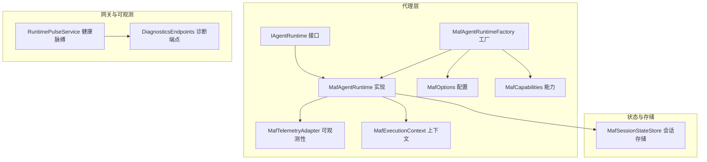
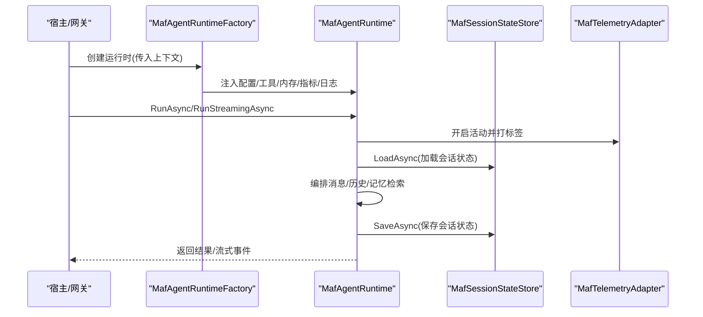
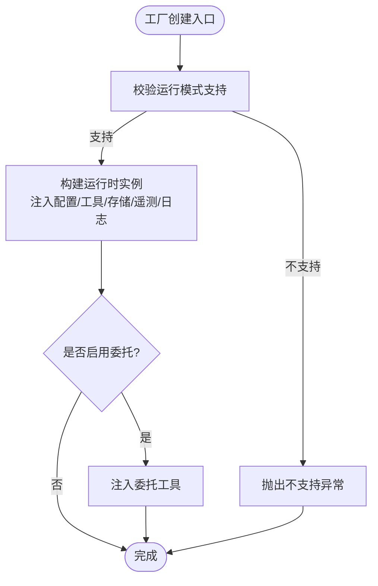
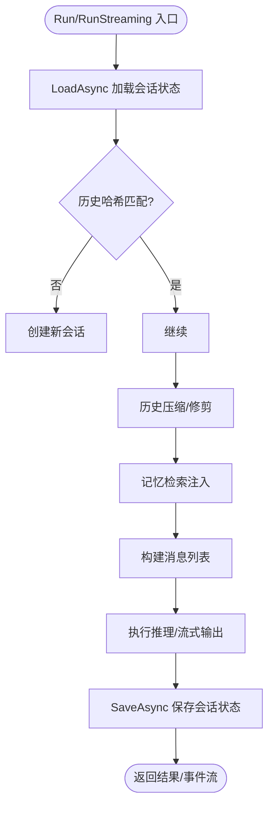
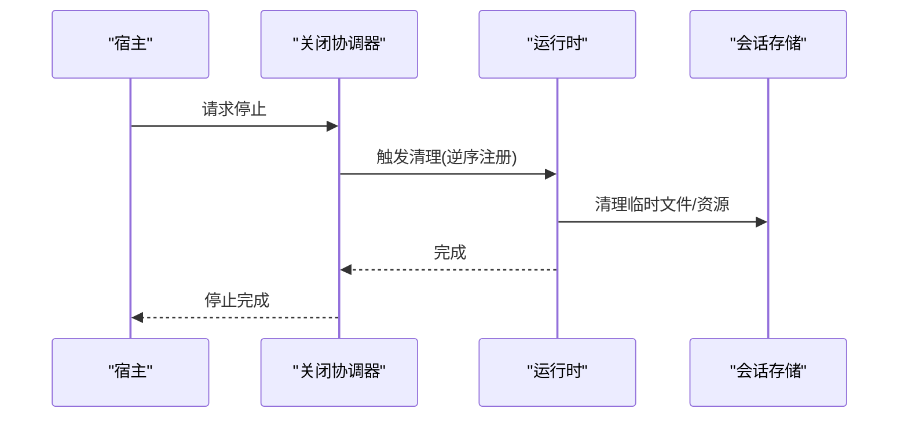
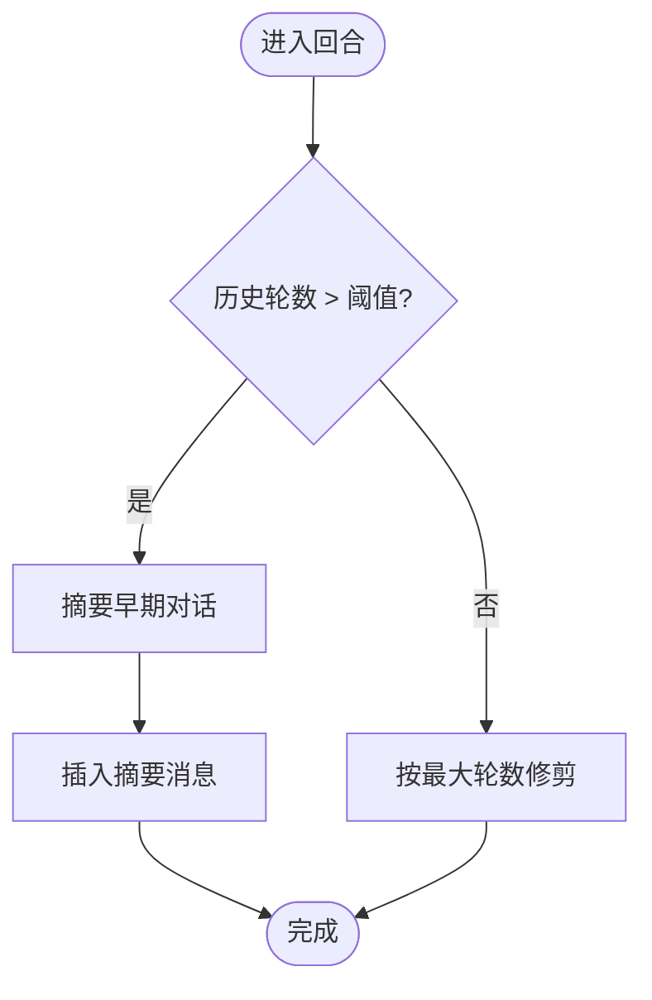
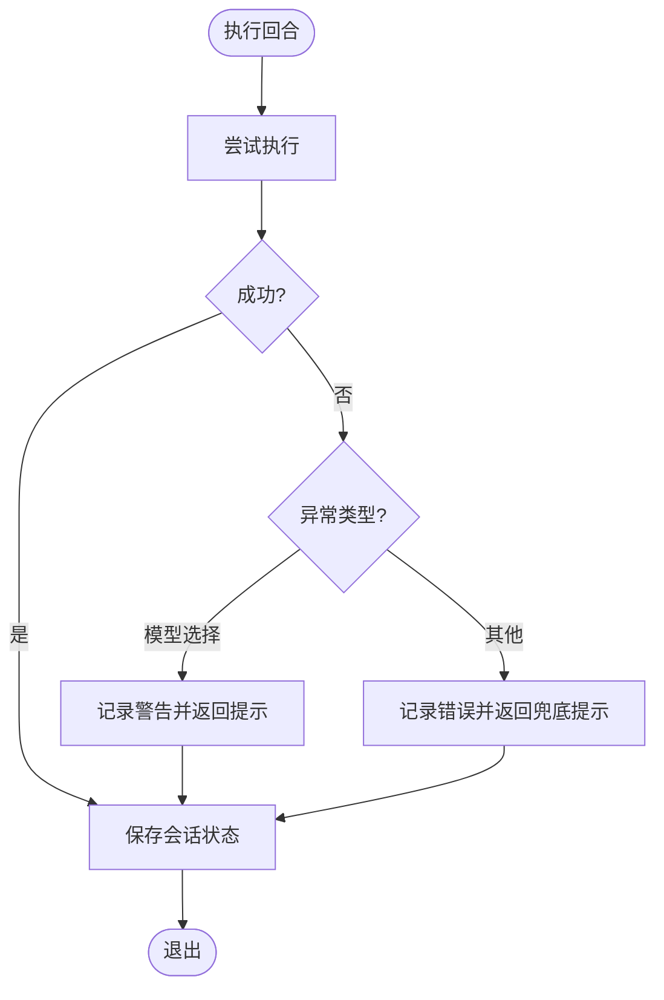
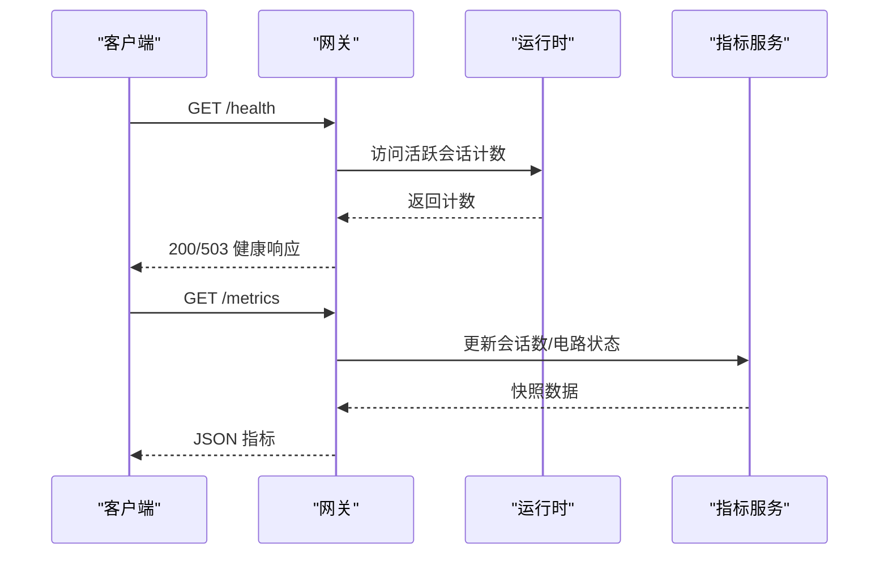
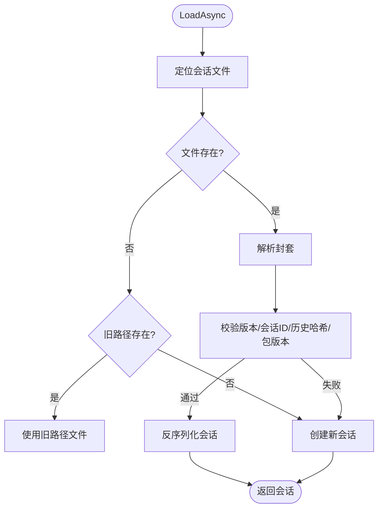
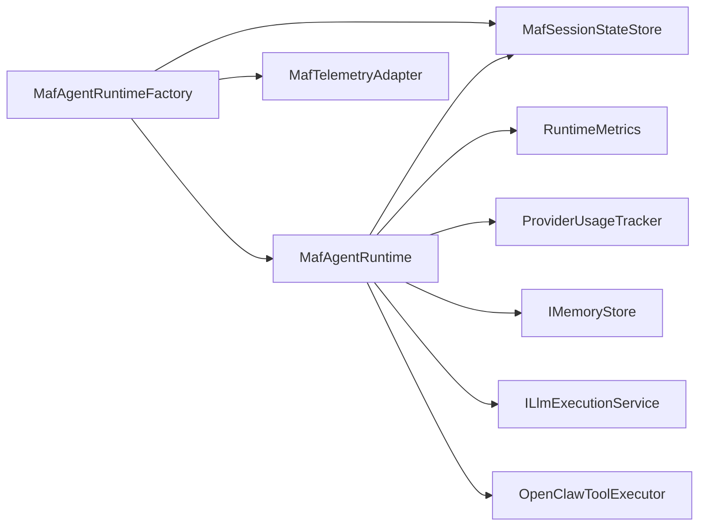

# 生命周期管理

<cite>
**本文引用的文件**
- [MafAgentRuntime.cs](file://src/OpenClaw.Agent/MafAgentRuntime.cs)
- [MafAgentRuntimeFactory.cs](file://src/OpenClaw.Agent/MafAgentRuntimeFactory.cs)
- [MafSessionStateStore.cs](file://src/OpenClaw.Agent/MafSessionStateStore.cs)
- [IAgentRuntime.cs](file://src/OpenClaw.Agent/IAgentRuntime.cs)
- [MafOptions.cs](file://src/OpenClaw.Agent/MafOptions.cs)
- [MafTelemetryAdapter.cs](file://src/OpenClaw.Agent/MafTelemetryAdapter.cs)
- [MafCapabilities.cs](file://src/OpenClaw.Agent/MafCapabilities.cs)
- [MafServiceCollectionExtensions.cs](file://src/OpenClaw.Agent/MafServiceCollectionExtensions.cs)
- [MafExecutionContext.cs](file://src/OpenClaw.Agent/MafExecutionContext.cs)
- [RuntimePulseService.cs](file://src/OpenClaw.Gateway/RuntimePulseService.cs)
- [DiagnosticsEndpoints.cs](file://src/OpenClaw.Gateway/Endpoints/DiagnosticsEndpoints.cs)
- [GatewayRuntimeLifecycleTests.cs](file://src/OpenClaw.Tests/GatewayRuntimeLifecycleTests.cs)
- [MafAgentRuntimeTests.cs](file://src/OpenClaw.Tests/MafAgentRuntimeTests.cs)
- [MafAdapterTests.cs](file://src/OpenClaw.Tests/MafAdapterTests.cs)
</cite>

## 目录
1. [引言](#引言)
2. [项目结构](#项目结构)
3. [核心组件](#核心组件)
4. [架构总览](#架构总览)
5. [详细组件分析](#详细组件分析)
6. [依赖关系分析](#依赖关系分析)
7. [性能考量](#性能考量)
8. [故障排查指南](#故障排查指南)
9. [结论](#结论)
10. [附录](#附录)

## 引言
本文件聚焦于 MAF（Microsoft Agent Framework）代理运行时的生命周期管理，系统性阐述其启动、运行时状态管理、关闭与资源清理、会话状态存储与持久化、状态恢复、内存管理与历史压缩、异常处理与健康检查，以及最佳实践与性能监控建议。内容基于仓库中的实际实现进行归纳总结，并通过图示展示关键流程与组件交互。

## 项目结构
围绕 MAF 运行时生命周期的关键文件组织如下：
- 运行时接口与实现：IAgentRuntime、MafAgentRuntime
- 工厂与装配：MafAgentRuntimeFactory、MafServiceCollectionExtensions
- 会话状态存储：MafSessionStateStore
- 配置与能力：MafOptions、MafCapabilities
- 可观测性：MafTelemetryAdapter
- 上下文与作用域：MafExecutionContext
- 网关侧健康与度量：RuntimePulseService、DiagnosticsEndpoints
- 测试用例：GatewayRuntimeLifecycleTests、MafAgentRuntimeTests、MafAdapterTests

图表来源
- [MafAgentRuntime.cs:17-118](file://src/OpenClaw.Agent/MafAgentRuntime.cs#L17-L118)
- [MafAgentRuntimeFactory.cs:9-41](file://src/OpenClaw.Agent/MafAgentRuntimeFactory.cs#L9-L41)
- [MafSessionStateStore.cs:12-34](file://src/OpenClaw.Agent/MafSessionStateStore.cs#L12-L34)
- [MafTelemetryAdapter.cs:7-24](file://src/OpenClaw.Agent/MafTelemetryAdapter.cs#L7-L24)
- [MafOptions.cs:3-35](file://src/OpenClaw.Agent/MafOptions.cs#L3-L35)
- [MafCapabilities.cs:5-16](file://src/OpenClaw.Agent/MafCapabilities.cs#L5-L16)
- [RuntimePulseService.cs:16-38](file://src/OpenClaw.Gateway/RuntimePulseService.cs#L16-L38)
- [DiagnosticsEndpoints.cs:51-80](file://src/OpenClaw.Gateway/Endpoints/DiagnosticsEndpoints.cs#L51-L80)

章节来源
- [MafAgentRuntime.cs:17-118](file://src/OpenClaw.Agent/MafAgentRuntime.cs#L17-L118)
- [MafAgentRuntimeFactory.cs:9-41](file://src/OpenClaw.Agent/MafAgentRuntimeFactory.cs#L9-L41)
- [MafSessionStateStore.cs:12-34](file://src/OpenClaw.Agent/MafSessionStateStore.cs#L12-L34)
- [MafTelemetryAdapter.cs:7-24](file://src/OpenClaw.Agent/MafTelemetryAdapter.cs#L7-L24)
- [MafOptions.cs:3-35](file://src/OpenClaw.Agent/MafOptions.cs#L3-L35)
- [MafCapabilities.cs:5-16](file://src/OpenClaw.Agent/MafCapabilities.cs#L5-L16)
- [RuntimePulseService.cs:16-38](file://src/OpenClaw.Gateway/RuntimePulseService.cs#L16-L38)
- [DiagnosticsEndpoints.cs:51-80](file://src/OpenClaw.Gateway/Endpoints/DiagnosticsEndpoints.cs#L51-L80)

## 核心组件
- IAgentRuntime：定义运行时对外能力，包括同步/流式对话、技能热加载、工具热替换等。
- MafAgentRuntime：MAF 运行时实现，负责对话回合编排、会话状态加载/保存、历史压缩/修剪、记忆检索注入、工具调用与审批、错误处理与指标记录。
- MafAgentRuntimeFactory：根据运行时配置与委托策略创建运行时实例，支持工具委托模式。
- MafSessionStateStore：会话侧车文件的加载/保存，含版本校验、历史哈希校验、迁移兼容与原子写入。
- MafOptions：MAF 运行时配置项，如会话侧车路径、是否启用流式、A2A 相关开关等。
- MafTelemetryAdapter：为运行时操作开启活动并打标签，便于分布式追踪与指标关联。
- MafCapabilities：声明 MAF 的编排器标识与运行模式支持。
- MafExecutionContext：线程本地上下文，贯穿一次运行/流式过程，承载会话、工具调用收集、回调等。
- RuntimePulseService 与 DiagnosticsEndpoints：网关侧健康检查与指标暴露，用于运行时状态监控。

章节来源
- [IAgentRuntime.cs:8-50](file://src/OpenClaw.Agent/IAgentRuntime.cs#L8-L50)
- [MafAgentRuntime.cs:17-118](file://src/OpenClaw.Agent/MafAgentRuntime.cs#L17-L118)
- [MafAgentRuntimeFactory.cs:9-41](file://src/OpenClaw.Agent/MafAgentRuntimeFactory.cs#L9-L41)
- [MafSessionStateStore.cs:12-34](file://src/OpenClaw.Agent/MafSessionStateStore.cs#L12-L34)
- [MafOptions.cs:3-35](file://src/OpenClaw.Agent/MafOptions.cs#L3-L35)
- [MafTelemetryAdapter.cs:7-24](file://src/OpenClaw.Agent/MafTelemetryAdapter.cs#L7-L24)
- [MafCapabilities.cs:5-16](file://src/OpenClaw.Agent/MafCapabilities.cs#L5-L16)
- [MafExecutionContext.cs:30-45](file://src/OpenClaw.Agent/MafExecutionContext.cs#L30-L45)
- [RuntimePulseService.cs:16-38](file://src/OpenClaw.Gateway/RuntimePulseService.cs#L16-L38)
- [DiagnosticsEndpoints.cs:51-80](file://src/OpenClaw.Gateway/Endpoints/DiagnosticsEndpoints.cs#L51-L80)

## 架构总览
MAF 运行时在网关启动后由工厂创建，使用会话状态存储进行回合间状态持久化；运行时通过可观察适配器记录活动与标签；网关提供健康检查与指标端点以监控运行时状态。

图表来源
- [MafAgentRuntimeFactory.cs:33-41](file://src/OpenClaw.Agent/MafAgentRuntimeFactory.cs#L33-L41)
- [MafAgentRuntime.cs:203-337](file://src/OpenClaw.Agent/MafAgentRuntime.cs#L203-L337)
- [MafSessionStateStore.cs:36-105](file://src/OpenClaw.Agent/MafSessionStateStore.cs#L36-L105)
- [MafTelemetryAdapter.cs:9-17](file://src/OpenClaw.Agent/MafTelemetryAdapter.cs#L9-L17)

## 详细组件分析

### 启动与初始化
- 工厂创建：工厂接收运行时上下文，注入 MAF 选项、代理工厂、会话状态存储、遥测适配器与日志器，构造运行时实例。
- 能力约束：确保运行模式为 JIT/AOT，否则抛出不支持。
- 委托模式：当启用委托且存在配置文件时，工厂注入委托工具以支持跨运行时的工具转发。

图表来源
- [MafAgentRuntimeFactory.cs:119-164](file://src/OpenClaw.Agent/MafAgentRuntimeFactory.cs#L119-L164)
- [MafCapabilities.cs:9-15](file://src/OpenClaw.Agent/MafCapabilities.cs#L9-L15)

章节来源
- [MafAgentRuntimeFactory.cs:17-41](file://src/OpenClaw.Agent/MafAgentRuntimeFactory.cs#L17-L41)
- [MafAgentRuntimeFactory.cs:119-164](file://src/OpenClaw.Agent/MafAgentRuntimeFactory.cs#L119-L164)
- [MafCapabilities.cs:9-15](file://src/OpenClaw.Agent/MafCapabilities.cs#L9-L15)

### 运行时状态管理与会话生命周期
- 会话加载：从会话存储中按会话 ID 定位文件，校验版本、会话 ID、历史哈希与包版本，一致则反序列化；否则创建新会话。
- 会话保存：序列化当前会话状态，生成带版本与哈希的封套，临时文件写入后原子移动覆盖。
- 历史压缩与修剪：当启用压缩时，对早期对话进行摘要压缩；否则按最大轮数修剪。
- 记忆检索注入：基于用户输入与项目前缀检索相关记忆片段，插入到消息列表中作为参考。
- 技能与系统提示：动态拼接技能索引与提示，支持投影路由与阻断提示。

图表来源
- [MafAgentRuntime.cs:245-307](file://src/OpenClaw.Agent/MafAgentRuntime.cs#L245-L307)
- [MafAgentRuntime.cs:386-423](file://src/OpenClaw.Agent/MafAgentRuntime.cs#L386-L423)
- [MafSessionStateStore.cs:36-105](file://src/OpenClaw.Agent/MafSessionStateStore.cs#L36-L105)
- [MafAgentRuntime.cs:684-764](file://src/OpenClaw.Agent/MafAgentRuntime.cs#L684-L764)
- [MafAgentRuntime.cs:625-682](file://src/OpenClaw.Agent/MafAgentRuntime.cs#L625-L682)

章节来源
- [MafAgentRuntime.cs:245-337](file://src/OpenClaw.Agent/MafAgentRuntime.cs#L245-L337)
- [MafAgentRuntime.cs:386-423](file://src/OpenClaw.Agent/MafAgentRuntime.cs#L386-L423)
- [MafSessionStateStore.cs:36-144](file://src/OpenClaw.Agent/MafSessionStateStore.cs#L36-L144)

### 关闭流程与资源清理
- 运行时关闭协调：网关提供运行时关闭协调器，注册异步清理钩子，按注册顺序逆序执行，支持主机取消信号下的排水期。
- 运行时内部释放：运行时通过上下文与通道等机制在回合结束或异常时释放资源；流式场景使用有界通道与单读者/写者模型降低竞争。
- 文件与临时资源：会话存储采用临时文件写入后原子移动，失败时尽力清理临时文件。

图表来源
- [GatewayRuntimeLifecycleTests.cs:43-82](file://src/OpenClaw.Tests/GatewayRuntimeLifecycleTests.cs#L43-L82)
- [MafSessionStateStore.cs:122-143](file://src/OpenClaw.Agent/MafSessionStateStore.cs#L122-L143)

章节来源
- [GatewayRuntimeLifecycleTests.cs:43-82](file://src/OpenClaw.Tests/GatewayRuntimeLifecycleTests.cs#L43-L82)
- [MafSessionStateStore.cs:122-143](file://src/OpenClaw.Agent/MafSessionStateStore.cs#L122-L143)

### 内存管理与历史压缩
- 历史压缩：当历史轮次超过阈值时，将早期对话转为摘要消息，保留最近若干轮，减少上下文开销。
- 修剪策略：未启用压缩时，按最大轮数直接删除早期轮次。
- 记忆检索：限制检索条数与字符长度，避免过度膨胀上下文。

图表来源
- [MafAgentRuntime.cs:684-764](file://src/OpenClaw.Agent/MafAgentRuntime.cs#L684-L764)
- [MafAgentRuntime.cs:1076-1082](file://src/OpenClaw.Agent/MafAgentRuntime.cs#L1076-L1082)
- [MafAgentRuntime.cs:625-682](file://src/OpenClaw.Agent/MafAgentRuntime.cs#L625-L682)

章节来源
- [MafAgentRuntime.cs:684-764](file://src/OpenClaw.Agent/MafAgentRuntime.cs#L684-L764)
- [MafAgentRuntime.cs:1076-1082](file://src/OpenClaw.Agent/MafAgentRuntime.cs#L1076-L1082)

### 异常处理与错误恢复
- 运行时异常：捕获模型选择异常与通用异常，分别返回友好提示并记录指标；流式场景写入错误事件后完成。
- 会话加载失败：记录警告并回退到新建会话，避免因侧车损坏导致整体失败。
- 取消与超时：尊重取消令牌，及时中断并释放资源。

图表来源
- [MafAgentRuntime.cs:320-337](file://src/OpenClaw.Agent/MafAgentRuntime.cs#L320-L337)
- [MafAgentRuntime.cs:524-562](file://src/OpenClaw.Agent/MafAgentRuntime.cs#L524-L562)
- [MafSessionStateStore.cs:100-104](file://src/OpenClaw.Agent/MafSessionStateStore.cs#L100-L104)

章节来源
- [MafAgentRuntime.cs:320-337](file://src/OpenClaw.Agent/MafAgentRuntime.cs#L320-L337)
- [MafAgentRuntime.cs:524-562](file://src/OpenClaw.Agent/MafAgentRuntime.cs#L524-L562)
- [MafSessionStateStore.cs:100-104](file://src/OpenClaw.Agent/MafSessionStateStore.cs#L100-L104)

### 生命周期事件监听、状态监控与健康检查
- 活动与标签：运行时在每次回合开始时启动活动并设置编排器、运行模式、会话与渠道标签，便于追踪。
- 健康检查：网关提供 /health 端点，通过访问活跃会话计数等指标判断就绪状态。
- 指标暴露：/metrics 端点返回运行时指标快照，包含会话数、电路状态等。
- 运行脉搏：后台服务周期性生成心跳与告警摘要，限制最大长度与告警数量。

图表来源
- [DiagnosticsEndpoints.cs:51-80](file://src/OpenClaw.Gateway/Endpoints/DiagnosticsEndpoints.cs#L51-L80)
- [RuntimePulseService.cs:16-38](file://src/OpenClaw.Gateway/RuntimePulseService.cs#L16-L38)
- [MafTelemetryAdapter.cs:9-17](file://src/OpenClaw.Agent/MafTelemetryAdapter.cs#L9-L17)

章节来源
- [DiagnosticsEndpoints.cs:51-80](file://src/OpenClaw.Gateway/Endpoints/DiagnosticsEndpoints.cs#L51-L80)
- [RuntimePulseService.cs:16-38](file://src/OpenClaw.Gateway/RuntimePulseService.cs#L16-L38)
- [MafTelemetryAdapter.cs:9-17](file://src/OpenClaw.Agent/MafTelemetryAdapter.cs#L9-L17)

### 会话状态存储机制、持久化与恢复
- 存储布局：以会话 ID 的 SHA256 哈希命名文件，置于配置指定的存储根路径下。
- 版本与兼容：封套包含版本号与包版本，不匹配时丢弃并重建；支持旧路径迁移。
- 历史一致性：封套包含历史哈希，若当前历史与封套不一致则丢弃并重建。
- 原子写入：先写临时文件，再原子移动覆盖，失败时尽力清理临时文件。

图表来源
- [MafSessionStateStore.cs:36-105](file://src/OpenClaw.Agent/MafSessionStateStore.cs#L36-L105)
- [MafSessionStateStore.cs:146-195](file://src/OpenClaw.Agent/MafSessionStateStore.cs#L146-L195)

章节来源
- [MafSessionStateStore.cs:36-144](file://src/OpenClaw.Agent/MafSessionStateStore.cs#L36-L144)
- [MafSessionStateStore.cs:146-195](file://src/OpenClaw.Agent/MafSessionStateStore.cs#L146-L195)

### 最佳实践与建议
- 会话侧车路径：通过配置项指定存储根与子路径，避免与默认路径冲突。
- 历史压缩：在长对话场景启用压缩，合理设置阈值与保留轮数，平衡上下文质量与成本。
- 记忆检索：限制检索条数与字符上限，避免上下文溢出；必要时关闭以降低风险。
- 流式控制：根据需求启用/禁用流式，注意通道容量与取消语义。
- 健康与指标：定期检查 /health 与 /metrics，结合运行脉搏告警进行容量与稳定性评估。
- 升级与兼容：升级 MAF 包版本时，旧侧车会被自动丢弃重建，确保会话连续性。

章节来源
- [MafOptions.cs:14-16](file://src/OpenClaw.Agent/MafOptions.cs#L14-L16)
- [MafAgentRuntime.cs:684-764](file://src/OpenClaw.Agent/MafAgentRuntime.cs#L684-L764)
- [MafAgentRuntime.cs:625-682](file://src/OpenClaw.Agent/MafAgentRuntime.cs#L625-L682)
- [DiagnosticsEndpoints.cs:51-80](file://src/OpenClaw.Gateway/Endpoints/DiagnosticsEndpoints.cs#L51-L80)
- [RuntimePulseService.cs:16-38](file://src/OpenClaw.Gateway/RuntimePulseService.cs#L16-L38)

## 依赖关系分析
- 组件耦合：运行时强依赖工具执行器、LLM 执行服务、内存存储、指标与用量跟踪、遥测适配器；工厂负责装配与委托工具注入。
- 外部集成：通过网关端点暴露健康与指标；通过 MAF 提供的 ChatClientAgent 进行推理与工具调用。
- 循环依赖：未见直接循环依赖；上下文与工具通过接口解耦。

图表来源
- [MafAgentRuntimeFactory.cs:17-41](file://src/OpenClaw.Agent/MafAgentRuntimeFactory.cs#L17-L41)
- [MafAgentRuntime.cs:57-118](file://src/OpenClaw.Agent/MafAgentRuntime.cs#L57-L118)

章节来源
- [MafAgentRuntimeFactory.cs:17-41](file://src/OpenClaw.Agent/MafAgentRuntimeFactory.cs#L17-L41)
- [MafAgentRuntime.cs:57-118](file://src/OpenClaw.Agent/MafAgentRuntime.cs#L57-L118)

## 性能考量
- 历史压缩：显著降低上下文长度，减少令牌消耗与延迟，但需权衡信息丢失。
- 记忆检索：适度限制检索规模，避免频繁大文本注入带来的延迟与令牌浪费。
- 流式输出：启用流式可改善用户体验，但需关注通道容量与背压处理。
- 指标与监控：通过 /metrics 与运行脉搏持续观测请求量、错误率、令牌用量与电路状态，指导容量规划与优化。

[本节为通用性能讨论，无需特定文件引用]

## 故障排查指南
- 会话侧车损坏：加载失败时会回退到新建会话；检查存储权限与磁盘空间。
- 历史哈希不匹配：可能由于历史被外部修改；确认会话历史未被并发修改。
- 模型选择失败：检查 LLM 配置与配额；查看运行时日志与指标。
- 流式异常：确认流式已启用；检查通道写入与取消令牌传递。
- 健康检查失败：通过 /health 与 /metrics 判断是否处于就绪状态；关注电路状态与活跃会话数。

章节来源
- [MafSessionStateStore.cs:100-104](file://src/OpenClaw.Agent/MafSessionStateStore.cs#L100-L104)
- [MafAgentRuntime.cs:324-336](file://src/OpenClaw.Agent/MafAgentRuntime.cs#L324-L336)
- [MafAgentRuntime.cs:529-561](file://src/OpenClaw.Agent/MafAgentRuntime.cs#L529-L561)
- [DiagnosticsEndpoints.cs:51-80](file://src/OpenClaw.Gateway/Endpoints/DiagnosticsEndpoints.cs#L51-L80)

## 结论
MAF 代理运行时通过清晰的工厂装配、可靠的会话状态存储与恢复、完善的异常处理与可观测性，实现了稳定高效的对话编排。配合网关的健康检查与指标端点，可实现对运行时状态的实时监控与快速故障定位。遵循本文最佳实践，可在保证性能的同时提升系统的可维护性与鲁棒性。

[本节为总结性内容，无需特定文件引用]

## 附录
- 相关测试用例可验证会话持久化往返、运行时生命周期关闭顺序、工具过滤与投影路由行为等。

章节来源
- [MafAdapterTests.cs:44-75](file://src/OpenClaw.Tests/MafAdapterTests.cs#L44-L75)
- [GatewayRuntimeLifecycleTests.cs:43-82](file://src/OpenClaw.Tests/GatewayRuntimeLifecycleTests.cs#L43-L82)
- [MafAgentRuntimeTests.cs:40-108](file://src/OpenClaw.Tests/MafAgentRuntimeTests.cs#L40-L108)