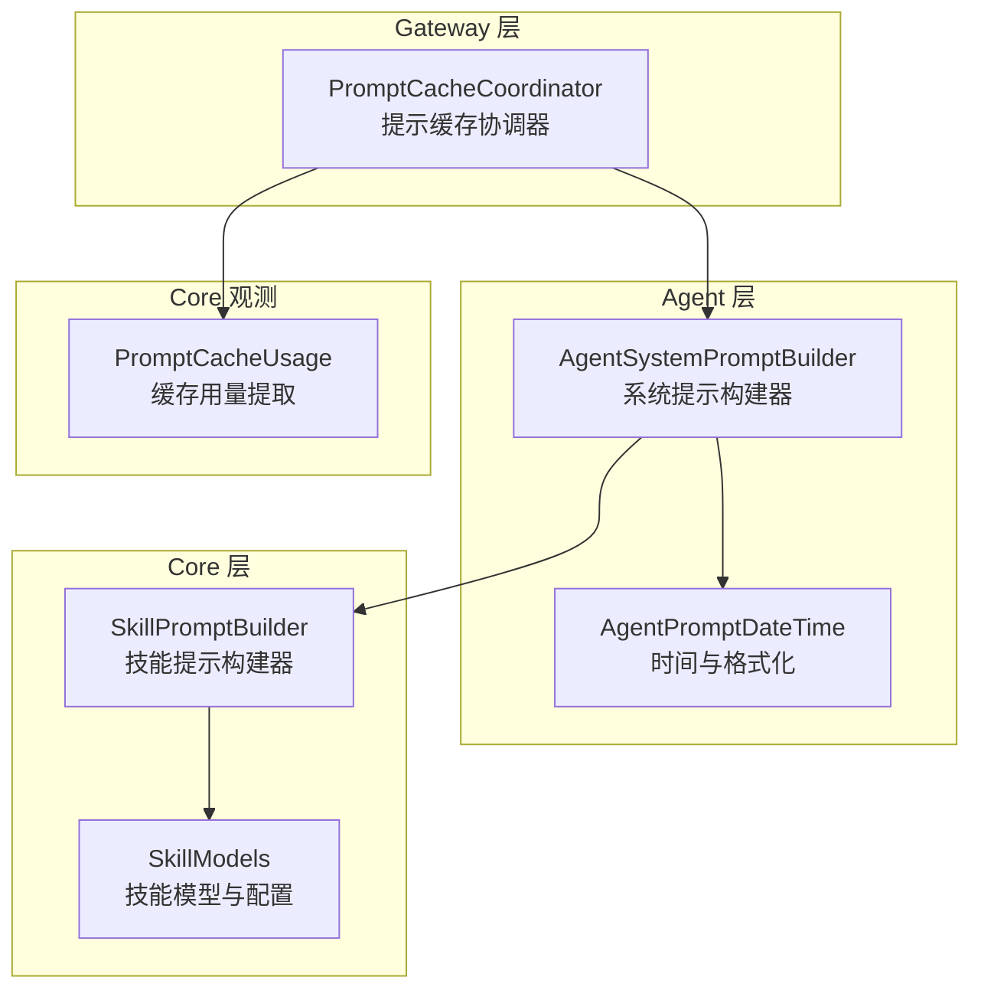
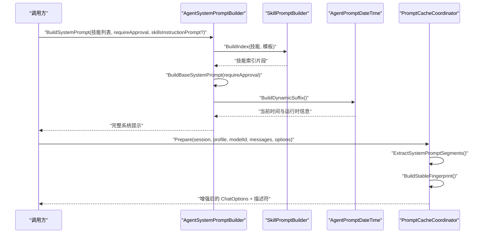
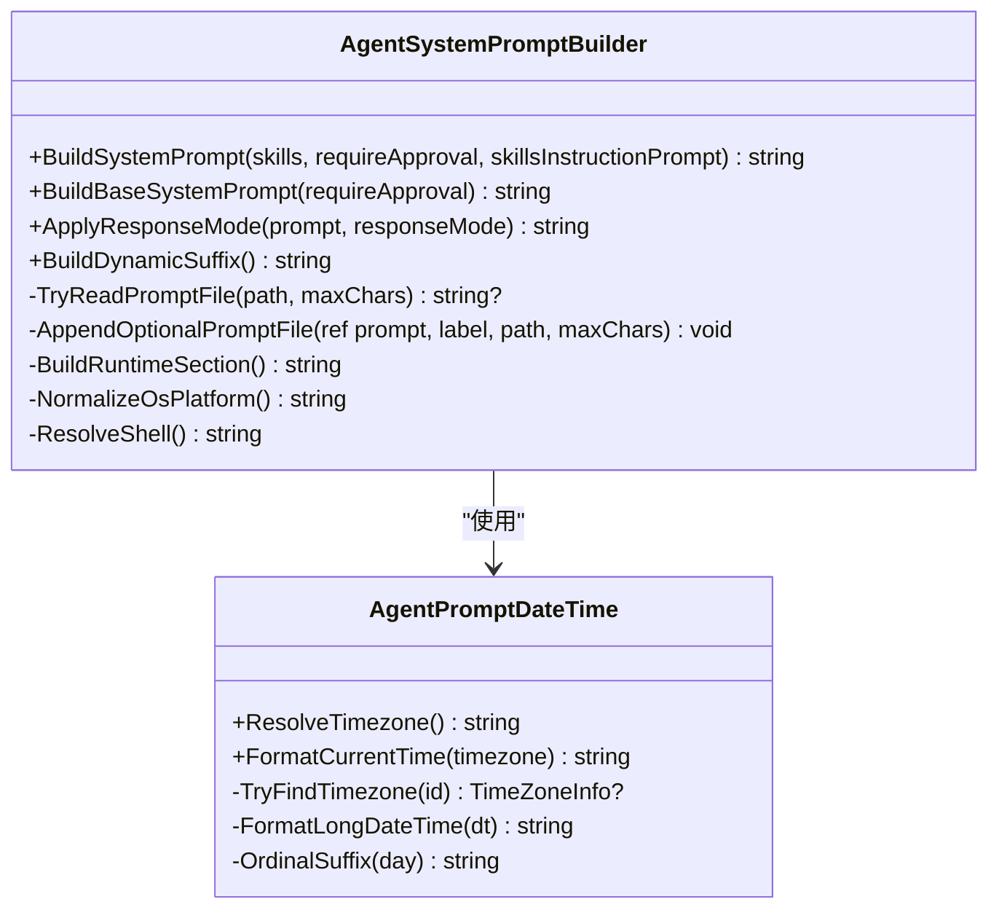
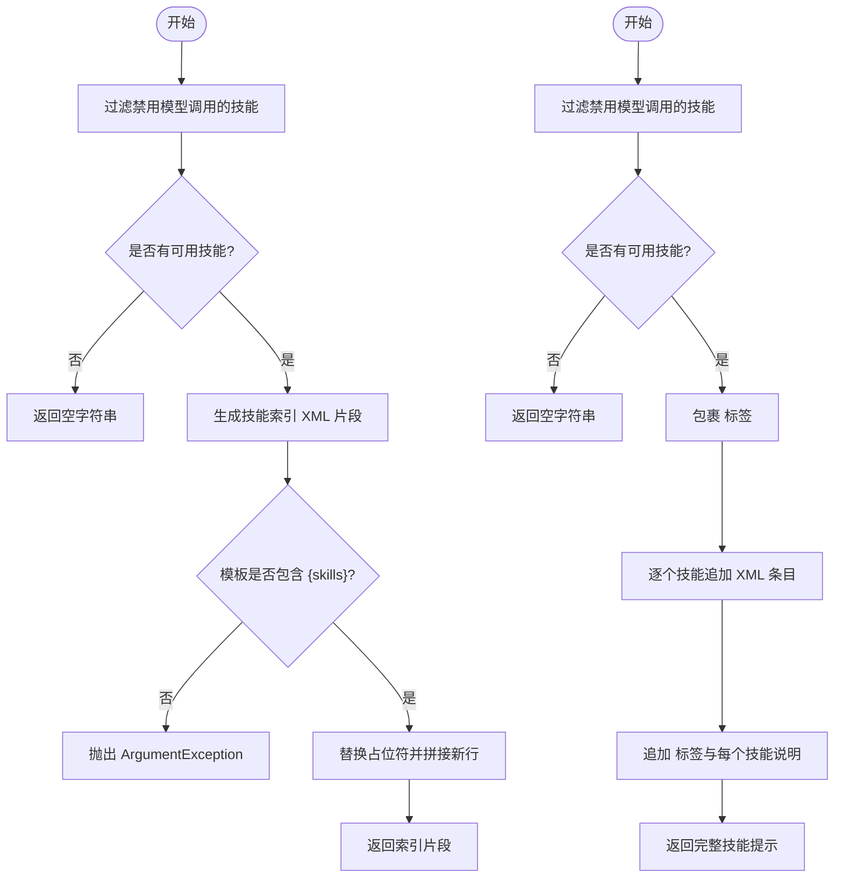
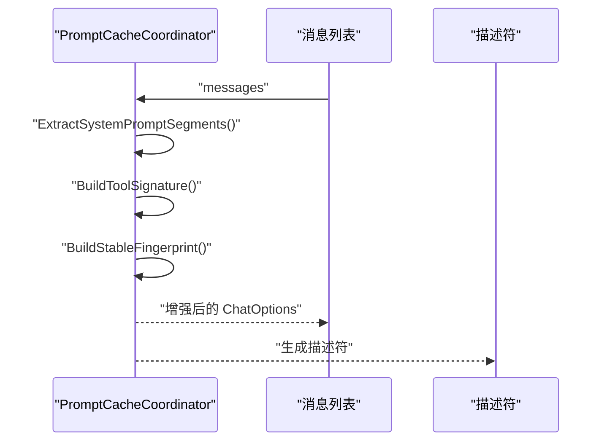
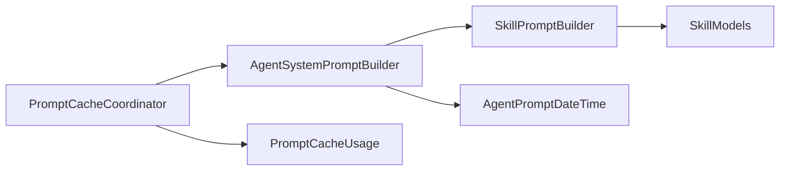

# 系统提示构建

<cite>
**本文引用的文件**
- [AgentSystemPromptBuilder.cs](file://src/OpenClaw.Agent/AgentSystemPromptBuilder.cs)
- [SkillPromptBuilder.cs](file://src/OpenClaw.Core/Skills/SkillPromptBuilder.cs)
- [AgentPromptDateTime.cs](file://src/OpenClaw.Agent/AgentPromptDateTime.cs)
- [SkillModels.cs](file://src/OpenClaw.Core/Skills/SkillModels.cs)
- [PromptCacheCoordinator.cs](file://src/OpenClaw.Gateway/PromptCaching/PromptCacheCoordinator.cs)
- [PromptCacheUsage.cs](file://src/OpenClaw.Core/Observability/PromptCacheUsage.cs)
- [OpenClaw.NET-PromptCaching-Internal-Doc.md](file://docs/OpenClaw.NET-PromptCaching-Internal-Doc.md)
- [AgentSystemPromptBuilderTests.cs](file://src/OpenClaw.Tests/AgentSystemPromptBuilderTests.cs)
</cite>

## 目录
1. [简介](#简介)
2. [项目结构](#项目结构)
3. [核心组件](#核心组件)
4. [架构总览](#架构总览)
5. [详细组件分析](#详细组件分析)
6. [依赖关系分析](#依赖关系分析)
7. [性能考量](#性能考量)
8. [故障排除指南](#故障排除指南)
9. [结论](#结论)
10. [附录](#附录)

## 简介
本文件面向“系统提示构建”主题，聚焦以下目标：
- 系统提示的动态构建过程与后缀注入
- 技能提示的注入策略与模板管理
- 动态后缀（时间、运行时信息）的生成与刷新
- 提示长度管理与优化技术
- AgentSystemPromptBuilder 的构建逻辑、SkillPromptBuilder 的技能注入策略
- 提示缓存子系统的集成与提示长度管理的关系

文档同时提供流程图、类图与定制化指南，帮助读者快速掌握提示构建的实现细节与最佳实践。

## 项目结构
围绕系统提示构建的关键代码分布在以下模块：
- Agent 层：系统提示构建与动态后缀生成
- Core 层：技能提示构建与技能模型
- Gateway 层：提示缓存协调与追踪
- 文档：提示缓存内部设计文档

**图表来源**
- [AgentSystemPromptBuilder.cs:1-150](file://src/OpenClaw.Agent/AgentSystemPromptBuilder.cs#L1-L150)
- [SkillPromptBuilder.cs:1-354](file://src/OpenClaw.Core/Skills/SkillPromptBuilder.cs#L1-L354)
- [AgentPromptDateTime.cs:1-46](file://src/OpenClaw.Agent/AgentPromptDateTime.cs#L1-L46)
- [SkillModels.cs:1-214](file://src/OpenClaw.Core/Skills/SkillModels.cs#L1-L214)
- [PromptCacheCoordinator.cs:1-269](file://src/OpenClaw.Gateway/PromptCaching/PromptCacheCoordinator.cs#L1-L269)
- [PromptCacheUsage.cs:1-55](file://src/OpenClaw.Core/Observability/PromptCacheUsage.cs#L1-L55)

**章节来源**
- [AgentSystemPromptBuilder.cs:1-150](file://src/OpenClaw.Agent/AgentSystemPromptBuilder.cs#L1-L150)
- [SkillPromptBuilder.cs:1-354](file://src/OpenClaw.Core/Skills/SkillPromptBuilder.cs#L1-L354)
- [AgentPromptDateTime.cs:1-46](file://src/OpenClaw.Agent/AgentPromptDateTime.cs#L1-L46)
- [SkillModels.cs:1-214](file://src/OpenClaw.Core/Skills/SkillModels.cs#L1-L214)
- [PromptCacheCoordinator.cs:1-269](file://src/OpenClaw.Gateway/PromptCaching/PromptCacheCoordinator.cs#L1-L269)
- [PromptCacheUsage.cs:1-55](file://src/OpenClaw.Core/Observability/PromptCacheUsage.cs#L1-L55)

## 核心组件
- AgentSystemPromptBuilder：负责基础系统提示的构建、审批提示注入、响应模式应用以及动态后缀（时间与运行时信息）生成。
- SkillPromptBuilder：负责技能索引与技能体的提示片段生成，支持模板化注入与渐进披露（progressive disclosure）。
- AgentPromptDateTime：负责时区解析与当前时间格式化，用于动态后缀。
- SkillModels：定义技能模型、资源类型、加载配置与元数据，支撑提示构建与注入策略。
- PromptCacheCoordinator：负责将系统提示拆分为稳定前缀与易变后缀，生成稳定指纹，并注入提供商特定的缓存键与保留策略；与缓存用量提取器配合进行可观测性。

**章节来源**
- [AgentSystemPromptBuilder.cs:20-150](file://src/OpenClaw.Agent/AgentSystemPromptBuilder.cs#L20-L150)
- [SkillPromptBuilder.cs:9-354](file://src/OpenClaw.Core/Skills/SkillPromptBuilder.cs#L9-L354)
- [AgentPromptDateTime.cs:5-46](file://src/OpenClaw.Agent/AgentPromptDateTime.cs#L5-L46)
- [SkillModels.cs:8-214](file://src/OpenClaw.Core/Skills/SkillModels.cs#L8-L214)
- [PromptCacheCoordinator.cs:103-269](file://src/OpenClaw.Gateway/PromptCaching/PromptCacheCoordinator.cs#L103-L269)

## 架构总览
系统提示构建的整体流程如下：
- AgentSystemPromptBuilder 生成基础系统提示，并根据需要注入审批提示与工作区记忆文件内容。
- SkillPromptBuilder 生成技能索引与技能体片段，支持模板化与渐进披露。
- AgentSystemPromptBuilder 在每次对话轮次注入动态后缀（当前时间与运行时信息），确保时效性。
- PromptCacheCoordinator 将系统提示拆分为稳定前缀与易变后缀，计算稳定指纹，注入提供商特定的缓存键与保留策略，从而提升推理效率与降低成本。

**图表来源**
- [AgentSystemPromptBuilder.cs:20-118](file://src/OpenClaw.Agent/AgentSystemPromptBuilder.cs#L20-L118)
- [SkillPromptBuilder.cs:110-145](file://src/OpenClaw.Core/Skills/SkillPromptBuilder.cs#L110-L145)
- [AgentPromptDateTime.cs:112-148](file://src/OpenClaw.Agent/AgentPromptDateTime.cs#L112-L148)
- [PromptCacheCoordinator.cs:103-169](file://src/OpenClaw.Gateway/PromptCaching/PromptCacheCoordinator.cs#L103-L169)

## 详细组件分析

### AgentSystemPromptBuilder：系统提示构建器
职责与特性：
- 基础系统提示构建：包含角色设定、工具使用指导、安全注意事项与工作区提示文件（AGENTS.md、SOUL.md）的可选注入。
- 审批提示注入：当 requireApproval 为真时，追加“需要用户批准”的提示。
- 技能提示注入：通过 SkillPromptBuilder.BuildIndex 生成技能索引片段，并与基础提示拼接。
- 响应模式应用：当 responseMode 等于“简洁运营模式”时，追加操作式指令。
- 动态后缀生成：每轮注入当前时间与运行时信息，确保时效性。

关键方法与行为：
- BuildSystemPrompt：主入口，组合基础提示与技能索引。
- BuildBaseSystemPrompt：构建基础提示，读取工作区提示文件并限制最大字符数。
- ApplyResponseMode：根据响应模式追加操作式指令。
- BuildDynamicSuffix：生成动态后缀（时间与运行时信息）。

**图表来源**
- [AgentSystemPromptBuilder.cs:20-150](file://src/OpenClaw.Agent/AgentSystemPromptBuilder.cs#L20-L150)
- [AgentPromptDateTime.cs:5-46](file://src/OpenClaw.Agent/AgentPromptDateTime.cs#L5-L46)

**章节来源**
- [AgentSystemPromptBuilder.cs:20-150](file://src/OpenClaw.Agent/AgentSystemPromptBuilder.cs#L20-L150)
- [AgentPromptDateTime.cs:5-46](file://src/OpenClaw.Agent/AgentPromptDateTime.cs#L5-L46)

### SkillPromptBuilder：技能提示构建器
职责与特性：
- Build：生成完整的技能提示（索引 + 每个技能的完整说明），适合一次性注入场景。
- BuildIndex：仅生成技能索引（元数据 + 资源清单），技能体（SKILL.md）不内嵌，通过工具按需加载，实现渐进披露。
- BuildSkillBody：生成单个技能的技能体片段，供按需注入。
- 默认模板与占位符：支持自定义模板，要求包含 {skills} 占位符；可选 {load_instruction} 与 {resource_instruction}。
- 成本估算：提供估算函数，用于评估提示长度与 token 成本，便于优化与调试。

**图表来源**
- [SkillPromptBuilder.cs:20-145](file://src/OpenClaw.Core/Skills/SkillPromptBuilder.cs#L20-L145)
- [SkillPromptBuilder.cs:201-354](file://src/OpenClaw.Core/Skills/SkillPromptBuilder.cs#L201-L354)

**章节来源**
- [SkillPromptBuilder.cs:9-354](file://src/OpenClaw.Core/Skills/SkillPromptBuilder.cs#L9-L354)

### AgentPromptDateTime：动态后缀时间与时区
职责与特性：
- 解析本地时区 ID，若为空则回退到 UTC。
- 格式化当前时间，包含本地时间与 UTC 时间，以及文化相关的序数后缀。
- 为动态后缀提供统一的时间格式化能力。

**章节来源**
- [AgentPromptDateTime.cs:5-46](file://src/OpenClaw.Agent/AgentPromptDateTime.cs#L5-L46)

### SkillModels：技能模型与配置
职责与特性：
- SkillsConfig：技能系统主配置，包括启用开关、加载策略、索引模板覆盖、资源读取大小限制等。
- SkillLoadConfig：控制从哪些目录加载技能（额外目录、捆绑、托管、工作区、插件），以及热重载。
- SkillDefinition：技能定义，包含名称、描述、说明、位置、来源、元数据、资源清单、投影合约等。
- SkillResource 与 SkillResourceKind：辅助资源类型（参考材料或脚本）。
- SkillMetadata：元数据门控（操作系统、二进制依赖、环境变量、配置项等）。

**章节来源**
- [SkillModels.cs:8-214](file://src/OpenClaw.Core/Skills/SkillModels.cs#L8-L214)

### 提示缓存子系统：与提示长度管理的关系
职责与特性：
- PromptCacheCoordinator：将系统提示拆分为稳定前缀与易变后缀，计算稳定指纹，注入提供商特定的缓存键与保留策略。
- PromptCacheUsage：统一提取缓存读取与写入 token 数，便于观测与统计。
- 与提示构建的关系：通过“稳定/易变”分离，使稳定部分可被缓存，从而减少每轮 token 消耗与延迟；动态后缀（如时间）属于易变部分，不参与缓存。

**图表来源**
- [PromptCacheCoordinator.cs:103-169](file://src/OpenClaw.Gateway/PromptCaching/PromptCacheCoordinator.cs#L103-L169)
- [PromptCacheUsage.cs:10-55](file://src/OpenClaw.Core/Observability/PromptCacheUsage.cs#L10-L55)
- [OpenClaw.NET-PromptCaching-Internal-Doc.md:184-207](file://docs/OpenClaw.NET-PromptCaching-Internal-Doc.md#L184-L207)

**章节来源**
- [PromptCacheCoordinator.cs:103-269](file://src/OpenClaw.Gateway/PromptCaching/PromptCacheCoordinator.cs#L103-L269)
- [PromptCacheUsage.cs:1-55](file://src/OpenClaw.Core/Observability/PromptCacheUsage.cs#L1-L55)
- [OpenClaw.NET-PromptCaching-Internal-Doc.md:1-546](file://docs/OpenClaw.NET-PromptCaching-Internal-Doc.md#L1-L546)

## 依赖关系分析
- AgentSystemPromptBuilder 依赖 SkillPromptBuilder 生成技能索引，依赖 AgentPromptDateTime 生成动态后缀。
- SkillPromptBuilder 依赖 SkillModels 中的技能定义与资源类型。
- PromptCacheCoordinator 依赖系统提示构建产物（稳定前缀与工具签名），并产出描述符与增强后的 ChatOptions。
- PromptCacheUsage 提供统一的缓存用量提取能力，支撑可观测性。

**图表来源**
- [AgentSystemPromptBuilder.cs:1-150](file://src/OpenClaw.Agent/AgentSystemPromptBuilder.cs#L1-L150)
- [SkillPromptBuilder.cs:1-354](file://src/OpenClaw.Core/Skills/SkillPromptBuilder.cs#L1-L354)
- [AgentPromptDateTime.cs:1-46](file://src/OpenClaw.Agent/AgentPromptDateTime.cs#L1-L46)
- [SkillModels.cs:1-214](file://src/OpenClaw.Core/Skills/SkillModels.cs#L1-L214)
- [PromptCacheCoordinator.cs:1-269](file://src/OpenClaw.Gateway/PromptCaching/PromptCacheCoordinator.cs#L1-L269)
- [PromptCacheUsage.cs:1-55](file://src/OpenClaw.Core/Observability/PromptCacheUsage.cs#L1-L55)

**章节来源**
- [AgentSystemPromptBuilder.cs:1-150](file://src/OpenClaw.Agent/AgentSystemPromptBuilder.cs#L1-L150)
- [SkillPromptBuilder.cs:1-354](file://src/OpenClaw.Core/Skills/SkillPromptBuilder.cs#L1-L354)
- [AgentPromptDateTime.cs:1-46](file://src/OpenClaw.Agent/AgentPromptDateTime.cs#L1-L46)
- [SkillModels.cs:1-214](file://src/OpenClaw.Core/Skills/SkillModels.cs#L1-L214)
- [PromptCacheCoordinator.cs:1-269](file://src/OpenClaw.Gateway/PromptCaching/PromptCacheCoordinator.cs#L1-L269)
- [PromptCacheUsage.cs:1-55](file://src/OpenClaw.Core/Observability/PromptCacheUsage.cs#L1-L55)

## 性能考量
- 渐进披露（Progressive Disclosure）：通过 SkillPromptBuilder.BuildIndex 仅注入索引与资源清单，技能体按需加载，显著降低初始提示长度与 token 成本。
- 成本估算：SkillPromptBuilder 提供估算函数，可用于权衡“全量注入 vs 渐进披露”的收益。
- 提示缓存：PromptCacheCoordinator 将系统提示拆分为稳定/易变两部分，稳定前缀可被缓存，减少重复 token 处理，降低延迟与成本。
- 动态后缀：每轮生成当前时间与运行时信息，确保时效性，但属于易变部分，不参与缓存。
- 文件读取限制：AgentSystemPromptBuilder 在读取工作区提示文件时限制最大字符数，避免过大文件导致提示膨胀。

[本节为通用性能建议，不直接分析具体文件]

## 故障排除指南
- 响应模式未生效
  - 确认 responseMode 设置为“简洁运营模式”，否则不会追加操作式指令。
  - 参考测试用例验证行为。
  - 参考来源：[AgentSystemPromptBuilderTests.cs:9-24](file://src/OpenClaw.Tests/AgentSystemPromptBuilderTests.cs#L9-L24)

- 技能索引模板错误
  - 自定义模板必须包含 {skills} 占位符，否则抛出 ArgumentException。
  - 若存在 {resource_instruction}，仅在至少一个技能暴露资源时才生效。
  - 参考来源：[SkillPromptBuilder.cs:106-145](file://src/OpenClaw.Core/Skills/SkillPromptBuilder.cs#L106-L145)

- 工作区提示文件未注入
  - 确认 OPENCLAW_WORKSPACE 环境变量或当前目录下存在 AGENTS.md、SOUL.md。
  - 文件读取失败或为空时不会注入内容。
  - 参考来源：[AgentSystemPromptBuilder.cs:92-100](file://src/OpenClaw.Agent/AgentSystemPromptBuilder.cs#L92-L100)

- 提示缓存未生效
  - 检查模型配置文件的缓存能力标记、方言解析与保留策略。
  - 确认系统提示包含可缓存的稳定前缀（不含易变内容）。
  - 参考来源：[OpenClaw.NET-PromptCaching-Internal-Doc.md:184-207](file://docs/OpenClaw.NET-PromptCaching-Internal-Doc.md#L184-L207)

**章节来源**
- [AgentSystemPromptBuilderTests.cs:1-25](file://src/OpenClaw.Tests/AgentSystemPromptBuilderTests.cs#L1-L25)
- [SkillPromptBuilder.cs:106-145](file://src/OpenClaw.Core/Skills/SkillPromptBuilder.cs#L106-L145)
- [AgentSystemPromptBuilder.cs:92-100](file://src/OpenClaw.Agent/AgentSystemPromptBuilder.cs#L92-L100)
- [OpenClaw.NET-PromptCaching-Internal-Doc.md:184-207](file://docs/OpenClaw.NET-PromptCaching-Internal-Doc.md#L184-L207)

## 结论
系统提示构建通过“基础提示 + 技能索引 + 动态后缀”的组合，实现了可配置、可扩展与可优化的提示生成。结合渐进披露与提示缓存策略，可在保证功能完整性的同时显著降低 token 成本与推理延迟。AgentSystemPromptBuilder 与 SkillPromptBuilder 的协同，以及与提示缓存子系统的集成，共同构成了高效、稳定的提示工程体系。

[本节为总结性内容，不直接分析具体文件]

## 附录

### 提示模板格式与占位符
- 默认索引模板包含占位符：
  - {skills}：必填，替换为技能 XML 列表。
  - {load_instruction}：可选，注入 load_skill 工具使用说明。
  - {resource_instruction}：可选，仅在至少一个技能暴露资源时生效，注入 read_skill_resource 工具使用说明。
- 自定义模板必须包含 {skills}，否则抛出异常。

**章节来源**
- [SkillPromptBuilder.cs:73-145](file://src/OpenClaw.Core/Skills/SkillPromptBuilder.cs#L73-L145)

### 配置选项与使用模式
- SkillsConfig
  - Enabled：技能系统总开关。
  - Load：加载策略（额外目录、捆绑、托管、工作区、插件、热重载等）。
  - Entries：按技能名或 skillKey 的覆盖配置（启用、环境变量、密钥短语等）。
  - InstructionPrompt：覆盖技能索引模板。
  - MaxResourceReadBytes：read_skill_resource 返回的最大字节数。
- 使用模式
  - 渐进披露：在系统提示中使用 BuildIndex，按需通过工具加载技能体与资源。
  - 全量注入：在调试或低 token 场景使用 Build，一次性注入所有技能说明。
  - 动态后缀：每轮构建时调用 BuildDynamicSuffix，确保时间与运行时信息最新。

**章节来源**
- [SkillModels.cs:8-40](file://src/OpenClaw.Core/Skills/SkillModels.cs#L8-L40)
- [SkillPromptBuilder.cs:20-63](file://src/OpenClaw.Core/Skills/SkillPromptBuilder.cs#L20-L63)

### 实际代码示例（路径）
- 系统提示构建入口：[AgentSystemPromptBuilder.cs:20-27](file://src/OpenClaw.Agent/AgentSystemPromptBuilder.cs#L20-L27)
- 技能索引构建（默认模板）：[SkillPromptBuilder.cs:110-145](file://src/OpenClaw.Core/Skills/SkillPromptBuilder.cs#L110-L145)
- 技能体片段构建：[SkillPromptBuilder.cs:152-166](file://src/OpenClaw.Core/Skills/SkillPromptBuilder.cs#L152-L166)
- 动态后缀生成：[AgentSystemPromptBuilder.cs:112-118](file://src/OpenClaw.Agent/AgentSystemPromptBuilder.cs#L112-L118)
- 响应模式应用：[AgentSystemPromptBuilder.cs:103-109](file://src/OpenClaw.Agent/AgentSystemPromptBuilder.cs#L103-L109)
- 成本估算（全量与索引）：[SkillPromptBuilder.cs:228-298](file://src/OpenClaw.Core/Skills/SkillPromptBuilder.cs#L228-L298)