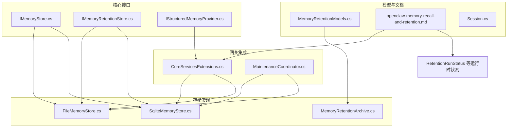
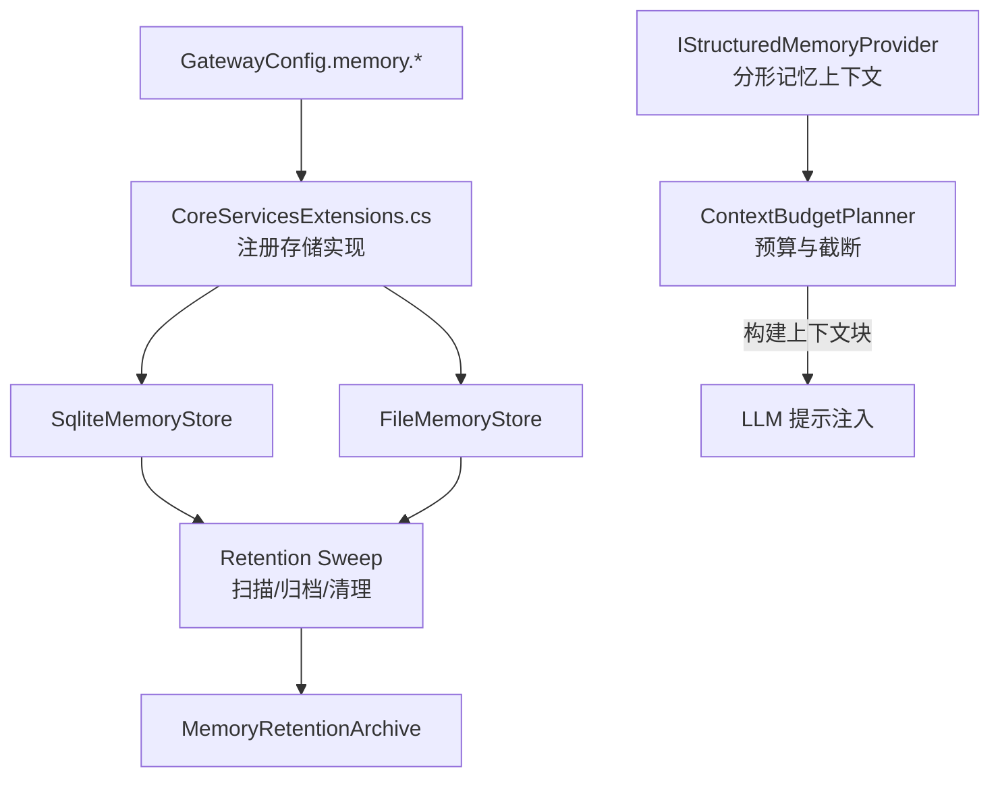
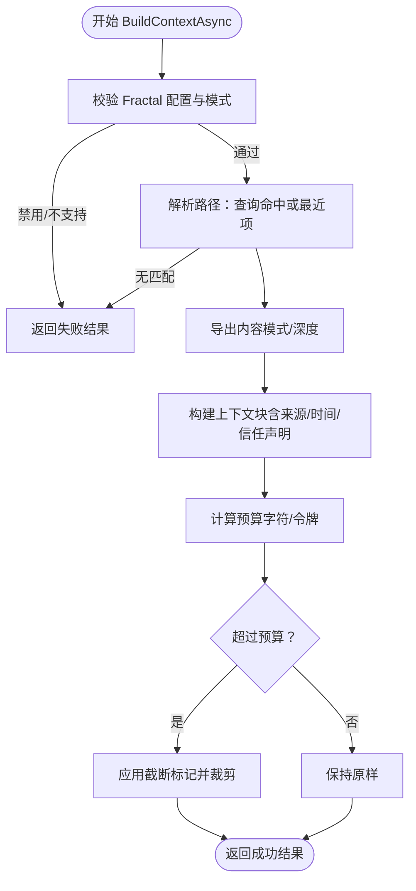
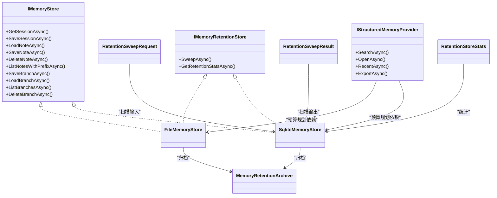
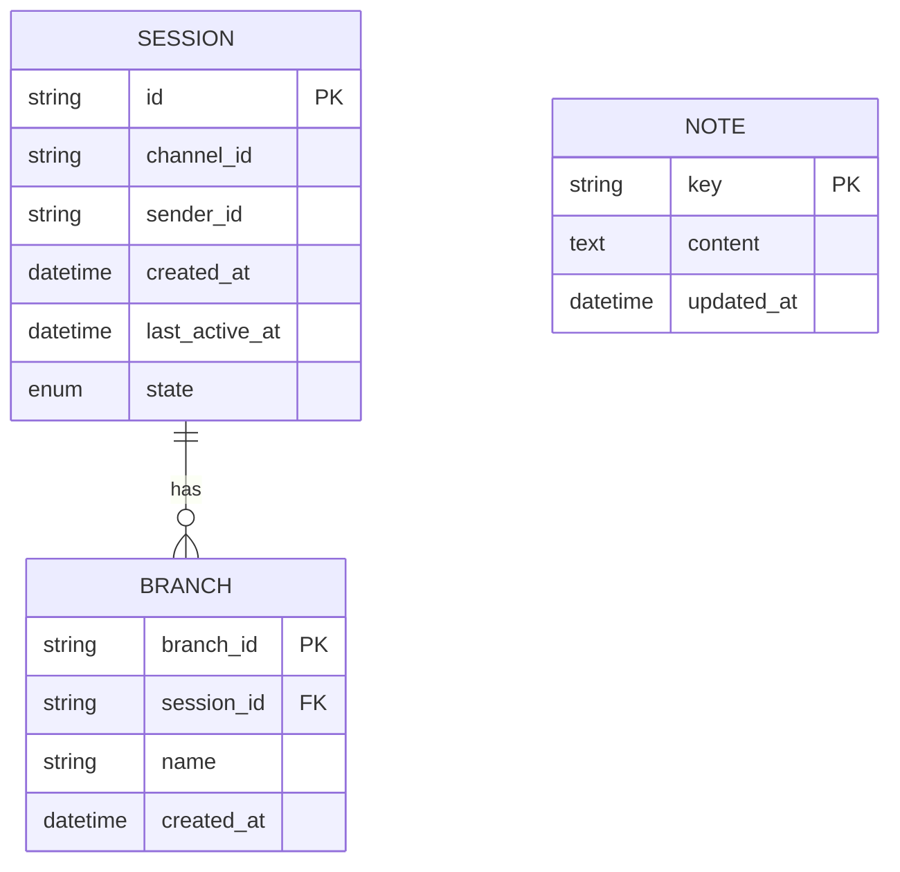

# 记忆处理

<cite>
**本文引用的文件**
- [ContextBudgetPlanner.cs](file://src/OpenClaw.Core/Memory/ContextBudgetPlanner.cs)
- [SqliteMemoryStore.cs](file://src/OpenClaw.Core/Memory/SqliteMemoryStore.cs)
- [FileMemoryStore.cs](file://src/OpenClaw.Core/Memory/FileMemoryStore.cs)
- [MemoryRetentionArchive.cs](file://src/OpenClaw.Core/Memory/MemoryRetentionArchive.cs)
- [IMemoryStore.cs](file://src/OpenClaw.Core/Abstractions/IMemoryStore.cs)
- [IMemoryRetentionStore.cs](file://src/OpenClaw.Core/Abstractions/IMemoryRetentionStore.cs)
- [IStructuredMemoryProvider.cs](file://src/OpenClaw.Core/Abstractions/IStructuredMemoryProvider.cs)
- [MemoryRetentionModels.cs](file://src/OpenClaw.Core/Models/MemoryRetentionModels.cs)
- [Session.cs](file://src/OpenClaw.Core/Models/Session.cs)
- [openclaw-memory-recall-and-retention.md](file://docs/openclaw-memory-recall-and-retention.md)
- [CoreServicesExtensions.cs](file://src/OpenClaw.Gateway/Composition/CoreServicesExtensions.cs)
- [MaintenanceCoordinator.cs](file://src/OpenClaw.Core/Setup/MaintenanceCoordinator.cs)
- [FractalMemoryTests.cs](file://src/OpenClaw.Tests/FractalMemoryTests.cs)
- [FileMemoryStoreTests.cs](file://src/OpenClaw.Tests/FileMemoryStoreTests.cs)
</cite>

## 目录
1. [简介](#简介)
2. [项目结构](#项目结构)
3. [核心组件](#核心组件)
4. [架构总览](#架构总览)
5. [详细组件分析](#详细组件分析)
6. [依赖关系分析](#依赖关系分析)
7. [性能考量](#性能考量)
8. [故障排查指南](#故障排查指南)
9. [结论](#结论)
10. [附录](#附录)

## 简介
本技术文档围绕记忆处理系统展开，系统性阐述记忆存储架构、上下文预算规划、记忆召回机制与记忆压缩策略，覆盖内存存储接口、SQLite 与文件存储实现、检索策略、清理机制与配置选项。文档同时提供数据模型、使用模式、内存管理流程图与性能优化建议，帮助开发者与运维人员高效理解与维护该子系统。

## 项目结构
记忆处理子系统位于 OpenClaw.Core 的 Memory 命名空间内，核心接口定义于 Abstractions，模型定义于 Models，文档化于 docs。Gateway 层负责根据配置选择具体存储实现并注册服务。

图表来源
- [IMemoryStore.cs:1-24](file://src/OpenClaw.Core/Abstractions/IMemoryStore.cs#L1-L24)
- [IMemoryRetentionStore.cs:1-17](file://src/OpenClaw.Core/Abstractions/IMemoryRetentionStore.cs#L1-L17)
- [IStructuredMemoryProvider.cs:1-15](file://src/OpenClaw.Core/Abstractions/IStructuredMemoryProvider.cs#L1-L15)
- [FileMemoryStore.cs:1-1263](file://src/OpenClaw.Core/Memory/FileMemoryStore.cs#L1-L1263)
- [SqliteMemoryStore.cs:1-1401](file://src/OpenClaw.Core/Memory/SqliteMemoryStore.cs#L1-L1401)
- [MemoryRetentionArchive.cs:1-218](file://src/OpenClaw.Core/Memory/MemoryRetentionArchive.cs#L1-L218)
- [MemoryRetentionModels.cs:1-83](file://src/OpenClaw.Core/Models/MemoryRetentionModels.cs#L1-L83)
- [openclaw-memory-recall-and-retention.md:1-242](file://docs/openclaw-memory-recall-and-retention.md#L1-L242)
- [CoreServicesExtensions.cs:263-282](file://src/OpenClaw.Gateway/Composition/CoreServicesExtensions.cs#L263-L282)
- [MaintenanceCoordinator.cs:769-798](file://src/OpenClaw.Core/Setup/MaintenanceCoordinator.cs#L769-L798)

章节来源
- [openclaw-memory-recall-and-retention.md:1-242](file://docs/openclaw-memory-recall-and-retention.md#L1-L242)
- [CoreServicesExtensions.cs:263-282](file://src/OpenClaw.Gateway/Composition/CoreServicesExtensions.cs#L263-L282)
- [MaintenanceCoordinator.cs:769-798](file://src/OpenClaw.Core/Setup/MaintenanceCoordinator.cs#L769-L798)

## 核心组件
- 存储接口与实现
  - IMemoryStore：统一的会话、笔记、分支读写接口，FileMemoryStore 与 SqliteMemoryStore 提供两种实现。
  - IMemoryRetentionStore：可选的保留能力接口，支持过期扫描、归档与统计。
- 结构化记忆提供者
  - IStructuredMemoryProvider：面向“分形记忆”上下文构建，支持搜索、打开、最近项、导出等。
- 数据模型
  - RetentionSweepRequest/Result/Stats/RunStatus：保留扫描请求、结果、统计与运行时状态。
  - Session：会话模型，承载历史、状态与令牌用量等。
- 文档与配置
  - openclaw-memory-recall-and-retention.md：系统设计、召回与保留策略、配置参考与可观测性。

章节来源
- [IMemoryStore.cs:1-24](file://src/OpenClaw.Core/Abstractions/IMemoryStore.cs#L1-L24)
- [IMemoryRetentionStore.cs:1-17](file://src/OpenClaw.Core/Abstractions/IMemoryRetentionStore.cs#L1-L17)
- [IStructuredMemoryProvider.cs:1-15](file://src/OpenClaw.Core/Abstractions/IStructuredMemoryProvider.cs#L1-L15)
- [MemoryRetentionModels.cs:1-83](file://src/OpenClaw.Core/Models/MemoryRetentionModels.cs#L1-L83)
- [Session.cs:1-200](file://src/OpenClaw.Core/Models/Session.cs#L1-L200)
- [openclaw-memory-recall-and-retention.md:1-242](file://docs/openclaw-memory-recall-and-retention.md#L1-L242)

## 架构总览
记忆系统遵循“接口解耦、后端可插拔”的设计原则，通过配置项 memory.provider 选择 File 或 SQLite 后端。召回与保留分别由运行时注入与后台任务完成，确保“不可信数据”的安全边界。

图表来源
- [CoreServicesExtensions.cs:263-282](file://src/OpenClaw.Gateway/Composition/CoreServicesExtensions.cs#L263-L282)
- [ContextBudgetPlanner.cs:1-167](file://src/OpenClaw.Core/Memory/ContextBudgetPlanner.cs#L1-L167)
- [SqliteMemoryStore.cs:654-701](file://src/OpenClaw.Core/Memory/SqliteMemoryStore.cs#L654-L701)
- [FileMemoryStore.cs:570-612](file://src/OpenClaw.Core/Memory/FileMemoryStore.cs#L570-L612)
- [MemoryRetentionArchive.cs:1-218](file://src/OpenClaw.Core/Memory/MemoryRetentionArchive.cs#L1-L218)

## 详细组件分析

### 上下文预算规划（ContextBudgetPlanner）
职责与流程
- 输入：StructuredMemoryContextRequest（查询、模式、最大字符/令牌预算、路径提示等）
- 输出：StructuredMemoryContextResult（上下文块、来源路径、截断标记、来源清单）
- 核心逻辑：
  - 模式校验与自动模式协商
  - 通过 IStructuredMemoryProvider 搜索/最近项定位最佳节点
  - 导出内容并构建上下文块（含来源标签、生成时间、信任声明）
  - 基于字符与令牌预算进行截断，保证注入上限

图表来源
- [ContextBudgetPlanner.cs:1-167](file://src/OpenClaw.Core/Memory/ContextBudgetPlanner.cs#L1-L167)

章节来源
- [ContextBudgetPlanner.cs:1-167](file://src/OpenClaw.Core/Memory/ContextBudgetPlanner.cs#L1-L167)
- [IStructuredMemoryProvider.cs:1-15](file://src/OpenClaw.Core/Abstractions/IStructuredMemoryProvider.cs#L1-L15)
- [openclaw-memory-recall-and-retention.md:67-112](file://docs/openclaw-memory-recall-and-retention.md#L67-L112)

### 记忆存储接口与实现

#### IMemoryStore 统一接口
- 会话：GetSessionAsync/SaveSessionAsync/DeleteSessionAsync
- 笔记：LoadNoteAsync/SaveNoteAsync/DeleteNoteAsync/ListNotesWithPrefixAsync
- 分支：SaveBranchAsync/LoadBranchAsync/ListBranchesAsync/DeleteBranchAsync

章节来源
- [IMemoryStore.cs:1-24](file://src/OpenClaw.Core/Abstractions/IMemoryStore.cs#L1-L24)

#### FileMemoryStore（文件存储）
- 目录结构：sessions/、notes/、branches/
- 安全与可靠性：
  - 文件名 URL 安全 base64 编码，防止路径穿越
  - 会话采用原子写入（.tmp → Move），损坏文件移动到 .corrupt-* 备份
  - 会话加载带缓存与 64 条带并发控制
- 检索策略：
  - 笔记：内存 TF 索引（基于键前缀与更新时间排序），支持评分与截断
  - 分支持久化：JSON 文件，按会话 ID 列表枚举
- 保留与清理：
  - 扫描过期会话/分支，支持归档与删除
  - 统计持久化实体数量

章节来源
- [FileMemoryStore.cs:1-1263](file://src/OpenClaw.Core/Memory/FileMemoryStore.cs#L1-L1263)
- [openclaw-memory-recall-and-retention.md:25-64](file://docs/openclaw-memory-recall-and-retention.md#L25-L64)

#### SqliteMemoryStore（SQLite 存储）
- 初始化与表结构：
  - sessions、notes、branches 表，索引 updated_at
  - 可选启用 FTS5（notes_fts、session_turns_fts），并建立触发器同步
  - 可选向量列 embedding，结合嵌入生成器实现余弦相似度
- 检索策略：
  - FTS5 + BM25 排序；若启用向量且可生成嵌入，则混合评分（BM25*0.4 + CosSim*0.6）
  - 无嵌入则仅 BM25；异常查询语法降级为空结果
- 保留与清理：
  - 扫描 sessions/branches，按 TTL 判定，支持归档与删除
  - 统计持久化实体数量

章节来源
- [SqliteMemoryStore.cs:1-1401](file://src/OpenClaw.Core/Memory/SqliteMemoryStore.cs#L1-L1401)
- [openclaw-memory-recall-and-retention.md:25-64](file://docs/openclaw-memory-recall-and-retention.md#L25-L64)

#### 保留与归档（MemoryRetentionArchive）
- 归档格式：按年/月/日分区，文件名包含哈希 ID 与时间戳
- 清理策略：基于归档扫描日或 sweptAtUtc 判定过期，批量删除并清理空目录

章节来源
- [MemoryRetentionArchive.cs:1-218](file://src/OpenClaw.Core/Memory/MemoryRetentionArchive.cs#L1-L218)
- [MemoryRetentionModels.cs:1-83](file://src/OpenClaw.Core/Models/MemoryRetentionModels.cs#L1-L83)

### 记忆召回机制
- 触发时机：AgentRuntime.TryInjectRecallAsync
- 策略：
  - 项目作用域优先（project:{projectId}: 前缀）
  - 全局回退（无匹配时）
- 安全边界：
  - 作为用户消息注入，位置固定
  - 明确“不可信数据”提示与警告

章节来源
- [openclaw-memory-recall-and-retention.md:67-112](file://docs/openclaw-memory-recall-and-retention.md#L67-L112)
- [FractalMemoryTests.cs:84-114](file://src/OpenClaw.Tests/FractalMemoryTests.cs#L84-L114)

### 记忆压缩与预算
- 字符预算与令牌预算协同：取最小值并做上限保护
- 截断策略：在保留标记处裁剪，避免破坏上下文块结构
- 测试验证：ContextBudgetPlanner 在高预算与自动模式下的行为

章节来源
- [ContextBudgetPlanner.cs:137-148](file://src/OpenClaw.Core/Memory/ContextBudgetPlanner.cs#L137-L148)
- [FractalMemoryTests.cs:84-114](file://src/OpenClaw.Tests/FractalMemoryTests.cs#L84-L114)

### 配置与使用模式
- Provider 选择：memory.provider = sqlite 或 file
- SQLite 特性：enableFts、enableVectors、embeddingModel、embeddingDimensions
- 召回配置：recall.enabled、maxNotes、maxChars
- 保留配置：retention.enabled、runOnStartup、sweepIntervalMinutes、sessionTtlDays、branchTtlDays、archiveEnabled、archivePath、archiveRetentionDays、maxItemsPerSweep
- 项目记忆：project_memory 工具与前缀 project:{projectId}: 统一作用域

章节来源
- [openclaw-memory-recall-and-retention.md:141-237](file://docs/openclaw-memory-recall-and-retention.md#L141-L237)
- [CoreServicesExtensions.cs:263-282](file://src/OpenClaw.Gateway/Composition/CoreServicesExtensions.cs#L263-L282)
- [MaintenanceCoordinator.cs:769-798](file://src/OpenClaw.Core/Setup/MaintenanceCoordinator.cs#L769-L798)

## 依赖关系分析
- 网关层通过 CoreServicesExtensions.cs 根据配置选择并注册存储实现
- SqliteMemoryStore 与 FileMemoryStore 均实现 IMemoryStore、IMemoryNoteSearch、IMemoryNoteCatalog、IMemoryRetentionStore、ISessionAdminStore、ISessionSearchStore
- 保留扫描依赖 MemoryRetentionArchive 进行归档与清理
- 上下文预算规划依赖 IStructuredMemoryProvider 构建分形记忆上下文

图表来源
- [IMemoryStore.cs:1-24](file://src/OpenClaw.Core/Abstractions/IMemoryStore.cs#L1-L24)
- [IMemoryRetentionStore.cs:1-17](file://src/OpenClaw.Core/Abstractions/IMemoryRetentionStore.cs#L1-L17)
- [IStructuredMemoryProvider.cs:1-15](file://src/OpenClaw.Core/Abstractions/IStructuredMemoryProvider.cs#L1-L15)
- [FileMemoryStore.cs:1-1263](file://src/OpenClaw.Core/Memory/FileMemoryStore.cs#L1-L1263)
- [SqliteMemoryStore.cs:1-1401](file://src/OpenClaw.Core/Memory/SqliteMemoryStore.cs#L1-L1401)
- [MemoryRetentionArchive.cs:1-218](file://src/OpenClaw.Core/Memory/MemoryRetentionArchive.cs#L1-L218)
- [MemoryRetentionModels.cs:1-83](file://src/OpenClaw.Core/Models/MemoryRetentionModels.cs#L1-L83)

章节来源
- [CoreServicesExtensions.cs:263-282](file://src/OpenClaw.Gateway/Composition/CoreServicesExtensions.cs#L263-L282)
- [SqliteMemoryStore.cs:654-701](file://src/OpenClaw.Core/Memory/SqliteMemoryStore.cs#L654-L701)
- [FileMemoryStore.cs:570-612](file://src/OpenClaw.Core/Memory/FileMemoryStore.cs#L570-L612)

## 性能考量
- 文件存储
  - 会话并发：64 条带信号量降低热点竞争
  - 原子写入减少部分写风险
  - 内存 TF 索引提升搜索效率
- SQLite 存储
  - WAL 模式 + synchronous=NORMAL 平衡一致性与吞吐
  - FTS5 触发器同步，启动回填现有数据
  - 向量嵌入混合评分，兼顾语义与关键词
- 保留扫描
  - 分阶段扫描（会话 → 分支），限制单次处理项数
  - 归档清理按日期分区，便于增量维护

章节来源
- [openclaw-memory-recall-and-retention.md:25-64](file://docs/openclaw-memory-recall-and-retention.md#L25-L64)
- [SqliteMemoryStore.cs:54-148](file://src/OpenClaw.Core/Memory/SqliteMemoryStore.cs#L54-L148)
- [FileMemoryStore.cs:78-189](file://src/OpenClaw.Core/Memory/FileMemoryStore.cs#L78-L189)

## 故障排查指南
- 会话加载失败
  - File：损坏文件被隔离为 .corrupt-*，抛出 MemoryStoreCorruptionException
  - SQLite：加载异常包装为 MemoryStoreCorruptionException 并携带定位信息
- 搜索异常
  - SQLite：FTS5 查询语法错误降级为空结果；向量生成失败回退 FTS
- 保留扫描错误
  - 记录错误列表，限制数量；归档清理失败继续推进其他文件
- 验证与测试
  - 单元测试覆盖文件存储 CRUD、前缀列举、召回预算截断与分形上下文构建

章节来源
- [FileMemoryStore.cs:191-223](file://src/OpenClaw.Core/Memory/FileMemoryStore.cs#L191-L223)
- [SqliteMemoryStore.cs:170-178](file://src/OpenClaw.Core/Memory/SqliteMemoryStore.cs#L170-L178)
- [SqliteMemoryStore.cs:454-458](file://src/OpenClaw.Core/Memory/SqliteMemoryStore.cs#L454-L458)
- [FileMemoryStoreTests.cs:1-41](file://src/OpenClaw.Tests/FileMemoryStoreTests.cs#L1-L41)
- [FractalMemoryTests.cs:84-114](file://src/OpenClaw.Tests/FractalMemoryTests.cs#L84-L114)

## 结论
记忆处理系统通过清晰的接口与可插拔后端，实现了安全、可控且高性能的记忆存储与召回。SQLite 后端提供更强的检索与向量化能力，文件后端强调本地首选与简单可靠。保留与归档机制保障长期运行的稳定性与合规性。结合预算规划与安全注入策略，系统在功能与安全性之间取得良好平衡。

## 附录

### 数据模型概览

图表来源
- [Session.cs:15-200](file://src/OpenClaw.Core/Models/Session.cs#L15-L200)
- [SqliteMemoryStore.cs:66-84](file://src/OpenClaw.Core/Memory/SqliteMemoryStore.cs#L66-L84)
- [FileMemoryStore.cs:61-67](file://src/OpenClaw.Core/Memory/FileMemoryStore.cs#L61-L67)

### 配置参考（节选）
- provider、storagePath、maxHistoryTurns、enableCompaction、compactionThreshold、compactionKeepRecent、projectId
- sqlite.dbPath、enableFts、enableVectors、embeddingModel、embeddingDimensions
- recall.enabled、maxNotes、maxChars
- retention.enabled、runOnStartup、sweepIntervalMinutes、sessionTtlDays、branchTtlDays、archiveEnabled、archivePath、archiveRetentionDays、maxItemsPerSweep

章节来源
- [openclaw-memory-recall-and-retention.md:199-237](file://docs/openclaw-memory-recall-and-retention.md#L199-L237)