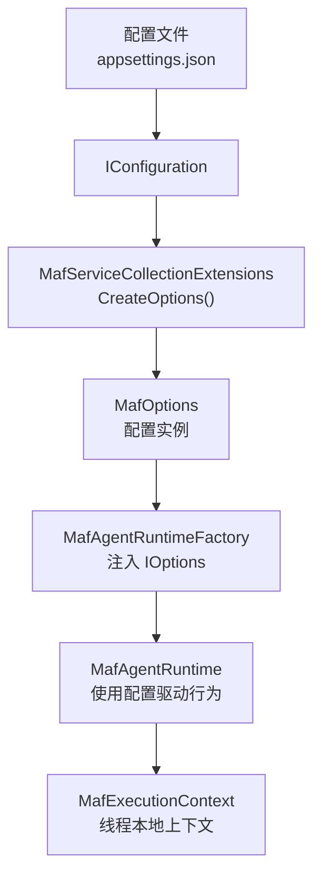
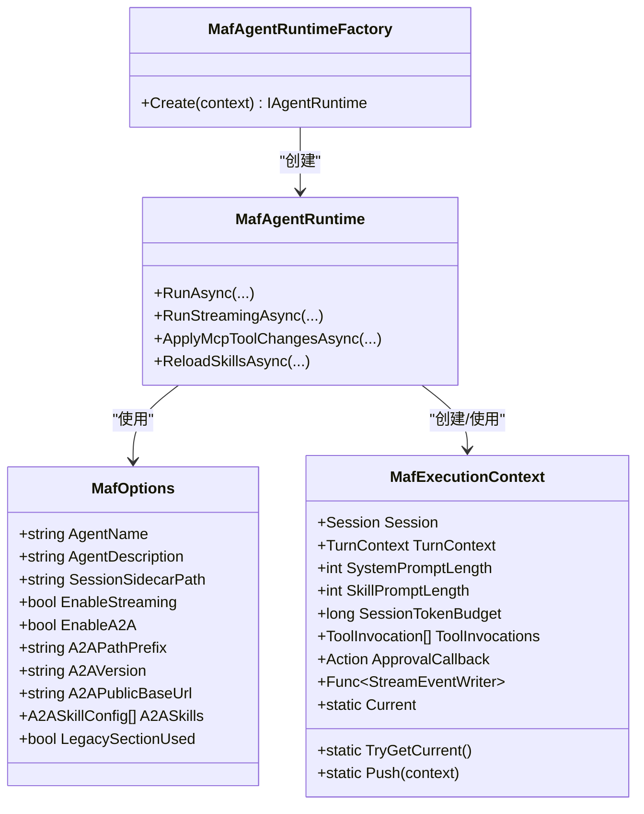

# 配置选项管理

<cite>
**本文档引用的文件**
- [MafOptions.cs](file://src/OpenClaw.Agent/MafOptions.cs)
- [MafExecutionContext.cs](file://src/OpenClaw.Agent/MafExecutionContext.cs)
- [MafServiceCollectionExtensions.cs](file://src/OpenClaw.Agent/MafServiceCollectionExtensions.cs)
- [MafAgentRuntime.cs](file://src/OpenClaw.Agent/MafAgentRuntime.cs)
- [MafAgentRuntimeFactory.cs](file://src/OpenClaw.Agent/MafAgentRuntimeFactory.cs)
- [appsettings.json](file://src/OpenClaw.Gateway/appsettings.json)
- [ConfigValidator.cs](file://src/OpenClaw.Core/Validation/ConfigValidator.cs)
- [RuntimeModels.cs](file://src/OpenClaw.Core/Models/RuntimeModels.cs)
</cite>

## 目录
1. [简介](#简介)
2. [项目结构](#项目结构)
3. [核心组件](#核心组件)
4. [架构概览](#架构概览)
5. [详细组件分析](#详细组件分析)
6. [依赖关系分析](#依赖关系分析)
7. [性能考虑](#性能考虑)
8. [故障排除指南](#故障排除指南)
9. [结论](#结论)
10. [附录](#附录)

## 简介
本文件面向 MAF（Microsoft Agent Framework）配置选项管理系统，系统性阐述 MafOptions 类的配置项、运行时参数设置与环境变量处理机制；解释执行上下文（MafExecutionContext）的作用、会话状态传递与工具调用的上下文管理；描述配置验证、默认值设置与配置热更新的实现方式；给出配置选项优先级规则、配置文件格式与最佳实践，并提供故障排除指南与性能调优建议。

## 项目结构
MAF 配置系统由以下关键模块组成：
- 配置模型：MafOptions 定义所有可配置项
- 配置加载：MafServiceCollectionExtensions 负责从 IConfiguration 解析并注册到 DI 容器
- 运行时集成：MafAgentRuntime 使用配置驱动行为
- 执行上下文：MafExecutionContext 提供线程安全的运行期上下文传递
- 配置验证：ConfigValidator 对整体配置进行校验
- 运行模式：RuntimeModels 定义运行模式与编排器选择



**图表来源**
- [appsettings.json:10-21](file://src/OpenClaw.Gateway/appsettings.json#L10-L21)
- [MafServiceCollectionExtensions.cs:22-105](file://src/OpenClaw.Agent/MafServiceCollectionExtensions.cs#L22-L105)
- [MafAgentRuntimeFactory.cs:17-40](file://src/OpenClaw.Agent/MafAgentRuntimeFactory.cs#L17-L40)
- [MafAgentRuntime.cs:57-118](file://src/OpenClaw.Agent/MafAgentRuntime.cs#L57-L118)

**章节来源**
- [appsettings.json:10-21](file://src/OpenClaw.Gateway/appsettings.json#L10-L21)
- [MafServiceCollectionExtensions.cs:9-20](file://src/OpenClaw.Agent/MafServiceCollectionExtensions.cs#L9-L20)

## 核心组件
- MafOptions：定义 MAF 的配置项集合，包括代理名称、描述、会话侧车路径、流式输出开关、A2A（Agent-to-Agent）相关参数以及 A2A 技能清单。
- MafExecutionContext：封装一次对话回合的运行上下文，包括 Session、TurnContext、提示长度预算、工具调用列表、审批回调、流事件写入器等，通过 AsyncLocal 实现线程隔离。
- MafServiceCollectionExtensions：负责从 IConfiguration 中读取配置节，支持新旧配置节兼容，解析布尔值与嵌套集合，生成 MafOptions 并注册到 DI。
- MafAgentRuntime：在运行时应用配置，如启用/禁用流式输出、会话令牌预算控制、历史压缩策略、内存召回注入等。
- MafAgentRuntimeFactory：将 MafOptions 注入到运行时工厂中，用于创建 MafAgentRuntime 实例。
- 配置验证：ConfigValidator 对运行模式与编排器进行校验，确保配置合法。
- 运行模式：RuntimeModels 定义运行模式与编排器规范化逻辑。

**章节来源**
- [MafOptions.cs:3-35](file://src/OpenClaw.Agent/MafOptions.cs#L3-L35)
- [MafExecutionContext.cs:6-17](file://src/OpenClaw.Agent/MafExecutionContext.cs#L6-L17)
- [MafServiceCollectionExtensions.cs:22-105](file://src/OpenClaw.Agent/MafServiceCollectionExtensions.cs#L22-L105)
- [MafAgentRuntime.cs:57-118](file://src/OpenClaw.Agent/MafAgentRuntime.cs#L57-L118)
- [MafAgentRuntimeFactory.cs:17-40](file://src/OpenClaw.Agent/MafAgentRuntimeFactory.cs#L17-L40)
- [ConfigValidator.cs:236-241](file://src/OpenClaw.Core/Validation/ConfigValidator.cs#L236-L241)
- [RuntimeModels.cs:42-68](file://src/OpenClaw.Core/Models/RuntimeModels.cs#L42-L68)

## 架构概览
下图展示配置从文件到运行时的完整流转路径：

```mermaid
sequenceDiagram
participant CFG as "配置文件<br/>appsettings.json"
participant IC as "IConfiguration"
participant EXT as "MafServiceCollectionExtensions"
participant OPT as "MafOptions"
participant FAC as "MafAgentRuntimeFactory"
participant RUN as "MafAgentRuntime"
CFG->>IC : 加载 JSON 配置
IC->>EXT : GetSection(OpenClaw : MicrosoftAgentFramework)
EXT->>OPT : CreateOptions() 解析配置
OPT->>FAC : 注入 IOptions<MafOptions>
FAC->>RUN : 创建运行时实例
RUN->>RUN : 应用配置流式、预算、历史压缩等
```

**图表来源**
- [appsettings.json:10-21](file://src/OpenClaw.Gateway/appsettings.json#L10-L21)
- [MafServiceCollectionExtensions.cs:22-105](file://src/OpenClaw.Agent/MafServiceCollectionExtensions.cs#L22-L105)
- [MafAgentRuntimeFactory.cs:17-40](file://src/OpenClaw.Agent/MafAgentRuntimeFactory.cs#L17-L40)
- [MafAgentRuntime.cs:57-118](file://src/OpenClaw.Agent/MafAgentRuntime.cs#L57-L118)

## 详细组件分析

### MafOptions 配置项详解
- 基础信息
  - AgentName：代理名称，默认 "OpenClaw"
  - AgentDescription：代理描述，默认为 MAF 后端说明
  - SessionSidecarPath：会话侧车存储路径，默认 "sessions"
- 流式输出
  - EnableStreaming：是否启用流式输出，默认 true
  - EnableStreamingFallback：兼容旧字段，内部映射到 EnableStreaming
- A2A（Agent-to-Agent）
  - EnableA2A：是否启用 A2A，默认 true
  - A2APathPrefix：A2A 接口前缀，默认 "/a2a"
  - A2AVersion：A2A 版本号，默认 "1.0.0"
  - A2APublicBaseUrl：A2A 公共基础 URL（可空）
  - A2ASkills：A2A 技能清单，包含 Id、Name、Description、Tags
- 兼容标记
  - LegacySectionUsed：指示是否使用了旧配置节

这些配置项通过 MafServiceCollectionExtensions 从 IConfiguration 中读取，支持字符串、布尔值与嵌套集合的解析。

**章节来源**
- [MafOptions.cs:9-35](file://src/OpenClaw.Agent/MafOptions.cs#L9-L35)
- [MafServiceCollectionExtensions.cs:35-102](file://src/OpenClaw.Agent/MafServiceCollectionExtensions.cs#L35-L102)

### 执行上下文（MafExecutionContext）与会话状态传递
- 上下文内容
  - Session：当前会话对象
  - TurnContext：回合上下文（含会话 ID、渠道 ID、关联 ID）
  - SystemPromptLength / SkillPromptLength：系统提示与技能提示长度
  - SessionTokenBudget：会话级令牌预算
  - ToolInvocations：工具调用记录列表
  - RecordContractTurnUsage / ApprovalCallback / StreamEventWriter：回调与事件写入器
- 线程隔离
  - 通过 AsyncLocal 存储当前上下文，提供 Current 与 TryGetCurrent 访问方式
  - Push 方法创建作用域，在作用域结束时自动恢复先前上下文

该机制确保工具执行、流式事件与审批流程可以在无显式参数传递的情况下访问运行期上下文。

**章节来源**
- [MafExecutionContext.cs:6-17](file://src/OpenClaw.Agent/MafExecutionContext.cs#L6-L17)
- [MafExecutionContext.cs:19-45](file://src/OpenClaw.Agent/MafExecutionContext.cs#L19-L45)

### 配置加载与环境变量处理
- 配置节优先级
  - 新配置节：OpenClaw:MicrosoftAgentFramework
  - 旧配置节：OpenClaw:Experimental:MicrosoftAgentFramework（仅当新节不存在时回退）
- 字段解析
  - 字符串字段：AgentName、AgentDescription、SessionSidecarPath、A2APathPrefix、A2AVersion、A2APublicBaseUrl
  - 布尔字段：EnableStreaming、EnableStreamingFallback、EnableA2A（后者映射到前者）
  - 嵌套集合：A2ASkills 包含 Id、Name、Description、Tags
- 环境变量
  - 代码中存在对环境变量的读取示例（例如项目 ID），但 MafOptions 本身未直接声明环境变量映射键

注意：当前 MafOptions 的配置键来自配置节，未见直接的环境变量键绑定。

**章节来源**
- [MafServiceCollectionExtensions.cs:22-105](file://src/OpenClaw.Agent/MafServiceCollectionExtensions.cs#L22-L105)
- [MafOptions.cs:5-6](file://src/OpenClaw.Agent/MafOptions.cs#L5-L6)

### 运行时参数设置与行为控制
- 流式输出控制
  - RunStreamingAsync 在禁用流式时抛出异常
  - 流式生产者在上下文中注入 StreamEventWriter
- 会话令牌预算
  - 当达到会话级令牌预算时拒绝继续
- 历史压缩与修剪
  - 根据配置阈值决定压缩或简单修剪
- 内存召回注入
  - 可选地将相关记忆条目注入到消息列表中
- 系统提示构建
  - 动态拼接技能提示与路由指令

**章节来源**
- [MafAgentRuntime.cs:339-423](file://src/OpenClaw.Agent/MafAgentRuntime.cs#L339-L423)
- [MafAgentRuntime.cs:203-337](file://src/OpenClaw.Agent/MafAgentRuntime.cs#L203-L337)
- [MafAgentRuntime.cs:684-764](file://src/OpenClaw.Agent/MafAgentRuntime.cs#L684-L764)
- [MafAgentRuntime.cs:589-620](file://src/OpenClaw.Agent/MafAgentRuntime.cs#L589-L620)

### 配置验证与默认值设置
- 配置验证
  - 运行模式必须为 "auto" | "aot" | "jit"
  - 编排器必须为 "native" | "maf"
  - MCP 服务器配置需满足传输类型与超时要求
- 默认值设置
  - MafOptions 中为各字段提供合理默认值
  - MafServiceCollectionExtensions 仅在配置存在时覆盖默认值

**章节来源**
- [ConfigValidator.cs:236-265](file://src/OpenClaw.Core/Validation/ConfigValidator.cs#L236-L265)
- [MafOptions.cs:9-35](file://src/OpenClaw.Agent/MafOptions.cs#L9-L35)

### 配置热更新与生命周期
- 当前实现
  - MafOptions 通过 IOptions<MafOptions> 注册，属于静态配置
  - 运行时在构造函数中读取并缓存配置，未见动态刷新逻辑
- 建议
  - 如需热更新，可引入 IOptionsMonitor 或自定义监听机制
  - 对于流式开关、A2A 开关等高频变更项，可在运行时层增加条件判断以降低重启成本

**章节来源**
- [MafServiceCollectionExtensions.cs:13-14](file://src/OpenClaw.Agent/MafServiceCollectionExtensions.cs#L13-L14)
- [MafAgentRuntimeFactory.cs:17-40](file://src/OpenClaw.Agent/MafAgentRuntimeFactory.cs#L17-L40)

## 依赖关系分析
- 组件耦合
  - MafAgentRuntimeFactory 依赖 MafAgentRuntime 与 MafOptions
  - MafAgentRuntime 依赖 MafOptions、会话存储、工具执行器、遥测适配器等
  - MafExecutionContext 作为运行时横切关注点被多处使用
- 外部依赖
  - IConfiguration 提供配置数据源
  - DI 容器提供服务解析与生命周期管理



**图表来源**
- [MafOptions.cs:3-35](file://src/OpenClaw.Agent/MafOptions.cs#L3-L35)
- [MafExecutionContext.cs:6-17](file://src/OpenClaw.Agent/MafExecutionContext.cs#L6-L17)
- [MafAgentRuntimeFactory.cs:17-40](file://src/OpenClaw.Agent/MafAgentRuntimeFactory.cs#L17-L40)
- [MafAgentRuntime.cs:57-118](file://src/OpenClaw.Agent/MafAgentRuntime.cs#L57-L118)

**章节来源**
- [MafAgentRuntimeFactory.cs:17-40](file://src/OpenClaw.Agent/MafAgentRuntimeFactory.cs#L17-L40)
- [MafAgentRuntime.cs:57-118](file://src/OpenClaw.Agent/MafAgentRuntime.cs#L57-L118)

## 性能考虑
- 历史压缩
  - 启用压缩可显著降低上下文长度，提升响应速度与降低成本
  - 阈值与保留数量需根据业务对话复杂度调整
- 流式输出
  - 流式可改善用户体验，但会增加网络与序列化开销
  - 建议在高延迟链路谨慎开启
- 内存召回
  - 回召命中数与字符上限影响上下文大小
  - 建议限制最大条目与最大字符数，避免过度膨胀
- 工具调用
  - 工具调用列表在上下文中累积，建议在回合结束后及时清理

**章节来源**
- [MafAgentRuntime.cs:684-764](file://src/OpenClaw.Agent/MafAgentRuntime.cs#L684-L764)
- [MafAgentRuntime.cs:339-423](file://src/OpenClaw.Agent/MafAgentRuntime.cs#L339-L423)
- [MafAgentRuntime.cs:625-682](file://src/OpenClaw.Agent/MafAgentRuntime.cs#L625-L682)

## 故障排除指南
- 流式输出被禁用
  - 现象：调用流式接口抛出异常
  - 排查：检查 EnableStreaming 是否为 true
  - 位置：运行时流式方法入口
- 会话令牌预算耗尽
  - 现象：返回达到令牌限制提示
  - 排查：检查会话级预算配置与历史长度
  - 位置：回合开始与结束处的预算检查
- A2A 配置无效
  - 现象：A2A 接口不可用或技能未生效
  - 排查：确认 A2A 开关、路径前缀、版本号与技能清单
  - 位置：配置解析与运行时使用处
- 兼容配置节误用
  - 现象：配置未生效
  - 排查：确认是否使用了已废弃的旧配置节
  - 位置：配置解析逻辑中的回退判断
- 运行模式不匹配
  - 现象：MAF 编排器无法启动
  - 排查：确认运行模式与编排器配置
  - 位置：配置验证与能力检查

**章节来源**
- [MafAgentRuntime.cs:339-423](file://src/OpenClaw.Agent/MafAgentRuntime.cs#L339-L423)
- [MafAgentRuntime.cs:226-237](file://src/OpenClaw.Agent/MafAgentRuntime.cs#L226-L237)
- [MafServiceCollectionExtensions.cs:24-28](file://src/OpenClaw.Agent/MafServiceCollectionExtensions.cs#L24-L28)
- [ConfigValidator.cs:236-241](file://src/OpenClaw.Core/Validation/ConfigValidator.cs#L236-L241)

## 结论
MAF 配置选项管理系统通过清晰的配置模型、可靠的加载机制与严格的验证流程，为运行时提供了灵活而稳定的参数控制。执行上下文的设计确保了工具调用与流式事件的上下文一致性。建议在生产环境中结合性能指标与业务特征，合理设置历史压缩、流式开关与内存召回策略，并通过配置验证与日志监控保障系统稳定性。

## 附录

### 配置选项优先级规则
- 配置节优先级：新配置节 > 旧配置节（仅当新节不存在时）
- 字段覆盖规则：仅当配置节中存在对应键时才覆盖默认值
- 布尔兼容：EnableStreamingFallback 映射到 EnableStreaming

**章节来源**
- [MafServiceCollectionExtensions.cs:24-28](file://src/OpenClaw.Agent/MafServiceCollectionExtensions.cs#L24-L28)
- [MafServiceCollectionExtensions.cs:47-50](file://src/OpenClaw.Agent/MafServiceCollectionExtensions.cs#L47-L50)

### 配置文件格式与示例
- 配置根节点：OpenClaw
- MAF 配置节：OpenClaw:MicrosoftAgentFramework
- 示例字段：AgentName、AgentDescription、SessionSidecarPath、EnableStreaming、EnableA2A、A2APathPrefix、A2AVersion、A2APublicBaseUrl、A2ASkills

**章节来源**
- [appsettings.json:10-21](file://src/OpenClaw.Gateway/appsettings.json#L10-L21)

### 最佳实践
- 将高频变更的开关（如 EnableStreaming、EnableA2A）置于独立配置节，便于快速回滚
- 为 A2ASkills 提供最小必要技能清单，避免过度暴露
- 启用历史压缩并设置合理的阈值与保留数量
- 为流式输出设置合适的缓冲区大小与超时时间
- 使用配置验证工具在部署前检查运行模式与编排器合法性

**章节来源**
- [ConfigValidator.cs:236-265](file://src/OpenClaw.Core/Validation/ConfigValidator.cs#L236-L265)
- [MafAgentRuntime.cs:684-764](file://src/OpenClaw.Agent/MafAgentRuntime.cs#L684-L764)