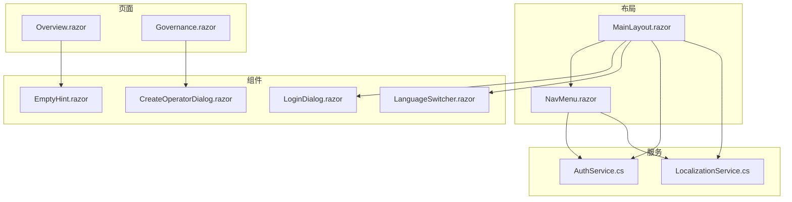
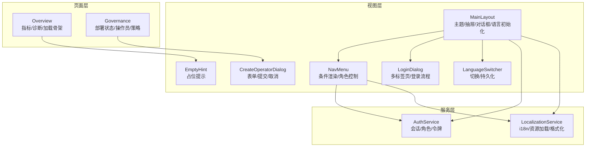
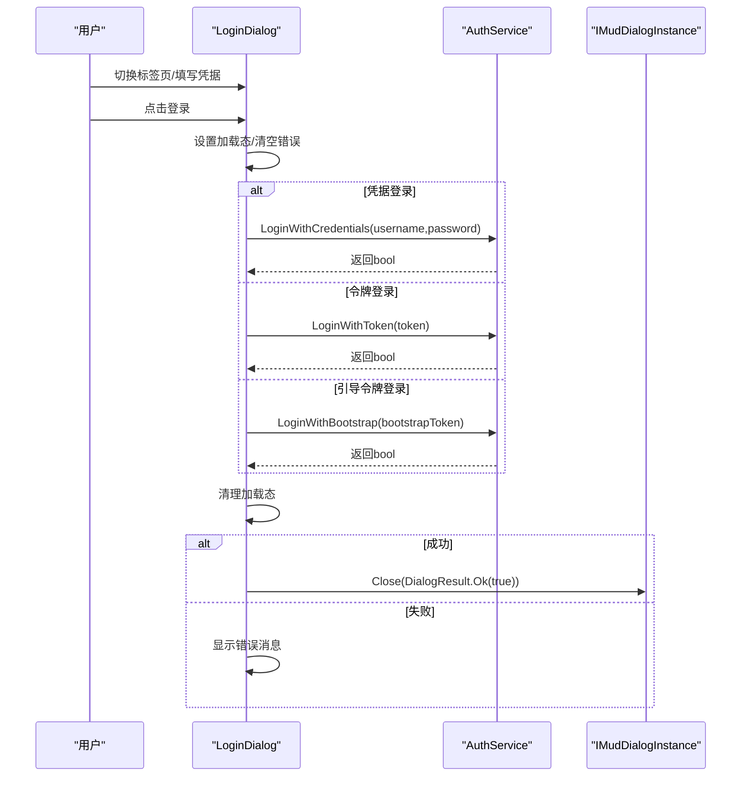
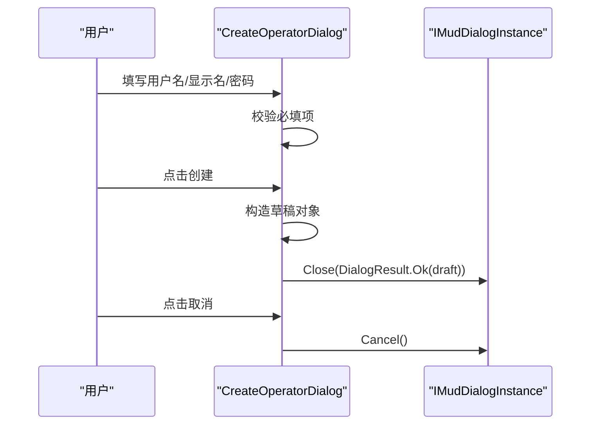
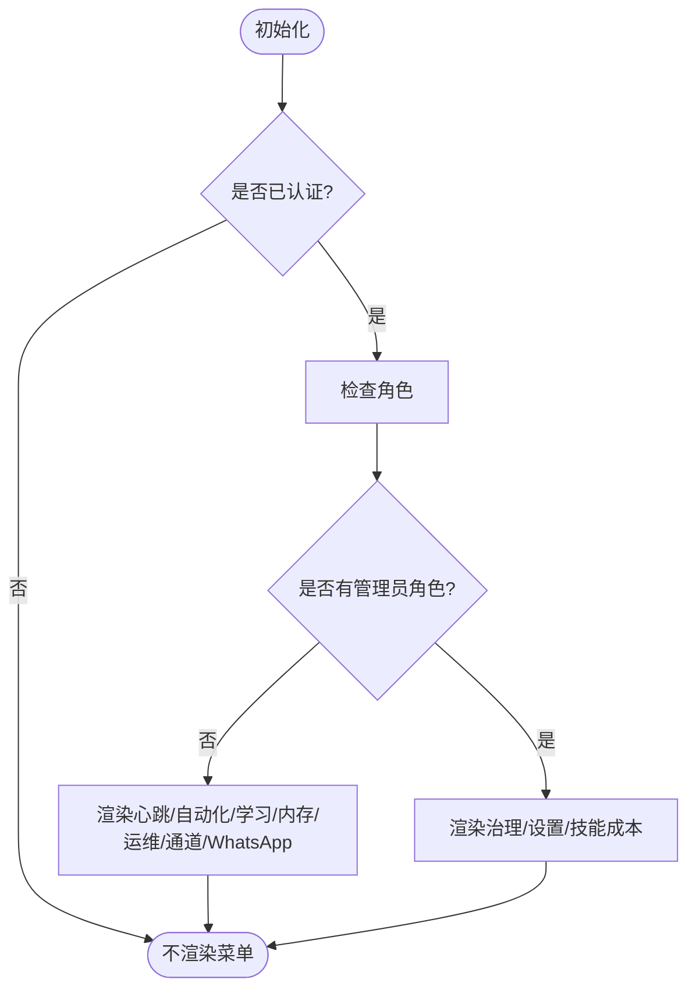
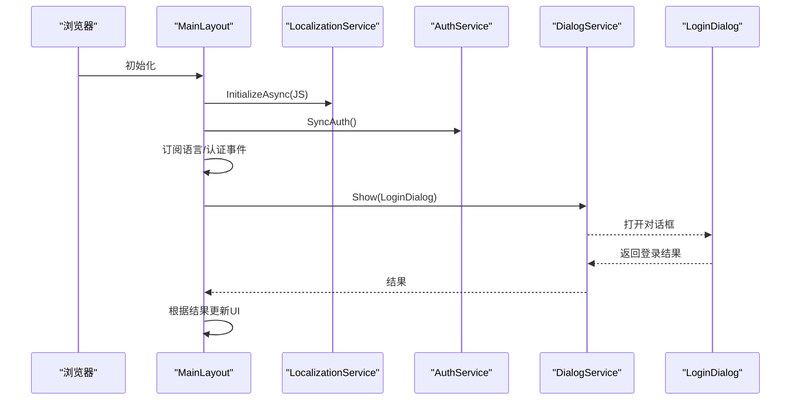
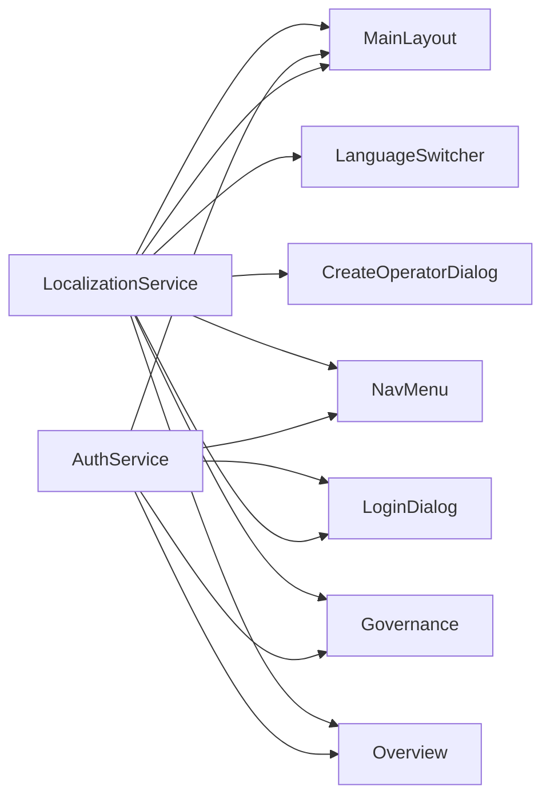

# Blazor 组件系统

<cite>
**本文引用的文件**
- [MainLayout.razor](file://src/OpenClaw.Dashboard/Layout/MainLayout.razor)
- [NavMenu.razor](file://src/OpenClaw.Dashboard/Layout/NavMenu.razor)
- [LoginDialog.razor](file://src/OpenClaw.Dashboard/Components/LoginDialog.razor)
- [CreateOperatorDialog.razor](file://src/OpenClaw.Dashboard/Components/CreateOperatorDialog.razor)
- [LanguageSwitcher.razor](file://src/OpenClaw.Dashboard/Components/LanguageSwitcher.razor)
- [EmptyHint.razor](file://src/OpenClaw.Dashboard/Components/EmptyHint.razor)
- [AuthService.cs](file://src/OpenClaw.Dashboard/Services/AuthService.cs)
- [LocalizationService.cs](file://src/OpenClaw.Dashboard/Services/LocalizationService.cs)
- [Overview.razor](file://src/OpenClaw.Dashboard/Pages/Overview.razor)
- [Governance.razor](file://src/OpenClaw.Dashboard/Pages/Governance.razor)
</cite>

## 目录
1. [简介](#简介)
2. [项目结构](#项目结构)
3. [核心组件](#核心组件)
4. [架构总览](#架构总览)
5. [组件详细分析](#组件详细分析)
6. [依赖关系分析](#依赖关系分析)
7. [性能考虑](#性能考虑)
8. [故障排查指南](#故障排查指南)
9. [结论](#结论)
10. [附录](#附录)

## 简介
本文件面向 Blazor 组件系统的开发者与维护者，系统性梳理并解析项目中的关键组件：登录对话框、操作员创建对话框、导航菜单、语言切换器、空状态提示等。文档重点覆盖以下方面：
- 属性传递（参数）、事件回调、数据绑定、条件渲染等 Blazor 基础特性
- 组件复用策略、样式封装、响应式设计
- 组件间通信模式、状态共享、生命周期钩子
- 最佳实践、性能优化技巧与调试方法

## 项目结构
OpenClaw 仪表盘采用基于页面与布局的组织方式，组件主要位于 Components 与 Layout 目录，页面位于 Pages 目录；服务层位于 Services 目录，负责认证、国际化等横切关注点。

图表来源
- [MainLayout.razor:1-140](file://src/OpenClaw.Dashboard/Layout/MainLayout.razor#L1-L140)
- [NavMenu.razor:1-98](file://src/OpenClaw.Dashboard/Layout/NavMenu.razor#L1-L98)
- [LoginDialog.razor:1-113](file://src/OpenClaw.Dashboard/Components/LoginDialog.razor#L1-L113)
- [CreateOperatorDialog.razor:1-63](file://src/OpenClaw.Dashboard/Components/CreateOperatorDialog.razor#L1-L63)
- [LanguageSwitcher.razor:1-50](file://src/OpenClaw.Dashboard/Components/LanguageSwitcher.razor#L1-L50)
- [EmptyHint.razor:1-45](file://src/OpenClaw.Dashboard/Components/EmptyHint.razor#L1-L45)
- [AuthService.cs:1-154](file://src/OpenClaw.Dashboard/Services/AuthService.cs#L1-L154)
- [LocalizationService.cs:1-231](file://src/OpenClaw.Dashboard/Services/LocalizationService.cs#L1-L231)

章节来源
- [MainLayout.razor:1-140](file://src/OpenClaw.Dashboard/Layout/MainLayout.razor#L1-L140)
- [NavMenu.razor:1-98](file://src/OpenClaw.Dashboard/Layout/NavMenu.razor#L1-L98)

## 核心组件
- 登录对话框：支持凭据、令牌、引导令牌三种登录方式，内置加载态与错误提示，通过对话框实例返回结果。
- 操作员创建对话框：表单收集用户名、显示名、密码，校验必填项后关闭对话框并返回草稿对象。
- 导航菜单：根据认证状态与角色动态渲染菜单项，支持语言切换与登出。
- 语言切换器：提供中英文切换，持久化到设置并通知订阅者刷新界面。
- 空状态提示：通用占位组件，支持图标、标题与副标题，用于数据页无内容时的视觉提示。
- 页面组件：如概览页、治理页，展示复杂数据结构、诊断信息、表格与对话框交互。

章节来源
- [LoginDialog.razor:1-113](file://src/OpenClaw.Dashboard/Components/LoginDialog.razor#L1-L113)
- [CreateOperatorDialog.razor:1-63](file://src/OpenClaw.Dashboard/Components/CreateOperatorDialog.razor#L1-L63)
- [NavMenu.razor:1-98](file://src/OpenClaw.Dashboard/Layout/NavMenu.razor#L1-L98)
- [LanguageSwitcher.razor:1-50](file://src/OpenClaw.Dashboard/Components/LanguageSwitcher.razor#L1-L50)
- [EmptyHint.razor:1-45](file://src/OpenClaw.Dashboard/Components/EmptyHint.razor#L1-L45)
- [Overview.razor:1-475](file://src/OpenClaw.Dashboard/Pages/Overview.razor#L1-L475)
- [Governance.razor:1-569](file://src/OpenClaw.Dashboard/Pages/Governance.razor#L1-L569)

## 架构总览
系统采用“布局-组件-页面-服务”的分层架构，布局层负责主题、抽屉、全局对话框与语言初始化；组件层提供可复用 UI 元素；页面层承载业务场景；服务层提供认证与国际化能力。

图表来源
- [MainLayout.razor:1-140](file://src/OpenClaw.Dashboard/Layout/MainLayout.razor#L1-L140)
- [NavMenu.razor:1-98](file://src/OpenClaw.Dashboard/Layout/NavMenu.razor#L1-L98)
- [LoginDialog.razor:1-113](file://src/OpenClaw.Dashboard/Components/LoginDialog.razor#L1-L113)
- [CreateOperatorDialog.razor:1-63](file://src/OpenClaw.Dashboard/Components/CreateOperatorDialog.razor#L1-L63)
- [LanguageSwitcher.razor:1-50](file://src/OpenClaw.Dashboard/Components/LanguageSwitcher.razor#L1-L50)
- [EmptyHint.razor:1-45](file://src/OpenClaw.Dashboard/Components/EmptyHint.razor#L1-L45)
- [Overview.razor:1-475](file://src/OpenClaw.Dashboard/Pages/Overview.razor#L1-L475)
- [Governance.razor:1-569](file://src/OpenClaw.Dashboard/Pages/Governance.razor#L1-L569)
- [AuthService.cs:1-154](file://src/OpenClaw.Dashboard/Services/AuthService.cs#L1-L154)
- [LocalizationService.cs:1-231](file://src/OpenClaw.Dashboard/Services/LocalizationService.cs#L1-L231)

## 组件详细分析

### 登录对话框（LoginDialog）
- 功能要点
  - 多标签页登录：凭据、令牌、引导令牌三类输入
  - 数据绑定：用户名、密码、令牌、引导令牌双向绑定
  - 条件渲染：错误消息在失败时显示
  - 加载态：登录过程中禁用按钮并显示进度环
  - 结果返回：成功时通过对话框实例返回布尔值
- 生命周期与事件
  - 初始化订阅语言变更事件，变更时触发重绘
  - 登录流程异步执行，根据当前激活标签页选择对应登录方式
- 错误处理
  - 失败时设置错误消息，保持界面反馈
  - 取消按钮直接关闭对话框

图表来源
- [LoginDialog.razor:79-102](file://src/OpenClaw.Dashboard/Components/LoginDialog.razor#L79-L102)
- [AuthService.cs:34-83](file://src/OpenClaw.Dashboard/Services/AuthService.cs#L34-L83)

章节来源
- [LoginDialog.razor:1-113](file://src/OpenClaw.Dashboard/Components/LoginDialog.razor#L1-L113)
- [AuthService.cs:1-154](file://src/OpenClaw.Dashboard/Services/AuthService.cs#L1-L154)

### 操作员创建对话框（CreateOperatorDialog）
- 功能要点
  - 表单字段：用户名、显示名、密码（必填）
  - 提交校验：任一必填为空则禁用提交按钮
  - 结果返回：提交时构造草稿对象并通过对话框实例返回
  - 取消：调用对话框实例取消
- 参数与回调
  - 使用 CascadingParameter 接收对话框实例
  - 通过 Ok/Cancel 完成对话框生命周期管理

图表来源
- [CreateOperatorDialog.razor:50-56](file://src/OpenClaw.Dashboard/Components/CreateOperatorDialog.razor#L50-L56)

章节来源
- [CreateOperatorDialog.razor:1-63](file://src/OpenClaw.Dashboard/Components/CreateOperatorDialog.razor#L1-L63)

### 导航菜单（NavMenu）
- 功能要点
  - 条件渲染：仅在已认证时显示菜单项
  - 角色驱动：不同角色显示不同菜单
  - 语言与认证状态联动：订阅语言与认证状态变化
- 菜单项
  - 概览、可观测性、迁移、集成、会话、设置、技能成本等
  - 运营角色可见心跳、自动化、学习、内存、运维等入口
  - 管理员角色可见治理、设置、技能成本等入口

图表来源
- [NavMenu.razor:6-80](file://src/OpenClaw.Dashboard/Layout/NavMenu.razor#L6-L80)

章节来源
- [NavMenu.razor:1-98](file://src/OpenClaw.Dashboard/Layout/NavMenu.razor#L1-L98)

### 语言切换器（LanguageSwitcher）
- 功能要点
  - 支持中英切换，图标显示当前选中语言
  - 切换后持久化到设置并触发语言变更事件
  - 订阅语言变更事件以更新 UI

章节来源
- [LanguageSwitcher.razor:1-50](file://src/OpenClaw.Dashboard/Components/LanguageSwitcher.razor#L1-L50)
- [LocalizationService.cs:70-82](file://src/OpenClaw.Dashboard/Services/LocalizationService.cs#L70-L82)

### 空状态提示（EmptyHint）
- 功能要点
  - 通用占位提示，支持图标、标题与可选副标题
  - 内联样式封装，避免污染全局样式
  - 作为数据页无记录时的友好提示

章节来源
- [EmptyHint.razor:1-45](file://src/OpenClaw.Dashboard/Components/EmptyHint.razor#L1-L45)

### 主布局（MainLayout）
- 功能要点
  - 主题提供者、抽屉、对话框、Snackbar 提供者
  - 顶部栏：菜单按钮、标题、语言切换、认证状态与登出
  - 抽屉内嵌导航菜单
  - 内容区：按需显示加载指示或页面主体
  - 初始化：语言服务初始化、认证同步、订阅事件
  - 登录弹窗：通过对话服务打开登录对话框并等待结果

图表来源
- [MainLayout.razor:107-132](file://src/OpenClaw.Dashboard/Layout/MainLayout.razor#L107-L132)
- [LoginDialog.razor:128-131](file://src/OpenClaw.Dashboard/Components/LoginDialog.razor#L128-L131)

章节来源
- [MainLayout.razor:1-140](file://src/OpenClaw.Dashboard/Layout/MainLayout.razor#L1-L140)

### 概览页（Overview）
- 功能要点
  - 条件渲染：加载时显示骨架屏，完成后渲染指标卡片与诊断列表
  - 并行加载：状态与摘要并行获取，提升首屏速度
  - 诊断提取：从多种可能键名中提取诊断数组
  - 健康度映射：根据状态文本映射颜色与图标
  - 渲染片段：指标卡与运行时间卡以函数式渲染片段生成

章节来源
- [Overview.razor:1-475](file://src/OpenClaw.Dashboard/Pages/Overview.razor#L1-L475)

### 治理页（Governance）
- 功能要点
  - 角色保护：仅管理员可见
  - 部署状态：一键验证，结果以提示条展示
  - 操作员管理：表格展示、生成令牌、删除操作
  - 组织策略：编辑 JSON 策略并保存
  - 对话框交互：创建操作员时打开创建对话框并接收草稿对象
  - 消息提示：统一使用 Snackbar 展示成功/错误

章节来源
- [Governance.razor:1-569](file://src/OpenClaw.Dashboard/Pages/Governance.razor#L1-L569)

## 依赖关系分析
- 组件与服务
  - MainLayout 依赖 LocalizationService、AuthService、DialogService、NavMenu、LanguageSwitcher
  - NavMenu 依赖 LocalizationService、AuthService
  - LoginDialog 依赖 LocalizationService、AuthService
  - CreateOperatorDialog 依赖 LocalizationService、IMudDialogInstance
  - LanguageSwitcher 依赖 LocalizationService
  - Overview 与 Governance 依赖 ApiService、LocalizationService、AuthService、IDialogService、ISnackbar
- 事件与状态
  - LocalizationService 暴露 OnLanguageChanged，多个组件订阅以实现热刷新
  - AuthService 暴露 OnAuthStateChanged，用于菜单与页面的角色控制

图表来源
- [MainLayout.razor:1-140](file://src/OpenClaw.Dashboard/Layout/MainLayout.razor#L1-L140)
- [NavMenu.razor:1-98](file://src/OpenClaw.Dashboard/Layout/NavMenu.razor#L1-L98)
- [LoginDialog.razor:1-113](file://src/OpenClaw.Dashboard/Components/LoginDialog.razor#L1-L113)
- [CreateOperatorDialog.razor:1-63](file://src/OpenClaw.Dashboard/Components/CreateOperatorDialog.razor#L1-L63)
- [LanguageSwitcher.razor:1-50](file://src/OpenClaw.Dashboard/Components/LanguageSwitcher.razor#L1-L50)
- [Overview.razor:1-475](file://src/OpenClaw.Dashboard/Pages/Overview.razor#L1-L475)
- [Governance.razor:1-569](file://src/OpenClaw.Dashboard/Pages/Governance.razor#L1-L569)
- [AuthService.cs:1-154](file://src/OpenClaw.Dashboard/Services/AuthService.cs#L1-L154)
- [LocalizationService.cs:1-231](file://src/OpenClaw.Dashboard/Services/LocalizationService.cs#L1-L231)

章节来源
- [AuthService.cs:1-154](file://src/OpenClaw.Dashboard/Services/AuthService.cs#L1-L154)
- [LocalizationService.cs:1-231](file://src/OpenClaw.Dashboard/Services/LocalizationService.cs#L1-L231)

## 性能考虑
- 并行加载
  - 概览页对多个接口进行并行请求，减少首屏等待时间
- 骨架屏与渐进渲染
  - 加载期间显示骨架屏，完成后再渲染真实内容，改善感知性能
- 事件订阅与解绑
  - 组件在初始化时订阅语言与认证事件，在释放时解绑，避免内存泄漏
- 对话框与 Snackbar
  - 合理使用对话框与 Snackbar，避免频繁创建销毁导致的 UI 抖动
- 国际化资源扁平化
  - 将嵌套 JSON 扁平化为点号键，便于快速查找与格式化

## 故障排查指南
- 登录失败
  - 检查登录对话框错误提示与网络请求状态码
  - 确认当前激活标签页对应的登录方式
- 无菜单项显示
  - 检查认证状态与角色判断逻辑
  - 确认语言与认证事件订阅是否生效
- 语言切换无效
  - 确认本地存储与浏览器语言检测逻辑
  - 检查 OnLanguageChanged 是否被正确触发
- 对话框未关闭或无法返回结果
  - 确认对话框实例的 Ok/Cancel 调用路径
  - 检查页面侧对对话框结果的处理逻辑

章节来源
- [LoginDialog.razor:94-101](file://src/OpenClaw.Dashboard/Components/LoginDialog.razor#L94-L101)
- [NavMenu.razor:84-96](file://src/OpenClaw.Dashboard/Layout/NavMenu.razor#L84-L96)
- [LanguageSwitcher.razor:30-38](file://src/OpenClaw.Dashboard/Components/LanguageSwitcher.razor#L30-L38)
- [CreateOperatorDialog.razor:50-56](file://src/OpenClaw.Dashboard/Components/CreateOperatorDialog.razor#L50-L56)
- [Governance.razor:343-349](file://src/OpenClaw.Dashboard/Pages/Governance.razor#L343-L349)

## 结论
本组件体系通过清晰的分层与事件驱动机制，实现了认证、国际化、对话框与导航等横切能力的模块化与复用。页面组件聚焦业务场景，组件层提供高内聚的 UI 元素，服务层承担状态与数据职责。遵循本文的最佳实践与性能建议，可在保证可维护性的前提下持续扩展新功能。

## 附录
- 组件开发最佳实践
  - 使用 CascadingParameter 传递上下文（如对话框实例）
  - 在 OnInitialized 中订阅事件，在 Dispose 中解绑
  - 使用并行加载与骨架屏优化首屏体验
  - 将样式封装在组件内，避免全局污染
- 调试方法
  - 利用浏览器开发者工具观察网络请求与事件触发
  - 在关键节点添加日志输出，定位状态流转问题
  - 使用 Snackbar 输出统一的用户反馈