# 仪表板和管理界面

<cite>
**本文档引用的文件**
- [OpenClaw.Dashboard.csproj](file://src/OpenClaw.Dashboard/OpenClaw.Dashboard.csproj)
- [Program.cs](file://src/OpenClaw.Dashboard/Program.cs)
- [App.razor](file://src/OpenClaw.Dashboard/App.razor)
- [_Imports.razor](file://src/OpenClaw.Dashboard/_Imports.razor)
- [MainLayout.razor](file://src/OpenClaw.Dashboard/Layout/MainLayout.razor)
- [DashboardLayout.razor](file://src/OpenClaw.Dashboard/Layout/DashboardLayout.razor)
- [AuthService.cs](file://src/OpenClaw.Dashboard/Services/AuthService.cs)
- [ApiService.cs](file://src/OpenClaw.Dashboard/Services/ApiService.cs)
- [SettingsService.cs](file://src/OpenClaw.Dashboard/Services/SettingsService.cs)
- [EventStreamService.cs](file://src/OpenClaw.Dashboard/Services/EventStreamService.cs)
- [LocalizationService.cs](file://src/OpenClaw.Dashboard/Services/LocalizationService.cs)
- [CreateOperatorDialog.razor](file://src/OpenClaw.Dashboard/Components/CreateOperatorDialog.razor)
- [GovernanceManagement.razor](file://src/OpenClaw.Dashboard/Pages/GovernanceManagement.razor)
- [SessionMonitoring.razor](file://src/OpenClaw.Dashboard/Pages/SessionMonitoring.razor)
- [LearningManagement.razor](file://src/OpenClaw.Dashboard/Pages/LearningManagement.razor)
- [SettingsConfiguration.razor](file://src/OpenClaw.Dashboard/Pages/SettingsConfiguration.razor)
- [AdminApiModels.cs](file://src/OpenClaw.Core/Models/AdminApiModels.cs)
- [OperatorDashboardModels.cs](file://src/OpenClaw.Core/Models/OperatorDashboardModels.cs)
- [OperatorApiModels.cs](file://src/OpenClaw.Core/Models/OperatorApiModels.cs)
- [OperatorAccountService.cs](file://src/OpenClaw.Gateway/OperatorAccountService.cs)
- [AdminSettingsService.cs](file://src/OpenClaw.Gateway/AdminSettingsService.cs)
- [AdminObservabilityService.cs](file://src/OpenClaw.Gateway/AdminObservabilityService.cs)
- [SessionAdminModels.cs](file://src/OpenClaw.Core/Models/SessionAdminModels.cs)
- [SessionMetadataStore.cs](file://src/OpenClaw.Gateway/SessionMetadataStore.cs)
- [LearningModels.cs](file://src/OpenClaw.Core/Models/LearningModels.cs)
- [LearningService.cs](file://src/OpenClaw.Gateway/LearningService.cs)
- [GovernanceLedgerModels.cs](file://src/OpenClaw.Core/Models/GovernanceLedgerModels.cs)
- [GovernanceLedgerService.cs](file://src/OpenClaw.Gateway/GovernanceLedgerService.cs)
- [BrowserSessionAuthService.cs](file://src/OpenClaw.Gateway/BrowserSessionAuthService.cs)
- [BotFrameworkTokenValidator.cs](file://src/OpenClaw.Gateway/BotFrameworkTokenValidator.cs)
- [GatewaySecurity.cs](file://src/OpenClaw.Gateway/GatewaySecurity.cs)
- [AllowlistManager.cs](file://src/OpenClaw.Core/Security/AllowlistManager.cs)
- [AllowlistPolicy.cs](file://src/OpenClaw.Core/Security/AllowlistPolicy.cs)
- [PairingManager.cs](file://src/OpenClaw.Core/Security/PairingManager.cs)
- [UrlSafetyValidator.cs](file://src/OpenClaw.Core/Security/UrlSafetyValidator.cs)
- [InputSanitizer.cs](file://src/OpenClaw.Core/Security/InputSanitizer.cs)
- [MudBlazor 主题配置](file://src/OpenClaw.Dashboard/wwwroot/css/mud-theme.css)
- [MudBlazor 国际化资源](file://src/OpenClaw.Dashboard/wwwroot/i18n/dashboard-zh.json)
</cite>

## 目录
1. [简介](#简介)
2. [项目结构](#项目结构)
3. [核心组件](#核心组件)
4. [架构概览](#架构概览)
5. [详细组件分析](#详细组件分析)
6. [依赖关系分析](#依赖关系分析)
7. [性能考虑](#性能考虑)
8. [故障排除指南](#故障排除指南)
9. [结论](#结论)
10. [附录](#附录)

## 简介

仪表板和管理界面是 Kingcrab 项目的核心前端组件，基于 Blazor WebAssembly 构建，提供了完整的管理控制台功能。该系统采用现代化的前端架构，集成了 MudBlazor UI 框架，实现了响应式设计和丰富的交互体验。

系统主要功能包括：
- **治理管理**：工具治理、策略配置、合规性监控
- **会话监控**：实时会话状态跟踪、性能指标监控
- **学习管理**：机器学习模型训练、评估和优化
- **设置配置**：系统参数配置、用户权限管理
- **安全认证**：多层身份验证、授权控制、安全策略

## 项目结构

仪表板项目采用标准的 Blazor WebAssembly 结构，组织清晰且模块化：

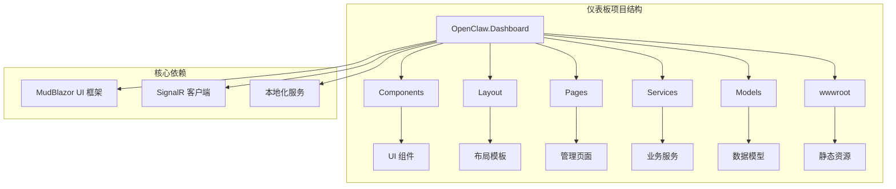

**图表来源**
- [OpenClaw.Dashboard.csproj:1-15](file://src/OpenClaw.Dashboard/OpenClaw.Dashboard.csproj#L1-L15)
- [Program.cs:1-32](file://src/OpenClaw.Dashboard/Program.cs#L1-L32)

**章节来源**
- [OpenClaw.Dashboard.csproj:1-15](file://src/OpenClaw.Dashboard/OpenClaw.Dashboard.csproj#L1-L15)
- [_Imports.razor:1-15](file://src/OpenClaw.Dashboard/_Imports.razor#L1-L15)

## 核心组件

### 前端框架架构

仪表板基于 Blazor WebAssembly 构建，具有以下核心特性：

- **运行时环境**：WebAssembly 运行时，支持客户端渲染
- **UI 框架**：MudBlazor 提供 Material Design 组件库
- **状态管理**：基于组件状态和 SignalR 实现实时通信
- **路由系统**：内置的 Blazor 路由机制
- **本地化**：支持多语言界面切换

### 服务层架构

系统采用分层服务架构，每个服务负责特定的业务领域：

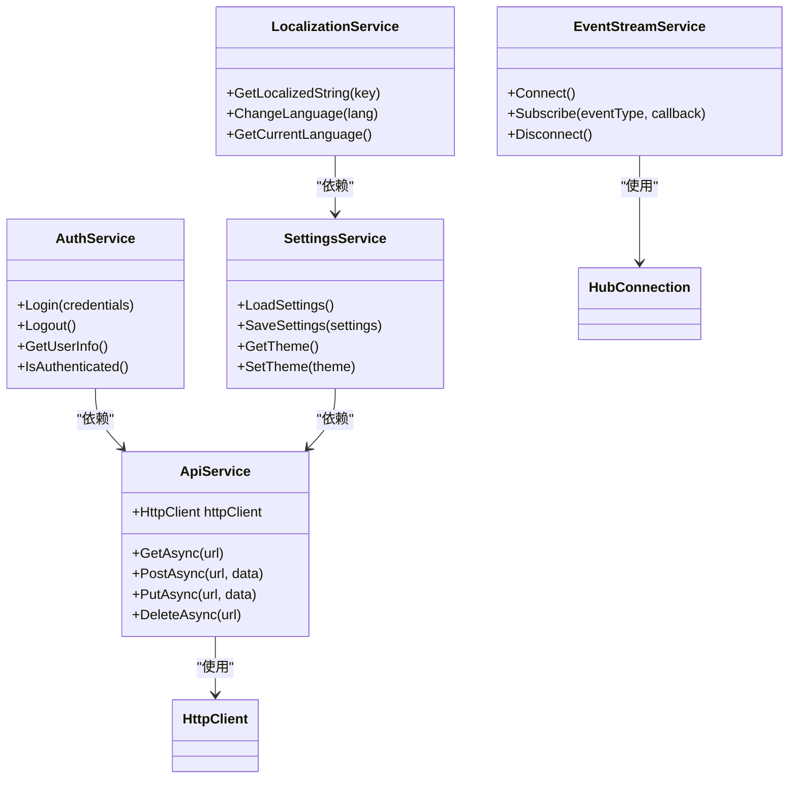

**图表来源**
- [AuthService.cs](file://src/OpenClaw.Dashboard/Services/AuthService.cs)
- [ApiService.cs](file://src/OpenClaw.Dashboard/Services/ApiService.cs)
- [SettingsService.cs](file://src/OpenClaw.Dashboard/Services/SettingsService.cs)
- [EventStreamService.cs](file://src/OpenClaw.Dashboard/Services/EventStreamService.cs)
- [LocalizationService.cs](file://src/OpenClaw.Dashboard/Services/LocalizationService.cs)

**章节来源**
- [Program.cs:9-23](file://src/OpenClaw.Dashboard/Program.cs#L9-L23)

## 架构概览

仪表板采用分层架构设计，确保了良好的可维护性和扩展性：

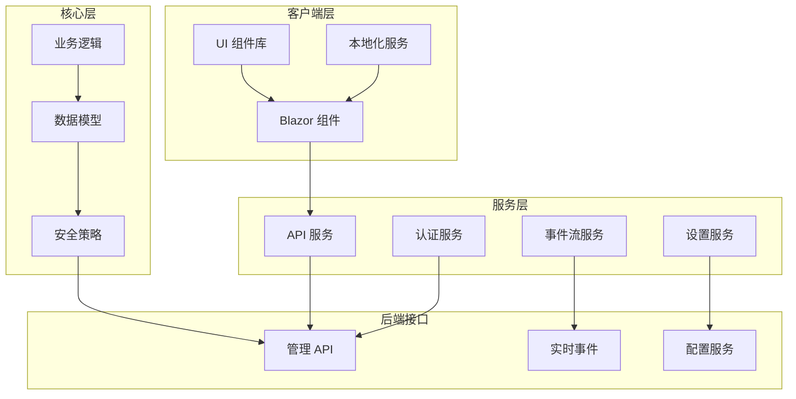

**图表来源**
- [App.razor:1-13](file://src/OpenClaw.Dashboard/App.razor#L1-L13)
- [Program.cs:13-21](file://src/OpenClaw.Dashboard/Program.cs#L13-L21)

### 数据流架构

系统采用双向数据绑定和事件驱动的数据流模式：

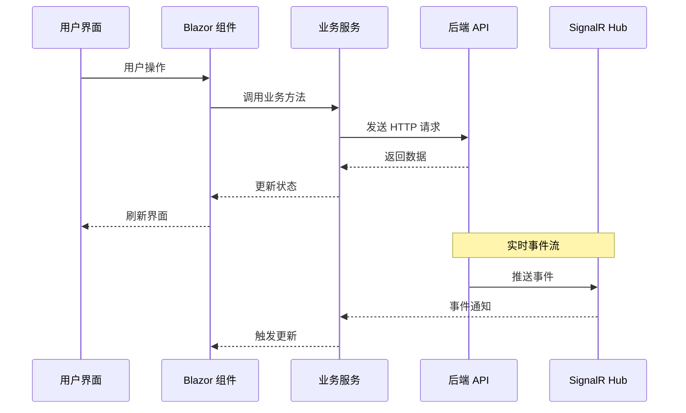

**图表来源**
- [ApiService.cs](file://src/OpenClaw.Dashboard/Services/ApiService.cs)
- [EventStreamService.cs](file://src/OpenClaw.Dashboard/Services/EventStreamService.cs)

## 详细组件分析

### 布局系统

仪表板采用灵活的布局系统，支持多种视图模式：

#### 主布局组件

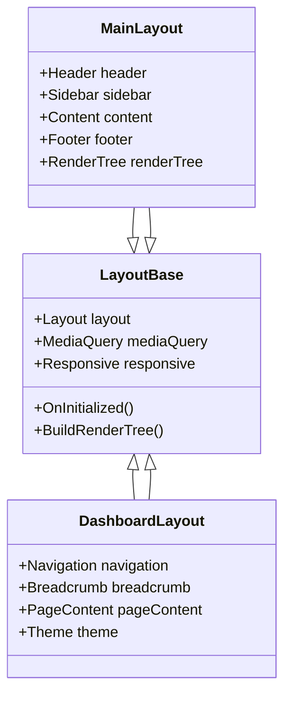

**图表来源**
- [MainLayout.razor](file://src/OpenClaw.Dashboard/Layout/MainLayout.razor)
- [DashboardLayout.razor](file://src/OpenClaw.Dashboard/Layout/DashboardLayout.razor)

#### 导航系统

导航系统提供多层次的菜单结构，支持动态加载和权限控制：

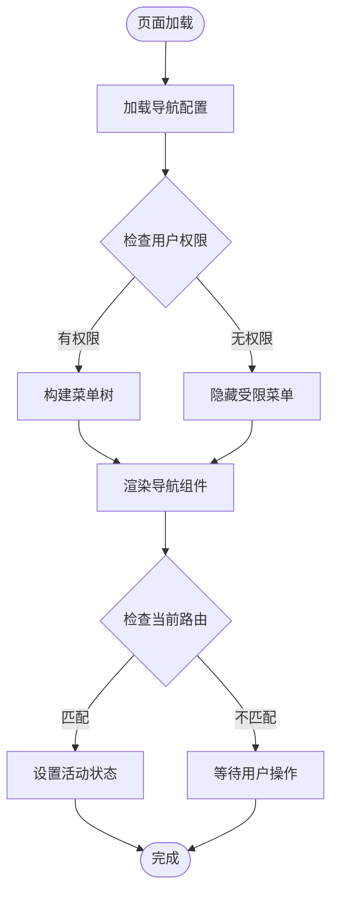

**图表来源**
- [MainLayout.razor](file://src/OpenClaw.Dashboard/Layout/MainLayout.razor)

### 认证与授权

系统实现了多层安全机制，确保管理界面的安全性：

#### 认证流程

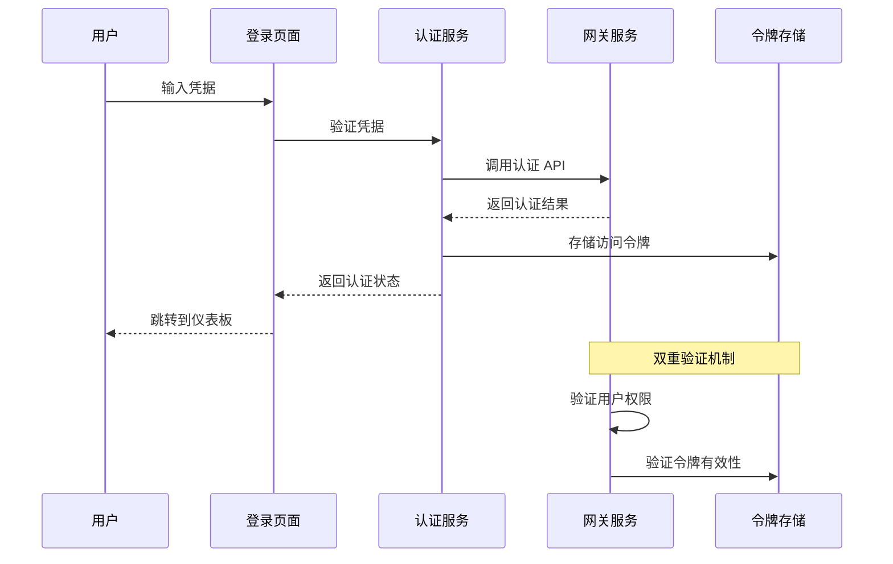

**图表来源**
- [AuthService.cs](file://src/OpenClaw.Dashboard/Services/AuthService.cs)
- [BrowserSessionAuthService.cs](file://src/OpenClaw.Gateway/BrowserSessionAuthService.cs)
- [BotFrameworkTokenValidator.cs](file://src/OpenClaw.Gateway/BotFrameworkTokenValidator.cs)

#### 权限管理

系统采用基于角色的访问控制（RBAC）模型：

| 权限级别 | 描述 | 可访问功能 |
|---------|------|-----------|
| 系统管理员 | 全部权限 | 所有管理功能 |
| 运维人员 | 系统管理 | 监控、配置、日志 |
| 开发者 | 开发工具 | 代码编辑、调试工具 |
| 只读用户 | 查看权限 | 仪表板、报告查看 |

**章节来源**
- [AuthService.cs](file://src/OpenClaw.Dashboard/Services/AuthService.cs)
- [OperatorAccountService.cs](file://src/OpenClaw.Gateway/OperatorAccountService.cs)

### 治理管理

治理管理系统负责工具使用策略和合规性控制：

#### 治理策略配置

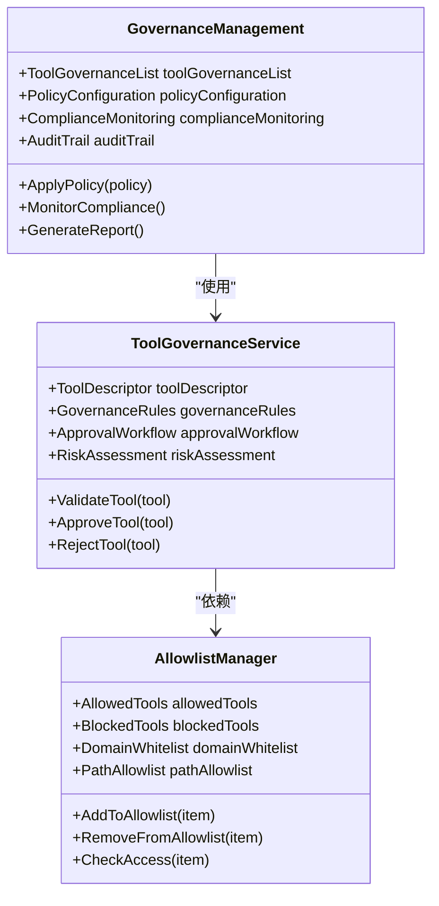

**图表来源**
- [GovernanceManagement.razor](file://src/OpenClaw.Dashboard/Pages/GovernanceManagement.razor)
- [GovernanceLedgerService.cs](file://src/OpenClaw.Gateway/GovernanceLedgerService.cs)
- [AllowlistManager.cs](file://src/OpenClaw.Core/Security/AllowlistManager.cs)

#### 合规性监控

系统提供实时的合规性监控功能：

- **工具使用审计**：记录所有工具调用历史
- **风险评估**：自动评估工具使用风险等级
- **异常检测**：识别潜在的安全威胁
- **合规报告**：生成详细的合规性报告

**章节来源**
- [GovernanceManagement.razor](file://src/OpenClaw.Dashboard/Pages/GovernanceManagement.razor)
- [GovernanceLedgerModels.cs](file://src/OpenClaw.Core/Models/GovernanceLedgerModels.cs)

### 会话监控

会话监控系统提供全面的会话状态跟踪和性能监控：

#### 实时会话跟踪

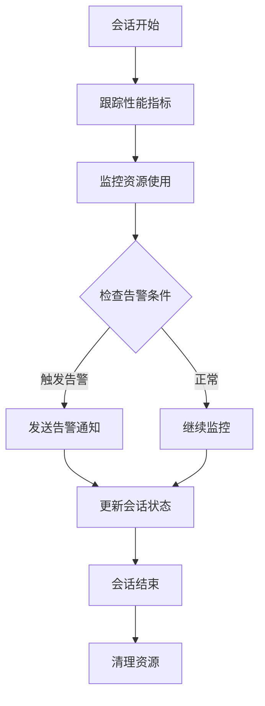

**图表来源**
- [SessionMonitoring.razor](file://src/OpenClaw.Dashboard/Pages/SessionMonitoring.razor)
- [SessionMetadataStore.cs](file://src/OpenClaw.Gateway/SessionMetadataStore.cs)

#### 性能指标监控

系统监控关键性能指标：

- **响应时间**：API 调用响应时间统计
- **吞吐量**：每秒处理的请求数
- **错误率**：失败请求的比例
- **资源利用率**：CPU、内存、网络使用情况

**章节来源**
- [SessionMonitoring.razor](file://src/OpenClaw.Dashboard/Pages/SessionMonitoring.razor)
- [SessionAdminModels.cs](file://src/OpenClaw.Core/Models/SessionAdminModels.cs)

### 学习管理

学习管理系统支持机器学习模型的训练、评估和部署：

#### 模型生命周期管理

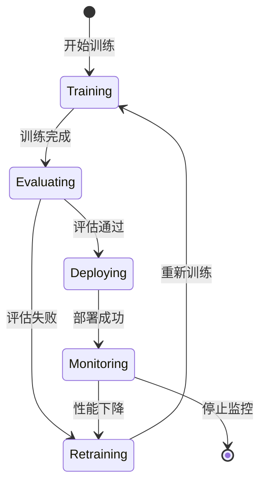

**图表来源**
- [LearningManagement.razor](file://src/OpenClaw.Dashboard/Pages/LearningManagement.razor)
- [LearningService.cs](file://src/OpenClaw.Gateway/LearningService.cs)

#### 训练作业管理

系统提供完整的机器学习工作流：

- **数据预处理**：自动数据清洗和格式化
- **模型训练**：分布式训练支持
- **超参数优化**：自动化超参数搜索
- **模型评估**：多维度性能评估
- **模型版本管理**：版本控制和回滚

**章节来源**
- [LearningManagement.razor](file://src/OpenClaw.Dashboard/Pages/LearningManagement.razor)
- [LearningModels.cs](file://src/OpenClaw.Core/Models/LearningModels.cs)

### 设置配置

设置配置页面提供系统参数的集中管理：

#### 配置分类

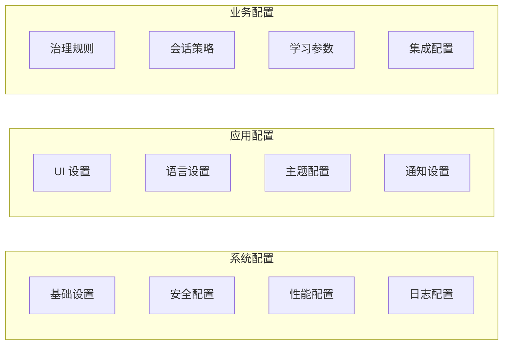

**图表来源**
- [SettingsConfiguration.razor](file://src/OpenClaw.Dashboard/Pages/SettingsConfiguration.razor)
- [AdminSettingsService.cs](file://src/OpenClaw.Gateway/AdminSettingsService.cs)

**章节来源**
- [SettingsConfiguration.razor](file://src/OpenClaw.Dashboard/Pages/SettingsConfiguration.razor)
- [SettingsService.cs](file://src/OpenClaw.Dashboard/Services/SettingsService.cs)

## 依赖关系分析

### 外部依赖

仪表板项目依赖以下关键外部库：

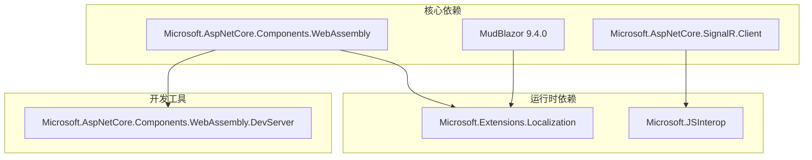

**图表来源**
- [OpenClaw.Dashboard.csproj:8-13](file://src/OpenClaw.Dashboard/OpenClaw.Dashboard.csproj#L8-L13)

### 内部依赖关系

系统内部组件之间的依赖关系：

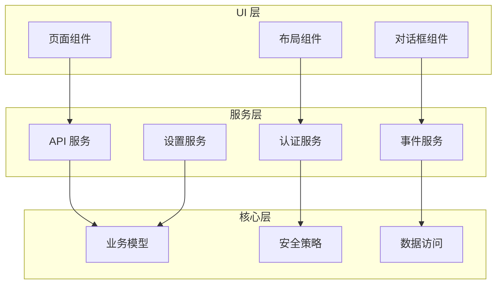

**图表来源**
- [Program.cs:13-19](file://src/OpenClaw.Dashboard/Program.cs#L13-L19)
- [_Imports.razor:9-15](file://src/OpenClaw.Dashboard/_Imports.razor#L9-L15)

**章节来源**
- [OpenClaw.Dashboard.csproj:1-15](file://src/OpenClaw.Dashboard/OpenClaw.Dashboard.csproj#L1-L15)
- [Program.cs:1-32](file://src/OpenClaw.Dashboard/Program.cs#L1-L32)

## 性能考虑

### 前端性能优化

仪表板采用了多项性能优化策略：

- **组件懒加载**：按需加载大型组件
- **虚拟滚动**：大数据列表的虚拟化处理
- **缓存策略**：智能数据缓存和失效机制
- **并行请求**：多个 API 请求的并发处理
- **内存管理**：及时释放不再使用的资源

### 响应式设计

系统支持多种设备和屏幕尺寸：

- **移动端适配**：触摸友好的界面元素
- **平板优化**：横向布局的适应性
- **桌面端增强**：键盘快捷键和高级功能
- **高 DPI 支持**：清晰度优化的图标和字体

## 故障排除指南

### 常见问题诊断

#### 认证问题

**症状**：登录失败或会话过期
**排查步骤**：
1. 检查网络连接和 API 可达性
2. 验证服务器时间同步
3. 清除浏览器缓存和 Cookie
4. 检查证书和 SSL 配置

#### 性能问题

**症状**：页面加载缓慢或响应迟钝
**排查步骤**：
1. 使用浏览器开发者工具分析网络请求
2. 检查组件渲染性能
3. 监控内存使用情况
4. 优化数据查询和缓存策略

#### 功能异常

**症状**：特定功能无法正常使用
**排查步骤**：
1. 检查浏览器控制台错误信息
2. 验证 API 响应状态码
3. 确认用户权限和角色配置
4. 查看服务器日志和错误堆栈

**章节来源**
- [AuthService.cs](file://src/OpenClaw.Dashboard/Services/AuthService.cs)
- [ApiService.cs](file://src/OpenClaw.Dashboard/Services/ApiService.cs)

## 结论

仪表板和管理界面项目展现了现代前端架构的最佳实践，通过 Blazor WebAssembly 技术实现了高性能、可维护的管理控制台。系统的设计充分考虑了安全性、可扩展性和用户体验，在治理管理、会话监控、学习管理和设置配置等方面提供了完整的企业级功能。

项目的模块化设计和清晰的分层架构为未来的功能扩展奠定了坚实的基础，同时 MudBlazor UI 框架的选择确保了良好的用户体验和一致的视觉设计。

## 附录

### 开发指南

#### 环境搭建

1. **安装依赖**：确保安装 .NET SDK 和 Node.js
2. **克隆项目**：获取源代码仓库
3. **安装包**：执行包恢复命令
4. **启动开发服务器**：运行调试环境

#### 组件开发规范

- **命名约定**：使用 PascalCase 命名组件
- **文件组织**：按功能模块组织文件结构
- **代码注释**：为复杂逻辑添加详细注释
- **错误处理**：统一的异常处理机制

#### 样式定制

系统支持灵活的主题定制和样式覆盖：

- **CSS 变量**：通过 CSS 自定义属性实现主题切换
- **MudBlazor 主题**：利用 MudBlazor 的主题系统
- **响应式设计**：媒体查询和断点配置
- **动画效果**：CSS 过渡和变换效果