# 仪表板架构设计

<cite>
**本文档引用的文件**
- [Program.cs](file://src/OpenClaw.Dashboard/Program.cs)
- [App.razor](file://src/OpenClaw.Dashboard/App.razor)
- [_Imports.razor](file://src/OpenClaw.Dashboard/_Imports.razor)
- [OpenClaw.Dashboard.csproj](file://src/OpenClaw.Dashboard/OpenClaw.Dashboard.csproj)
- [OpenClaw.Gateway.csproj](file://src/OpenClaw.Gateway/OpenClaw.Gateway.csproj)
- [DashboardStaticAssetTests.cs](file://src/OpenClaw.Tests/DashboardStaticAssetTests.cs)
- [OpenClawHttpClient.cs](file://src/OpenClaw.Client/OpenClawHttpClient.cs)
- [MainWindowViewModel.Dashboard.cs](file://src/OpenClaw.Companion/ViewModels/MainWindowViewModel.Dashboard.cs)
</cite>

## 目录
1. [引言](#引言)
2. [项目结构](#项目结构)
3. [核心组件](#核心组件)
4. [架构概览](#架构概览)
5. [详细组件分析](#详细组件分析)
6. [依赖关系分析](#依赖关系分析)
7. [性能考虑](#性能考虑)
8. [故障排除指南](#故障排除指南)
9. [结论](#结论)

## 引言

本文件为仪表板架构设计的技术文档，专注于基于 Blazor WebAssembly 的前端架构实现。该系统采用现代 Web 技术栈，通过 Blazor WebAssembly 实现客户端渲染，结合 MudBlazor 组件库提供丰富的用户界面，并通过 SignalR 实现实时事件流。本文档深入解释了架构选择、组件层次结构、服务注册和依赖注入模式，以及应用程序启动流程、路由配置等核心架构组件。

## 项目结构

仪表板项目采用模块化架构设计，主要由以下核心部分组成：

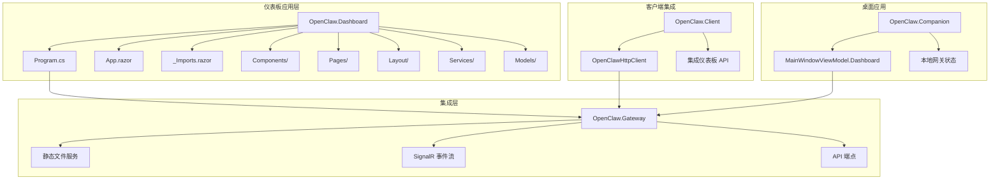

**图表来源**
- [Program.cs:1-32](file://src/OpenClaw.Dashboard/Program.cs#L1-L32)
- [OpenClaw.Dashboard.csproj:1-14](file://src/OpenClaw.Dashboard/OpenClaw.Dashboard.csproj#L1-L14)
- [OpenClaw.Gateway.csproj:34-142](file://src/OpenClaw.Gateway/OpenClaw.Gateway.csproj#L34-L142)

**章节来源**
- [Program.cs:1-32](file://src/OpenClaw.Dashboard/Program.cs#L1-L32)
- [OpenClaw.Dashboard.csproj:1-14](file://src/OpenClaw.Dashboard/OpenClaw.Dashboard.csproj#L1-L14)

## 核心组件

### 应用程序启动器

仪表板使用 Blazor WebAssembly Host Builder 模式进行初始化，该模式提供了现代化的 SPA 启动体验：

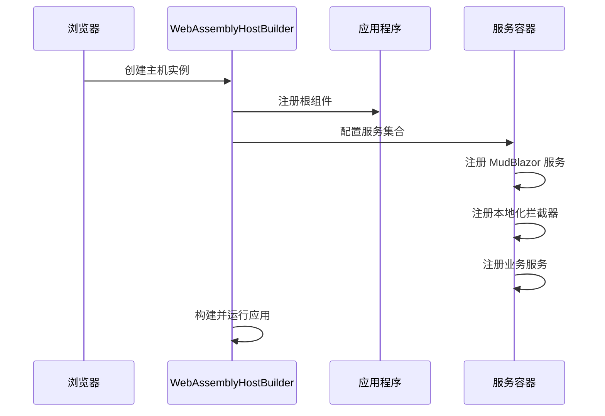

**图表来源**
- [Program.cs:9-23](file://src/OpenClaw.Dashboard/Program.cs#L9-L23)

### 路由系统

应用程序采用基于组件的路由架构，支持动态路由和错误页面处理：

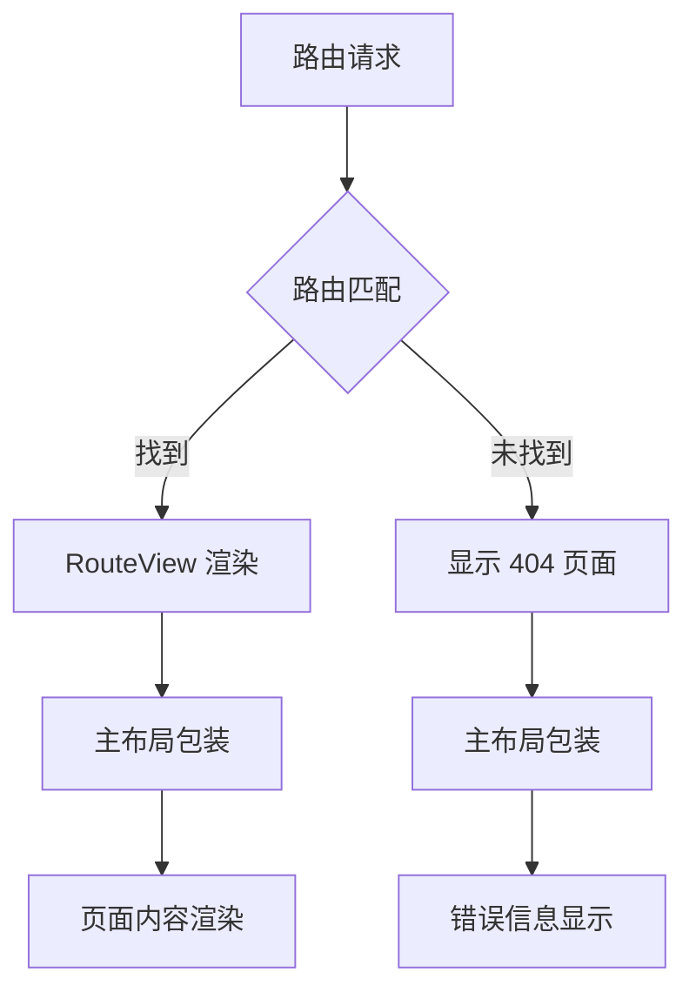

**图表来源**
- [App.razor:1-12](file://src/OpenClaw.Dashboard/App.razor#L1-L12)

**章节来源**
- [App.razor:1-12](file://src/OpenClaw.Dashboard/App.razor#L1-L12)
- [_Imports.razor:1-15](file://src/OpenClaw.Dashboard/_Imports.razor#L1-L15)

## 架构概览

仪表板采用分层架构设计，实现了清晰的关注点分离：

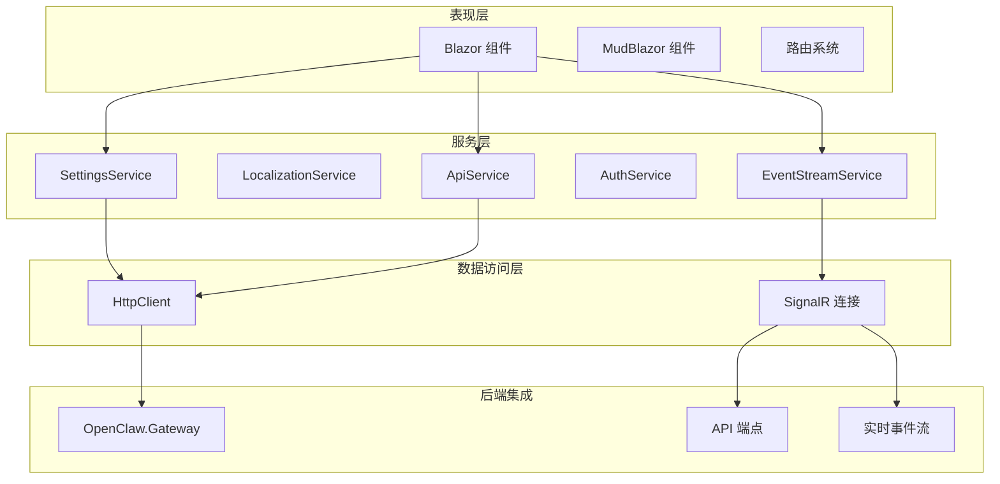

**图表来源**
- [Program.cs:13-21](file://src/OpenClaw.Dashboard/Program.cs#L13-L21)
- [OpenClaw.Gateway.csproj:34-142](file://src/OpenClaw.Gateway/OpenClaw.Gateway.csproj#L34-L142)

## 详细组件分析

### 服务注册与依赖注入

仪表板实现了完整的依赖注入架构，所有服务都通过构造函数注入模式管理：

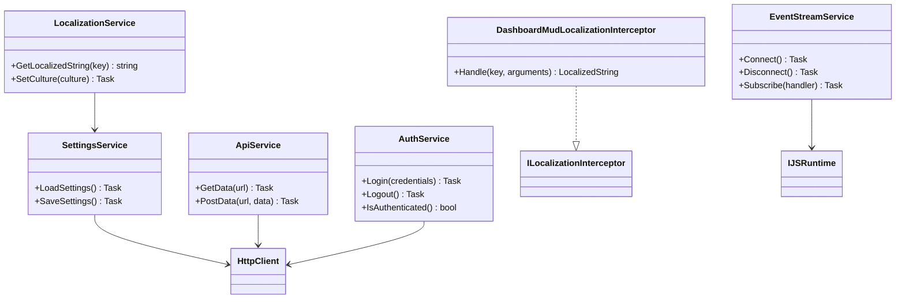

**图表来源**
- [Program.cs:15-19](file://src/OpenClaw.Dashboard/Program.cs#L15-L19)
- [Program.cs:25-31](file://src/OpenClaw.Dashboard/Program.cs#L25-L31)

### 组件层次结构

仪表板采用分层的组件架构，支持复杂的用户界面组织：

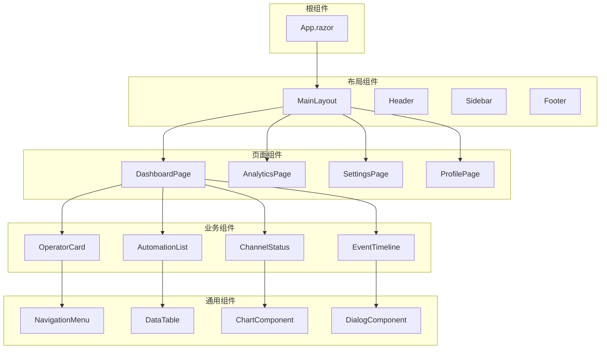

**图表来源**
- [_Imports.razor:10-14](file://src/OpenClaw.Dashboard/_Imports.razor#L10-L14)

### 生命周期管理

Blazor WebAssembly 提供了完整的组件生命周期管理机制：

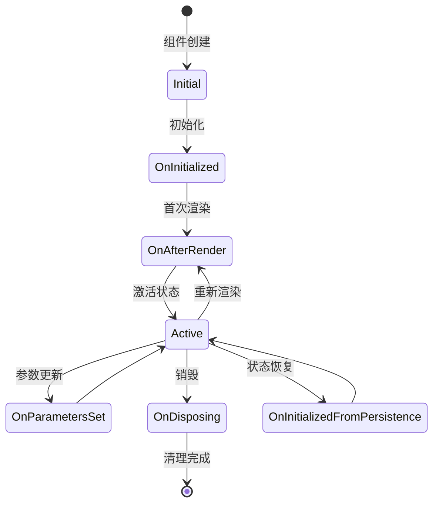

**图表来源**
- [Program.cs:10-11](file://src/OpenClaw.Dashboard/Program.cs#L10-L11)

### 状态管理模式

仪表板采用集中式状态管理模式，通过服务层统一管理应用状态：

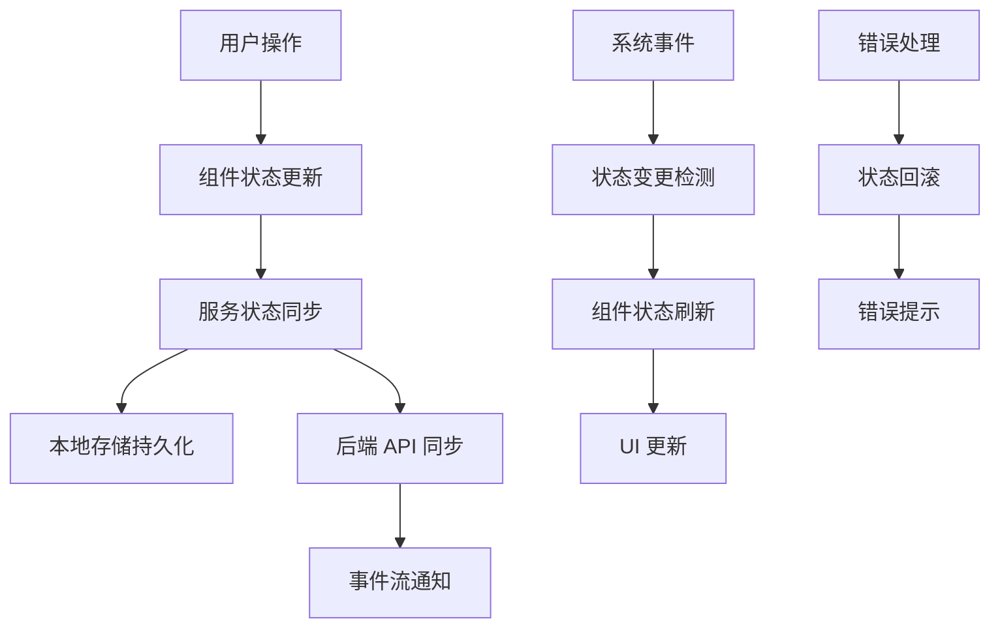

**图表来源**
- [Program.cs:15-19](file://src/OpenClaw.Dashboard/Program.cs#L15-L19)

**章节来源**
- [Program.cs:1-32](file://src/OpenClaw.Dashboard/Program.cs#L1-L32)

## 依赖关系分析

### 外部依赖

仪表板项目依赖于多个关键的外部库和服务：

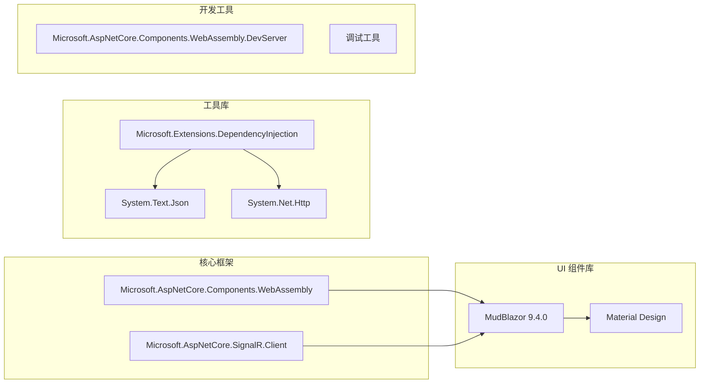

**图表来源**
- [OpenClaw.Dashboard.csproj:8-12](file://src/OpenClaw.Dashboard/OpenClaw.Dashboard.csproj#L8-L12)

### 内部模块依赖

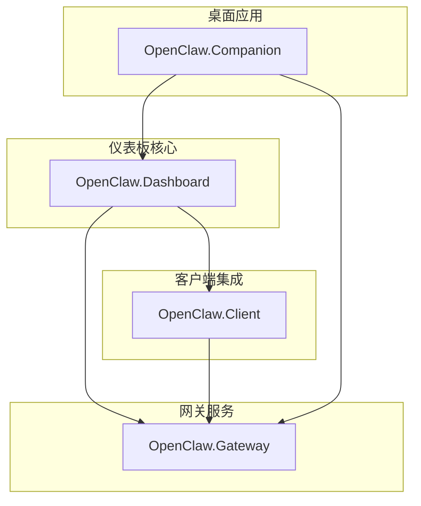

**图表来源**
- [OpenClaw.Gateway.csproj:34-142](file://src/OpenClaw.Gateway/OpenClaw.Gateway.csproj#L34-L142)

**章节来源**
- [OpenClaw.Dashboard.csproj:1-14](file://src/OpenClaw.Dashboard/OpenClaw.Dashboard.csproj#L1-L14)
- [OpenClaw.Gateway.csproj:34-142](file://src/OpenClaw.Gateway/OpenClaw.Gateway.csproj#L34-L142)

## 性能考虑

### 启动性能优化

仪表板采用了多项性能优化策略来确保快速的启动时间和流畅的用户体验：

1. **代码裁剪配置**: 使用 `TrimMode=partial` 确保 Blazor WebAssembly 应用的可运行性
2. **国际化设置**: `InvariantGlobalization=false` 支持多语言环境
3. **静态资源优化**: 通过 ASP.NET Core 静态文件中间件提供优化的资源服务

### 运行时性能

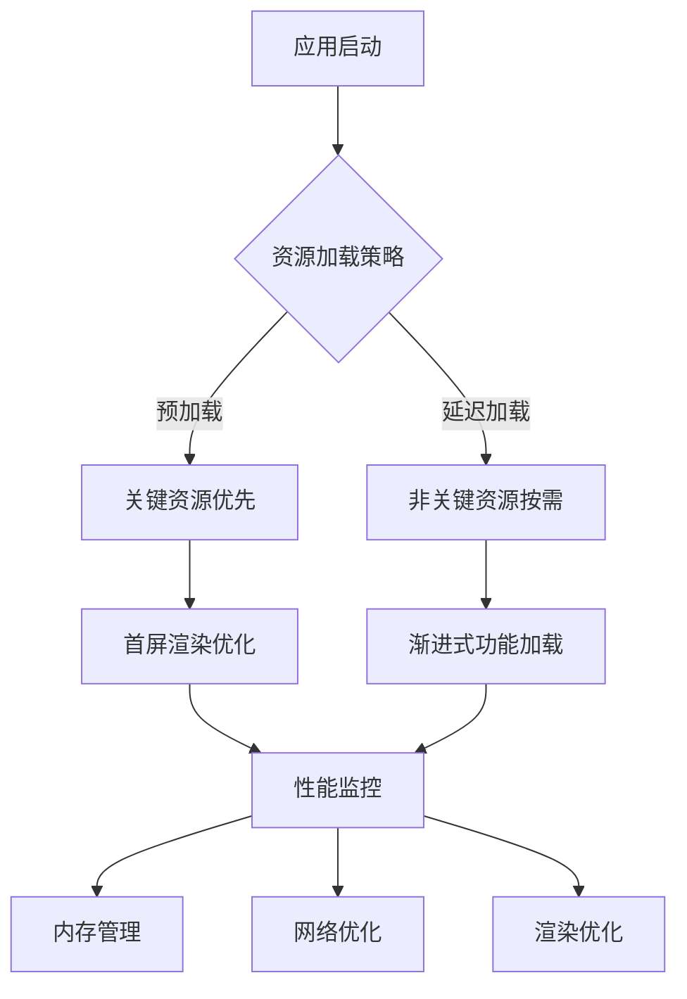

**图表来源**
- [DashboardStaticAssetTests.cs:16-31](file://src/OpenClaw.Tests/DashboardStaticAssetTests.cs#L16-L31)

### 缓存策略

仪表板实现了多层次的缓存机制：

1. **HTTP 缓存**: 利用浏览器缓存机制减少重复请求
2. **内存缓存**: 服务层实现数据缓存以提高响应速度
3. **本地存储**: 关键配置和用户偏好存储在本地

**章节来源**
- [DashboardStaticAssetTests.cs:16-40](file://src/OpenClaw.Tests/DashboardStaticAssetTests.cs#L16-L40)

## 故障排除指南

### 常见问题诊断

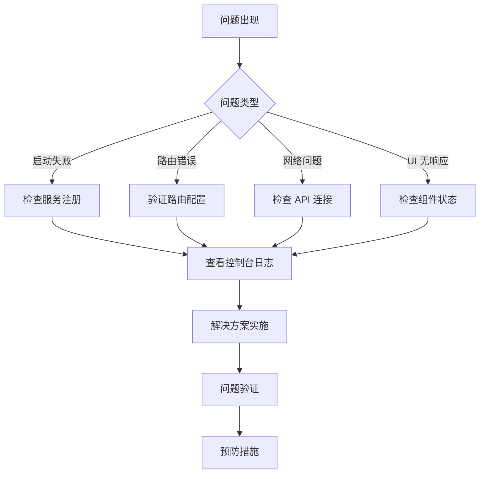

### 错误处理策略

仪表板采用分层的错误处理机制：

1. **组件级错误处理**: 每个组件都有自己的错误边界
2. **服务级错误处理**: 服务层捕获和处理业务逻辑错误
3. **全局错误处理**: 应用程序级别的错误管理和用户反馈

### 调试工具

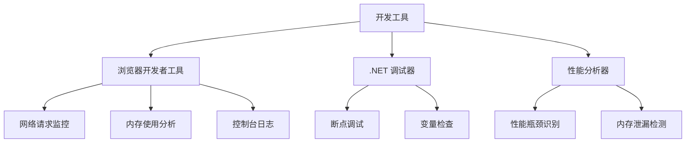

**章节来源**
- [DashboardStaticAssetTests.cs:33-40](file://src/OpenClaw.Tests/DashboardStaticAssetTests.cs#L33-L40)

## 结论

仪表板架构设计体现了现代 Web 应用的最佳实践，通过 Blazor WebAssembly 实现了高性能的客户端应用。该架构具有以下优势：

1. **技术先进性**: 采用最新的 Blazor WebAssembly 技术栈
2. **架构清晰**: 分层设计确保了良好的可维护性
3. **性能优异**: 多层次优化确保了流畅的用户体验
4. **扩展性强**: 模块化设计便于功能扩展和维护

该架构为后续的功能扩展和技术演进奠定了坚实的基础，能够适应不断变化的业务需求和技术发展。