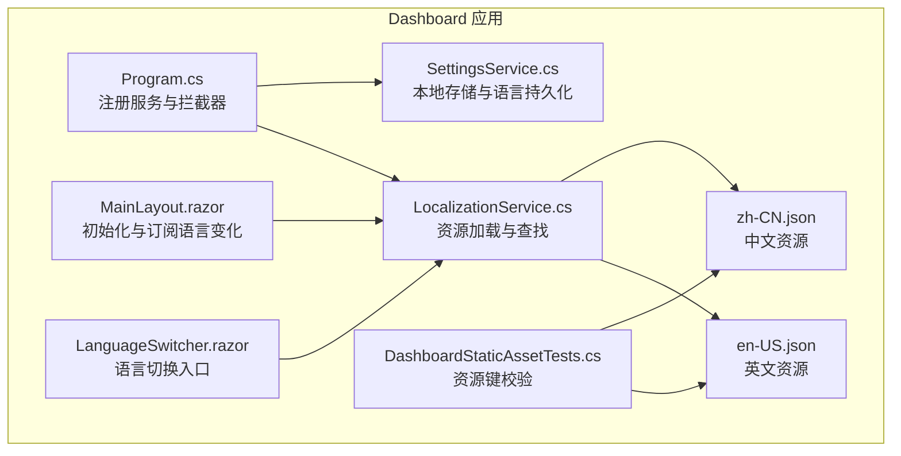
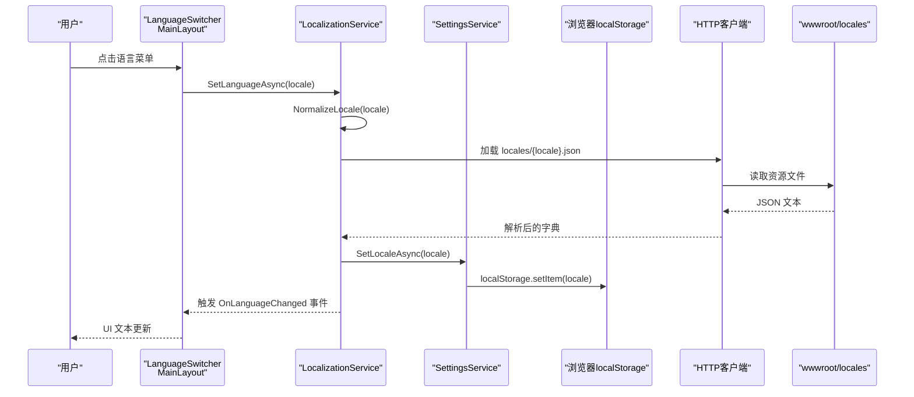
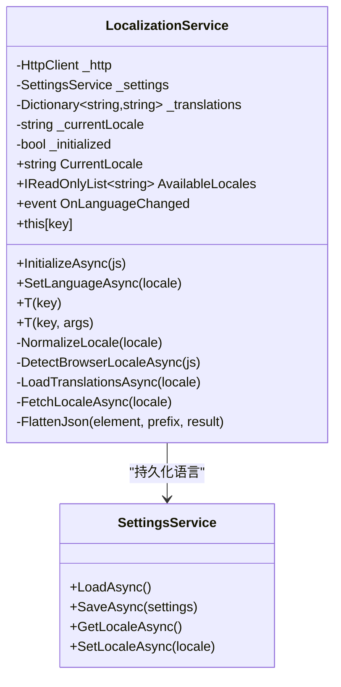
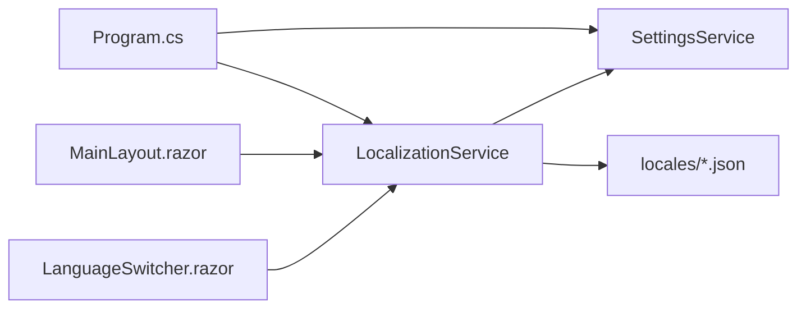

# 本地化和国际化

<cite>
**本文档引用的文件**
- [LocalizationService.cs](file://src/OpenClaw.Dashboard/Services/LocalizationService.cs)
- [SettingsService.cs](file://src/OpenClaw.Dashboard/Services/SettingsService.cs)
- [LanguageSwitcher.razor](file://src/OpenClaw.Dashboard/Components/LanguageSwitcher.razor)
- [MainLayout.razor](file://src/OpenClaw.Dashboard/Layout/MainLayout.razor)
- [Overview.razor](file://src/OpenClaw.Dashboard/Pages/Overview.razor)
- [Program.cs](file://src/OpenClaw.Dashboard/Program.cs)
- [en-US.json](file://src/OpenClaw.Dashboard/wwwroot/locales/en-US.json)
- [zh-CN.json](file://src/OpenClaw.Dashboard/wwwroot/locales/zh-CN.json)
- [DashboardStaticAssetTests.cs](file://src/OpenClaw.Tests/DashboardStaticAssetTests.cs)
- [AgentPromptDateTime.cs](file://src/OpenClaw.Agent/AgentPromptDateTime.cs)
</cite>

## 目录
1. [简介](#简介)
2. [项目结构](#项目结构)
3. [核心组件](#核心组件)
4. [架构总览](#架构总览)
5. [详细组件分析](#详细组件分析)
6. [依赖关系分析](#依赖关系分析)
7. [性能考虑](#性能考虑)
8. [故障排除指南](#故障排除指南)
9. [结论](#结论)
10. [附录](#附录)

## 简介
本文件系统性地阐述了 Kingcrab 项目中本地化与国际化的实现方案，重点覆盖以下方面：
- 多语言支持机制与资源管理
- 语言检测、默认语言设置与动态切换流程
- 本地化拦截器与 MudBlazor 集成
- 文本资源文件结构与键值规范
- 日期时间格式化与数字格式化实践
- RTL 语言支持与字体适配建议
- 新增语言支持、翻译管理与本地化测试流程

该实现采用 Blazor WebAssembly 端原生资源加载与轻量级拦截器，确保 NativeAOT 友好性与运行时性能。

## 项目结构
本地化相关的核心文件分布于 Dashboard 应用中，主要包含：
- 服务层：本地化服务与设置服务
- UI 层：语言切换组件与布局集成
- 资源层：JSON 格式的多语言资源文件
- 测试层：资源键完整性校验

**图表来源**
- [Program.cs:14-31](file://src/OpenClaw.Dashboard/Program.cs#L14-L31)
- [MainLayout.razor:107-115](file://src/OpenClaw.Dashboard/Layout/MainLayout.razor#L107-L115)
- [LanguageSwitcher.razor:1-49](file://src/OpenClaw.Dashboard/Components/LanguageSwitcher.razor#L1-L49)
- [LocalizationService.cs:160-187](file://src/OpenClaw.Dashboard/Services/LocalizationService.cs#L160-L187)
- [SettingsService.cs:60-84](file://src/OpenClaw.Dashboard/Services/SettingsService.cs#L60-L84)
- [en-US.json:1-436](file://src/OpenClaw.Dashboard/wwwroot/locales/en-US.json#L1-L436)
- [zh-CN.json:1-436](file://src/OpenClaw.Dashboard/wwwroot/locales/zh-CN.json#L1-L436)
- [DashboardStaticAssetTests.cs:321-335](file://src/OpenClaw.Tests/DashboardStaticAssetTests.cs#L321-L335)

**章节来源**
- [Program.cs:14-31](file://src/OpenClaw.Dashboard/Program.cs#L14-L31)
- [MainLayout.razor:107-115](file://src/OpenClaw.Dashboard/Layout/MainLayout.razor#L107-L115)
- [LanguageSwitcher.razor:1-49](file://src/OpenClaw.Dashboard/Components/LanguageSwitcher.razor#L1-L49)
- [LocalizationService.cs:160-187](file://src/OpenClaw.Dashboard/Services/LocalizationService.cs#L160-L187)
- [SettingsService.cs:60-84](file://src/OpenClaw.Dashboard/Services/SettingsService.cs#L60-L84)
- [en-US.json:1-436](file://src/OpenClaw.Dashboard/wwwroot/locales/en-US.json#L1-L436)
- [zh-CN.json:1-436](file://src/OpenClaw.Dashboard/wwwroot/locales/zh-CN.json#L1-L436)
- [DashboardStaticAssetTests.cs:321-335](file://src/OpenClaw.Tests/DashboardStaticAssetTests.cs#L321-L335)

## 核心组件
- 本地化服务（LocalizationService）
  - 负责加载 JSON 资源、扁平化键空间、提供查找与格式化能力、监听语言变化事件
  - 支持默认语言、后备语言、浏览器语言检测与前缀映射
- 设置服务（SettingsService）
  - 提供语言键的本地存储读写，用于持久化用户选择
- 语言切换组件（LanguageSwitcher）
  - 基于 MudBlazor 的菜单组件，提供语言选择入口，并通过服务切换语言
- 布局与页面集成
  - 主布局在初始化阶段调用本地化服务并订阅语言变化
  - 页面组件通过注入服务获取翻译文本

**章节来源**
- [LocalizationService.cs:12-116](file://src/OpenClaw.Dashboard/Services/LocalizationService.cs#L12-L116)
- [SettingsService.cs:60-84](file://src/OpenClaw.Dashboard/Services/SettingsService.cs#L60-L84)
- [LanguageSwitcher.razor:1-49](file://src/OpenClaw.Dashboard/Components/LanguageSwitcher.razor#L1-L49)
- [MainLayout.razor:107-115](file://src/OpenClaw.Dashboard/Layout/MainLayout.razor#L107-L115)

## 架构总览
本地化架构围绕“服务-资源-UI”三层展开，采用事件驱动的语言切换机制，确保 UI 实时响应语言变化。

**图表来源**
- [LanguageSwitcher.razor:30-38](file://src/OpenClaw.Dashboard/Components/LanguageSwitcher.razor#L30-L38)
- [LocalizationService.cs:70-82](file://src/OpenClaw.Dashboard/Services/LocalizationService.cs#L70-L82)
- [SettingsService.cs:73-84](file://src/OpenClaw.Dashboard/Services/SettingsService.cs#L73-L84)
- [LocalizationService.cs:160-187](file://src/OpenClaw.Dashboard/Services/LocalizationService.cs#L160-L187)

## 详细组件分析

### 本地化服务（LocalizationService）
- 初始化流程
  - 优先从本地设置读取语言，否则检测浏览器语言，再进行规范化与加载
  - 加载失败时回退到后备语言，最终触发语言变化事件
- 语言切换流程
  - 规范化目标语言，若与当前语言相同则跳过
  - 加载新语言资源，更新当前语言并持久化
- 键查找与格式化
  - 支持点式键（如 common.save），缺失键返回键本身
  - 支持带参数的格式化，捕获格式异常并回退到模板
- 资源加载
  - 从 wwwroot/locales 下按 locale.json 加载
  - 使用 JSON 解析并将嵌套对象扁平化为点式键

**图表来源**
- [LocalizationService.cs:12-199](file://src/OpenClaw.Dashboard/Services/LocalizationService.cs#L12-L199)
- [SettingsService.cs:8-86](file://src/OpenClaw.Dashboard/Services/SettingsService.cs#L8-L86)

**章节来源**
- [LocalizationService.cs:45-82](file://src/OpenClaw.Dashboard/Services/LocalizationService.cs#L45-L82)
- [LocalizationService.cs:85-116](file://src/OpenClaw.Dashboard/Services/LocalizationService.cs#L85-L116)
- [LocalizationService.cs:160-187](file://src/OpenClaw.Dashboard/Services/LocalizationService.cs#L160-L187)

### 设置服务（SettingsService）
- 负责读写 Dashboard 设置与语言键
- 使用浏览器 localStorage 进行持久化，异常情况静默忽略

**章节来源**
- [SettingsService.cs:60-84](file://src/OpenClaw.Dashboard/Services/SettingsService.cs#L60-L84)

### 语言切换组件（LanguageSwitcher）
- 提供语言菜单，显示当前激活语言并调用服务切换
- 订阅语言变化事件以刷新 UI

**章节来源**
- [LanguageSwitcher.razor:1-49](file://src/OpenClaw.Dashboard/Components/LanguageSwitcher.razor#L1-L49)

### 布局与页面集成
- 主布局在初始化时调用本地化服务并订阅语言变化
- 页面组件通过注入服务获取翻译文本，实现即时更新

**章节来源**
- [MainLayout.razor:107-115](file://src/OpenClaw.Dashboard/Layout/MainLayout.razor#L107-L115)
- [Overview.razor:8-18](file://src/OpenClaw.Dashboard/Pages/Overview.razor#L8-L18)

### 本地化拦截器与 MudBlazor 集成
- 在 Program 中注册本地化拦截器，当资源未找到时返回占位键，避免运行时异常
- 与 MudBlazor 组件配合使用，保证 UI 文本的本地化一致性

**章节来源**
- [Program.cs:14-31](file://src/OpenClaw.Dashboard/Program.cs#L14-L31)

### 文本资源文件与键规范
- 资源文件采用 JSON 结构，键为点式命名空间（如 common.save）
- 通过测试对资源键进行完整性校验，确保所有页面引用的键均存在

**章节来源**
- [en-US.json:1-436](file://src/OpenClaw.Dashboard/wwwroot/locales/en-US.json#L1-L436)
- [zh-CN.json:1-436](file://src/OpenClaw.Dashboard/wwwroot/locales/zh-CN.json#L1-L436)
- [DashboardStaticAssetTests.cs:321-335](file://src/OpenClaw.Tests/DashboardStaticAssetTests.cs#L321-L335)

### 日期时间与数字格式化
- Agent 子系统中使用 CultureInfo 进行时间格式化，支持 24 小时制与序数后缀
- 本地化服务提供字符串格式化能力，便于在 UI 中插入参数化文本

**章节来源**
- [AgentPromptDateTime.cs:13-38](file://src/OpenClaw.Agent/AgentPromptDateTime.cs#L13-L38)
- [LocalizationService.cs:96-112](file://src/OpenClaw.Dashboard/Services/LocalizationService.cs#L96-L112)

## 依赖关系分析
- 服务依赖
  - LocalizationService 依赖 HttpClient 与 SettingsService
  - SettingsService 依赖 IJSRuntime 以访问浏览器 localStorage
- UI 依赖
  - LanguageSwitcher 与 MainLayout 依赖 LocalizationService
  - 页面组件通过注入获取翻译文本
- 资源依赖
  - 本地化服务从 wwwroot/locales 动态加载对应语言资源

**图表来源**
- [Program.cs:14-31](file://src/OpenClaw.Dashboard/Program.cs#L14-L31)
- [MainLayout.razor:107-115](file://src/OpenClaw.Dashboard/Layout/MainLayout.razor#L107-L115)
- [LanguageSwitcher.razor:1-49](file://src/OpenClaw.Dashboard/Components/LanguageSwitcher.razor#L1-L49)
- [LocalizationService.cs:160-187](file://src/OpenClaw.Dashboard/Services/LocalizationService.cs#L160-L187)

**章节来源**
- [Program.cs:14-31](file://src/OpenClaw.Dashboard/Program.cs#L14-L31)
- [MainLayout.razor:107-115](file://src/OpenClaw.Dashboard/Layout/MainLayout.razor#L107-L115)
- [LanguageSwitcher.razor:1-49](file://src/OpenClaw.Dashboard/Components/LanguageSwitcher.razor#L1-L49)
- [LocalizationService.cs:160-187](file://src/OpenClaw.Dashboard/Services/LocalizationService.cs#L160-L187)

## 性能考虑
- 资源加载
  - 采用按需加载策略，仅在语言切换时拉取对应 JSON 文件
  - 使用扁平化键空间减少查找层级，提升访问效率
- 缓存与去重
  - 当目标语言与当前语言相同时直接返回，避免重复加载
- 运行时优化
  - 本地化服务为 NativeAOT 友好实现，避免反射与复杂序列化
- UI 更新
  - 通过事件驱动的单向数据流更新 UI，减少不必要的重渲染

[本节为通用性能讨论，不直接分析具体文件]

## 故障排除指南
- 语言未生效
  - 检查浏览器 localStorage 是否正确写入语言键
  - 确认 locales/{locale}.json 文件是否存在且格式有效
- 资源键缺失
  - 使用测试用例校验资源键完整性，确保页面引用的键均存在
- 格式化异常
  - 本地化服务对格式化异常进行捕获并回退到模板，避免 UI 抛错

**章节来源**
- [SettingsService.cs:73-84](file://src/OpenClaw.Dashboard/Services/SettingsService.cs#L73-L84)
- [LocalizationService.cs:160-187](file://src/OpenClaw.Dashboard/Services/LocalizationService.cs#L160-L187)
- [DashboardStaticAssetTests.cs:321-335](file://src/OpenClaw.Tests/DashboardStaticAssetTests.cs#L321-L335)

## 结论
本实现以轻量、NativeAOT 友好的方式提供了完整的本地化与国际化能力：
- 通过服务-资源-UI 分层解耦，易于扩展与维护
- 支持动态语言切换、浏览器语言检测与后备语言回退
- 与 MudBlazor 无缝集成，保障 UI 体验一致性
- 提供测试保障资源键完整性，降低维护风险

[本节为总结性内容，不直接分析具体文件]

## 附录

### 语言检测与默认语言设置
- 检测顺序：本地存储 → 浏览器语言 → 默认语言
- 规范化策略：大小写不敏感匹配、按语言前缀映射
- 回退策略：后备语言与默认语言统一处理

**章节来源**
- [LocalizationService.cs:45-65](file://src/OpenClaw.Dashboard/Services/LocalizationService.cs#L45-L65)
- [LocalizationService.cs:117-144](file://src/OpenClaw.Dashboard/Services/LocalizationService.cs#L117-L144)

### 动态语言切换流程
- 用户触发 → 服务规范化 → 加载资源 → 持久化 → 通知 UI → 刷新显示

**章节来源**
- [LanguageSwitcher.razor:30-38](file://src/OpenClaw.Dashboard/Components/LanguageSwitcher.razor#L30-L38)
- [LocalizationService.cs:70-82](file://src/OpenClaw.Dashboard/Services/LocalizationService.cs#L70-L82)

### 与 MudBlazor 的集成
- 注册本地化拦截器，避免资源缺失导致异常
- 与主题、对话框、提示等组件协同工作

**章节来源**
- [Program.cs:14-31](file://src/OpenClaw.Dashboard/Program.cs#L14-L31)

### RTL 语言支持与字体适配
- 本项目当前支持 en-US 与 zh-CN，均为 LTR 书写方向
- 若需新增 RTL 语言（如 ar、he），建议：
  - 在布局中根据语言切换 direction 属性
  - 引入 RTL 兼容的字体与样式变量
  - 对组件布局使用 MudBlazor 的方向属性进行适配

[本节为概念性指导，不直接分析具体文件]

### 新增语言支持流程
- 在 wwwroot/locales 下新增 {lang}.json 资源文件
- 在本地化服务中声明支持的语言数组
- 在语言切换组件中添加对应菜单项
- 运行测试用例确保资源键完整

**章节来源**
- [en-US.json:1-436](file://src/OpenClaw.Dashboard/wwwroot/locales/en-US.json#L1-L436)
- [zh-CN.json:1-436](file://src/OpenClaw.Dashboard/wwwroot/locales/zh-CN.json#L1-L436)
- [LocalizationService.cs:17](file://src/OpenClaw.Dashboard/Services/LocalizationService.cs#L17)
- [LanguageSwitcher.razor:10-17](file://src/OpenClaw.Dashboard/Components/LanguageSwitcher.razor#L10-L17)
- [DashboardStaticAssetTests.cs:321-335](file://src/OpenClaw.Tests/DashboardStaticAssetTests.cs#L321-L335)

### 翻译管理最佳实践
- 使用点式命名空间组织键，避免冲突
- 参数化文本使用格式化接口，确保可维护性
- 定期运行测试用例，防止遗漏或拼写错误

**章节来源**
- [LocalizationService.cs:85-112](file://src/OpenClaw.Dashboard/Services/LocalizationService.cs#L85-L112)
- [DashboardStaticAssetTests.cs:321-335](file://src/OpenClaw.Tests/DashboardStaticAssetTests.cs#L321-L335)