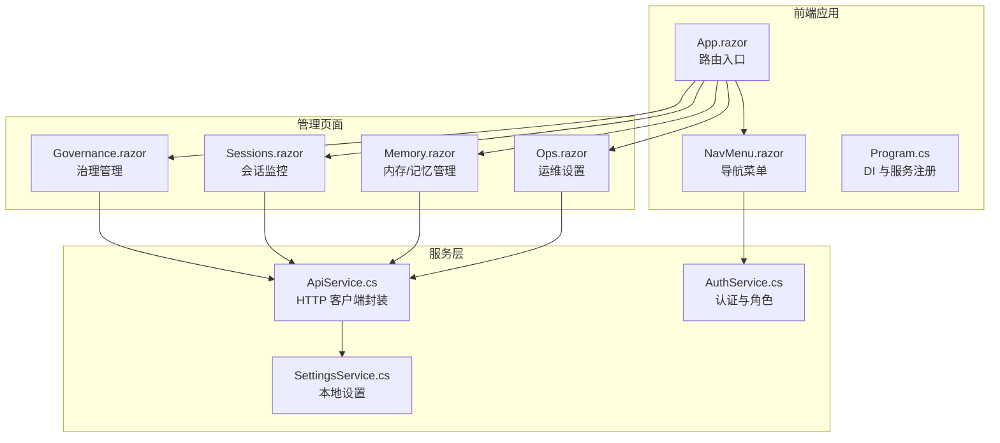
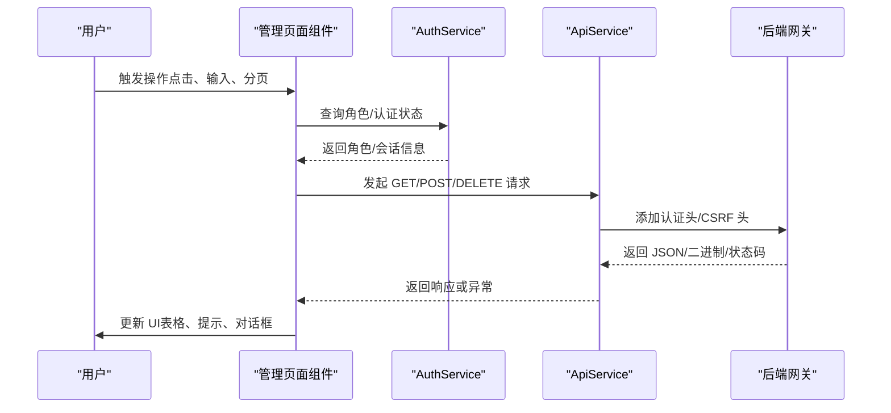
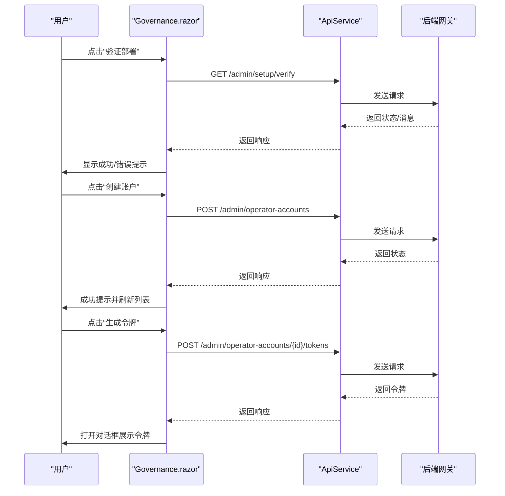
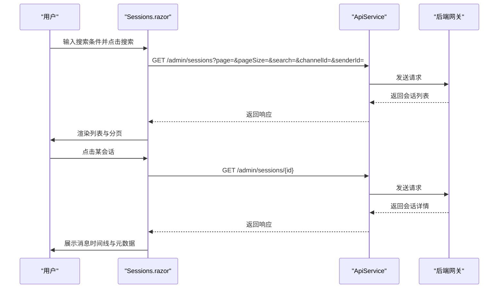
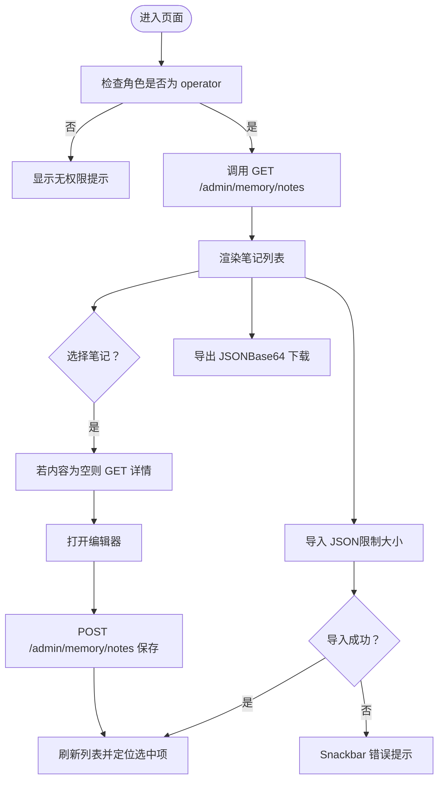
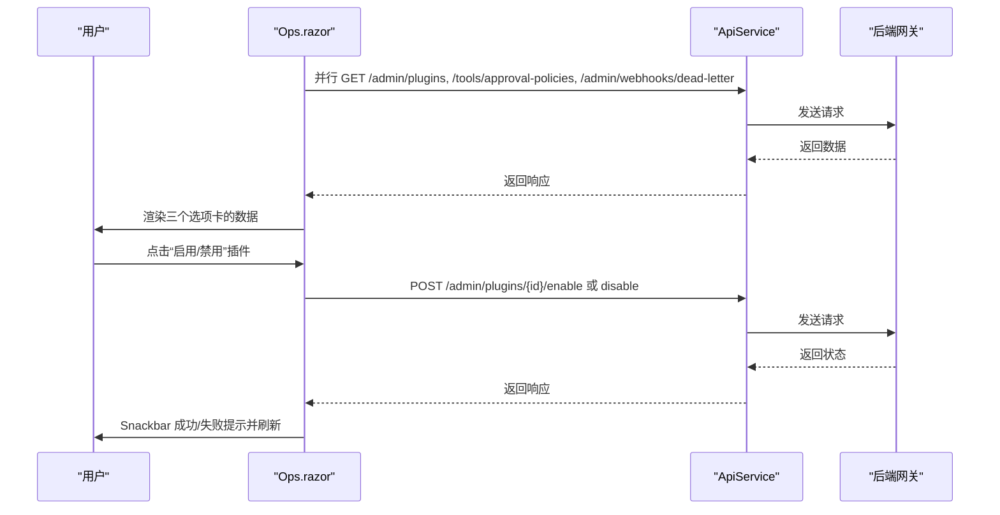
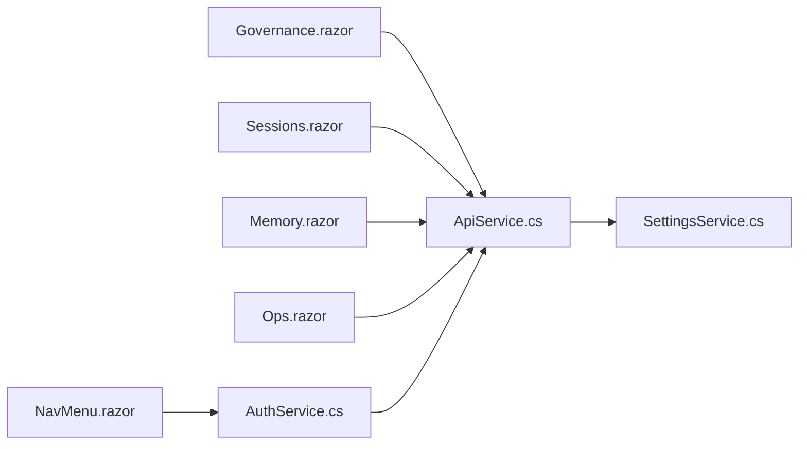

# 管理页面功能

<cite>
**本文档引用的文件**
- [App.razor](file://src/OpenClaw.Dashboard/App.razor)
- [Program.cs](file://src/OpenClaw.Dashboard/Program.cs)
- [NavMenu.razor](file://src/OpenClaw.Dashboard/Layout/NavMenu.razor)
- [Governance.razor](file://src/OpenClaw.Dashboard/Pages/Governance.razor)
- [Sessions.razor](file://src/OpenClaw.Dashboard/Pages/Sessions.razor)
- [Memory.razor](file://src/OpenClaw.Dashboard/Pages/Memory.razor)
- [Ops.razor](file://src/OpenClaw.Dashboard/Pages/Ops.razor)
- [ApiService.cs](file://src/OpenClaw.Dashboard/Services/ApiService.cs)
- [AuthService.cs](file://src/OpenClaw.Dashboard/Services/AuthService.cs)
- [SettingsService.cs](file://src/OpenClaw.Dashboard/Services/SettingsService.cs)
</cite>

## 目录
1. [简介](#简介)
2. [项目结构](#项目结构)
3. [核心组件](#核心组件)
4. [架构总览](#架构总览)
5. [详细组件分析](#详细组件分析)
6. [依赖关系分析](#依赖关系分析)
7. [性能考虑](#性能考虑)
8. [故障排除指南](#故障排除指南)
9. [结论](#结论)

## 简介
本文件面向管理页面功能，围绕以下四大管理页面展开：治理管理（工具审批与权限控制）、会话监控（实时会话状态）、内存管理（记忆检索与管理）、运维设置（插件与审批策略）。文档从页面布局、数据表格、表单验证、搜索过滤、导航与状态同步、与后端 API 集成、错误处理与加载状态等方面进行系统化技术说明，帮助开发者与运维人员快速理解与维护。

## 项目结构
管理页面基于 Blazor WebAssembly 构建，采用 MudBlazor UI 组件库，通过 ApiService 封装 HTTP 请求，AuthService 管理认证态与角色权限，SettingsService 提供本地存储的仪表盘设置与语言偏好。

**图表来源**
- [App.razor:1-13](file://src/OpenClaw.Dashboard/App.razor#L1-L13)
- [Program.cs:1-32](file://src/OpenClaw.Dashboard/Program.cs#L1-L32)
- [NavMenu.razor:1-98](file://src/OpenClaw.Dashboard/Layout/NavMenu.razor#L1-L98)
- [Governance.razor:1-569](file://src/OpenClaw.Dashboard/Pages/Governance.razor#L1-L569)
- [Sessions.razor:1-939](file://src/OpenClaw.Dashboard/Pages/Sessions.razor#L1-L939)
- [Memory.razor:1-646](file://src/OpenClaw.Dashboard/Pages/Memory.razor#L1-L646)
- [Ops.razor:1-471](file://src/OpenClaw.Dashboard/Pages/Ops.razor#L1-L471)
- [ApiService.cs:1-146](file://src/OpenClaw.Dashboard/Services/ApiService.cs#L1-L146)
- [AuthService.cs:1-154](file://src/OpenClaw.Dashboard/Services/AuthService.cs#L1-L154)
- [SettingsService.cs:1-86](file://src/OpenClaw.Dashboard/Services/SettingsService.cs#L1-L86)

**章节来源**
- [App.razor:1-13](file://src/OpenClaw.Dashboard/App.razor#L1-L13)
- [Program.cs:1-32](file://src/OpenClaw.Dashboard/Program.cs#L1-L32)
- [NavMenu.razor:1-98](file://src/OpenClaw.Dashboard/Layout/NavMenu.razor#L1-L98)

## 核心组件
- 路由与入口
  - App.razor 使用 Router 组件承载页面路由，统一使用 MainLayout 布局，支持 NotFound 场景。
- 服务注入与 UI 框架
  - Program.cs 注册 MudBlazor 服务、本地化拦截器、ApiService、AuthService、EventStreamService、HttpClient。
- 导航菜单
  - NavMenu.razor 根据认证态与角色动态渲染菜单项，区分 admin/operator/viewer 权限。
- 认证与授权
  - AuthService 提供登录/登出、会话同步、角色判定、CSRF 头注入；ApiService 在变更型请求上自动附加 CSRF Token。
- 设置持久化
  - SettingsService 通过浏览器 localStorage 存储代理 API 基地址与 API Key、语言偏好。

**章节来源**
- [App.razor:1-13](file://src/OpenClaw.Dashboard/App.razor#L1-L13)
- [Program.cs:1-32](file://src/OpenClaw.Dashboard/Program.cs#L1-L32)
- [NavMenu.razor:1-98](file://src/OpenClaw.Dashboard/Layout/NavMenu.razor#L1-L98)
- [AuthService.cs:1-154](file://src/OpenClaw.Dashboard/Services/AuthService.cs#L1-L154)
- [ApiService.cs:1-146](file://src/OpenClaw.Dashboard/Services/ApiService.cs#L1-L146)
- [SettingsService.cs:1-86](file://src/OpenClaw.Dashboard/Services/SettingsService.cs#L1-L86)

## 架构总览
管理页面采用“页面组件 + 服务层”的分层设计：
- 页面组件负责视图与交互（表单、表格、对话框、分页）。
- 服务层负责与后端 API 通信、认证态管理、本地设置。
- 数据流以异步请求为主，结合 Snackbar 提示与 Dialog 弹窗确认。

**图表来源**
- [AuthService.cs:1-154](file://src/OpenClaw.Dashboard/Services/AuthService.cs#L1-L154)
- [ApiService.cs:1-146](file://src/OpenClaw.Dashboard/Services/ApiService.cs#L1-L146)
- [Governance.razor:297-336](file://src/OpenClaw.Dashboard/Pages/Governance.razor#L297-L336)
- [Sessions.razor:468-576](file://src/OpenClaw.Dashboard/Pages/Sessions.razor#L468-L576)
- [Memory.razor:361-396](file://src/OpenClaw.Dashboard/Pages/Memory.razor#L361-L396)
- [Ops.razor:298-323](file://src/OpenClaw.Dashboard/Pages/Ops.razor#L298-L323)

## 详细组件分析

### 治理管理页面（工具审批与权限控制）
- 功能概览
  - 部署状态核查：触发后端部署自检，返回结果并以 Snackbar 提示。
  - 运营账户管理：支持创建、删除、生成访问令牌；表格展示账户信息与操作按钮。
  - 组织策略编辑：以 JSON 文本域编辑组织级策略，支持保存与校验。
- 布局与交互
  - 三段式卡片布局：部署状态、运营账户、组织策略。
  - 表格采用 MudDataGrid，支持加载骨架屏、空状态提示。
  - 对话框用于创建账户与令牌展示，确认对话框用于删除操作。
- 数据与 API
  - 并行加载：部署状态、账户列表、策略 JSON。
  - 保存策略时对 JSON 进行解析校验，失败则提示错误。
- 错误处理与加载
  - 加载中显示进度条；网络异常或解析失败通过 Snackbar 提示。
  - 删除与生成令牌均使用确认对话框，避免误操作。

**图表来源**
- [Governance.razor:297-336](file://src/OpenClaw.Dashboard/Pages/Governance.razor#L297-L336)
- [Governance.razor:338-403](file://src/OpenClaw.Dashboard/Pages/Governance.razor#L338-L403)
- [Governance.razor:405-437](file://src/OpenClaw.Dashboard/Pages/Governance.razor#L405-L437)
- [Governance.razor:439-477](file://src/OpenClaw.Dashboard/Pages/Governance.razor#L439-L477)
- [ApiService.cs:56-85](file://src/OpenClaw.Dashboard/Services/ApiService.cs#L56-L85)

**章节来源**
- [Governance.razor:1-569](file://src/OpenClaw.Dashboard/Pages/Governance.razor#L1-L569)

### 会话监控页面（实时会话状态）
- 功能概览
  - 会话列表：分页加载，支持按关键词、渠道、发送者筛选；列表项包含会话 ID、渠道、最近活跃时间。
  - 详情面板：展示消息时间线、元数据、分支差异与恢复。
  - 元数据编辑：仅 operator 角色可编辑，支持 JSON 校验与保存。
- 布局与交互
  - 左右分栏：列表区（含分页控件）+ 详情区（含消息时间线、元数据、分支）。
  - 列表项高亮选中态，详情区支持骨架屏与空状态提示。
  - 分支差异弹窗与恢复操作需二次确认。
- 数据与 API
  - 支持多种后端响应形状（兼容旧版），合并 active/persisted/items。
  - 详情加载时根据后端响应形态回退到兼容模式。
- 错误处理与加载
  - 列表与详情分别有加载状态；网络异常通过 Snackbar 提示。

**图表来源**
- [Sessions.razor:468-576](file://src/OpenClaw.Dashboard/Pages/Sessions.razor#L468-L576)
- [Sessions.razor:578-629](file://src/OpenClaw.Dashboard/Pages/Sessions.razor#L578-L629)
- [ApiService.cs:42-54](file://src/OpenClaw.Dashboard/Services/ApiService.cs#L42-L54)

**章节来源**
- [Sessions.razor:1-939](file://src/OpenClaw.Dashboard/Pages/Sessions.razor#L1-L939)

### 内存管理页面（记忆检索与管理）
- 功能概览
  - 记忆笔记：导入/导出 JSON、新建/编辑/删除笔记、按关键字搜索预览。
  - 懒加载：列表仅携带摘要，选中后按需拉取完整内容。
- 布局与交互
  - 三栏布局：搜索框 + 笔记列表 + 编辑器。
  - 导入限制大小（WASM 内存友好），导出为 Base64 文件下载。
- 数据与 API
  - 列表与详情分离，编辑保存统一走 POST /admin/memory/notes。
- 错误处理与加载
  - 导入/导出/保存/删除均通过 Snackbar 反馈结果。

**图表来源**
- [Memory.razor:344-396](file://src/OpenClaw.Dashboard/Pages/Memory.razor#L344-L396)
- [Memory.razor:415-439](file://src/OpenClaw.Dashboard/Pages/Memory.razor#L415-L439)
- [Memory.razor:464-496](file://src/OpenClaw.Dashboard/Pages/Memory.razor#L464-L496)
- [Memory.razor:555-593](file://src/OpenClaw.Dashboard/Pages/Memory.razor#L555-L593)
- [Memory.razor:595-628](file://src/OpenClaw.Dashboard/Pages/Memory.razor#L595-L628)

**章节来源**
- [Memory.razor:1-646](file://src/OpenClaw.Dashboard/Pages/Memory.razor#L1-L646)

### 运维设置页面（插件与审批策略）
- 功能概览
  - 插件管理：启用/禁用插件，颜色与图标随状态变化。
  - 审批策略：展示工具匹配模式与策略类型，支持删除策略。
  - 死信队列：展示 webhook 失败记录，支持重试与丢弃。
- 布局与交互
  - 选项卡分页：插件、审批策略、死信队列。
  - 表格与简单表格混合，支持骨架屏与空状态提示。
- 数据与 API
  - 并行加载三类数据源，解析兼容数组结构。
- 错误处理与加载
  - 操作成功/失败通过 Snackbar 提示，失败时保留当前数据。

**图表来源**
- [Ops.razor:298-323](file://src/OpenClaw.Dashboard/Pages/Ops.razor#L298-L323)
- [Ops.razor:370-383](file://src/OpenClaw.Dashboard/Pages/Ops.razor#L370-L383)
- [ApiService.cs:56-85](file://src/OpenClaw.Dashboard/Services/ApiService.cs#L56-L85)

**章节来源**
- [Ops.razor:1-471](file://src/OpenClaw.Dashboard/Pages/Ops.razor#L1-L471)

## 依赖关系分析
- 组件耦合
  - 页面组件强依赖 ApiService 与 AuthService；NavMenu 依赖 AuthService 控制菜单可见性。
  - SettingsService 与浏览器 JS 互操作，不直接参与页面业务逻辑。
- 外部依赖
  - MudBlazor UI 组件库；System.Text.Json 序列化；浏览器 localStorage。
- 潜在循环依赖
  - 当前结构为单向依赖（页面 → 服务 → API/后端），无循环依赖迹象。

**图表来源**
- [Governance.razor:1-569](file://src/OpenClaw.Dashboard/Pages/Governance.razor#L1-L569)
- [Sessions.razor:1-939](file://src/OpenClaw.Dashboard/Pages/Sessions.razor#L1-L939)
- [Memory.razor:1-646](file://src/OpenClaw.Dashboard/Pages/Memory.razor#L1-L646)
- [Ops.razor:1-471](file://src/OpenClaw.Dashboard/Pages/Ops.razor#L1-L471)
- [ApiService.cs:1-146](file://src/OpenClaw.Dashboard/Services/ApiService.cs#L1-L146)
- [AuthService.cs:1-154](file://src/OpenClaw.Dashboard/Services/AuthService.cs#L1-L154)
- [SettingsService.cs:1-86](file://src/OpenClaw.Dashboard/Services/SettingsService.cs#L1-L86)
- [NavMenu.razor:1-98](file://src/OpenClaw.Dashboard/Layout/NavMenu.razor#L1-L98)

**章节来源**
- [AuthService.cs:1-154](file://src/OpenClaw.Dashboard/Services/AuthService.cs#L1-L154)
- [ApiService.cs:1-146](file://src/OpenClaw.Dashboard/Services/ApiService.cs#L1-L146)
- [SettingsService.cs:1-86](file://src/OpenClaw.Dashboard/Services/SettingsService.cs#L1-L86)
- [NavMenu.razor:1-98](file://src/OpenClaw.Dashboard/Layout/NavMenu.razor#L1-L98)

## 性能考虑
- 并行加载
  - 治理页面与运维页面均采用 Task.WhenAll 并行请求，减少首屏等待。
- 懒加载与骨架屏
  - 会话详情与记忆编辑器在加载时显示骨架屏，提升感知性能。
- 传输优化
  - 内存导入限制最大 16MB，避免 WASM 内存压力；导出采用 Base64 流式下载。
- UI 响应
  - 表格与列表使用 Dense/Hover/Striped 等轻量样式，避免过度渲染。

[本节为通用指导，无需特定文件引用]

## 故障排除指南
- 认证失败
  - 登录接口返回非成功状态时，前端会清空本地认证态；检查后端会话接口与 CSRF Token 是否正确传递。
- API 调用异常
  - ApiService 对非成功状态返回默认值或抛出异常；页面捕获并通过 Snackbar 提示。建议检查网络、后端可达性与 CORS。
- JSON 解析错误
  - 治理策略与会话元数据编辑均进行 JSON 校验，失败时提示具体错误信息。
- 导入/导出问题
  - 导入文件过大或格式不符会导致失败；导出为空时提示警告。

**章节来源**
- [AuthService.cs:34-83](file://src/OpenClaw.Dashboard/Services/AuthService.cs#L34-L83)
- [ApiService.cs:42-54](file://src/OpenClaw.Dashboard/Services/ApiService.cs#L42-L54)
- [Governance.razor:439-477](file://src/OpenClaw.Dashboard/Pages/Governance.razor#L439-L477)
- [Sessions.razor:666-704](file://src/OpenClaw.Dashboard/Pages/Sessions.razor#L666-L704)
- [Memory.razor:555-593](file://src/OpenClaw.Dashboard/Pages/Memory.razor#L555-L593)

## 结论
管理页面通过清晰的分层设计与一致的交互模式，实现了治理、会话、记忆与运维等关键领域的可视化与可控化。页面组件与服务层职责明确，API 集成稳健，具备良好的扩展性与可维护性。建议后续持续完善国际化文案、错误日志上报与自动化测试覆盖，以进一步提升用户体验与稳定性。