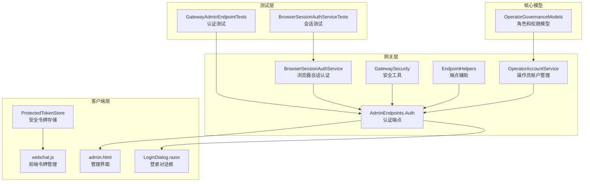
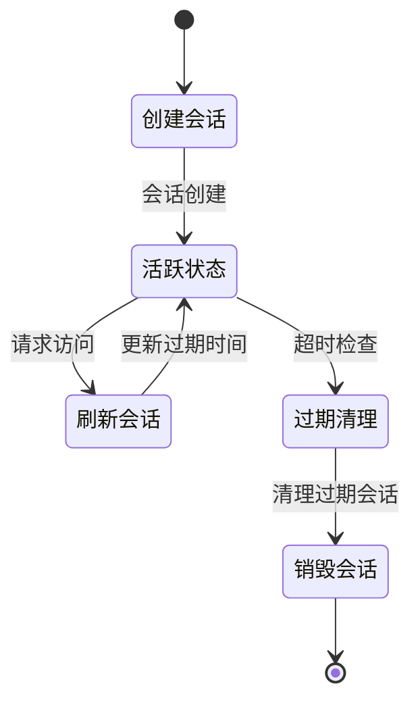
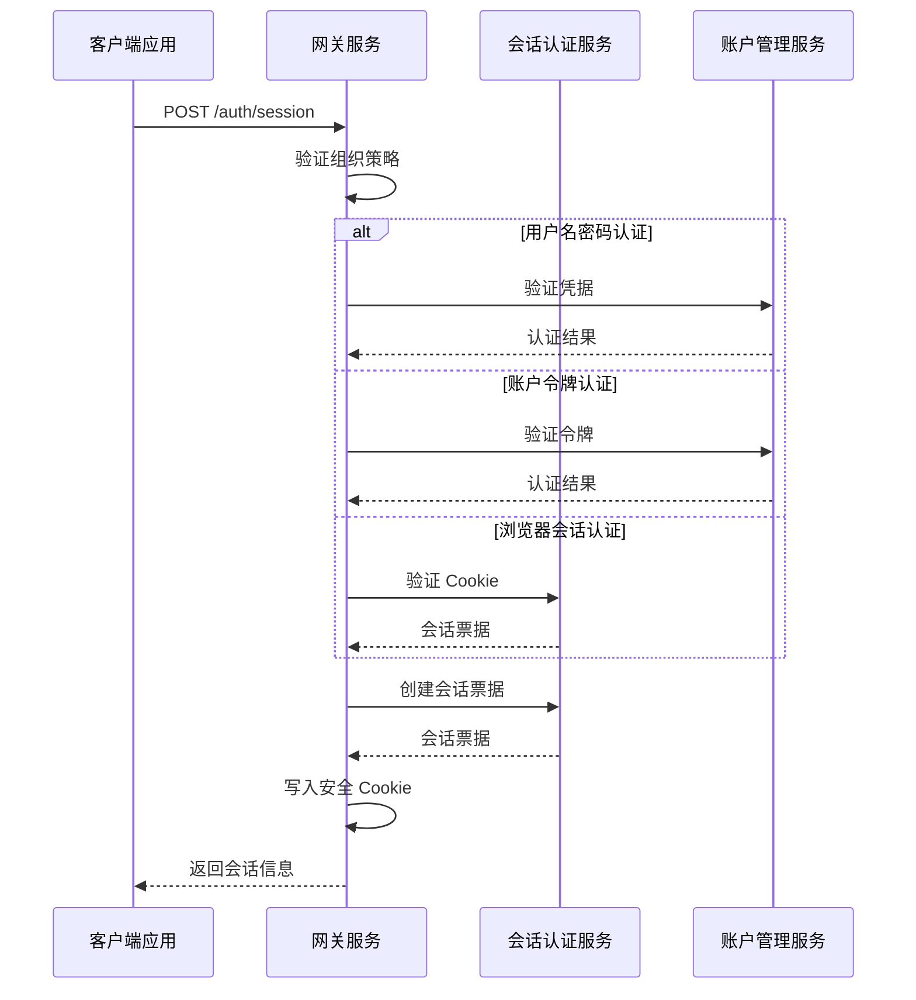
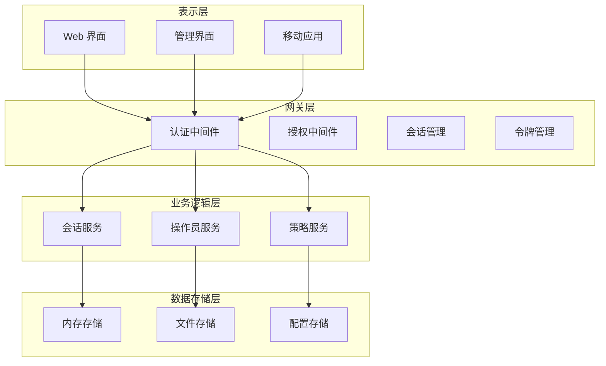
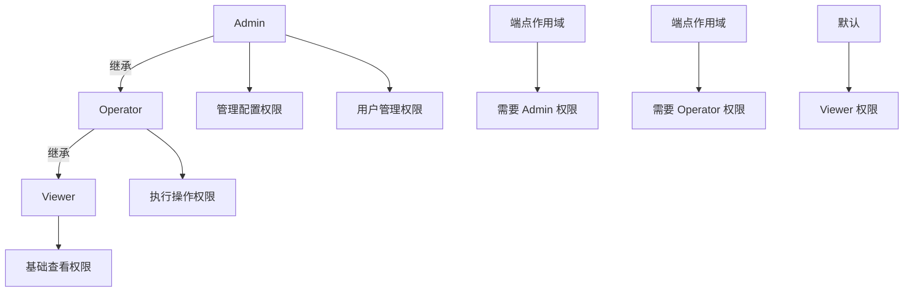
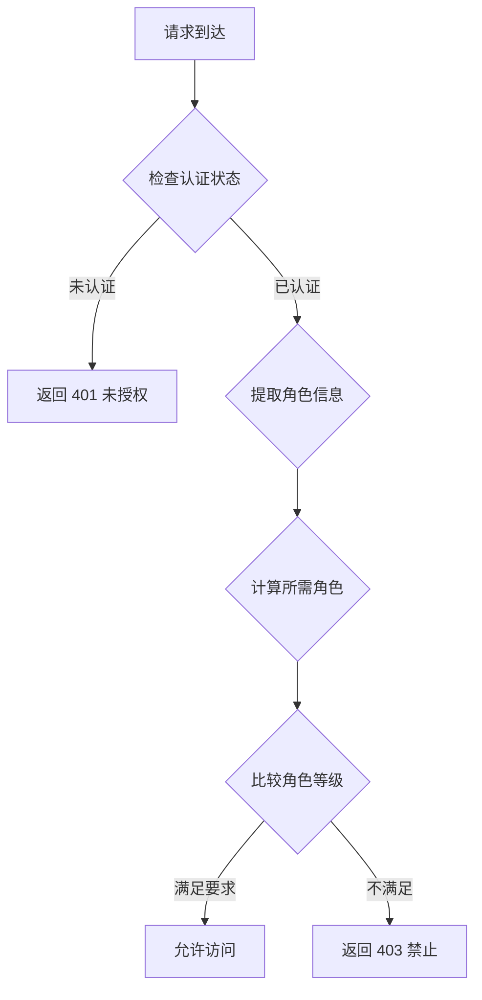
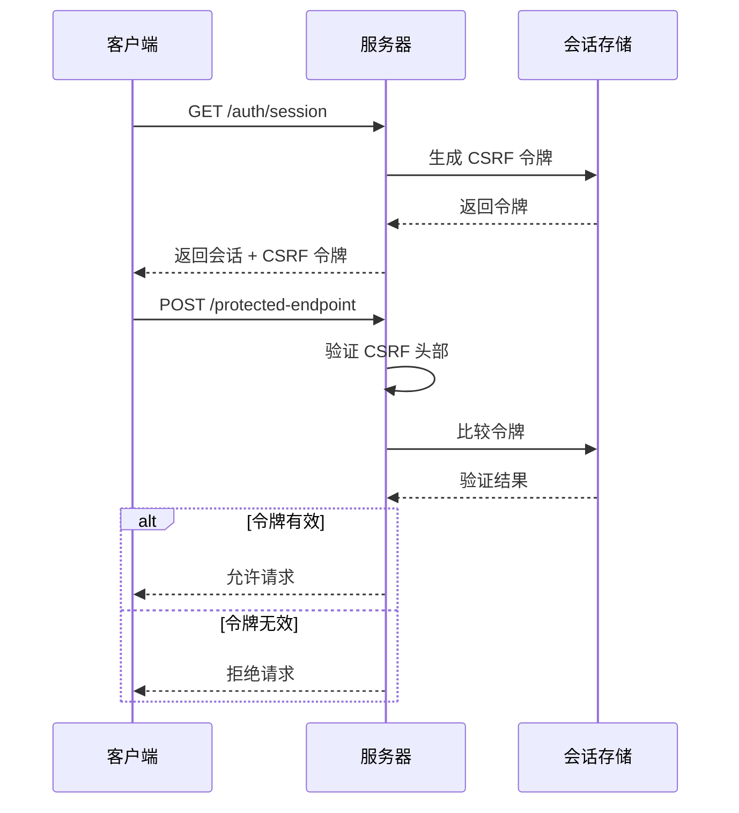
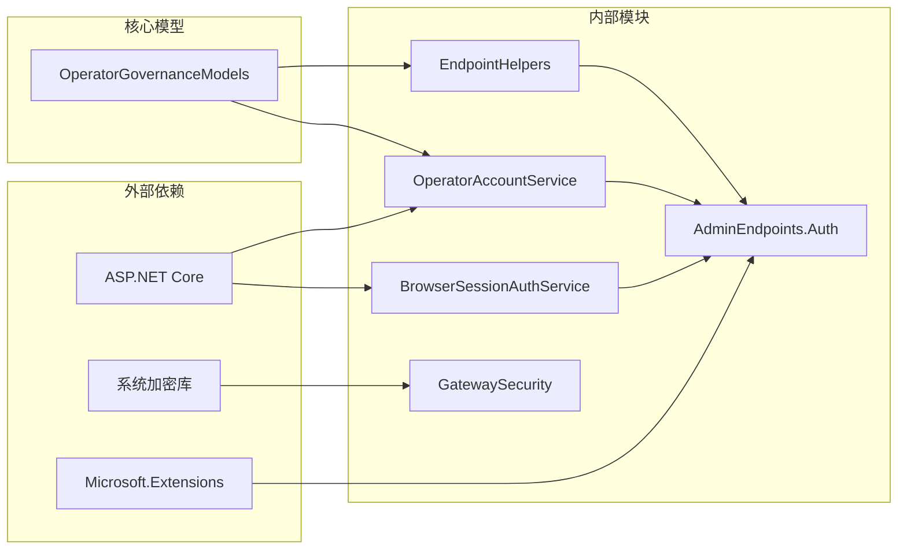

# 认证和授权服务

<cite>
**本文档引用的文件**
- [BrowserSessionAuthService.cs](file://src/OpenClaw.Gateway/BrowserSessionAuthService.cs)
- [OperatorAccountService.cs](file://src/OpenClaw.Gateway/OperatorAccountService.cs)
- [AdminEndpoints.Auth.cs](file://src/OpenClaw.Gateway/Endpoints/AdminEndpoints.Auth.cs)
- [GatewaySecurity.cs](file://src/OpenClaw.Gateway/GatewaySecurity.cs)
- [EndpointHelpers.cs](file://src/OpenClaw.Gateway/Endpoints/EndpointHelpers.cs)
- [OperatorGovernanceModels.cs](file://src/OpenClaw.Core/Models/OperatorGovernanceModels.cs)
- [ProtectedTokenStore.cs](file://src/OpenClaw.Companion/Services/ProtectedTokenStore.cs)
- [webchat.js](file://src/OpenClaw.Gateway/wwwroot/webchat.js)
- [admin.html](file://src/OpenClaw.Gateway/wwwroot/admin.html)
- [LoginDialog.razor](file://src/OpenClaw.Dashboard/Components/LoginDialog.razor)
- [GatewayAdminEndpointTests.cs](file://src/OpenClaw.Tests/GatewayAdminEndpointTests.cs)
- [BrowserSessionAuthServiceTests.cs](file://src/OpenClaw.Tests/BrowserSessionAuthServiceTests.cs)
</cite>

## 目录
1. [简介](#简介)
2. [项目结构](#项目结构)
3. [核心组件](#核心组件)
4. [架构概览](#架构概览)
5. [详细组件分析](#详细组件分析)
6. [依赖关系分析](#依赖关系分析)
7. [性能考虑](#性能考虑)
8. [故障排除指南](#故障排除指南)
9. [结论](#结论)

## 简介

认证和授权服务是 OpenClaw 系统的核心安全基础设施，负责管理操作员身份验证、会话管理和权限控制。该服务提供了多种认证模式，包括浏览器会话认证、账户令牌认证和引导令牌认证，并实现了基于角色的访问控制（RBAC）机制。

系统支持三种主要的认证模式：
- **浏览器会话认证**：基于 Cookie 的持久化会话
- **账户令牌认证**：基于生成的 API 令牌
- **引导令牌认证**：用于系统初始化的安全令牌

## 项目结构

认证和授权服务主要分布在以下模块中：



**图表来源**
- [BrowserSessionAuthService.cs:1-180](file://src/OpenClaw.Gateway/BrowserSessionAuthService.cs#L1-L180)
- [OperatorAccountService.cs:1-414](file://src/OpenClaw.Gateway/OperatorAccountService.cs#L1-L414)
- [AdminEndpoints.Auth.cs:1-399](file://src/OpenClaw.Gateway/Endpoints/AdminEndpoints.Auth.cs#L1-L399)

## 核心组件

### 浏览器会话认证服务

浏览器会话认证服务是认证系统的核心组件，负责管理基于 Cookie 的用户会话。

**关键特性：**
- 基于内存的会话存储（ConcurrentDictionary）
- 支持临时会话和持久化会话
- CSRF 保护机制
- 自动过期清理
- 多平台安全 Cookie 设置

**会话生命周期管理：**


**图表来源**
- [BrowserSessionAuthService.cs:32-107](file://src/OpenClaw.Gateway/BrowserSessionAuthService.cs#L32-L107)

### 操作员账户服务

操作员账户服务负责管理所有操作员账户信息和认证凭据。

**核心功能：**
- PBKDF2 密码哈希和盐值管理
- JWT 风格的账户令牌生成
- 令牌前缀验证机制
- 账户生命周期管理

**密码安全机制：**
- 使用 PBKDF2 算法进行密码哈希
- 16 字节随机盐值生成
- 120,000 次迭代确保安全性
- 固定时间比较防止侧信道攻击

**图表来源**
- [OperatorAccountService.cs:41-410](file://src/OpenClaw.Gateway/OperatorAccountService.cs#L41-L410)

### 认证端点服务

认证端点提供 REST API 接口来处理各种认证场景。

**主要端点：**
- `GET /auth/session` - 获取当前会话信息
- `POST /auth/session` - 创建新会话
- `DELETE /auth/session` - 注销会话
- `POST /auth/operator-token` - 交换令牌

**授权流程：**


**图表来源**
- [AdminEndpoints.Auth.cs:51-124](file://src/OpenClaw.Gateway/Endpoints/AdminEndpoints.Auth.cs#L51-L124)
- [EndpointHelpers.cs:47-131](file://src/OpenClaw.Gateway/Endpoints/EndpointHelpers.cs#L47-L131)

## 架构概览

认证和授权系统的整体架构采用分层设计，确保了安全性和可维护性。



**图表来源**
- [BrowserSessionAuthService.cs:1-180](file://src/OpenClaw.Gateway/BrowserSessionAuthService.cs#L1-L180)
- [OperatorAccountService.cs:1-414](file://src/OpenClaw.Gateway/OperatorAccountService.cs#L1-L414)

## 详细组件分析

### 角色权限控制系统

系统实现了基于角色的访问控制（RBAC），定义了三个基本角色：

**角色层次结构：**
- **Viewer（访客）**：只读访问权限
- **Operator（操作员）**：日常操作权限
- **Admin（管理员）**：完全管理权限

**角色权限映射：**


**权限验证流程：**


**图表来源**
- [OperatorGovernanceModels.cs:1-46](file://src/OpenClaw.Core/Models/OperatorGovernanceModels.cs#L1-L46)
- [EndpointHelpers.cs:242-307](file://src/OpenClaw.Gateway/Endpoints/EndpointHelpers.cs#L242-L307)

### 令牌管理系统

系统支持多种令牌类型，每种都有特定的安全特性和使用场景。

**令牌类型：**
1. **会话令牌**：基于 Cookie 的短期会话
2. **账户令牌**：长期有效的 API 令牌
3. **引导令牌**：系统初始化时的一次性令牌

**令牌安全特性：**
- **固定时间比较**：防止时序攻击
- **盐值哈希**：保护存储的敏感信息
- **前缀验证**：快速过滤无效令牌
- **过期管理**：自动清理过期令牌

**图表来源**
- [OperatorAccountService.cs:355-372](file://src/OpenClaw.Gateway/OperatorAccountService.cs#L355-L372)
- [GatewaySecurity.cs:39-49](file://src/OpenClaw.Gateway/GatewaySecurity.cs#L39-L49)

### 安全存储机制

前端和后端都实现了多层安全存储机制来保护敏感信息。

**后端安全存储：**
- **受保护的密钥存储**：Windows DPAPI、macOS Keychain、Linux Secret-tool
- **降级回退机制**：明文存储作为最后手段
- **原子文件写入**：确保数据完整性

**前端安全存储：**
- **跨平台密钥链集成**
- **本地文件存储**
- **运行时内存存储**

**图表来源**
- [ProtectedTokenStore.cs:1-120](file://src/OpenClaw.Companion/Services/ProtectedTokenStore.cs#L1-L120)

### CSRF 保护机制

系统实现了多层 CSRF（跨站请求伪造）防护机制。

**防护措施：**
- **随机 CSRF 令牌**：每次会话生成唯一令牌
- **同源验证**：检查请求来源
- **安全 Cookie 属性**：HttpOnly 和 SameSite 设置
- **请求头验证**：强制要求 CSRF 头部

**CSRF 防护流程：**


**图表来源**
- [BrowserSessionAuthService.cs:68-107](file://src/OpenClaw.Gateway/BrowserSessionAuthService.cs#L68-L107)
- [AdminEndpoints.Auth.cs:177-190](file://src/OpenClaw.Gateway/Endpoints/AdminEndpoints.Auth.cs#L177-L190)

## 依赖关系分析

认证和授权服务之间的依赖关系体现了清晰的关注点分离。



**图表来源**
- [BrowserSessionAuthService.cs:1-6](file://src/OpenClaw.Gateway/BrowserSessionAuthService.cs#L1-L6)
- [OperatorAccountService.cs:1-4](file://src/OpenClaw.Gateway/OperatorAccountService.cs#L1-L4)

**依赖分析：**
- **低耦合高内聚**：每个组件职责明确，相互依赖最小化
- **接口隔离**：通过抽象接口实现松散耦合
- **单向依赖**：认证服务依赖于会话和账户服务，但不反向依赖
- **无循环依赖**：依赖关系形成清晰的层次结构

## 性能考虑

### 会话存储优化

系统采用了高性能的并发数据结构来管理会话状态。

**性能特性：**
- **ConcurrentDictionary**：线程安全的会话存储
- **内存局部性**：会话状态紧密存储在内存中
- **批量清理**：定期清理过期会话，避免内存泄漏
- **延迟加载**：仅在需要时加载持久化数据

### 加密性能优化

为了平衡安全性与性能，系统采用了优化的加密算法实现。

**优化策略：**
- **PBKDF2 迭代次数**：120,000 次迭代提供良好安全性
- **固定时间比较**：使用 CryptographicOperations.FixedTimeEquals
- **哈希缓存**：避免重复计算相同值的哈希
- **内存安全**：及时清理敏感数据

### 缓存策略

系统实现了多层次的缓存机制来提高响应速度。

**缓存层次：**
- **会话缓存**：内存中的活跃会话
- **配置缓存**：组织策略和设置
- **令牌缓存**：最近使用的令牌验证结果

## 故障排除指南

### 常见认证问题

**问题 1：会话超时**
- **症状**：用户登录后一段时间自动登出
- **原因**：会话过期时间设置过短或长时间无活动
- **解决方案**：调整 `BrowserSessionIdleMinutes` 配置参数

**问题 2：CSRF 验证失败**
- **症状**：POST 请求被拒绝，返回 CSRF 错误
- **原因**：缺少 CSRF 头部或令牌不匹配
- **解决方案**：确保前端正确传递 CSRF 头部

**问题 3：令牌认证失败**
- **症状**：API 调用返回 401 未授权
- **原因**：令牌格式错误或已过期
- **解决方案**：重新生成令牌或检查令牌有效期

### 调试技巧

**启用详细日志：**
```csharp
// 在开发环境中启用详细认证日志
logging.AddFilter("OpenClaw.Gateway", LogLevel.Debug);
```

**会话状态检查：**
```csharp
// 检查当前会话状态
var sessionId = httpContext.Request.Cookies["openclaw_web_session"];
var hasActiveSessions = browserSessions.HasActiveSessions();
```

**图表来源**
- [BrowserSessionAuthService.cs:145-162](file://src/OpenClaw.Gateway/BrowserSessionAuthService.cs#L145-L162)
- [GatewayAdminEndpointTests.cs:68-132](file://src/OpenClaw.Tests/GatewayAdminEndpointTests.cs#L68-L132)

### 安全审计

系统提供了完整的审计日志功能，记录所有重要的安全事件。

**审计事件类型：**
- 用户登录和登出
- 权限变更操作
- 令牌创建和撤销
- 非法访问尝试

**审计日志示例：**
```json
{
  "timestamp": "2024-01-01T12:00:00Z",
  "eventType": "operator_login",
  "userId": "account:abc123",
  "ipAddress": "192.168.1.100",
  "userAgent": "Mozilla/5.0...",
  "success": true
}
```

## 结论

认证和授权服务为 OpenClaw 系统提供了全面的安全保障。通过多层认证机制、严格的权限控制和先进的安全存储技术，系统确保了操作员身份的安全验证和资源访问的严格控制。

**主要优势：**
- **多模式认证**：支持多种认证场景，满足不同需求
- **强安全保证**：采用业界标准的安全算法和防护措施
- **灵活的权限控制**：基于角色的细粒度访问控制
- **完善的审计功能**：全面的安全事件记录和监控
- **优秀的性能表现**：优化的数据结构和算法实现

**未来改进方向：**
- 实现双因素认证支持
- 增强异常检测和威胁防护
- 扩展 SSO 集成能力
- 优化大规模部署的性能

该认证系统为整个 OpenClaw 生态系统奠定了坚实的安全基础，确保了系统的可靠性和可信度。