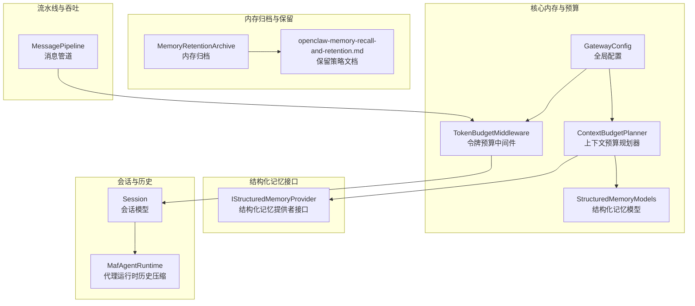
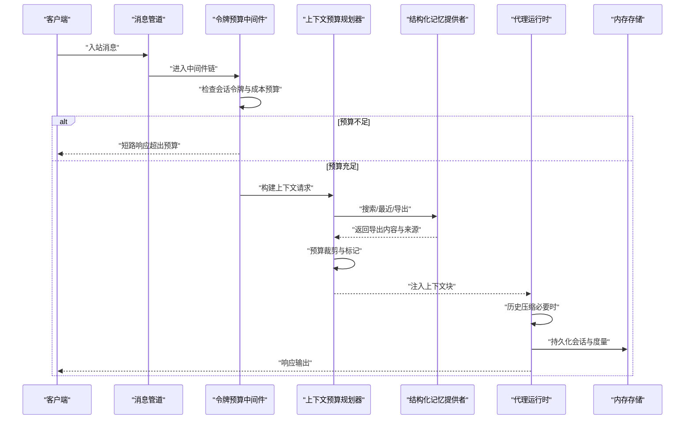
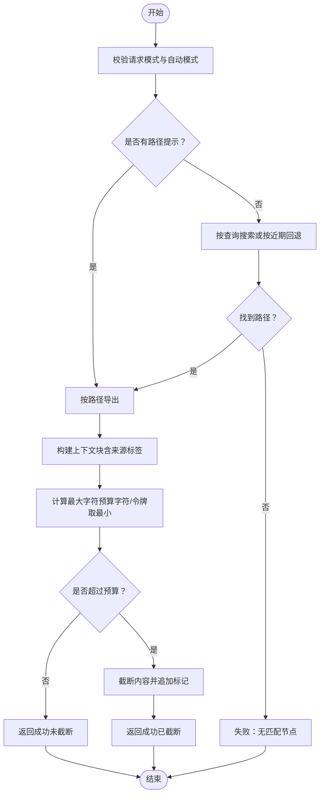
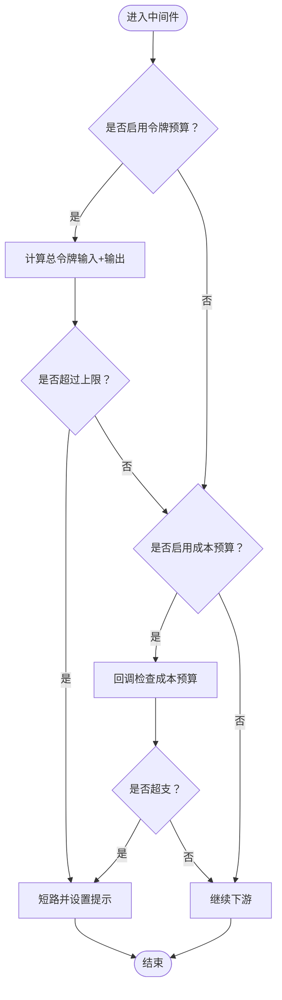
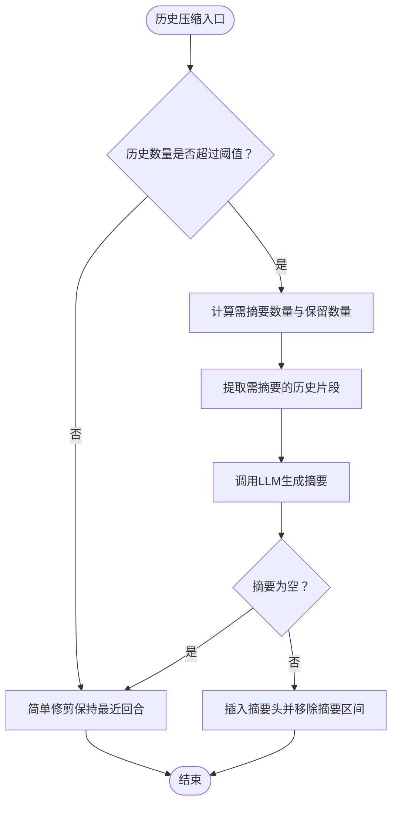
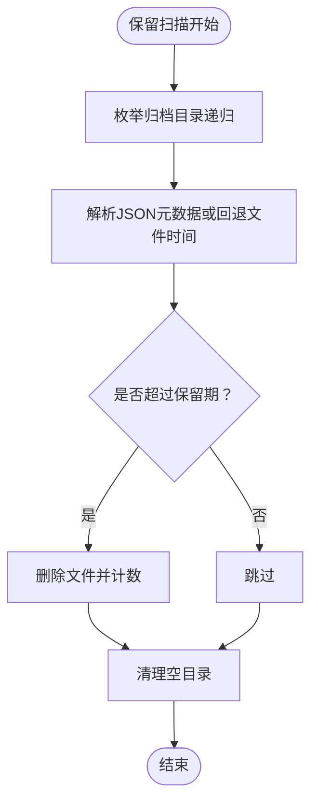
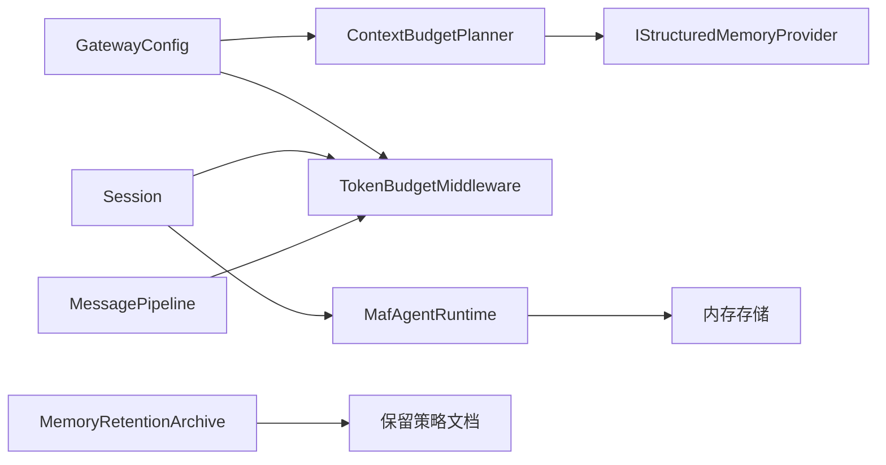

# 上下文管理

<cite>
**本文引用的文件**   
- [ContextBudgetPlanner.cs](file://src/OpenClaw.Core/Memory/ContextBudgetPlanner.cs)
- [TokenBudgetMiddleware.cs](file://src/OpenClaw.Core/Middleware/TokenBudgetMiddleware.cs)
- [GatewayConfig.cs](file://src/OpenClaw.Core/Models/GatewayConfig.cs)
- [StructuredMemoryModels.cs](file://src/OpenClaw.Core/Models/StructuredMemoryModels.cs)
- [IStructuredMemoryProvider.cs](file://src/OpenClaw.Core/Abstractions/IStructuredMemoryProvider.cs)
- [Session.cs](file://src/OpenClaw.Core/Models/Session.cs)
- [MafAgentRuntime.cs](file://src/OpenClaw.Agent/MafAgentRuntime.cs)
- [MemoryRetentionArchive.cs](file://src/OpenClaw.Core/Memory/MemoryRetentionArchive.cs)
- [MessagePipeline.cs](file://src/OpenClaw.Core/Pipeline/MessagePipeline.cs)
- [openclaw-memory-recall-and-retention.md](file://docs/openclaw-memory-recall-and-retention.md)
</cite>

## 目录
1. [引言](#引言)
2. [项目结构](#项目结构)
3. [核心组件](#核心组件)
4. [架构总览](#架构总览)
5. [详细组件分析](#详细组件分析)
6. [依赖分析](#依赖分析)
7. [性能考虑](#性能考虑)
8. [故障排查指南](#故障排查指南)
9. [结论](#结论)
10. [附录](#附录)

## 引言
本文件系统化阐述上下文管理系统的实现与设计，覆盖上下文窗口管理、消息预算规划、内容压缩策略、预算计算算法、消息优先级与重要性评估、上下文截断与摘要生成、长上下文处理与历史压缩、上下文大小优化与内存控制、配置参数与监控指标、调试方法，以及与代理推理、工具调用的集成关系与影响。

## 项目结构
上下文管理相关代码主要分布在以下模块：
- 核心内存与预算：ContextBudgetPlanner、TokenBudgetMiddleware、GatewayConfig、StructuredMemoryModels
- 结构化记忆接口：IStructuredMemoryProvider
- 会话与历史：Session、MafAgentRuntime
- 内存归档与保留：MemoryRetentionArchive、openclaw-memory-recall-and-retention.md
- 流水线与吞吐：MessagePipeline

**图表来源**
- [ContextBudgetPlanner.cs:1-167](file://src/OpenClaw.Core/Memory/ContextBudgetPlanner.cs#L1-L167)
- [TokenBudgetMiddleware.cs:1-71](file://src/OpenClaw.Core/Middleware/TokenBudgetMiddleware.cs#L1-L71)
- [GatewayConfig.cs:175-262](file://src/OpenClaw.Core/Models/GatewayConfig.cs#L175-L262)
- [StructuredMemoryModels.cs:1-134](file://src/OpenClaw.Core/Models/StructuredMemoryModels.cs#L1-L134)
- [IStructuredMemoryProvider.cs:1-15](file://src/OpenClaw.Core/Abstractions/IStructuredMemoryProvider.cs#L1-L15)
- [Session.cs:15-135](file://src/OpenClaw.Core/Models/Session.cs#L15-L135)
- [MafAgentRuntime.cs:684-764](file://src/OpenClaw.Agent/MafAgentRuntime.cs#L684-L764)
- [MemoryRetentionArchive.cs:1-218](file://src/OpenClaw.Core/Memory/MemoryRetentionArchive.cs#L1-L218)
- [openclaw-memory-recall-and-retention.md:159-237](file://docs/openclaw-memory-recall-and-retention.md#L159-L237)
- [MessagePipeline.cs:1-56](file://src/OpenClaw.Core/Pipeline/MessagePipeline.cs#L1-L56)

**章节来源**
- [ContextBudgetPlanner.cs:1-167](file://src/OpenClaw.Core/Memory/ContextBudgetPlanner.cs#L1-L167)
- [TokenBudgetMiddleware.cs:1-71](file://src/OpenClaw.Core/Middleware/TokenBudgetMiddleware.cs#L1-L71)
- [GatewayConfig.cs:175-262](file://src/OpenClaw.Core/Models/GatewayConfig.cs#L175-L262)
- [StructuredMemoryModels.cs:1-134](file://src/OpenClaw.Core/Models/StructuredMemoryModels.cs#L1-L134)
- [IStructuredMemoryProvider.cs:1-15](file://src/OpenClaw.Core/Abstractions/IStructuredMemoryProvider.cs#L1-L15)
- [Session.cs:15-135](file://src/OpenClaw.Core/Models/Session.cs#L15-L135)
- [MafAgentRuntime.cs:684-764](file://src/OpenClaw.Agent/MafAgentRuntime.cs#L684-L764)
- [MemoryRetentionArchive.cs:1-218](file://src/OpenClaw.Core/Memory/MemoryRetentionArchive.cs#L1-L218)
- [openclaw-memory-recall-and-retention.md:159-237](file://docs/openclaw-memory-recall-and-retention.md#L159-L237)
- [MessagePipeline.cs:1-56](file://src/OpenClaw.Core/Pipeline/MessagePipeline.cs#L1-L56)

## 核心组件
- 上下文预算规划器（ContextBudgetPlanner）
  - 负责根据请求模式与配置，从结构化记忆中检索、导出并构建上下文块；同时依据字符与令牌预算进行截断与标记。
- 令牌预算中间件（TokenBudgetMiddleware）
  - 在消息进入代理执行前，基于会话输入/输出令牌总量与成本预算进行准入控制，短路超限请求。
- 全局配置（GatewayConfig）
  - 提供 Fractal 记忆、会话令牌预算、成本率等上下文管理相关配置入口。
- 结构化记忆模型（StructuredMemoryModels）
  - 定义结构化记忆的查询、导出、上下文请求/结果等数据契约。
- 结构化记忆提供者接口（IStructuredMemoryProvider）
  - 抽象记忆后端能力：搜索、最近、导出、校验、索引刷新等。
- 会话模型（Session）
  - 维护会话级令牌用量、缓存读写统计、状态与分支信息，支撑预算与压缩策略。
- 代理运行时（MafAgentRuntime）
  - 实现历史压缩：当历史超过阈值时，对早期对话进行摘要以降低上下文长度。
- 内存归档（MemoryRetentionArchive）
  - 支持按日期分区归档过期数据，并清理空目录，保障长期运行的磁盘占用可控。
- 消息管道（MessagePipeline）
  - 使用有界通道承载高吞吐消息流，防止 OOM 并提供优雅关闭时的死信清理。

**章节来源**
- [ContextBudgetPlanner.cs:7-167](file://src/OpenClaw.Core/Memory/ContextBudgetPlanner.cs#L7-L167)
- [TokenBudgetMiddleware.cs:12-71](file://src/OpenClaw.Core/Middleware/TokenBudgetMiddleware.cs#L12-L71)
- [GatewayConfig.cs:53-80](file://src/OpenClaw.Core/Models/GatewayConfig.cs#L53-L80)
- [StructuredMemoryModels.cs:108-134](file://src/OpenClaw.Core/Models/StructuredMemoryModels.cs#L108-L134)
- [IStructuredMemoryProvider.cs:5-15](file://src/OpenClaw.Core/Abstractions/IStructuredMemoryProvider.cs#L5-L15)
- [Session.cs:15-135](file://src/OpenClaw.Core/Models/Session.cs#L15-L135)
- [MafAgentRuntime.cs:684-764](file://src/OpenClaw.Agent/MafAgentRuntime.cs#L684-L764)
- [MemoryRetentionArchive.cs:9-218](file://src/OpenClaw.Core/Memory/MemoryRetentionArchive.cs#L9-L218)
- [MessagePipeline.cs:11-56](file://src/OpenClaw.Core/Pipeline/MessagePipeline.cs#L11-L56)

## 架构总览
上下文管理贯穿“请求接入—预算评估—上下文构建—历史压缩—执行输出”的全链路，确保在有限上下文窗口内维持高质量交互。

**图表来源**
- [TokenBudgetMiddleware.cs:36-69](file://src/OpenClaw.Core/Middleware/TokenBudgetMiddleware.cs#L36-L69)
- [ContextBudgetPlanner.cs:19-84](file://src/OpenClaw.Core/Memory/ContextBudgetPlanner.cs#L19-L84)
- [IStructuredMemoryProvider.cs:7-15](file://src/OpenClaw.Core/Abstractions/IStructuredMemoryProvider.cs#L7-L15)
- [Session.cs:117-135](file://src/OpenClaw.Core/Models/Session.cs#L117-L135)
- [MafAgentRuntime.cs:684-764](file://src/OpenClaw.Agent/MafAgentRuntime.cs#L684-L764)

## 详细组件分析

### 上下文预算规划器（ContextBudgetPlanner）
- 功能要点
  - 模式校验：支持 off/manual/pulse/auto，自动模式受配置约束。
  - 路径解析：优先使用路径提示；否则按查询命中或近期节点回退。
  - 导出与上下文块：调用提供者导出，组装带来源标签的上下文块。
  - 预算裁剪：按字符与令牌上限取最小值，超过则截断并在末尾追加标记。
- 关键算法
  - 最大字符预算计算：min(请求MaxChars, 请求MaxTokens*估算, 配置MaxChars, 配置MaxTokens*估算)
  - 截断策略：保留标记长度的空间，不足时仅截断标记；否则截断内容并追加标记。
- 数据结构
  - StructuredMemoryContextRequest/Result、StructuredMemoryExportResult、StructuredMemorySourceRef

**图表来源**
- [ContextBudgetPlanner.cs:19-148](file://src/OpenClaw.Core/Memory/ContextBudgetPlanner.cs#L19-L148)

**章节来源**
- [ContextBudgetPlanner.cs:7-167](file://src/OpenClaw.Core/Memory/ContextBudgetPlanner.cs#L7-L167)
- [StructuredMemoryModels.cs:108-134](file://src/OpenClaw.Core/Models/StructuredMemoryModels.cs#L108-L134)
- [IStructuredMemoryProvider.cs:7-15](file://src/OpenClaw.Core/Abstractions/IStructuredMemoryProvider.cs#L7-L15)

### 令牌预算中间件（TokenBudgetMiddleware）
- 功能要点
  - 会话级令牌预算：输入+输出达到上限即短路。
  - 成本预算：可选回调按通道/发送方维度检查 USD 预算。
  - 可观测性：记录警告日志与用户友好提示。
- 复杂度
  - O(1) 检查，无额外分配。

**图表来源**
- [TokenBudgetMiddleware.cs:36-69](file://src/OpenClaw.Core/Middleware/TokenBudgetMiddleware.cs#L36-L69)

**章节来源**
- [TokenBudgetMiddleware.cs:12-71](file://src/OpenClaw.Core/Middleware/TokenBudgetMiddleware.cs#L12-L71)
- [GatewayConfig.cs:53-80](file://src/OpenClaw.Core/Models/GatewayConfig.cs#L53-L80)
- [Session.cs:117-135](file://src/OpenClaw.Core/Models/Session.cs#L117-L135)

### 会话与历史压缩（Session + MafAgentRuntime）
- 会话模型
  - 维护 TotalInputTokens/TotalOutputTokens/TotalCacheReadTokens/TotalCacheWriteTokens 等计数器，支持并发安全读写。
- 历史压缩
  - 当历史数量超过阈值时，对早期回合进行摘要，保留最近若干回合与摘要头，减少上下文长度。
  - 摘要失败时回退到简单修剪，保证稳定性。

**图表来源**
- [MafAgentRuntime.cs:684-764](file://src/OpenClaw.Agent/MafAgentRuntime.cs#L684-L764)
- [Session.cs:117-135](file://src/OpenClaw.Core/Models/Session.cs#L117-L135)

**章节来源**
- [Session.cs:15-135](file://src/OpenClaw.Core/Models/Session.cs#L15-L135)
- [MafAgentRuntime.cs:684-764](file://src/OpenClaw.Agent/MafAgentRuntime.cs#L684-L764)

### 内存归档与保留（MemoryRetentionArchive + 文档）
- 归档策略
  - 按日期分区（年/月/日/类型），文件名包含哈希与时间戳，便于追踪与清理。
  - 支持过期清理：基于 sweep 时间或文件最后写入时间判断是否删除。
- 运行状态与可观测性
  - 文档定义了保留配置项、归档格式、DryRun 模式与运行时指标。

**图表来源**
- [MemoryRetentionArchive.cs:79-166](file://src/OpenClaw.Core/Memory/MemoryRetentionArchive.cs#L79-L166)

**章节来源**
- [MemoryRetentionArchive.cs:9-218](file://src/OpenClaw.Core/Memory/MemoryRetentionArchive.cs#L9-L218)
- [openclaw-memory-recall-and-retention.md:159-237](file://docs/openclaw-memory-recall-and-retention.md#L159-L237)

## 依赖分析
- ContextBudgetPlanner 依赖 IStructuredMemoryProvider 与 GatewayConfig 的 Fractal 配置，负责上下文构建与预算裁剪。
- TokenBudgetMiddleware 依赖 Session 的令牌计数与 GatewayConfig 的会话预算与成本率配置。
- MafAgentRuntime 依赖会话历史与 LLM 执行服务，实现历史压缩。
- MemoryRetentionArchive 与文档共同定义保留策略与归档格式。
- MessagePipeline 为上游中间件与下游执行提供背压与吞吐保障。

**图表来源**
- [GatewayConfig.cs:175-262](file://src/OpenClaw.Core/Models/GatewayConfig.cs#L175-L262)
- [ContextBudgetPlanner.cs:10-17](file://src/OpenClaw.Core/Memory/ContextBudgetPlanner.cs#L10-L17)
- [TokenBudgetMiddleware.cs:14-34](file://src/OpenClaw.Core/Middleware/TokenBudgetMiddleware.cs#L14-L34)
- [Session.cs:15-135](file://src/OpenClaw.Core/Models/Session.cs#L15-L135)
- [MafAgentRuntime.cs:684-764](file://src/OpenClaw.Agent/MafAgentRuntime.cs#L684-L764)
- [MemoryRetentionArchive.cs:1-218](file://src/OpenClaw.Core/Memory/MemoryRetentionArchive.cs#L1-L218)
- [openclaw-memory-recall-and-retention.md:159-237](file://docs/openclaw-memory-recall-and-retention.md#L159-L237)
- [MessagePipeline.cs:11-56](file://src/OpenClaw.Core/Pipeline/MessagePipeline.cs#L11-L56)

**章节来源**
- [GatewayConfig.cs:175-262](file://src/OpenClaw.Core/Models/GatewayConfig.cs#L175-L262)
- [ContextBudgetPlanner.cs:10-17](file://src/OpenClaw.Core/Memory/ContextBudgetPlanner.cs#L10-L17)
- [TokenBudgetMiddleware.cs:14-34](file://src/OpenClaw.Core/Middleware/TokenBudgetMiddleware.cs#L14-L34)
- [Session.cs:15-135](file://src/OpenClaw.Core/Models/Session.cs#L15-L135)
- [MafAgentRuntime.cs:684-764](file://src/OpenClaw.Agent/MafAgentRuntime.cs#L684-L764)
- [MemoryRetentionArchive.cs:1-218](file://src/OpenClaw.Core/Memory/MemoryRetentionArchive.cs#L1-L218)
- [openclaw-memory-recall-and-retention.md:159-237](file://docs/openclaw-memory-recall-and-retention.md#L159-L237)
- [MessagePipeline.cs:11-56](file://src/OpenClaw.Core/Pipeline/MessagePipeline.cs#L11-L56)

## 性能考虑
- 预算计算
  - 字符与令牌预算取最小值，避免超限；令牌预算通过估算系数转换，兼顾不同模型 token/char 比例差异。
- 中间件短路
  - 令牌与成本预算检查为 O(1)，尽早拒绝超限请求，降低后续开销。
- 历史压缩
  - 仅在超过阈值时触发摘要，保留最近回合以维持上下文连贯性；失败回退至修剪，保证稳定性。
- 管道背压
  - 有界通道防止突发流量导致 OOM；优雅关闭时清理死信，避免资源泄漏。
- 归档清理
  - 按日期分区与哈希命名，支持高效枚举与删除；空目录清理降低存储碎片。

[本节为通用指导，无需列出具体文件来源]

## 故障排查指南
- 上下文构建失败
  - 检查 Fractal 记忆开关与自动模式配置；确认路径提示或查询命中；查看导出结果与来源列表。
- 预算超限
  - 查看会话输入/输出令牌计数与会话预算；如启用成本预算，核对通道/发送方维度的成本限额。
- 历史压缩异常
  - 观察摘要生成是否为空或抛错；关注阈值与保留回合配置；必要时临时禁用压缩验证问题。
- 保留扫描异常
  - 检查保留开关、归档路径与保留天数；确认 DryRun 模式下的预期行为；查看错误计数与消息。

**章节来源**
- [ContextBudgetPlanner.cs:23-40](file://src/OpenClaw.Core/Memory/ContextBudgetPlanner.cs#L23-L40)
- [TokenBudgetMiddleware.cs:36-69](file://src/OpenClaw.Core/Middleware/TokenBudgetMiddleware.cs#L36-L69)
- [MafAgentRuntime.cs:684-764](file://src/OpenClaw.Agent/MafAgentRuntime.cs#L684-L764)
- [openclaw-memory-recall-and-retention.md:159-237](file://docs/openclaw-memory-recall-and-retention.md#L159-L237)

## 结论
该上下文管理系统通过“预算前置—上下文裁剪—历史摘要—保留归档—背压保护”的多层策略，在有限上下文窗口内实现了稳定、可扩展且可观测的会话管理。结合配置与监控指标，可在不同部署场景下平衡性能、成本与可用性。

[本节为总结性内容，无需列出具体文件来源]

## 附录

### 配置参数与监控指标
- Fractal 记忆配置（示例字段）
  - Enabled、AutoContextMode、MaxContextChars、MaxContextTokens、DefaultExportMode、DefaultDepth
- 会话预算与成本
  - SessionTokenBudget、EnableEstimatedTokenAdmissionControl、TokenCostRates、TokenCostRateDetails
- 回收与保留
  - EnableCompaction、CompactionThreshold、CompactionKeepRecent、Retention.*（Enabled、RunOnStartup、SweepIntervalMinutes、SessionTtlDays、BranchTtlDays、ArchiveEnabled、ArchivePath、ArchiveRetentionDays、MaxItemsPerSweep）

**章节来源**
- [GatewayConfig.cs:175-262](file://src/OpenClaw.Core/Models/GatewayConfig.cs#L175-L262)
- [GatewayConfig.cs:203-214](file://src/OpenClaw.Core/Models/GatewayConfig.cs#L203-L214)
- [openclaw-memory-recall-and-retention.md:159-237](file://docs/openclaw-memory-recall-and-retention.md#L159-L237)

### 调试方法
- 开启中间件日志：观察令牌与成本超限告警。
- 检查会话计数：核对 TotalInputTokens/TotalOutputTokens/TotalCacheReadTokens/TotalCacheWriteTokens。
- 验证上下文块：确认上下文长度与来源标签是否符合预期。
- 保留扫描 DryRun：在生产环境前预演清理效果与影响范围。

**章节来源**
- [TokenBudgetMiddleware.cs:44-65](file://src/OpenClaw.Core/Middleware/TokenBudgetMiddleware.cs#L44-L65)
- [Session.cs:64-90](file://src/OpenClaw.Core/Models/Session.cs#L64-L90)
- [ContextBudgetPlanner.cs:105-135](file://src/OpenClaw.Core/Memory/ContextBudgetPlanner.cs#L105-L135)
- [openclaw-memory-recall-and-retention.md:177-179](file://docs/openclaw-memory-recall-and-retention.md#L177-L179)