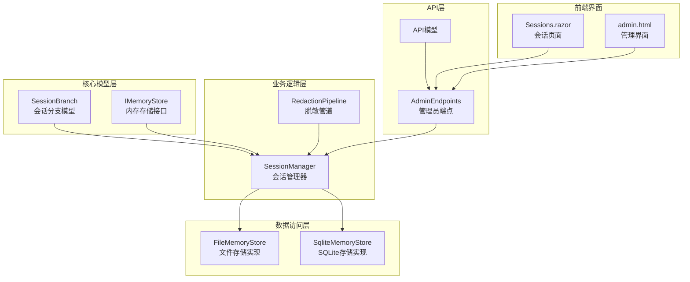
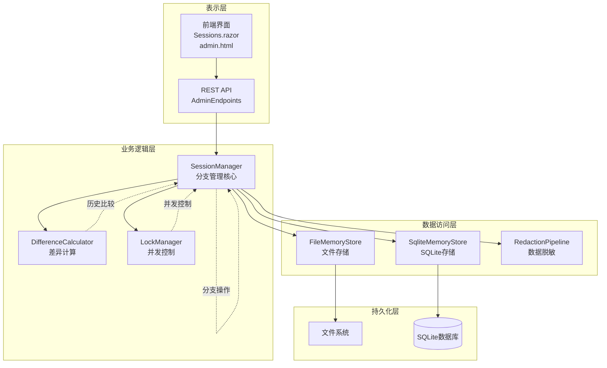
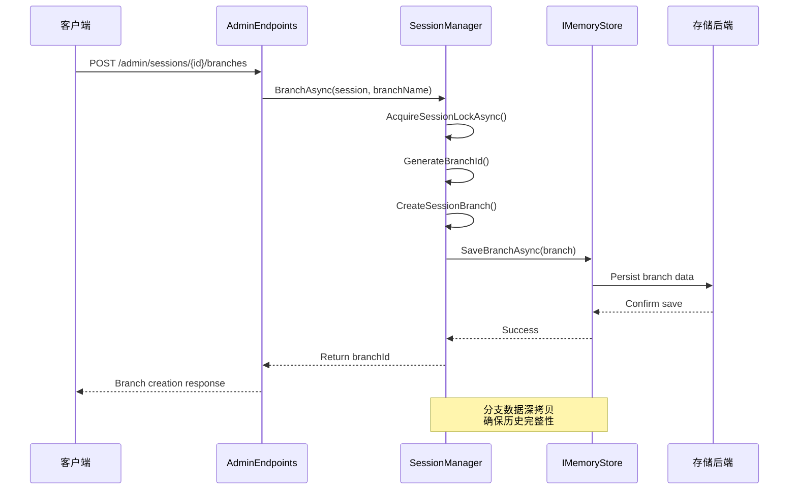
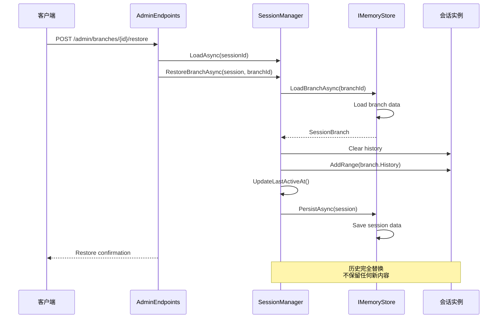
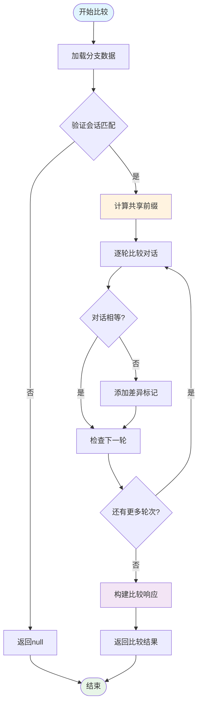
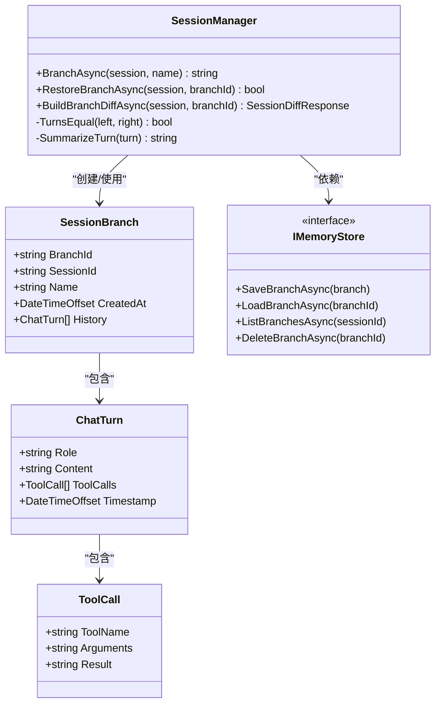
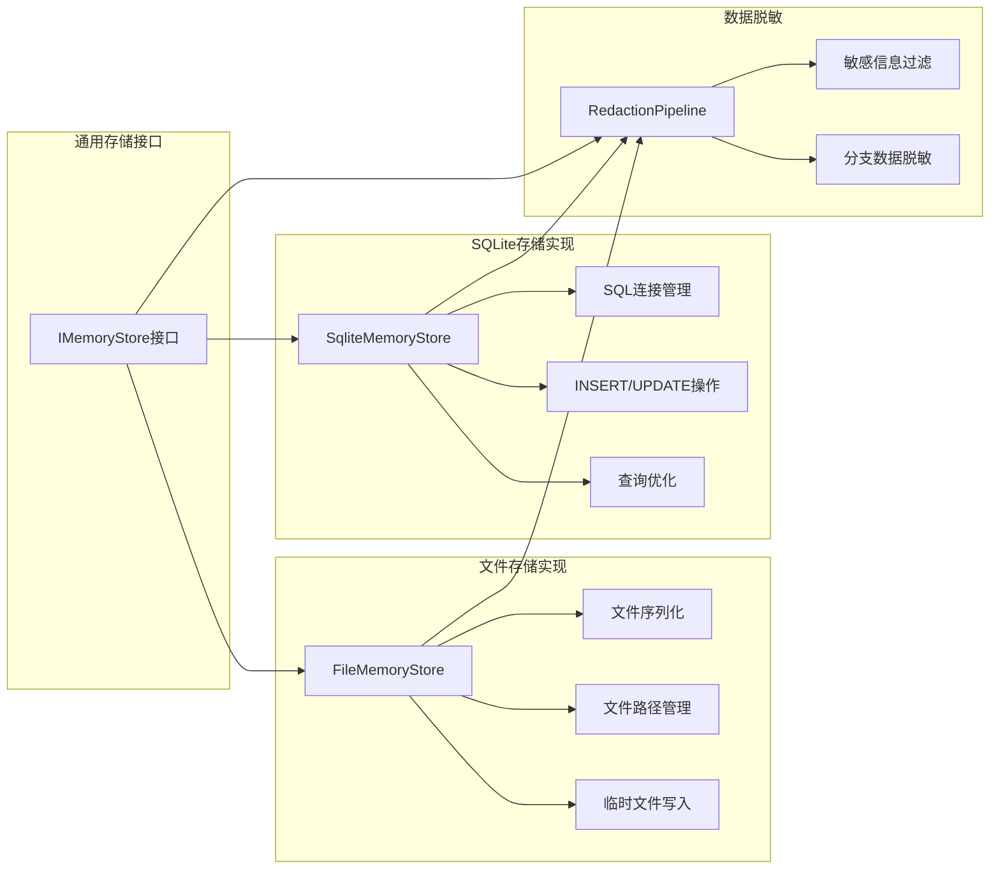
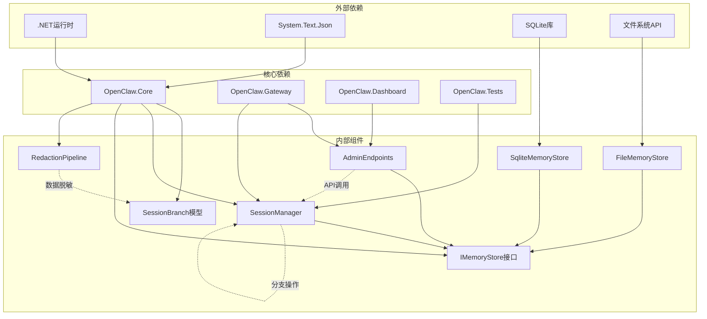

# 会话分支管理

<cite>
**本文档引用的文件**
- [SessionBranch.cs](file://src/OpenClaw.Core/Models/SessionBranch.cs)
- [IMemoryStore.cs](file://src/OpenClaw.Core/Abstractions/IMemoryStore.cs)
- [SessionManager.cs](file://src/OpenClaw.Core/Sessions/SessionManager.cs)
- [AdminEndpoints.Sessions.cs](file://src/OpenClaw.Gateway/Endpoints/AdminEndpoints.Sessions.cs)
- [AdminApiModels.cs](file://src/OpenClaw.Core/Models/AdminApiModels.cs)
- [OperatorApiModels.cs](file://src/OpenClaw.Core/Models/OperatorApiModels.cs)
- [FileMemoryStore.cs](file://src/OpenClaw.Core/Memory/FileMemoryStore.cs)
- [SqliteMemoryStore.cs](file://src/OpenClaw.Core/Memory/SqliteMemoryStore.cs)
- [RedactionPipeline.cs](file://src/OpenClaw.Core/Security/RedactionPipeline.cs)
- [Sessions.razor](file://src/OpenClaw.Dashboard/Pages/Sessions.razor)
- [admin.html](file://src/OpenClaw.Gateway/wwwroot/admin.html)
- [BeyondBaseTests.cs](file://src/OpenClaw.Tests/BeyondBaseTests.cs)
</cite>

## 目录
1. [简介](#简介)
2. [项目结构](#项目结构)
3. [核心组件](#核心组件)
4. [架构概览](#架构概览)
5. [详细组件分析](#详细组件分析)
6. [依赖关系分析](#依赖关系分析)
7. [性能考虑](#性能考虑)
8. [故障排除指南](#故障排除指南)
9. [结论](#结论)
10. [附录](#附录)

## 简介

会话分支管理系统是Kingcrab项目中一个关键的功能模块，它允许用户在对话过程中创建分支快照，探索不同的对话路径，并能够随时恢复到之前的分支状态。该系统支持分支创建、快照保存、历史恢复和分支比较等功能，为会话恢复、A/B实验和版本控制提供了强大的技术支持。

系统采用分层架构设计，通过接口抽象实现了存储后端的可插拔性，支持文件系统和SQLite两种存储方式。所有分支数据都经过敏感信息脱敏处理，确保数据安全性和隐私保护。

## 项目结构

会话分支管理系统主要分布在以下目录结构中：

**图表来源**
- [SessionBranch.cs:8-15](file://src/OpenClaw.Core/Models/SessionBranch.cs#L8-L15)
- [IMemoryStore.cs:9-23](file://src/OpenClaw.Core/Abstractions/IMemoryStore.cs#L9-L23)
- [SessionManager.cs:13-36](file://src/OpenClaw.Core/Sessions/SessionManager.cs#L13-L36)

**章节来源**
- [SessionBranch.cs:1-16](file://src/OpenClaw.Core/Models/SessionBranch.cs#L1-L16)
- [IMemoryStore.cs:1-24](file://src/OpenClaw.Core/Abstractions/IMemoryStore.cs#L1-L24)
- [SessionManager.cs:1-624](file://src/OpenClaw.Core/Sessions/SessionManager.cs#L1-L624)

## 核心组件

### 会话分支模型

会话分支是对话历史在特定时间点的快照，包含完整的对话上下文和元数据信息。

**分支数据结构特性：**
- 唯一标识符：基于会话ID、分支名称和时间戳生成
- 元数据：包含创建时间、分支名称等信息
- 历史记录：完整复制当前会话的历史记录
- 时间戳：精确到UTC的创建时间

### 存储接口抽象

IMemoryStore接口定义了分支管理所需的核心存储操作，支持多种存储后端的统一访问。

**核心操作方法：**
- SaveBranchAsync：保存分支到存储
- LoadBranchAsync：从存储加载分支
- ListBranchesAsync：列出指定会话的所有分支
- DeleteBranchAsync：删除指定分支

### 会话管理器

SessionManager是分支管理的核心协调者，负责分支的创建、恢复、比较和生命周期管理。

**主要功能：**
- 分支创建：生成唯一分支ID并保存分支快照
- 历史恢复：将分支历史应用到当前会话
- 差异比较：计算分支与当前会话的差异
- 并发控制：通过锁机制确保线程安全
- 内存优化：管理活跃会话的内存使用

**章节来源**
- [SessionBranch.cs:8-15](file://src/OpenClaw.Core/Models/SessionBranch.cs#L8-L15)
- [IMemoryStore.cs:18-22](file://src/OpenClaw.Core/Abstractions/IMemoryStore.cs#L18-L22)
- [SessionManager.cs:174-250](file://src/OpenClaw.Core/Sessions/SessionManager.cs#L174-L250)

## 架构概览

会话分支管理系统的整体架构采用分层设计，确保了功能的模块化和可扩展性。

**图表来源**
- [SessionManager.cs:13-36](file://src/OpenClaw.Core/Sessions/SessionManager.cs#L13-L36)
- [AdminEndpoints.Sessions.cs:270-437](file://src/OpenClaw.Gateway/Endpoints/AdminEndpoints.Sessions.cs#L270-L437)
- [FileMemoryStore.cs:457-508](file://src/OpenClaw.Core/Memory/FileMemoryStore.cs#L457-L508)

系统采用事件驱动的架构模式，通过异步操作和后台任务处理来优化性能。SessionManager内部维护了活跃会话的并发字典，确保高并发场景下的稳定性。

## 详细组件分析

### 分支创建流程

分支创建是会话分支管理的核心功能，涉及多个步骤的数据处理和验证。

**图表来源**
- [SessionManager.cs:180-195](file://src/OpenClaw.Core/Sessions/SessionManager.cs#L180-L195)
- [IMemoryStore.cs:19](file://src/OpenClaw.Core/Abstractions/IMemoryStore.cs#L19)

**分支命名规则：**
分支ID采用复合命名格式：`{sessionId}:branch:{branchName}:{timestamp}`

**唯一标识生成：**
- 基于会话ID确保分支归属正确
- 包含分支名称便于人类识别
- 使用时间戳确保全局唯一性
- 采用UTC时间避免时区问题

**章节来源**
- [SessionManager.cs:180-195](file://src/OpenClaw.Core/Sessions/SessionManager.cs#L180-L195)
- [BeyondBaseTests.cs:71-91](file://src/OpenClaw.Tests/BeyondBaseTests.cs#L71-L91)

### 历史恢复机制

历史恢复功能允许用户将会话状态恢复到之前保存的分支点，实现真正的"时光倒流"效果。

**图表来源**
- [SessionManager.cs:200-214](file://src/OpenClaw.Core/Sessions/SessionManager.cs#L200-L214)
- [AdminEndpoints.Sessions.cs:285-327](file://src/OpenClaw.Gateway/Endpoints/AdminEndpoints.Sessions.cs#L285-L327)

**恢复策略：**
- 完全替换：清空当前历史并用分支历史填充
- 原子操作：确保恢复过程的原子性
- 版本控制：支持多分支并存和选择性恢复

**章节来源**
- [SessionManager.cs:200-214](file://src/OpenClaw.Core/Sessions/SessionManager.cs#L200-L214)
- [AdminEndpoints.Sessions.cs:285-327](file://src/OpenClaw.Gateway/Endpoints/AdminEndpoints.Sessions.cs#L285-L327)

### 分支比较算法

分支比较功能用于分析当前会话与指定分支之间的差异，帮助用户理解不同分支的发展轨迹。

**图表来源**
- [SessionManager.cs:222-250](file://src/OpenClaw.Core/Sessions/SessionManager.cs#L222-L250)

**差异检测算法：**
- 共享前缀识别：从头开始比较直到发现第一个不匹配
- 深度比较：对工具调用进行深度属性比较
- 性能优化：使用ReferenceEquals快速判断同一对象
- 内容摘要：生成简洁的差异摘要信息

**章节来源**
- [SessionManager.cs:222-250](file://src/OpenClaw.Core/Sessions/SessionManager.cs#L222-L250)
- [OperatorApiModels.cs:610-621](file://src/OpenClaw.Core/Models/OperatorApiModels.cs#L610-L621)

### 数据结构与深拷贝机制

系统采用深拷贝策略确保分支数据的独立性和完整性。

**图表来源**
- [SessionBranch.cs:8-15](file://src/OpenClaw.Core/Models/SessionBranch.cs#L8-L15)
- [SessionManager.cs:180-250](file://src/OpenClaw.Core/Sessions/SessionManager.cs#L180-L250)

**深拷贝实现：**
- 历史列表复制：使用ToList()创建新的列表实例
- 工具调用深拷贝：逐个复制工具调用对象
- 字符串不可变性：利用字符串的不可变特性简化复制
- 内存优化：避免不必要的对象创建

**章节来源**
- [SessionManager.cs:189](file://src/OpenClaw.Core/Sessions/SessionManager.cs#L189)
- [SessionManager.cs:361-387](file://src/OpenClaw.Core/Sessions/SessionManager.cs#L361-L387)

### 存储后端实现

系统支持多种存储后端，包括文件系统和SQLite数据库，满足不同部署环境的需求。

**图表来源**
- [FileMemoryStore.cs:457-508](file://src/OpenClaw.Core/Memory/FileMemoryStore.cs#L457-L508)
- [SqliteMemoryStore.cs:557-586](file://src/OpenClaw.Core/Memory/SqliteMemoryStore.cs#L557-L586)
- [RedactionPipeline.cs:79-93](file://src/OpenClaw.Core/Security/RedactionPipeline.cs#L79-L93)

**存储优化策略：**
- 文件存储：使用临时文件写入确保原子性
- SQLite存储：支持事务和索引优化查询性能
- 数据脱敏：自动过滤敏感信息防止泄露
- 内存映射：大文件读取使用内存映射提高效率

**章节来源**
- [FileMemoryStore.cs:457-508](file://src/OpenClaw.Core/Memory/FileMemoryStore.cs#L457-L508)
- [SqliteMemoryStore.cs:557-586](file://src/OpenClaw.Core/Memory/SqliteMemoryStore.cs#L557-L586)
- [RedactionPipeline.cs:79-93](file://src/OpenClaw.Core/Security/RedactionPipeline.cs#L79-L93)

## 依赖关系分析

会话分支管理系统具有清晰的依赖层次结构，各组件之间的耦合度较低，便于维护和扩展。

**图表来源**
- [SessionManager.cs:1-624](file://src/OpenClaw.Core/Sessions/SessionManager.cs#L1-L624)
- [AdminEndpoints.Sessions.cs:270-437](file://src/OpenClaw.Gateway/Endpoints/AdminEndpoints.Sessions.cs#L270-L437)

**依赖管理：**
- 接口抽象：通过IMemoryStore实现存储后端解耦
- 异步编程：广泛使用async/await模式提升性能
- 错误处理：统一的异常处理和日志记录机制
- 测试覆盖：完整的单元测试和集成测试

**章节来源**
- [SessionManager.cs:1-624](file://src/OpenClaw.Core/Sessions/SessionManager.cs#L1-L624)
- [AdminEndpoints.Sessions.cs:270-437](file://src/OpenClaw.Gateway/Endpoints/AdminEndpoints.Sessions.cs#L270-L437)

## 性能考虑

会话分支管理系统在设计时充分考虑了性能优化，采用了多种策略来确保系统的高效运行。

### 内存管理优化

系统采用多种内存优化策略来减少内存占用和提升性能：

- **活跃会话限制**：通过MaxConcurrentSessions参数限制同时活跃的会话数量
- **过期会话清理**：定期扫描和移除超时的会话实例
- **LRU驱逐策略**：当达到容量上限时，移除最久未使用的会话
- **后台持久化**：使用后台任务异步保存会话状态，避免阻塞主线程

### 并发控制机制

为了确保多线程环境下的数据一致性，系统实现了完善的并发控制：

- **会话级锁**：每个会话都有独立的信号量锁
- **自旋锁优化**：使用SpinLock减少锁竞争开销
- **锁清理机制**：定期清理孤儿锁，防止内存泄漏
- **异步等待**：支持异步锁获取，避免阻塞线程

### 存储性能优化

针对不同存储后端，系统实现了相应的性能优化策略：

- **文件存储**：使用临时文件写入确保原子性，减少磁盘碎片
- **SQLite存储**：支持事务批量操作，使用索引加速查询
- **数据压缩**：对大文本内容进行压缩存储
- **缓存策略**：对频繁访问的数据建立缓存层

## 故障排除指南

### 常见问题诊断

**分支创建失败**
- 检查会话ID是否有效
- 验证分支名称是否符合命名规则
- 确认存储空间是否充足
- 查看日志文件获取详细错误信息

**历史恢复异常**
- 确认分支ID格式是否正确
- 验证分支所属会话是否匹配
- 检查分支数据是否损坏
- 确认会话锁状态正常

**存储连接问题**
- 检查文件权限设置
- 验证数据库连接字符串
- 确认网络连接状态
- 查看存储后端服务状态

### 调试工具和方法

系统提供了多种调试工具来帮助诊断问题：

- **日志分析**：详细的结构化日志记录
- **性能监控**：实时监控系统性能指标
- **状态检查**：检查会话和分支的当前状态
- **数据验证**：验证存储数据的完整性和一致性

**章节来源**
- [SessionManager.cs:147-172](file://src/OpenClaw.Core/Sessions/SessionManager.cs#L147-L172)
- [BeyondBaseTests.cs:94-103](file://src/OpenClaw.Tests/BeyondBaseTests.cs#L94-L103)

## 结论

会话分支管理系统是一个设计精良、功能完备的分布式系统，它成功地解决了对话历史管理和版本控制的核心问题。系统采用分层架构设计，通过接口抽象实现了高度的模块化和可扩展性。

**主要优势：**
- **功能完整性**：涵盖了分支创建、保存、恢复和比较的完整生命周期
- **架构优雅**：清晰的分层设计和依赖注入机制
- **性能优秀**：多种优化策略确保系统的高效运行
- **安全性强**：内置数据脱敏和访问控制机制
- **可扩展性好**：支持多种存储后端和部署模式

**应用场景：**
- **会话恢复**：意外中断后的对话恢复
- **A/B实验**：对比不同对话策略的效果
- **版本控制**：管理对话历史的多个版本
- **审计追踪**：记录所有对话变更历史
- **智能客服**：支持多路径对话探索

该系统为Kingcrab项目提供了强大的会话管理能力，是构建高级AI对话系统的重要基础设施。

## 附录

### API接口规范

系统提供了完整的REST API接口来支持分支管理操作：

**分支管理接口：**
- `POST /admin/sessions/{id}/branches` - 创建分支
- `POST /admin/branches/{id}/restore` - 恢复分支
- `GET /admin/sessions/{id}/branches` - 列出分支
- `GET /admin/sessions/{id}/diff` - 比较分支差异

**会话管理接口：**
- `GET /admin/sessions/{id}` - 获取会话详情
- `POST /admin/sessions/{id}/metadata` - 更新会话元数据
- `GET /admin/sessions/export` - 导出会话数据

### 最佳实践建议

**分支命名规范：**
- 使用描述性的分支名称
- 避免使用特殊字符和空格
- 建议使用日期时间前缀
- 保持命名风格一致

**性能优化建议：**
- 合理设置最大并发会话数
- 定期清理过期分支数据
- 使用适当的存储后端
- 监控系统性能指标

**安全注意事项：**
- 定期备份重要分支数据
- 实施访问控制和审计日志
- 使用加密存储敏感数据
- 定期审查权限配置