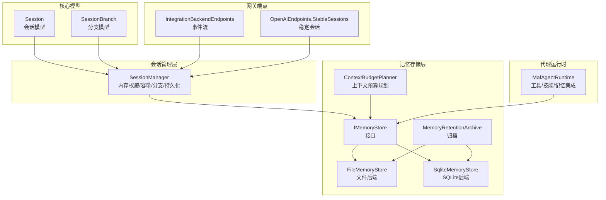
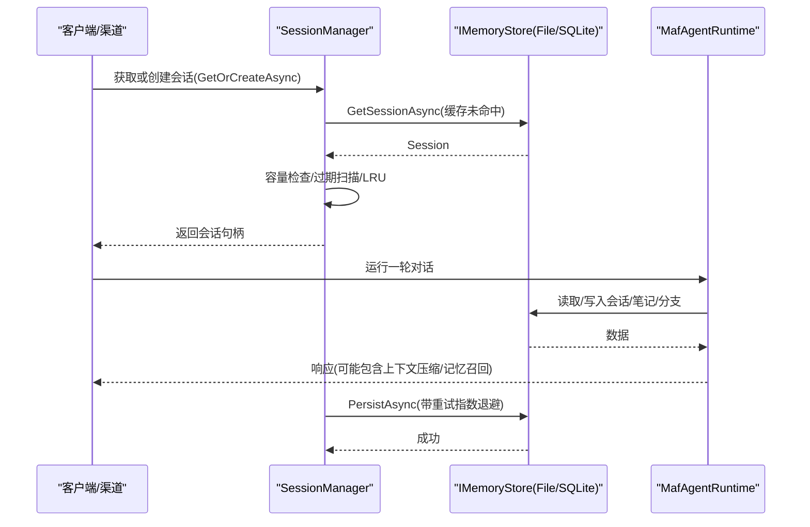
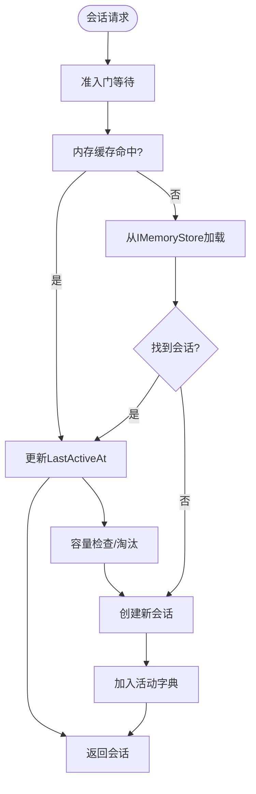
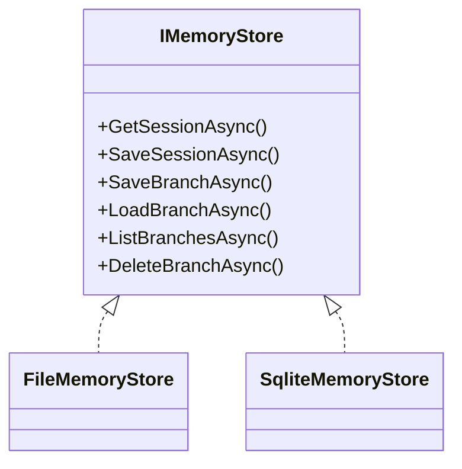
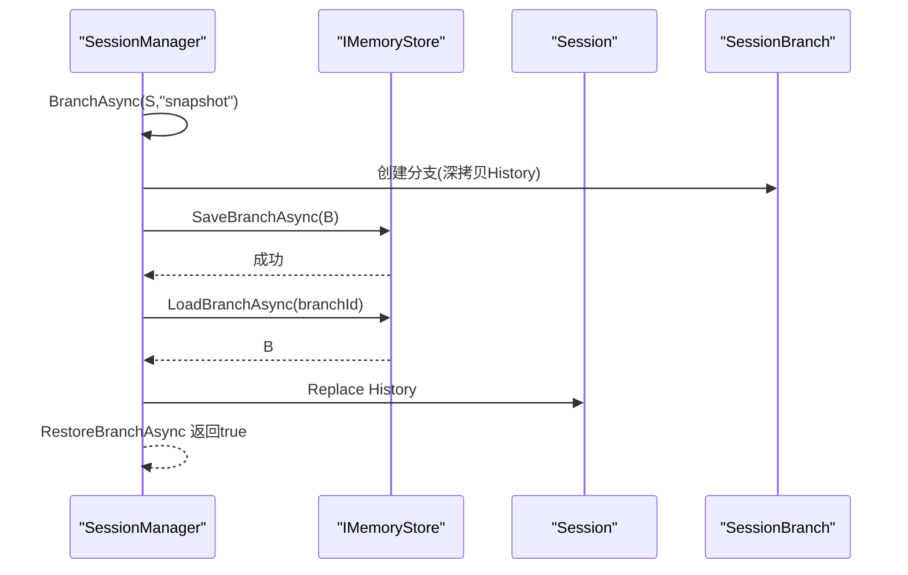
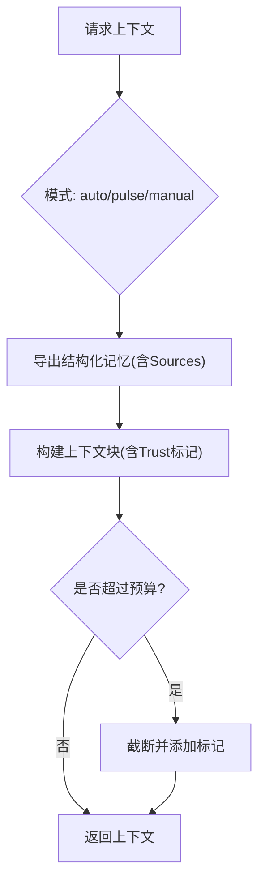
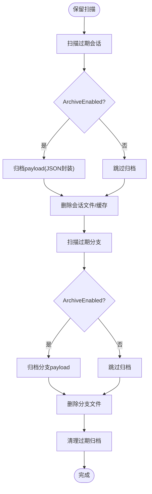
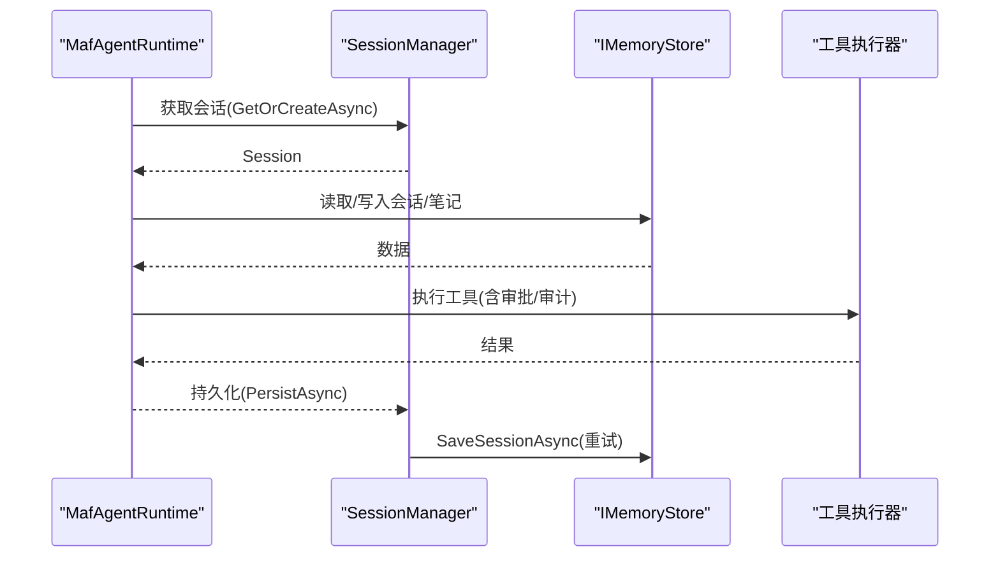
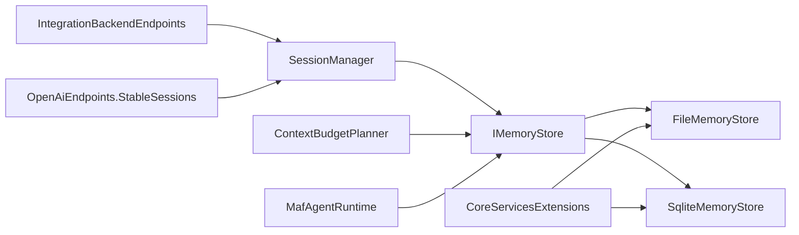

# 会话和记忆管理

<cite>
**本文引用的文件**
- [Session.cs](file://src/OpenClaw.Core/Models/Session.cs)
- [SessionBranch.cs](file://src/OpenClaw.Core/Models/SessionBranch.cs)
- [SessionManager.cs](file://src/OpenClaw.Core/Sessions/SessionManager.cs)
- [IMemoryStore.cs](file://src/OpenClaw.Core/Abstractions/IMemoryStore.cs)
- [IMemoryRetentionStore.cs](file://src/OpenClaw.Core/Abstractions/IMemoryRetentionStore.cs)
- [FileMemoryStore.cs](file://src/OpenClaw.Core/Memory/FileMemoryStore.cs)
- [SqliteMemoryStore.cs](file://src/OpenClaw.Core/Memory/SqliteMemoryStore.cs)
- [ContextBudgetPlanner.cs](file://src/OpenClaw.Core/Memory/ContextBudgetPlanner.cs)
- [MemoryRetentionArchive.cs](file://src/OpenClaw.Core/Memory/MemoryRetentionArchive.cs)
- [MafAgentRuntime.cs](file://src/OpenClaw.Agent/MafAgentRuntime.cs)
- [OpenClaw-Session-Management.md](file://docs/OpenClaw-Session-Management.md)
- [openclaw-memory-recall-and-retention.md](file://docs/openclaw-memory-recall-and-retention.md)
- [IntegrationBackendEndpoints.cs](file://src/OpenClaw.Gateway/Endpoints/IntegrationBackendEndpoints.cs)
- [OpenAiEndpoints.StableSessions.cs](file://src/OpenClaw.Gateway/Endpoints/OpenAiEndpoints.StableSessions.cs)
- [CoreServicesExtensions.cs](file://src/OpenClaw.Gateway/Composition/CoreServicesExtensions.cs)
</cite>

## 目录
1. [简介](#简介)
2. [项目结构](#项目结构)
3. [核心组件](#核心组件)
4. [架构总览](#架构总览)
5. [详细组件分析](#详细组件分析)
6. [依赖关系分析](#依赖关系分析)
7. [性能考量](#性能考量)
8. [故障排查指南](#故障排查指南)
9. [结论](#结论)
10. [附录](#附录)

## 简介
本技术文档围绕会话与记忆管理系统，系统阐述会话生命周期管理、记忆存储设计、上下文管理与数据持久化机制，深入说明会话状态跟踪、历史记录保存、分支管理等核心功能，并文档化文件存储与 SQLite 存储后端的实现细节、配置选项与性能特性。此外，涵盖记忆检索、上下文压缩、长期记忆等高级功能，给出数据模型设计、索引策略、备份恢复机制，提供配置指南、性能调优建议与监控方法，并解释与代理运行时、工具执行的集成关系。

## 项目结构
会话与记忆管理横跨核心模型层、会话管理层、记忆存储层与代理运行时层，辅以文档化的配置与运维指南。关键模块如下：
- 会话模型与分支：Session、SessionBranch
- 会话管理：SessionManager（内存权威、容量控制、分支、持久化）
- 记忆存储接口与实现：IMemoryStore、FileMemoryStore、SqliteMemoryStore
- 上下文规划：ContextBudgetPlanner（Fractal Memory）
- 备份归档：MemoryRetentionArchive
- 代理运行时：MafAgentRuntime（与会话/记忆交互）
- 网关端点：稳定会话绑定、事件流
- 文档：会话管理与记忆召回保留指南

**图表来源**
- [Session.cs:15-135](file://src/OpenClaw.Core/Models/Session.cs#L15-L135)
- [SessionBranch.cs:8-15](file://src/OpenClaw.Core/Models/SessionBranch.cs#L8-L15)
- [SessionManager.cs:13-36](file://src/OpenClaw.Core/Sessions/SessionManager.cs#L13-L36)
- [IMemoryStore.cs:9-23](file://src/OpenClaw.Core/Abstractions/IMemoryStore.cs#L9-L23)
- [FileMemoryStore.cs:32-76](file://src/OpenClaw.Core/Memory/FileMemoryStore.cs#L32-L76)
- [SqliteMemoryStore.cs:12-44](file://src/OpenClaw.Core/Memory/SqliteMemoryStore.cs#L12-L44)
- [ContextBudgetPlanner.cs:7-17](file://src/OpenClaw.Core/Memory/ContextBudgetPlanner.cs#L7-L17)
- [MemoryRetentionArchive.cs:7-21](file://src/OpenClaw.Core/Memory/MemoryRetentionArchive.cs#L7-L21)
- [MafAgentRuntime.cs:17-118](file://src/OpenClaw.Agent/MafAgentRuntime.cs#L17-L118)
- [IntegrationBackendEndpoints.cs:160-195](file://src/OpenClaw.Gateway/Endpoints/IntegrationBackendEndpoints.cs#L160-L195)
- [OpenAiEndpoints.StableSessions.cs:36-74](file://src/OpenClaw.Gateway/Endpoints/OpenAiEndpoints.StableSessions.cs#L36-L74)

**章节来源**
- [OpenClaw-Session-Management.md:1-278](file://docs/OpenClaw-Session-Management.md#L1-L278)
- [openclaw-memory-recall-and-retention.md:1-242](file://docs/openclaw-memory-recall-and-retention.md#L1-L242)

## 核心组件
- 会话模型（Session）：承载会话标识、渠道/发送者、历史轮次、状态、令牌用量、合同策略、委托元数据等，支持零拷贝序列化。
- 会话分支（SessionBranch）：对会话历史在某时刻的快照，支持分支创建、恢复与差异分析。
- 会话管理器（SessionManager）：内存权威，负责会话创建/加载、容量控制（过期扫描/LRU）、分支、持久化（带重试指数退避）、按会话锁、孤儿锁清理。
- 记忆存储接口（IMemoryStore）：统一的会话/笔记/分支持久化契约。
- 文件存储（FileMemoryStore）：JSON 文件（URL 安全 Base64 文件名）、.key 辅助文件、64 条带并发、损坏隔离、原子写入。
- SQLite 存储（SqliteMemoryStore）：WAL 模式、FTS5 全文检索、可选向量嵌入、触发器同步、并发写入。
- 上下文预算规划（ContextBudgetPlanner）：基于 Fractal Memory 的自动上下文构建与截断。
- 归档（MemoryRetentionArchive）：按日期分区的 JSON 归档与过期清理。
- 代理运行时（MafAgentRuntime）：与会话/记忆/工具/技能集成，支持记忆召回、上下文压缩、令牌预算与合约跟踪。

**章节来源**
- [Session.cs:15-135](file://src/OpenClaw.Core/Models/Session.cs#L15-L135)
- [SessionBranch.cs:8-15](file://src/OpenClaw.Core/Models/SessionBranch.cs#L8-L15)
- [SessionManager.cs:13-36](file://src/OpenClaw.Core/Sessions/SessionManager.cs#L13-L36)
- [IMemoryStore.cs:9-23](file://src/OpenClaw.Core/Abstractions/IMemoryStore.cs#L9-L23)
- [FileMemoryStore.cs:32-76](file://src/OpenClaw.Core/Memory/FileMemoryStore.cs#L32-L76)
- [SqliteMemoryStore.cs:12-44](file://src/OpenClaw.Core/Memory/SqliteMemoryStore.cs#L12-L44)
- [ContextBudgetPlanner.cs:7-17](file://src/OpenClaw.Core/Memory/ContextBudgetPlanner.cs#L7-L17)
- [MemoryRetentionArchive.cs:7-21](file://src/OpenClaw.Core/Memory/MemoryRetentionArchive.cs#L7-L21)
- [MafAgentRuntime.cs:17-118](file://src/OpenClaw.Agent/MafAgentRuntime.cs#L17-L118)

## 架构总览
会话与记忆系统以 SessionManager 为核心协调器，连接代理运行时与记忆存储后端。会话在内存中热缓存，按需从 IMemoryStore 后端加载/保存；分支与历史记录通过 IMemoryStore 统一持久化；上下文预算规划器在需要时从结构化记忆导出并压缩注入到提示词中；SQLite 后端提供 FTS5 与可选向量检索，文件后端提供简单可靠与高并发条带化。

**图表来源**
- [SessionManager.cs:45-130](file://src/OpenClaw.Core/Sessions/SessionManager.cs#L45-L130)
- [IMemoryStore.cs:11-23](file://src/OpenClaw.Core/Abstractions/IMemoryStore.cs#L11-L23)
- [MafAgentRuntime.cs:17-118](file://src/OpenClaw.Agent/MafAgentRuntime.cs#L17-L118)

## 详细组件分析

### 会话生命周期管理
- 创建与键解析：支持确定性键（channelId:senderId）与显式键（定时任务/Webhook/子 Agent），统一准入门（并发度 1）与双重检查锁定，避免缓存命中时的串行化。
- 容量与淘汰：过期扫描（空闲超时）与 LRU 淘汰（最近最少活动），超出上限抛出异常并计数指标。
- 持久化：带三次重试的指数退避（100ms→200ms→400ms），支持 sessionLockHeld 优化避免重复加锁。
- 按会话锁：AcquireSessionLockAsync 返回租约，定期 CleanupSessionLocksOnce 清理孤儿信号量。
- 过期与后台持久化：SweepExpiredActiveSessions 将过期会话标记为 Expired 并尽力后台持久化。

**图表来源**
- [SessionManager.cs:45-130](file://src/OpenClaw.Core/Sessions/SessionManager.cs#L45-L130)
- [SessionManager.cs:338-359](file://src/OpenClaw.Core/Sessions/SessionManager.cs#L338-L359)

**章节来源**
- [SessionManager.cs:13-36](file://src/OpenClaw.Core/Sessions/SessionManager.cs#L13-L36)
- [SessionManager.cs:45-130](file://src/OpenClaw.Core/Sessions/SessionManager.cs#L45-L130)
- [SessionManager.cs:338-359](file://src/OpenClaw.Core/Sessions/SessionManager.cs#L338-L359)
- [OpenClaw-Session-Management.md:27-80](file://docs/OpenClaw-Session-Management.md#L27-L80)

### 记忆存储设计与后端
- IMemoryStore 接口：统一的会话/笔记/分支 CRUD 与分支管理。
- FileMemoryStore：
  - JSON 文件（URL 安全 Base64 文件名），.key 辅助文件保存原始键，防止路径遍历。
  - 64 条带信号量分段并发加载，原子写入（.tmp→覆盖），损坏隔离（.corrupt-*）。
  - 笔记搜索：内存 TF 索引（时间衰减加权），支持前缀过滤与评分。
- SqliteMemoryStore：
  - WAL 模式 + synchronous=NORMAL，PRAGMA foreign_keys=ON。
  - FTS5 虚拟表 notes_fts、session_turns_fts，触发器自动同步。
  - 可选向量嵌入（余弦相似度）与 BM25 混合评分，零拷贝存储 float[]。
  - 会话/分支/笔记表与索引，支持高效查询与归档。

**图表来源**
- [IMemoryStore.cs:9-23](file://src/OpenClaw.Core/Abstractions/IMemoryStore.cs#L9-L23)
- [FileMemoryStore.cs:32-76](file://src/OpenClaw.Core/Memory/FileMemoryStore.cs#L32-L76)
- [SqliteMemoryStore.cs:12-44](file://src/OpenClaw.Core/Memory/SqliteMemoryStore.cs#L12-L44)

**章节来源**
- [IMemoryStore.cs:9-23](file://src/OpenClaw.Core/Abstractions/IMemoryStore.cs#L9-L23)
- [FileMemoryStore.cs:32-76](file://src/OpenClaw.Core/Memory/FileMemoryStore.cs#L32-L76)
- [SqliteMemoryStore.cs:54-148](file://src/OpenClaw.Core/Memory/SqliteMemoryStore.cs#L54-L148)
- [openclaw-memory-recall-and-retention.md:25-64](file://docs/openclaw-memory-recall-and-retention.md#L25-L64)

### 分支管理与历史记录保存
- 分支创建：BranchAsync 深拷贝历史，生成确定性分支 ID，保存到 IMemoryStore。
- 分支恢复：RestoreBranchAsync 原子替换历史，更新 LastActiveAt。
- 差异分析：BuildBranchDiffAsync 计算共享前缀与两侧差异摘要，便于展示。
- 分支列表：ListBranchesAsync 透传到存储层。

**图表来源**
- [SessionManager.cs:180-220](file://src/OpenClaw.Core/Sessions/SessionManager.cs#L180-L220)
- [SessionBranch.cs:8-15](file://src/OpenClaw.Core/Models/SessionBranch.cs#L8-L15)

**章节来源**
- [SessionManager.cs:174-250](file://src/OpenClaw.Core/Sessions/SessionManager.cs#L174-L250)
- [SessionBranch.cs:8-15](file://src/OpenClaw.Core/Models/SessionBranch.cs#L8-L15)
- [OpenClaw-Session-Management.md:83-98](file://docs/OpenClaw-Session-Management.md#L83-L98)

### 上下文管理与记忆检索
- 上下文预算规划（ContextBudgetPlanner）：
  - 根据 Fractal Memory 配置，自动/脉冲模式构建上下文块，限制字符与令牌预算，必要时截断。
  - 支持基于查询/最近内容的最佳路径解析与导出。
- 记忆召回（自动）：
  - 项目作用域优先（project:{projectId}: 前缀），全局回退；每轮注入最大笔记数与字符预算。
  - 注入为“用户角色”消息，明确不可信数据，仅作参考。
- 记忆工具：
  - memory/memory_get/memory_search/project_memory 等工具，支持键值读写、关键字搜索与项目作用域管理。

**图表来源**
- [ContextBudgetPlanner.cs:19-84](file://src/OpenClaw.Core/Memory/ContextBudgetPlanner.cs#L19-L84)
- [openclaw-memory-recall-and-retention.md:67-112](file://docs/openclaw-memory-recall-and-retention.md#L67-L112)

**章节来源**
- [ContextBudgetPlanner.cs:7-167](file://src/OpenClaw.Core/Memory/ContextBudgetPlanner.cs#L7-L167)
- [openclaw-memory-recall-and-retention.md:67-135](file://docs/openclaw-memory-recall-and-retention.md#L67-L135)

### 长期记忆与保留策略
- 保留扫描（RetentionSweep）：
  - 扫描过期会话与分支，支持 DryRun 预览，可选归档（ArchiveEnabled）。
  - 归档按日期分区（yyyy/MM/dd/kind/），文件名包含哈希与时间戳。
- 归档清理（PurgeExpiredArchives）：
  - 基于 sweptAtUtc 或最后写入时间判断过期，批量删除并清理空目录。
- 统计与可观测性：
  - RetentionSweepResult/RetentionStoreStats 暴露扫描结果与后端统计。

**图表来源**
- [FileMemoryStore.cs:570-623](file://src/OpenClaw.Core/Memory/FileMemoryStore.cs#L570-L623)
- [SqliteMemoryStore.cs:654-732](file://src/OpenClaw.Core/Memory/SqliteMemoryStore.cs#L654-L732)
- [MemoryRetentionArchive.cs:9-77](file://src/OpenClaw.Core/Memory/MemoryRetentionArchive.cs#L9-L77)

**章节来源**
- [FileMemoryStore.cs:570-623](file://src/OpenClaw.Core/Memory/FileMemoryStore.cs#L570-L623)
- [SqliteMemoryStore.cs:654-732](file://src/OpenClaw.Core/Memory/SqliteMemoryStore.cs#L654-L732)
- [MemoryRetentionArchive.cs:79-166](file://src/OpenClaw.Core/Memory/MemoryRetentionArchive.cs#L79-L166)
- [openclaw-memory-recall-and-retention.md:137-180](file://docs/openclaw-memory-recall-and-retention.md#L137-L180)

### 与代理运行时、工具执行的集成
- MafAgentRuntime：
  - 与 SessionManager 协作，读取/写入会话历史，应用工具与技能，支持记忆召回与上下文压缩。
  - 令牌预算与合约跟踪（ContractBaseline/Usage），与会话模型中的计数器联动。
- 工具执行：
  - 通过 OpenClawToolExecutor 执行工具，结合工具审批、审计日志与沙箱策略。
- 稳定会话与事件流：
  - 稳定会话头绑定（StableSessionBinding），事件通过 SSE/WS 流式推送。

**图表来源**
- [MafAgentRuntime.cs:17-118](file://src/OpenClaw.Agent/MafAgentRuntime.cs#L17-L118)
- [SessionManager.cs:132-172](file://src/OpenClaw.Core/Sessions/SessionManager.cs#L132-L172)
- [IntegrationBackendEndpoints.cs:175-195](file://src/OpenClaw.Gateway/Endpoints/IntegrationBackendEndpoints.cs#L175-L195)
- [OpenAiEndpoints.StableSessions.cs:36-74](file://src/OpenClaw.Gateway/Endpoints/OpenAiEndpoints.StableSessions.cs#L36-L74)

**章节来源**
- [MafAgentRuntime.cs:17-118](file://src/OpenClaw.Agent/MafAgentRuntime.cs#L17-L118)
- [IntegrationBackendEndpoints.cs:160-195](file://src/OpenClaw.Gateway/Endpoints/IntegrationBackendEndpoints.cs#L160-L195)
- [OpenAiEndpoints.StableSessions.cs:36-74](file://src/OpenClaw.Gateway/Endpoints/OpenAiEndpoints.StableSessions.cs#L36-L74)

## 依赖关系分析
- 耦合与内聚：
  - SessionManager 与 IMemoryStore 解耦，通过接口抽象支持多种后端。
  - FileMemoryStore/SqliteMemoryStore 实现相同接口，便于切换。
  - ContextBudgetPlanner 依赖 IStructuredMemoryProvider 与 GatewayConfig，独立于具体存储。
- 外部依赖：
  - SQLite 后端依赖 Microsoft.Data.Sqlite 与 FTS5。
  - 文件后端依赖 JSON 序列化与文件系统。
- 集成点：
  - 网关端点通过 SessionManager 与存储交互，提供事件流与稳定会话绑定。
  - 服务注册根据配置选择 File/SQLite 特征存储实现。

**图表来源**
- [SessionManager.cs:13-36](file://src/OpenClaw.Core/Sessions/SessionManager.cs#L13-L36)
- [IMemoryStore.cs:9-23](file://src/OpenClaw.Core/Abstractions/IMemoryStore.cs#L9-L23)
- [FileMemoryStore.cs:32-76](file://src/OpenClaw.Core/Memory/FileMemoryStore.cs#L32-L76)
- [SqliteMemoryStore.cs:12-44](file://src/OpenClaw.Core/Memory/SqliteMemoryStore.cs#L12-L44)
- [ContextBudgetPlanner.cs:7-17](file://src/OpenClaw.Core/Memory/ContextBudgetPlanner.cs#L7-L17)
- [MafAgentRuntime.cs:17-118](file://src/OpenClaw.Agent/MafAgentRuntime.cs#L17-L118)
- [IntegrationBackendEndpoints.cs:160-195](file://src/OpenClaw.Gateway/Endpoints/IntegrationBackendEndpoints.cs#L160-L195)
- [OpenAiEndpoints.StableSessions.cs:36-74](file://src/OpenClaw.Gateway/Endpoints/OpenAiEndpoints.StableSessions.cs#L36-L74)
- [CoreServicesExtensions.cs:263-282](file://src/OpenClaw.Gateway/Composition/CoreServicesExtensions.cs#L263-L282)

**章节来源**
- [CoreServicesExtensions.cs:263-282](file://src/OpenClaw.Gateway/Composition/CoreServicesExtensions.cs#L263-L282)

## 性能考量
- 并发与锁：
  - SessionManager 的准入门（并发度 1）与按会话锁分离，避免热点竞争。
  - FileMemoryStore 使用 64 条带信号量分段并发加载，降低争用。
- 持久化：
  - SessionManager 指数退避重试（100ms/200ms/400ms），减少瞬时冲突。
  - SQLite 使用 WAL + NORMAL 同步，提升写入吞吐；FTS5 触发器同步注意写放大。
- 搜索与索引：
  - SQLite FTS5 + 向量嵌入混合评分，BM25 权重 40%、余弦 60%；无嵌入则降级 BM25。
  - 文件后端内存 TF 索引，支持前缀过滤与评分。
- 缓存与淘汰：
  - 内存会话缓存命中率高；过期扫描与 LRU 淘汰在高并发场景建议评估 PriorityQueue 优化。
- 事件流：
  - BackendSessionEventStreamStore 有界 Channel（容量 64，丢弃最旧），注意客户端订阅与背压。

[本节为通用性能指导，不直接分析具体文件]

## 故障排查指南
- 会话加载失败：
  - FileMemoryStore：损坏文件会被隔离为 .corrupt-*，查看 QuarantineCorruptSessionFile 抛出的 MemoryStoreCorruptionException。
  - SQLite：抛出 MemoryStoreCorruptionException 并记录错误日志。
- 持久化失败：
  - SessionManager PersistAsync 会重试三次并记录警告/错误日志，检查磁盘权限与 IO。
- 分支恢复失败：
  - RestoreBranchAsync 返回 false 通常表示分支不存在或不属于当前会话，检查 branchId 与 SessionId。
- 归档问题：
  - PurgeExpiredArchives 返回错误计数与消息列表，检查目录权限与 JSON 解析异常。
- 事件流异常：
  - IntegrationBackendEndpoints 中的事件流打开/关闭与 SSE 注释，确认订阅与 afterSequence 参数。

**章节来源**
- [FileMemoryStore.cs:191-223](file://src/OpenClaw.Core/Memory/FileMemoryStore.cs#L191-L223)
- [SqliteMemoryStore.cs:170-178](file://src/OpenClaw.Core/Memory/SqliteMemoryStore.cs#L170-L178)
- [SessionManager.cs:132-172](file://src/OpenClaw.Core/Sessions/SessionManager.cs#L132-L172)
- [SessionManager.cs:200-214](file://src/OpenClaw.Core/Sessions/SessionManager.cs#L200-L214)
- [MemoryRetentionArchive.cs:79-166](file://src/OpenClaw.Core/Memory/MemoryRetentionArchive.cs#L79-L166)
- [IntegrationBackendEndpoints.cs:175-195](file://src/OpenClaw.Gateway/Endpoints/IntegrationBackendEndpoints.cs#L175-L195)

## 结论
会话与记忆管理系统通过清晰的接口抽象与多后端实现，实现了高可用、可扩展的会话生命周期管理与记忆持久化。SessionManager 作为内存权威，结合 IMemoryStore 的文件/SQLite 后端，满足从本地优先到富查询场景的需求。上下文预算规划与记忆召回机制增强了长期知识利用能力，保留与归档策略保障了数据生命周期管理。与代理运行时、工具执行与网关端点的紧密集成，使得系统在复杂工作负载下仍保持一致的用户体验与可观测性。

[本节为总结性内容，不直接分析具体文件]

## 附录

### 配置参考（节选）
- 会话管理：
  - SessionTimeoutMinutes：空闲过期分钟数
  - MaxConcurrentSessions：并发会话上限（0 为无限制）
- 记忆存储：
  - memory.provider：sqlite 或 file
  - memory.sqlite.*：SQLite 路径、FTS、向量嵌入配置
  - memory.storagePath：文件后端存储路径
- 记忆召回：
  - memory.recall.enabled/maxNotes/maxChars：自动召回开关与预算
- 保留策略：
  - memory.retention.*：启用、启动扫描、间隔、TTL、归档路径与保留天数、每轮最大项数

**章节来源**
- [OpenClaw-Session-Management.md:231-240](file://docs/OpenClaw-Session-Management.md#L231-L240)
- [openclaw-memory-recall-and-retention.md:197-234](file://docs/openclaw-memory-recall-and-retention.md#L197-L234)