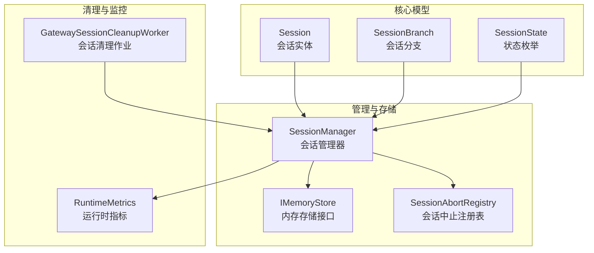
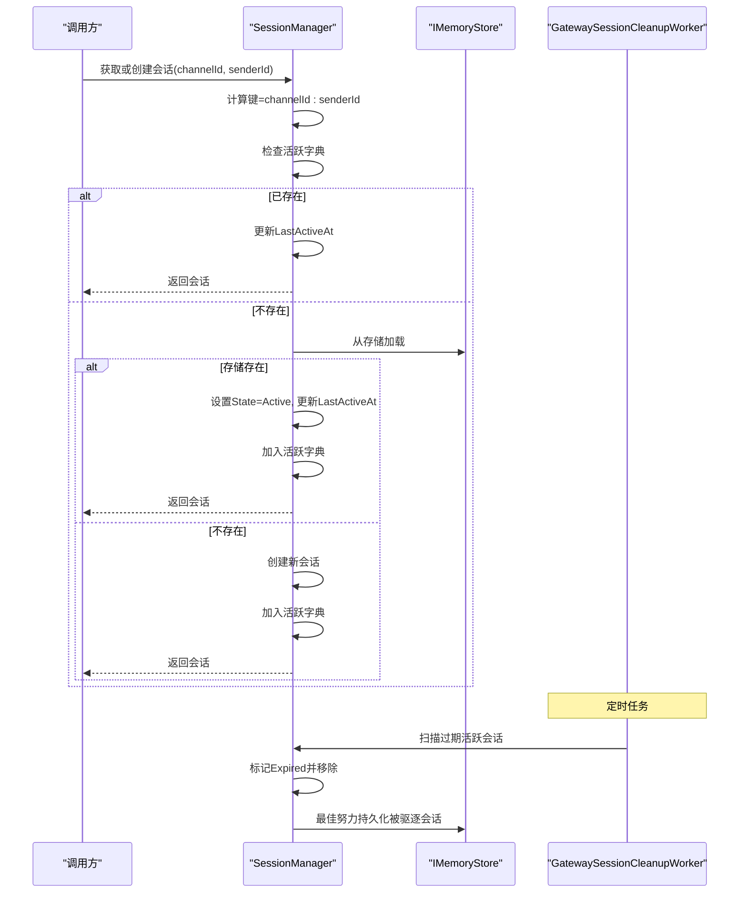
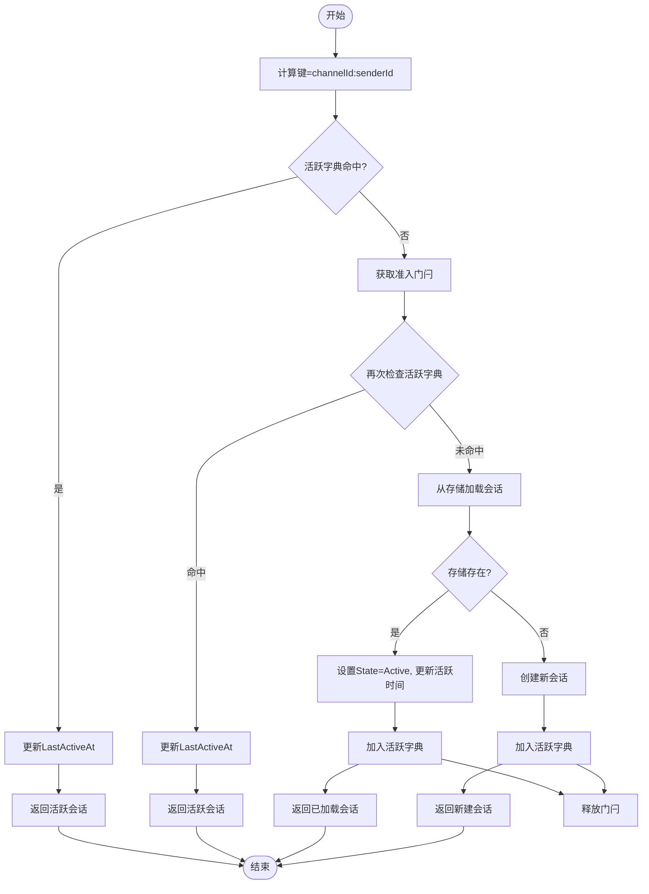
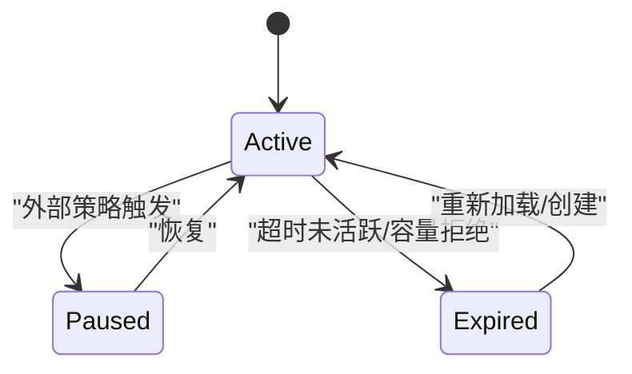
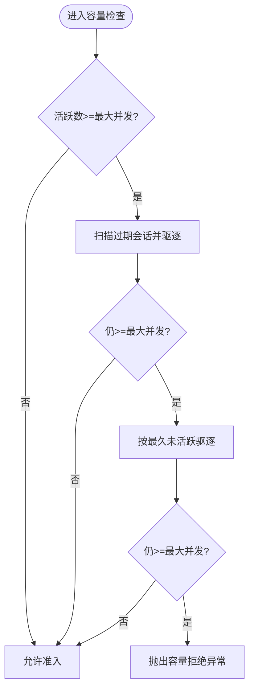
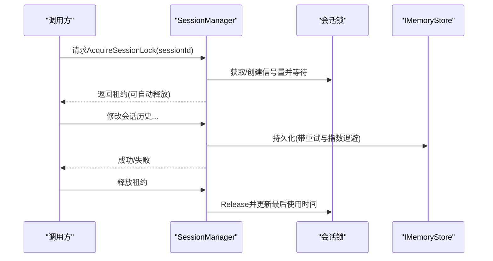
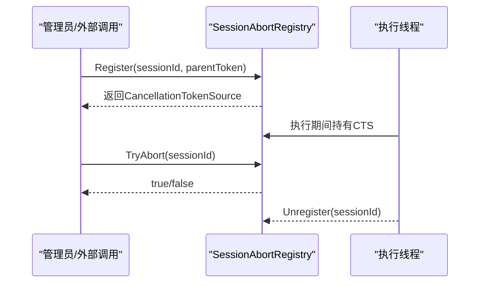
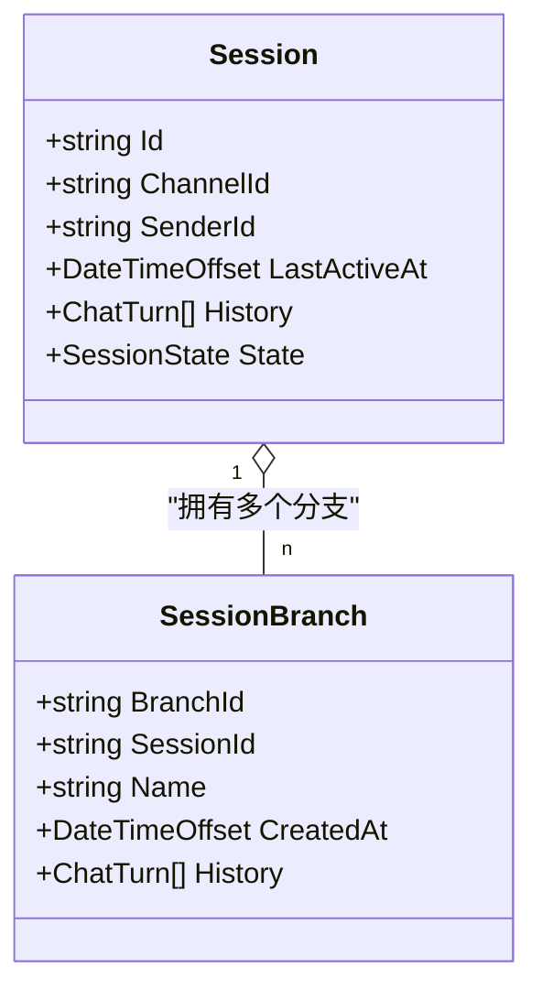
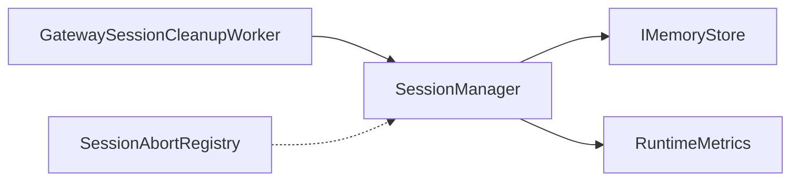

# 会话生命周期管理

<cite>
**本文引用的文件**
- [SessionManager.cs](file://src/OpenClaw.Core/Sessions/SessionManager.cs)
- [Session.cs](file://src/OpenClaw.Core/Models/Session.cs)
- [SessionBranch.cs](file://src/OpenClaw.Core/Models/SessionBranch.cs)
- [IMemoryStore.cs](file://src/OpenClaw.Core/Abstractions/IMemoryStore.cs)
- [ISessionAdminStore.cs](file://src/OpenClaw.Core/Abstractions/ISessionAdminStore.cs)
- [ISessionMetadataStore.cs](file://src/OpenClaw.Core/Abstractions/ISessionMetadataStore.cs)
- [SessionAbortRegistry.cs](file://src/OpenClaw.Core/Pipeline/SessionAbortRegistry.cs)
- [GatewaySessionCleanupWorker.cs](file://src/OpenClaw.Gateway/Extensions/GatewaySessionCleanupWorker.cs)
- [RuntimeMetrics.cs](file://src/OpenClaw.Core/Observability/RuntimeMetrics.cs)
- [AdminSettingsService.cs](file://src/OpenClaw.Gateway/AdminSettingsService.cs)
- [Settings.razor](file://src/OpenClaw.Dashboard/Pages/Settings.razor)
- [SessionManagerTests.cs](file://src/OpenClaw.Tests/SessionManagerTests.cs)
</cite>

## 目录
1. [引言](#引言)
2. [项目结构](#项目结构)
3. [核心组件](#核心组件)
4. [架构总览](#架构总览)
5. [详细组件分析](#详细组件分析)
6. [依赖关系分析](#依赖关系分析)
7. [性能考量](#性能考量)
8. [故障排查指南](#故障排查指南)
9. [结论](#结论)
10. [附录](#附录)

## 引言
本文件系统性阐述会话生命周期管理的设计与实现，覆盖会话创建、激活、活跃状态维护、过期清理与销毁；详解会话键生成机制（channelId:senderId）、状态转换（Active、Expired、Paused）、容量与内存限制策略；解释会话锁机制、并发安全保证与资源清理策略；并给出配置参数、性能指标与监控方法，以及各阶段的最佳实践与参考路径。

## 项目结构
围绕会话生命周期的关键模块分布如下：
- 核心模型：会话实体、分支、状态枚举等
- 会话管理器：负责会话的创建、缓存、持久化、过期清理、并发控制与资源回收
- 存储抽象：统一的会话与分支持久化接口
- 管理与监控：后台清理作业、运行时指标、仪表盘配置入口
- 并发与取消：会话级锁与执行中止注册表

**图表来源**
- [SessionManager.cs:10-624](file://src/OpenClaw.Core/Sessions/SessionManager.cs#L10-L624)
- [Session.cs:11-150](file://src/OpenClaw.Core/Models/Session.cs#L11-L150)
- [SessionBranch.cs:1-16](file://src/OpenClaw.Core/Models/SessionBranch.cs#L1-L16)
- [IMemoryStore.cs:1-23](file://src/OpenClaw.Core/Abstractions/IMemoryStore.cs#L1-L23)
- [SessionAbortRegistry.cs:1-61](file://src/OpenClaw.Core/Pipeline/SessionAbortRegistry.cs#L1-L61)
- [GatewaySessionCleanupWorker.cs:1-34](file://src/OpenClaw.Gateway/Extensions/GatewaySessionCleanupWorker.cs#L1-L34)
- [RuntimeMetrics.cs:34-65](file://src/OpenClaw.Core/Observability/RuntimeMetrics.cs#L34-L65)

**章节来源**
- [SessionManager.cs:10-624](file://src/OpenClaw.Core/Sessions/SessionManager.cs#L10-L624)
- [Session.cs:11-150](file://src/OpenClaw.Core/Models/Session.cs#L11-L150)
- [IMemoryStore.cs:1-23](file://src/OpenClaw.Core/Abstractions/IMemoryStore.cs#L1-L23)

## 核心组件
- 会话实体与状态
  - 会话包含标识、渠道与发送者、历史记录、最后活跃时间、状态等字段，并提供令牌用量与缓存用量的原子计数器。
  - 状态枚举包含 Active、Paused、Expired，用于表示会话的生命周期阶段。
- 会话管理器
  - 负责会话的创建/加载、活跃字典缓存、容量控制、过期清理、持久化与后台最佳努力写入、会话级锁与锁清理。
- 存储抽象
  - 提供会话与分支的读写接口，支持分支快照、列表与删除。
- 并发与取消
  - 会话级锁确保对同一会话的历史修改互斥；中止注册表允许外部触发当前执行的取消。
- 清理与监控
  - 后台定时任务定期扫描过期会话并清理；运行时指标统计会话驱逐、容量拒绝等关键指标。

**章节来源**
- [Session.cs:11-150](file://src/OpenClaw.Core/Models/Session.cs#L11-L150)
- [SessionManager.cs:10-624](file://src/OpenClaw.Core/Sessions/SessionManager.cs#L10-L624)
- [IMemoryStore.cs:1-23](file://src/OpenClaw.Core/Abstractions/IMemoryStore.cs#L1-L23)
- [SessionAbortRegistry.cs:1-61](file://src/OpenClaw.Core/Pipeline/SessionAbortRegistry.cs#L1-L61)
- [GatewaySessionCleanupWorker.cs:1-34](file://src/OpenClaw.Gateway/Extensions/GatewaySessionCleanupWorker.cs#L1-L34)
- [RuntimeMetrics.cs:34-65](file://src/OpenClaw.Core/Observability/RuntimeMetrics.cs#L34-L65)

## 架构总览
会话生命周期由“管理器-存储-清理-监控”协同完成。管理器在内存中维护活跃会话，按需从存储加载或创建新会话；通过容量控制与过期扫描维持内存健康；通过会话级锁保障并发安全；通过后台任务与指标体系实现可观测性。

**图表来源**
- [SessionManager.cs:45-130](file://src/OpenClaw.Core/Sessions/SessionManager.cs#L45-L130)
- [IMemoryStore.cs:1-23](file://src/OpenClaw.Core/Abstractions/IMemoryStore.cs#L1-L23)
- [GatewaySessionCleanupWorker.cs:14-32](file://src/OpenClaw.Gateway/Extensions/GatewaySessionCleanupWorker.cs#L14-L32)

## 详细组件分析

### 会话键生成与创建流程
- 键生成规则
  - 会话键为 channelId:senderId 的确定性组合，便于跨通道/发送者稳定定位会话。
- 创建与加载策略
  - 先查活跃字典，命中则更新活跃时间。
  - 若未命中，进入准入门闩，再次检查以避免重复创建。
  - 从存储加载已存在会话则激活并加入缓存；否则创建新会话并加入缓存。
  - 失败重试与幂等处理确保并发安全与一致性。

**图表来源**
- [SessionManager.cs:45-130](file://src/OpenClaw.Core/Sessions/SessionManager.cs#L45-L130)

**章节来源**
- [SessionManager.cs:45-130](file://src/OpenClaw.Core/Sessions/SessionManager.cs#L45-L130)

### 会话状态转换与生命周期策略
- 状态定义
  - Active：活跃会话，可继续交互。
  - Paused：暂停状态，通常由外部策略触发。
  - Expired：过期状态，由过期扫描或容量拒绝导致。
- 生命周期策略
  - 激活：首次创建或从存储加载后置为 Active。
  - 维护：每次访问更新 LastActiveAt。
  - 过期：超过会话超时阈值未活跃则标记 Expired 并从活跃字典移除。
  - 销毁：内存层面移除；存储层面通过后台最佳努力持久化。

**图表来源**
- [Session.cs:145-150](file://src/OpenClaw.Core/Models/Session.cs#L145-L150)
- [SessionManager.cs:338-359](file://src/OpenClaw.Core/Sessions/SessionManager.cs#L338-L359)

**章节来源**
- [Session.cs:145-150](file://src/OpenClaw.Core/Models/Session.cs#L145-L150)
- [SessionManager.cs:338-359](file://src/OpenClaw.Core/Sessions/SessionManager.cs#L338-L359)

### 会话超时机制与容量管理
- 超时机制
  - 基于配置的会话超时分钟数计算截止时间，遍历活跃会话判断 LastActiveAt 是否早于截止时间，若满足则标记 Expired 并移除。
- 容量管理
  - 当活跃会话数量达到最大并发限制时，先主动扫描过期会话进行驱逐，再按最久未活跃顺序淘汰，最后抛出容量拒绝异常。
  - 指标统计：会话驱逐次数、容量拒绝次数。

**图表来源**
- [SessionManager.cs:443-460](file://src/OpenClaw.Core/Sessions/SessionManager.cs#L443-L460)
- [SessionManager.cs:399-441](file://src/OpenClaw.Core/Sessions/SessionManager.cs#L399-L441)

**章节来源**
- [SessionManager.cs:338-359](file://src/OpenClaw.Core/Sessions/SessionManager.cs#L338-L359)
- [SessionManager.cs:443-460](file://src/OpenClaw.Core/Sessions/SessionManager.cs#L443-L460)
- [SessionManager.cs:399-441](file://src/OpenClaw.Core/Sessions/SessionManager.cs#L399-L441)

### 并发访问控制与会话锁机制
- 会话级锁
  - 使用独立的信号量字典为每个会话键提供互斥保护，确保同一会话的历史修改串行化。
  - 提供租约模式，使用 using 语义自动释放锁。
- 锁清理
  - 定期扫描非活跃会话锁，超过阈值未使用则尝试回收，防止内存泄漏。
- 并发安全保证
  - 准入门闩避免重复创建；活跃字典为并发容器；原子计数与 Volatile 读写保证指标与计数正确性。

**图表来源**
- [SessionManager.cs:474-530](file://src/OpenClaw.Core/Sessions/SessionManager.cs#L474-L530)
- [SessionManager.cs:132-172](file://src/OpenClaw.Core/Sessions/SessionManager.cs#L132-L172)

**章节来源**
- [SessionManager.cs:474-530](file://src/OpenClaw.Core/Sessions/SessionManager.cs#L474-L530)
- [SessionManager.cs:132-172](file://src/OpenClaw.Core/Sessions/SessionManager.cs#L132-L172)

### 并发中止与取消
- 中止注册表
  - 为当前正在执行的会话注册 CancellationTokenSource，支持外部触发取消。
  - 注册时自动清理旧实例，避免泄漏；提供按会话查找与取消能力。

**图表来源**
- [SessionAbortRegistry.cs:22-56](file://src/OpenClaw.Core/Pipeline/SessionAbortRegistry.cs#L22-L56)

**章节来源**
- [SessionAbortRegistry.cs:1-61](file://src/OpenClaw.Core/Pipeline/SessionAbortRegistry.cs#L1-L61)

### 分支与历史快照
- 分支能力
  - 支持为会话历史创建命名分支快照，用于探索不同对话路径。
  - 提供分支差异构建、分支列表与恢复能力。
- 数据结构
  - 分支包含分支标识、会话标识、名称、创建时间与历史快照。

**图表来源**
- [Session.cs:22-29](file://src/OpenClaw.Core/Models/Session.cs#L22-L29)
- [SessionBranch.cs:8-15](file://src/OpenClaw.Core/Models/SessionBranch.cs#L8-L15)

**章节来源**
- [SessionBranch.cs:1-16](file://src/OpenClaw.Core/Models/SessionBranch.cs#L1-L16)
- [SessionManager.cs:180-220](file://src/OpenClaw.Core/Sessions/SessionManager.cs#L180-L220)

### 配置参数与监控
- 配置项
  - 最大并发会话数：控制活跃会话上限，超过后触发容量管理策略。
  - 会话超时分钟数：决定会话活跃阈值，超时未活跃会被驱逐。
  - 会话令牌预算、每分钟会话速率限制：用于流量治理（在设置界面可见）。
- 监控指标
  - 会话驱逐次数、容量拒绝次数、活跃会话数等。
- 仪表盘与设置
  - 仪表盘页面提供最大并发会话数与会话超时分钟数的输入控件。
  - 管理服务记录配置变更并提示重启需求。

**章节来源**
- [SessionManager.cs:29-36](file://src/OpenClaw.Core/Sessions/SessionManager.cs#L29-L36)
- [RuntimeMetrics.cs:34-65](file://src/OpenClaw.Core/Observability/RuntimeMetrics.cs#L34-L65)
- [Settings.razor:39-62](file://src/OpenClaw.Dashboard/Pages/Settings.razor#L39-L62)
- [AdminSettingsService.cs:396-401](file://src/OpenClaw.Gateway/AdminSettingsService.cs#L396-L401)

## 依赖关系分析
- 组件耦合
  - SessionManager 依赖 IMemoryStore 实现持久化；依赖 RuntimeMetrics 进行指标上报；依赖日志器记录事件。
  - SessionAbortRegistry 与执行线程协作，不直接依赖 SessionManager。
- 外部集成
  - GatewaySessionCleanupWorker 作为后台作业周期性调用 SessionManager 的清理方法。
- 循环依赖
  - 无循环依赖迹象，职责清晰分离。

**图表来源**
- [SessionManager.cs:19-27](file://src/OpenClaw.Core/Sessions/SessionManager.cs#L19-L27)
- [GatewaySessionCleanupWorker.cs:7-33](file://src/OpenClaw.Gateway/Extensions/GatewaySessionCleanupWorker.cs#L7-L33)
- [SessionAbortRegistry.cs:13-14](file://src/OpenClaw.Core/Pipeline/SessionAbortRegistry.cs#L13-L14)

**章节来源**
- [SessionManager.cs:19-27](file://src/OpenClaw.Core/Sessions/SessionManager.cs#L19-L27)
- [GatewaySessionCleanupWorker.cs:1-34](file://src/OpenClaw.Gateway/Extensions/GatewaySessionCleanupWorker.cs#L1-L34)
- [SessionAbortRegistry.cs:1-61](file://src/OpenClaw.Core/Pipeline/SessionAbortRegistry.cs#L1-L61)

## 性能考量
- 内存占用
  - 活跃会话驻留内存，建议合理设置最大并发与超时，避免内存膨胀。
- 时间复杂度
  - 容量不足时的最久未活跃扫描为 O(n)，当并发会话规模较大时可考虑优化方案（如优先队列）。
- I/O 与重试
  - 持久化采用带指数退避的重试策略，降低瞬时故障影响。
- 指标观测
  - 通过运行时指标跟踪驱逐与容量拒绝，辅助容量规划与调优。

**章节来源**
- [SessionManager.cs:399-441](file://src/OpenClaw.Core/Sessions/SessionManager.cs#L399-L441)
- [SessionManager.cs:144-172](file://src/OpenClaw.Core/Sessions/SessionManager.cs#L144-L172)
- [RuntimeMetrics.cs:34-65](file://src/OpenClaw.Core/Observability/RuntimeMetrics.cs#L34-L65)

## 故障排查指南
- 常见问题
  - 会话无法创建：检查存储可用性与准入门闩是否阻塞。
  - 会话被频繁驱逐：检查超时配置与活跃度，适当提高超时或并发上限。
  - 并发冲突导致写入失败：确认会话锁是否正确使用租约模式，避免死锁。
  - 取消无效：确认中止注册表是否正确注册并调用 TryAbort。
- 排查步骤
  - 查看运行时指标中的会话驱逐与容量拒绝计数。
  - 检查后台清理作业日志，确认定时任务正常运行。
  - 在测试中验证会话锁与并发创建行为（参考测试用例）。

**章节来源**
- [RuntimeMetrics.cs:34-65](file://src/OpenClaw.Core/Observability/RuntimeMetrics.cs#L34-L65)
- [GatewaySessionCleanupWorker.cs:14-32](file://src/OpenClaw.Gateway/Extensions/GatewaySessionCleanupWorker.cs#L14-L32)
- [SessionManagerTests.cs:215-243](file://src/OpenClaw.Tests/SessionManagerTests.cs#L215-L243)

## 结论
该会话生命周期管理方案通过“键生成-创建/加载-活跃维护-过期清理-并发控制-可观测性”的完整闭环，实现了高并发场景下的稳定会话管理。合理的容量与超时策略、会话级锁与后台清理作业共同保障了系统的可靠性与可维护性。建议结合业务负载持续优化配置参数与监控告警，确保系统在高峰期也能保持良好性能。

## 附录
- 代码示例参考路径
  - 会话创建与加载：[SessionManager.cs:45-130](file://src/OpenClaw.Core/Sessions/SessionManager.cs#L45-L130)
  - 会话持久化与重试：[SessionManager.cs:132-172](file://src/OpenClaw.Core/Sessions/SessionManager.cs#L132-L172)
  - 过期扫描与驱逐：[SessionManager.cs:338-359](file://src/OpenClaw.Core/Sessions/SessionManager.cs#L338-L359)
  - 容量控制与淘汰：[SessionManager.cs:443-460](file://src/OpenClaw.Core/Sessions/SessionManager.cs#L443-L460)
  - 会话锁与清理：[SessionManager.cs:474-530](file://src/OpenClaw.Core/Sessions/SessionManager.cs#L474-L530)
  - 分支快照与恢复：[SessionManager.cs:180-220](file://src/OpenClaw.Core/Sessions/SessionManager.cs#L180-L220)
  - 中止注册与取消：[SessionAbortRegistry.cs:22-56](file://src/OpenClaw.Core/Pipeline/SessionAbortRegistry.cs#L22-L56)
  - 后台清理作业：[GatewaySessionCleanupWorker.cs:14-32](file://src/OpenClaw.Gateway/Extensions/GatewaySessionCleanupWorker.cs#L14-L32)
  - 配置与仪表盘：[AdminSettingsService.cs:396-401](file://src/OpenClaw.Gateway/AdminSettingsService.cs#L396-L401)、[Settings.razor:39-62](file://src/OpenClaw.Dashboard/Pages/Settings.razor#L39-L62)
  - 测试用例参考：[SessionManagerTests.cs:215-243](file://src/OpenClaw.Tests/SessionManagerTests.cs#L215-L243)