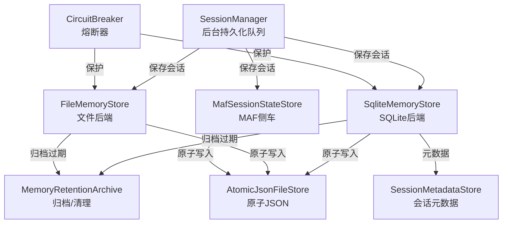
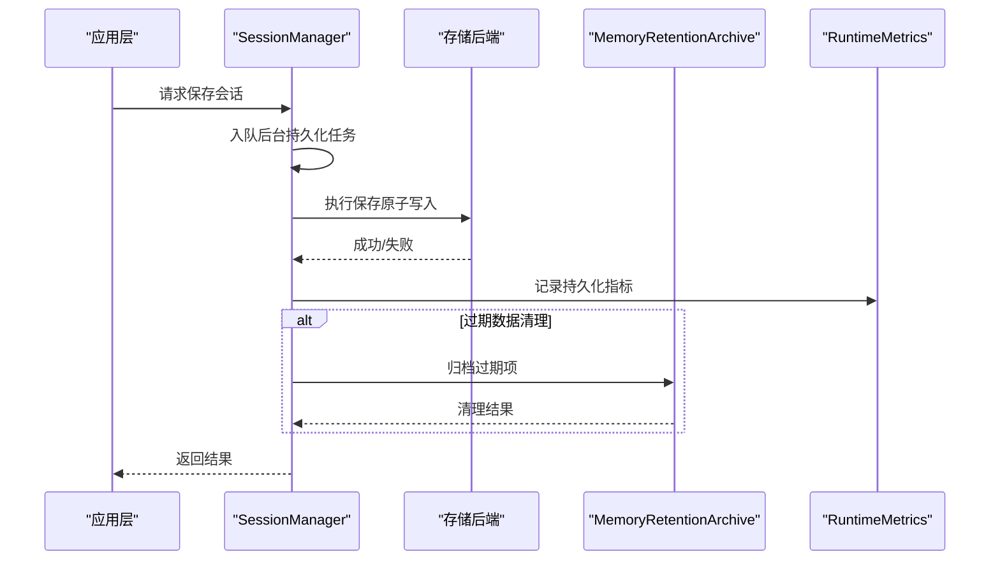
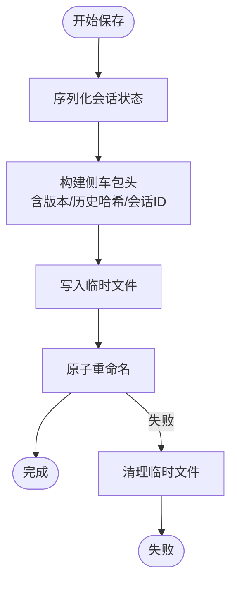
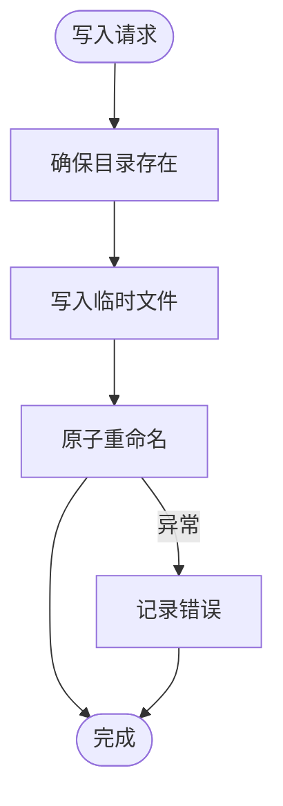
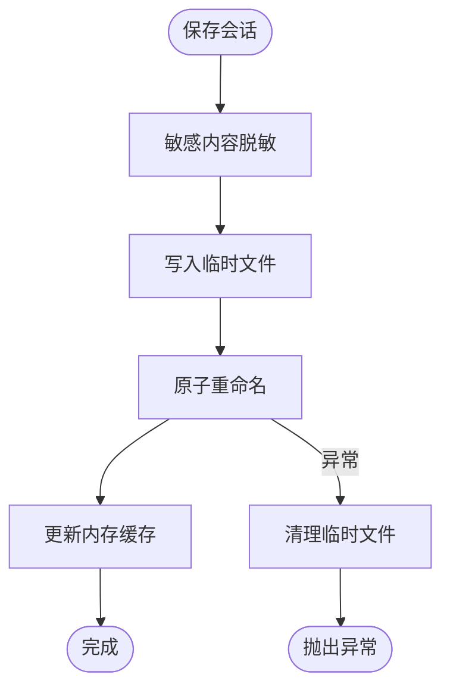
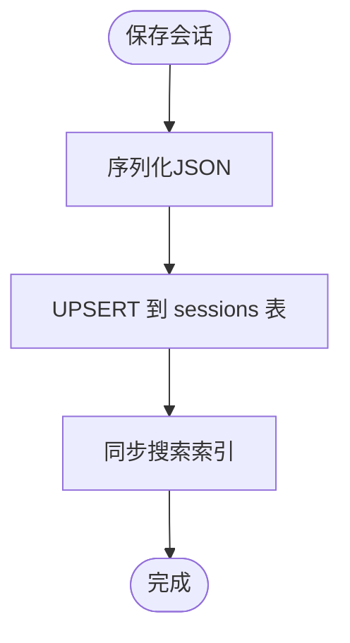
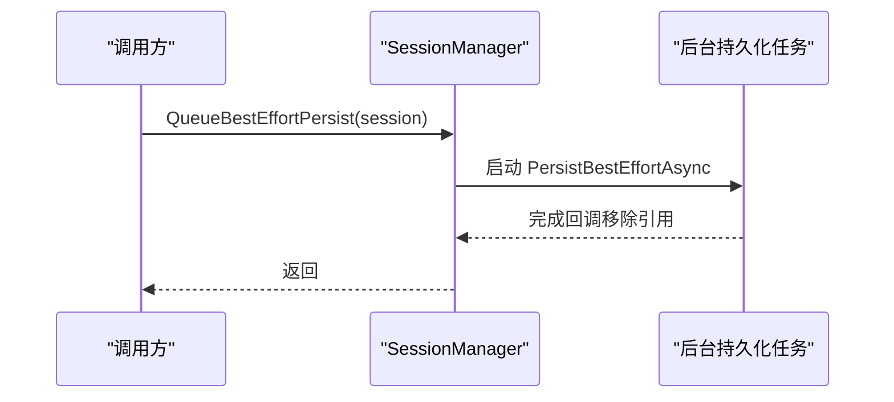
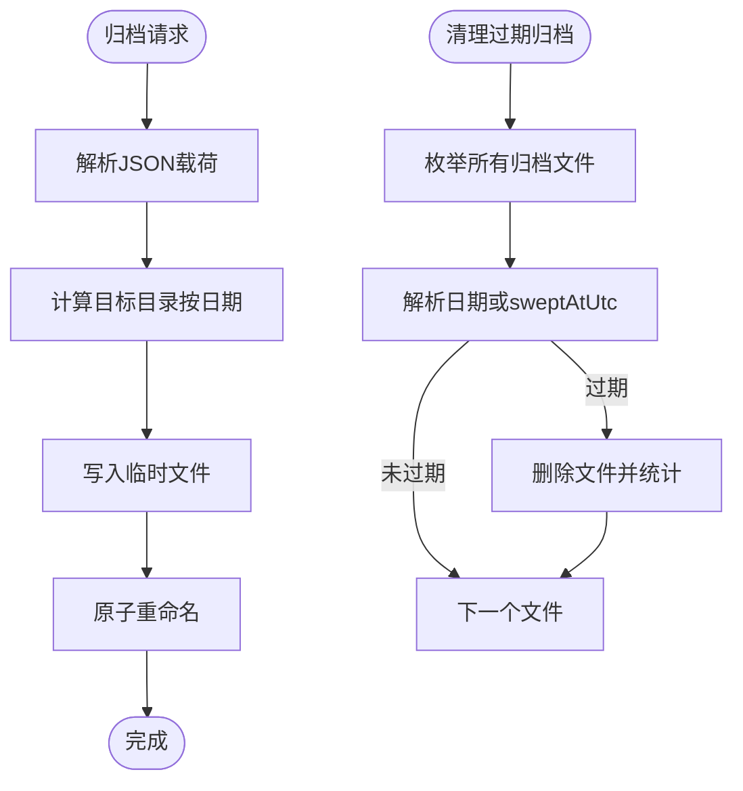
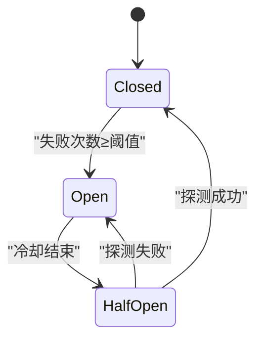
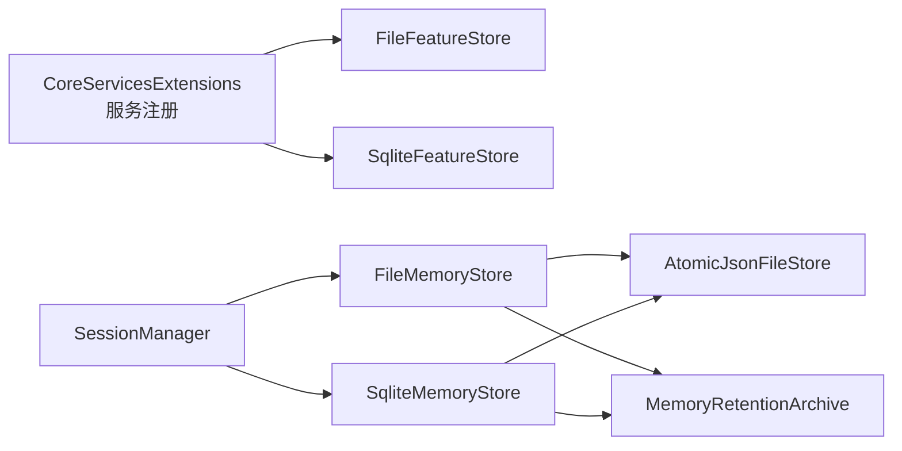

# 数据持久化机制

<cite>
**本文档引用的文件**
- [MafSessionStateStore.cs](file://src/OpenClaw.Agent/MafSessionStateStore.cs)
- [AtomicJsonFileStore.cs](file://src/OpenClaw.Gateway/AtomicJsonFileStore.cs)
- [FileMemoryStore.cs](file://src/OpenClaw.Core/Memory/FileMemoryStore.cs)
- [SqliteMemoryStore.cs](file://src/OpenClaw.Core/Memory/SqliteMemoryStore.cs)
- [SessionManager.cs](file://src/OpenClaw.Core/Sessions/SessionManager.cs)
- [MemoryRetentionArchive.cs](file://src/OpenClaw.Core/Memory/MemoryRetentionArchive.cs)
- [SessionMetadataStore.cs](file://src/OpenClaw.Gateway/SessionMetadataStore.cs)
- [CircuitBreaker.cs](file://src/OpenClaw.Agent/CircuitBreaker.cs)
- [RuntimeMetrics.cs](file://src/OpenClaw.Core/Observability/RuntimeMetrics.cs)
- [AdminObservabilityService.cs](file://src/OpenClaw.Gateway/AdminObservabilityService.cs)
- [CoreServicesExtensions.cs](file://src/OpenClaw.Gateway/Composition/CoreServicesExtensions.cs)
- [FileFeatureStore.cs](file://src/OpenClaw.Core/Features/FileFeatureStore.cs)
- [SqliteMemoryStoreRetentionTests.cs](file://src/OpenClaw.Tests/SqliteMemoryStoreRetentionTests.cs)
- [FileMemoryStoreTests.cs](file://src/OpenClaw.Tests/FileMemoryStoreTests.cs)
</cite>

## 目录
1. [引言](#引言)
2. [项目结构](#项目结构)
3. [核心组件](#核心组件)
4. [架构概览](#架构概览)
5. [详细组件分析](#详细组件分析)
6. [依赖关系分析](#依赖关系分析)
7. [性能考量](#性能考量)
8. [故障排查指南](#故障排查指南)
9. [结论](#结论)
10. [附录](#附录)

## 引言
本文件系统性阐述项目的会话与记忆体数据持久化机制，覆盖会话状态的异步写入、后台持久化任务、冲突解决与一致性保障、重试与指数退避策略、错误恢复、序列化优化、磁盘 I/O 控制、性能监控与队列管理、资源限制、持久化配置选项、故障诊断与数据修复，以及与存储后端的交互模式与数据迁移策略。

## 项目结构
围绕持久化的关键模块分布于以下命名空间与文件：
- 会话侧车（MAF）状态存储：负责会话状态的原子写入与历史哈希校验
- 网关原子 JSON 存储：提供原子读写与追加能力
- 记忆体存储（文件/SQLite）：会话、分支、笔记的持久化与检索
- 会话管理器：后台最佳努力持久化队列与锁管理
- 归档工具：过期数据归档与清理
- 元数据存储：会话元数据的原子写入
- 熔断器：服务失败时的短路与退避
- 观测指标：持久化相关的运行时指标
- 服务注册：根据配置选择文件或 SQLite 后端

**图表来源**
- [SessionManager.cs:589-605](file://src/OpenClaw.Core/Sessions/SessionManager.cs#L589-L605)
- [FileMemoryStore.cs:225-262](file://src/OpenClaw.Core/Memory/FileMemoryStore.cs#L225-L262)
- [SqliteMemoryStore.cs:181-207](file://src/OpenClaw.Core/Memory/SqliteMemoryStore.cs#L181-L207)
- [MafSessionStateStore.cs:107-144](file://src/OpenClaw.Agent/MafSessionStateStore.cs#L107-L144)
- [MemoryRetentionArchive.cs:9-77](file://src/OpenClaw.Core/Memory/MemoryRetentionArchive.cs#L9-L77)
- [AtomicJsonFileStore.cs:34-59](file://src/OpenClaw.Gateway/AtomicJsonFileStore.cs#L34-L59)
- [SessionMetadataStore.cs:103-107](file://src/OpenClaw.Gateway/SessionMetadataStore.cs#L103-L107)
- [CircuitBreaker.cs:108-207](file://src/OpenClaw.Agent/CircuitBreaker.cs#L108-L207)

**章节来源**
- [SessionManager.cs:589-605](file://src/OpenClaw.Core/Sessions/SessionManager.cs#L589-L605)
- [FileMemoryStore.cs:225-262](file://src/OpenClaw.Core/Memory/FileMemoryStore.cs#L225-L262)
- [SqliteMemoryStore.cs:181-207](file://src/OpenClaw.Core/Memory/SqliteMemoryStore.cs#L181-L207)
- [MafSessionStateStore.cs:107-144](file://src/OpenClaw.Agent/MafSessionStateStore.cs#L107-L144)
- [MemoryRetentionArchive.cs:9-77](file://src/OpenClaw.Core/Memory/MemoryRetentionArchive.cs#L9-L77)
- [AtomicJsonFileStore.cs:34-59](file://src/OpenClaw.Gateway/AtomicJsonFileStore.cs#L34-L59)
- [SessionMetadataStore.cs:103-107](file://src/OpenClaw.Gateway/SessionMetadataStore.cs#L103-L107)
- [CircuitBreaker.cs:108-207](file://src/OpenClaw.Agent/CircuitBreaker.cs#L108-L207)

## 核心组件
- 会话侧车存储（MafSessionStateStore）
  - 基于会话 ID 的哈希路径组织，使用临时文件+原子重命名确保写入原子性
  - 历史哈希校验防止历史不一致导致的状态回滚
  - 支持遗留路径兼容与版本检查
- 原子 JSON 文件存储（AtomicJsonFileStore）
  - 提供 TryLoad/TryWriteAtomic，基于临时文件+重命名的原子写入
  - 支持线程安全的行级追加
- 文件记忆体存储（FileMemoryStore）
  - 会话/分支/笔记的文件存储，URL 安全编码避免路径遍历
  - 会话加载分片锁与内存缓存提升并发读取性能
  - 损坏文件隔离与迁移逻辑
- SQLite 记忆体存储（SqliteMemoryStore）
  - 使用 WAL 模式与 NORMAL 同步策略平衡一致性与性能
  - 支持 FTS5 全文检索与可选向量嵌入
  - ON CONFLICT UPSERT 更新
- 会话管理器（SessionManager）
  - 后台最佳努力持久化队列，异步执行并清理完成的任务引用
  - 会话级信号量锁与租约释放
- 记忆体归档（MemoryRetentionArchive）
  - 按日期层级归档过期数据，支持清理过期归档
- 会话元数据存储（SessionMetadataStore）
  - 原子写入会话元数据 JSON，带缓存与日志
- 熔断器（CircuitBreaker）
  - 失败阈值触发开路，半开探测，指数退避冷却
- 观测指标（RuntimeMetrics）
  - 统计持久化相关的命中率、扫描与删除数量等

**章节来源**
- [MafSessionStateStore.cs:107-144](file://src/OpenClaw.Agent/MafSessionStateStore.cs#L107-L144)
- [AtomicJsonFileStore.cs:34-59](file://src/OpenClaw.Gateway/AtomicJsonFileStore.cs#L34-L59)
- [FileMemoryStore.cs:78-170](file://src/OpenClaw.Core/Memory/FileMemoryStore.cs#L78-L170)
- [SqliteMemoryStore.cs:150-207](file://src/OpenClaw.Core/Memory/SqliteMemoryStore.cs#L150-L207)
- [SessionManager.cs:589-605](file://src/OpenClaw.Core/Sessions/SessionManager.cs#L589-L605)
- [MemoryRetentionArchive.cs:9-77](file://src/OpenClaw.Core/Memory/MemoryRetentionArchive.cs#L9-L77)
- [SessionMetadataStore.cs:103-107](file://src/OpenClaw.Gateway/SessionMetadataStore.cs#L103-L107)
- [CircuitBreaker.cs:108-207](file://src/OpenClaw.Agent/CircuitBreaker.cs#L108-L207)
- [RuntimeMetrics.cs:34-65](file://src/OpenClaw.Core/Observability/RuntimeMetrics.cs#L34-L65)

## 架构概览
持久化整体流程包括：应用层触发保存 → 会话管理器入队后台任务 → 选择具体存储后端 → 原子写入 → 更新缓存/索引 → 记录观测指标。异常时通过熔断器退避与隔离，损坏数据进入归档或隔离区。

**图表来源**
- [SessionManager.cs:589-605](file://src/OpenClaw.Core/Sessions/SessionManager.cs#L589-L605)
- [FileMemoryStore.cs:225-262](file://src/OpenClaw.Core/Memory/FileMemoryStore.cs#L225-L262)
- [SqliteMemoryStore.cs:181-207](file://src/OpenClaw.Core/Memory/SqliteMemoryStore.cs#L181-L207)
- [MemoryRetentionArchive.cs:9-77](file://src/OpenClaw.Core/Memory/MemoryRetentionArchive.cs#L9-L77)
- [RuntimeMetrics.cs:34-65](file://src/OpenClaw.Core/Observability/RuntimeMetrics.cs#L34-L65)

## 详细组件分析

### 会话侧车存储（MafSessionStateStore）
- 路径组织：基于会话 ID 的 SHA256 哈希，避免长文件名与路径问题
- 原子写入：临时文件写入后重命名为最终路径，失败清理临时文件
- 历史哈希校验：确保会话历史一致性，不匹配则回退到全新会话
- 版本与包版本检查：避免跨版本状态不兼容
- 遗留路径兼容：自动识别并迁移旧路径

**图表来源**
- [MafSessionStateStore.cs:107-144](file://src/OpenClaw.Agent/MafSessionStateStore.cs#L107-L144)

**章节来源**
- [MafSessionStateStore.cs:107-144](file://src/OpenClaw.Agent/MafSessionStateStore.cs#L107-L144)

### 原子 JSON 文件存储（AtomicJsonFileStore）
- TryWriteAtomic：临时文件写入+重命名，失败时返回错误
- TryLoad：空文件视为成功，异常记录错误消息
- TryAppendLine：基于锁的线程安全追加

**图表来源**
- [AtomicJsonFileStore.cs:34-59](file://src/OpenClaw.Gateway/AtomicJsonFileStore.cs#L34-L59)

**章节来源**
- [AtomicJsonFileStore.cs:9-59](file://src/OpenClaw.Gateway/AtomicJsonFileStore.cs#L9-L59)

### 文件记忆体存储（FileMemoryStore）
- 会话加载：内存缓存+分片信号量锁，避免并发重复 IO
- 保存：临时文件+原子重命名，失败清理临时文件
- 损坏文件隔离：移动到带时间戳的 .corrupt-* 文件，抛出专用异常
- 分支/笔记：类似模式的原子写入与索引维护
- 保留策略：枚举文件、反序列化校验、受保护会话跳过、可选归档、删除并更新缓存

**图表来源**
- [FileMemoryStore.cs:225-262](file://src/OpenClaw.Core/Memory/FileMemoryStore.cs#L225-L262)

**章节来源**
- [FileMemoryStore.cs:78-170](file://src/OpenClaw.Core/Memory/FileMemoryStore.cs#L78-L170)
- [FileMemoryStore.cs:225-262](file://src/OpenClaw.Core/Memory/FileMemoryStore.cs#L225-L262)
- [FileMemoryStore.cs:191-223](file://src/OpenClaw.Core/Memory/FileMemoryStore.cs#L191-L223)

### SQLite 记忆体存储（SqliteMemoryStore）
- 初始化：WAL 模式、NORMAL 同步、外键开启；可选启用 FTS5 与向量列
- 保存：JSON 序列化后 UPSERT，更新时间戳，同步搜索索引
- 查询：FTS5 或 LIKE 模糊匹配；可选向量相似度融合排序
- 保留策略：按 updated_at 扫描，反序列化校验，受保护会话跳过，可选归档与删除

**图表来源**
- [SqliteMemoryStore.cs:181-207](file://src/OpenClaw.Core/Memory/SqliteMemoryStore.cs#L181-L207)

**章节来源**
- [SqliteMemoryStore.cs:54-148](file://src/OpenClaw.Core/Memory/SqliteMemoryStore.cs#L54-L148)
- [SqliteMemoryStore.cs:181-207](file://src/OpenClaw.Core/Memory/SqliteMemoryStore.cs#L181-L207)
- [SqliteMemoryStore.cs:654-701](file://src/OpenClaw.Core/Memory/SqliteMemoryStore.cs#L654-L701)

### 会话管理器（SessionManager）
- 后台持久化队列：为每次保存生成自增操作 ID，异步执行并清理完成任务引用
- 会话锁：按会话粒度的信号量租约，释放时更新最后使用时间
- 优雅关闭：等待后台持久化任务完成，释放所有锁与资源

**图表来源**
- [SessionManager.cs:589-605](file://src/OpenClaw.Core/Sessions/SessionManager.cs#L589-L605)

**章节来源**
- [SessionManager.cs:589-605](file://src/OpenClaw.Core/Sessions/SessionManager.cs#L589-L605)

### 记忆体归档（MemoryRetentionArchive）
- 归档：按年/月/日/类型目录结构，写入带元信息的 JSON
- 清理：基于归档文件名解析日期或读取 sweptAtUtc，超过保留期删除并清理空目录

**图表来源**
- [MemoryRetentionArchive.cs:9-77](file://src/OpenClaw.Core/Memory/MemoryRetentionArchive.cs#L9-L77)
- [MemoryRetentionArchive.cs:79-166](file://src/OpenClaw.Core/Memory/MemoryRetentionArchive.cs#L79-L166)

**章节来源**
- [MemoryRetentionArchive.cs:9-77](file://src/OpenClaw.Core/Memory/MemoryRetentionArchive.cs#L9-L77)
- [MemoryRetentionArchive.cs:79-166](file://src/OpenClaw.Core/Memory/MemoryRetentionArchive.cs#L79-L166)

### 会话元数据存储（SessionMetadataStore）
- 单文件 JSON 原子读写，内部缓存最近列表
- 并发安全：全局锁保护读写
- 失败降级：加载失败记录警告并返回空缓存

**章节来源**
- [SessionMetadataStore.cs:86-107](file://src/OpenClaw.Gateway/SessionMetadataStore.cs#L86-L107)

### 熔断器（CircuitBreaker）
- 状态机：Closed/Open/HalfOpen
- 失败计数：超过阈值打开，记录打开时间
- 半开探测：允许一次探测，成功则回到 Closed，失败回到 Open 并增加冷却
- 指数退避：冷却时间按 2^N 增长，上限保护

**图表来源**
- [CircuitBreaker.cs:210-215](file://src/OpenClaw.Agent/CircuitBreaker.cs#L210-L215)

**章节来源**
- [CircuitBreaker.cs:108-207](file://src/OpenClaw.Agent/CircuitBreaker.cs#L108-L207)

## 依赖关系分析
- 服务注册：根据配置选择 SQLite 或文件特性存储，统一注入到自动化/用户资料/学习提案等接口
- 会话管理器依赖存储后端实现（文件/SQLite）
- 记忆体存储依赖原子 JSON 工具进行原子写入
- 归档工具被存储后端用于过期数据处理

**图表来源**
- [CoreServicesExtensions.cs:263-279](file://src/OpenClaw.Gateway/Composition/CoreServicesExtensions.cs#L263-L279)
- [SessionManager.cs:589-605](file://src/OpenClaw.Core/Sessions/SessionManager.cs#L589-L605)
- [FileMemoryStore.cs:225-262](file://src/OpenClaw.Core/Memory/FileMemoryStore.cs#L225-L262)
- [SqliteMemoryStore.cs:181-207](file://src/OpenClaw.Core/Memory/SqliteMemoryStore.cs#L181-L207)
- [AtomicJsonFileStore.cs:34-59](file://src/OpenClaw.Gateway/AtomicJsonFileStore.cs#L34-L59)
- [MemoryRetentionArchive.cs:9-77](file://src/OpenClaw.Core/Memory/MemoryRetentionArchive.cs#L9-L77)

**章节来源**
- [CoreServicesExtensions.cs:263-279](file://src/OpenClaw.Gateway/Composition/CoreServicesExtensions.cs#L263-L279)

## 性能考量
- 文件后端
  - 会话加载分片锁与内存缓存，降低热点会话的重复 IO
  - 异步文件流与顺序扫描优化
- SQLite 后端
  - WAL 模式与 NORMAL 同步策略平衡一致性与吞吐
  - FTS5 全文检索与可选向量相似度融合，提升搜索质量
- 后台持久化
  - 最佳努力异步写入，避免阻塞主业务路径
  - 任务完成后从字典中清理引用，防止内存泄漏
- 观测指标
  - 会话缓存命中/未命中计数、保留策略执行统计、运行事件写入失败计数等

**章节来源**
- [FileMemoryStore.cs:34-76](file://src/OpenClaw.Core/Memory/FileMemoryStore.cs#L34-L76)
- [SqliteMemoryStore.cs:54-148](file://src/OpenClaw.Core/Memory/SqliteMemoryStore.cs#L54-L148)
- [SessionManager.cs:589-605](file://src/OpenClaw.Core/Sessions/SessionManager.cs#L589-L605)
- [RuntimeMetrics.cs:34-65](file://src/OpenClaw.Core/Observability/RuntimeMetrics.cs#L34-L65)

## 故障排查指南
- 损坏文件隔离
  - 文件后端在加载/保存失败时将文件移动到 .corrupt-* 目录，抛出专用异常
  - 测试覆盖了损坏文件隔离与迁移行为
- 临时文件清理
  - 保存失败时清理临时文件，避免残留
  - 测试验证了临时文件清理逻辑
- 熔断器保护
  - 持续失败触发开路，半开探测，指数退避，避免雪崩
- 保留策略错误
  - 保留策略最多记录 16 条错误消息，不影响整体流程
- 配置不可写
  - 启动失败报告会包含存储路径与相关环境变量，便于定位权限问题

**章节来源**
- [FileMemoryStore.cs:191-223](file://src/OpenClaw.Core/Memory/FileMemoryStore.cs#L191-L223)
- [MafSessionStateStore.cs:132-143](file://src/OpenClaw.Agent/MafSessionStateStore.cs#L132-L143)
- [CircuitBreaker.cs:108-207](file://src/OpenClaw.Agent/CircuitBreaker.cs#L108-L207)
- [SqliteMemoryStoreRetentionTests.cs:10-197](file://src/OpenClaw.Tests/SqliteMemoryStoreRetentionTests.cs#L10-L197)
- [FileMemoryStoreTests.cs:157-182](file://src/OpenClaw.Tests/FileMemoryStoreTests.cs#L157-L182)

## 结论
该持久化体系以“原子写入+后台异步+一致性校验+熔断保护”为核心设计原则，结合文件与 SQLite 两种后端满足不同场景需求。通过归档与保留策略控制数据生命周期，借助观测指标与测试用例保障稳定性与可诊断性。

## 附录

### 持久化触发条件
- 会话状态变更（保存/更新）
- 会话元数据更新
- 笔记/分支写入
- 后台保留策略扫描与清理

**章节来源**
- [SessionManager.cs:589-605](file://src/OpenClaw.Core/Sessions/SessionManager.cs#L589-L605)
- [SessionMetadataStore.cs:79-84](file://src/OpenClaw.Gateway/SessionMetadataStore.cs#L79-L84)
- [FileMemoryStore.cs:300-326](file://src/OpenClaw.Core/Memory/FileMemoryStore.cs#L300-L326)
- [SqliteMemoryStore.cs:237-282](file://src/OpenClaw.Core/Memory/SqliteMemoryStore.cs#L237-L282)

### 冲突解决与一致性保证
- 原子写入：临时文件+重命名，失败即回滚
- 历史哈希校验：MAF 侧车确保会话历史一致性
- ON CONFLICT UPSERT：SQLite 保证并发更新一致性
- 损坏隔离：自动隔离损坏文件，避免污染

**章节来源**
- [MafSessionStateStore.cs:184-195](file://src/OpenClaw.Agent/MafSessionStateStore.cs#L184-L195)
- [SqliteMemoryStore.cs:194-200](file://src/OpenClaw.Core/Memory/SqliteMemoryStore.cs#L194-L200)
- [FileMemoryStore.cs:225-262](file://src/OpenClaw.Core/Memory/FileMemoryStore.cs#L225-L262)

### 重试机制、指数退避与错误恢复
- 熔断器：失败阈值触发开路，半开探测，指数退避冷却
- 临时文件清理：失败时清理，避免残留
- 损坏文件隔离：移动到 .corrupt-*，抛出异常供上层处理

**章节来源**
- [CircuitBreaker.cs:108-207](file://src/OpenClaw.Agent/CircuitBreaker.cs#L108-L207)
- [MafSessionStateStore.cs:132-143](file://src/OpenClaw.Agent/MafSessionStateStore.cs#L132-L143)
- [FileMemoryStore.cs:191-223](file://src/OpenClaw.Core/Memory/FileMemoryStore.cs#L191-L223)

### 后台持久化任务与队列管理
- 后台最佳努力持久化队列，自增操作 ID，完成后清理引用
- 优雅关闭：等待后台任务完成，释放锁与资源

**章节来源**
- [SessionManager.cs:589-605](file://src/OpenClaw.Core/Sessions/SessionManager.cs#L589-L605)
- [SessionManager.cs:552-584](file://src/OpenClaw.Core/Sessions/SessionManager.cs#L552-L584)

### 序列化优化与磁盘 I/O 控制
- 文件后端：异步文件流、顺序扫描、内存缓存
- SQLite：WAL 模式、NORMAL 同步、FTS5/向量索引
- 原子写入：减少碎片与竞争

**章节来源**
- [FileMemoryStore.cs:138-144](file://src/OpenClaw.Core/Memory/FileMemoryStore.cs#L138-L144)
- [SqliteMemoryStore.cs:54-148](file://src/OpenClaw.Core/Memory/SqliteMemoryStore.cs#L54-L148)
- [AtomicJsonFileStore.cs:34-59](file://src/OpenClaw.Gateway/AtomicJsonFileStore.cs#L34-L59)

### 持久化性能监控
- 会话缓存命中/未命中
- 保留策略执行统计（归档/删除/跳过）
- 运行事件/操作审计写入失败计数
- 观测汇总服务聚合多维度指标

**章节来源**
- [RuntimeMetrics.cs:34-65](file://src/OpenClaw.Core/Observability/RuntimeMetrics.cs#L34-L65)
- [AdminObservabilityService.cs:107-200](file://src/OpenClaw.Gateway/AdminObservabilityService.cs#L107-L200)

### 持久化配置选项
- 存储后端选择：文件或 SQLite
- SQLite 配置：数据库路径、是否启用 FTS5、是否启用向量
- 保留策略：是否启用归档、归档路径、保留天数、最大处理项数
- 元数据存储：会话元数据 JSON 路径

**章节来源**
- [CoreServicesExtensions.cs:263-282](file://src/OpenClaw.Gateway/Composition/CoreServicesExtensions.cs#L263-L282)
- [SqliteMemoryStore.cs:22-44](file://src/OpenClaw.Core/Memory/SqliteMemoryStore.cs#L22-L44)
- [SessionMetadataStore.cs:17-24](file://src/OpenClaw.Gateway/SessionMetadataStore.cs#L17-L24)

### 故障诊断与数据修复
- 损坏文件隔离与迁移：自动识别并隔离损坏文件
- 临时文件清理：失败时清理，避免残留
- 保留策略错误收集：最多记录 16 条错误消息
- 启动失败报告：包含存储路径与环境变量

**章节来源**
- [FileMemoryStoreTests.cs:157-182](file://src/OpenClaw.Tests/FileMemoryStoreTests.cs#L157-L182)
- [MafSessionStateStore.cs:132-143](file://src/OpenClaw.Agent/MafSessionStateStore.cs#L132-L143)
- [SqliteMemoryStoreRetentionTests.cs:10-197](file://src/OpenClaw.Tests/SqliteMemoryStoreRetentionTests.cs#L10-L197)

### 与存储后端的交互模式与数据迁移策略
- 文件后端：URL 安全编码文件名，避免路径遍历；支持遗留路径迁移
- SQLite 后端：初始化表结构与索引，可选启用 FTS5 与向量列
- 归档策略：按日期层级组织，支持清理过期归档

**章节来源**
- [FileMemoryStore.cs:98-131](file://src/OpenClaw.Core/Memory/FileMemoryStore.cs#L98-L131)
- [SqliteMemoryStore.cs:54-148](file://src/OpenClaw.Core/Memory/SqliteMemoryStore.cs#L54-L148)
- [MemoryRetentionArchive.cs:29-36](file://src/OpenClaw.Core/Memory/MemoryRetentionArchive.cs#L29-L36)