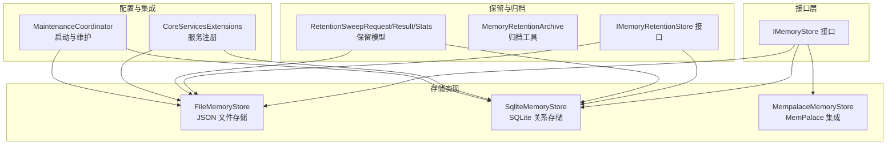
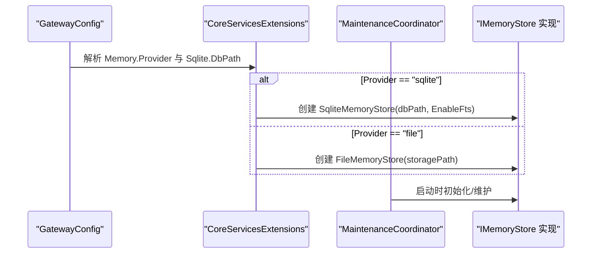
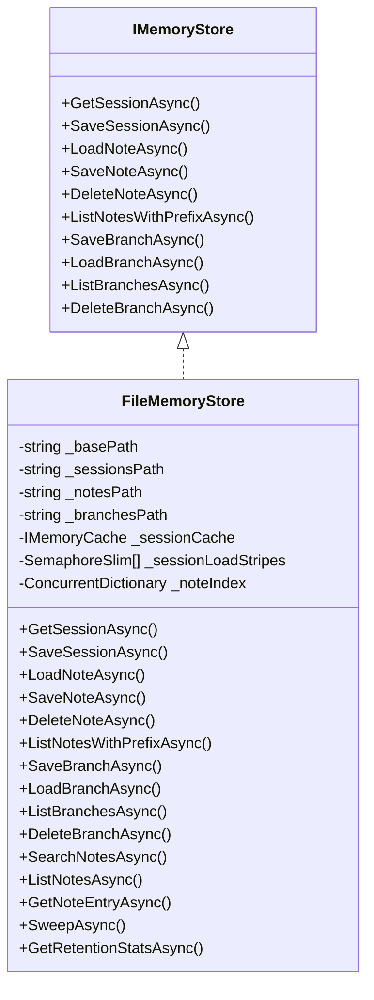
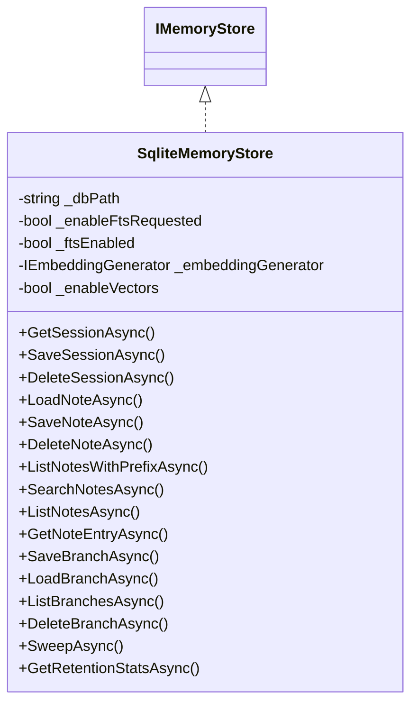
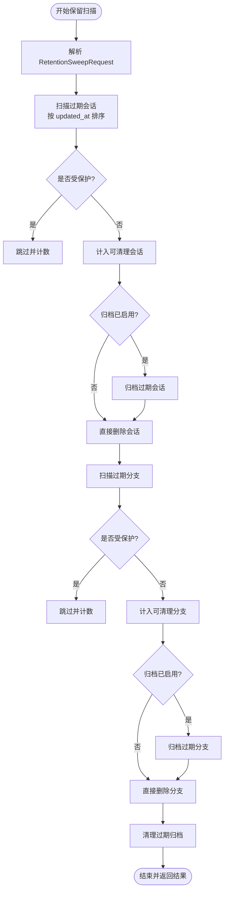
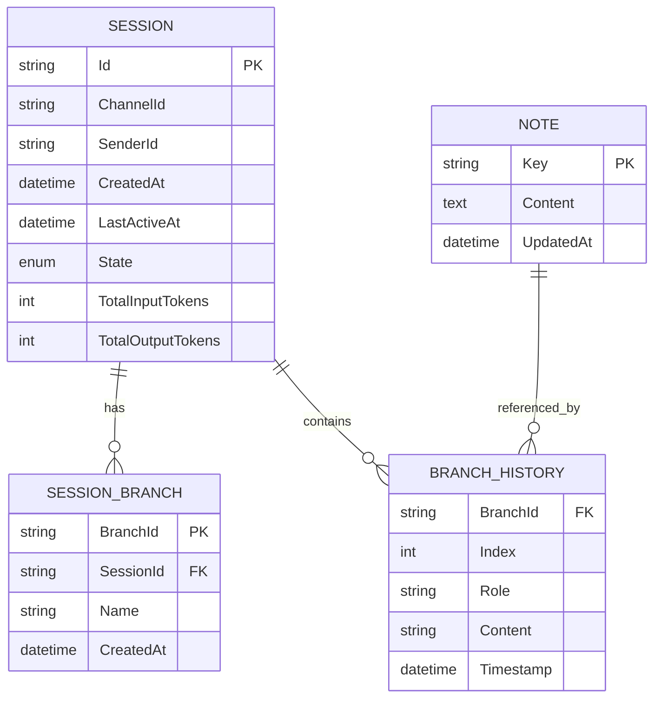
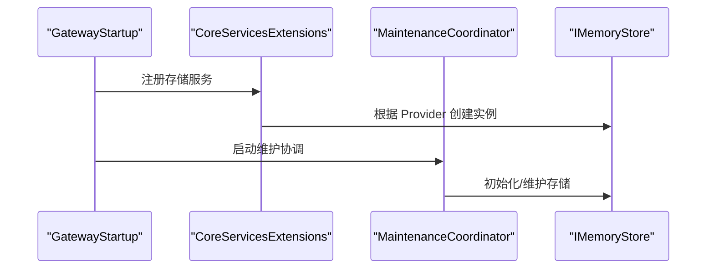
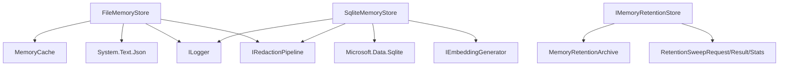

# 记忆存储设计

<cite>
**本文档引用的文件**
- [IMemoryStore.cs](file://src/OpenClaw.Core/Abstractions/IMemoryStore.cs)
- [FileMemoryStore.cs](file://src/OpenClaw.Core/Memory/FileMemoryStore.cs)
- [SqliteMemoryStore.cs](file://src/OpenClaw.Core/Memory/SqliteMemoryStore.cs)
- [MemoryRetentionArchive.cs](file://src/OpenClaw.Core/Memory/MemoryRetentionArchive.cs)
- [IMemoryRetentionStore.cs](file://src/OpenClaw.Core/Abstractions/IMemoryRetentionStore.cs)
- [MemoryRetentionModels.cs](file://src/OpenClaw.Core/Models/MemoryRetentionModels.cs)
- [Session.cs](file://src/OpenClaw.Core/Models/Session.cs)
- [SessionBranch.cs](file://src/OpenClaw.Core/Models/SessionBranch.cs)
- [CoreServicesExtensions.cs](file://src/OpenClaw.Gateway/Composition/CoreServicesExtensions.cs)
- [MaintenanceCoordinator.cs](file://src/OpenClaw.Core/Setup/MaintenanceCoordinator.cs)
- [MempalaceMemoryStore.cs](file://src/OpenClaw.Plugins.Mempalace/MempalaceMemoryStore.cs)
- [RuntimeMetrics.cs](file://src/OpenClaw.Core/Observability/RuntimeMetrics.cs)
- [openclaw-memory-recall-and-retention.md](file://docs/openclaw-memory-recall-and-retention.md)
- [OpenClaw-Session-Management.md](file://docs/OpenClaw-Session-Management.md)
</cite>

## 目录
1. [简介](#简介)
2. [项目结构](#项目结构)
3. [核心组件](#核心组件)
4. [架构概览](#架构概览)
5. [详细组件分析](#详细组件分析)
6. [依赖关系分析](#依赖关系分析)
7. [性能考虑](#性能考虑)
8. [故障排除指南](#故障排除指南)
9. [结论](#结论)
10. [附录](#附录)

## 简介
本文件为记忆存储系统的全面技术文档，涵盖文件存储与 SQLite 存储两种后端的实现原理、配置选项与性能特性。文档重点说明存储接口设计、数据序列化机制与事务处理，详细阐述文件存储的文件格式与目录结构、SQLite 存储的表结构与索引设计，并解释内存缓存策略、持久化触发条件与批量写入机制。同时提供性能对比、容量规划与迁移方案，以及配置示例、故障恢复与数据完整性保障措施。

## 项目结构
记忆存储系统位于 OpenClaw.Core 项目的 Memory 命名空间中，核心接口与实现如下：
- 接口层：IMemoryStore 定义会话与笔记的持久化契约
- 文件存储：FileMemoryStore 提供基于 JSON 文件的本地优先存储
- SQLite 存储：SqliteMemoryStore 提供关系型数据库存储，支持全文检索与向量嵌入
- 保留与归档：IMemoryRetentionStore 与 MemoryRetentionArchive 提供过期数据清理与归档
- 配置集成：CoreServicesExtensions 与 MaintenanceCoordinator 负责根据配置选择存储后端

**图表来源**
- [IMemoryStore.cs:9-23](file://src/OpenClaw.Core/Abstractions/IMemoryStore.cs#L9-L23)
- [FileMemoryStore.cs:32-76](file://src/OpenClaw.Core/Memory/FileMemoryStore.cs#L32-L76)
- [SqliteMemoryStore.cs:12-45](file://src/OpenClaw.Core/Memory/SqliteMemoryStore.cs#L12-L45)
- [IMemoryRetentionStore.cs:9-16](file://src/OpenClaw.Core/Abstractions/IMemoryRetentionStore.cs#L9-L16)
- [MemoryRetentionArchive.cs:7-39](file://src/OpenClaw.Core/Memory/MemoryRetentionArchive.cs#L7-L39)
- [MemoryRetentionModels.cs:7-61](file://src/OpenClaw.Core/Models/MemoryRetentionModels.cs#L7-L61)
- [CoreServicesExtensions.cs:263-310](file://src/OpenClaw.Gateway/Composition/CoreServicesExtensions.cs#L263-L310)
- [MaintenanceCoordinator.cs:769-798](file://src/OpenClaw.Core/Setup/MaintenanceCoordinator.cs#L769-L798)

**章节来源**
- [IMemoryStore.cs:1-24](file://src/OpenClaw.Core/Abstractions/IMemoryStore.cs#L1-L24)
- [FileMemoryStore.cs:1-1263](file://src/OpenClaw.Core/Memory/FileMemoryStore.cs#L1-L1263)
- [SqliteMemoryStore.cs:1-1401](file://src/OpenClaw.Core/Memory/SqliteMemoryStore.cs#L1-L1401)
- [CoreServicesExtensions.cs:263-310](file://src/OpenClaw.Gateway/Composition/CoreServicesExtensions.cs#L263-L310)
- [MaintenanceCoordinator.cs:769-798](file://src/OpenClaw.Core/Setup/MaintenanceCoordinator.cs#L769-L798)

## 核心组件
- IMemoryStore：定义会话获取/保存、笔记读写、分支管理与保留接口，确保不同后端的一致性契约。
- FileMemoryStore：基于 JSON 文件的文件系统存储，默认实现，具备内存缓存与并发加载分段控制，支持笔记搜索索引与保留清理。
- SqliteMemoryStore：基于 SQLite 的关系存储，支持 WAL 模式、外键约束、索引与可选的 FTS5 全文检索及向量嵌入列。
- IMemoryRetentionStore：扩展接口，提供保留扫描与统计查询能力。
- MemoryRetentionArchive：归档工具，按日期分区存储过期数据，支持清理过期归档。
- 保留模型：RetentionSweepRequest/Result/Stats 定义扫描参数、结果与统计信息。

**章节来源**
- [IMemoryStore.cs:9-23](file://src/OpenClaw.Core/Abstractions/IMemoryStore.cs#L9-L23)
- [FileMemoryStore.cs:32-76](file://src/OpenClaw.Core/Memory/FileMemoryStore.cs#L32-L76)
- [SqliteMemoryStore.cs:12-45](file://src/OpenClaw.Core/Memory/SqliteMemoryStore.cs#L12-L45)
- [IMemoryRetentionStore.cs:9-16](file://src/OpenClaw.Core/Abstractions/IMemoryRetentionStore.cs#L9-L16)
- [MemoryRetentionArchive.cs:7-39](file://src/OpenClaw.Core/Memory/MemoryRetentionArchive.cs#L7-L39)
- [MemoryRetentionModels.cs:7-61](file://src/OpenClaw.Core/Models/MemoryRetentionModels.cs#L7-L61)

## 架构概览
系统通过配置选择存储后端：当 Provider 为 sqlite 时，使用 SqliteMemoryStore；否则使用 FileMemoryStore。核心服务注册与启动协调负责实例化与生命周期管理。

**图表来源**
- [CoreServicesExtensions.cs:263-310](file://src/OpenClaw.Gateway/Composition/CoreServicesExtensions.cs#L263-L310)
- [MaintenanceCoordinator.cs:769-798](file://src/OpenClaw.Core/Setup/MaintenanceCoordinator.cs#L769-L798)

**章节来源**
- [CoreServicesExtensions.cs:263-310](file://src/OpenClaw.Gateway/Composition/CoreServicesExtensions.cs#L263-L310)
- [MaintenanceCoordinator.cs:769-798](file://src/OpenClaw.Core/Setup/MaintenanceCoordinator.cs#L769-L798)

## 详细组件分析

### 文件存储组件分析
FileMemoryStore 采用 JSON 文件存储会话与笔记，使用 URL 安全 Base64 编码的文件名防止路径遍历攻击；内置内存 LRU 缓存提升读取性能；并发加载通过 64 个分段信号量控制；提供笔记索引与搜索功能；支持保留扫描与归档。

**图表来源**
- [IMemoryStore.cs:9-23](file://src/OpenClaw.Core/Abstractions/IMemoryStore.cs#L9-L23)
- [FileMemoryStore.cs:32-76](file://src/OpenClaw.Core/Memory/FileMemoryStore.cs#L32-L76)

文件存储的关键实现要点：
- 目录结构：sessions、notes、branches 三个子目录，分别存放会话、笔记与分支的 JSON 文件
- 序列化：使用 CoreJsonContext 进行零分配序列化
- 并发控制：64 个分段信号量，按 sessionId 哈希分片，避免热点竞争
- 内存缓存：基于 MemoryCache 的 LRU 缓存，支持命中/未命中计数
- 笔记索引：维护键到内容与更新时间的索引，支持前缀与全文搜索
- 保留清理：枚举 JSON 文件，按 LastActiveAt/createdAt 判断过期，支持归档与删除
- 容错与隔离：损坏文件移动至 .corrupt 时间戳文件，不影响其他文件

**章节来源**
- [FileMemoryStore.cs:32-1263](file://src/OpenClaw.Core/Memory/FileMemoryStore.cs#L32-L1263)

### SQLite 存储组件分析
SqliteMemoryStore 使用 SQLite 表 sessions、notes、branches 存储数据，启用 WAL 模式与外键约束；可选启用 FTS5 全文检索与触发器自动同步；支持向量嵌入列（需提供嵌入生成器）；提供高效查询与保留清理。

**图表来源**
- [SqliteMemoryStore.cs:12-45](file://src/OpenClaw.Core/Memory/SqliteMemoryStore.cs#L12-L45)
- [IMemoryStore.cs:9-23](file://src/OpenClaw.Core/Abstractions/IMemoryStore.cs#L9-L23)

SQLite 存储的关键实现要点：
- 初始化：创建表与索引，可选创建 FTS5 虚拟表与触发器，回填现有数据
- 查询优化：为 sessions.updated_at 与 branches.updated_at 建立索引
- 事务与一致性：使用连接字符串启用共享缓存模式，WAL 模式提升并发读写
- FTS5 搜索：支持基于 bm25 的排序，结合向量相似度（可选）
- 向量嵌入：可选启用 embedding 列，保存生成的向量二进制
- 保留清理：按 updated_at 扫描过期记录，支持归档与删除

**章节来源**
- [SqliteMemoryStore.cs:54-148](file://src/OpenClaw.Core/Memory/SqliteMemoryStore.cs#L54-L148)
- [SqliteMemoryStore.cs:150-732](file://src/OpenClaw.Core/Memory/SqliteMemoryStore.cs#L150-L732)

### 保留与归档流程
保留扫描通过 RetentionSweepRequest 驱动，按会话与分支的过期阈值筛选，支持干跑模式与归档路径配置；归档工具按日期分区存储 JSON 包裹的过期数据。

**图表来源**
- [IMemoryRetentionStore.cs:11-16](file://src/OpenClaw.Core/Abstractions/IMemoryRetentionStore.cs#L11-L16)
- [MemoryRetentionArchive.cs:7-39](file://src/OpenClaw.Core/Memory/MemoryRetentionArchive.cs#L7-L39)
- [MemoryRetentionModels.cs:7-61](file://src/OpenClaw.Core/Models/MemoryRetentionModels.cs#L7-L61)

**章节来源**
- [IMemoryRetentionStore.cs:9-16](file://src/OpenClaw.Core/Abstractions/IMemoryRetentionStore.cs#L9-L16)
- [MemoryRetentionArchive.cs:7-39](file://src/OpenClaw.Core/Memory/MemoryRetentionArchive.cs#L7-L39)
- [MemoryRetentionModels.cs:7-61](file://src/OpenClaw.Core/Models/MemoryRetentionModels.cs#L7-L61)

### 数据模型与序列化
- Session：会话模型包含标识、渠道、发送方、创建与活跃时间、历史轮次、状态与令牌统计等字段，使用源生成器进行零分配序列化。
- SessionBranch：分支模型包含分支标识、会话标识、名称、创建时间与历史快照列表。
- 保留模型：RetentionSweepRequest/Result/Stats 定义扫描请求、结果与统计信息。

**图表来源**
- [Session.cs:15-135](file://src/OpenClaw.Core/Models/Session.cs#L15-L135)
- [SessionBranch.cs:8-15](file://src/OpenClaw.Core/Models/SessionBranch.cs#L8-L15)

**章节来源**
- [Session.cs:15-135](file://src/OpenClaw.Core/Models/Session.cs#L15-L135)
- [SessionBranch.cs:8-15](file://src/OpenClaw.Core/Models/SessionBranch.cs#L8-L15)
- [MemoryRetentionModels.cs:7-61](file://src/OpenClaw.Core/Models/MemoryRetentionModels.cs#L7-L61)

### 配置与集成
- CoreServicesExtensions：根据 Memory.Provider 选择 SqliteMemoryStore 或 FileMemoryStore，并注册为 IAutomationStore、IUserProfileStore 等的实现
- MaintenanceCoordinator：在启动时解析存储路径，创建对应存储实例
- MempalaceMemoryStore：作为第三方插件集成，内部组合 SqliteMemoryStore 与 MemPalace 后端

**图表来源**
- [CoreServicesExtensions.cs:263-310](file://src/OpenClaw.Gateway/Composition/CoreServicesExtensions.cs#L263-L310)
- [MaintenanceCoordinator.cs:769-798](file://src/OpenClaw.Core/Setup/MaintenanceCoordinator.cs#L769-L798)
- [MempalaceMemoryStore.cs:33-41](file://src/OpenClaw.Plugins.Mempalace/MempalaceMemoryStore.cs#L33-L41)

**章节来源**
- [CoreServicesExtensions.cs:263-310](file://src/OpenClaw.Gateway/Composition/CoreServicesExtensions.cs#L263-L310)
- [MaintenanceCoordinator.cs:769-798](file://src/OpenClaw.Core/Setup/MaintenanceCoordinator.cs#L769-L798)
- [MempalaceMemoryStore.cs:33-41](file://src/OpenClaw.Plugins.Mempalace/MempalaceMemoryStore.cs#L33-L41)

## 依赖关系分析
- FileMemoryStore 依赖：Microsoft.Extensions.Caching.Memory（内存缓存）、System.Text.Json（序列化）、日志与脱敏管道
- SqliteMemoryStore 依赖：Microsoft.Data.Sqlite（SQLite 连接）、可选 IEmbeddingGenerator（向量嵌入）
- 保留接口：IMemoryRetentionStore 与 MemoryRetentionArchive 为可选扩展，不改变 IMemoryStore 契约
- 配置集成：CoreServicesExtensions 与 MaintenanceCoordinator 通过 GatewayConfig 决定后端类型与路径

**图表来源**
- [FileMemoryStore.cs:40-47](file://src/OpenClaw.Core/Memory/FileMemoryStore.cs#L40-L47)
- [SqliteMemoryStore.cs:14-38](file://src/OpenClaw.Core/Memory/SqliteMemoryStore.cs#L14-L38)
- [IMemoryRetentionStore.cs:9-16](file://src/OpenClaw.Core/Abstractions/IMemoryRetentionStore.cs#L9-L16)
- [MemoryRetentionArchive.cs:7-39](file://src/OpenClaw.Core/Memory/MemoryRetentionArchive.cs#L7-L39)
- [MemoryRetentionModels.cs:7-61](file://src/OpenClaw.Core/Models/MemoryRetentionModels.cs#L7-L61)

**章节来源**
- [FileMemoryStore.cs:40-47](file://src/OpenClaw.Core/Memory/FileMemoryStore.cs#L40-L47)
- [SqliteMemoryStore.cs:14-38](file://src/OpenClaw.Core/Memory/SqliteMemoryStore.cs#L14-L38)
- [IMemoryRetentionStore.cs:9-16](file://src/OpenClaw.Core/Abstractions/IMemoryRetentionStore.cs#L9-L16)
- [MemoryRetentionArchive.cs:7-39](file://src/OpenClaw.Core/Memory/MemoryRetentionArchive.cs#L7-L39)
- [MemoryRetentionModels.cs:7-61](file://src/OpenClaw.Core/Models/MemoryRetentionModels.cs#L7-L61)

## 性能考虑
- 文件存储
  - 读取：内存 LRU 缓存显著降低磁盘 IO；并发加载通过 64 个分段信号量均衡热点
  - 写入：原子写入（临时文件 + 原子重命名），减少部分写入风险
  - 搜索：笔记索引 + 前缀过滤 + 文本评分，限制候选集大小
  - 保留：按日期分区归档，定期清理过期归档，避免目录膨胀
- SQLite 存储
  - WAL 模式与 NORMAL 同步提升并发读写性能
  - 外键约束保证数据一致性
  - FTS5 全文检索与 bm25 排序，可选向量相似度融合
  - updated_at 索引加速过期扫描
- 通用建议
  - 控制会话数量与历史长度，避免单文件过大
  - 合理设置保留 TTL 与扫描频率，平衡数据保留与资源占用
  - 在高并发场景优先考虑 SQLite 后端

[本节为通用性能讨论，无需具体文件分析]

## 故障排除指南
- 文件损坏与隔离
  - FileMemoryStore 在读取失败时将损坏文件移动到 .corrupt 时间戳文件，避免影响其他会话
  - 提供 MemoryStoreCorruptionException 异常，包含会话 ID 与路径信息
- 错误收集与报告
  - 保留扫描结果包含错误列表，便于诊断与审计
  - 运行指标（RuntimeMetrics）记录保留扫描失败次数、归档/删除数量等
- 常见问题定位
  - 存储路径不可写：检查 Memory.StoragePath 与 Memory.Sqlite.DbPath 权限
  - FTS5 初始化失败：确认 SQLite 版本支持 FTS5，或禁用该功能
  - 归档清理异常：检查归档目录权限与磁盘空间

**章节来源**
- [FileMemoryStore.cs:191-223](file://src/OpenClaw.Core/Memory/FileMemoryStore.cs#L191-L223)
- [SqliteMemoryStore.cs:170-178](file://src/OpenClaw.Core/Memory/SqliteMemoryStore.cs#L170-L178)
- [IMemoryRetentionStore.cs:11-16](file://src/OpenClaw.Core/Abstractions/IMemoryRetentionStore.cs#L11-L16)
- [RuntimeMetrics.cs:157-170](file://src/OpenClaw.Core/Observability/RuntimeMetrics.cs#L157-L170)

## 结论
记忆存储系统通过统一的 IMemoryStore 接口抽象，提供了文件与 SQLite 两种后端实现，满足本地优先与高性能查询的不同需求。文件存储强调简单可靠与低开销，SQLite 存储强调查询能力与扩展性。配合保留与归档机制、内存缓存与并发控制，系统在可用性、性能与可维护性之间取得良好平衡。实际部署应根据数据规模、查询需求与运维能力选择合适的后端与配置。

[本节为总结性内容，无需具体文件分析]

## 附录

### 存储配置示例
- 文件存储
  - Memory.Provider=file
  - Memory.StoragePath=/var/lib/openclaw/memory
- SQLite 存储
  - Memory.Provider=sqlite
  - Memory.StoragePath=/var/lib/openclaw/memory
  - Memory.Sqlite.DbPath=openclaw.db
  - Memory.Sqlite.EnableFts=true
- 保留策略
  - memory.retention.enabled=true
  - memory.retention.sessionTtlDays=30
  - memory.retention.branchTtlDays=14
  - memory.retention.archiveEnabled=true
  - memory.retention.archivePath=./memory/archive
  - memory.retention.maxItemsPerSweep=1000

**章节来源**
- [openclaw-memory-recall-and-retention.md:159-182](file://docs/openclaw-memory-recall-and-retention.md#L159-L182)

### 数据完整性与备份策略
- 原子写入：文件存储采用临时文件 + 原子重命名，SQLite 使用 WAL 模式与事务
- 归档保留：按日期分区存储过期数据，支持清理过期归档
- 备份建议：定期导出 SQLite 数据库或复制文件存储目录；验证归档完整性

**章节来源**
- [FileMemoryStore.cs:235-261](file://src/OpenClaw.Core/Memory/FileMemoryStore.cs#L235-L261)
- [SqliteMemoryStore.cs:181-207](file://src/OpenClaw.Core/Memory/SqliteMemoryStore.cs#L181-L207)
- [MemoryRetentionArchive.cs:7-39](file://src/OpenClaw.Core/Memory/MemoryRetentionArchive.cs#L7-L39)

### 迁移方案
- 从文件存储迁移到 SQLite：通过保留扫描读取 JSON 文件，转换为 SQLite 表结构并导入
- 从 SQLite 迁移到文件存储：导出 SQLite 数据为 JSON 文件，按目录结构放置
- 注意事项：迁移前后校验数据完整性，必要时启用保留扫描进行数据修复

[本节为概念性迁移指导，无需具体文件分析]